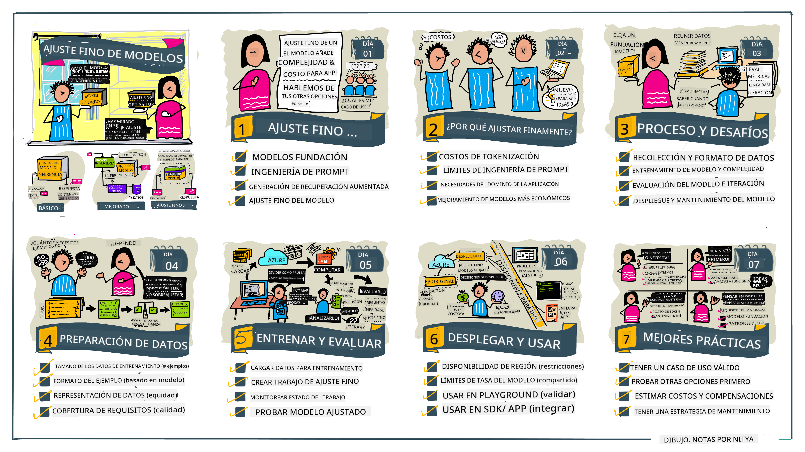

<!--
CO_OP_TRANSLATOR_METADATA:
{
  "original_hash": "68664f7e754a892ae1d8d5e2b7bd2081",
  "translation_date": "2025-05-20T07:34:56+00:00",
  "source_file": "18-fine-tuning/README.md",
  "language_code": "es"
}
-->

# Ajuste Fino de tu LLM

Usar modelos de lenguaje grandes para construir aplicaciones de IA generativa presenta nuevos desafíos. Un problema clave es asegurar la calidad de las respuestas (precisión y relevancia) en el contenido generado por el modelo para una solicitud específica del usuario. En lecciones anteriores, discutimos técnicas como la ingeniería de prompts y la generación aumentada por recuperación que intentan resolver el problema _modificando la entrada del prompt_ al modelo existente.

En la lección de hoy, discutimos una tercera técnica, **ajuste fino**, que intenta abordar el desafío _reentrenando el modelo mismo_ con datos adicionales. Vamos a sumergirnos en los detalles.

## Objetivos de Aprendizaje

Esta lección introduce el concepto de ajuste fino para modelos de lenguaje preentrenados, explora los beneficios y desafíos de este enfoque, y ofrece orientación sobre cuándo y cómo usar el ajuste fino para mejorar el rendimiento de tus modelos de IA generativa.

Al final de esta lección, deberías poder responder las siguientes preguntas:

- ¿Qué es el ajuste fino para modelos de lenguaje?
- ¿Cuándo y por qué es útil el ajuste fino?
- ¿Cómo puedo ajustar finamente un modelo preentrenado?
- ¿Cuáles son las limitaciones del ajuste fino?

¿Listo? Vamos a comenzar.

## Guía Ilustrada

¿Quieres tener una visión general de lo que cubriremos antes de profundizar? Echa un vistazo a esta guía ilustrada que describe el viaje de aprendizaje para esta lección, desde aprender los conceptos básicos y la motivación para el ajuste fino, hasta entender el proceso y las mejores prácticas para ejecutar la tarea de ajuste fino. Este es un tema fascinante para explorar, así que no olvides visitar la página de [Recursos](./RESOURCES.md?WT.mc_id=academic-105485-koreyst) para enlaces adicionales que apoyen tu viaje de aprendizaje autodirigido.

## ¿Qué es el ajuste fino para modelos de lenguaje?

Por definición, los modelos de lenguaje grandes están _preentrenados_ en grandes cantidades de texto provenientes de diversas fuentes, incluyendo internet. Como hemos aprendido en lecciones anteriores, necesitamos técnicas como _ingeniería de prompts_ y _generación aumentada por recuperación_ para mejorar la calidad de las respuestas del modelo a las preguntas del usuario ("prompts").

Una técnica popular de ingeniería de prompts implica darle al modelo más orientación sobre lo que se espera en la respuesta, ya sea proporcionando _instrucciones_ (orientación explícita) o _dándole algunos ejemplos_ (orientación implícita). Esto se conoce como _aprendizaje de pocos ejemplos_, pero tiene dos limitaciones:

- Los límites de tokens del modelo pueden restringir el número de ejemplos que puedes dar y limitar la efectividad.
- Los costos de tokens del modelo pueden hacer que sea caro añadir ejemplos a cada prompt y limitar la flexibilidad.

El ajuste fino es una práctica común en los sistemas de aprendizaje automático donde tomamos un modelo preentrenado y lo reentrenamos con nuevos datos para mejorar su rendimiento en una tarea específica. En el contexto de los modelos de lenguaje, podemos ajustar finamente el modelo preentrenado _con un conjunto de ejemplos curados para una tarea o dominio de aplicación específico_ para crear un **modelo personalizado** que puede ser más preciso y relevante para esa tarea o dominio específico. Un beneficio adicional del ajuste fino es que también puede reducir el número de ejemplos necesarios para el aprendizaje de pocos ejemplos, reduciendo el uso de tokens y los costos relacionados.

## ¿Cuándo y por qué deberíamos ajustar finamente los modelos?

En _este_ contexto, cuando hablamos de ajuste fino, nos referimos al ajuste fino **supervisado** donde el reentrenamiento se realiza **añadiendo nuevos datos** que no formaban parte del conjunto de datos de entrenamiento original. Esto es diferente de un enfoque de ajuste fino no supervisado donde el modelo se reentrena en los datos originales, pero con diferentes hiperparámetros.

Lo clave a recordar es que el ajuste fino es una técnica avanzada que requiere cierto nivel de experiencia para obtener los resultados deseados. Si se hace incorrectamente, puede que no proporcione las mejoras esperadas, e incluso puede degradar el rendimiento del modelo para tu dominio objetivo.

Entonces, antes de aprender "cómo" ajustar finamente los modelos de lenguaje, necesitas saber "por qué" deberías tomar esta ruta y "cuándo" comenzar el proceso de ajuste fino. Comienza preguntándote estas preguntas:

- **Caso de Uso**: ¿Cuál es tu _caso de uso_ para el ajuste fino? ¿Qué aspecto del modelo preentrenado actual quieres mejorar?
- **Alternativas**: ¿Has intentado _otras técnicas_ para lograr los resultados deseados? Úsalas para crear una línea base para la comparación.
  - Ingeniería de prompts: Intenta técnicas como el uso de pocos ejemplos con ejemplos de respuestas de prompts relevantes. Evalúa la calidad de las respuestas.
  - Generación Aumentada por Recuperación: Intenta aumentar los prompts con resultados de consulta recuperados al buscar en tus datos. Evalúa la calidad de las respuestas.
- **Costos**: ¿Has identificado los costos para el ajuste fino?
  - Ajustabilidad: ¿Está disponible el modelo preentrenado para ajuste fino?
  - Esfuerzo: para preparar datos de entrenamiento, evaluar y refinar el modelo.
  - Computación: para ejecutar trabajos de ajuste fino y desplegar el modelo ajustado.
  - Datos: acceso a ejemplos de calidad suficiente para el impacto del ajuste fino.
- **Beneficios**: ¿Has confirmado los beneficios del ajuste fino?
  - Calidad: ¿el modelo ajustado superó la línea base?
  - Costo: ¿reduce el uso de tokens simplificando los prompts?
  - Extensibilidad: ¿puedes reutilizar el modelo base para nuevos dominios?

Al responder estas preguntas, deberías poder decidir si el ajuste fino es el enfoque correcto para tu caso de uso. Idealmente, el enfoque es válido solo si los beneficios superan los costos. Una vez que decidas proceder, es hora de pensar en _cómo_ puedes ajustar finamente el modelo preentrenado.

¿Quieres obtener más información sobre el proceso de toma de decisiones? Mira [Ajustar finamente o no ajustar finamente](https://www.youtube.com/watch?v=0Jo-z-MFxJs)

## ¿Cómo podemos ajustar finamente un modelo preentrenado?

Para ajustar finamente un modelo preentrenado, necesitas tener:

- un modelo preentrenado para ajustar
- un conjunto de datos para usar en el ajuste fino
- un entorno de entrenamiento para ejecutar el trabajo de ajuste fino
- un entorno de alojamiento para desplegar el modelo ajustado

## Ajuste Fino en Acción

Los siguientes recursos proporcionan tutoriales paso a paso para guiarte a través de un ejemplo real usando un modelo seleccionado con un conjunto de datos curado. Para trabajar en estos tutoriales, necesitas una cuenta en el proveedor específico, junto con acceso al modelo y conjuntos de datos relevantes.

| Proveedor    | Tutorial                                                                                                                                                                       | Descripción                                                                                                                                                                                                                                                                                                                                                                                                                        |
| ------------ | ------------------------------------------------------------------------------------------------------------------------------------------------------------------------------ | ---------------------------------------------------------------------------------------------------------------------------------------------------------------------------------------------------------------------------------------------------------------------------------------------------------------------------------------------------------------------------------------------------------------------------------- |
| OpenAI       | [Cómo ajustar finamente modelos de chat](https://github.com/openai/openai-cookbook/blob/main/examples/How_to_finetune_chat_models.ipynb?WT.mc_id=academic-105485-koreyst)       | Aprende a ajustar finamente un `gpt-35-turbo` para un dominio específico ("asistente de recetas") preparando datos de entrenamiento, ejecutando el trabajo de ajuste fino y usando el modelo ajustado para inferencia.                                                                                                                                                                                                                                              |
| Azure OpenAI | [Tutorial de ajuste fino de GPT 3.5 Turbo](https://learn.microsoft.com/azure/ai-services/openai/tutorials/fine-tune?tabs=python-new%2Ccommand-line?WT.mc_id=academic-105485-koreyst) | Aprende a ajustar finamente un modelo `gpt-35-turbo-0613` **en Azure** tomando pasos para crear y subir datos de entrenamiento, ejecutar el trabajo de ajuste fino. Despliega y usa el nuevo modelo.                                                                                                                                                                                                                                                                 |
| Hugging Face | [Ajuste fino de LLMs con Hugging Face](https://www.philschmid.de/fine-tune-llms-in-2024-with-trl?WT.mc_id=academic-105485-koreyst)                                              | Esta publicación de blog te guía en el ajuste fino de un _LLM abierto_ (ej: `CodeLlama 7B`) usando la biblioteca [transformers](https://huggingface.co/docs/transformers/index?WT.mc_id=academic-105485-koreyst) y [Transformer Reinforcement Learning (TRL)](https://huggingface.co/docs/trl/index?WT.mc_id=academic-105485-koreyst]) con conjuntos de datos abiertos en [datasets](https://huggingface.co/docs/datasets/index?WT.mc_id=academic-105485-koreyst) en Hugging Face. |
|              |                                                                                                                                                                                |                                                                                                                                                                                                                                                                                                                                                                                                                                    |
| 🤗 AutoTrain | [Ajuste fino de LLMs con AutoTrain](https://github.com/huggingface/autotrain-advanced/?WT.mc_id=academic-105485-koreyst)                                                       | AutoTrain (o AutoTrain Advanced) es una biblioteca de Python desarrollada por Hugging Face que permite el ajuste fino para muchas tareas diferentes, incluyendo el ajuste fino de LLM. AutoTrain es una solución sin código y el ajuste fino puede realizarse en tu propia nube, en Hugging Face Spaces o localmente. Soporta tanto una interfaz gráfica web, CLI y entrenamiento mediante archivos de configuración yaml.                                                                               |
|              |                                                                                                                                                                                |                                                                                                                                                                                                                                                                                                                                                                                                                                    |

## Tarea

Selecciona uno de los tutoriales anteriores y recórrelos. _Podemos replicar una versión de estos tutoriales en Jupyter Notebooks en este repositorio solo para referencia. Por favor, utiliza las fuentes originales directamente para obtener las versiones más recientes_.

## ¡Buen Trabajo! Continúa Tu Aprendizaje.

Después de completar esta lección, visita nuestra [colección de Aprendizaje de IA Generativa](https://aka.ms/genai-collection?WT.mc_id=academic-105485-koreyst) para seguir mejorando tu conocimiento de IA Generativa.

¡Felicidades! Has completado la última lección de la serie v2 de este curso. No dejes de aprender y construir. **Consulta la página de [RECURSOS](RESOURCES.md?WT.mc_id=academic-105485-koreyst) para una lista de sugerencias adicionales solo para este tema.

Nuestra serie de lecciones v1 también ha sido actualizada con más tareas y conceptos. Así que tómate un minuto para refrescar tu conocimiento, y por favor [comparte tus preguntas y comentarios](https://github.com/microsoft/generative-ai-for-beginners/issues?WT.mc_id=academic-105485-koreyst) para ayudarnos a mejorar estas lecciones para la comunidad.

**Descargo de responsabilidad**:  
Este documento ha sido traducido utilizando el servicio de traducción automática [Co-op Translator](https://github.com/Azure/co-op-translator). Aunque nos esforzamos por lograr precisión, tenga en cuenta que las traducciones automáticas pueden contener errores o imprecisiones. El documento original en su idioma nativo debe considerarse la fuente autorizada. Para información crítica, se recomienda una traducción humana profesional. No nos hacemos responsables de malentendidos o interpretaciones erróneas que surjan del uso de esta traducción.