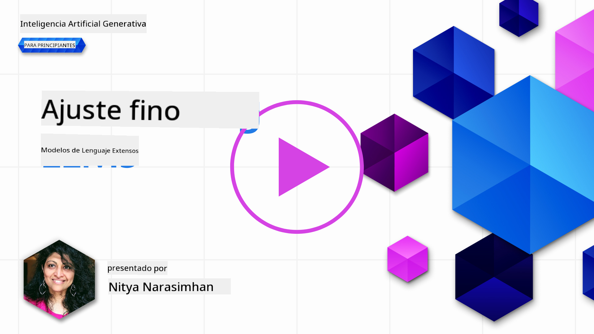
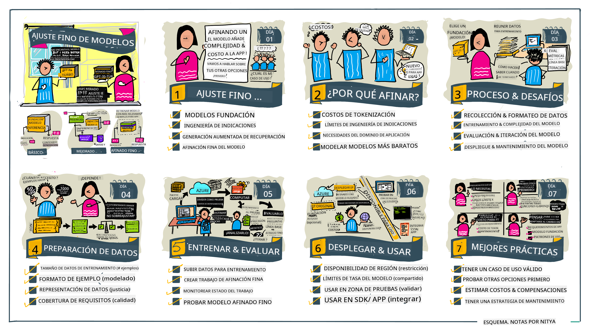

<!--
CO_OP_TRANSLATOR_METADATA:
{
  "original_hash": "68664f7e754a892ae1d8d5e2b7bd2081",
  "translation_date": "2025-07-09T17:34:37+00:00",
  "source_file": "18-fine-tuning/README.md",
  "language_code": "es"
}
-->

# Ajuste fino de tu LLM

Usar grandes modelos de lenguaje para construir aplicaciones de IA generativa trae nuevos desafíos. Un problema clave es asegurar la calidad de las respuestas (precisión y relevancia) en el contenido generado por el modelo para una solicitud específica del usuario. En lecciones anteriores, discutimos técnicas como la ingeniería de prompts y la generación aumentada por recuperación, que intentan resolver el problema _modificando la entrada del prompt_ al modelo existente.

En la lección de hoy, hablaremos de una tercera técnica, el **ajuste fino**, que busca abordar el desafío _reentrenando el modelo mismo_ con datos adicionales. Vamos a profundizar en los detalles.

## Objetivos de aprendizaje

Esta lección introduce el concepto de ajuste fino para modelos de lenguaje preentrenados, explora los beneficios y desafíos de este enfoque, y ofrece orientación sobre cuándo y cómo usar el ajuste fino para mejorar el rendimiento de tus modelos de IA generativa.

Al final de esta lección, deberías poder responder las siguientes preguntas:

- ¿Qué es el ajuste fino para modelos de lenguaje?
- ¿Cuándo y por qué es útil el ajuste fino?
- ¿Cómo puedo ajustar finamente un modelo preentrenado?
- ¿Cuáles son las limitaciones del ajuste fino?

¿Listo? Comencemos.

## Guía ilustrada

¿Quieres tener una visión general de lo que cubriremos antes de profundizar? Consulta esta guía ilustrada que describe el recorrido de aprendizaje para esta lección, desde entender los conceptos clave y la motivación para el ajuste fino, hasta comprender el proceso y las mejores prácticas para ejecutar la tarea de ajuste fino. Es un tema fascinante para explorar, así que no olvides visitar la página de [Recursos](./RESOURCES.md?WT.mc_id=academic-105485-koreyst) para enlaces adicionales que apoyen tu aprendizaje autodirigido.

## ¿Qué es el ajuste fino para modelos de lenguaje?

Por definición, los grandes modelos de lenguaje están _preentrenados_ con grandes cantidades de texto provenientes de diversas fuentes, incluyendo internet. Como aprendimos en lecciones anteriores, necesitamos técnicas como la _ingeniería de prompts_ y la _generación aumentada por recuperación_ para mejorar la calidad de las respuestas del modelo a las preguntas del usuario ("prompts").

Una técnica popular de ingeniería de prompts consiste en darle al modelo más orientación sobre lo que se espera en la respuesta, ya sea proporcionando _instrucciones_ (guía explícita) o _dándole algunos ejemplos_ (guía implícita). Esto se conoce como _aprendizaje con pocos ejemplos_ (few-shot learning), pero tiene dos limitaciones:

- Los límites de tokens del modelo pueden restringir la cantidad de ejemplos que puedes dar y limitar la efectividad.
- Los costos de tokens del modelo pueden hacer que sea caro añadir ejemplos a cada prompt y limitar la flexibilidad.

El ajuste fino es una práctica común en sistemas de aprendizaje automático donde tomamos un modelo preentrenado y lo reentrenamos con datos nuevos para mejorar su rendimiento en una tarea específica. En el contexto de modelos de lenguaje, podemos ajustar finamente el modelo preentrenado _con un conjunto curado de ejemplos para una tarea o dominio de aplicación específico_ para crear un **modelo personalizado** que puede ser más preciso y relevante para esa tarea o dominio. Un beneficio adicional del ajuste fino es que también puede reducir la cantidad de ejemplos necesarios para el aprendizaje con pocos ejemplos, disminuyendo el uso de tokens y los costos relacionados.

## ¿Cuándo y por qué deberíamos ajustar finamente los modelos?

En _este_ contexto, cuando hablamos de ajuste fino, nos referimos al ajuste fino **supervisado**, donde el reentrenamiento se realiza **añadiendo nuevos datos** que no formaban parte del conjunto de entrenamiento original. Esto es diferente de un enfoque de ajuste fino no supervisado, donde el modelo se reentrena con los datos originales, pero con diferentes hiperparámetros.

Lo importante a recordar es que el ajuste fino es una técnica avanzada que requiere cierto nivel de experiencia para obtener los resultados deseados. Si se hace incorrectamente, puede no proporcionar las mejoras esperadas e incluso degradar el rendimiento del modelo para el dominio objetivo.

Por eso, antes de aprender "cómo" ajustar finamente modelos de lenguaje, necesitas saber "por qué" deberías tomar esta ruta y "cuándo" comenzar el proceso de ajuste fino. Comienza haciéndote estas preguntas:

- **Caso de uso**: ¿Cuál es tu _caso de uso_ para el ajuste fino? ¿Qué aspecto del modelo preentrenado actual quieres mejorar?
- **Alternativas**: ¿Has probado _otras técnicas_ para lograr los resultados deseados? Úsalas para crear una línea base de comparación.
  - Ingeniería de prompts: Prueba técnicas como few-shot prompting con ejemplos de respuestas relevantes. Evalúa la calidad de las respuestas.
  - Generación aumentada por recuperación: Prueba a aumentar los prompts con resultados de consultas recuperadas buscando en tus datos. Evalúa la calidad de las respuestas.
- **Costos**: ¿Has identificado los costos del ajuste fino?
  - Ajustabilidad: ¿El modelo preentrenado está disponible para ajuste fino?
  - Esfuerzo: Para preparar los datos de entrenamiento, evaluar y refinar el modelo.
  - Computación: Para ejecutar los trabajos de ajuste fino y desplegar el modelo ajustado.
  - Datos: Acceso a ejemplos de calidad suficiente para que el ajuste fino tenga impacto.
- **Beneficios**: ¿Has confirmado los beneficios del ajuste fino?
  - Calidad: ¿El modelo ajustado superó la línea base?
  - Costo: ¿Reduce el uso de tokens al simplificar los prompts?
  - Extensibilidad: ¿Puedes reutilizar el modelo base para nuevos dominios?

Al responder estas preguntas, deberías poder decidir si el ajuste fino es el enfoque adecuado para tu caso de uso. Idealmente, el enfoque es válido solo si los beneficios superan los costos. Una vez que decidas continuar, es momento de pensar en _cómo_ puedes ajustar finamente el modelo preentrenado.

¿Quieres más información sobre el proceso de toma de decisiones? Mira [To fine-tune or not to fine-tune](https://www.youtube.com/watch?v=0Jo-z-MFxJs)

## ¿Cómo podemos ajustar finamente un modelo preentrenado?

Para ajustar finamente un modelo preentrenado, necesitas tener:

- un modelo preentrenado para ajustar
- un conjunto de datos para usar en el ajuste fino
- un entorno de entrenamiento para ejecutar el trabajo de ajuste fino
- un entorno de hospedaje para desplegar el modelo ajustado

## Ajuste fino en acción

Los siguientes recursos ofrecen tutoriales paso a paso para guiarte a través de un ejemplo real usando un modelo seleccionado con un conjunto de datos curado. Para trabajar con estos tutoriales, necesitas una cuenta en el proveedor específico, junto con acceso al modelo y conjuntos de datos relevantes.

| Proveedor    | Tutorial                                                                                                                                                                      | Descripción                                                                                                                                                                                                                                                                                                                                                                                                                       |
| ------------ | ----------------------------------------------------------------------------------------------------------------------------------------------------------------------------- | --------------------------------------------------------------------------------------------------------------------------------------------------------------------------------------------------------------------------------------------------------------------------------------------------------------------------------------------------------------------------------------------------------------------------------- |
| OpenAI       | [Cómo ajustar finamente modelos de chat](https://github.com/openai/openai-cookbook/blob/main/examples/How_to_finetune_chat_models.ipynb?WT.mc_id=academic-105485-koreyst)     | Aprende a ajustar finamente un `gpt-35-turbo` para un dominio específico ("asistente de recetas") preparando datos de entrenamiento, ejecutando el trabajo de ajuste fino y usando el modelo ajustado para inferencia.                                                                                                                                                                                                              |
| Azure OpenAI | [Tutorial de ajuste fino GPT 3.5 Turbo](https://learn.microsoft.com/azure/ai-services/openai/tutorials/fine-tune?tabs=python-new%2Ccommand-line?WT.mc_id=academic-105485-koreyst) | Aprende a ajustar finamente un modelo `gpt-35-turbo-0613` **en Azure** siguiendo los pasos para crear y subir datos de entrenamiento, ejecutar el trabajo de ajuste fino, desplegar y usar el nuevo modelo.                                                                                                                                                                                                                         |
| Hugging Face | [Ajuste fino de LLMs con Hugging Face](https://www.philschmid.de/fine-tune-llms-in-2024-with-trl?WT.mc_id=academic-105485-koreyst)                                            | Este artículo te guía para ajustar finamente un _LLM abierto_ (ej: `CodeLlama 7B`) usando la librería [transformers](https://huggingface.co/docs/transformers/index?WT.mc_id=academic-105485-koreyst) y [Transformer Reinforcement Learning (TRL)](https://huggingface.co/docs/trl/index?WT.mc_id=academic-105485-koreyst) con conjuntos de datos abiertos en Hugging Face.                                                                 |
|              |                                                                                                                                                                               |                                                                                                                                                                                                                                                                                                                                                                                                                                 |
| 🤗 AutoTrain | [Ajuste fino de LLMs con AutoTrain](https://github.com/huggingface/autotrain-advanced/?WT.mc_id=academic-105485-koreyst)                                                      | AutoTrain (o AutoTrain Advanced) es una librería de Python desarrollada por Hugging Face que permite el ajuste fino para muchas tareas diferentes, incluyendo ajuste fino de LLMs. AutoTrain es una solución sin código y el ajuste fino puede hacerse en tu propia nube, en Hugging Face Spaces o localmente. Soporta interfaz web, CLI y entrenamiento mediante archivos de configuración yaml.                                                                                 |
|              |                                                                                                                                                                               |                                                                                                                                                                                                                                                                                                                                                                                                                                 |

## Tarea

Selecciona uno de los tutoriales anteriores y sigue sus pasos. _Podríamos replicar una versión de estos tutoriales en Jupyter Notebooks en este repositorio solo como referencia. Por favor, usa las fuentes originales directamente para obtener las versiones más recientes_.

## ¡Buen trabajo! Continúa aprendiendo.

Después de completar esta lección, visita nuestra [colección de aprendizaje de IA generativa](https://aka.ms/genai-collection?WT.mc_id=academic-105485-koreyst) para seguir mejorando tus conocimientos en IA generativa.

¡Felicidades! Has completado la lección final de la serie v2 de este curso. No dejes de aprender y crear. \*\*Consulta la página de [RECURSOS](RESOURCES.md?WT.mc_id=academic-105485-koreyst) para una lista de sugerencias adicionales solo para este tema.

Nuestra serie v1 de lecciones también ha sido actualizada con más tareas y conceptos. Así que tómate un momento para refrescar tus conocimientos y por favor [comparte tus preguntas y comentarios](https://github.com/microsoft/generative-ai-for-beginners/issues?WT.mc_id=academic-105485-koreyst) para ayudarnos a mejorar estas lecciones para la comunidad.

**Aviso legal**:  
Este documento ha sido traducido utilizando el servicio de traducción automática [Co-op Translator](https://github.com/Azure/co-op-translator). Aunque nos esforzamos por la precisión, tenga en cuenta que las traducciones automáticas pueden contener errores o inexactitudes. El documento original en su idioma nativo debe considerarse la fuente autorizada. Para información crítica, se recomienda la traducción profesional realizada por humanos. No nos hacemos responsables de malentendidos o interpretaciones erróneas derivadas del uso de esta traducción.