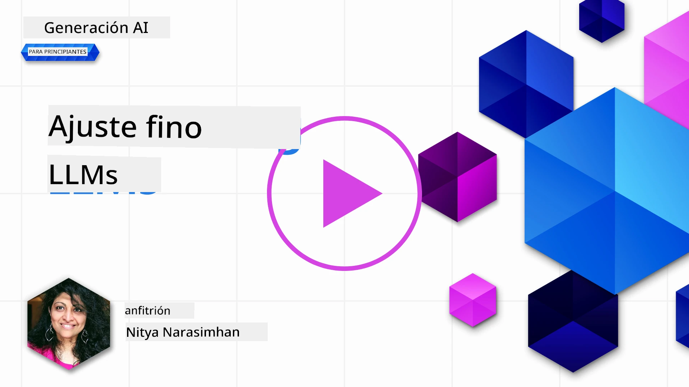
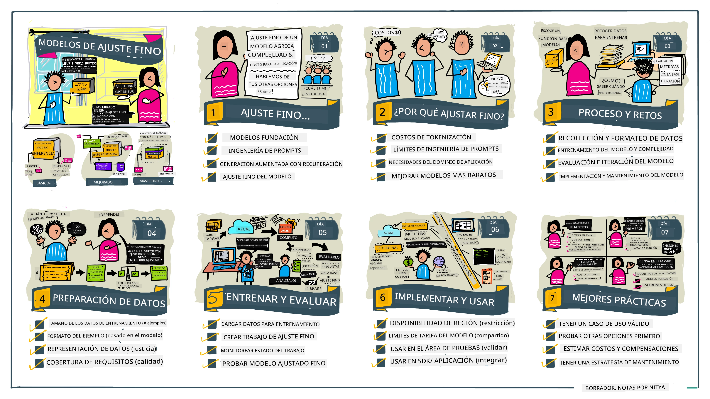

# Fine-Tuning de Tu LLM

Usar grandes modelos de lenguaje para construir aplicaciones de IA generativa implica nuevos desafíos. Un tema clave es asegurar la calidad de las respuestas (precisión y relevancia) en el contenido generado por el modelo para una solicitud dada del usuario. En lecciones anteriores, discutimos técnicas como la ingeniería de prompts y la generación aumentada por recuperación que intentan resolver el problema _modificando el prompt de entrada_ al modelo existente.

En la lección de hoy, discutimos una tercera técnica, el **fine-tuning**, que intenta abordar el desafío _reentrenando el modelo mismo_ con datos adicionales. Vamos a profundizar en los detalles.

## Objetivos de Aprendizaje

Esta lección introduce el concepto de fine-tuning para modelos de lenguaje preentrenados, explora los beneficios y desafíos de este enfoque, y brinda orientación sobre cuándo y cómo usar fine-tuning para mejorar el rendimiento de tus modelos de IA generativa.

Al final de esta lección, deberías ser capaz de responder las siguientes preguntas:

- ¿Qué es el fine-tuning para modelos de lenguaje?
- ¿Cuándo y por qué es útil el fine-tuning?
- ¿Cómo puedo hacer fine-tuning a un modelo preentrenado?
- ¿Cuáles son las limitaciones del fine-tuning?

¿Listo? Comencemos.

## Guía Ilustrada

¿Quieres tener una visión general de lo que cubriremos antes de profundizar? Consulta esta guía ilustrada que describe el recorrido de aprendizaje para esta lección - desde aprender los conceptos centrales y la motivación para el fine-tuning, hasta entender el proceso y las mejores prácticas para ejecutar la tarea de fine-tuning. Este es un tema fascinante para explorar, así que no olvides visitar la página de [Recursos](./RESOURCES.md?WT.mc_id=academic-105485-koreyst) para enlaces adicionales que apoyen tu aprendizaje autodirigido.

## ¿Qué es el fine-tuning para modelos de lenguaje?

Por definición, los grandes modelos de lenguaje están _preentrenados_ con grandes cantidades de texto provenientes de diversas fuentes, incluyendo internet. Como hemos aprendido en lecciones anteriores, necesitamos técnicas como _ingeniería de prompts_ y _generación aumentada por recuperación_ para mejorar la calidad de las respuestas del modelo a las preguntas del usuario ("prompts").

Una técnica popular de ingeniería de prompts consiste en darle al modelo más orientación sobre lo que se espera en la respuesta, ya sea proporcionando _instrucciones_ (guía explícita) o _dándole algunos ejemplos_ (guía implícita). Esto se denomina _few-shot learning_ pero tiene dos limitaciones:

- Los límites de tokens del modelo pueden restringir la cantidad de ejemplos que puedes dar y limitar la efectividad.
- Los costos de tokens del modelo pueden hacer costoso añadir ejemplos a cada prompt, limitando la flexibilidad.

El fine-tuning es una práctica común en sistemas de aprendizaje automático donde tomamos un modelo preentrenado y lo reentrenamos con datos nuevos para mejorar su desempeño en una tarea específica. En el contexto de modelos de lenguaje, podemos hacer fine-tuning al modelo preentrenado _con un conjunto seleccionado de ejemplos para una tarea o dominio de aplicación dado_ para crear un **modelo personalizado** que pueda ser más preciso y relevante para esa tarea o dominio específico. Un beneficio adicional del fine-tuning es que también puede reducir la cantidad de ejemplos necesarios para el few-shot learning, reduciendo el uso de tokens y los costos relacionados.

## ¿Cuándo y por qué deberíamos hacer fine-tuning a los modelos?

En _este_ contexto, cuando hablamos de fine-tuning nos referimos al fine-tuning **supervisado** donde el reentrenamiento se hace añadiendo **nuevos datos** que no formaban parte del conjunto de entrenamiento original. Esto es diferente de un enfoque de fine-tuning no supervisado donde el modelo se reentrena con los datos originales, pero con diferentes hiperparámetros.

Lo clave para recordar es que el fine-tuning es una técnica avanzada que requiere cierto nivel de experiencia para obtener los resultados deseados. Si se hace incorrectamente, puede que no proporcione las mejoras esperadas e incluso puede degradar el rendimiento del modelo para tu dominio objetivo.

Así que, antes de aprender "cómo" hacer fine-tuning a modelos de lenguaje, necesitas saber "por qué" deberías tomar esta ruta y "cuándo" iniciar el proceso de fine-tuning. Comienza haciéndote estas preguntas:

- **Caso de Uso**: ¿Cuál es tu _caso de uso_ para el fine-tuning? ¿Qué aspecto del modelo preentrenado actual quieres mejorar?
- **Alternativas**: ¿Has probado _otras técnicas_ para lograr los resultados deseados? Úsalas para crear una base de comparación.
  - Ingeniería de prompts: Prueba técnicas como few-shot prompting con ejemplos de respuestas relevantes. Evalúa la calidad de las respuestas.
  - Generación Aumentada por Recuperación: Prueba añadir resultados de consultas recuperadas en tus datos a los prompts. Evalúa la calidad de las respuestas.
- **Costos**: ¿Has identificado los costos del fine-tuning?
  - Afinabilidad - ¿el modelo preentrenado está disponible para hacer fine-tuning?
  - Esfuerzo - para preparar datos de entrenamiento, evaluar y refinar el modelo.
  - Computación - para ejecutar los trabajos de fine-tuning y desplegar el modelo ajustado.
  - Datos - acceso a suficientes ejemplos de calidad para que el fine-tuning tenga impacto.
- **Beneficios**: ¿Has confirmado los beneficios del fine-tuning?
  - Calidad - ¿el modelo ajustado superó el rendimiento base?
  - Costo - ¿reduce el uso de tokens simplificando los prompts?
  - Extensibilidad - ¿puedes reutilizar el modelo base para nuevos dominios?

Al responder estas preguntas, deberías poder decidir si el fine-tuning es el enfoque adecuado para tu caso de uso. Idealmente, este enfoque es válido sólo si los beneficios superan los costos. Una vez que decidas avanzar, es momento de pensar _cómo_ puedes hacer fine-tuning al modelo preentrenado.

¿Quieres más información sobre el proceso de toma de decisiones? Mira [Hacer fine-tuning o no hacer fine-tuning](https://www.youtube.com/watch?v=0Jo-z-MFxJs)

## ¿Cómo podemos hacer fine-tuning a un modelo preentrenado?

Para hacer fine-tuning a un modelo preentrenado, necesitas:

- un modelo preentrenado para ajustar
- un conjunto de datos para usar en el fine-tuning
- un entorno de entrenamiento para ejecutar el trabajo de fine-tuning
- un entorno de hospedaje para desplegar el modelo ajustado

## Fine-Tuning en Acción

Los siguientes recursos proporcionan tutoriales paso a paso para guiarte a través de un ejemplo real usando un modelo seleccionado con un conjunto de datos curado. Para trabajar con estos tutoriales, necesitas una cuenta en el proveedor específico, junto con acceso al modelo y datos relevantes.

| Proveedor     | Tutorial                                                                                                                                                                      | Descripción                                                                                                                                                                                                                                                                                                                                                                                                                        |
| ------------ | ------------------------------------------------------------------------------------------------------------------------------------------------------------------------------ | ---------------------------------------------------------------------------------------------------------------------------------------------------------------------------------------------------------------------------------------------------------------------------------------------------------------------------------------------------------------------------------------------------------------------------------- |
| OpenAI       | [Cómo hacer fine-tuning a modelos de chat](https://github.com/openai/openai-cookbook/blob/main/examples/How_to_finetune_chat_models.ipynb?WT.mc_id=academic-105485-koreyst)      | Aprende a ajustar un `gpt-35-turbo` para un dominio específico ("asistente de recetas") preparando datos de entrenamiento, ejecutando el trabajo de fine-tuning y usando el modelo ajustado para inferencia.                                                                                                                                                                                                                         |
| Azure OpenAI | [Tutorial de fine-tuning para GPT 3.5 Turbo](https://learn.microsoft.com/azure/ai-services/openai/tutorials/fine-tune?tabs=python-new%2Ccommand-line&WT.mc_id=academic-105485-koreyst) | Aprende a ajustar un modelo `gpt-35-turbo-0613` **en Azure** siguiendo los pasos para crear y subir datos de entrenamiento, ejecutar el trabajo de fine-tuning, desplegar y usar el nuevo modelo.                                                                                                                                                                                                                                  |
| Hugging Face | [Fine-tuning de LLMs con Hugging Face](https://www.philschmid.de/fine-tune-llms-in-2024-with-trl?WT.mc_id=academic-105485-koreyst)                                              | Este artículo explica cómo hacer fine-tuning a un _open LLM_ (ej: `CodeLlama 7B`) usando la biblioteca [transformers](https://huggingface.co/docs/transformers/index?WT.mc_id=academic-105485-koreyst) y [Transformer Reinforcement Learning (TRL)](https://huggingface.co/docs/trl/index?WT.mc_id=academic-105485-koreyst) con conjuntos de datos abiertos en Hugging Face.                                                                  |
|              |                                                                                                                                                                                |                                                                                                                                                                                                                                                                                                                                                                                                                                    |
| 🤗 AutoTrain | [Fine-tuning de LLMs con AutoTrain](https://github.com/huggingface/autotrain-advanced/?WT.mc_id=academic-105485-koreyst)                                                        | AutoTrain (o AutoTrain Advanced) es una biblioteca python desarrollada por Hugging Face que permite hacer fine-tuning para muchas tareas incluyendo fine-tuning de LLMs. AutoTrain es una solución sin código y el fine-tuning puede hacerse en tu propia nube, en Hugging Face Spaces o localmente. Soporta interfaz web GUI, CLI y entrenamiento mediante archivos de configuración yaml.                                           |
|              |                                                                                                                                                                                |                                                                                                                                                                                                                                                                                                                                                                                                                                    |
| 🦥 Unsloth | [Fine-tuning de LLMs con Unsloth](https://github.com/unslothai/unsloth)                                                                                                            | Unsloth es un framework de código abierto que soporta fine-tuning de LLMs y aprendizaje por refuerzo (RL). Unsloth facilita el entrenamiento, evaluación y despliegue local con [notebooks](https://github.com/unslothai/notebooks) listos para usar. También soporta modelos de texto a voz (TTS), BERT y modelos multimodales. Para comenzar, lee su guía paso a paso de [Fine-tuning LLMs Guide](https://docs.unsloth.ai/get-started/fine-tuning-llms-guide).             |
|              |                                                                                                                                                                                |                                                                                                                                                                                                                                                                                                                                                                                                                                    |
## Tarea

Selecciona uno de los tutoriales mencionados y síguelos paso a paso. _Podemos replicar una versión de estos tutoriales en Jupyter Notebooks en este repositorio solo como referencia. Por favor, usa las fuentes originales directamente para obtener las versiones más recientes_.

## ¡Gran Trabajo! Continúa Aprendiendo.

Después de completar esta lección, visita nuestra [colección de aprendizaje de IA Generativa](https://aka.ms/genai-collection?WT.mc_id=academic-105485-koreyst) para seguir mejorando tu conocimiento en IA Generativa.

¡Felicidades! Has completado la lección final de la serie v2 para este curso. No dejes de aprender y construir. \*\*Consulta la página de [RECURSOS](RESOURCES.md?WT.mc_id=academic-105485-koreyst) para una lista de sugerencias adicionales sólo sobre este tema.

Nuestra serie v1 de lecciones también ha sido actualizada con más tareas y conceptos. Así que toma un minuto para refrescar tus conocimientos - y por favor [comparte tus preguntas y comentarios](https://github.com/microsoft/generative-ai-for-beginners/issues?WT.mc_id=academic-105485-koreyst) para ayudarnos a mejorar estas lecciones para la comunidad.

---

<!-- CO-OP TRANSLATOR DISCLAIMER START -->
**Aviso Legal**:  
Este documento ha sido traducido utilizando el servicio de traducción automática [Co-op Translator](https://github.com/Azure/co-op-translator). Aunque nos esforzamos por la exactitud, tenga en cuenta que las traducciones automáticas pueden contener errores o inexactitudes. El documento original en su idioma nativo debe considerarse la fuente autorizada. Para información crítica, se recomienda una traducción profesional realizada por humanos. No nos hacemos responsables por malentendidos o interpretaciones erróneas derivadas del uso de esta traducción.
<!-- CO-OP TRANSLATOR DISCLAIMER END -->