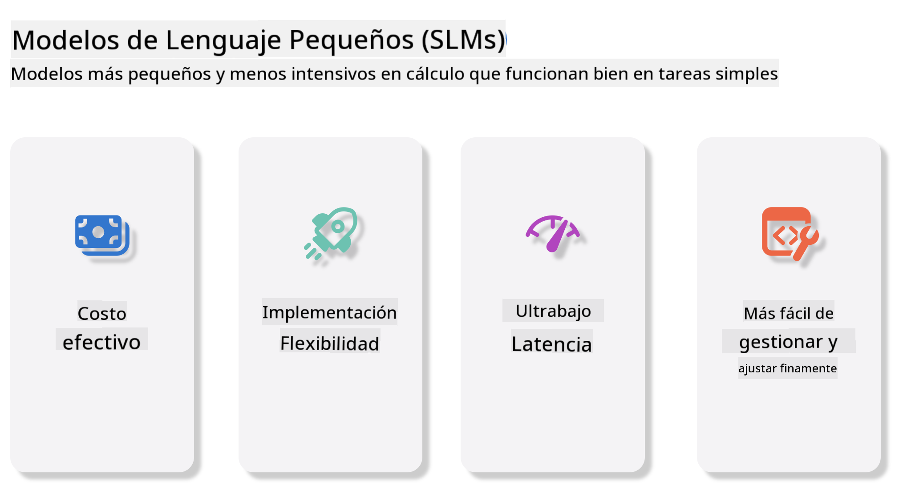
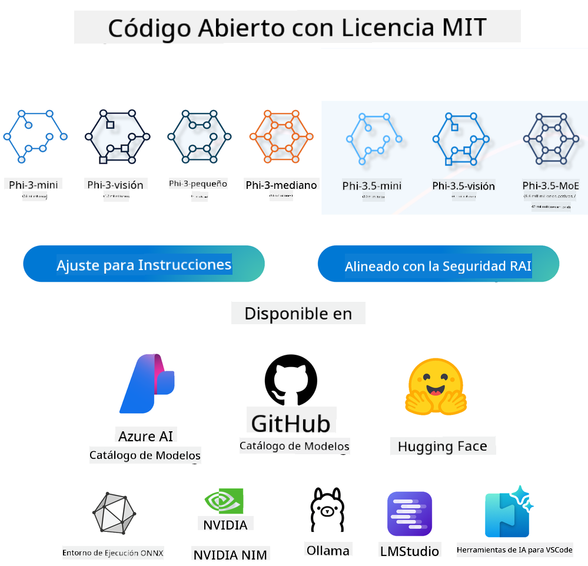

<!--
CO_OP_TRANSLATOR_METADATA:
{
  "original_hash": "124ad36cfe96f74038811b6e2bb93e9d",
  "translation_date": "2025-05-20T08:57:54+00:00",
  "source_file": "19-slm/README.md",
  "language_code": "es"
}
-->
# Introducción a los Modelos de Lenguaje Pequeños para IA Generativa para Principiantes La IA generativa es un campo fascinante de la inteligencia artificial que se centra en crear sistemas capaces de generar nuevo contenido. Este contenido puede variar desde texto e imágenes hasta música e incluso entornos virtuales completos. Una de las aplicaciones más emocionantes de la IA generativa es en el ámbito de los modelos de lenguaje. ## ¿Qué son los Modelos de Lenguaje Pequeños? Un Modelo de Lenguaje Pequeño (SLM) representa una variante reducida de un modelo de lenguaje grande (LLM), aprovechando muchos de los principios arquitectónicos y técnicas de los LLMs, mientras exhibe una huella computacional significativamente reducida. Los SLMs son un subconjunto de modelos de lenguaje diseñados para generar texto similar al humano. A diferencia de sus contrapartes más grandes, como GPT-4, los SLMs son más compactos y eficientes, lo que los hace ideales para aplicaciones donde los recursos computacionales son limitados. A pesar de su tamaño más pequeño, aún pueden realizar una variedad de tareas. Típicamente, los SLMs se construyen comprimiendo o destilando LLMs, con el objetivo de retener una porción sustancial de la funcionalidad y capacidades lingüísticas del modelo original. Esta reducción en el tamaño del modelo disminuye la complejidad general, haciendo que los SLMs sean más eficientes en términos de uso de memoria y requisitos computacionales. A pesar de estas optimizaciones, los SLMs aún pueden realizar una amplia gama de tareas de procesamiento de lenguaje natural (NLP): - Generación de Texto: Creación de oraciones o párrafos coherentes y contextualmente relevantes. - Completación de Texto: Predicción y completación de oraciones basadas en un aviso dado. - Traducción: Conversión de texto de un idioma a otro. - Resumen: Condensación de largos textos en resúmenes más cortos y digeribles. Aunque con algunas concesiones en rendimiento o profundidad de comprensión en comparación con sus contrapartes más grandes. ## ¿Cómo Funcionan los Modelos de Lenguaje Pequeños? Los SLMs se entrenan con vastas cantidades de datos de texto. Durante el entrenamiento, aprenden los patrones y estructuras del lenguaje, lo que les permite generar texto que es tanto gramaticalmente correcto como contextualmente apropiado. El proceso de entrenamiento implica: - Recolección de Datos: Reunir grandes conjuntos de datos de texto de diversas fuentes. - Preprocesamiento: Limpiar y organizar los datos para hacerlos adecuados para el entrenamiento. - Entrenamiento: Usar algoritmos de aprendizaje automático para enseñar al modelo cómo entender y generar texto. - Ajuste Fino: Ajustar el modelo para mejorar su rendimiento en tareas específicas. El desarrollo de los SLMs se alinea con la creciente necesidad de modelos que puedan ser desplegados en entornos con recursos limitados, como dispositivos móviles o plataformas de computación en el borde, donde los LLMs a gran escala pueden ser poco prácticos debido a sus demandas de recursos pesados. Al centrarse en la eficiencia, los SLMs equilibran el rendimiento con la accesibilidad, permitiendo una aplicación más amplia en diversos dominios.  ## Objetivos de Aprendizaje En esta lección, esperamos introducir el conocimiento de SLM y combinarlo con Microsoft Phi-3 para aprender diferentes escenarios en contenido de texto, visión y MoE. Al final de esta lección, deberías poder responder las siguientes preguntas: - ¿Qué es SLM? - ¿Cuál es la diferencia entre SLM y LLM? - ¿Qué es la Familia Microsoft Phi-3/3.5? - ¿Cómo inferir la Familia Microsoft Phi-3/3.5? ¿Listo? Vamos a comenzar. ## Las Distinciones entre Modelos de Lenguaje Grandes (LLMs) y Modelos de Lenguaje Pequeños (SLMs) Tanto los LLMs como los SLMs se construyen sobre principios fundamentales del aprendizaje automático probabilístico, siguiendo enfoques similares en su diseño arquitectónico, metodologías de entrenamiento, procesos de generación de datos y técnicas de evaluación de modelos. Sin embargo, varios factores clave diferencian estos dos tipos de modelos. ## Aplicaciones de los Modelos de Lenguaje Pequeños Los SLMs tienen una amplia gama de aplicaciones, incluyendo: - Chatbots: Proporcionar soporte al cliente e interactuar con los usuarios de manera conversacional. - Creación de Contenido: Asistir a escritores generando ideas o incluso redactando artículos completos. - Educación: Ayudar a los estudiantes con tareas de escritura o aprender nuevos idiomas. - Accesibilidad: Crear herramientas para personas con discapacidades, como sistemas de texto a voz. **Tamaño** Una distinción principal entre LLMs y SLMs radica en la escala de los modelos. Los LLMs, como ChatGPT (GPT-4), pueden comprender aproximadamente 1.76 billones de parámetros, mientras que los SLMs de código abierto como Mistral 7B están diseñados con significativamente menos parámetros—aproximadamente 7 mil millones. Esta disparidad se debe principalmente a diferencias en la arquitectura del modelo y los procesos de entrenamiento. Por ejemplo, ChatGPT emplea un mecanismo de atención automática dentro de un marco de codificador-decodificador, mientras que Mistral 7B utiliza atención de ventana deslizante, lo que permite un entrenamiento más eficiente dentro de un modelo solo decodificador. Esta variación arquitectónica tiene profundas implicaciones para la complejidad y el rendimiento de estos modelos. **Comprensión** Los SLMs están típicamente optimizados para el rendimiento dentro de dominios específicos, haciéndolos altamente especializados pero potencialmente limitados en su capacidad para proporcionar una comprensión contextual amplia a través de múltiples campos de conocimiento. En contraste, los LLMs buscan simular inteligencia similar a la humana en un nivel más comprensivo. Entrenados en conjuntos de datos vastos y diversos, los LLMs están diseñados para desempeñarse bien en una variedad de dominios, ofreciendo mayor versatilidad y adaptabilidad. Consecuentemente, los LLMs son más adecuados para una amplia gama de tareas descendentes, como procesamiento de lenguaje natural y programación. **Computación** El entrenamiento y despliegue de LLMs son procesos intensivos en recursos, a menudo requiriendo infraestructura computacional significativa, incluyendo clusters de GPU a gran escala. Por ejemplo, entrenar un modelo como ChatGPT desde cero puede necesitar miles de GPUs durante períodos prolongados. En contraste, los SLMs, con sus menores conteos de parámetros, son más accesibles en términos de recursos computacionales. Modelos como Mistral 7B pueden ser entrenados y ejecutados en máquinas locales equipadas con capacidades de GPU moderadas, aunque el entrenamiento todavía demanda varias horas a través de múltiples GPUs. **Sesgo** El sesgo es un problema conocido en los LLMs, principalmente debido a la naturaleza de los datos de entrenamiento. Estos modelos a menudo dependen de datos crudos, disponibles abiertamente en internet, que pueden subrepresentar o malrepresentar ciertos grupos, introducir etiquetado erróneo, o reflejar sesgos lingüísticos influenciados por dialecto, variaciones geográficas, y reglas gramaticales. Además, la complejidad de las arquitecturas de LLM puede exacerbar inadvertidamente el sesgo, que puede pasar desapercibido sin un ajuste fino cuidadoso. Por otro lado, los SLMs, al ser entrenados en conjuntos de datos más restringidos y específicos de dominio, son inherentemente menos susceptibles a tales sesgos, aunque no son inmunes a ellos. **Inferencia** El tamaño reducido de los SLMs les otorga una ventaja significativa en términos de velocidad de inferencia, permitiéndoles generar salidas eficientemente en hardware local sin la necesidad de procesamiento paralelo extensivo. En contraste, los LLMs, debido a su tamaño y complejidad, a menudo requieren recursos computacionales paralelos sustanciales para lograr tiempos de inferencia aceptables. La presencia de múltiples usuarios concurrentes ralentiza aún más los tiempos de respuesta de los LLMs, especialmente cuando se despliegan a escala. En resumen, aunque tanto los LLMs como los SLMs comparten una base fundamental en el aprendizaje automático, difieren significativamente en términos de tamaño del modelo, requisitos de recursos, comprensión contextual, susceptibilidad al sesgo, y velocidad de inferencia. Estas distinciones reflejan su idoneidad respectiva para diferentes casos de uso, con los LLMs siendo más versátiles pero intensivos en recursos, y los SLMs ofreciendo más eficiencia específica de dominio con demandas computacionales reducidas. ***Nota: En este capítulo, presentaremos SLM usando Microsoft Phi-3 / 3.5 como ejemplo.*** ## Introducción a la Familia Phi-3 / Phi-3.5 La Familia Phi-3 / 3.5 se centra principalmente en escenarios de aplicación de texto, visión y Agente (MoE): ### Phi-3 / 3.5 Instruct Principalmente para generación de texto, completación de chat, y extracción de información de contenido, etc. **Phi-3-mini** El modelo de lenguaje de 3.8B está disponible en Microsoft Azure AI Studio, Hugging Face, y Ollama. Los modelos Phi-3 superan significativamente a los modelos de lenguaje de tamaños iguales y mayores en los principales puntos de referencia (ver números de referencia a continuación, números más altos son mejores). Phi-3-mini supera a modelos de el doble de su tamaño, mientras que Phi-3-small y Phi-3-medium superan a modelos más grandes, incluyendo GPT-3.5 **Phi-3-small & medium** Con solo 7B parámetros, Phi-3-small supera a GPT-3.5T en una variedad de puntos de referencia de lenguaje, razonamiento, codificación, y matemáticas. El Phi-3-medium con 14B parámetros continúa esta tendencia y supera al Gemini 1.0 Pro. **Phi-3.5-mini** Podemos pensar en él como una actualización de Phi-3-mini. Mientras que los parámetros permanecen sin cambios, mejora la capacidad de soportar múltiples idiomas (Soporta 20+ idiomas: Árabe, Chino, Checo, Danés, Holandés, Inglés, Finlandés, Francés, Alemán, Hebreo, Húngaro, Italiano, Japonés, Coreano, Noruego, Polaco, Portugués, Ruso, Español, Sueco, Tailandés, Turco, Ucraniano) y añade un soporte más fuerte para contextos largos. Phi-3.5-mini con 3.8B parámetros supera a los modelos de lenguaje del mismo tamaño y está a la par con modelos de el doble de su tamaño. ### Phi-3 / 3.5 Visión Podemos pensar en el modelo Instruct de Phi-3/3.5 como la capacidad de Phi para entender, y Visión es lo que le da ojos a Phi para entender el mundo. **Phi-3-Vision** Phi-3-vision, con solo 4.2B parámetros, continúa esta tendencia y supera a modelos más grandes como Claude-3 Haiku y Gemini 1.0 Pro V en tareas generales de razonamiento visual, OCR, y comprensión de tablas y diagramas. **Phi-3.5-Vision** Phi-3.5-Vision también es una actualización de Phi-3-Vision, añadiendo soporte para múltiples imágenes. Puedes pensar en ello como una mejora en visión, no solo puede ver imágenes, sino también videos. Phi-3.5-vision supera a modelos más grandes como Claude-3.5 Sonnet y Gemini 1.5 Flash en tareas de comprensión de OCR, tablas y gráficos y está a la par en tareas generales de razonamiento de conocimiento visual. Soporta entrada de múltiples cuadros, es decir, realiza razonamiento en múltiples imágenes de entrada. ### Phi-3.5-MoE ***Mixture of Experts(MoE)*** permite que los modelos sean preentrenados con mucho menos cómputo, lo que significa que puedes escalar dramáticamente el tamaño del modelo o conjunto de datos con el mismo presupuesto de cómputo que un modelo denso. En particular, un modelo MoE debería lograr la misma calidad que su contraparte densa mucho más rápido durante el preentrenamiento. Phi-3.5-MoE comprende 16x3.8B módulos expertos. Phi-3.5-MoE con solo 6.6B parámetros activos logra un nivel similar de razonamiento, comprensión de lenguaje, y matemáticas como modelos mucho más grandes Podemos usar el modelo de la Familia Phi-3/3.5 basado en diferentes escenarios. A diferencia de LLM, puedes desplegar Phi-3/3.5-mini o Phi-3/3.5-Vision en dispositivos de borde. ## Cómo usar los modelos de la Familia Phi-3/3.5 Esperamos usar Phi-3/3.5 en diferentes escenarios. A continuación, usaremos Phi-3/3.5 basado en diferentes escenarios.  ### Diferencia de inferencia API de la nube **Modelos de GitHub** GitHub
Los modelos son la forma más directa. Puedes acceder rápidamente al modelo Phi-3/3.5-Instruct a través de GitHub Models. Combinado con el Azure AI Inference SDK / OpenAI SDK, puedes acceder a la API a través del código para completar la llamada Phi-3/3.5-Instruct. También puedes probar diferentes efectos a través de Playground. - Demo: Comparación de los efectos de Phi-3-mini y Phi-3.5-mini en escenarios chinos   **Azure AI Studio** O si queremos usar los modelos de visión y MoE, puedes usar Azure AI Studio para completar la llamada. Si estás interesado, puedes leer el Phi-3 Cookbook para aprender cómo llamar a Phi-3/3.5 Instruct, Vision, MoE a través de Azure AI Studio [Haz clic en este enlace](https://github.com/microsoft/Phi-3CookBook/blob/main/md/02.QuickStart/AzureAIStudio_QuickStart.md?WT.mc_id=academic-105485-koreyst) **NVIDIA NIM** Además de las soluciones de Model Catalog basadas en la nube proporcionadas por Azure y GitHub, también puedes usar [Nivida NIM](https://developer.nvidia.com/nim?WT.mc_id=academic-105485-koreyst) para completar las llamadas relacionadas. Puedes visitar NIVIDA NIM para completar las llamadas a la API de la familia Phi-3/3.5. NVIDIA NIM (NVIDIA Inference Microservices) es un conjunto de microservicios de inferencia acelerada diseñados para ayudar a los desarrolladores a desplegar modelos de IA de manera eficiente en varios entornos, incluidos nubes, centros de datos y estaciones de trabajo. Aquí hay algunas características clave de NVIDIA NIM: - **Facilidad de Despliegue:** NIM permite el despliegue de modelos de IA con un solo comando, lo que facilita su integración en flujos de trabajo existentes. - **Rendimiento Optimizado:** Aprovecha los motores de inferencia preoptimizados de NVIDIA, como TensorRT y TensorRT-LLM, para garantizar baja latencia y alto rendimiento. - **Escalabilidad:** NIM admite escalado automático en Kubernetes, lo que le permite manejar cargas de trabajo variables de manera efectiva. - **Seguridad y Control:** Las organizaciones pueden mantener el control sobre sus datos y aplicaciones al alojar los microservicios de NIM en su propia infraestructura gestionada. - **APIs Estándar:** NIM proporciona APIs estándar de la industria, lo que facilita la construcción e integración de aplicaciones de IA como chatbots, asistentes de IA y más. NIM es parte de NVIDIA AI Enterprise, que busca simplificar el despliegue y la operacionalización de modelos de IA, asegurando que funcionen eficientemente en GPUs de NVIDIA. - Demo: Usando Nividia NIM para llamar a Phi-3.5-Vision-API [[Haz clic en este enlace](../../../19-slm/python/Phi-3-Vision-Nividia-NIM.ipynb)] ### Inferencia Phi-3/3.5 en entorno local La inferencia en relación con Phi-3, o cualquier modelo de lenguaje como GPT-3, se refiere al proceso de generar respuestas o predicciones basadas en la entrada que recibe. Cuando proporcionas un mensaje o pregunta a Phi-3, utiliza su red neuronal entrenada para inferir la respuesta más probable y relevante al analizar patrones y relaciones en los datos en los que fue entrenado. **Hugging Face Transformer** Hugging Face Transformers es una poderosa biblioteca diseñada para el procesamiento de lenguaje natural (NLP) y otras tareas de aprendizaje automático. Aquí hay algunos puntos clave sobre ella: 1. **Modelos Preentrenados**: Proporciona miles de modelos preentrenados que pueden usarse para diversas tareas como clasificación de texto, reconocimiento de entidades nombradas, respuesta a preguntas, resumen, traducción y generación de texto. 2. **Interoperabilidad de Marcos**: La biblioteca admite múltiples marcos de aprendizaje profundo, incluidos PyTorch, TensorFlow y JAX. Esto te permite entrenar un modelo en un marco y usarlo en otro. 3. **Capacidades Multimodales**: Además de NLP, Hugging Face Transformers también admite tareas en visión por computadora (por ejemplo, clasificación de imágenes, detección de objetos) y procesamiento de audio (por ejemplo, reconocimiento de voz, clasificación de audio). 4. **Facilidad de Uso**: La biblioteca ofrece APIs y herramientas para descargar y ajustar modelos fácilmente, haciéndola accesible tanto para principiantes como para expertos. 5. **Comunidad y Recursos**: Hugging Face tiene una comunidad vibrante y documentación extensa, tutoriales y guías para ayudar a los usuarios a comenzar y aprovechar al máximo la biblioteca. [documentación oficial](https://huggingface.co/docs/transformers/index?WT.mc_id=academic-105485-koreyst) o su [repositorio de GitHub](https://github.com/huggingface/transformers?WT.mc_id=academic-105485-koreyst). Este es el método más comúnmente usado, pero también requiere aceleración de GPU. Después de todo, escenas como Vision y MoE requieren muchos cálculos, que estarán muy limitados en la CPU si no están cuantificados. - Demo: Usando Transformer para llamar a Phi-3.5-Instuct [Haz clic en este enlace](../../../19-slm/python/phi35-instruct-demo.ipynb) - Demo: Usando Transformer para llamar a Phi-3.5-Vision[Haz clic en este enlace](../../../19-slm/python/phi35-vision-demo.ipynb) - Demo: Usando Transformer para llamar a Phi-3.5-MoE[Haz clic en este enlace](../../../19-slm/python/phi35_moe_demo.ipynb) **Ollama** [Ollama](https://ollama.com/?WT.mc_id=academic-105485-koreyst) es una plataforma diseñada para facilitar la ejecución de grandes modelos de lenguaje (LLMs) localmente en tu máquina. Admite varios modelos como Llama 3.1, Phi 3, Mistral y Gemma 2, entre otros. La plataforma simplifica el proceso al agrupar pesos de modelo, configuración y datos en un solo paquete, haciéndolo más accesible para que los usuarios personalicen y creen sus propios modelos. Ollama está disponible para macOS, Linux y Windows. Es una gran herramienta si buscas experimentar o desplegar LLMs sin depender de servicios en la nube. Ollama es la forma más directa, solo necesitas ejecutar la siguiente declaración. ```bash

ollama run phi3.5

``` **ONNX Runtime para GenAI** [ONNX Runtime](https://github.com/microsoft/onnxruntime-genai?WT.mc_id=academic-105485-koreyst) es un acelerador de aprendizaje automático para inferencia y entrenamiento multiplataforma. ONNX Runtime para Generative AI (GENAI) es una herramienta poderosa que te ayuda a ejecutar modelos de IA generativa de manera eficiente en varias plataformas. ## ¿Qué es ONNX Runtime? ONNX Runtime es un proyecto de código abierto que permite la inferencia de alto rendimiento de modelos de aprendizaje automático. Admite modelos en el formato Open Neural Network Exchange (ONNX), que es un estándar para representar modelos de aprendizaje automático. La inferencia de ONNX Runtime puede permitir experiencias de cliente más rápidas y costos más bajos, admitiendo modelos de marcos de aprendizaje profundo como PyTorch y TensorFlow/Keras, así como bibliotecas de aprendizaje automático clásico como scikit-learn, LightGBM, XGBoost, etc. ONNX Runtime es compatible con diferentes hardware, controladores y sistemas operativos, y proporciona un rendimiento óptimo al aprovechar aceleradores de hardware donde sea aplicable junto con optimizaciones y transformaciones de gráficos ## ¿Qué es la IA Generativa? La IA generativa se refiere a sistemas de IA que pueden generar nuevo contenido, como texto, imágenes o música, basándose en los datos en los que han sido entrenados. Ejemplos incluyen modelos de lenguaje como GPT-3 y modelos de generación de imágenes como Stable Diffusion. La biblioteca ONNX Runtime para GenAI proporciona el bucle de IA generativa para modelos ONNX, incluida la inferencia con ONNX Runtime, procesamiento de logits, búsqueda y muestreo, y gestión de caché KV. ## ONNX Runtime para GENAI ONNX Runtime para GENAI extiende las capacidades de ONNX Runtime para admitir modelos de IA generativa. Aquí hay algunas características clave: - **Amplio Soporte de Plataforma:** Funciona en varias plataformas, incluidas Windows, Linux, macOS, Android e iOS. - **Soporte de Modelos:** Admite muchos modelos populares de IA generativa, como LLaMA, GPT-Neo, BLOOM y más. - **Optimización de Rendimiento:** Incluye optimizaciones para diferentes aceleradores de hardware como GPUs de NVIDIA, GPUs de AMD y más2. - **Facilidad de Uso:** Proporciona APIs para una fácil integración en aplicaciones, permitiéndote generar texto, imágenes y otros contenidos con un mínimo de código - Los usuarios pueden llamar a un método de generación de alto nivel, o ejecutar cada iteración del modelo en un bucle, generando un token a la vez, y opcionalmente actualizando parámetros de generación dentro del bucle. - ONNX runtime también tiene soporte para búsqueda greedy/beam y muestreo TopP, TopK para generar secuencias de tokens y procesamiento de logits incorporado como penalizaciones de repetición. También puedes agregar fácilmente puntuación personalizada. ## Empezando Para comenzar con ONNX Runtime para GENAI, puedes seguir estos pasos: ### Instalar ONNX Runtime: ```Python
pip install onnxruntime
``` ### Instalar las Extensiones de IA Generativa: ```Python
pip install onnxruntime-genai
``` ### Ejecutar un Modelo: Aquí hay un ejemplo simple en Python: ```Python
import onnxruntime_genai as og

model = og.Model('path_to_your_model.onnx')

tokenizer = og.Tokenizer(model)

input_text = "Hello, how are you?"

input_tokens = tokenizer.encode(input_text)

output_tokens = model.generate(input_tokens)

output_text = tokenizer.decode(output_tokens)

print(output_text) 
``` ### Demo: Usando ONNX Runtime GenAI para llamar a Phi-3.5-Vision ```python

import onnxruntime_genai as og

model_path = './Your Phi-3.5-vision-instruct ONNX Path'

img_path = './Your Image Path'

model = og.Model(model_path)

processor = model.create_multimodal_processor()

tokenizer_stream = processor.create_stream()

text = "Your Prompt"

prompt = "<|user|>\n"

prompt += "<|image_1|>\n"

prompt += f"{text}<|end|>\n"

prompt += "<|assistant|>\n"

image = og.Images.open(img_path)

inputs = processor(prompt, images=image)

params = og.GeneratorParams(model)

params.set_inputs(inputs)

params.set_search_options(max_length=3072)

generator = og.Generator(model, params)

while not generator.is_done():

    generator.compute_logits()
    
    generator.generate_next_token()

    new_token = generator.get_next_tokens()[0]
    
    code += tokenizer_stream.decode(new_token)
    
    print(tokenizer_stream.decode(new_token), end='', flush=True)

``` **Otros** Además de los métodos de referencia ONNX Runtime y Ollama, también podemos completar la referencia de modelos cuantitativos basados en los métodos de referencia de modelos proporcionados por diferentes fabricantes. Como el marco Apple MLX con Apple Metal, Qualcomm QNN con NPU, Intel OpenVINO con CPU/GPU, etc. También puedes obtener más contenido del [Phi-3 Cookbook](https://github.com/microsoft/phi-3cookbook?WT.mc_id=academic-105485-koreyst) ## Más Hemos aprendido lo básico de la familia Phi-3/3.5, pero para aprender más sobre SLM necesitamos más conocimientos. Puedes encontrar las respuestas en el Phi-3 Cookbook. Si quieres aprender más, por favor visita el [Phi-3 Cookbook](https://github.com/microsoft/phi-3cookbook?WT.mc_id=academic-105485-koreyst).

**Descargo de responsabilidad**:  
Este documento ha sido traducido utilizando el servicio de traducción por IA [Co-op Translator](https://github.com/Azure/co-op-translator). Aunque nos esforzamos por lograr precisión, tenga en cuenta que las traducciones automáticas pueden contener errores o imprecisiones. El documento original en su idioma nativo debe considerarse la fuente autorizada. Para información crítica, se recomienda una traducción profesional humana. No nos hacemos responsables de malentendidos o interpretaciones erróneas que surjan del uso de esta traducción.