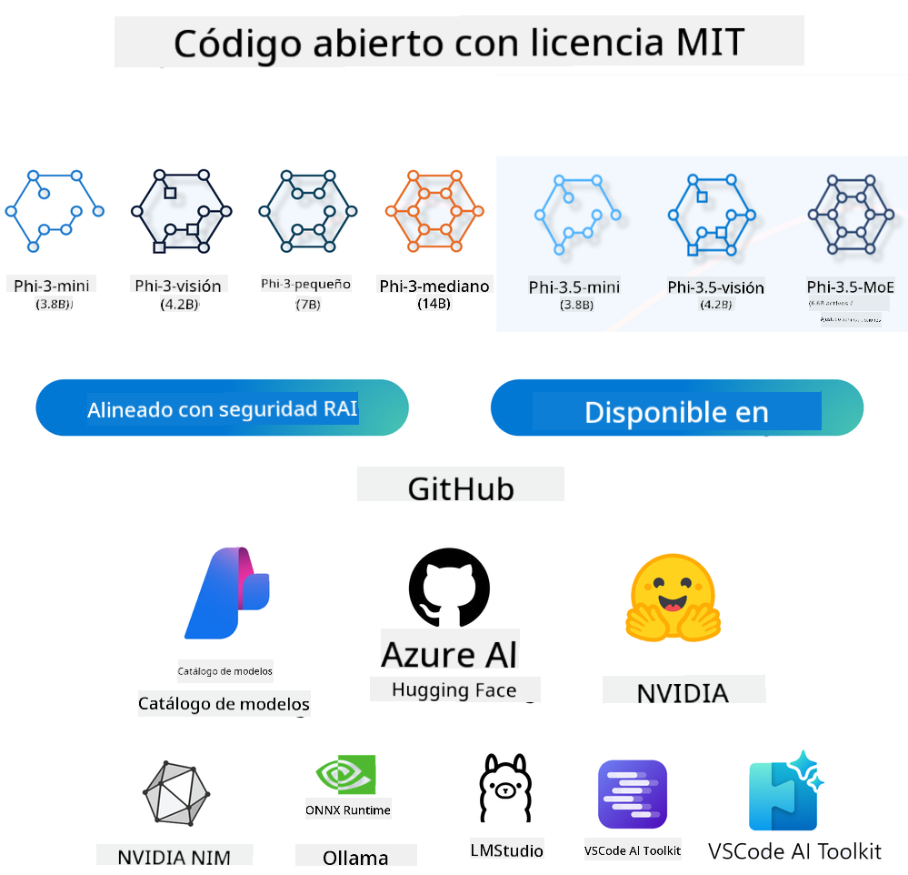
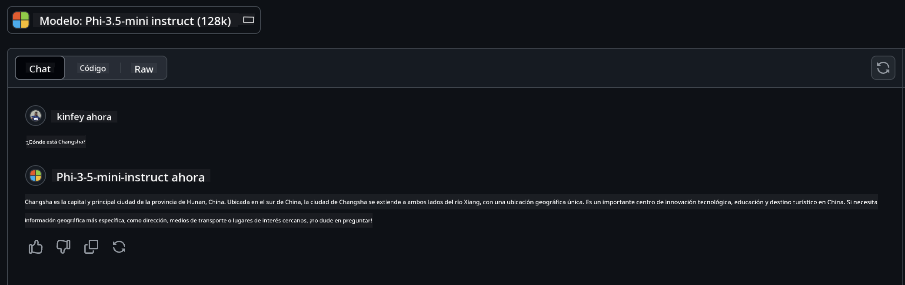

<!--
CO_OP_TRANSLATOR_METADATA:
{
  "original_hash": "124ad36cfe96f74038811b6e2bb93e9d",
  "translation_date": "2025-07-09T18:12:46+00:00",
  "source_file": "19-slm/README.md",
  "language_code": "es"
}
-->
# Introducción a los Modelos de Lenguaje Pequeños para IA Generativa para Principiantes  
La IA generativa es un campo fascinante de la inteligencia artificial que se centra en crear sistemas capaces de generar contenido nuevo. Este contenido puede variar desde texto e imágenes hasta música e incluso entornos virtuales completos. Una de las aplicaciones más emocionantes de la IA generativa se encuentra en el ámbito de los modelos de lenguaje.

## ¿Qué son los Modelos de Lenguaje Pequeños?  

Un Modelo de Lenguaje Pequeño (SLM) representa una variante reducida de un modelo de lenguaje grande (LLM), aprovechando muchos de los principios arquitectónicos y técnicas de los LLM, pero con una huella computacional significativamente menor.

Los SLM son un subconjunto de modelos de lenguaje diseñados para generar texto similar al humano. A diferencia de sus contrapartes más grandes, como GPT-4, los SLM son más compactos y eficientes, lo que los hace ideales para aplicaciones donde los recursos computacionales son limitados. A pesar de su tamaño reducido, pueden realizar una variedad de tareas. Normalmente, los SLM se construyen comprimiendo o destilando LLM, con el objetivo de conservar una parte sustancial de la funcionalidad y capacidades lingüísticas del modelo original. Esta reducción en el tamaño del modelo disminuye la complejidad general, haciendo que los SLM sean más eficientes tanto en el uso de memoria como en los requerimientos computacionales. A pesar de estas optimizaciones, los SLM pueden realizar una amplia gama de tareas de procesamiento de lenguaje natural (NLP):

- Generación de texto: Crear oraciones o párrafos coherentes y contextualmente relevantes.  
- Completado de texto: Predecir y completar oraciones basadas en un prompt dado.  
- Traducción: Convertir texto de un idioma a otro.  
- Resumen: Condensar textos largos en resúmenes más cortos y fáciles de digerir.  

Aunque con algunos compromisos en rendimiento o profundidad de comprensión en comparación con sus contrapartes más grandes.

## ¿Cómo Funcionan los Modelos de Lenguaje Pequeños?  
Los SLM se entrenan con grandes cantidades de datos textuales. Durante el entrenamiento, aprenden los patrones y estructuras del lenguaje, lo que les permite generar texto que es gramaticalmente correcto y contextualmente apropiado. El proceso de entrenamiento incluye:

- Recolección de datos: Obtener grandes conjuntos de datos textuales de diversas fuentes.  
- Preprocesamiento: Limpiar y organizar los datos para que sean adecuados para el entrenamiento.  
- Entrenamiento: Usar algoritmos de aprendizaje automático para enseñar al modelo a entender y generar texto.  
- Ajuste fino: Modificar el modelo para mejorar su desempeño en tareas específicas.  

El desarrollo de los SLM responde a la creciente necesidad de modelos que puedan desplegarse en entornos con recursos limitados, como dispositivos móviles o plataformas de computación en el borde, donde los LLM a gran escala pueden ser poco prácticos debido a sus altos requerimientos. Al enfocarse en la eficiencia, los SLM equilibran rendimiento y accesibilidad, permitiendo una aplicación más amplia en diversos dominios.


## Objetivos de Aprendizaje  

En esta lección, esperamos introducir el conocimiento sobre SLM y combinarlo con Microsoft Phi-3 para aprender diferentes escenarios en contenido de texto, visión y MoE.

Al finalizar esta lección, deberías poder responder las siguientes preguntas:

- ¿Qué es un SLM?  
- ¿Cuál es la diferencia entre SLM y LLM?  
- ¿Qué es la familia Microsoft Phi-3/3.5?  
- ¿Cómo hacer inferencia con la familia Microsoft Phi-3/3.5?  

¿Listo? Comencemos.

## Las Diferencias entre Modelos de Lenguaje Grandes (LLMs) y Modelos de Lenguaje Pequeños (SLMs)  

Tanto los LLM como los SLM se basan en principios fundamentales del aprendizaje automático probabilístico, siguiendo enfoques similares en su diseño arquitectónico, metodologías de entrenamiento, procesos de generación de datos y técnicas de evaluación de modelos. Sin embargo, varios factores clave los diferencian.

## Aplicaciones de los Modelos de Lenguaje Pequeños  

Los SLM tienen una amplia gama de aplicaciones, incluyendo:

- Chatbots: Proporcionar soporte al cliente y entablar conversaciones con usuarios.  
- Creación de contenido: Ayudar a escritores generando ideas o incluso redactando artículos completos.  
- Educación: Asistir a estudiantes con tareas de escritura o aprendizaje de nuevos idiomas.  
- Accesibilidad: Crear herramientas para personas con discapacidades, como sistemas de texto a voz.  

**Tamaño**  

Una distinción principal entre LLM y SLM radica en la escala de los modelos. Los LLM, como ChatGPT (GPT-4), pueden tener aproximadamente 1.76 billones de parámetros, mientras que los SLM de código abierto como Mistral 7B están diseñados con muchos menos parámetros, alrededor de 7 mil millones. Esta disparidad se debe principalmente a diferencias en la arquitectura del modelo y los procesos de entrenamiento. Por ejemplo, ChatGPT emplea un mecanismo de autoatención dentro de un marco encoder-decoder, mientras que Mistral 7B utiliza atención de ventana deslizante, lo que permite un entrenamiento más eficiente dentro de un modelo solo decoder. Esta variación arquitectónica tiene profundas implicaciones en la complejidad y el rendimiento de estos modelos.

**Comprensión**  

Los SLM suelen estar optimizados para un rendimiento dentro de dominios específicos, lo que los hace altamente especializados pero potencialmente limitados en su capacidad para ofrecer una comprensión contextual amplia en múltiples campos del conocimiento. En contraste, los LLM buscan simular una inteligencia similar a la humana a un nivel más integral. Entrenados con conjuntos de datos vastos y diversos, los LLM están diseñados para desempeñarse bien en una variedad de dominios, ofreciendo mayor versatilidad y adaptabilidad. Por lo tanto, los LLM son más adecuados para una gama más amplia de tareas posteriores, como procesamiento de lenguaje natural y programación.

**Computación**  

El entrenamiento y despliegue de los LLM son procesos que requieren muchos recursos, a menudo demandando infraestructuras computacionales significativas, incluyendo grandes clústeres de GPU. Por ejemplo, entrenar un modelo como ChatGPT desde cero puede necesitar miles de GPUs durante períodos prolongados. En contraste, los SLM, con su menor cantidad de parámetros, son más accesibles en términos de recursos computacionales. Modelos como Mistral 7B pueden entrenarse y ejecutarse en máquinas locales con capacidades moderadas de GPU, aunque el entrenamiento aún requiere varias horas en múltiples GPUs.

**Sesgo**  

El sesgo es un problema conocido en los LLM, principalmente debido a la naturaleza de los datos de entrenamiento. Estos modelos a menudo dependen de datos sin procesar y disponibles públicamente en internet, que pueden subrepresentar o representar erróneamente ciertos grupos, introducir etiquetados erróneos o reflejar sesgos lingüísticos influenciados por dialectos, variaciones geográficas y reglas gramaticales. Además, la complejidad de las arquitecturas LLM puede exacerbar inadvertidamente el sesgo, que puede pasar desapercibido sin un ajuste fino cuidadoso. Por otro lado, los SLM, al entrenarse con conjuntos de datos más limitados y específicos de dominio, son inherentemente menos susceptibles a estos sesgos, aunque no están exentos de ellos.

**Inferencia**  

El tamaño reducido de los SLM les otorga una ventaja significativa en términos de velocidad de inferencia, permitiéndoles generar resultados de manera eficiente en hardware local sin necesidad de procesamiento paralelo extenso. En contraste, los LLM, debido a su tamaño y complejidad, a menudo requieren recursos computacionales paralelos sustanciales para lograr tiempos de inferencia aceptables. La presencia de múltiples usuarios concurrentes ralentiza aún más los tiempos de respuesta de los LLM, especialmente cuando se despliegan a gran escala.

En resumen, aunque tanto los LLM como los SLM comparten una base fundamental en el aprendizaje automático, difieren significativamente en tamaño del modelo, requerimientos de recursos, comprensión contextual, susceptibilidad al sesgo y velocidad de inferencia. Estas diferencias reflejan su idoneidad para distintos casos de uso, siendo los LLM más versátiles pero con alta demanda de recursos, y los SLM ofreciendo eficiencia específica para dominios con menores requerimientos computacionales.

***Note：En este capítulo, presentaremos los SLM usando Microsoft Phi-3 / 3.5 como ejemplo.***

## Introducción a la Familia Phi-3 / Phi-3.5  

La familia Phi-3 / 3.5 está principalmente orientada a escenarios de aplicación en texto, visión y Agente (MoE):

### Phi-3 / 3.5 Instruct  

Principalmente para generación de texto, completado de chat y extracción de información de contenido, entre otros.

**Phi-3-mini**  

El modelo de lenguaje de 3.8B está disponible en Microsoft Azure AI Studio, Hugging Face y Ollama. Los modelos Phi-3 superan significativamente a modelos de lenguaje de igual o mayor tamaño en benchmarks clave (ver números de benchmark abajo, números más altos son mejores). Phi-3-mini supera a modelos del doble de su tamaño, mientras que Phi-3-small y Phi-3-medium superan a modelos más grandes, incluyendo GPT-3.5.

**Phi-3-small y medium**  

Con solo 7B parámetros, Phi-3-small supera a GPT-3.5T en una variedad de benchmarks de lenguaje, razonamiento, codificación y matemáticas.

Phi-3-medium con 14B parámetros continúa esta tendencia y supera a Gemini 1.0 Pro.

**Phi-3.5-mini**  

Podemos considerarlo una mejora de Phi-3-mini. Aunque los parámetros permanecen sin cambios, mejora la capacidad para soportar múltiples idiomas (soporta más de 20 idiomas: árabe, chino, checo, danés, holandés, inglés, finlandés, francés, alemán, hebreo, húngaro, italiano, japonés, coreano, noruego, polaco, portugués, ruso, español, sueco, tailandés, turco, ucraniano) y añade un soporte más fuerte para contextos largos.

Phi-3.5-mini con 3.8B parámetros supera a modelos de lenguaje del mismo tamaño y está a la par con modelos del doble de tamaño.

### Phi-3 / 3.5 Visión  

Podemos pensar en el modelo Instruct de Phi-3/3.5 como la capacidad de Phi para entender, y Visión es lo que le da a Phi ojos para comprender el mundo.

**Phi-3-Vision**  

Phi-3-vision, con solo 4.2B parámetros, continúa esta tendencia y supera a modelos más grandes como Claude-3 Haiku y Gemini 1.0 Pro V en tareas generales de razonamiento visual, OCR y comprensión de tablas y diagramas.

**Phi-3.5-Vision**  

Phi-3.5-Vision también es una mejora de Phi-3-Vision, añadiendo soporte para múltiples imágenes. Puedes considerarlo una mejora en visión, no solo puede ver imágenes, sino también videos.

Phi-3.5-vision supera a modelos más grandes como Claude-3.5 Sonnet y Gemini 1.5 Flash en tareas de OCR, comprensión de tablas y gráficos, y está a la par en tareas generales de razonamiento visual. Soporta entrada multi-frame, es decir, razonamiento sobre múltiples imágenes de entrada.

### Phi-3.5-MoE  

***Mixture of Experts (MoE)*** permite que los modelos se preentrenen con mucho menos cómputo, lo que significa que puedes escalar dramáticamente el tamaño del modelo o del conjunto de datos con el mismo presupuesto computacional que un modelo denso. En particular, un modelo MoE debería alcanzar la misma calidad que su contraparte densa mucho más rápido durante el preentrenamiento.

Phi-3.5-MoE comprende 16 módulos expertos de 3.8B cada uno. Phi-3.5-MoE, con solo 6.6B parámetros activos, logra un nivel similar de razonamiento, comprensión del lenguaje y matemáticas que modelos mucho más grandes.

Podemos usar el modelo de la familia Phi-3/3.5 basado en diferentes escenarios. A diferencia de los LLM, puedes desplegar Phi-3/3.5-mini o Phi-3/3.5-Vision en dispositivos edge.

## Cómo usar los modelos de la familia Phi-3/3.5  

Queremos usar Phi-3/3.5 en diferentes escenarios. A continuación, usaremos Phi-3/3.5 basado en distintos casos.



### Diferencias de inferencia con la API en la nube  

**Modelos en GitHub**  

Los modelos en GitHub son la forma más directa. Puedes acceder rápidamente al modelo Phi-3/3.5-Instruct a través de GitHub Models. Combinado con el Azure AI Inference SDK / OpenAI SDK, puedes acceder a la API mediante código para completar la llamada a Phi-3/3.5-Instruct. También puedes probar diferentes resultados a través de Playground.

- Demo: Comparación de los efectos de Phi-3-mini y Phi-3.5-mini en escenarios en chino




**Azure AI Studio**  

O si queremos usar los modelos de visión y MoE, podemos usar Azure AI Studio para completar la llamada. Si te interesa, puedes leer el Phi-3 Cookbook para aprender cómo llamar a Phi-3/3.5 Instruct, Vision, MoE a través de Azure AI Studio [Haz clic en este enlace](https://github.com/microsoft/Phi-3CookBook/blob/main/md/02.QuickStart/AzureAIStudio_QuickStart.md?WT.mc_id=academic-105485-koreyst)

**NVIDIA NIM**  

Además de las soluciones basadas en la nube del Catálogo de Modelos proporcionadas por Azure y GitHub, también puedes usar [NVIDIA NIM](https://developer.nvidia.com/nim?WT.mc_id=academic-105485-koreyst) para completar llamadas relacionadas. Puedes visitar NVIDIA NIM para realizar las llamadas API de la familia Phi-3/3.5. NVIDIA NIM (NVIDIA Inference Microservices) es un conjunto de microservicios de inferencia acelerada diseñados para ayudar a los desarrolladores a desplegar modelos de IA de manera eficiente en diversos entornos, incluyendo nubes, centros de datos y estaciones de trabajo.

Aquí algunas características clave de NVIDIA NIM:

- **Facilidad de despliegue:** NIM permite desplegar modelos de IA con un solo comando, facilitando su integración en flujos de trabajo existentes.  
- **Rendimiento optimizado:** Aprovecha los motores de inferencia preoptimizados de NVIDIA, como TensorRT y TensorRT-LLM, para garantizar baja latencia y alto rendimiento.  
- **Escalabilidad:** NIM soporta autoescalado en Kubernetes, permitiendo manejar cargas de trabajo variables de manera efectiva.
- **Seguridad y Control:** Las organizaciones pueden mantener el control sobre sus datos y aplicaciones alojando los microservicios NIM en su propia infraestructura gestionada.
- **APIs Estándar:** NIM ofrece APIs estándar en la industria, facilitando la creación e integración de aplicaciones de IA como chatbots, asistentes de IA y más.

NIM forma parte de NVIDIA AI Enterprise, cuyo objetivo es simplificar el despliegue y la operacionalización de modelos de IA, asegurando que funcionen de manera eficiente en GPUs NVIDIA.

- Demo: Uso de Nividia NIM para llamar a Phi-3.5-Vision-API [[Haz clic en este enlace](../../../19-slm/python/Phi-3-Vision-Nividia-NIM.ipynb)]


### Inferencia Phi-3/3.5 en entorno local
La inferencia en relación con Phi-3, o cualquier modelo de lenguaje como GPT-3, se refiere al proceso de generar respuestas o predicciones basadas en la entrada que recibe. Cuando proporcionas un prompt o pregunta a Phi-3, utiliza su red neuronal entrenada para inferir la respuesta más probable y relevante analizando patrones y relaciones en los datos con los que fue entrenado.

**Hugging Face Transformer**  
Hugging Face Transformers es una biblioteca potente diseñada para procesamiento de lenguaje natural (NLP) y otras tareas de aprendizaje automático. Aquí algunos puntos clave:

1. **Modelos Preentrenados:** Ofrece miles de modelos preentrenados que pueden usarse para diversas tareas como clasificación de texto, reconocimiento de entidades nombradas, respuesta a preguntas, resumen, traducción y generación de texto.

2. **Interoperabilidad de Frameworks:** La biblioteca soporta múltiples frameworks de deep learning, incluyendo PyTorch, TensorFlow y JAX. Esto permite entrenar un modelo en un framework y usarlo en otro.

3. **Capacidades Multimodales:** Además de NLP, Hugging Face Transformers también soporta tareas en visión por computadora (por ejemplo, clasificación de imágenes, detección de objetos) y procesamiento de audio (por ejemplo, reconocimiento de voz, clasificación de audio).

4. **Facilidad de Uso:** La biblioteca ofrece APIs y herramientas para descargar y ajustar modelos fácilmente, haciéndola accesible tanto para principiantes como para expertos.

5. **Comunidad y Recursos:** Hugging Face cuenta con una comunidad activa y una amplia documentación, tutoriales y guías para ayudar a los usuarios a comenzar y aprovechar al máximo la biblioteca.  
[documentación oficial](https://huggingface.co/docs/transformers/index?WT.mc_id=academic-105485-koreyst) o su [repositorio en GitHub](https://github.com/huggingface/transformers?WT.mc_id=academic-105485-koreyst).

Este es el método más común, pero también requiere aceleración por GPU. Después de todo, escenarios como Vision y MoE requieren muchos cálculos, lo que será muy limitado en CPU si no están cuantizados.


- Demo: Uso de Transformer para llamar a Phi-3.5-Instruct [Haz clic en este enlace](../../../19-slm/python/phi35-instruct-demo.ipynb)

- Demo: Uso de Transformer para llamar a Phi-3.5-Vision [Haz clic en este enlace](../../../19-slm/python/phi35-vision-demo.ipynb)

- Demo: Uso de Transformer para llamar a Phi-3.5-MoE [Haz clic en este enlace](../../../19-slm/python/phi35_moe_demo.ipynb)

**Ollama**  
[Ollama](https://ollama.com/?WT.mc_id=academic-105485-koreyst) es una plataforma diseñada para facilitar la ejecución local de grandes modelos de lenguaje (LLMs) en tu máquina. Soporta varios modelos como Llama 3.1, Phi 3, Mistral y Gemma 2, entre otros. La plataforma simplifica el proceso al empaquetar los pesos del modelo, la configuración y los datos en un solo paquete, haciendo más accesible para los usuarios la personalización y creación de sus propios modelos. Ollama está disponible para macOS, Linux y Windows. Es una excelente herramienta si quieres experimentar o desplegar LLMs sin depender de servicios en la nube. Ollama es la forma más directa, solo necesitas ejecutar la siguiente instrucción.


```bash

ollama run phi3.5

```


**ONNX Runtime para GenAI**

[ONNX Runtime](https://github.com/microsoft/onnxruntime-genai?WT.mc_id=academic-105485-koreyst) es un acelerador multiplataforma para inferencia y entrenamiento de aprendizaje automático. ONNX Runtime para Generative AI (GENAI) es una herramienta potente que te ayuda a ejecutar modelos de IA generativa de manera eficiente en diversas plataformas.

## ¿Qué es ONNX Runtime?  
ONNX Runtime es un proyecto de código abierto que permite la inferencia de alto rendimiento de modelos de aprendizaje automático. Soporta modelos en el formato Open Neural Network Exchange (ONNX), que es un estándar para representar modelos de aprendizaje automático. La inferencia con ONNX Runtime puede ofrecer experiencias de usuario más rápidas y reducir costos, soportando modelos de frameworks de deep learning como PyTorch y TensorFlow/Keras, así como bibliotecas clásicas de machine learning como scikit-learn, LightGBM, XGBoost, etc. ONNX Runtime es compatible con diferentes hardware, drivers y sistemas operativos, y ofrece un rendimiento óptimo aprovechando aceleradores de hardware cuando es posible, junto con optimizaciones y transformaciones de grafos.

## ¿Qué es la IA Generativa?  
La IA generativa se refiere a sistemas de IA que pueden crear contenido nuevo, como texto, imágenes o música, basándose en los datos con los que fueron entrenados. Ejemplos incluyen modelos de lenguaje como GPT-3 y modelos de generación de imágenes como Stable Diffusion. La biblioteca ONNX Runtime para GenAI proporciona el ciclo generativo para modelos ONNX, incluyendo inferencia con ONNX Runtime, procesamiento de logits, búsqueda y muestreo, y gestión de caché KV.

## ONNX Runtime para GENAI  
ONNX Runtime para GENAI extiende las capacidades de ONNX Runtime para soportar modelos de IA generativa. Algunas características clave:

- **Amplio soporte de plataformas:** Funciona en varias plataformas, incluyendo Windows, Linux, macOS, Android e iOS.  
- **Soporte de modelos:** Soporta muchos modelos populares de IA generativa, como LLaMA, GPT-Neo, BLOOM y más.  
- **Optimización de rendimiento:** Incluye optimizaciones para diferentes aceleradores de hardware como GPUs NVIDIA, GPUs AMD, entre otros.  
- **Facilidad de uso:** Proporciona APIs para una integración sencilla en aplicaciones, permitiendo generar texto, imágenes y otros contenidos con poco código.  
- Los usuarios pueden llamar a un método de alto nivel generate(), o ejecutar cada iteración del modelo en un bucle, generando un token a la vez y, opcionalmente, actualizando parámetros de generación dentro del bucle.  
- ONNX Runtime también soporta búsqueda greedy/beam y muestreo TopP, TopK para generar secuencias de tokens y procesamiento incorporado de logits como penalizaciones por repetición. También puedes añadir fácilmente puntuaciones personalizadas.

## Cómo empezar  
Para comenzar con ONNX Runtime para GENAI, puedes seguir estos pasos:

### Instalar ONNX Runtime:  
```Python
pip install onnxruntime
```  
### Instalar las Extensiones de IA Generativa:  
```Python
pip install onnxruntime-genai
```

### Ejecutar un modelo: Aquí un ejemplo sencillo en Python:  
```Python
import onnxruntime_genai as og

model = og.Model('path_to_your_model.onnx')

tokenizer = og.Tokenizer(model)

input_text = "Hello, how are you?"

input_tokens = tokenizer.encode(input_text)

output_tokens = model.generate(input_tokens)

output_text = tokenizer.decode(output_tokens)

print(output_text) 
```  
### Demo: Uso de ONNX Runtime GenAI para llamar a Phi-3.5-Vision


```python

import onnxruntime_genai as og

model_path = './Your Phi-3.5-vision-instruct ONNX Path'

img_path = './Your Image Path'

model = og.Model(model_path)

processor = model.create_multimodal_processor()

tokenizer_stream = processor.create_stream()

text = "Your Prompt"

prompt = "<|user|>\n"

prompt += "<|image_1|>\n"

prompt += f"{text}<|end|>\n"

prompt += "<|assistant|>\n"

image = og.Images.open(img_path)

inputs = processor(prompt, images=image)

params = og.GeneratorParams(model)

params.set_inputs(inputs)

params.set_search_options(max_length=3072)

generator = og.Generator(model, params)

while not generator.is_done():

    generator.compute_logits()
    
    generator.generate_next_token()

    new_token = generator.get_next_tokens()[0]
    
    code += tokenizer_stream.decode(new_token)
    
    print(tokenizer_stream.decode(new_token), end='', flush=True)

```


**Otros**

Además de los métodos de referencia ONNX Runtime y Ollama, también podemos completar la referencia de modelos cuantitativos basándonos en los métodos de referencia proporcionados por diferentes fabricantes. Como el framework Apple MLX con Apple Metal, Qualcomm QNN con NPU, Intel OpenVINO con CPU/GPU, etc. También puedes encontrar más contenido en el [Phi-3 Cookbook](https://github.com/microsoft/phi-3cookbook?WT.mc_id=academic-105485-koreyst).


## Más

Hemos aprendido lo básico de la familia Phi-3/3.5, pero para profundizar en SLM necesitamos más conocimientos. Puedes encontrar las respuestas en el Phi-3 Cookbook. Si quieres aprender más, visita el [Phi-3 Cookbook](https://github.com/microsoft/phi-3cookbook?WT.mc_id=academic-105485-koreyst).

**Aviso legal**:  
Este documento ha sido traducido utilizando el servicio de traducción automática [Co-op Translator](https://github.com/Azure/co-op-translator). Aunque nos esforzamos por la precisión, tenga en cuenta que las traducciones automáticas pueden contener errores o inexactitudes. El documento original en su idioma nativo debe considerarse la fuente autorizada. Para información crítica, se recomienda la traducción profesional realizada por humanos. No nos hacemos responsables de malentendidos o interpretaciones erróneas derivadas del uso de esta traducción.