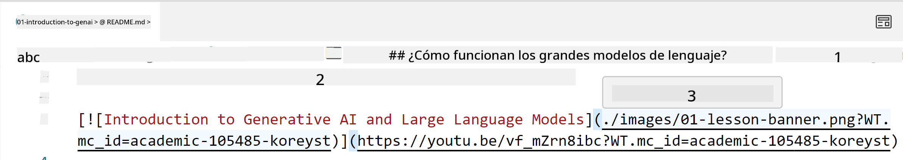
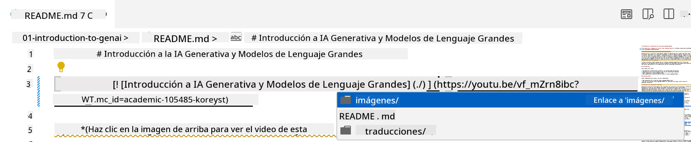
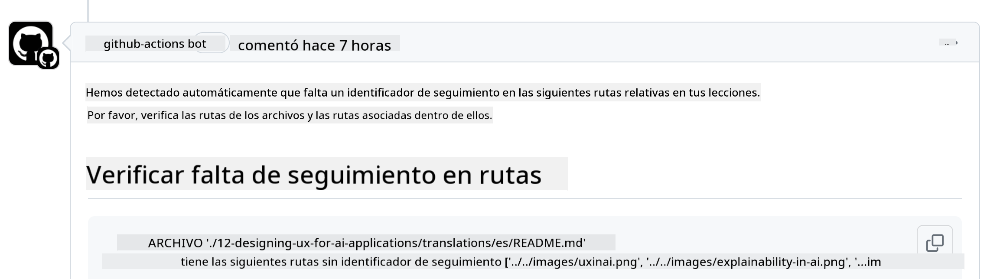
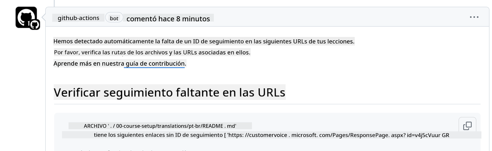
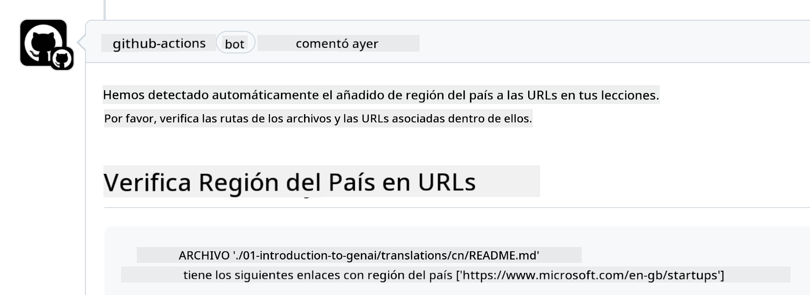

<!--
CO_OP_TRANSLATOR_METADATA:
{
  "original_hash": "57c41f2af71001a2cff9d8eb797cb843",
  "translation_date": "2025-05-19T08:38:08+00:00",
  "source_file": "CONTRIBUTING.md",
  "language_code": "es"
}
-->
# Contribuyendo

Este proyecto da la bienvenida a contribuciones y sugerencias. La mayoría de las contribuciones requieren que aceptes un Acuerdo de Licencia de Contribuidor (CLA) declarando que tienes el derecho de, y realmente lo haces, otorgarnos los derechos para usar tu contribución. Para más detalles, visita <https://cla.microsoft.com>.

> Importante: cuando traduzcas texto en este repositorio, asegúrate de no usar traducción automática. Verificaremos las traducciones a través de la comunidad, así que por favor solo ofrécete para traducir en idiomas donde seas competente.

Cuando envíes una solicitud de extracción, un CLA-bot determinará automáticamente si necesitas proporcionar un CLA y decorará el PR apropiadamente (por ejemplo, etiqueta, comentario). Simplemente sigue las instrucciones proporcionadas por el bot. Solo necesitarás hacer esto una vez en todos los repositorios que usen nuestro CLA.

## Código de Conducta

Este proyecto ha adoptado el [Código de Conducta de Código Abierto de Microsoft](https://opensource.microsoft.com/codeofconduct/?WT.mc_id=academic-105485-koreyst).
Para más información, lee las [Preguntas Frecuentes sobre el Código de Conducta](https://opensource.microsoft.com/codeofconduct/faq/?WT.mc_id=academic-105485-koreyst) o contacta a [opencode@microsoft.com](mailto:opencode@microsoft.com) para cualquier pregunta o comentario adicional.

## ¿Pregunta o Problema?

Por favor, no abras issues en GitHub para preguntas generales de soporte ya que la lista de GitHub debería usarse para solicitudes de características e informes de errores. De esta manera, podemos rastrear más fácilmente problemas reales o errores del código y mantener la discusión general separada del código real.

## Errores tipográficos, Problemas, Bugs y contribuciones

Siempre que estés enviando cambios al repositorio de Generative AI for Beginners, sigue estas recomendaciones.

* Siempre haz un fork del repositorio a tu propia cuenta antes de hacer tus modificaciones.
* No combines múltiples cambios en una sola solicitud de extracción. Por ejemplo, envía cualquier corrección de errores y actualizaciones de documentación usando PRs separados.
* Si tu solicitud de extracción muestra conflictos de fusión, asegúrate de actualizar tu rama principal local para que sea un reflejo de lo que está en el repositorio principal antes de hacer tus modificaciones.
* Si estás enviando una traducción, por favor crea un PR para todos los archivos traducidos, ya que no aceptamos traducciones parciales del contenido.
* Si estás enviando una corrección de errores tipográficos o de documentación, puedes combinar modificaciones en un solo PR donde sea adecuado.

## Guía General para escribir

- Asegúrate de que todas tus URLs estén envueltas entre corchetes seguidos de un paréntesis sin espacios adicionales alrededor o dentro de ellos ``.
- Asegúrate de que cualquier enlace relativo (es decir, enlaces a otros archivos y carpetas en el repositorio) comience con un `./` refiriéndose a un archivo o carpeta ubicado en el directorio de trabajo actual o un `../` refiriéndose a un archivo o carpeta ubicado en un directorio de trabajo padre.
- Asegúrate de que cualquier enlace relativo (es decir, enlaces a otros archivos y carpetas en el repositorio) tenga un ID de seguimiento (es decir, `?` o `&` luego `wt.mc_id=` o `WT.mc_id=`) al final de él.
- Asegúrate de que cualquier URL de los siguientes dominios _github.com, microsoft.com, visualstudio.com, aka.ms, y azure.com_ tenga un ID de seguimiento (es decir, `?` o `&` luego `wt.mc_id=` o `WT.mc_id=`) al final de él.
- Asegúrate de que tus enlaces no tengan localización específica de país en ellos (es decir, `/en-us/` o `/en/`).
- Asegúrate de que todas las imágenes estén almacenadas en la carpeta `./images`.
- Asegúrate de que las imágenes tengan nombres descriptivos usando caracteres en inglés, números y guiones en el nombre de tu imagen.

## Flujos de Trabajo de GitHub

Cuando envíes una solicitud de extracción, se activarán cuatro flujos de trabajo diferentes para validar las reglas anteriores.
Simplemente sigue las instrucciones enumeradas aquí para pasar las comprobaciones del flujo de trabajo.

- [Verificar Rutas Relativas Rotas](../..)
- [Verificar que las Rutas Tengan Seguimiento](../..)
- [Verificar que las URLs Tengan Seguimiento](../..)
- [Verificar que las URLs No Tengan Localización](../..)

### Verificar Rutas Relativas Rotas

Este flujo de trabajo asegura que cualquier ruta relativa en tus archivos esté funcionando.
Este repositorio se despliega en las páginas de GitHub, así que necesitas ser muy cuidadoso al escribir los enlaces que conectan todo para no dirigir a nadie al lugar equivocado.

Para asegurarte de que tus enlaces estén funcionando correctamente, simplemente usa VS code para verificarlo.

Por ejemplo, cuando pases el cursor sobre cualquier enlace en tus archivos, se te pedirá que sigas el enlace presionando **ctrl + click**

Si haces clic en un enlace y no funciona localmente, entonces seguramente activará el flujo de trabajo y no funcionará en GitHub.

Para solucionar este problema, intenta escribir el enlace con la ayuda de VS code.

Cuando escribas `./` o `../`, VS code te pedirá que elijas entre las opciones disponibles según lo que hayas escrito.

Sigue la ruta haciendo clic en el archivo o carpeta deseada y estarás seguro de que tu ruta no está rota.

Una vez que agregues la ruta relativa correcta, guarda y empuja tus cambios, el flujo de trabajo se activará nuevamente para verificar tus cambios.
Si pasas la comprobación, entonces estás listo para continuar.

### Verificar que las Rutas Tengan Seguimiento

Este flujo de trabajo asegura que cualquier ruta relativa tenga seguimiento en ella.
Este repositorio se despliega en las páginas de GitHub, así que necesitamos rastrear el movimiento entre los diferentes archivos y carpetas.

Para asegurarte de que tus rutas relativas tengan seguimiento en ellas, simplemente verifica el siguiente texto `?wt.mc_id=` al final de la ruta.
Si está agregado a tus rutas relativas, entonces pasarás esta comprobación.

Si no, podrías recibir el siguiente error.

Para solucionar este problema, intenta abrir la ruta del archivo que el flujo de trabajo resaltó y agrega el ID de seguimiento al final de las rutas relativas.

Una vez que agregues el ID de seguimiento, guarda y empuja tus cambios, el flujo de trabajo se activará nuevamente para verificar tus cambios.
Si pasas la comprobación, entonces estás listo para continuar.

### Verificar que las URLs Tengan Seguimiento

Este flujo de trabajo asegura que cualquier URL web tenga seguimiento en ella.
Este repositorio está disponible para todos, así que necesitas asegurarte de rastrear el acceso para saber de dónde proviene el tráfico.

Para asegurarte de que tus URLs tengan seguimiento en ellas, simplemente verifica el siguiente texto `?wt.mc_id=` al final de la URL.
Si está agregado a tus URLs, entonces pasarás esta comprobación.

Si no, podrías recibir el siguiente error.

Para solucionar este problema, intenta abrir la ruta del archivo que el flujo de trabajo resaltó y agrega el ID de seguimiento al final de las URLs.

Una vez que agregues el ID de seguimiento, guarda y empuja tus cambios, el flujo de trabajo se activará nuevamente para verificar tus cambios.
Si pasas la comprobación, entonces estás listo para continuar.

### Verificar que las URLs No Tengan Localización

Este flujo de trabajo asegura que cualquier URL web no tenga localización específica de país en ella.
Este repositorio está disponible para todos en todo el mundo, así que necesitas asegurarte de no incluir la localización de tu país en las URLs.

Para asegurarte de que tus URLs no tengan localización de país en ellas, simplemente verifica el siguiente texto `/en-us/` o `/en/` o cualquier otra localización de idioma en cualquier parte de la URL.
Si no está presente en tus URLs, entonces pasarás esta comprobación.

Si no, podrías recibir el siguiente error.

Para solucionar este problema, intenta abrir la ruta del archivo que el flujo de trabajo resaltó y elimina la localización de país de las URLs.

Una vez que elimines la localización de país, guarda y empuja tus cambios, el flujo de trabajo se activará nuevamente para verificar tus cambios.
Si pasas la comprobación, entonces estás listo para continuar.

¡Felicidades! Nos pondremos en contacto contigo lo antes posible con comentarios sobre tu contribución.

**Descargo de responsabilidad**:  
Este documento ha sido traducido utilizando el servicio de traducción por IA [Co-op Translator](https://github.com/Azure/co-op-translator). Aunque nos esforzamos por lograr precisión, tenga en cuenta que las traducciones automáticas pueden contener errores o imprecisiones. El documento original en su idioma nativo debe considerarse la fuente autorizada. Para información crítica, se recomienda una traducción profesional realizada por humanos. No nos hacemos responsables de cualquier malentendido o interpretación errónea que surja del uso de esta traducción.