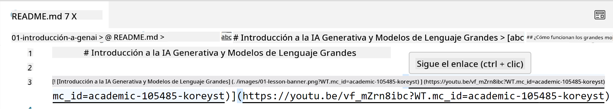
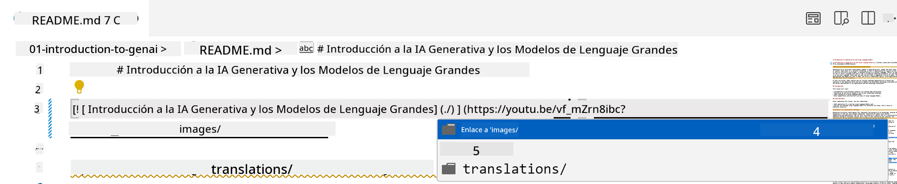
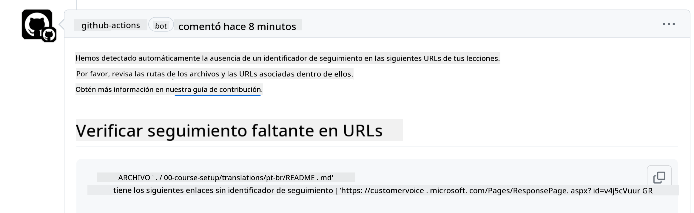
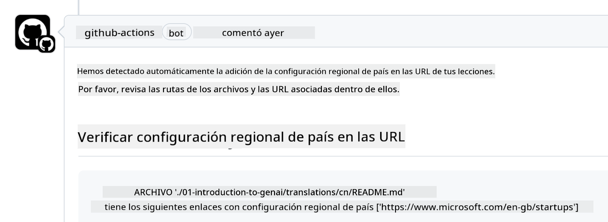

<!--
CO_OP_TRANSLATOR_METADATA:
{
  "original_hash": "57c41f2af71001a2cff9d8eb797cb843",
  "translation_date": "2025-07-09T05:47:37+00:00",
  "source_file": "CONTRIBUTING.md",
  "language_code": "es"
}
-->
# Contribuir

Este proyecto acepta contribuciones y sugerencias. La mayoría de las contribuciones requieren que aceptes un Acuerdo de Licencia de Contribuidor (CLA) declarando que tienes el derecho y realmente nos otorgas los derechos para usar tu contribución. Para más detalles, visita <https://cla.microsoft.com>.

> Importante: al traducir texto en este repositorio, asegúrate de no usar traducción automática. Verificaremos las traducciones a través de la comunidad, así que por favor solo ofrece traducciones en idiomas que domines.

Cuando envíes una solicitud de extracción, un bot de CLA determinará automáticamente si necesitas proporcionar un CLA y decorará la PR apropiadamente (por ejemplo, etiqueta, comentario). Simplemente sigue las instrucciones que te dé el bot. Solo tendrás que hacer esto una vez para todos los repositorios que usan nuestro CLA.

## Código de Conducta

Este proyecto ha adoptado el [Código de Conducta de Código Abierto de Microsoft](https://opensource.microsoft.com/codeofconduct/?WT.mc_id=academic-105485-koreyst).  
Para más información, lee las [Preguntas Frecuentes sobre el Código de Conducta](https://opensource.microsoft.com/codeofconduct/faq/?WT.mc_id=academic-105485-koreyst) o contacta a [opencode@microsoft.com](mailto:opencode@microsoft.com) con cualquier pregunta o comentario adicional.

## ¿Pregunta o problema?

Por favor, no abras issues en GitHub para preguntas generales de soporte, ya que la lista de GitHub debe usarse para solicitudes de características y reportes de errores. De esta forma podemos rastrear más fácilmente problemas o bugs reales en el código y mantener la discusión general separada del código en sí.

## Errores tipográficos, problemas, bugs y contribuciones

Cada vez que envíes cambios al repositorio Generative AI for Beginners, sigue estas recomendaciones:

* Siempre haz un fork del repositorio a tu propia cuenta antes de hacer tus modificaciones  
* No combines múltiples cambios en una sola solicitud de extracción. Por ejemplo, envía correcciones de bugs y actualizaciones de documentación en PRs separadas  
* Si tu pull request muestra conflictos de merge, asegúrate de actualizar tu rama main local para que sea un reflejo del repositorio principal antes de hacer tus modificaciones  
* Si envías una traducción, crea una sola PR con todos los archivos traducidos, ya que no aceptamos traducciones parciales del contenido  
* Si envías una corrección de error tipográfico o de documentación, puedes combinar modificaciones en una sola PR cuando sea adecuado  

## Guía general para escribir

- Asegúrate de que todas tus URLs estén entre corchetes seguidos de paréntesis sin espacios extras alrededor o dentro ``.  
- Asegúrate de que cualquier enlace relativo (es decir, enlaces a otros archivos y carpetas en el repositorio) comience con `./` refiriéndose a un archivo o carpeta en el directorio actual o con `../` refiriéndose a un archivo o carpeta en un directorio padre.  
- Asegúrate de que cualquier enlace relativo tenga un ID de seguimiento (es decir, `?` o `&` seguido de `wt.mc_id=` o `WT.mc_id=`) al final.  
- Asegúrate de que cualquier URL de los siguientes dominios _github.com, microsoft.com, visualstudio.com, aka.ms, y azure.com_ tenga un ID de seguimiento (es decir, `?` o `&` seguido de `wt.mc_id=` o `WT.mc_id=`) al final.  
- Asegúrate de que tus enlaces no contengan locales específicos de país (es decir, `/en-us/` o `/en/`).  
- Asegúrate de que todas las imágenes estén almacenadas en la carpeta `./images`.  
- Asegúrate de que las imágenes tengan nombres descriptivos usando caracteres en inglés, números y guiones en el nombre.  

## Flujos de trabajo de GitHub

Cuando envíes una solicitud de extracción, se activarán cuatro flujos de trabajo diferentes para validar las reglas anteriores.  
Simplemente sigue las instrucciones listadas aquí para pasar las verificaciones del flujo de trabajo.

- [Verificar rutas relativas rotas](../..)  
- [Verificar que las rutas tengan seguimiento](../..)  
- [Verificar que las URLs tengan seguimiento](../..)  
- [Verificar que las URLs no tengan locale](../..)  

### Verificar rutas relativas rotas

Este flujo de trabajo asegura que cualquier ruta relativa en tus archivos funcione correctamente.  
Este repositorio se despliega en GitHub pages, por lo que debes tener mucho cuidado al escribir los enlaces que conectan todo para no dirigir a nadie al lugar equivocado.

Para asegurarte de que tus enlaces funcionen correctamente, simplemente usa VS Code para verificarlo.

Por ejemplo, cuando pases el cursor sobre cualquier enlace en tus archivos, se te sugerirá seguir el enlace presionando **ctrl + clic**

Si haces clic en un enlace y no funciona localmente, seguramente activará el flujo de trabajo y no funcionará en GitHub.

Para solucionar este problema, intenta escribir el enlace con la ayuda de VS Code.

Cuando escribas `./` o `../`, VS Code te sugerirá opciones disponibles según lo que hayas escrito.

Sigue la ruta haciendo clic en el archivo o carpeta deseada y así te asegurarás de que tu ruta no esté rota.

Una vez que agregues la ruta relativa correcta, guarda y sube tus cambios; el flujo de trabajo se activará nuevamente para verificar tus cambios.  
Si pasas la verificación, estarás listo para continuar.

### Verificar que las rutas tengan seguimiento

Este flujo de trabajo asegura que cualquier ruta relativa tenga seguimiento.  
Este repositorio se despliega en GitHub pages, por lo que necesitamos rastrear el movimiento entre los diferentes archivos y carpetas.

Para asegurarte de que tus rutas relativas tengan seguimiento, simplemente verifica que tengan el texto `?wt.mc_id=` al final de la ruta.  
Si está agregado a tus rutas relativas, pasarás esta verificación.

Si no, podrías recibir el siguiente error.

Para solucionar este problema, abre la ruta del archivo que el flujo de trabajo indicó y agrega el ID de seguimiento al final de las rutas relativas.

Una vez que agregues el ID de seguimiento, guarda y sube tus cambios; el flujo de trabajo se activará nuevamente para verificar tus cambios.  
Si pasas la verificación, estarás listo para continuar.

### Verificar que las URLs tengan seguimiento

Este flujo de trabajo asegura que cualquier URL web tenga seguimiento.  
Este repositorio está disponible para todos, por lo que debes asegurarte de rastrear el acceso para saber de dónde proviene el tráfico.

Para asegurarte de que tus URLs tengan seguimiento, simplemente verifica que tengan el texto `?wt.mc_id=` al final de la URL.  
Si está agregado a tus URLs, pasarás esta verificación.

Si no, podrías recibir el siguiente error.

Para solucionar este problema, abre la ruta del archivo que el flujo de trabajo indicó y agrega el ID de seguimiento al final de las URLs.

Una vez que agregues el ID de seguimiento, guarda y sube tus cambios; el flujo de trabajo se activará nuevamente para verificar tus cambios.  
Si pasas la verificación, estarás listo para continuar.

### Verificar que las URLs no tengan locale

Este flujo de trabajo asegura que cualquier URL web no tenga locales específicos de país.  
Este repositorio está disponible para todo el mundo, por lo que debes asegurarte de no incluir el locale de tu país en las URLs.

Para asegurarte de que tus URLs no tengan locales de país, simplemente verifica que no contengan el texto `/en-us/` o `/en/` o cualquier otro locale de idioma en cualquier parte de la URL.  
Si no está presente en tus URLs, pasarás esta verificación.

Si no, podrías recibir el siguiente error.

Para solucionar este problema, abre la ruta del archivo que el flujo de trabajo indicó y elimina el locale de país de las URLs.

Una vez que elimines el locale de país, guarda y sube tus cambios; el flujo de trabajo se activará nuevamente para verificar tus cambios.  
Si pasas la verificación, estarás listo para continuar.

¡Felicidades! Nos pondremos en contacto contigo lo antes posible con comentarios sobre tu contribución.

**Aviso legal**:  
Este documento ha sido traducido utilizando el servicio de traducción automática [Co-op Translator](https://github.com/Azure/co-op-translator). Aunque nos esforzamos por la precisión, tenga en cuenta que las traducciones automáticas pueden contener errores o inexactitudes. El documento original en su idioma nativo debe considerarse la fuente autorizada. Para información crítica, se recomienda la traducción profesional realizada por humanos. No nos hacemos responsables de malentendidos o interpretaciones erróneas derivadas del uso de esta traducción.