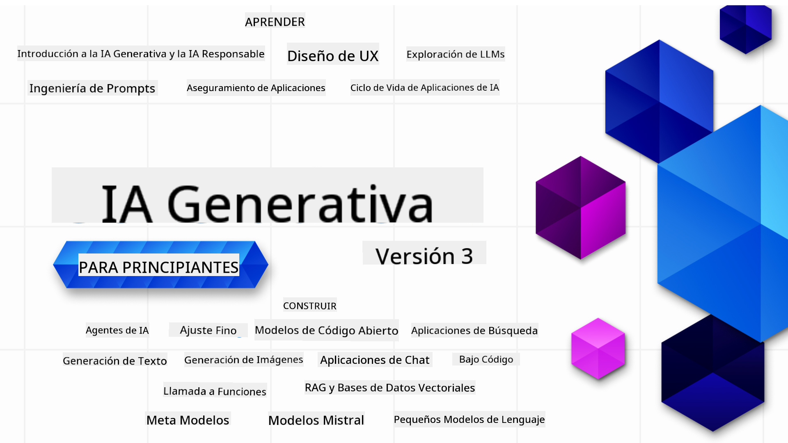

<!--
CO_OP_TRANSLATOR_METADATA:
{
  "original_hash": "ca2afa136ed9aca0634f39f51239746e",
  "translation_date": "2025-08-27T08:07:14+00:00",
  "source_file": "README.md",
  "language_code": "es"
}
-->

### 21 Lecciones que enseñan todo lo que necesitas saber para empezar a construir aplicaciones de IA Generativa

  
  
  
  
  

  
  
  

### 🌐 Soporte Multilenguaje

#### Soportado a través de GitHub Action (Automatizado y Siempre Actualizado)

[Francés](../fr/README.md) | [Español](./README.md) | [Alemán](../de/README.md) | [Ruso](../ru/README.md) | [Árabe](../ar/README.md) | [Persa (Farsi)](../fa/README.md) | [Urdu](../ur/README.md) | [Chino (Simplificado)](../zh/README.md) | [Chino (Tradicional, Macao)](../mo/README.md) | [Chino (Tradicional, Hong Kong)](../hk/README.md) | [Chino (Tradicional, Taiwán)](../tw/README.md) | [Japonés](../ja/README.md) | [Coreano](../ko/README.md) | [Hindi](../hi/README.md) | [Bengalí](../bn/README.md) | [Maratí](../mr/README.md) | [Nepalí](../ne/README.md) | [Panyabí (Gurmukhi)](../pa/README.md) | [Portugués (Portugal)](../pt/README.md) | [Portugués (Brasil)](../br/README.md) | [Italiano](../it/README.md) | [Lituano](../lt/README.md) | [Polaco](../pl/README.md) | [Turco](../tr/README.md) | [Griego](../el/README.md) | [Tailandés](../th/README.md) | [Sueco](../sv/README.md) | [Danés](../da/README.md) | [Noruego](../no/README.md) | [Finlandés](../fi/README.md) | [Holandés](../nl/README.md) | [Hebreo](../he/README.md) | [Vietnamita](../vi/README.md) | [Indonesio](../id/README.md) | [Malayo](../ms/README.md) | [Tagalo (Filipino)](../tl/README.md) | [Suajili](../sw/README.md) | [Húngaro](../hu/README.md) | [Checo](../cs/README.md) | [Eslovaco](../sk/README.md) | [Rumano](../ro/README.md) | [Búlgaro](../bg/README.md) | [Serbio (Cirílico)](../sr/README.md) | [Croata](../hr/README.md) | [Esloveno](../sl/README.md) | [Ucraniano](../uk/README.md) | [Birmano (Myanmar)](../my/README.md)

# IA Generativa para Principiantes (Versión 3) - Un Curso

Aprende los fundamentos para construir aplicaciones de IA Generativa con nuestro curso de 21 lecciones desarrollado por Microsoft Cloud Advocates.

## 🌱 Comenzando

Este curso tiene 21 lecciones. Cada lección cubre un tema específico, ¡así que empieza donde prefieras!

Las lecciones están etiquetadas como "Aprender" para explicar un concepto de IA Generativa o "Construir" para explicar un concepto con ejemplos de código en **Python** y **TypeScript** cuando sea posible.

Para desarrolladores .NET, revisa [IA Generativa para Principiantes (Edición .NET)](https://github.com/microsoft/Generative-AI-for-beginners-dotnet?WT.mc_id=academic-105485-koreyst).

Cada lección también incluye una sección de "Sigue Aprendiendo" con herramientas adicionales de aprendizaje.

## Lo que Necesitas
### Para ejecutar el código de este curso, puedes usar:
 - [Azure OpenAI Service](https://aka.ms/genai-beginners/azure-open-ai?WT.mc_id=academic-105485-koreyst) - **Lecciones:** "aoai-assignment"  
 - [GitHub Marketplace Model Catalog](https://aka.ms/genai-beginners/gh-models?WT.mc_id=academic-105485-koreyst) - **Lecciones:** "githubmodels"  
 - [OpenAI API](https://aka.ms/genai-beginners/open-ai?WT.mc_id=academic-105485-koreyst) - **Lecciones:** "oai-assignment"  

- Conocimientos básicos de Python o TypeScript son útiles - \*Para principiantes absolutos, revisa estos cursos de [Python](https://aka.ms/genai-beginners/python?WT.mc_id=academic-105485-koreyst) y [TypeScript](https://aka.ms/genai-beginners/typescript?WT.mc_id=academic-105485-koreyst).  
- Una cuenta de GitHub para [hacer un fork de este repositorio](https://aka.ms/genai-beginners/github?WT.mc_id=academic-105485-koreyst) en tu propia cuenta de GitHub.

Hemos creado una lección de **[Configuración del Curso](./00-course-setup/README.md?WT.mc_id=academic-105485-koreyst)** para ayudarte a configurar tu entorno de desarrollo.

No olvides [marcar con estrella (🌟) este repositorio](https://docs.github.com/en/get-started/exploring-projects-on-github/saving-repositories-with-stars?WT.mc_id=academic-105485-koreyst) para encontrarlo más fácilmente más tarde.

## 🧠 ¿Listo para Desplegar?

Si buscas ejemplos de código más avanzados, revisa nuestra [colección de Ejemplos de Código de IA Generativa](https://aka.ms/genai-beg-code?WT.mc_id=academic-105485-koreyst) en **Python** y **TypeScript**.

## 🗣️ Conoce a Otros Estudiantes, Obtén Soporte

Únete a nuestro [servidor oficial de Discord de Azure AI Foundry](https://aka.ms/genai-discord?WT.mc_id=academic-105485-koreyst) para conocer y conectar con otros estudiantes que toman este curso y obtener soporte.

Haz preguntas o comparte comentarios sobre el producto en nuestro [Foro de Desarrolladores de Azure AI Foundry](https://aka.ms/azureaifoundry/forum) en GitHub.

## 🚀 ¿Construyendo una Startup?

Visita [Microsoft for Startups](https://www.microsoft.com/startups) para descubrir cómo empezar a construir con créditos de Azure hoy.

## 🙏 ¿Quieres ayudar?

¿Tienes sugerencias o encontraste errores de ortografía o código? [Abre un problema](https://github.com/microsoft/generative-ai-for-beginners/issues?WT.mc_id=academic-105485-koreyst) o [Crea una solicitud de extracción](https://github.com/microsoft/generative-ai-for-beginners/pulls?WT.mc_id=academic-105485-koreyst).

## 📂 Cada lección incluye:

- Un breve video introductorio sobre el tema  
- Una lección escrita ubicada en el README  
- Ejemplos de código en Python y TypeScript compatibles con Azure OpenAI y OpenAI API  
- Enlaces a recursos adicionales para continuar aprendiendo  

## 🗃️ Lecciones

| #   | **Enlace a la Lección**                                                                                                                      | **Descripción**                                                                                 | **Video**                                                                   | **Aprendizaje Adicional**                                                      |
| --- | -------------------------------------------------------------------------------------------------------------------------------------------- | ----------------------------------------------------------------------------------------------- | --------------------------------------------------------------------------- | ------------------------------------------------------------------------------ |
| 00  | [Configuración del Curso](./00-course-setup/README.md?WT.mc_id=academic-105485-koreyst)                                                      | **Aprender:** Cómo configurar tu entorno de desarrollo                                          | Video Próximamente                                                          | [Aprender Más](https://aka.ms/genai-collection?WT.mc_id=academic-105485-koreyst) |
| 01  | [Introducción a la IA Generativa y los LLMs](./01-introduction-to-genai/README.md?WT.mc_id=academic-105485-koreyst)                          | **Aprender:** Entender qué es la IA Generativa y cómo funcionan los Modelos de Lenguaje Extenso (LLMs). | [Video](https://aka.ms/gen-ai-lesson-1-gh?WT.mc_id=academic-105485-koreyst) | [Aprender Más](https://aka.ms/genai-collection?WT.mc_id=academic-105485-koreyst) |
| 02  | [Explorando y comparando diferentes LLMs](./02-exploring-and-comparing-different-llms/README.md?WT.mc_id=academic-105485-koreyst)            | **Aprender:** Cómo seleccionar el modelo adecuado para tu caso de uso                           | [Video](https://aka.ms/gen-ai-lesson2-gh?WT.mc_id=academic-105485-koreyst)  | [Aprender Más](https://aka.ms/genai-collection?WT.mc_id=academic-105485-koreyst) |
| 03  | [Usando la IA Generativa de Forma Responsable](./03-using-generative-ai-responsibly/README.md?WT.mc_id=academic-105485-koreyst)              | **Aprender:** Cómo construir aplicaciones de IA Generativa de manera responsable                | [Video](https://aka.ms/gen-ai-lesson3-gh?WT.mc_id=academic-105485-koreyst)  | [Aprender Más](https://aka.ms/genai-collection?WT.mc_id=academic-105485-koreyst) |
| 04  | [Entendiendo los Fundamentos de la Ingeniería de Prompts](./04-prompt-engineering-fundamentals/README.md?WT.mc_id=academic-105485-koreyst)   | **Aprender:** Mejores prácticas prácticas de Ingeniería de Prompts                              | [Video](https://aka.ms/gen-ai-lesson4-gh?WT.mc_id=academic-105485-koreyst)  | [Aprender Más](https://aka.ms/genai-collection?WT.mc_id=academic-105485-koreyst) |
| 05  | [Creando Prompts Avanzados](./05-advanced-prompts/README.md?WT.mc_id=academic-105485-koreyst)                                                | **Aprender:** Cómo aplicar técnicas de ingeniería de prompts que mejoren los resultados         | [Video](https://aka.ms/gen-ai-lesson5-gh?WT.mc_id=academic-105485-koreyst)  | [Aprender Más](https://aka.ms/genai-collection?WT.mc_id=academic-105485-koreyst) |
| 06  | [Construyendo Aplicaciones de Generación de Texto](./06-text-generation-apps/README.md?WT.mc_id=academic-105485-koreyst)                     | **Construir:** Una aplicación de generación de texto utilizando Azure OpenAI / OpenAI API       | [Video](https://aka.ms/gen-ai-lesson6-gh?WT.mc_id=academic-105485-koreyst)  | [Más Información](https://aka.ms/genai-collection?WT.mc_id=academic-105485-koreyst) |
| 07  | [Construyendo Aplicaciones de Chat](./07-building-chat-applications/README.md?WT.mc_id=academic-105485-koreyst)                              | **Construir:** Técnicas para construir e integrar aplicaciones de chat de manera eficiente.     | [Video](https://aka.ms/gen-ai-lessons7-gh?WT.mc_id=academic-105485-koreyst) | [Más Información](https://aka.ms/genai-collection?WT.mc_id=academic-105485-koreyst) |
| 08  | [Construyendo Aplicaciones de Búsqueda con Bases de Datos Vectoriales](./08-building-search-applications/README.md?WT.mc_id=academic-105485-koreyst) | **Construir:** Una aplicación de búsqueda que utiliza Embeddings para buscar datos.            | [Video](https://aka.ms/gen-ai-lesson8-gh?WT.mc_id=academic-105485-koreyst)  | [Más Información](https://aka.ms/genai-collection?WT.mc_id=academic-105485-koreyst) |
| 09  | [Construyendo Aplicaciones de Generación de Imágenes](./09-building-image-applications/README.md?WT.mc_id=academic-105485-koreyst)           | **Construir:** Una aplicación de generación de imágenes                                         | [Video](https://aka.ms/gen-ai-lesson9-gh?WT.mc_id=academic-105485-koreyst)  | [Más Información](https://aka.ms/genai-collection?WT.mc_id=academic-105485-koreyst) |
| 10  | [Construyendo Aplicaciones de IA con Herramientas de Bajo Código](./10-building-low-code-ai-applications/README.md?WT.mc_id=academic-105485-koreyst) | **Construir:** Una aplicación de IA Generativa utilizando herramientas de Bajo Código           | [Video](https://aka.ms/gen-ai-lesson10-gh?WT.mc_id=academic-105485-koreyst) | [Más Información](https://aka.ms/genai-collection?WT.mc_id=academic-105485-koreyst) |
| 11  | [Integrando Aplicaciones Externas con Llamadas a Funciones](./11-integrating-with-function-calling/README.md?WT.mc_id=academic-105485-koreyst) | **Construir:** Qué es la llamada a funciones y sus casos de uso en aplicaciones                | [Video](https://aka.ms/gen-ai-lesson11-gh?WT.mc_id=academic-105485-koreyst) | [Más Información](https://aka.ms/genai-collection?WT.mc_id=academic-105485-koreyst) |
| 12  | [Diseñando Experiencia de Usuario (UX) para Aplicaciones de IA](./12-designing-ux-for-ai-applications/README.md?WT.mc_id=academic-105485-koreyst) | **Aprender:** Cómo aplicar principios de diseño UX al desarrollar aplicaciones de IA Generativa | [Video](https://aka.ms/gen-ai-lesson12-gh?WT.mc_id=academic-105485-koreyst) | [Más Información](https://aka.ms/genai-collection?WT.mc_id=academic-105485-koreyst) |
| 13  | [Asegurando tus Aplicaciones de IA Generativa](./13-securing-ai-applications/README.md?WT.mc_id=academic-105485-koreyst)                     | **Aprender:** Las amenazas y riesgos para los sistemas de IA y métodos para asegurar estos sistemas. | [Video](https://aka.ms/gen-ai-lesson13-gh?WT.mc_id=academic-105485-koreyst) | [Más Información](https://aka.ms/genai-collection?WT.mc_id=academic-105485-koreyst) |
| 14  | [El Ciclo de Vida de las Aplicaciones de IA Generativa](./14-the-generative-ai-application-lifecycle/README.md?WT.mc_id=academic-105485-koreyst) | **Aprender:** Las herramientas y métricas para gestionar el Ciclo de Vida de los LLM y LLMOps  | [Video](https://aka.ms/gen-ai-lesson14-gh?WT.mc_id=academic-105485-koreyst) | [Más Información](https://aka.ms/genai-collection?WT.mc_id=academic-105485-koreyst) |
| 15  | [Generación Aumentada por Recuperación (RAG) y Bases de Datos Vectoriales](./15-rag-and-vector-databases/README.md?WT.mc_id=academic-105485-koreyst) | **Construir:** Una aplicación utilizando un marco RAG para recuperar embeddings de Bases de Datos Vectoriales | [Video](https://aka.ms/gen-ai-lesson15-gh?WT.mc_id=academic-105485-koreyst) | [Más Información](https://aka.ms/genai-collection?WT.mc_id=academic-105485-koreyst) |
| 16  | [Modelos de Código Abierto y Hugging Face](./16-open-source-models/README.md?WT.mc_id=academic-105485-koreyst)                               | **Construir:** Una aplicación utilizando modelos de código abierto disponibles en Hugging Face  | [Video](https://aka.ms/gen-ai-lesson16-gh?WT.mc_id=academic-105485-koreyst) | [Más Información](https://aka.ms/genai-collection?WT.mc_id=academic-105485-koreyst) |
| 17  | [Agentes de IA](./17-ai-agents/README.md?WT.mc_id=academic-105485-koreyst)                                                                  | **Construir:** Una aplicación utilizando un marco de Agentes de IA                              | [Video](https://aka.ms/gen-ai-lesson17-gh?WT.mc_id=academic-105485-koreyst) | [Más Información](https://aka.ms/genai-collection?WT.mc_id=academic-105485-koreyst) |
| 18  | [Ajuste Fino de Modelos de Lenguaje (LLMs)](./18-fine-tuning/README.md?WT.mc_id=academic-105485-koreyst)                                    | **Aprender:** Qué es, por qué y cómo realizar el ajuste fino de LLMs                            | [Video](https://aka.ms/gen-ai-lesson18-gh?WT.mc_id=academic-105485-koreyst) | [Más Información](https://aka.ms/genai-collection?WT.mc_id=academic-105485-koreyst) |
| 19  | [Construyendo con Modelos de Lenguaje Pequeños (SLMs)](./19-slm/README.md?WT.mc_id=academic-105485-koreyst)                                 | **Aprender:** Los beneficios de construir con Modelos de Lenguaje Pequeños                      | Video Próximamente | [Más Información](https://aka.ms/genai-collection?WT.mc_id=academic-105485-koreyst) |
| 20  | [Construyendo con Modelos Mistral](./20-mistral/README.md?WT.mc_id=academic-105485-koreyst)                                                | **Aprender:** Las características y diferencias de los Modelos de la Familia Mistral            | Video Próximamente | [Más Información](https://aka.ms/genai-collection?WT.mc_id=academic-105485-koreyst) |
| 21  | [Construyendo con Modelos Meta](./21-meta/README.md?WT.mc_id=academic-105485-koreyst)                                                      | **Aprender:** Las características y diferencias de los Modelos de la Familia Meta               | Video Próximamente | [Más Información](https://aka.ms/genai-collection?WT.mc_id=academic-105485-koreyst) |

### 🌟 Agradecimientos especiales

Agradecimientos especiales a [**John Aziz**](https://www.linkedin.com/in/john0isaac/) por crear todas las GitHub Actions y flujos de trabajo.

[**Bernhard Merkle**](https://www.linkedin.com/in/bernhard-merkle-738b73/) por realizar contribuciones clave en cada lección para mejorar la experiencia de aprendizaje y de código.

## 🎒 Otros Cursos

¡Nuestro equipo produce otros cursos! Échales un vistazo:

- [**NUEVO** Protocolo de Contexto de Modelos para Principiantes](https://github.com/microsoft/mcp-for-beginners)
- [Agentes de IA para Principiantes](https://github.com/microsoft/ai-agents-for-beginners)
- [IA Generativa para Principiantes usando .NET](https://github.com/microsoft/Generative-AI-for-beginners-dotnet)
- [IA Generativa para Principiantes usando JavaScript](https://aka.ms/genai-js-course)
- [IA Generativa para Principiantes usando Java](https://aka.ms/genaijava)
- [ML para Principiantes](https://aka.ms/ml-beginners)
- [Ciencia de Datos para Principiantes](https://aka.ms/datascience-beginners)
- [IA para Principiantes](https://aka.ms/ai-beginners)
- [Ciberseguridad para Principiantes](https://github.com/microsoft/Security-101)
- [Desarrollo Web para Principiantes](https://aka.ms/webdev-beginners)
- [IoT para Principiantes](https://aka.ms/iot-beginners)
- [Desarrollo XR para Principiantes](https://github.com/microsoft/xr-development-for-beginners)
- [Dominando GitHub Copilot para Programación en Pareja con IA](https://aka.ms/GitHubCopilotAI)
- [Dominando GitHub Copilot para Desarrolladores de C#/.NET](https://github.com/microsoft/mastering-github-copilot-for-dotnet-csharp-developers)
- [Elige tu Propia Aventura con Copilot](https://github.com/microsoft/CopilotAdventures)

---

**Descargo de responsabilidad**:  
Este documento ha sido traducido utilizando el servicio de traducción automática [Co-op Translator](https://github.com/Azure/co-op-translator). Si bien nos esforzamos por lograr precisión, tenga en cuenta que las traducciones automáticas pueden contener errores o imprecisiones. El documento original en su idioma nativo debe considerarse como la fuente autorizada. Para información crítica, se recomienda una traducción profesional realizada por humanos. No nos hacemos responsables de malentendidos o interpretaciones erróneas que puedan surgir del uso de esta traducción.