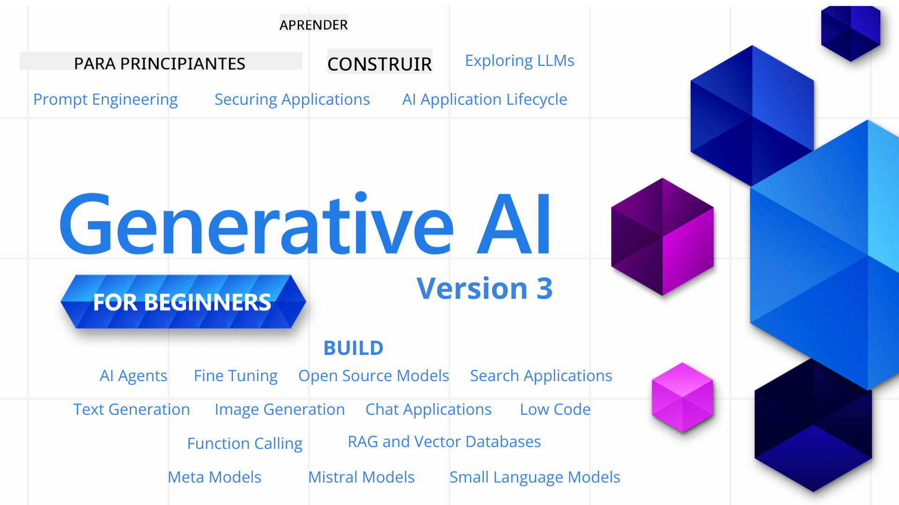

<!--
CO_OP_TRANSLATOR_METADATA:
{
  "original_hash": "c2ee25895ebbfa1a52868bb6eab686fc",
  "translation_date": "2025-05-19T10:51:50+00:00",
  "source_file": "README.md",
  "language_code": "es"
}
-->

### 21 Lecciones que enseñan todo lo que necesitas saber para comenzar a construir aplicaciones de IA Generativa

### 🌐 Soporte Multilingüe

#### Soportado a través de GitHub Action (Automatizado y Siempre Actualizado)
[Francés](../fr/README.md) | [Español](./README.md) | [Alemán](../de/README.md) | [Ruso](../ru/README.md) | [Árabe](../ar/README.md) | [Persa (Farsi)](../fa/README.md) | [Urdu](../ur/README.md) | [Chino (Simplificado)](../zh/README.md) | [Chino (Tradicional, Macao)](../mo/README.md) | [Chino (Tradicional, Hong Kong)](../hk/README.md) | [Chino (Tradicional, Taiwán)](../tw/README.md) | [Japonés](../ja/README.md) | [Coreano](../ko/README.md) | [Hindi](../hi/README.md) | [Bengalí](../bn/README.md) | [Marathi](../mr/README.md) | [Nepalí](../ne/README.md) | [Punjabi (Gurmukhi)](../pa/README.md) | [Portugués (Portugal)](../pt/README.md) | [Portugués (Brasil)](../br/README.md) | [Italiano](../it/README.md) | [Polaco](../pl/README.md) | [Turco](../tr/README.md) | [Griego](../el/README.md) | [Tailandés](../th/README.md) | [Sueco](../sv/README.md) | [Danés](../da/README.md) | [Noruego](../no/README.md) | [Finlandés](../fi/README.md) | [Holandés](../nl/README.md) | [Hebreo](../he/README.md) | [Vietnamita](../vi/README.md) | [Indonesio](../id/README.md) | [Malayo](../ms/README.md) | [Tagalo (Filipino)](../tl/README.md) | [Suajili](../sw/README.md) | [Húngaro](../hu/README.md) | [Checo](../cs/README.md) | [Eslovaco](../sk/README.md) | [Rumano](../ro/README.md) | [Búlgaro](../bg/README.md) | [Serbio (Cirílico)](../sr/README.md) | [Croata](../hr/README.md) | [Esloveno](../sl/README.md)
# IA Generativa para Principiantes (Versión 3) - Un Curso

Aprende los fundamentos para construir aplicaciones de IA Generativa con nuestro curso completo de 21 lecciones de los Defensores de la Nube de Microsoft.

## 🌱 Comenzando

Este curso tiene 21 lecciones. Cada lección cubre su propio tema, ¡así que empieza donde quieras!

Las lecciones están etiquetadas como lecciones "Aprender" que explican un concepto de IA Generativa o lecciones "Construir" que explican un concepto y ejemplos de código en **Python** y **TypeScript** cuando sea posible.

Para desarrolladores de .NET revisa [IA Generativa para Principiantes (Edición .NET)](https://github.com/microsoft/Generative-AI-for-beginners-dotnet?WT.mc_id=academic-105485-koreyst)!

Cada lección también incluye una sección "Sigue Aprendiendo" con herramientas de aprendizaje adicionales.

## Lo Que Necesitas
### Para ejecutar el código de este curso, puedes usar cualquiera de los siguientes: 
 - [Servicio Azure OpenAI](https://aka.ms/genai-beginners/azure-open-ai?WT.mc_id=academic-105485-koreyst) - **Lecciones:** "aoai-assignment"
 - [Catálogo de Modelos del Marketplace de GitHub](https://aka.ms/genai-beginners/gh-models?WT.mc_id=academic-105485-koreyst) - **Lecciones:** "githubmodels"
 - [API de OpenAI](https://aka.ms/genai-beginners/open-ai?WT.mc_id=academic-105485-koreyst) - **Lecciones:** "oai-assignment" 
   
- Conocimientos básicos de Python o TypeScript son útiles - \*Para principiantes absolutos revisa estos cursos de [Python](https://aka.ms/genai-beginners/python?WT.mc_id=academic-105485-koreyst) y [TypeScript](https://aka.ms/genai-beginners/typescript?WT.mc_id=academic-105485-koreyst)
- Una cuenta de GitHub para [hacer fork a este repositorio completo](https://aka.ms/genai-beginners/github?WT.mc_id=academic-105485-koreyst) a tu propia cuenta de GitHub

Hemos creado una lección de **[Configuración del Curso](./00-course-setup/README.md?WT.mc_id=academic-105485-koreyst)** para ayudarte a configurar tu entorno de desarrollo.

No olvides [marcar con estrella (🌟) este repositorio](https://docs.github.com/en/get-started/exploring-projects-on-github/saving-repositories-with-stars?WT.mc_id=academic-105485-koreyst) para encontrarlo más fácilmente después.

## 🧠 ¿Listo para Desplegar?

Si buscas ejemplos de código más avanzados, revisa nuestra [colección de Ejemplos de Código de IA Generativa](https://aka.ms/genai-beg-code?WT.mc_id=academic-105485-koreyst) en **Python** y **TypeScript**.

## 🗣️ Conoce a Otros Estudiantes, Obtén Apoyo

Únete a nuestro [servidor oficial de Discord de Azure AI Foundry](https://aka.ms/genai-discord?WT.mc_id=academic-105485-koreyst) para conocer y conectar con otros estudiantes que toman este curso y obtener apoyo.

Haz preguntas o comparte comentarios sobre productos en nuestro [Foro de Desarrolladores de Azure AI Foundry](https://aka.ms/azureaifoundry/forum) en Github.

## 🚀 ¿Estás Construyendo una Startup?

Regístrate en [Microsoft for Startups Founders Hub](https://aka.ms/genai-foundershub?WT.mc_id=academic-105485-koreyst) para recibir **créditos gratuitos de OpenAI** y hasta **$150k en créditos de Azure para acceder a modelos de OpenAI a través de los Servicios Azure OpenAI**.

## 🙏 ¿Quieres ayudar?

¿Tienes sugerencias o encontraste errores de ortografía o código? [Levanta un problema](https://github.com/microsoft/generative-ai-for-beginners/issues?WT.mc_id=academic-105485-koreyst) o [Crea una solicitud de extracción](https://github.com/microsoft/generative-ai-for-beginners/pulls?WT.mc_id=academic-105485-koreyst)

## 📂 Cada lección incluye:

- Un breve video de introducción al tema
- Una lección escrita ubicada en el README
- Ejemplos de código en Python y TypeScript que soportan Azure OpenAI y la API de OpenAI
- Enlaces a recursos adicionales para continuar tu aprendizaje

## 🗃️ Lecciones

| #   | **Enlace a la Lección**                                                                                                                      | **Descripción**                                                                                 | **Video**                                                                   | **Aprendizaje Adicional**                                                     |
| --- | -------------------------------------------------------------------------------------------------------------------------------------------- | ----------------------------------------------------------------------------------------------- | --------------------------------------------------------------------------- | ------------------------------------------------------------------------------ |
| 00  | [Configuración del Curso](./00-course-setup/README.md?WT.mc_id=academic-105485-koreyst)                                                      | **Aprender:** Cómo Configurar Tu Entorno de Desarrollo                                          | Video Próximamente                                                          | [Aprende Más](https://aka.ms/genai-collection?WT.mc_id=academic-105485-koreyst) |
| 01  | [Introducción a la IA Generativa y LLMs](./01-introduction-to-genai/README.md?WT.mc_id=academic-105485-koreyst)                              | **Aprender:** Comprender qué es la IA Generativa y cómo funcionan los Modelos de Lenguaje Extensos (LLMs). | [Video](https://aka.ms/gen-ai-lesson-1-gh?WT.mc_id=academic-105485-koreyst) | [Aprende Más](https://aka.ms/genai-collection?WT.mc_id=academic-105485-koreyst) |
| 02  | [Explorando y comparando diferentes LLMs](./02-exploring-and-comparing-different-llms/README.md?WT.mc_id=academic-105485-koreyst)             | **Aprender:** Cómo seleccionar el modelo adecuado para tu caso de uso                            | [Video](https://aka.ms/gen-ai-lesson2-gh?WT.mc_id=academic-105485-koreyst)  | [Aprende Más](https://aka.ms/genai-collection?WT.mc_id=academic-105485-koreyst) |
| 03  | [Usando IA Generativa Responsablemente](./03-using-generative-ai-responsibly/README.md?WT.mc_id=academic-105485-koreyst)                     | **Aprender:** Cómo construir aplicaciones de IA Generativa de manera responsable                 | [Video](https://aka.ms/gen-ai-lesson3-gh?WT.mc_id=academic-105485-koreyst)  | [Aprende Más](https://aka.ms/genai-collection?WT.mc_id=academic-105485-koreyst) |
| 04  | [Comprendiendo los Fundamentos de la Ingeniería de Prompts](./04-prompt-engineering-fundamentals/README.md?WT.mc_id=academic-105485-koreyst) | **Aprender:** Mejores Prácticas Prácticas de Ingeniería de Prompts                               | [Video](https://aka.ms/gen-ai-lesson4-gh?WT.mc_id=academic-105485-koreyst)  | [Aprende Más](https://aka.ms/genai-collection?WT.mc_id=academic-105485-koreyst) |
| 05  | [Creando Prompts Avanzados](./05-advanced-prompts/README.md?WT.mc_id=academic-105485-koreyst)                                                | **Aprende:** Cómo aplicar técnicas de ingeniería de prompts que mejoran el resultado de tus prompts. | [Video](https://aka.ms/gen-ai-lesson5-gh?WT.mc_id=academic-105485-koreyst)  | [Más Información](https://aka.ms/genai-collection?WT.mc_id=academic-105485-koreyst) |
| 06  | [Construyendo Aplicaciones de Generación de Texto](./06-text-generation-apps/README.md?WT.mc_id=academic-105485-koreyst)                                | **Construye:** Una aplicación de generación de texto usando Azure OpenAI / OpenAI API                                | [Video](https://aka.ms/gen-ai-lesson6-gh?WT.mc_id=academic-105485-koreyst)  | [Más Información](https://aka.ms/genai-collection?WT.mc_id=academic-105485-koreyst) |
| 07  | [Construyendo Aplicaciones de Chat](./07-building-chat-applications/README.md?WT.mc_id=academic-105485-koreyst)                                     | **Construye:** Técnicas para construir e integrar aplicaciones de chat eficientemente.               | [Video](https://aka.ms/gen-ai-lessons7-gh?WT.mc_id=academic-105485-koreyst) | [Más Información](https://aka.ms/genai-collection?WT.mc_id=academic-105485-koreyst) |
| 08  | [Construyendo Aplicaciones de Búsqueda con Bases de Datos Vectoriales](./08-building-search-applications/README.md?WT.mc_id=academic-105485-koreyst)                        | **Construye:** Una aplicación de búsqueda que usa Embeddings para buscar datos.                        | [Video](https://aka.ms/gen-ai-lesson8-gh?WT.mc_id=academic-105485-koreyst)  | [Más Información](https://aka.ms/genai-collection?WT.mc_id=academic-105485-koreyst) |
| 09  | [Construyendo Aplicaciones de Generación de Imágenes](./09-building-image-applications/README.md?WT.mc_id=academic-105485-koreyst)                        | **Construye:** Una aplicación de generación de imágenes                                                       | [Video](https://aka.ms/gen-ai-lesson9-gh?WT.mc_id=academic-105485-koreyst)  | [Más Información](https://aka.ms/genai-collection?WT.mc_id=academic-105485-koreyst) |
| 10  | [Construyendo Aplicaciones de IA de Bajo Código](./10-building-low-code-ai-applications/README.md?WT.mc_id=academic-105485-koreyst)                       | **Construye:** Una aplicación de IA Generativa usando herramientas de Bajo Código                                     | [Video](https://aka.ms/gen-ai-lesson10-gh?WT.mc_id=academic-105485-koreyst) | [Más Información](https://aka.ms/genai-collection?WT.mc_id=academic-105485-koreyst) |
| 11  | [Integrando Aplicaciones Externas con Llamadas a Funciones](./11-integrating-with-function-calling/README.md?WT.mc_id=academic-105485-koreyst) | **Construye:** Qué es la llamada a funciones y sus casos de uso para aplicaciones                          | [Video](https://aka.ms/gen-ai-lesson11-gh?WT.mc_id=academic-105485-koreyst) | [Más Información](https://aka.ms/genai-collection?WT.mc_id=academic-105485-koreyst) |
| 12  | [Diseñando UX para Aplicaciones de IA](./12-designing-ux-for-ai-applications/README.md?WT.mc_id=academic-105485-koreyst)                         | **Aprende:** Cómo aplicar principios de diseño UX al desarrollar aplicaciones de IA Generativa         | [Video](https://aka.ms/gen-ai-lesson12-gh?WT.mc_id=academic-105485-koreyst) | [Más Información](https://aka.ms/genai-collection?WT.mc_id=academic-105485-koreyst) |
| 13  | [Asegurando tus Aplicaciones de IA Generativa](./13-securing-ai-applications/README.md?WT.mc_id=academic-105485-koreyst)                         | **Aprende:** Las amenazas y riesgos para los sistemas de IA y métodos para asegurar estos sistemas.             | [Video](https://aka.ms/gen-ai-lesson13-gh?WT.mc_id=academic-105485-koreyst) | [Más Información](https://aka.ms/genai-collection?WT.mc_id=academic-105485-koreyst) |
| 14  | [El Ciclo de Vida de las Aplicaciones de IA Generativa](./14-the-generative-ai-application-lifecycle/README.md?WT.mc_id=academic-105485-koreyst)           | **Aprende:** Las herramientas y métricas para gestionar el Ciclo de Vida de LLM y LLMOps                         | [Video](https://aka.ms/gen-ai-lesson14-gh?WT.mc_id=academic-105485-koreyst) | [Más Información](https://aka.ms/genai-collection?WT.mc_id=academic-105485-koreyst) |
| 15  | [Recuperación Aumentada por Generación (RAG) y Bases de Datos Vectoriales](./15-rag-and-vector-databases/README.md?WT.mc_id=academic-105485-koreyst) | **Construir:** Una aplicación usando un marco de RAG para recuperar incrustaciones de bases de datos vectoriales | [Video](https://aka.ms/gen-ai-lesson15-gh?WT.mc_id=academic-105485-koreyst) | [Más información](https://aka.ms/genai-collection?WT.mc_id=academic-105485-koreyst) |
| 16  | [Modelos de Código Abierto y Hugging Face](./16-open-source-models/README.md?WT.mc_id=academic-105485-koreyst) | **Construir:** Una aplicación usando modelos de código abierto disponibles en Hugging Face | [Video](https://aka.ms/gen-ai-lesson16-gh?WT.mc_id=academic-105485-koreyst) | [Más información](https://aka.ms/genai-collection?WT.mc_id=academic-105485-koreyst) |
| 17  | [Agentes de IA](./17-ai-agents/README.md?WT.mc_id=academic-105485-koreyst) | **Construir:** Una aplicación usando un marco de agente de IA | [Video](https://aka.ms/gen-ai-lesson17-gh?WT.mc_id=academic-105485-koreyst) | [Más información](https://aka.ms/genai-collection?WT.mc_id=academic-105485-koreyst) |
| 18  | [Ajuste fino de LLMs](./18-fine-tuning/README.md?WT.mc_id=academic-105485-koreyst) | **Aprender:** Qué es, por qué y cómo ajustar finamente los LLMs | [Video](https://aka.ms/gen-ai-lesson18-gh?WT.mc_id=academic-105485-koreyst) | [Más información](https://aka.ms/genai-collection?WT.mc_id=academic-105485-koreyst) |
| 19  | [Construcción con SLMs](./19-slm/README.md?WT.mc_id=academic-105485-koreyst) | **Aprender:** Los beneficios de construir con Modelos de Lenguaje Pequeños | Video próximamente | [Más información](https://aka.ms/genai-collection?WT.mc_id=academic-105485-koreyst) |
| 20  | [Construcción con Modelos Mistral](./20-mistral/README.md?WT.mc_id=academic-105485-koreyst) | **Aprender:** Las características y diferencias de los Modelos de la Familia Mistral | Video próximamente | [Más información](https://aka.ms/genai-collection?WT.mc_id=academic-105485-koreyst) |
| 21  | [Construcción con Modelos Meta](./21-meta/README.md?WT.mc_id=academic-105485-koreyst) | **Aprender:** Las características y diferencias de los Modelos de la Familia Meta | Video próximamente | [Más información](https://aka.ms/genai-collection?WT.mc_id=academic-105485-koreyst) |

### 🌟 Agradecimientos especiales

Agradecimientos especiales a [**John Aziz**](https://www.linkedin.com/in/john0isaac/) por crear todas las acciones de GitHub y flujos de trabajo

[**Bernhard Merkle**](https://www.linkedin.com/in/bernhard-merkle-738b73/) por hacer contribuciones clave a cada lección para mejorar la experiencia del aprendiz y del código.

## 🎒 Otros Cursos

¡Nuestro equipo produce otros cursos! Echa un vistazo:

- [**NUEVO** Agentes de IA para Principiantes](https://github.com/microsoft/ai-agents-for-beginners?WT.mc_id=academic-105485-koreyst)
- [**NUEVO** IA Generativa para Principiantes usando .NET](https://github.com/microsoft/Generative-AI-for-beginners-dotnet?WT.mc_id=academic-105485-koreyst)
- [**NUEVO** IA Generativa para Principiantes usando JavaScript](https://aka.ms/genai-js-course?WT.mc_id=academic-105485-koreyst)
- [ML para Principiantes](https://aka.ms/ml-beginners?WT.mc_id=academic-105485-koreyst)
- [Ciencia de Datos para Principiantes](https://aka.ms/datascience-beginners?WT.mc_id=academic-105485-koreyst)
- [IA para Principiantes](https://aka.ms/ai-beginners?WT.mc_id=academic-105485-koreyst)
- [Ciberseguridad para Principiantes](https://github.com/microsoft/Security-101??WT.mc_id=academic-96948-sayoung)
- [Desarrollo Web para Principiantes](https://aka.ms/webdev-beginners?WT.mc_id=academic-105485-koreyst)
- [IoT para Principiantes](https://aka.ms/iot-beginners?WT.mc_id=academic-105485-koreyst)
- [Desarrollo XR para Principiantes](https://github.com/microsoft/xr-development-for-beginners?WT.mc_id=academic-105485-koreyst)
- [Dominando GitHub Copilot para Programación en Pareja con IA](https://aka.ms/GitHubCopilotAI?WT.mc_id=academic-105485-koreyst)
- [Dominando GitHub Copilot para Desarrolladores C#/.NET](https://github.com/microsoft/mastering-github-copilot-for-dotnet-csharp-developers?WT.mc_id=academic-105485-koreyst)
- [Elige Tu Propia Aventura con Copilot](https://github.com/microsoft/CopilotAdventures?WT.mc_id=academic-105485-koreyst)

**Descargo de responsabilidad**:  
Este documento ha sido traducido utilizando el servicio de traducción automática [Co-op Translator](https://github.com/Azure/co-op-translator). Si bien nos esforzamos por lograr precisión, tenga en cuenta que las traducciones automáticas pueden contener errores o imprecisiones. El documento original en su idioma nativo debe considerarse la fuente autorizada. Para información crítica, se recomienda una traducción profesional humana. No nos hacemos responsables de ningún malentendido o interpretación errónea que surja del uso de esta traducción.