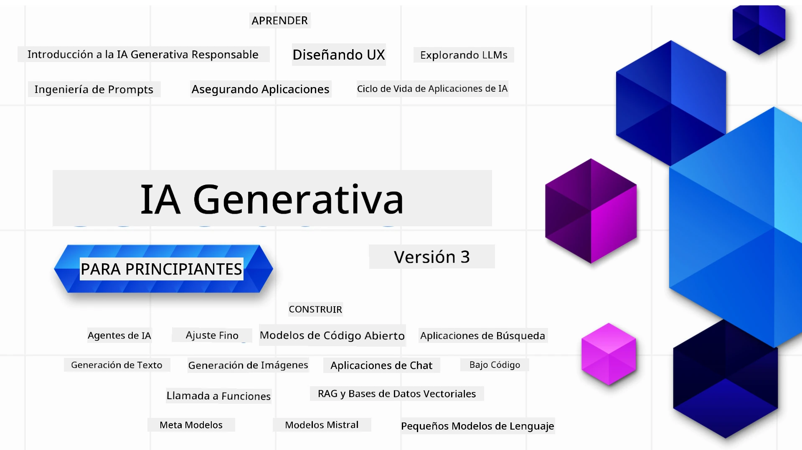

### 21 Lecciones que enseñan todo lo que necesitas saber para comenzar a construir aplicaciones de Inteligencia Artificial Generativa

[](https://github.com/microsoft/Generative-AI-For-Beginners/blob/master/LICENSE?WT.mc_id=academic-105485-koreyst)
[](https://GitHub.com/microsoft/Generative-AI-For-Beginners/graphs/contributors/?WT.mc_id=academic-105485-koreyst)
[](https://GitHub.com/microsoft/Generative-AI-For-Beginners/issues/?WT.mc_id=academic-105485-koreyst)
[](https://GitHub.com/microsoft/Generative-AI-For-Beginners/pulls/?WT.mc_id=academic-105485-koreyst)
[](http://makeapullrequest.com?WT.mc_id=academic-105485-koreyst)

[](https://GitHub.com/microsoft/Generative-AI-For-Beginners/watchers/?WT.mc_id=academic-105485-koreyst)
[](https://GitHub.com/microsoft/Generative-AI-For-Beginners/network/?WT.mc_id=academic-105485-koreyst)
[](https://GitHub.com/microsoft/Generative-AI-For-Beginners/stargazers/?WT.mc_id=academic-105485-koreyst)

[](https://discord.gg/nTYy5BXMWG)

### 🌐 Soporte Multilingüe

#### Soportado mediante GitHub Action (Automatizado y Siempre Actualizado)

<!-- CO-OP TRANSLATOR LANGUAGES TABLE START -->
[Árabe](../ar/README.md) | [Bengalí](../bn/README.md) | [Búlgaro](../bg/README.md) | [Birmano (Myanmar)](../my/README.md) | [Chino (Simplificado)](../zh-CN/README.md) | [Chino (Tradicional, Hong Kong)](../zh-HK/README.md) | [Chino (Tradicional, Macao)](../zh-MO/README.md) | [Chino (Tradicional, Taiwán)](../zh-TW/README.md) | [Croata](../hr/README.md) | [Checo](../cs/README.md) | [Danés](../da/README.md) | [Holandés](../nl/README.md) | [Estonio](../et/README.md) | [Finlandés](../fi/README.md) | [Francés](../fr/README.md) | [Alemán](../de/README.md) | [Griego](../el/README.md) | [Hebreo](../he/README.md) | [Hindi](../hi/README.md) | [Húngaro](../hu/README.md) | [Indonesio](../id/README.md) | [Italiano](../it/README.md) | [Japonés](../ja/README.md) | [Kannada](../kn/README.md) | [Coreano](../ko/README.md) | [Lituano](../lt/README.md) | [Malayo](../ms/README.md) | [Malayalam](../ml/README.md) | [Marathi](../mr/README.md) | [Nepalí](../ne/README.md) | [Pidgin Nigeriano](../pcm/README.md) | [Noruego](../no/README.md) | [Persa (Farsi)](../fa/README.md) | [Polaco](../pl/README.md) | [Portugués (Brasil)](../pt-BR/README.md) | [Portugués (Portugal)](../pt-PT/README.md) | [Punjabi (Gurmukhi)](../pa/README.md) | [Rumano](../ro/README.md) | [Ruso](../ru/README.md) | [Serbio (Cirílico)](../sr/README.md) | [Eslovaco](../sk/README.md) | [Esloveno](../sl/README.md) | [Español](./README.md) | [Swahili](../sw/README.md) | [Sueco](../sv/README.md) | [Tagalo (Filipino)](../tl/README.md) | [Tamil](../ta/README.md) | [Telugu](../te/README.md) | [Tailandés](../th/README.md) | [Turco](../tr/README.md) | [Ucraniano](../uk/README.md) | [Urdu](../ur/README.md) | [Vietnamita](../vi/README.md)

> **¿Prefieres Clonar Localmente?**

> Este repositorio incluye más de 50 traducciones de idiomas, lo que aumenta significativamente el tamaño de la descarga. Para clonar sin las traducciones, usa sparse checkout:
> ```bash
> git clone --filter=blob:none --sparse https://github.com/microsoft/generative-ai-for-beginners.git
> cd generative-ai-for-beginners
> git sparse-checkout set --no-cone '/*' '!translations' '!translated_images'
> ```
> Esto te da todo lo que necesitas para completar el curso con una descarga mucho más rápida.
<!-- CO-OP TRANSLATOR LANGUAGES TABLE END -->

# Inteligencia Artificial Generativa para Principiantes (Versión 3) - Un Curso

Aprende los fundamentos para construir aplicaciones de Inteligencia Artificial Generativa con nuestro curso de 21 lecciones impartido por Microsoft Cloud Advocates.

## 🌱 Comenzando

Este curso tiene 21 lecciones. Cada lección cubre su propio tema, ¡así que comienza por donde prefieras!

Las lecciones están etiquetadas como lecciones "Aprender" que explican un concepto de Inteligencia Artificial Generativa o "Construir" que explican un concepto y ejemplos de código en **Python** y **TypeScript** cuando es posible.

Para desarrolladores .NET revisa [Generative AI for Beginners (.NET Edition)](https://github.com/microsoft/Generative-AI-for-beginners-dotnet?WT.mc_id=academic-105485-koreyst)!

Cada lección también incluye una sección "Seguir aprendiendo" con herramientas adicionales para continuar tu aprendizaje.

## Qué necesitas
### Para ejecutar el código de este curso, puedes usar: 
 - [Azure OpenAI Service](https://aka.ms/genai-beginners/azure-open-ai?WT.mc_id=academic-105485-koreyst) - **Lecciones:** "aoai-assignment"
 - [GitHub Marketplace Model Catalog](https://aka.ms/genai-beginners/gh-models?WT.mc_id=academic-105485-koreyst) - **Lecciones:** "githubmodels"
 - [OpenAI API](https://aka.ms/genai-beginners/open-ai?WT.mc_id=academic-105485-koreyst) - **Lecciones:** "oai-assignment" 
   
- Conocimientos básicos de Python o TypeScript son útiles - \*Para principiantes absolutos revisa estos cursos de [Python](https://aka.ms/genai-beginners/python?WT.mc_id=academic-105485-koreyst) y [TypeScript](https://aka.ms/genai-beginners/typescript?WT.mc_id=academic-105485-koreyst)
- Una cuenta de GitHub para [hacer un fork de este repositorio completo](https://aka.ms/genai-beginners/github?WT.mc_id=academic-105485-koreyst) en tu propia cuenta de GitHub

Hemos creado una lección de **[Configuración del Curso](./00-course-setup/README.md?WT.mc_id=academic-105485-koreyst)** para ayudarte a configurar tu entorno de desarrollo.

No olvides [ponerle estrella (🌟) a este repo](https://docs.github.com/en/get-started/exploring-projects-on-github/saving-repositories-with-stars?WT.mc_id=academic-105485-koreyst) para encontrarlo más fácilmente más tarde.

## 🧠 ¿Listo para desplegar?

Si buscas ejemplos de código más avanzados, revisa nuestra [colección de ejemplos de código de Inteligencia Artificial Generativa](https://aka.ms/genai-beg-code?WT.mc_id=academic-105485-koreyst) en **Python** y **TypeScript**.

## 🗣️ Conoce a otros estudiantes, obten soporte

Únete a nuestro [servidor oficial de Discord de Azure AI Foundry](https://aka.ms/genai-discord?WT.mc_id=academic-105485-koreyst) para conocer y hacer networking con otros estudiantes que toman este curso y obtener soporte.

Haz preguntas o comparte opiniones sobre el producto en nuestro [Foro de Desarrolladores de Azure AI Foundry](https://aka.ms/azureaifoundry/forum) en Github.

## 🚀 ¿Construyendo una startup?

Visita [Microsoft for Startups](https://www.microsoft.com/startups) para saber cómo comenzar a construir con créditos de Azure hoy mismo.

## 🙏 ¿Quieres ayudar?

¿Tienes sugerencias o encontraste errores ortográficos o en el código? [Abre un issue](https://github.com/microsoft/generative-ai-for-beginners/issues?WT.mc_id=academic-105485-koreyst) o [Crea un pull request](https://github.com/microsoft/generative-ai-for-beginners/pulls?WT.mc_id=academic-105485-koreyst)

## 📂 Cada lección incluye:

- Una breve introducción en video al tema
- Una lección escrita ubicada en el README
- Ejemplos de código en Python y TypeScript que soportan Azure OpenAI y OpenAI API
- Enlaces a recursos adicionales para continuar aprendiendo

## 🗃️ Lecciones

| #   | **Enlace de la Lección**                                                                                                                    | **Descripción**                                                                              | **Video**                                                                  | **Aprendizaje Extra**                                                          |
| --- | -------------------------------------------------------------------------------------------------------------------------------------------- | --------------------------------------------------------------------------------------------- | -------------------------------------------------------------------------- | ------------------------------------------------------------------------------ |
| 00  | [Configuración del Curso](./00-course-setup/README.md?WT.mc_id=academic-105485-koreyst)                                                        | **Aprender:** Cómo configurar tu entorno de desarrollo                                       | Video Próximamente                                                          | [Aprende Más](https://aka.ms/genai-collection?WT.mc_id=academic-105485-koreyst) |
| 01  | [Introducción a la IA Generativa y LLMs](./01-introduction-to-genai/README.md?WT.mc_id=academic-105485-koreyst)                              | **Aprender:** Entender qué es la IA Generativa y cómo funcionan los Modelos de Lenguaje Grande (LLMs) | [Video](https://aka.ms/gen-ai-lesson-1-gh?WT.mc_id=academic-105485-koreyst) | [Aprende Más](https://aka.ms/genai-collection?WT.mc_id=academic-105485-koreyst) |
| 02  | [Explorando y comparando diferentes LLMs](./02-exploring-and-comparing-different-llms/README.md?WT.mc_id=academic-105485-koreyst)             | **Aprender:** Cómo seleccionar el modelo adecuado para tu caso de uso                        | [Video](https://aka.ms/gen-ai-lesson2-gh?WT.mc_id=academic-105485-koreyst) | [Aprende Más](https://aka.ms/genai-collection?WT.mc_id=academic-105485-koreyst) |
| 03  | [Uso responsable de la IA Generativa](./03-using-generative-ai-responsibly/README.md?WT.mc_id=academic-105485-koreyst)                         | **Aprender:** Cómo construir aplicaciones de IA Generativa de manera responsable            | [Video](https://aka.ms/gen-ai-lesson3-gh?WT.mc_id=academic-105485-koreyst) | [Aprende Más](https://aka.ms/genai-collection?WT.mc_id=academic-105485-koreyst) |
| 04  | [Fundamentos de Ingeniería de Prompts](./04-prompt-engineering-fundamentals/README.md?WT.mc_id=academic-105485-koreyst)                      | **Aprende:** Mejores prácticas prácticas de ingeniería de prompts                               | [Video](https://aka.ms/gen-ai-lesson4-gh?WT.mc_id=academic-105485-koreyst)  | [Más información](https://aka.ms/genai-collection?WT.mc_id=academic-105485-koreyst) |
| 05  | [Creación de Prompts Avanzados](./05-advanced-prompts/README.md?WT.mc_id=academic-105485-koreyst)                                              | **Aprende:** Cómo aplicar técnicas de ingeniería de prompts que mejoran el resultado de tus prompts. | [Video](https://aka.ms/gen-ai-lesson5-gh?WT.mc_id=academic-105485-koreyst)  | [Más información](https://aka.ms/genai-collection?WT.mc_id=academic-105485-koreyst) |
| 06  | [Construcción de Aplicaciones de Generación de Texto](./06-text-generation-apps/README.md?WT.mc_id=academic-105485-koreyst)                      | **Construye:** Una aplicación de generación de texto usando Azure OpenAI / OpenAI API           | [Video](https://aka.ms/gen-ai-lesson6-gh?WT.mc_id=academic-105485-koreyst)  | [Más información](https://aka.ms/genai-collection?WT.mc_id=academic-105485-koreyst) |
| 07  | [Construcción de Aplicaciones de Chat](./07-building-chat-applications/README.md?WT.mc_id=academic-105485-koreyst)                             | **Construye:** Técnicas para construir e integrar aplicaciones de chat eficientemente.          | [Video](https://aka.ms/gen-ai-lessons7-gh?WT.mc_id=academic-105485-koreyst) | [Más información](https://aka.ms/genai-collection?WT.mc_id=academic-105485-koreyst) |
| 08  | [Construcción de Aplicaciones de Búsqueda y Bases de Datos Vectoriales](./08-building-search-applications/README.md?WT.mc_id=academic-105485-koreyst) | **Construye:** Una aplicación de búsqueda que utiliza Embeddings para buscar datos.              | [Video](https://aka.ms/gen-ai-lesson8-gh?WT.mc_id=academic-105485-koreyst)  | [Más información](https://aka.ms/genai-collection?WT.mc_id=academic-105485-koreyst) |
| 09  | [Construcción de Aplicaciones de Generación de Imágenes](./09-building-image-applications/README.md?WT.mc_id=academic-105485-koreyst)            | **Construye:** Una aplicación de generación de imágenes                                        | [Video](https://aka.ms/gen-ai-lesson9-gh?WT.mc_id=academic-105485-koreyst)  | [Más información](https://aka.ms/genai-collection?WT.mc_id=academic-105485-koreyst) |
| 10  | [Construcción de Aplicaciones de IA Low Code](./10-building-low-code-ai-applications/README.md?WT.mc_id=academic-105485-koreyst)                 | **Construye:** Una aplicación de IA generativa usando herramientas Low Code                     | [Video](https://aka.ms/gen-ai-lesson10-gh?WT.mc_id=academic-105485-koreyst) | [Más información](https://aka.ms/genai-collection?WT.mc_id=academic-105485-koreyst) |
| 11  | [Integración de Aplicaciones Externas con Function Calling](./11-integrating-with-function-calling/README.md?WT.mc_id=academic-105485-koreyst)    | **Construye:** Qué es function calling y sus casos de uso para aplicaciones                    | [Video](https://aka.ms/gen-ai-lesson11-gh?WT.mc_id=academic-105485-koreyst) | [Más información](https://aka.ms/genai-collection?WT.mc_id=academic-105485-koreyst) |
| 12  | [Diseño de UX para Aplicaciones de IA](./12-designing-ux-for-ai-applications/README.md?WT.mc_id=academic-105485-koreyst)                         | **Aprende:** Cómo aplicar principios de diseño UX al desarrollar aplicaciones de IA generativa  | [Video](https://aka.ms/gen-ai-lesson12-gh?WT.mc_id=academic-105485-koreyst) | [Más información](https://aka.ms/genai-collection?WT.mc_id=academic-105485-koreyst) |
| 13  | [Asegurando Tus Aplicaciones de IA Generativa](./13-securing-ai-applications/README.md?WT.mc_id=academic-105485-koreyst)                         | **Aprende:** Las amenazas y riesgos para sistemas de IA y métodos para asegurar estos sistemas. | [Video](https://aka.ms/gen-ai-lesson13-gh?WT.mc_id=academic-105485-koreyst) | [Más información](https://aka.ms/genai-collection?WT.mc_id=academic-105485-koreyst) |
| 14  | [El Ciclo de Vida de Aplicaciones de IA Generativa](./14-the-generative-ai-application-lifecycle/README.md?WT.mc_id=academic-105485-koreyst)      | **Aprende:** Las herramientas y métricas para gestionar el ciclo de vida LLM y LLMOps           | [Video](https://aka.ms/gen-ai-lesson14-gh?WT.mc_id=academic-105485-koreyst) | [Más información](https://aka.ms/genai-collection?WT.mc_id=academic-105485-koreyst) |
| 15  | [Generación Aumentada por Recuperación (RAG) y Bases de Datos Vectoriales](./15-rag-and-vector-databases/README.md?WT.mc_id=academic-105485-koreyst) | **Construye:** Una aplicación usando un marco RAG para recuperar embeddings de bases de datos vectoriales  | [Video](https://aka.ms/gen-ai-lesson15-gh?WT.mc_id=academic-105485-koreyst) | [Más información](https://aka.ms/genai-collection?WT.mc_id=academic-105485-koreyst) |
| 16  | [Modelos de Código Abierto y Hugging Face](./16-open-source-models/README.md?WT.mc_id=academic-105485-koreyst)                                  | **Construye:** Una aplicación usando modelos de código abierto disponibles en Hugging Face     | [Video](https://aka.ms/gen-ai-lesson16-gh?WT.mc_id=academic-105485-koreyst) | [Más información](https://aka.ms/genai-collection?WT.mc_id=academic-105485-koreyst) |
| 17  | [Agentes de IA](./17-ai-agents/README.md?WT.mc_id=academic-105485-koreyst)                                                                     | **Construye:** Una aplicación usando un marco de agentes de IA                                 | [Video](https://aka.ms/gen-ai-lesson17-gh?WT.mc_id=academic-105485-koreyst) | [Más información](https://aka.ms/genai-collection?WT.mc_id=academic-105485-koreyst) |
| 18  | [Fine-Tuning de LLMs](./18-fine-tuning/README.md?WT.mc_id=academic-105485-koreyst)                                                             | **Aprende:** Qué, por qué y cómo hacer fine-tuning a LLMs                                      | [Video](https://aka.ms/gen-ai-lesson18-gh?WT.mc_id=academic-105485-koreyst) | [Más información](https://aka.ms/genai-collection?WT.mc_id=academic-105485-koreyst) |
| 19  | [Construcción con SLMs](./19-slm/README.md?WT.mc_id=academic-105485-koreyst)                                                                   | **Aprende:** Los beneficios de construir con Modelos de Lenguaje Pequeños                      | Video Próximamente | [Más información](https://aka.ms/genai-collection?WT.mc_id=academic-105485-koreyst) |
| 20  | [Construcción con Modelos Mistral](./20-mistral/README.md?WT.mc_id=academic-105485-koreyst)                                                    | **Aprende:** Las características y diferencias de la familia de modelos Mistral                | Video Próximamente | [Más información](https://aka.ms/genai-collection?WT.mc_id=academic-105485-koreyst) |
| 21  | [Construcción con Modelos Meta](./21-meta/README.md?WT.mc_id=academic-105485-koreyst)                                                          | **Aprende:** Las características y diferencias de la familia de modelos Meta                   | Video Próximamente | [Más información](https://aka.ms/genai-collection?WT.mc_id=academic-105485-koreyst) |

### 🌟 Agradecimientos especiales

Agradecimientos especiales a [**John Aziz**](https://www.linkedin.com/in/john0isaac/) por crear todas las acciones y flujos de trabajo de GitHub

[**Bernhard Merkle**](https://www.linkedin.com/in/bernhard-merkle-738b73/) por realizar contribuciones clave a cada lección para mejorar la experiencia del alumno y del código.

## 🎒 Otros Cursos

¡Nuestro equipo produce otros cursos! Echa un vistazo:

<!-- CO-OP TRANSLATOR OTHER COURSES START -->
### LangChain
[](https://aka.ms/langchain4j-for-beginners)
[](https://aka.ms/langchainjs-for-beginners?WT.mc_id=m365-94501-dwahlin)
[](https://github.com/microsoft/langchain-for-beginners?WT.mc_id=m365-94501-dwahlin)
---

### Azure / Edge / MCP / Agentes
[](https://github.com/microsoft/AZD-for-beginners?WT.mc_id=academic-105485-koreyst)
[](https://github.com/microsoft/edgeai-for-beginners?WT.mc_id=academic-105485-koreyst)
[](https://github.com/microsoft/mcp-for-beginners?WT.mc_id=academic-105485-koreyst)
[](https://github.com/microsoft/ai-agents-for-beginners?WT.mc_id=academic-105485-koreyst)

---

### Serie de IA Generativa
[](https://github.com/microsoft/generative-ai-for-beginners?WT.mc_id=academic-105485-koreyst)
[-9333EA?style=for-the-badge&labelColor=E5E7EB&color=9333EA)](https://github.com/microsoft/Generative-AI-for-beginners-dotnet?WT.mc_id=academic-105485-koreyst)
[-C084FC?style=for-the-badge&labelColor=E5E7EB&color=C084FC)](https://github.com/microsoft/generative-ai-for-beginners-java?WT.mc_id=academic-105485-koreyst)
[-E879F9?style=for-the-badge&labelColor=E5E7EB&color=E879F9)](https://github.com/microsoft/generative-ai-with-javascript?WT.mc_id=academic-105485-koreyst)

---
 
### Aprendizaje Básico
[](https://aka.ms/ml-beginners?WT.mc_id=academic-105485-koreyst)
[](https://aka.ms/datascience-beginners?WT.mc_id=academic-105485-koreyst)
[](https://aka.ms/ai-beginners?WT.mc_id=academic-105485-koreyst)
[](https://github.com/microsoft/Security-101?WT.mc_id=academic-96948-sayoung)
[](https://aka.ms/webdev-beginners?WT.mc_id=academic-105485-koreyst)
[](https://aka.ms/iot-beginners?WT.mc_id=academic-105485-koreyst)
[](https://github.com/microsoft/xr-development-for-beginners?WT.mc_id=academic-105485-koreyst)

---
 
### Serie Copilot
[](https://aka.ms/GitHubCopilotAI?WT.mc_id=academic-105485-koreyst)
[](https://github.com/microsoft/mastering-github-copilot-for-dotnet-csharp-developers?WT.mc_id=academic-105485-koreyst)
[](https://github.com/microsoft/CopilotAdventures?WT.mc_id=academic-105485-koreyst)
<!-- CO-OP TRANSLATOR OTHER COURSES END -->

## Obtener ayuda

Si te quedas atascado o tienes alguna pregunta sobre cómo crear aplicaciones de IA. Únete a otros estudiantes y desarrolladores experimentados en discusiones sobre MCP. Es una comunidad de apoyo donde las preguntas son bienvenidas y el conocimiento se comparte libremente.

[](https://discord.gg/nTYy5BXMWG)

Si tienes comentarios sobre el producto o errores durante la creación, visita:

[](https://aka.ms/foundry/forum)

---

<!-- CO-OP TRANSLATOR DISCLAIMER START -->
**Aviso legal**:
Este documento ha sido traducido utilizando el servicio de traducción automática [Co-op Translator](https://github.com/Azure/co-op-translator). Aunque nos esforzamos por la precisión, tenga en cuenta que las traducciones automatizadas pueden contener errores o inexactitudes. El documento original en su idioma nativo debe considerarse la fuente autorizada. Para información crítica, se recomienda la traducción profesional realizada por humanos. No nos hacemos responsables de malentendidos o interpretaciones erróneas que puedan surgir del uso de esta traducción.
<!-- CO-OP TRANSLATOR DISCLAIMER END -->