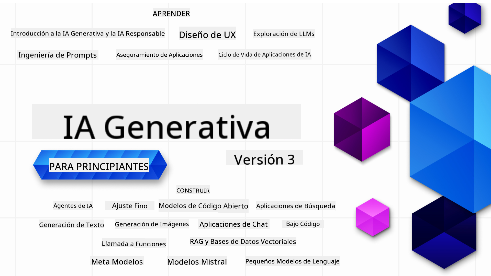

<!--
CO_OP_TRANSLATOR_METADATA:
{
  "original_hash": "6e3f4c8a4f323b8eab1cf11ded304b0f",
  "translation_date": "2025-06-25T07:27:34+00:00",
  "source_file": "README.md",
  "language_code": "es"
}
-->

### 21 Lecciones que enseñan todo lo que necesitas saber para comenzar a construir aplicaciones de IA Generativa

### 🌐 Soporte Multilenguaje

#### Soportado a través de GitHub Action (Automatizado y Siempre Actualizado)

# Inteligencia Artificial Generativa para Principiantes (Versión 3) - Un Curso

Aprende los fundamentos para construir aplicaciones de Inteligencia Artificial Generativa con nuestro curso completo de 21 lecciones por los Defensores de la Nube de Microsoft.

## 🌱 Empezando

Este curso tiene 21 lecciones. Cada lección cubre su propio tema, así que comienza donde prefieras.

Las lecciones están etiquetadas como "Aprender", que explican un concepto de IA Generativa, o "Construir", que explican un concepto y ejemplos de código en **Python** y **TypeScript** cuando sea posible.

Para desarrolladores .NET, revisa [Inteligencia Artificial Generativa para Principiantes (Edición .NET)](https://github.com/microsoft/Generative-AI-for-beginners-dotnet?WT.mc_id=academic-105485-koreyst)!

Cada lección también incluye una sección "Sigue Aprendiendo" con herramientas adicionales de aprendizaje.

## Lo que Necesitas
### Para ejecutar el código de este curso, puedes usar:
 - [Servicio Azure OpenAI](https://aka.ms/genai-beginners/azure-open-ai?WT.mc_id=academic-105485-koreyst) - **Lecciones:** "aoai-assignment"
 - [Catálogo de Modelos del Marketplace de GitHub](https://aka.ms/genai-beginners/gh-models?WT.mc_id=academic-105485-koreyst) - **Lecciones:** "githubmodels"
 - [API de OpenAI](https://aka.ms/genai-beginners/open-ai?WT.mc_id=academic-105485-koreyst) - **Lecciones:** "oai-assignment"

- Conocimientos básicos de Python o TypeScript son útiles - \*Para principiantes absolutos, revisa estos cursos de [Python](https://aka.ms/genai-beginners/python?WT.mc_id=academic-105485-koreyst) y [TypeScript](https://aka.ms/genai-beginners/typescript?WT.mc_id=academic-105485-koreyst)
- Una cuenta de GitHub para [hacer fork de todo este repositorio](https://aka.ms/genai-beginners/github?WT.mc_id=academic-105485-koreyst) a tu propia cuenta de GitHub

Hemos creado una lección de **[Configuración del Curso](./00-course-setup/README.md?WT.mc_id=academic-105485-koreyst)** para ayudarte a configurar tu entorno de desarrollo.

No olvides [darle una estrella (🌟) a este repositorio](https://docs.github.com/en/get-started/exploring-projects-on-github/saving-repositories-with-stars?WT.mc_id=academic-105485-koreyst) para encontrarlo más fácilmente después.

## 🧠 ¿Listo para Desplegar?

Si buscas ejemplos de código más avanzados, revisa nuestra [colección de Ejemplos de Código de IA Generativa](https://aka.ms/genai-beg-code?WT.mc_id=academic-105485-koreyst) tanto en **Python** como en **TypeScript**.

## 🗣️ Conoce a Otros Estudiantes, Obtén Apoyo

Únete a nuestro [servidor oficial de Discord de Azure AI Foundry](https://aka.ms/genai-discord?WT.mc_id=academic-105485-koreyst) para conocer y conectar con otros estudiantes que están tomando este curso y obtener apoyo.

Haz preguntas o comparte comentarios sobre el producto en nuestro [Foro de Desarrolladores de Azure AI Foundry](https://aka.ms/azureaifoundry/forum) en Github.

## 🚀 ¿Estás Construyendo una Startup?

Regístrate en [Microsoft para Startups Founders Hub](https://aka.ms/genai-foundershub?WT.mc_id=academic-105485-koreyst) para recibir **créditos gratuitos de OpenAI** y hasta **$150k en créditos de Azure para acceder a modelos de OpenAI a través de Azure OpenAI Services**.

## 🙏 ¿Quieres ayudar?

¿Tienes sugerencias o encontraste errores de ortografía o código? [Levanta un problema](https://github.com/microsoft/generative-ai-for-beginners/issues?WT.mc_id=academic-105485-koreyst) o [Crea una solicitud de extracción](https://github.com/microsoft/generative-ai-for-beginners/pulls?WT.mc_id=academic-105485-koreyst)

## 📂 Cada lección incluye:

- Una breve introducción en video al tema
- Una lección escrita ubicada en el README
- Ejemplos de código en Python y TypeScript que apoyan Azure OpenAI y OpenAI API
- Enlaces a recursos adicionales para continuar tu aprendizaje

## 🗃️ Lecciones

| #   | **Enlace de la Lección**                                                                                                                       | **Descripción**                                                                                 | **Video**                                                                   | **Aprendizaje Adicional**                                                      |
| --- | ----------------------------------------------------------------------------------------------------------------------------------------------- | ----------------------------------------------------------------------------------------------- | --------------------------------------------------------------------------- | ------------------------------------------------------------------------------ |
| 00  | [Configuración del Curso](./00-course-setup/README.md?WT.mc_id=academic-105485-koreyst)                                                        | **Aprender:** Cómo Configurar Tu Entorno de Desarrollo                                          | Video Próximamente                                                          | [Aprender Más](https://aka.ms/genai-collection?WT.mc_id=academic-105485-koreyst) |
| 01  | [Introducción a la IA Generativa y LLMs](./01-introduction-to-genai/README.md?WT.mc_id=academic-105485-koreyst)                                | **Aprender:** Entender qué es la IA Generativa y cómo funcionan los Modelos de Lenguaje Grande (LLMs). | [Video](https://aka.ms/gen-ai-lesson-1-gh?WT.mc_id=academic-105485-koreyst) | [Aprender Más](https://aka.ms/genai-collection?WT.mc_id=academic-105485-koreyst) |
| 02  | [Explorando y comparando diferentes LLMs](./02-exploring-and-comparing-different-llms/README.md?WT.mc_id=academic-105485-koreyst)              | **Aprender:** Cómo seleccionar el modelo adecuado para tu caso de uso                           | [Video](https://aka.ms/gen-ai-lesson2-gh?WT.mc_id=academic-105485-koreyst)  | [Aprender Más](https://aka.ms/genai-collection?WT.mc_id=academic-105485-koreyst) |
| 03  | [Usando IA Generativa Responsablemente](./03-using-generative-ai-responsibly/README.md?WT.mc_id=academic-105485-koreyst)                       | **Aprender:** Cómo construir aplicaciones de IA Generativa de manera responsable                | [Video](https://aka.ms/gen-ai-lesson3-gh?WT.mc_id=academic-105485-koreyst)  | [Aprender Más](https://aka.ms/genai-collection?WT.mc_id=academic-105485-koreyst) |
| 04  | [Entendiendo los Fundamentos de la Ingeniería de Prompts](./04-prompt-engineering-fundamentals/README.md?WT.mc_id=academic-105485-koreyst)     | **Aprender:** Mejores Prácticas Prácticas de Ingeniería de Prompts                              | [Video](https://aka.ms/gen-ai-lesson4-gh?WT.mc_id=academic-105485-koreyst)  | [Aprender Más](https://aka.ms/genai-collection?WT.mc_id=academic-105485-koreyst) |
| 05  | [Creación de Prompts Avanzados](./05-advanced-prompts/README.md?WT.mc_id=academic-105485-koreyst)                                              | **Aprender:** Cómo aplicar técnicas de ingeniería de prompts que mejoran el resultado de tus prompts. | [Video](https://aka.ms/gen-ai-lesson5-gh?WT.mc_id=academic-105485-koreyst)  | [Más información](https://aka.ms/genai-collection?WT.mc_id=academic-105485-koreyst) |
| 06  | [Construcción de Aplicaciones de Generación de Texto](./06-text-generation-apps/README.md?WT.mc_id=academic-105485-koreyst)                   | **Construir:** Una aplicación de generación de texto usando Azure OpenAI / OpenAI API            | [Video](https://aka.ms/gen-ai-lesson6-gh?WT.mc_id=academic-105485-koreyst)  | [Más información](https://aka.ms/genai-collection?WT.mc_id=academic-105485-koreyst) |
| 07  | [Construcción de Aplicaciones de Chat](./07-building-chat-applications/README.md?WT.mc_id=academic-105485-koreyst)                            | **Construir:** Técnicas para construir e integrar aplicaciones de chat de manera eficiente.      | [Video](https://aka.ms/gen-ai-lessons7-gh?WT.mc_id=academic-105485-koreyst) | [Más información](https://aka.ms/genai-collection?WT.mc_id=academic-105485-koreyst) |
| 08  | [Construcción de Aplicaciones de Búsqueda con Bases de Datos Vectoriales](./08-building-search-applications/README.md?WT.mc_id=academic-105485-koreyst) | **Construir:** Una aplicación de búsqueda que utiliza Embeddings para buscar datos.             | [Video](https://aka.ms/gen-ai-lesson8-gh?WT.mc_id=academic-105485-koreyst)  | [Más información](https://aka.ms/genai-collection?WT.mc_id=academic-105485-koreyst) |
| 09  | [Construcción de Aplicaciones de Generación de Imágenes](./09-building-image-applications/README.md?WT.mc_id=academic-105485-koreyst)         | **Construir:** Una aplicación de generación de imágenes                                          | [Video](https://aka.ms/gen-ai-lesson9-gh?WT.mc_id=academic-105485-koreyst)  | [Más información](https://aka.ms/genai-collection?WT.mc_id=academic-105485-koreyst) |
| 10  | [Construcción de Aplicaciones de IA de Bajo Código](./10-building-low-code-ai-applications/README.md?WT.mc_id=academic-105485-koreyst)        | **Construir:** Una aplicación de IA Generativa usando herramientas de Bajo Código                | [Video](https://aka.ms/gen-ai-lesson10-gh?WT.mc_id=academic-105485-koreyst) | [Más información](https://aka.ms/genai-collection?WT.mc_id=academic-105485-koreyst) |
| 11  | [Integración de Aplicaciones Externas con Llamadas a Funciones](./11-integrating-with-function-calling/README.md?WT.mc_id=academic-105485-koreyst) | **Construir:** Qué es la llamada a funciones y sus casos de uso para aplicaciones               | [Video](https://aka.ms/gen-ai-lesson11-gh?WT.mc_id=academic-105485-koreyst) | [Más información](https://aka.ms/genai-collection?WT.mc_id=academic-105485-koreyst) |
| 12  | [Diseño de UX para Aplicaciones de IA](./12-designing-ux-for-ai-applications/README.md?WT.mc_id=academic-105485-koreyst)                       | **Aprender:** Cómo aplicar principios de diseño UX al desarrollar aplicaciones de IA Generativa  | [Video](https://aka.ms/gen-ai-lesson12-gh?WT.mc_id=academic-105485-koreyst) | [Más información](https://aka.ms/genai-collection?WT.mc_id=academic-105485-koreyst) |
| 13  | [Protegiendo tus Aplicaciones de IA Generativa](./13-securing-ai-applications/README.md?WT.mc_id=academic-105485-koreyst)                     | **Aprender:** Las amenazas y riesgos para los sistemas de IA y métodos para proteger estos sistemas. | [Video](https://aka.ms/gen-ai-lesson13-gh?WT.mc_id=academic-105485-koreyst) | [Más información](https://aka.ms/genai-collection?WT.mc_id=academic-105485-koreyst) |
| 14  | [El Ciclo de Vida de la Aplicación de IA Generativa](./14-the-generative-ai-application-lifecycle/README.md?WT.mc_id=academic-105485-koreyst)  | **Aprender:** Las herramientas y métricas para gestionar el Ciclo de Vida de LLM y LLMOps       | [Video](https://aka.ms/gen-ai-lesson14-gh?WT.mc_id=academic-105485-koreyst) | [Más información](https://aka.ms/genai-collection?WT.mc_id=academic-105485-koreyst) |
| 15  | [Generación Aumentada por Recuperación (RAG) y Bases de Datos Vectoriales](./15-rag-and-vector-databases/README.md?WT.mc_id=academic-105485-koreyst) | **Construir:** Una aplicación utilizando un marco de RAG para recuperar incrustaciones de una base de datos vectorial | [Video](https://aka.ms/gen-ai-lesson15-gh?WT.mc_id=academic-105485-koreyst) | [Más información](https://aka.ms/genai-collection?WT.mc_id=academic-105485-koreyst) |
| 16  | [Modelos de Código Abierto y Hugging Face](./16-open-source-models/README.md?WT.mc_id=academic-105485-koreyst)                                    | **Construir:** Una aplicación utilizando modelos de código abierto disponibles en Hugging Face                    | [Video](https://aka.ms/gen-ai-lesson16-gh?WT.mc_id=academic-105485-koreyst) | [Más información](https://aka.ms/genai-collection?WT.mc_id=academic-105485-koreyst) |
| 17  | [Agentes de IA](./17-ai-agents/README.md?WT.mc_id=academic-105485-koreyst)                                                                       | **Construir:** Una aplicación utilizando un marco de Agente de IA                                           | [Video](https://aka.ms/gen-ai-lesson17-gh?WT.mc_id=academic-105485-koreyst) | [Más información](https://aka.ms/genai-collection?WT.mc_id=academic-105485-koreyst) |
| 18  | [Ajuste Fino de LLMs](./18-fine-tuning/README.md?WT.mc_id=academic-105485-koreyst)                                                              | **Aprender:** Qué es, por qué y cómo ajustar finamente los LLMs                                            | [Video](https://aka.ms/gen-ai-lesson18-gh?WT.mc_id=academic-105485-koreyst) | [Más información](https://aka.ms/genai-collection?WT.mc_id=academic-105485-koreyst) |
| 19  | [Construyendo con SLMs](./19-slm/README.md?WT.mc_id=academic-105485-koreyst)                                                              | **Aprender:** Los beneficios de construir con Modelos de Lenguaje Pequeños                                            | Video próximamente | [Más información](https://aka.ms/genai-collection?WT.mc_id=academic-105485-koreyst) |
| 20  | [Construyendo con Modelos Mistral](./20-mistral/README.md?WT.mc_id=academic-105485-koreyst)                                                              | **Aprender:** Las características y diferencias de los Modelos de la Familia Mistral                                           | Video próximamente | [Más información](https://aka.ms/genai-collection?WT.mc_id=academic-105485-koreyst) |
| 21  | [Construyendo con Modelos Meta](./21-meta/README.md?WT.mc_id=academic-105485-koreyst)                                                              | **Aprender:** Las características y diferencias de los Modelos de la Familia Meta                                           | Video próximamente | [Más información](https://aka.ms/genai-collection?WT.mc_id=academic-105485-koreyst) |

### 🌟 Agradecimientos especiales

Agradecimientos especiales a [**John Aziz**](https://www.linkedin.com/in/john0isaac/) por crear todas las Acciones y flujos de trabajo de GitHub

[**Bernhard Merkle**](https://www.linkedin.com/in/bernhard-merkle-738b73/) por hacer contribuciones clave a cada lección para mejorar la experiencia del aprendiz y del código.

## 🎒 Otros Cursos

¡Nuestro equipo produce otros cursos! Echa un vistazo:

- [**NUEVO** Protocolo de Contexto de Modelo para Principiantes](https://github.com/microsoft/mcp-for-beginners?WT.mc_id=academic-105485-koreyst)
- [Agentes de IA para Principiantes](https://github.com/microsoft/ai-agents-for-beginners?WT.mc_id=academic-105485-koreyst)
- [IA Generativa para Principiantes usando .NET](https://github.com/microsoft/Generative-AI-for-beginners-dotnet?WT.mc_id=academic-105485-koreyst)
- [IA Generativa para Principiantes usando JavaScript](https://aka.ms/genai-js-course?WT.mc_id=academic-105485-koreyst)
- [ML para Principiantes](https://aka.ms/ml-beginners?WT.mc_id=academic-105485-koreyst)
- [Ciencia de Datos para Principiantes](https://aka.ms/datascience-beginners?WT.mc_id=academic-105485-koreyst)
- [IA para Principiantes](https://aka.ms/ai-beginners?WT.mc_id=academic-105485-koreyst)
- [Ciberseguridad para Principiantes](https://github.com/microsoft/Security-101??WT.mc_id=academic-96948-sayoung)
- [Desarrollo Web para Principiantes](https://aka.ms/webdev-beginners?WT.mc_id=academic-105485-koreyst)
- [IoT para Principiantes](https://aka.ms/iot-beginners?WT.mc_id=academic-105485-koreyst)
- [Desarrollo XR para Principiantes](https://github.com/microsoft/xr-development-for-beginners?WT.mc_id=academic-105485-koreyst)
- [Domina GitHub Copilot para Programación en Pareja con IA](https://aka.ms/GitHubCopilotAI?WT.mc_id=academic-105485-koreyst)
- [Domina GitHub Copilot para Desarrolladores de C#/.NET](https://github.com/microsoft/mastering-github-copilot-for-dotnet-csharp-developers?WT.mc_id=academic-105485-koreyst)
- [Elige tu Propia Aventura con Copilot](https://github.com/microsoft/CopilotAdventures?WT.mc_id=academic-105485-koreyst)

**Descargo de responsabilidad**:  
Este documento ha sido traducido utilizando el servicio de traducción de IA [Co-op Translator](https://github.com/Azure/co-op-translator). Aunque nos esforzamos por lograr precisión, tenga en cuenta que las traducciones automatizadas pueden contener errores o imprecisiones. El documento original en su idioma nativo debe considerarse la fuente autorizada. Para información crítica, se recomienda una traducción profesional humana. No somos responsables de ningún malentendido o interpretación errónea que surja del uso de esta traducción.