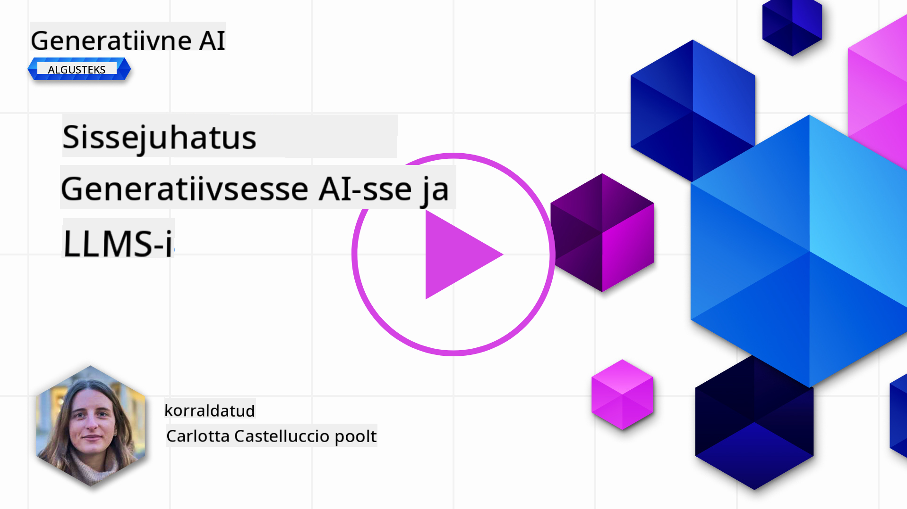
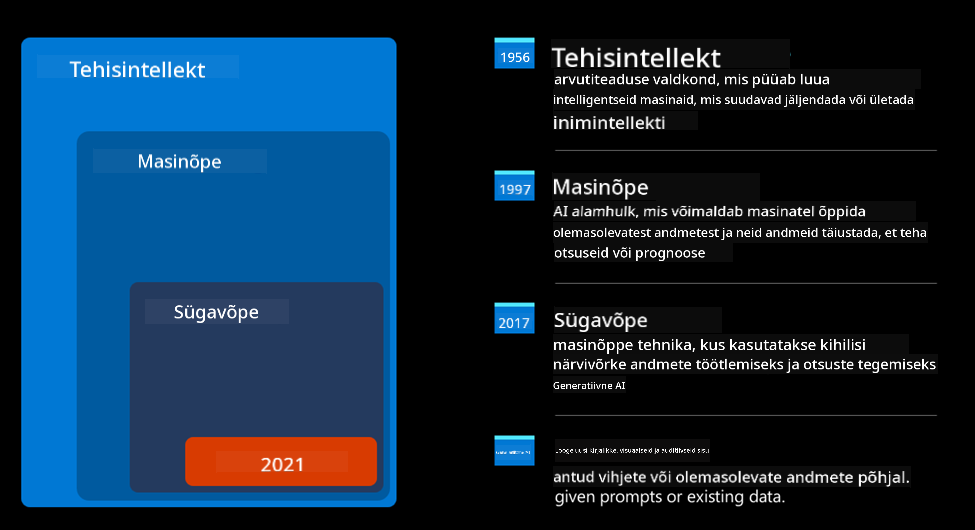
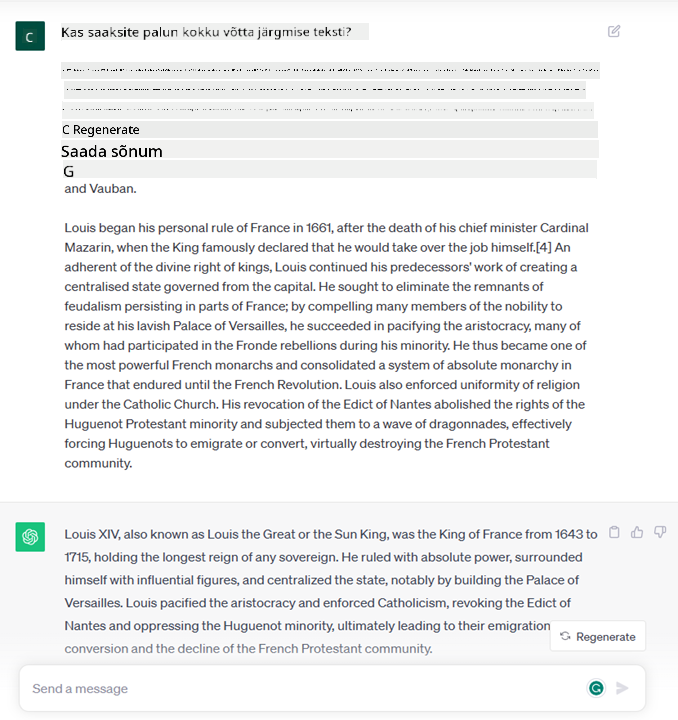
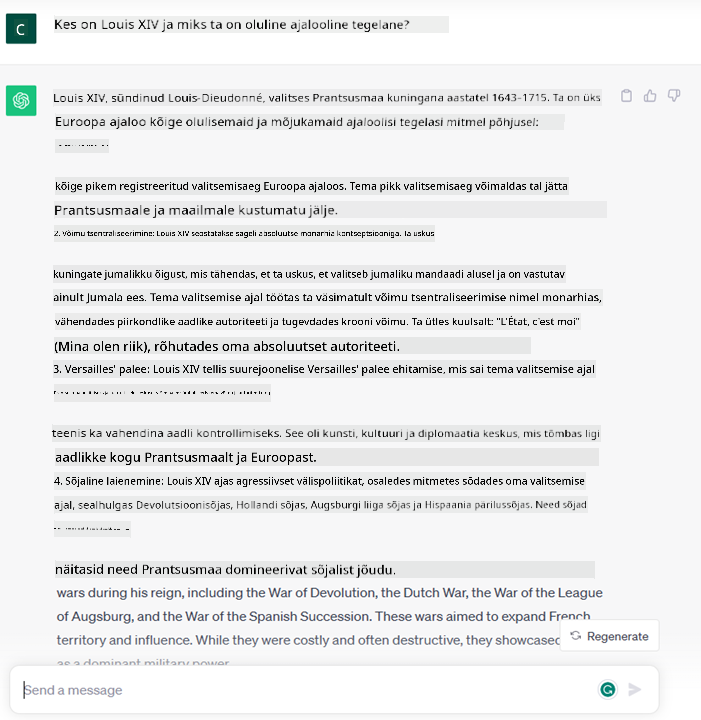
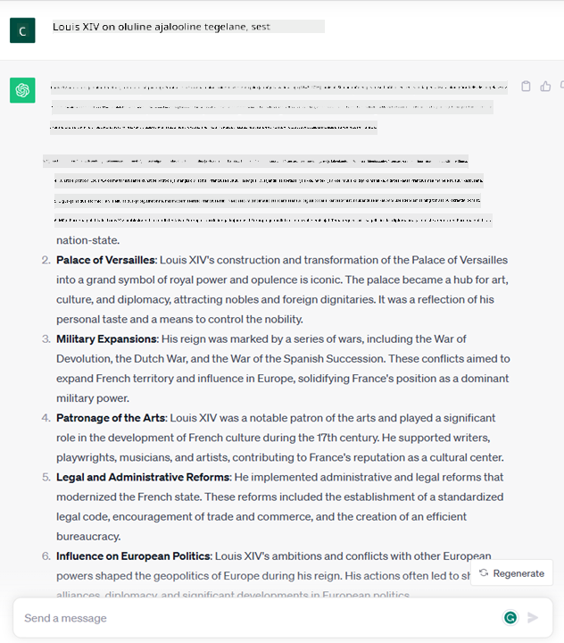

<!--
CO_OP_TRANSLATOR_METADATA:
{
  "original_hash": "bfb7901bdbece1ba3e9f35c400ca33e8",
  "translation_date": "2025-10-18T02:55:56+00:00",
  "source_file": "01-introduction-to-genai/README.md",
  "language_code": "et"
}
-->
# Sissejuhatus generatiivse tehisintellekti ja suurte keelemudelite maailma

_(Klõpsa ülaloleval pildil, et vaadata selle õppetunni videot)_

Generatiivne tehisintellekt (AI) on tehisintellekt, mis suudab luua teksti, pilte ja muud tüüpi sisu. Mis teeb selle tehnoloogia erakordseks, on selle võime demokratiseerida tehisintellekti – igaüks saab seda kasutada, sisestades vaid tekstipäringu, lause loomulikus keeles. Pole vaja õppida programmeerimiskeeli nagu Java või SQL, et saavutada midagi väärtuslikku; piisab oma keele kasutamisest, soovide väljendamisest ja AI mudel pakub vastuseks ettepaneku. Selle rakendused ja mõju on tohutud – aruannete koostamine või mõistmine, rakenduste kirjutamine ja palju muud saab tehtud sekunditega.

Selles õppekavas uurime, kuidas meie idufirma kasutab generatiivset tehisintellekti, et avada uusi võimalusi hariduse valdkonnas, ning kuidas me tegeleme selle rakendamisega seotud sotsiaalsete ja tehnoloogiliste piirangutega.

## Sissejuhatus

Selles õppetunnis käsitleme:

- Ärisituatsiooni tutvustust: meie idufirma idee ja missioon.
- Generatiivset tehisintellekti ja kuidas me jõudsime praeguse tehnoloogilise maastikuni.
- Suure keelemudeli sisemist toimimist.
- Suurte keelemudelite peamisi võimekusi ja praktilisi kasutusjuhtumeid.

## Õppeeesmärgid

Pärast selle õppetunni läbimist mõistad:

- Mis on generatiivne tehisintellekt ja kuidas suured keelemudelid töötavad.
- Kuidas kasutada suuri keelemudeleid erinevateks kasutusjuhtudeks, keskendudes hariduse valdkonnale.

## Situatsioon: meie hariduslik idufirma

Generatiivne tehisintellekt (AI) esindab tehisintellekti tehnoloogia tippu, nihutades piire, mida kunagi peeti võimatuks. Generatiivsetel AI mudelitel on mitmeid võimeid ja rakendusi, kuid selles õppekavas uurime, kuidas see revolutsioneerib haridust läbi väljamõeldud idufirma. Viitame sellele idufirmale kui _meie idufirma_. Meie idufirma tegutseb hariduse valdkonnas ambitsioonika missiooniga:

> _parandada õppimise kättesaadavust globaalsel tasandil, tagada hariduse võrdne kättesaadavus ja pakkuda igale õppijale isikupärastatud õpikogemusi vastavalt nende vajadustele_.

Meie idufirma meeskond on teadlik, et me ei suuda seda eesmärki saavutada ilma ühe kaasaegse aja võimsaima tööriista – suurte keelemudelite (LLM) – kasutamiseta.

Generatiivne tehisintellekt on eeldatavasti revolutsioneerimas tänapäevast õppimist ja õpetamist, pakkudes õpilastele virtuaalseid õpetajaid, kes on saadaval 24 tundi ööpäevas, jagades tohutul hulgal teavet ja näiteid, ning õpetajatele innovaatilisi tööriistu, et hinnata oma õpilasi ja anda tagasisidet.

Alustuseks määratleme mõned põhimõisted ja terminid, mida kasutame kogu õppekava jooksul.

## Kuidas generatiivne tehisintellekt tekkis?

Hoolimata viimasel ajal generatiivsete AI mudelite väljakuulutamisega kaasnenud erakordsest _hüppest_, on see tehnoloogia arendatud aastakümnete jooksul, esimesed uurimistööd ulatuvad tagasi 1960ndatesse. Oleme nüüd jõudnud punkti, kus tehisintellektil on inimlikud kognitiivsed võimed, nagu vestlus, mida näitavad näiteks [OpenAI ChatGPT](https://openai.com/chatgpt) või [Bing Chat](https://www.microsoft.com/edge/features/bing-chat?WT.mc_id=academic-105485-koreyst), mis kasutab GPT mudelit veebipõhiste otsinguvestluste jaoks.

Tagasi vaadates koosnesid AI esimesed prototüübid trükitud vestlusrobotitest, mis tuginesid ekspertide grupilt saadud teadmiste baasile, mis oli arvutisse sisestatud. Vastused teadmiste baasis käivitati sisendteksti märksõnade järgi.
Kuid peagi sai selgeks, et selline lähenemine, kasutades trükitud vestlusroboteid, ei olnud hästi skaleeritav.

### Statistiline lähenemine tehisintellektile: masinõpe

Murrang toimus 1990ndatel, kui rakendati statistilist lähenemist teksti analüüsile. See viis uute algoritmide – tuntud kui masinõpe – väljatöötamiseni, mis suutsid õppida mustreid andmetest ilma otsese programmeerimiseta. See lähenemine võimaldas masinatel simuleerida inimkeele mõistmist: statistiline mudel treeniti tekst-sildi paaride põhjal, võimaldades mudelil klassifitseerida tundmatut sisendteksti eelnevalt määratletud sildiga, mis esindab sõnumi kavatsust.

### Neuraalvõrgud ja kaasaegsed virtuaalsed assistendid

Viimastel aastatel on riistvara tehnoloogiline areng, mis võimaldab töödelda suuremaid andmemahtusid ja keerukamaid arvutusi, soodustanud tehisintellekti uurimist, viies arenenud masinõppe algoritmide, mida tuntakse neuraalvõrkude või süvaõppe algoritmidena, väljatöötamiseni.

Neuraalvõrgud (eriti korduvad neuraalvõrgud – RNN-id) parandasid oluliselt loomuliku keele töötlemist, võimaldades teksti tähendust esitada sisukamal viisil, väärtustades sõna konteksti lauses.

See tehnoloogia toetas virtuaalsete assistentide sündi uue sajandi esimesel kümnendil, mis olid väga osavad inimkeele tõlgendamisel, vajaduse tuvastamisel ja tegevuse sooritamisel selle rahuldamiseks – näiteks vastates eelnevalt määratletud skriptiga või kasutades kolmanda osapoole teenust.

### Tänapäev, generatiivne tehisintellekt

Nii jõudsimegi tänapäeva generatiivse tehisintellektini, mida võib pidada süvaõppe alamhulgaks.

Pärast aastakümnete pikkust uurimistööd tehisintellekti valdkonnas ületas uus mudeli arhitektuur – nimega _Transformer_ – RNN-ide piirangud, olles võimeline vastu võtma palju pikemaid tekstijadasid sisendina. Transformerid põhinevad tähelepanumehhanismil, mis võimaldab mudelil anda erinevaid kaalusid saadud sisenditele, pöörates rohkem tähelepanu kohtadele, kus kõige olulisem teave on koondunud, sõltumata nende järjekorrast tekstijadas.

Enamik hiljutisi generatiivseid AI mudeleid – tuntud ka kui suured keelemudelid (LLM-id), kuna nad töötavad tekstiliste sisendite ja väljunditega – põhinevad just sellel arhitektuuril. Mis on nende mudelite juures huvitav – treenitud tohutul hulgal märgistamata andmetel mitmesugustest allikatest nagu raamatud, artiklid ja veebisaidid – on see, et neid saab kohandada väga erinevateks ülesanneteks ja nad suudavad genereerida grammatiliselt korrektset teksti, mis näib loov. Seega mitte ainult ei parandanud need oluliselt masina võimet sisendteksti ‘mõista’, vaid võimaldasid neil genereerida originaalse vastuse inimkeeles.

## Kuidas suured keelemudelid töötavad?

Järgmises peatükis uurime erinevat tüüpi generatiivseid AI mudeleid, kuid praegu vaatame, kuidas suured keelemudelid töötavad, keskendudes OpenAI GPT (Generative Pre-trained Transformer) mudelitele.

- **Tokeniseerimine, tekstist numbriteni**: Suured keelemudelid võtavad sisendiks teksti ja genereerivad väljundiks teksti. Kuid kuna tegemist on statistiliste mudelitega, töötavad nad numbritega palju paremini kui tekstijadadega. Seetõttu töödeldakse iga mudelile antud sisend enne põhiosa mudelisse jõudmist tokeniseerija poolt. Token on tekstilõik – koosneb muutuvast arvust tähemärkidest, seega tokeniseerija peamine ülesanne on jagada sisend tokenite massiiviks. Seejärel kaardistatakse iga token tokeni indeksiga, mis on algse tekstilõigu täisarvuline kodeering.

- **Väljundtokenite ennustamine**: Arvestades n tokenit sisendina (kus max n varieerub mudeliti), suudab mudel ennustada ühe tokeni väljundiks. See token lisatakse järgmise iteratsiooni sisendisse, kasutades laieneva akna mustrit, mis võimaldab paremat kasutajakogemust, pakkudes vastuseks ühte (või mitut) lauset. See selgitab, miks, kui olete kunagi ChatGPT-ga mänginud, olete võib-olla märganud, et mõnikord tundub, et see peatub lause keskel.

- **Valikuprotsess, tõenäosusjaotus**: Väljundtoken valitakse mudeli poolt vastavalt selle tõenäosusele esineda pärast praegust tekstijada. See on tingitud sellest, et mudel ennustab tõenäosusjaotuse kõigi võimalike ‘järgmiste tokenite’ üle, arvutades selle oma treeningu põhjal. Kuid mitte alati ei valita jaotusest kõige suurema tõenäosusega token. Selle valiku juurde lisatakse juhuslikkuse aste, nii et mudel käitub mitte-deterministlikult – me ei saa täpselt sama väljundit sama sisendi korral. See juhuslikkuse aste lisatakse loova mõtlemise protsessi simuleerimiseks ja seda saab reguleerida mudeli parameetriga nimega temperatuur.

## Kuidas meie idufirma saab kasutada suuri keelemudeleid?

Nüüd, kui mõistame paremini suure keelemudeli sisemist toimimist, vaatame mõningaid praktilisi näiteid kõige tavalisematest ülesannetest, mida nad suudavad üsna hästi täita, keskendudes meie ärisituatsioonile.
Me ütlesime, et suure keelemudeli peamine võimekus on _teksti genereerimine nullist, alustades tekstilisest sisendist, mis on kirjutatud loomulikus keeles_.

Aga millist tekstilist sisendit ja väljundit?
Suure keelemudeli sisendit tuntakse kui päringut (prompt), samas kui väljundit nimetatakse täienduseks (completion), mis viitab mudeli mehhanismile järgmise tokeni genereerimiseks, et täiendada praegust sisendit. Uurime sügavamalt, mis on päring ja kuidas seda kujundada nii, et mudelist maksimaalselt kasu saada. Kuid praegu ütleme lihtsalt, et päring võib sisaldada:

- **Juhist**, mis täpsustab, millist tüüpi väljundit me mudelilt ootame. See juhis võib mõnikord sisaldada näiteid või täiendavaid andmeid.

  1. Artikli, raamatu, tootearvustuste jms kokkuvõte koos struktureerimata andmetest saadud ülevaadetega.
    
    
  
  2. Loov ideede genereerimine ja artikli, essee, ülesande jms kujundamine.
      
     

- **Küsimust**, mis on esitatud vestluse vormis agendiga.
  
  

- **Tekstilõiku, mida täiendada**, mis kaudselt tähendab palvet kirjutamisabi saamiseks.
  
  

- **Koodilõiku** koos palvega seda selgitada ja dokumenteerida või kommentaari, mis palub genereerida konkreetset ülesannet täitvat koodilõiku.
  
  

Ülaltoodud näited on üsna lihtsad ja ei ole mõeldud suure keelemudeli võimekuse ammendavaks demonstreerimiseks. Need on mõeldud näitama generatiivse tehisintellekti kasutamise potentsiaali, eriti, kuid mitte ainult, hariduskontekstis.

Samuti ei ole generatiivse tehisintellekti mudeli väljund täiuslik ja mõnikord võib mudeli loovus töötada selle vastu, mille tulemuseks on väljund, mis on sõnade kombinatsioon, mida inimkasutaja võib tõlgendada reaalsuse moonutamisena või solvavana. Generatiivne tehisintellekt ei ole intelligentne – vähemalt mitte laiemas intelligentsuse määratluses, mis hõlmab kriitilist ja loovat mõtlemist või emotsionaalset intelligentsust; see ei ole deterministlik ega usaldusväärne, kuna vale viited, sisu ja väited võivad olla kombineeritud õige teabega ja esitatud veenval ning enesekindlal viisil. Järgmistes õppetundides tegeleme kõigi nende piirangutega ja vaatame, mida saame teha nende leevendamiseks.

## Ülesanne

Sinu ülesanne on lugeda rohkem [generatiivsest tehisintellektist](https://en.wikipedia.org/wiki/Generative_artificial_intelligence?WT.mc_id=academic-105485-koreyst) ja proovida tuvastada valdkond, kuhu sa lisaksid generatiivse tehisintellekti täna, kus seda veel ei ole. Kuidas oleks mõju erinev võrreldes "vanaviisi" tegemisega, kas saaksid teha midagi, mida varem ei saanud, või oleksid kiirem? Kirjuta 300-sõnaline kokkuvõte sellest, milline näeks välja sinu unistuste AI idufirma, ja lisa pealkirjad nagu "Probleem", "Kuidas ma kasutaksin AI-d", "Mõju" ja soovi korral äriplaan.

Kui sa selle ülesande täidad, võid olla valmis kandideerima Microsofti inkubaatorisse, [Microsoft for Startups Founders Hub](https://www.microsoft.com/startups?WT.mc_id=academic-105485-koreyst), kus pakume krediite nii Azure'ile, OpenAI-le, mentorlusele ja palju muud. Vaata järele!

## Teadmiste kontroll

Mis on tõsi suurte keelemudelite kohta?

1. Sa saad iga kord täpselt sama vastuse.
1. See teeb asju täiuslikult, suurepärane numbrite liitmisel, töötava koodi loomisel jne.
1. Vastus võib varieeruda, hoolimata sama päringu kasutamisest. Samuti on see suurepärane esimese mustandi pakkumisel, olgu see tekst või kood. Kuid tulemusi tuleb täiustada.

A: 3, LLM on mitte-deterministlik, vastus varieerub, kuid selle varieeruvust saab kontrollida temperatuuri seadistuse kaudu. Samuti ei tohiks oodata, et see teeb asju täiuslikult – see on siin, et teha raskem töö sinu eest, mis sageli tähendab, et saad hea esimese katse, mida tuleb järk-järgult täiustada.

## Suurepärane töö! Jätka teekonda

Pärast selle õppetunni läbimist vaata meie [Generatiivse AI õppekollektsiooni](https://aka.ms/genai-collection?WT.mc_id=academic-105485-koreyst), et jätkata generatiivse tehisintellekti teadmiste taseme tõstmist!
Liigu edasi 2. õppetundi, kus uurime, kuidas [avastada ja võrrelda erinevaid LLM tüüpe](../02-exploring-and-comparing-different-llms/README.md?WT.mc_id=academic-105485-koreyst)!

---

**Lahtiütlus**:  
See dokument on tõlgitud AI tõlketeenuse [Co-op Translator](https://github.com/Azure/co-op-translator) abil. Kuigi püüame tagada täpsust, palun arvestage, et automaatsed tõlked võivad sisaldada vigu või ebatäpsusi. Algne dokument selle algses keeles tuleks pidada autoriteetseks allikaks. Olulise teabe puhul on soovitatav kasutada professionaalset inimtõlget. Me ei vastuta arusaamatuste või valesti tõlgenduste eest, mis võivad tekkida selle tõlke kasutamise tõttu.