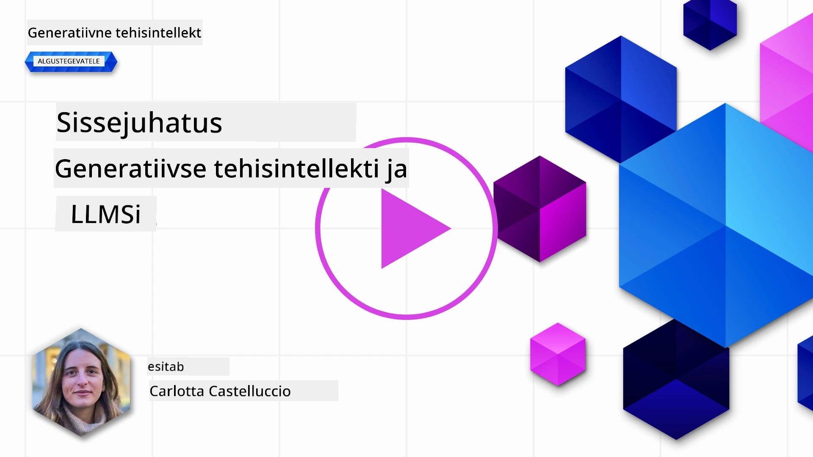
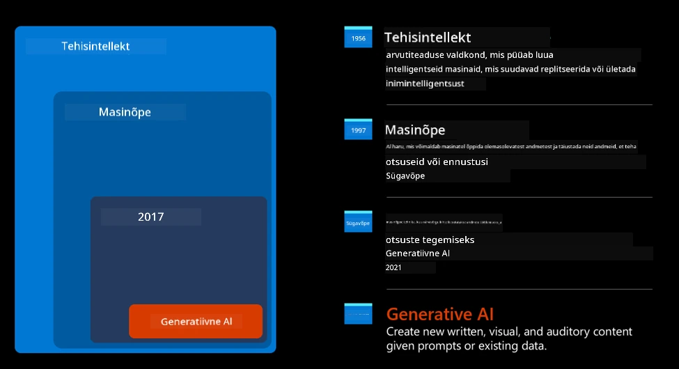
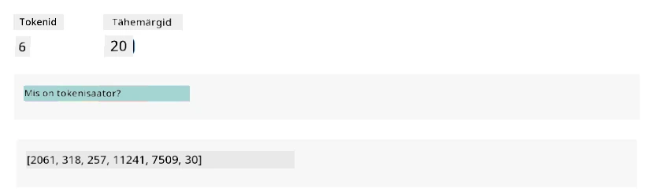
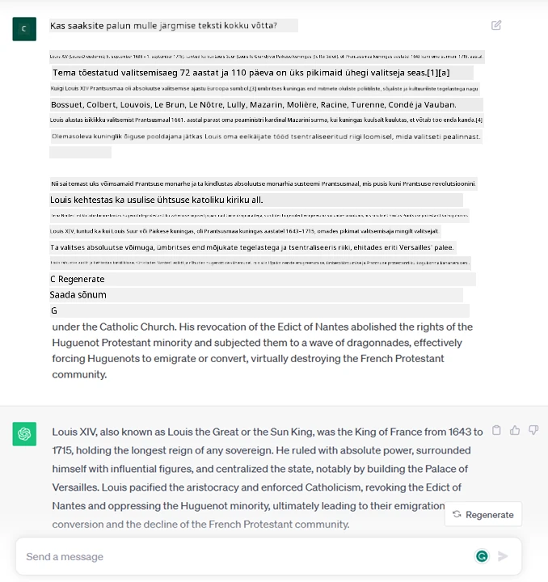
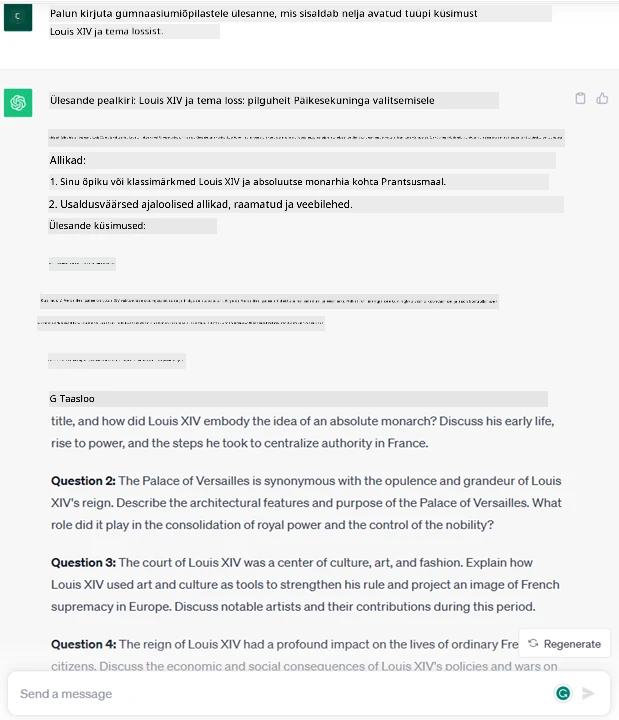
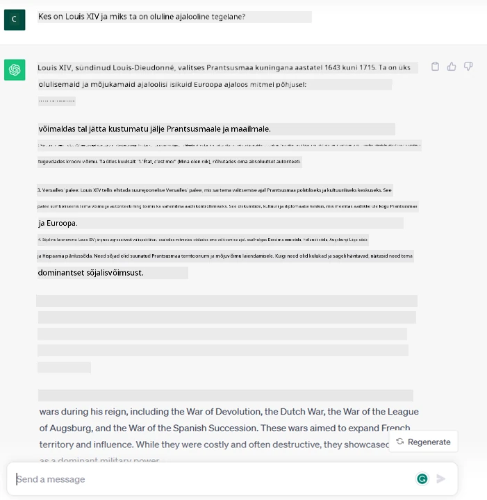
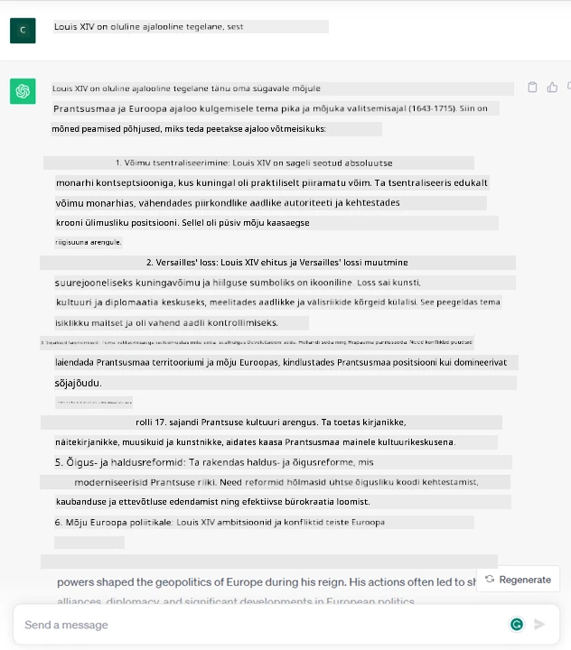
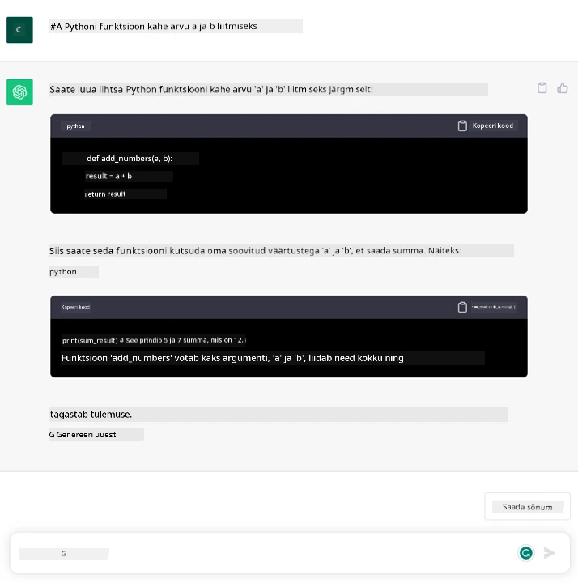

# Sissejuhatus generatiivse tehisintellekti ja suurte keelemudelite maailma

_(Klõpsake ülaloleval pildil, et vaadata selle loengu videot)_

Generatiivne tehisintellekt on tehisintellekti vorm, mis suudab genereerida teksti, pilte ja muid sisutüüpe. See tehnoloogia on imeline, sest see demokraatiseerib AI-d – igaüks võib seda kasutada vaid teksti sisestamisega, lausega kirjutatuna loomulikus keeles. Pole vaja õppida Java või SQL keelt, et midagi väärtuslikku saavutada, piisab oma keele kasutamisest, öelge, mida soovite, ja AI mudel pakub soovitust. Selle rakendused ja mõju on tohutud: saate kirjutada aruandeid, arendada rakendusi ja palju muud kõik sekunditega.

Selles õppekavas uurime, kuidas meie idufirma kasutab generatiivset tehisintellekti, et avada uusi võimalusi haridusmaailmas, ja kuidas me tegeleme selle rakenduse sotsiaalsete mõjude ja tehnoloogia piirangutega kaasnevate väljakutsetega.

## Sissejuhatus

See loeng käsitleb:

- Ärilise stsenaariumi tutvustamine: meie idufirma idee ja missioon.
- Generatiivne tehisintellekt ja kuidas me jõudsime tänasesse tehnoloogilisse olukorda.
- Suure keelemudeli sisemine toimimine.
- Suurte keelemudelite peamised võimed ja praktilised kasutusjuhtumid.

## Õpieesmärgid

Selle loengu lõpetamisel mõistate:

- Mis on generatiivne tehisintellekt ja kuidas suured keelemudelid töötavad.
- Kuidas saate kasutada suuri keelemudeleid erinevates kasutusjuhtudes, keskendudes haridusstsenaariumitele.

## Stsenaarium: meie hariduslik idufirma

Generatiivne tehisintellekt (AI) on tehisintellekti tipptehnoloogia, mis nihutab piire, mis kunagi tundusid võimatutena. Generatiivsetel AI mudelitel on mitmeid võimeid ja rakendusi, kuid selles õppekavas uurime, kuidas see revolutsioneerib haridust fiktiivse idufirma kaudu. Me nimetame seda idufirmat _meie idufirmaks_. Meie firma tegutseb haridusvaldkonnas ja seab ambitsioonikaks missiooniks

> _õppimise ligipääsetavuse parandamine üle maailma, tagades haridusele võrdsed võimalused ning pakkudes iga õppija vajadustele kohandatud personaalset õpikogemust_.

Meie idufirma meeskond teab, et me ei saa seda eesmärki saavutada ilma ühe kaasaegseima tööriista – suurte keelemudelite (LLMide) kasutamiseta.

Oodatakse, et generatiivne AI muudab oluliselt õppimise ja õpetamise viisi, võimaldades õpilastel kasutada virtuaalõpetajaid ööpäevaringselt, kes pakuvad rohkelt infot ja näiteid, ning õpetajatel kasutada uuenduslikke vahendeid õpilaste hindamiseks ja tagasiside andmiseks.

Alustuseks määratleme mõned põhikontseptsioonid ja terminid, mida kasutame kogu õppekavas.

## Kuidas me jõudsime generatiivse AI-ni?

Hoolimata erakordsest hiljutisest _müügist_, mida tõi kaasa generatiivsete AI mudelite kuulutamine, on see tehnoloogia arendus töös juba aastakümneid, ulatudes varajaisse 60ndatesse. Nüüdseks oleme jõudnud punktini, kus tehisintellektil on inimlikud kognitiivsed võimed, nagu vestlus, mida näitavad näiteks [OpenAI ChatGPT](https://openai.com/chatgpt) või [Microsoft Copilot](https://copilot.microsoft.com/?WT.mc_id=academic-105485-koreyst), mis kasutab samuti GPT mudelit vestlusliku veebipõhise otsingu kogemuse loomiseks.

Alguses koosnesid AI esimesed prototüübid trükitud vestlusrobotitest, mis tuginesid ekspertide rühma teadmistebaasile, mis oli arvutisse vormistatud. Vastuseid teadmistebaasis vallandasid märksõnad sisendtekstis.
Kuid varsti sai selgeks, et selline lähenemine – kasutades trükitud vestlusroboteid – ei skaleeru hästi.

### Statistiline lähenemine AI-le: masinõpe

Pöördepunkt saabus 90ndatel, kui hakati rakendama statistilist lähenemist teksti analüüsile. Selle tulemusel arendati uusi algoritme – tuntud kui masinõpe –, mis suudavad õppida mustreid andmetest ilma, et neid peaks otseselt programmeerima. See meetod võimaldab masinatel simuleerida inimkeele mõistmist: statistiline mudel treenitakse tekstimärgendite paaridel, mis võimaldab mudelil klassifitseerida tundmatu sisendteksti eelseadistatud sildi põhjal, mis väljendab sõnumi eesmärki.

### Neurovõrgud ja tänapäevased virtuaalsed assistendid

Viimastel aastatel on riistvara tehnoloogiline areng, mis suudab töödelda suuremaid andmemahtusid ja keerukamaid arvutusi, soodustanud AI uurimistööd, mis on viinud täiustatud masinõppe algoritmide – tuntud kui närvivõrgud või süvaõppe algoritmid – arenduseni.

Närvivõrgud (eriti korduvad närvivõrgud – RNN-d) on oluliselt parandanud loomuliku keele töötlemist, võimaldades tekstisisu tähendust esitada konteksti arvestades tähendusrikkamal viisil.

See tehnoloogia toetas virtuaalassistente, kes tekkisid 2000. aastate esimesel kümnendil ja olid väga osavad inimkeele tõlgendamisel, tuvastades vajaduse ja täites selle läbi ettemääratud skripti või kolmanda osapoole teenuse kasutamise.

### Tänapäeval: generatiivne AI

Nii jõudsime tänapäeva generatiivsesse AI-sse, mida võib pidada süvaõppe alamvaldkonnaks.

Pärast aastakümneid kestnud AI uurimistööd tuli uus mudeli arhitektuur – _Transformer_ – mis ületas RNN-de piirangud, võimaldades sisendina töödelda palju pikemaid tekstijadasid. Transformerid põhinevad tähelepanumehhanismil, mis võimaldab mudelil anda sisenditele erineva kaalu, „pannes rohkem tähele“, kus asub kõige olulisem info, hoolimata nende järjekorrast tekstijadas.

Enamik uusimaid generatiivseid AI mudeleid – tuntud ka kui suured keelemudelid (LLMid), kuna nad töötlevad tekstilisi sisendeid ja väljundeid – põhinevadgi sellel arhitektuuril. Neid mudeleid, mis on treenitud tohutul hulgal märgendamata andmetel erinevatest allikatest nagu raamatud, artiklid ja veebisaidid, saab kohandada mitmesugusteks ülesanneteks ning nad suudavad luua grammatiliselt korrektselt teksti, mis näib loominguline. Seega mitte ainult ei parandanud need suurel määral masina võimet „mõista“ sisendteksti, vaid võimaldasid genereerida ka originaalset vastust inimkeeles.

## Kuidas suured keelemudelid töötavad?

Järgmiseks peatükiks uurime erinevaid generatiivseid AI mudeleid, kuid praegu vaatleme, kuidas töötavad suured keelemudelid, keskendudes OpenAI GPT (Generative Pre-trained Transformer) mudelitele.

- **Tokenisaator, tekst numbriteks**: Suured keelemudelid saavad sisendiks teksti ja genereerivad väljundiks teksti. Kuid kuna tegemist on statistiliste mudelitega, töötavad nad numbriandmetega palju paremini kui tekstijadadega. Seetõttu töötleb iga mudelile sisestatav tekst eeltöötlusena tokenisaator. Token on tekstilõik – koosnedes muutuvast arvust märki, nii et tokenisaatori peamine ülesanne on jagada sisend tokenite massiiviks. Seejärel omistatakse igale tokenile tokeni indeks, mis on algse tekstilõigu täisarvuline kodeering.

- **Väljundtokkide ennustamine**: Kui mudelile antakse sisendiks n tokenit (maksimaalne väärtus erineb mudelite lõikes), suudab mudel ennustada ühe tokeni väljundiks. See token lisatakse järgmise iteratsiooni sisendisse, laienduva akna mustri järgi, võimaldades kasutajal kogeda mugavalt vastust, mis võib koosneda ühest või mitmest lausest. Seetõttu võisite ChatGPT-ga mängides märgata, et see mõnikord peatub lause keskel.

- **Valikuprotsess, tõenäosusjaotus**: Mudel valib väljunditokni vastavalt tõenäosusele, et see järgneb praegusele tekstijadale. Mudel arvutab välja tõenäosusjaotuse kõigi võimalike järgmiste tokenite vahel, tuginedes treeningule. Kuid väljundiks ei valita alati kõige tõenäosemat tokenit. Sellesse valikusse lisatakse juhuslikkuse aste, nii et mudel käitub mittedeterministlikult – sama sisendi puhul ei saa sama täpset väljundit. Seda juhuslikkust lisatakse, et simuleerida loomingulist mõtlemist, ning seda saab reguleerida mudeli parameetriga nimega temperatuur.

## Kuidas meie idufirma saaks kasutada suuri keelemudeleid?

Nüüd, kui meil on parem arusaam suure keelemudeli sisemisest toimimisest, vaatame mõningaid praktilisi näiteid kõige tavalisematest ülesannetest, mida nad suudavad üsna hästi täita, pöörates erilist tähelepanu meie äristsenaariumile.
Ütlesime, et suure keelemudeli peamine võime on _teksti genereerimine päris algusest, tekstipõhisest sisendist, mis on kirjutatud loomulikus keeles_.

Aga milline on sisendi ja väljundi tekst?
Suure keelemudeli sisendit nimetatakse promptiks, väljundit completioniks, mis viitab mudeli mehhanismile genereerida järgmine token, et lõpetada praegune sisend. Me süveneme, mis on prompt ja kuidas seda kujundada, et saada mudelist parim tulemus. Praegu aga öelgem, et prompt võib sisaldada:

- **Juhist**, mis täpsustab, millist väljundit mudelilt oodatakse. See juhis võib mõnikord sisaldada ka mõningaid näiteid või täiendavaid andmeid.

  1. Artikli, raamatu, tooteülevaadete kokkuvõtet ja rohkem, samuti mõtete väljavõtmist struktureerimata andmetest.
    
    
  
  2. Loominguline ideede genereerimine ja artikli, esseede, ülesannete jmt kujundamine.
      
     

- **Küsimust**, esitatud vestlusena agendiga.
  
  

- **Tekstilõiku lõpetamiseks**, mis implitsiitselt tähendab kirjutamisabi palumist.
  
  

- **Koodi** lõiku koos palvega seda seletada ja dokumenteerida või kommentaari, mis palub genereerida koodilõiku, mis täidab konkreetset ülesannet.
  
  

Ülaltoodud näited on üsna lihtsad ega pretendeeri põhjalikult demonstreerida suurte keelemudelite võimeid. Need on mõeldud näitama generatiivse AI kasutamise potentsiaali, eriti kuid mitte ainult hariduskontekstides.

Samuti ei ole generatiivse AI mudelide väljund täiuslik ja mõnikord võib mudeli loomingulisus töötada nende vastu, tulemuseks on väljund, mille kombineeritud sõnad võivad kasutajale tunduda reaalsuse müstifikatsioonina või lausa solvavana. Generatiivne AI ei ole intelligentne – vähemalt mitte laiemas mõttes, mis hõlmab kriitilist ja loomingulist mõtlemist või emotsionaalset intelligentsust; see ei ole deterministlik ega usaldusväärne, kuna valed väljamõeldised, näiteks valeviited, sisu ja väited, võivad seguneda õige infoga ning esineda veenvalt ja kindlalt. Järgmistes loengutes tegeleme nende piirangutega ja vaatame, kuidas neid leevendada.

## Kodune ülesanne

Teie ülesanne on lugeda rohkem [generatiivsest AI-st](https://en.wikipedia.org/wiki/Generative_artificial_intelligence?WT.mc_id=academic-105485-koreyst) ja proovida leida valdkond, kus te täna lisaksite generatiivset AI-d, kuid mida see veel ei puuduta. Kuidas oleks mõju erinev vana meetodiga, kas saate teha midagi, mida varem ei saanud, või olete kiirem? Kirjutage 300-sõnaline kokkuvõte sellest, milline näeks välja teie unistuste AI idufirma, lisades pealkirjad nagu „Probleem“, „Kuidas ma kasutaksin AI-d“, „Mõju“ ning valikuliselt äriplaani.

Kui olete selle ülesande teinud, võite olla valmis kandideerima Microsofti inkubaatorisse, [Microsoft for Startups Founders Hub](https://www.microsoft.com/startups?WT.mc_id=academic-105485-koreyst), kus pakume krediiti nii Azure, OpenAI, mentorluse kui ka muu jaoks – tutvuge!

## Teadmiste kontroll

Mis on suurte keelemudelite kohta tõsi?

1. Saate iga kord täpselt sama vastuse.
1. See teeb kõike täiuslikult, on suurepärane numbrite liitmisel, töötab koodiga jne.
1. Vastus võib samas promptis varieeruda. See on samuti hea esmase kavandi tegemisel, olgu tekst või kood. Kuid peate tulemusi parandama.

V: 3, LLM on mittedeterministlik, vastus varieerub, kuid selle varieeruvust saab kontrollida temperatuuri seadistuse abil. Samuti ei tohiks eeldada, et see teeb asju täiuslikult, tema ülesandeks on teha ära raske töö ja anda sageli hea esimene katse, mida saab järk-järgult täiustada.

## Tubli töö! Jätkake teekonda

Pärast selle loengu lõpetamist vaadake meie [Generatiivse AI õppimise kogu](https://aka.ms/genai-collection?WT.mc_id=academic-105485-koreyst), et jätkata oma generatiivse AI teadlikkuse tõstmist!

Liigu teise õppetundi, kus uurime, kuidas [uurida ja võrrelda erinevaid LLM tüüpe](../02-exploring-and-comparing-different-llms/README.md?WT.mc_id=academic-105485-koreyst)!

---

<!-- CO-OP TRANSLATOR DISCLAIMER START -->
**Lahtiütlus**:
See dokument on tõlgitud kasutades AI tõlketeenust [Co-op Translator](https://github.com/Azure/co-op-translator). Kuigi me püüdleme täpsuse poole, palun pange tähele, et automatiseeritud tõlgetes võib esineda vigu või ebatäpsusi. Originaaldokument selle emakeeles tuleks pidada autoriteetseks allikaks. Olulise teabe puhul soovitatakse kasutada professionaalset inimtõlget. Me ei vastuta selle tõlkega seotud eksimustest või valesti mõistmistest.
<!-- CO-OP TRANSLATOR DISCLAIMER END -->