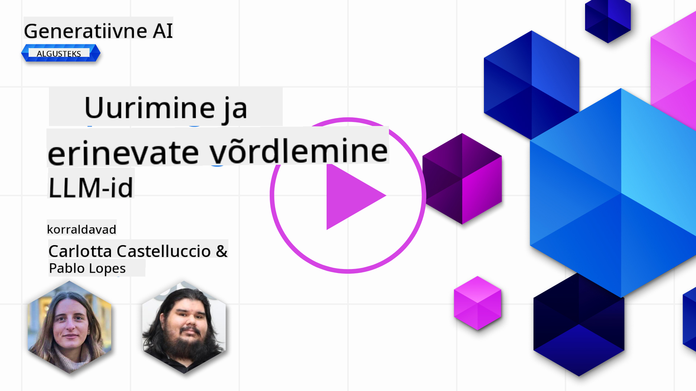
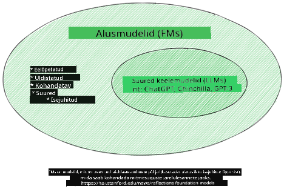
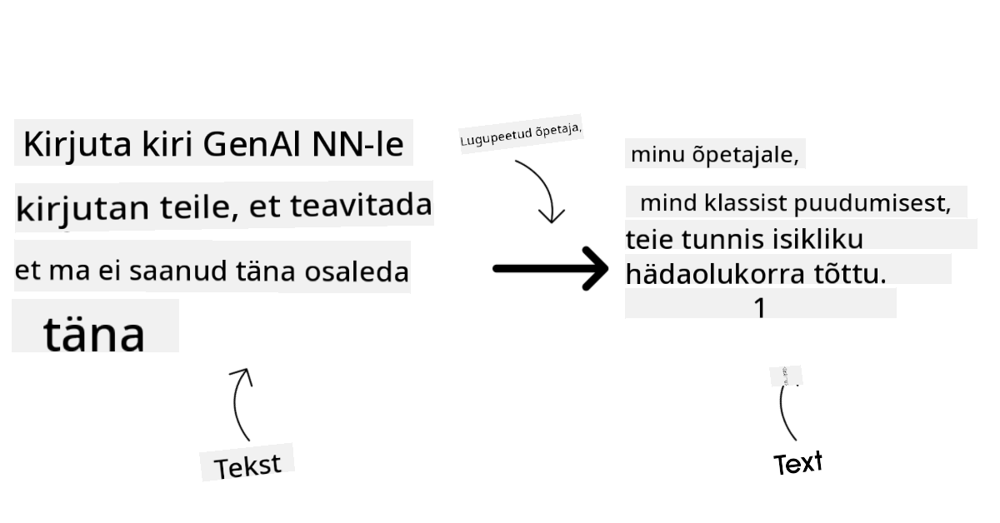
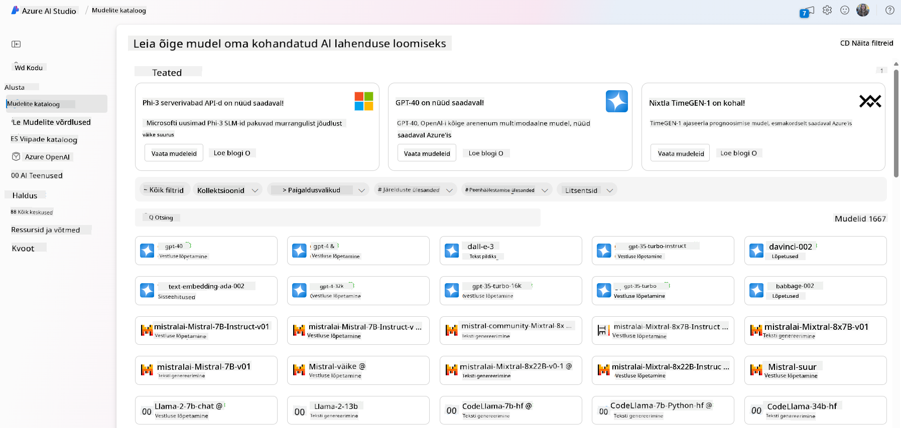
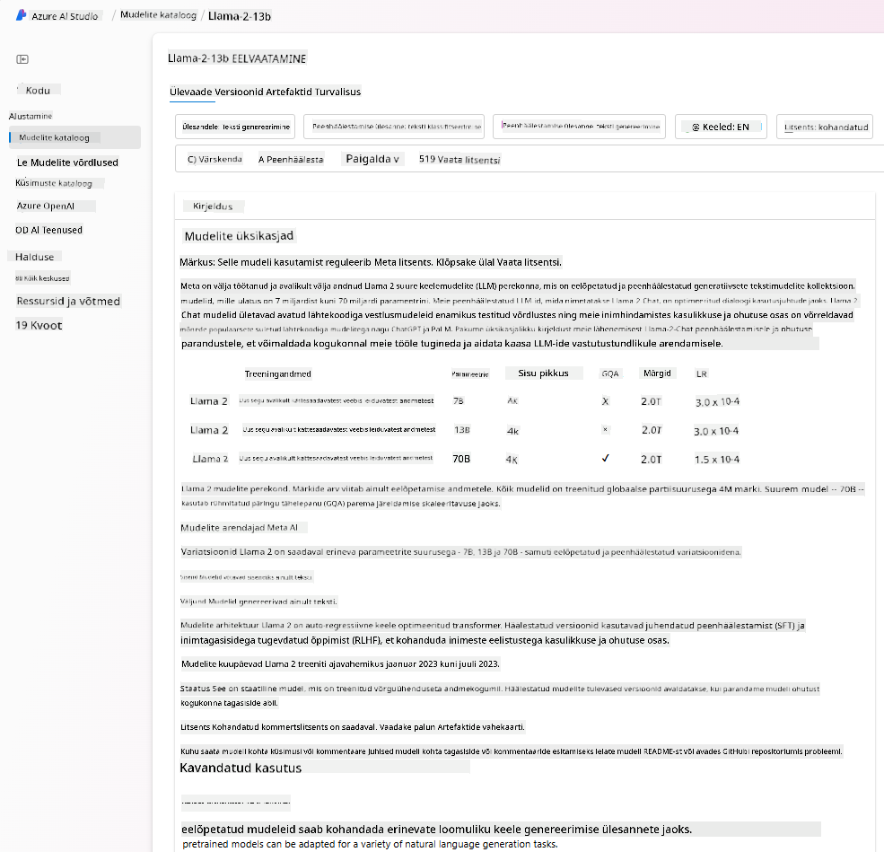
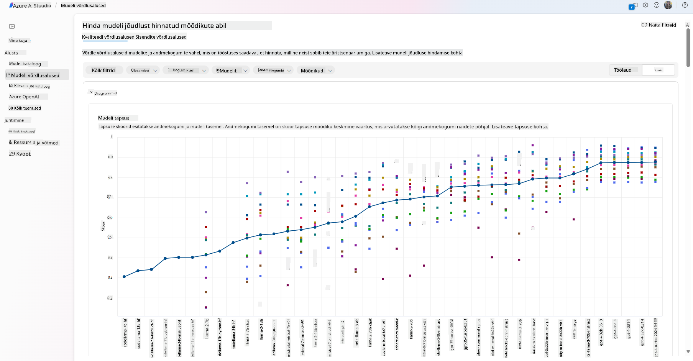
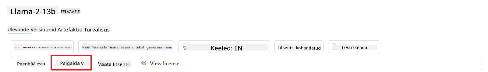
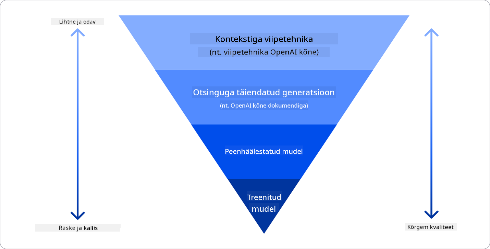

<!--
CO_OP_TRANSLATOR_METADATA:
{
  "original_hash": "6b7629b8ee4d7d874a27213e903d86a7",
  "translation_date": "2025-10-18T02:52:36+00:00",
  "source_file": "02-exploring-and-comparing-different-llms/README.md",
  "language_code": "et"
}
-->
# Erinevate suurte keelemudelite (LLM) uurimine ja võrdlemine

> _Klõpsake ülaloleval pildil, et vaadata selle õppetunni videot_

Eelmises õppetunnis nägime, kuidas generatiivne tehisintellekt muudab tehnoloogilist maastikku, kuidas suured keelemudelid (LLM-id) töötavad ja kuidas ettevõte - nagu meie idufirma - saab neid oma kasutusjuhtumites rakendada ja kasvada! Selles peatükis võrdleme ja vastandame erinevaid suuri keelemudeleid (LLM-e), et mõista nende eeliseid ja puudusi.

Meie idufirma järgmine samm on uurida LLM-ide praegust maastikku ja mõista, millised neist sobivad meie kasutusjuhtumile.

## Sissejuhatus

Selles õppetunnis käsitletakse:

- Erinevaid LLM-ide tüüpe praeguses maastikus.
- Mudelite testimist, iteratsiooni ja võrdlemist Azure'is vastavalt teie kasutusjuhtumile.
- Kuidas LLM-i juurutada.

## Õpieesmärgid

Pärast selle õppetunni läbimist oskate:

- Valida oma kasutusjuhtumile sobiva mudeli.
- Mõista, kuidas testida, iteratsiooni teha ja mudeli jõudlust parandada.
- Teada, kuidas ettevõtted mudeleid juurutavad.

## Erinevate LLM-ide mõistmine

LLM-e saab liigitada nende arhitektuuri, treeningandmete ja kasutusjuhtumite alusel. Nende erinevuste mõistmine aitab meie idufirmal valida õige mudeli konkreetse olukorra jaoks ning mõista, kuidas testida, iteratsiooni teha ja jõudlust parandada.

LLM-e on palju erinevaid tüüpe ning mudeli valik sõltub sellest, milleks te neid kasutada soovite, millised on teie andmed, kui palju olete valmis kulutama ja muudest teguritest.

Sõltuvalt sellest, kas soovite mudeleid kasutada teksti, heli, video, pildi genereerimiseks jne, võite valida erinevat tüüpi mudeli.

- **Heli ja kõnetuvastus**. Selleks otstarbeks sobivad suurepäraselt Whisper-tüüpi mudelid, kuna need on üldotstarbelised ja mõeldud kõnetuvastuseks. Need on treenitud mitmekesistel helidel ja suudavad teha mitmekeelset kõnetuvastust. Lisateavet Whisper-tüüpi mudelite kohta leiate [siit](https://platform.openai.com/docs/models/whisper?WT.mc_id=academic-105485-koreyst).

- **Pildigeneratsioon**. Piltide genereerimiseks on DALL-E ja Midjourney kaks väga tuntud valikut. DALL-E on saadaval Azure OpenAI kaudu. [Loe DALL-E kohta rohkem siit](https://platform.openai.com/docs/models/dall-e?WT.mc_id=academic-105485-koreyst) ja ka selle õppekava 9. peatükis.

- **Teksti genereerimine**. Enamik mudeleid on treenitud teksti genereerimiseks ning teil on lai valik alates GPT-3.5-st kuni GPT-4-ni. Need on erineva hinnaga, kusjuures GPT-4 on kõige kallim. Tasub uurida [Azure OpenAI mänguväljakut](https://oai.azure.com/portal/playground?WT.mc_id=academic-105485-koreyst), et hinnata, millised mudelid sobivad teie vajadustele kõige paremini nii võimekuse kui ka kulude osas.

- **Multimodaalsus**. Kui soovite käsitleda mitut tüüpi andmeid sisendis ja väljundis, võiksite uurida mudeleid nagu [gpt-4 turbo koos visuaaliga või gpt-4o](https://learn.microsoft.com/azure/ai-services/openai/concepts/models#gpt-4-and-gpt-4-turbo-models?WT.mc_id=academic-105485-koreyst) - OpenAI mudelite uusimad versioonid - mis suudavad kombineerida loomuliku keele töötlemist visuaalse mõistmisega, võimaldades interaktsioone multimodaalsete liideste kaudu.

Mudeli valimine tähendab, et saate mõned põhilised võimekused, mis ei pruugi siiski olla piisavad. Sageli on teil ettevõtte spetsiifilised andmed, mida peate kuidagi LLM-ile edastama. Selleks on mitmeid erinevaid lähenemisviise, millest räägime lähemalt järgmistes osades.

### Alusmudelid versus LLM-id

Mõiste "alusmudel" [võeti kasutusele Stanfordi teadlaste poolt](https://arxiv.org/abs/2108.07258?WT.mc_id=academic-105485-koreyst) ja see määratleti kui tehisintellekti mudel, mis vastab teatud kriteeriumidele, näiteks:

- **Need on treenitud kasutades juhendamata õppimist või isejuhitavat õppimist**, mis tähendab, et need on treenitud märgistamata multimodaalsete andmete põhjal ning nende treeningprotsess ei nõua inimeste annotatsioone ega andmete märgistamist.
- **Need on väga suured mudelid**, mis põhinevad väga sügavatel närvivõrkudel, mis on treenitud miljardite parameetritega.
- **Need on tavaliselt mõeldud teiste mudelite "aluseks"**, mis tähendab, et neid saab kasutada lähtepunktina teiste mudelite loomiseks, mida saab teha peenhäälestamise teel.

Pildi allikas: [Essential Guide to Foundation Models and Large Language Models | by Babar M Bhatti | Medium
](https://thebabar.medium.com/essential-guide-to-foundation-models-and-large-language-models-27dab58f7404)

Selle eristuse selgitamiseks võtame näiteks ChatGPT. Esimese ChatGPT versiooni loomiseks kasutati alusmudelina GPT-3.5 mudelit. See tähendab, et OpenAI kasutas mõningaid vestlusteemalisi andmeid, et luua GPT-3.5 peenhäälestatud versioon, mis oli spetsialiseerunud vestlusstsenaariumides, näiteks vestlusrobotites, hästi toimima.

Pildi allikas: [2108.07258.pdf (arxiv.org)](https://arxiv.org/pdf/2108.07258.pdf?WT.mc_id=academic-105485-koreyst)

### Avatud lähtekoodiga versus patenteeritud mudelid

Teine viis LLM-ide kategoriseerimiseks on see, kas need on avatud lähtekoodiga või patenteeritud.

Avatud lähtekoodiga mudelid on mudelid, mis on avalikkusele kättesaadavad ja mida igaüks saab kasutada. Need tehakse sageli kättesaadavaks ettevõtte poolt, kes need lõi, või teadusringkondade poolt. Neid mudeleid saab uurida, muuta ja kohandada erinevate LLM-ide kasutusjuhtumite jaoks. Kuid need ei ole alati optimeeritud tootmiskasutuseks ja ei pruugi olla nii tõhusad kui patenteeritud mudelid. Lisaks võib avatud lähtekoodiga mudelite rahastamine olla piiratud, neid ei pruugita pikaajaliselt hooldada ega uuendada uusimate teadusuuringutega. Populaarsed avatud lähtekoodiga mudelite näited on [Alpaca](https://crfm.stanford.edu/2023/03/13/alpaca.html?WT.mc_id=academic-105485-koreyst), [Bloom](https://huggingface.co/bigscience/bloom) ja [LLaMA](https://llama.meta.com).

Patenteeritud mudelid on mudelid, mis kuuluvad ettevõttele ja ei ole avalikkusele kättesaadavad. Need mudelid on sageli optimeeritud tootmiskasutuseks. Kuid neid ei saa uurida, muuta ega kohandada erinevate kasutusjuhtumite jaoks. Lisaks ei ole need alati tasuta saadaval ja nende kasutamiseks võib olla vajalik tellimus või tasu. Samuti ei ole kasutajatel kontrolli mudeli treenimiseks kasutatud andmete üle, mis tähendab, et nad peavad usaldama mudeli omanikku andmete privaatsuse ja tehisintellekti vastutustundliku kasutamise tagamisel. Populaarsed patenteeritud mudelite näited on [OpenAI mudelid](https://platform.openai.com/docs/models/overview?WT.mc_id=academic-105485-koreyst), [Google Bard](https://sapling.ai/llm/bard?WT.mc_id=academic-105485-koreyst) või [Claude 2](https://www.anthropic.com/index/claude-2?WT.mc_id=academic-105485-koreyst).

### Embedding versus pildigeneratsioon versus teksti ja koodi genereerimine

LLM-e saab kategoriseerida ka nende genereeritava väljundi järgi.

Embeddings on mudelite komplekt, mis suudab teisendada teksti numbriliseks vormiks, mida nimetatakse embeddinguks, mis on sisendteksti numbriline esitus. Embeddingud muudavad masinate jaoks lihtsamaks sõnade või lausete vaheliste seoste mõistmise ja neid saab kasutada sisenditena teiste mudelite poolt, nagu klassifitseerimismudelid või klasterdamismudelid, millel on parem jõudlus numbriliste andmete puhul. Embedding-mudeleid kasutatakse sageli ülekandeõppes, kus mudel ehitatakse asendusülesande jaoks, mille jaoks on palju andmeid, ja seejärel kasutatakse mudeli kaalusid (embeddinguid) teiste alluvate ülesannete jaoks. Selle kategooria näide on [OpenAI embeddings](https://platform.openai.com/docs/models/embeddings?WT.mc_id=academic-105485-koreyst).

Pildigeneratsiooni mudelid on mudelid, mis genereerivad pilte. Neid mudeleid kasutatakse sageli pilditöötluseks, pildisünteesiks ja pilditõlgeteks. Pildigeneratsiooni mudelid on sageli treenitud suurte pildikogumite põhjal, nagu [LAION-5B](https://laion.ai/blog/laion-5b/?WT.mc_id=academic-105485-koreyst), ja neid saab kasutada uute piltide genereerimiseks või olemasolevate piltide redigeerimiseks, kasutades tehnikaid nagu inpainting, super-resolutsioon ja värvimine. Näited hõlmavad [DALL-E-3](https://openai.com/dall-e-3?WT.mc_id=academic-105485-koreyst) ja [Stable Diffusion mudelid](https://github.com/Stability-AI/StableDiffusion?WT.mc_id=academic-105485-koreyst).

Teksti ja koodi genereerimise mudelid on mudelid, mis genereerivad teksti või koodi. Neid mudeleid kasutatakse sageli teksti kokkuvõtete tegemiseks, tõlkimiseks ja küsimustele vastamiseks. Teksti genereerimise mudelid on sageli treenitud suurte tekstikogumite põhjal, nagu [BookCorpus](https://www.cv-foundation.org/openaccess/content_iccv_2015/html/Zhu_Aligning_Books_and_ICCV_2015_paper.html?WT.mc_id=academic-105485-koreyst), ja neid saab kasutada uue teksti genereerimiseks või küsimustele vastamiseks. Koodi genereerimise mudelid, nagu [CodeParrot](https://huggingface.co/codeparrot?WT.mc_id=academic-105485-koreyst), on sageli treenitud suurte koodikogumite põhjal, nagu GitHub, ja neid saab kasutada uue koodi genereerimiseks või olemasoleva koodi vigade parandamiseks.

### Kodeerija-dekodeerija versus ainult dekodeerija

Rääkides LLM-ide erinevatest arhitektuuritüüpidest, kasutame analoogiat.

Kujutage ette, et teie juht andis teile ülesande koostada viktoriin õpilastele. Teil on kaks kolleegi; üks vastutab sisu loomise eest ja teine selle ülevaatamise eest.

Sisulooja on nagu ainult dekodeerija mudel, ta saab vaadata teemat ja seda, mida te juba kirjutasite, ning seejärel koostada kursuse selle põhjal. Nad on väga head kaasahaarava ja informatiivse sisu kirjutamises, kuid nad ei ole väga head teema ja õpieesmärkide mõistmises. Mõned ainult dekodeerija mudelite näited on GPT perekonna mudelid, nagu GPT-3.

Revident on nagu ainult kodeerija mudel, ta vaatab kirjutatud kursust ja vastuseid, märkab nendevahelisi seoseid ja mõistab konteksti, kuid ei ole hea sisu genereerimises. Näiteks ainult kodeerija mudel oleks BERT.

Kujutage ette, et meil võiks olla keegi, kes suudaks nii viktoriini luua kui ka üle vaadata, see oleks kodeerija-dekodeerija mudel. Mõned näited oleksid BART ja T5.

### Teenus versus mudel

Räägime nüüd teenuse ja mudeli erinevusest. Teenus on toode, mida pakub pilveteenuse pakkuja ja mis on sageli mudelite, andmete ja muude komponentide kombinatsioon. Mudel on teenuse põhikomponent ja on sageli alusmudel, nagu LLM.

Teenused on sageli optimeeritud tootmiskasutuseks ja neid on sageli lihtsam kasutada kui mudeleid, kasutades graafilist kasutajaliidest. Kuid teenused ei ole alati tasuta saadaval ja nende kasutamiseks võib olla vajalik tellimus või tasu, vastutasuks teenuse omaniku seadmete ja ressursside kasutamise eest, kulude optimeerimiseks ja lihtsaks skaleerimiseks. Teenuse näide on [Azure OpenAI Service](https://learn.microsoft.com/azure/ai-services/openai/overview?WT.mc_id=academic-105485-koreyst), mis pakub tasu vastavalt kasutusele, mis tähendab, et kasutajatelt võetakse tasu proportsionaalselt teenuse kasutamise mahuga. Lisaks pakub Azure OpenAI Service ettevõtte tasemel turvalisust ja vastutustundliku tehisintellekti raamistikku mudelite võimekuse peal.

Mudelid on lihtsalt närvivõrgud, koos parameetrite, kaalude ja muuga. Need võimaldavad ettevõtetel neid kohapeal käitada, kuid selleks on vaja osta seadmeid, ehitada struktuur skaleerimiseks ja osta litsents või kasutada avatud lähtekoodiga mudelit. Mudel nagu LLaMA on kasutamiseks saadaval, kuid selle käitamiseks on vaja arvutusvõimsust.

## Kuidas testida ja iteratsiooni teha erinevate mudelitega, et mõista jõudlust Azure'is

Kui meie meeskond on uurinud praegust LLM-ide maastikku ja tuvastanud mõned head kandidaadid oma stsenaariumide jaoks, on järgmine samm nende testimine oma andmetel ja töökoormusel. See on iteratiivne protsess, mis toimub katsete ja mõõtmiste kaudu.
Enamik mudeleid, mida mainisime eelnevates lõikudes (OpenAI mudelid, avatud lähtekoodiga mudelid nagu Llama2 ja Hugging Face transformers), on saadaval [Model Catalog](https://learn.microsoft.com/azure/ai-studio/how-to/model-catalog-overview?WT.mc_id=academic-105485-koreyst) lehel [Azure AI Studio](https://ai.azure.com/?WT.mc_id=academic-105485-koreyst).

[Azure AI Studio](https://learn.microsoft.com/azure/ai-studio/what-is-ai-studio?WT.mc_id=academic-105485-koreyst) on pilveplatvorm, mis on loodud arendajatele generatiivsete tehisintellekti rakenduste loomiseks ja kogu arendustsükli haldamiseks - alates katsetamisest kuni hindamiseni - ühendades kõik Azure AI teenused ühte mugavasse kasutajaliidesesse. Model Catalog Azure AI Studios võimaldab kasutajal:

- Leida kataloogist huvipakkuv Foundation Model - kas omandatud või avatud lähtekoodiga, filtreerides ülesande, litsentsi või nime järgi. Otsingut lihtsustamiseks on mudelid organiseeritud kollektsioonidesse, nagu Azure OpenAI kollektsioon, Hugging Face kollektsioon ja teised.

- Vaadata mudelikaarti, mis sisaldab üksikasjalikku kirjeldust kavandatud kasutuse ja treeningandmete kohta, koodinäiteid ja hindamistulemusi sisemise hindamisraamatukogu põhjal.

- Võrrelda tööstuses saadaval olevate mudelite ja andmekogumite võrdlusaluseid, et hinnata, milline neist vastab äristsenaariumile, kasutades [Model Benchmarks](https://learn.microsoft.com/azure/ai-studio/how-to/model-benchmarks?WT.mc_id=academic-105485-koreyst) paneeli.

- Kohandada mudelit oma treeningandmete põhjal, et parandada mudeli jõudlust konkreetses töökoormuses, kasutades Azure AI Studio katsetamise ja jälgimise võimalusi.

- Paigaldada algne eeltreenitud mudel või kohandatud versioon kaugjuhtimisega reaalajas järelduste tegemiseks - hallatud arvutusvõimsus - või serverivaba API lõpp-punkti - [maksa vastavalt kasutusele](https://learn.microsoft.com/azure/ai-studio/how-to/model-catalog-overview#model-deployment-managed-compute-and-serverless-api-pay-as-you-go?WT.mc_id=academic-105485-koreyst) - et võimaldada rakendustel seda kasutada.

> [!NOTE]
> Kõik kataloogis olevad mudelid ei ole praegu saadaval kohandamiseks ja/või maksa vastavalt kasutusele paigaldamiseks. Kontrollige mudelikaarti, et saada teavet mudeli võimaluste ja piirangute kohta.

## LLM-i tulemuste parandamine

Oleme oma idufirma meeskonnaga uurinud erinevaid LLM-e ja pilveplatvormi (Azure Machine Learning), mis võimaldab meil võrrelda erinevaid mudeleid, hinnata neid testandmetel, parandada jõudlust ja paigaldada neid järelduste tegemise lõpp-punktidesse.

Millal peaksid nad kaaluma mudeli kohandamist, mitte eeltreenitud mudeli kasutamist? Kas on olemas muid lähenemisviise mudeli jõudluse parandamiseks konkreetsetes töökoormustes?

Ettevõtted saavad kasutada mitmeid lähenemisviise, et saavutada LLM-ilt soovitud tulemusi. LLM-i tootmisesse paigaldamisel saab valida erinevat tüüpi mudeleid, millel on erinev treenituse tase, keerukus, maksumus ja kvaliteet. Siin on mõned erinevad lähenemisviisid:

- **Prompt engineering koos kontekstiga**. Idee on anda piisavalt konteksti, et tagada soovitud vastused.

- **Retrieval Augmented Generation, RAG**. Teie andmed võivad olla näiteks andmebaasis või veebipõhises lõpp-punktis. Selleks, et need andmed või nende alamhulk oleksid kaasatud päringu esitamise ajal, saate asjakohased andmed hankida ja lisada need kasutaja päringusse.

- **Kohandatud mudel**. Siin treenitakse mudelit edasi teie enda andmetega, mis muudab mudeli täpsemaks ja vastavaks teie vajadustele, kuid võib olla kulukas.

Pildi allikas: [Four Ways that Enterprises Deploy LLMs | Fiddler AI Blog](https://www.fiddler.ai/blog/four-ways-that-enterprises-deploy-llms?WT.mc_id=academic-105485-koreyst)

### Prompt engineering koos kontekstiga

Eeltreenitud LLM-id töötavad väga hästi üldistel loomuliku keele ülesannetel, isegi kui neile esitatakse lühike päring, näiteks lause lõpetamiseks või küsimusele vastamiseks – nn "null-laskmise" õppimine.

Kuid mida rohkem kasutaja suudab oma päringut raamida, esitades üksikasjaliku taotluse ja näiteid – konteksti – seda täpsem ja kasutaja ootustele vastavam on vastus. Sel juhul räägime "ühe laskmise" õppimisest, kui päring sisaldab ainult ühte näidet, ja "mõne laskmise" õppimisest, kui see sisaldab mitut näidet. Prompt engineering koos kontekstiga on kõige kulutõhusam lähenemisviis alustamiseks.

### Retrieval Augmented Generation (RAG)

LLM-idel on piirang, et nad saavad vastuse genereerimiseks kasutada ainult andmeid, mida on nende treenimisel kasutatud. See tähendab, et nad ei tea midagi faktidest, mis juhtusid pärast nende treenimisprotsessi, ja nad ei pääse ligi mitteavalikule teabele (näiteks ettevõtte andmed). 

Seda saab ületada RAG-i abil, mis on tehnika, mis täiendab päringut väliste andmetega dokumentide osade kujul, arvestades päringu pikkuse piiranguid. Seda toetavad vektorandmebaasi tööriistad (nagu [Azure Vector Search](https://learn.microsoft.com/azure/search/vector-search-overview?WT.mc_id=academic-105485-koreyst)), mis otsivad kasulikke osasid erinevatest eelnevalt määratletud andmeallikatest ja lisavad need päringu konteksti.

See tehnika on väga kasulik, kui ettevõttel pole piisavalt andmeid, aega ega ressursse LLM-i kohandamiseks, kuid soovitakse siiski parandada jõudlust konkreetses töökoormuses ja vähendada valeandmete riski, st reaalsuse moonutamist või kahjuliku sisu loomist.

### Kohandatud mudel

Kohandamine on protsess, mis kasutab ülekandeõpet, et "kohandada" mudelit allavoolu ülesandele või konkreetse probleemi lahendamiseks. Erinevalt mõne laskmise õppimisest ja RAG-ist, tulemuseks on uus mudel, millel on uuendatud kaalud ja eelarvamused. See nõuab treeningnäidete komplekti, mis koosneb ühest sisendist (päring) ja sellega seotud väljundist (täitmine). 

See oleks eelistatud lähenemisviis, kui:

- **Kasutatakse kohandatud mudeleid**. Ettevõte soovib kasutada kohandatud vähem võimekaid mudeleid (nagu sisumudeleid) pigem kui kõrge jõudlusega mudeleid, mis toob kaasa kulutõhusama ja kiirema lahenduse.

- **Arvestatakse latentsust**. Latentsus on konkreetse kasutusjuhtumi jaoks oluline, mistõttu pole võimalik kasutada väga pikki päringuid või näidete arvu, mida mudel peaks õppima, ei mahu päringu pikkuse piirangutesse.

- **Püsitakse ajakohasena**. Ettevõttel on palju kvaliteetseid andmeid ja tõeseid märgiseid ning ressursse, et neid andmeid aja jooksul ajakohasena hoida.

### Treenitud mudel

LLM-i nullist treenimine on kahtlemata kõige raskem ja keerukam lähenemisviis, mis nõuab tohutul hulgal andmeid, oskuslikke ressursse ja sobivat arvutusvõimsust. Seda võimalust tuleks kaaluda ainult juhul, kui ettevõttel on valdkonnaspetsiifiline kasutusjuhtum ja suur hulk valdkonnakeskseid andmeid.

## Teadmiste kontroll

Milline võiks olla hea lähenemisviis LLM-i täitmistulemuste parandamiseks?

1. Prompt engineering koos kontekstiga  
1. RAG  
1. Kohandatud mudel  

A:3, kui teil on aega ja ressursse ning kvaliteetseid andmeid, on kohandamine parem valik, et püsida ajakohasena. Kui aga soovite asju parandada ja teil pole aega, tasub kõigepealt kaaluda RAG-i.

## 🚀 Väljakutse

Lugege rohkem selle kohta, kuidas saate [kasutada RAG-i](https://learn.microsoft.com/azure/search/retrieval-augmented-generation-overview?WT.mc_id=academic-105485-koreyst) oma ettevõtte jaoks.

## Suurepärane töö, jätkake õppimist

Pärast selle õppetunni läbimist tutvuge meie [Generative AI Learning collection](https://aka.ms/genai-collection?WT.mc_id=academic-105485-koreyst) lehega, et jätkata oma generatiivse tehisintellekti teadmiste arendamist!

Liikuge edasi 3. õppetundi, kus vaatame, kuidas [ehitada generatiivset tehisintellekti vastutustundlikult](../03-using-generative-ai-responsibly/README.md?WT.mc_id=academic-105485-koreyst)!

---

**Lahtiütlus**:  
See dokument on tõlgitud AI tõlketeenuse [Co-op Translator](https://github.com/Azure/co-op-translator) abil. Kuigi püüame tagada täpsust, palume arvestada, et automaatsed tõlked võivad sisaldada vigu või ebatäpsusi. Algne dokument selle algses keeles tuleks pidada autoriteetseks allikaks. Olulise teabe puhul soovitame kasutada professionaalset inimtõlget. Me ei vastuta arusaamatuste või valesti tõlgenduste eest, mis võivad tekkida selle tõlke kasutamise tõttu.