# Erinevate LLM-ide uurimine ja võrdlemine

[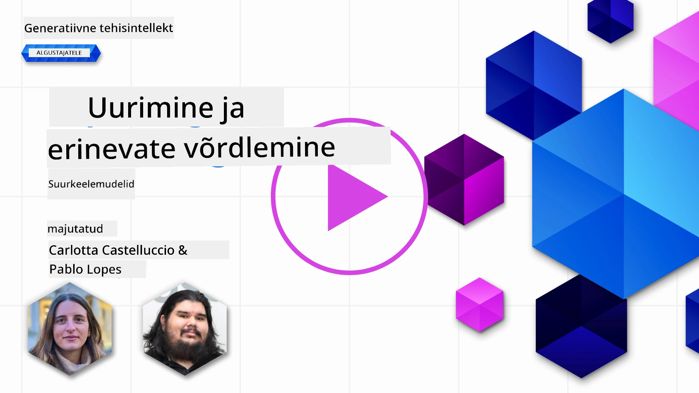](https://youtu.be/KIRUeDKscfI?si=8BHX1zvwzQBn-PlK)

> _Klõpsake ülaloleval pildil, et vaadata selle tunni videot_

Eelmise tunniga nägime, kuidas generatiivne tehisintellekt muudab tehnoloogiate maastikku, kuidas suured keelemudelid (LLMid) töötavad ja kuidas ettevõte — näiteks meie idufirma — saab neid oma kasutusjuhtudel rakendada ja kasvada! Selles peatükis vaatleme erinevate suurte keelemudelite (LLM-ide) tüüpe ning võrdleme nende plusse ja miinuseid.

Järgmiseks sammuks meie idufirma teekonnal on uurida olemasolevat LLM-ide maastikku ja mõista, millised sobivad meie kasutusjuhtumile.

## Sissejuhatus

See tund hõlmab:

- Praegused erinevad LLM-tüübid.
- Mudelite testimine, iteratiivne täiustamine ja võrdlemine Azure’is teie kasutusjuhtumi jaoks.
- Kuidas LLM-i juurutada.

## Õpieesmärgid

Pärast selle tunni läbimist saate:

- Valida õige mudel oma kasutusjuhtumi jaoks.
- Mõista, kuidas mudelit testida, täiustada ja jõudlust parandada.
- Teada, kuidas ettevõtted mudeleid juurutavad.

## Mõista erinevaid LLM-tüüpe

LLM-e saab kategooriateks jaotada nende arhitektuuri, koolitusandmete ja kasutusjuhtumi põhjal. Nende erinevuste mõistmine aitab meie idufirmal valida õige mudeli vastava stsenaariumi jaoks ning mõista, kuidas mudelit testida, täiustada ja jõudlust parandada.

LLL-mudelite tüüpe on palju — mudeli valik sõltub sellest, milleks soovite neid kasutada, teie andmetest, valmisolekust maksta ja muudest teguritest.

Sõltuvalt sellest, kas soovite kasutada mudeleid teksti, heli, video, pildi genereerimiseks jms, võite valida erinevat tüüpi mudeli.

- **Heli ja kõnetuvastus**. Whisper-laadsed mudelid on endiselt kasulikud üldotstarbelised kõnetuvastusmudelid, kuid tootmiskasutuses on nüüd ka uuemad kõnest tekstiks mudelid nagu `gpt-4o-transcribe`, `gpt-4o-mini-transcribe` ja diariseerimisvariantid. Hinnake oma stsenaariumi jaoks keelteulatus, diariseerimine, reaalajas tugi, latentsus ja maksumus. Lisateavet leiate [OpenAI kõnest tekstiks dokumentatsioonist](https://platform.openai.com/docs/guides/speech-to-text?WT.mc_id=academic-105485-koreyst).

- **Pildigeneratsioon**. DALL-E ja Midjourney on hästi tuntud pildigeneratsiooni võimalused, kuid praegused OpenAI pildi-API-d keskenduvad GPT pildimudelitele nagu `gpt-image-2`, samas kui Stable Diffusion, Imagen, Flux ja teised mudelite pered on samuti tavalised valikud. Võrrelge käsu järgimist, redigeerimistoetust, stiilikontrolli, turvanõudeid ja litsentseerimist. Lisateavet leiate [OpenAI pildigeneratsiooni juhendist](https://platform.openai.com/docs/guides/images?WT.mc_id=academic-105485-koreyst) ning selle õppekava 9. peatükist.

- **Tekstigeneratsioon**. Tekstimudelid hõlmavad nüüd tipptasemel mudeleid, loogikamodelle, väiksemaid madala latentsusega mudeleid ja avatud kaaludega mudeleid. Praeguste näidete hulka kuuluvad OpenAI GPT-5.x mudelid, Anthropic Claude 4.x mudelid, Google Gemini 3.x mudelid, Meta Llama 4 mudelid ja Mistral mudelid. Ärge valige ainult väljaandmiskuupäeva või hinna järgi; võrrelge ülesande kvaliteeti, latentsust, kontekstiakent, tööriistakasutust, turvakäitumist, regionaalset saadavust ja kogukulusid. [Microsoft Foundry mudelikataloog](https://ai.azure.com/catalog?WT.mc_id=academic-105485-koreyst) on hea koht, kus võrrelda Azure’is saadaolevaid mudeleid.

- **Mitme modaliteedi tugi**. Paljud praegused mudelid suudavad töödelda rohkem kui teksti. Mõned aktsepteerivad pildi, heli või video sisendeid; mõned võivad kasutada tööriistu; ning spetsiifilised mudelid suudavad genereerida pilte, heli või videot. Näiteks praegused OpenAI mudelid toetavad teksti ja pildi sisendeid, Gemini mudelid võivad erinevate variatsioonide puhul toetada teksti, koodi, pilti, heli ja videot ning Llama 4 Scout ja Maverick on avatud kaaluga natiivselt multimodaalsed mudelid. Enne töövoo loomist kontrollige alati iga mudelikaardi puhul toetatud sisendi ja väljundi modaliteete.

Mudeli valimine tähendab, et saate mõned põhilised võimed, mis aga ei pruugi alati piisavad olla. Tihti on teil ettevõttele omaseid andmeid, millest peate LLM-ile kuidagi teatama. Selleks on mõned erinevad võimalused, millest räägime järgmistes osades.

### Alusmudelid võrreldes LLM-idega

Mõistet Alusmudel kasutasid [Stanfordi teadlased](https://arxiv.org/abs/2108.07258?WT.mc_id=academic-105485-koreyst) ja määratlesid selle kui tehisintellekti mudeli, mis vastab teatud kriteeriumidele, näiteks:

- **Need on treenitud juhendamata õppe või enesejuhitud õppe meetodil**, mis tähendab, et neid treenitakse märgistamata, mitmemodaalsetel andmetel ning nende treeninguks pole vaja inimlike annotatsioonide või märgistuste kasutamist.
- **Need on väga suured mudelid**, põhinedes väga sügavatel närvivõrkudel ja treenitud miljardite parameetritega.
- **Neid kasutatakse tavaliselt kui „alust“ teiste mudelite jaoks**, mis tähendab, et neid saab kasutada lähtepunktina teiste mudelite ehitamiseks, seda saab teha peenhäälestamise teel.

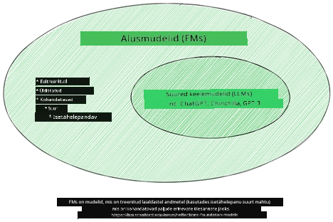

Pildiallikas: [Oluline juhend alusmudelite ja suurte keelemudelite kohta | autor Babar M Bhatti | Medium
](https://thebabar.medium.com/essential-guide-to-foundation-models-and-large-language-models-27dab58f7404)

Selle eristuse selgitamiseks võtame ajaloolise näite ChatGPT-st. Varasemad ChatGPT versioonid kasutasid alusmudelina GPT-3.5. OpenAI kasutas seejärel vestluslike stsenaariumide jaoks parema toimivusega peenhäälestatud versiooni loomiseks vestlusele spetsiifilisi andmeid ja joondamistehnikaid, näiteks vestlusrobotitel. Kaasaegsed tehisintellekti teenused kasutavad tihti mitme mudelivariandi vahel, nii et teenuse nimi ja aluseks oleva mudeli nimi ei ole alati identsed.

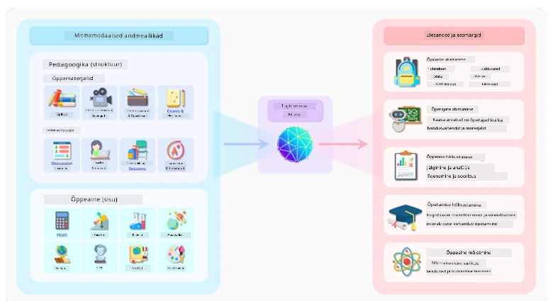

Pildiallikas: [2108.07258.pdf (arxiv.org)](https://arxiv.org/pdf/2108.07258.pdf?WT.mc_id=academic-105485-koreyst)

### Avatud kaaluga/avatud lähtekoodiga versus patenteeritud mudelid

Teine viis LLM-ide klassifitseerimiseks on see, kas need on avatud kaaluga, avatud lähtekoodiga või patenteeritud.

Avatud lähtekoodiga ja avatud kaaluga mudelid võimaldavad mudeli komponente uurida, alla laadida või kohandada, kuid nende litsentsid erinevad. Mõned on täielikult avatud lähtekoodiga, teised on avatud kaaluga mudelid kasutuspiirangutega. Need on kasulikud ettevõtetele, kes vajavad rohkem kontrolli juurutamise, andmete asukoha, maksumuse või kohandamise üle. Kuid meeskonnad peavad enne tootmiskasutusse võtmist üle vaatama litsentsitingimused, teeninduskulud, hoolduse, turvauuendused ja hindamise kvaliteedi. Näideteks on [Meta Llama 4](https://ai.meta.com/blog/llama-4-multimodal-intelligence/?WT.mc_id=academic-105485-koreyst), mõned [Mistral mudelid](https://docs.mistral.ai/models/overview?WT.mc_id=academic-105485-koreyst) ja paljud mudelid, mis on majutatud [Hugging Face’is](https://huggingface.co/models?WT.mc_id=academic-105485-koreyst).

Patenteeritud mudelid kuuluvad ja neid majutab teenusepakkuja. Need mudelid on tihti optimeeritud hallatuks tootmiskasutuseks ning pakuvad tugevat tuge, turvasüsteeme, tööriistade integratsiooni ja skaleeritavust. Kuid klientidel tavaliselt ei ole võimalik mudeli kaalusid uurida ega muuta ning nad peavad hoolikalt läbivaadata pakkuja tingimused privaatsuse, säilitamise, vastavuse ja sobiliku kasutuse kohta. Näideteks on [OpenAI mudelid](https://platform.openai.com/docs/models?WT.mc_id=academic-105485-koreyst), [Google Gemini](https://deepmind.google/models/gemini/pro/?WT.mc_id=academic-105485-koreyst) ja [Anthropic Claude](https://platform.claude.com/docs/en/about-claude/models/overview?WT.mc_id=academic-105485-koreyst).

### Embedding versus pildigeneratsioon versus teksti ja koodi genereerimine

LLM-e saab klassifitseerida ka väljundi tüübi järgi.

Embeddingud on mudelite komplekt, mis suudavad teksti konverteerida numbriliseks kujuks, mida nimetatakse embedinguiks — see on sisendi teksti numbriline esitus. Embeddingud võimaldavad masinatel paremini mõista sõnade või lausete vahelisi seoseid ja neid saab kasutada sisendina teistele mudelitele, nagu klassifikatsioonimudelid või grupeerimismudelid, millel on parem toimivus numbriliste andmete toetamisel. Embedding-mudeleid kasutatakse tihti ülekandeõppeks (transfer learning), kus mudel ehitatakse varjatud ülesande jaoks, mille jaoks on palju andmeid, ja seejärel kasutatakse mudeli kaalusid (embeddinguid) teiste allülesannete jaoks uuesti. Selle kategooria näide on [OpenAI embeddingud](https://platform.openai.com/docs/models/embeddings?WT.mc_id=academic-105485-koreyst).

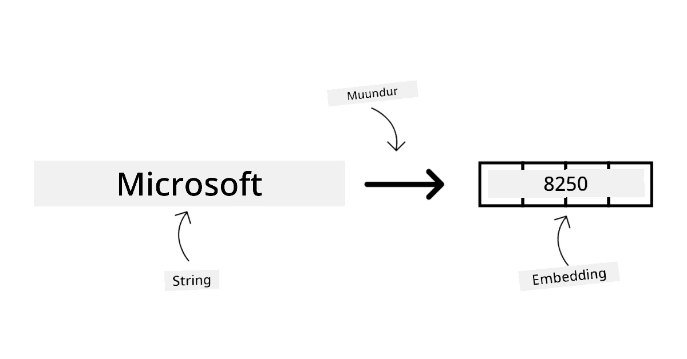

Pildigeneratsioonimudelid on mudelid, mis loovad pilte. Neid kasutatakse sageli piltide redigeerimiseks, sünteesimiseks ja tõlkimiseks. Pildigeneratsioonimudeleid treenitakse tihti suurte pildiandmetega, näiteks [LAION-5B](https://laion.ai/blog/laion-5b/?WT.mc_id=academic-105485-koreyst), ning neid saab kasutada uute piltide genereerimiseks või olemasolevate piltide redigeerimiseks inpaintingu, kõrgresolutsiooni ja värvimise tehnikate abil. Näideteks on [GPT pildimudelid](https://platform.openai.com/docs/guides/images?WT.mc_id=academic-105485-koreyst), [Stable Diffusion mudelid](https://github.com/Stability-AI/StableDiffusion?WT.mc_id=academic-105485-koreyst) ja Imagen mudelid.

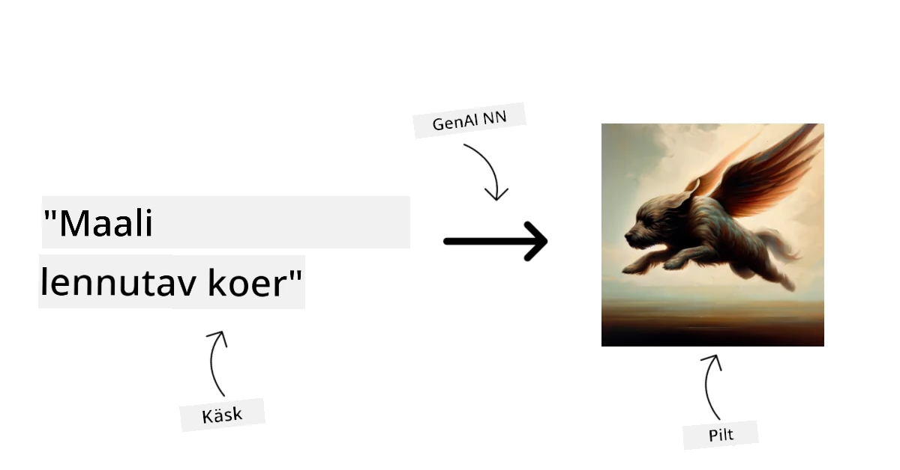

Teksti ja koodi genereerimise mudelid loovad teksti või koodi. Neid kasutatakse tihti teksti kokkusurumiseks, tõlkimiseks ja küsimustele vastamiseks. Tekstigeneratsioonimudeleid treenitakse tihti suurte tekstandmetega, näiteks [BookCorpus](https://www.cv-foundation.org/openaccess/content_iccv_2015/html/Zhu_Aligning_Books_and_ICCV_2015_paper.html?WT.mc_id=academic-105485-koreyst), ning neid saab kasutada uue teksti genereerimiseks või küsimustele vastamiseks. Koodigeneratsioonimudeleid, nagu [CodeParrot](https://huggingface.co/codeparrot?WT.mc_id=academic-105485-koreyst), treenitakse sageli suurte koodiandmetega, näiteks GitHubi andmetel, ja neid saab kasutada uue koodi genereerimiseks või olemasoleva koodi vigade parandamiseks.

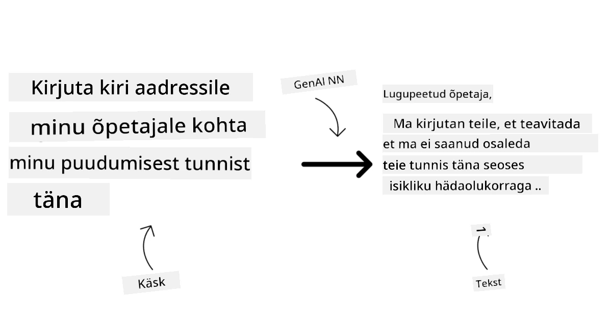

### Kodeerija-dekodeerija versus ainult dekodeerija

LLM-ide erinevate arhitektuuritüüpide selgitamiseks kasutame analoogiat.

Kujutage ette, et teie juht andis teile ülesandeks kirjutada viktoriin õpilastele. Teil on kaks kolleegi; üks vastutab sisu loomise eest ja teine ülevaatamise eest.

Sisu looja on kui ainult dekodeerija mudel: ta saab vaadata teemat, näha, mida te juba kirjutasite, ja seejärel jätkata sisu genereerimist selle konteksti põhjal. Ta on väga osav kaasahaarava ja informatiivse sisu kirjutamisel, kuid see pole alati parim valik, kui ülesandeks on vaid info klassifitseerimine, taastamine või kodeerimine. Näideteks on ainult dekodeerija mudelipere nagu GPT ja Llama mudelid.

Ülevaataja on kui ainult kodeerija mudel, kes vaatab kirjutatud teksti ja vastuseid, märkab nendevahelist seost ja mõistab konteksti, kuid ta ei ole hea sisu genereerimisel. Kodeerija mudeli näide oleks BERT.

Kujutage ette, et meil on keegi, kes võiks viktoriini nii luua kui ka üle vaadata — see on kodeerija-dekodeerija mudel. Mõned näited: BART ja T5.

### Teenus versus mudel

Räägime nüüd teenuse ja mudeli erinevusest. Teenus on pilveteenuse pakkuja pakutav toode, mis on tihti kombinatsioon mudelitest, andmetest ja muudest komponentidest. Mudel on teenuse põhikomponent ja tihti alusmudel, näiteks LLM.

Teenused on tihti optimeeritud tootmiskasutuseks ning neid on tavaliselt lihtsam kasutada graafilise kasutajaliidese kaudu kui mudeleid. Teenused ei pruugi alati olla tasuta ning võivad nõuda tellimust või tasu, vahetades teenuse omaniku seadmete ja ressursside kasutusvõimalust, kulude optimeerimist ning skaleerimise lihtsustamist vastu. Näide teenusest on [Azure OpenAI teenus](https://learn.microsoft.com/azure/ai-services/openai/overview?WT.mc_id=academic-105485-koreyst), mis pakub kasutus põhist hinnastamismeetodit, kus kasutajaid arvestatakse proportsionaalselt teenuse kasutusega. Azure OpenAI teenus pakub ka ettevõtte tasemel turvalisust ja vastutustundliku tehisintellekti raamistikku mudelite võimete peal.

Mudelid on närvivõrgu komponendid: parameetrid, kaalud, arhitektuur, tokeniseerija ja toetav konfiguratsioon. Mudeli jooksutamine lokaalselt või privaatses keskkonnas nõuab sobivat riistvara, teenindusinfrastruktuuri, jälgimist ning kas ühilduvat avatud lähtekoodi/kaalukasutuslitsentsi või kommertslitsentsi. Avatud kaaluga mudelid nagu Llama 4 või Mistral mudelid saab ise majutada, kuid neil on endiselt vaja arvutusvõimsust ja operatiivset ekspertiisi.

## Kuidas testida ja iteratiivselt täiustada erinevaid mudeleid, et mõista nende jõudlust Azure’is

Kui meie meeskond on uurinud olemasolevat LLM-ide maastikku ja tuvastanud mõned head kandidaadid nende stsenaariumite jaoks, on järgmine samm testida neid oma andmete ja töökoormuse peal. See on iteratiivne protsess, mida tehakse katsete ja mõõtmiste abil.
Enamik mudeleid, millest eelnevates lõikudes rääkisime (OpenAI mudelid, avatud kaaludega mudelid nagu Llama 4 ja Mistral ning Hugging Face mudelid) on saadaval [Microsoft Foundry Models](https://learn.microsoft.com/azure/foundry/concepts/foundry-models-overview?WT.mc_id=academic-105485-koreyst).

[Microsoft Foundry](https://learn.microsoft.com/azure/foundry/what-is-foundry?WT.mc_id=academic-105485-koreyst), endine Azure AI Studio/Azure AI Foundry, on ühtne Azure platvorm tehisintellekti rakenduste ja agentide loomiseks. See aitab arendajatel hallata kogu elutsüklit alates katsetamisest ja hindamisest kuni juurutamise, jälgimise ja halduseni. Microsoft Foundry mudelite kataloog võimaldab kasutajal:

- Leida kataloogist huvipakkuv alusuuringu mudel, sealhulgas Azure’i müüdavad mudelid ning partnerite ja kogukonna pakutavad mudelid. Kasutajad saavad filtreerida ülesande, pakkuja, litsentsi, juurutamisvaliku või nime järgi.

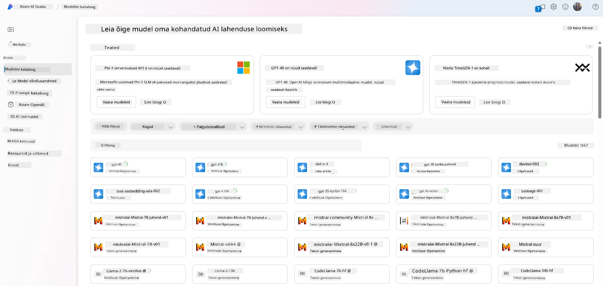

- Läbivaatada mudelikaarti, mis sisaldab üksikasjalikku kirjelduse kavandatud kasutusest ja treeningandmetest, koodinäiteid ning sisemiste hindamiste teeki kuuluvaid hindamistulemusi.

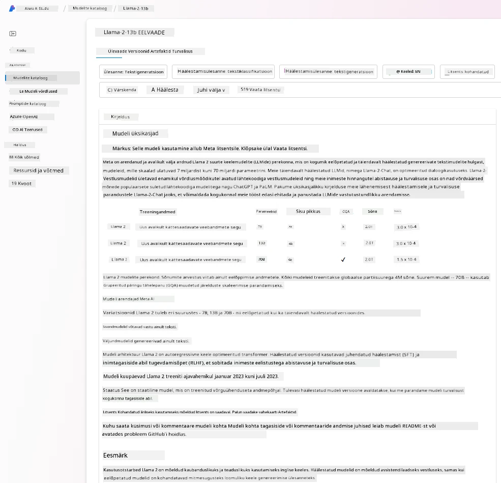

- Võrrelda erinevate mudelite ja andmekogumite võrdlusnäitajaid, mis on tööstuses saadaval, et hinnata, milline neist vastab äristsenaariumile, kasutades selleks [Mudeli võrdlusnäitajate](https://learn.microsoft.com/azure/ai-studio/how-to/model-benchmarks?WT.mc_id=academic-105485-koreyst) lõiku.

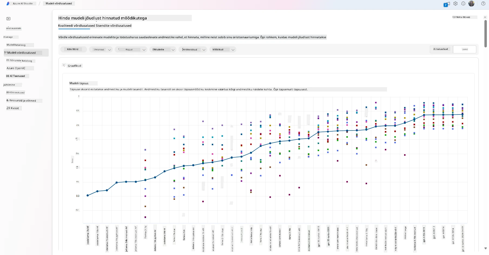

- Parandada toetatud mudeleid kohandatud treeningandmete põhjal, et parandada mudeli jõudlust konkreetses töökoormuses, kasutades Microsoft Foundry katsetamis- ja jälgimisvõimalusi.

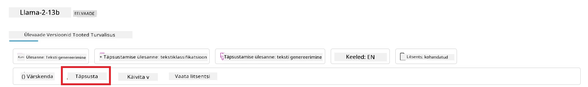

- Juurutada originaalne eelnevalt treenitud mudel või kohandatud versioon kaugel reaalajas tehtava järelduste tegemise lõpp-punkti, kasutades hallatud arvutusressursse või serverivaba juurutamist, et rakendused saaksid seda kasutada.

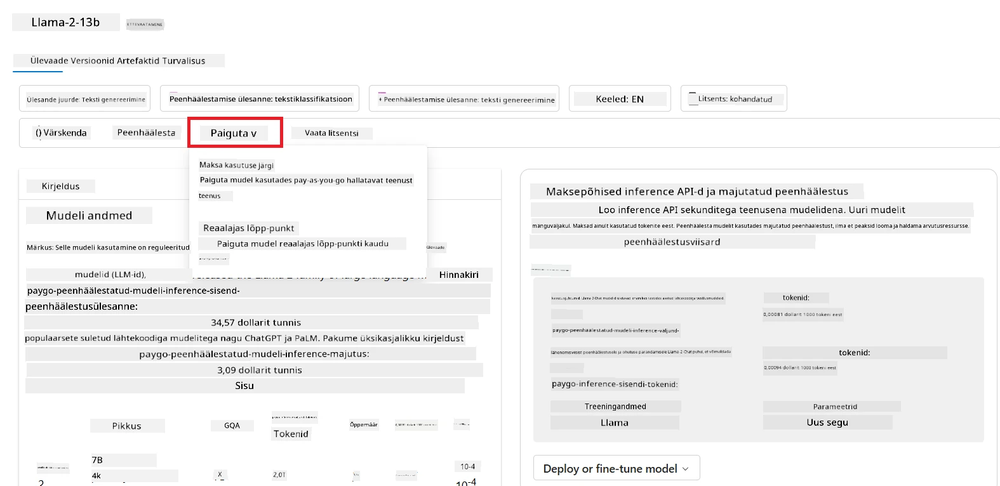

> [!NOTE]
> Kõik kataloogis olevad mudelid ei ole praegu saadaval kohandamiseks ja/või tasu põhise juurutamise jaoks. Kontrollige mudelikaarti, et saada teavet mudeli võimaluste ja piirangute kohta.

## LLM-i tulemuste parandamine

Meie idufirma meeskond on uurinud erinevat tüüpi LLM-e ja pilveplatvormi (Microsoft Foundry), mis võimaldab meil võrrelda erinevaid mudeleid, hinnata neid testandmete põhjal, parandada nende jõudlust ja juurutada neid järelduste tegemise lõpp-punktides.

Aga millal tuleks valida mudeli kohandamine asemel eelnevalt treenitud mudeli kasutamine? Kas on teisi lähenemisviise mudeli jõudluse parandamiseks spetsiifilistes töökoormustes?

Ettevõte saab kasutada mitmeid lähenemisviise, et saada LLM-ist vajalikud tulemused. LLM-i tootmises kasutamiseks saab valida erinevaid mudelitüüpe, mille treeningutase, keerukus, hind ja kvaliteet varieeruvad. Siin on mõned erinevad lähenemisviisid:

- **Kontekstiga promptide insenerimine**. Mõte on anda promptimise ajal piisavalt konteksti, et tagada vajalikud vastused.

- **Andmepõhine genereerimise täiendamine (Retrieval Augmented Generation, RAG)**. Teie andmed võivad olla näiteks andmebaasis või veebilõpp-punktis, et tagada nende või nende alamhulga kaasamine prompti ajal, saate hankida asjakohased andmed ja lisada need kasutaja prompti.

- **Kohandatud mudel**. Siin on mudelit edasi treenitud oma andmete peal, mis teeb mudeli täpsemaks ja vastuvõtlikumaks teie vajadustele, kuid see võib olla kulukas.

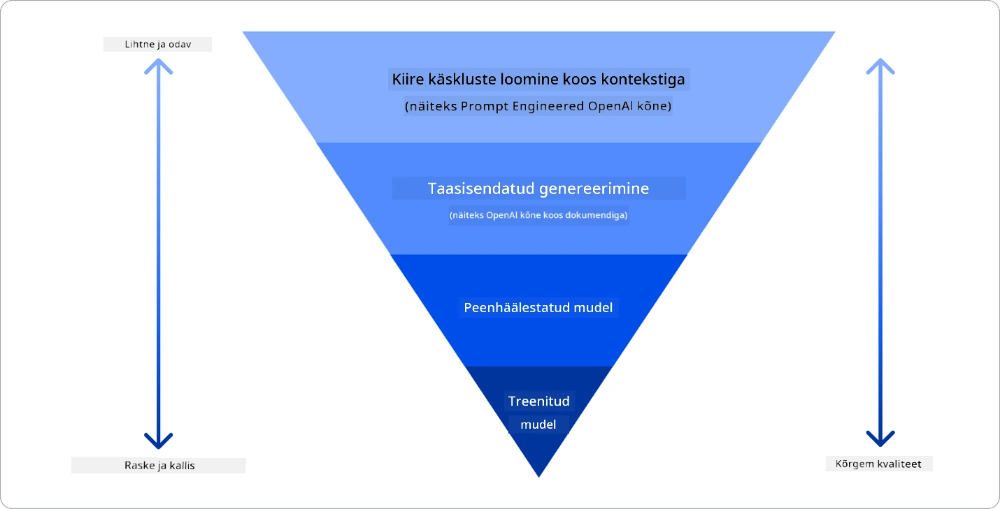

Pildi allikas: [Four Ways that Enterprises Deploy LLMs | Fiddler AI Blog](https://www.fiddler.ai/blog/four-ways-that-enterprises-deploy-llms?WT.mc_id=academic-105485-koreyst)

### Kontekstiga promptide insenerimine

Eelnevalt treenitud LLM-id toimivad väga hästi üldistel loomuliku keele ülesannetel, isegi lühikese prompti, näiteks lause täitmise või küsimuse kujul – nn "zero-shot" õppimise puhul.

Kuid mida paremini kasutaja suudab oma päringut raamida, esitada detailse taotluse ja näited – konteksti – seda täpsem ja ootustele lähem on vastus. Siin räägime "one-shot" õppimisest, kui prompt sisaldab ainult ühte näidet, ja "few-shot" õppimisest, kui näiteid on mitu.
Kontekstiga promptide insenerimine on kõige kulutõhusam lähenemine alustamiseks.

### Andmepõhine genereerimise täiendamine (RAG)

LLM-ide piiranguks on see, et nad saavad vastuse genereerimiseks kasutada ainult oma treeningu käigus kasutatud andmeid. See tähendab, et nad ei tea midagi faktidest, mis on toimunud pärast treeningut, ega pääse ligi mittetöötlemata teabele (nagu ettevõtte andmed).
Seda piirangut saab ületada RAG-i abil, mis täiendab prompti väliste andmetega dokumentide osadena, võttes arvesse prompti pikkuse piire. Seda toetavad vektoriandmebaasi tööriistad (näiteks [Azure Vector Search](https://learn.microsoft.com/azure/search/vector-search-overview?WT.mc_id=academic-105485-koreyst)), mis otsivad kasulikke tükke eri eelnevalt määratletud andmeallikatest ja lisavad selle prompti konteksti.

See tehnika on väga kasulik, kui ettevõttel ei ole piisavalt andmeid, aega või ressursse LLM-i kohandamiseks, kuid soovitakse siiski parandada jõudlust konkreetses töökoormuses ning vähendada hallutsineeritud, aegunud või põhjendamata vastuste riske.

### Kohandatud mudel

Kohandamine on protsess, mis kasutab edasiandõpet mudeli “kohandamiseks” konkreetse ülesande jaoks või kindla probleemi lahendamiseks. Erinevalt "few-shot" õppimisest ja RAG-st, genereeritakse siin uus mudel, millel on uuendatud kaalud ja nihked. Selleks on vaja treeningnäidist, mis koosneb ühest sisendist (prompt) ja vastavast väljundist (täiendamine).
See oleks eelistatud lähenemine, kui:

- **Kasutatakse väiksemaid spetsiifilisi mudeleid**. Ettevõte eelistab kohandada väiksemat mudelit konkreetse piiratuma ülesande jaoks, mitte pidevalt kasutada suuremat tipptasemel mudelit, mis on kuluefektiivsem ja kiirem lahendus.

- **Arvestatakse latentsust**. Latentsus on konkreetse kasutusjuhtumi puhul oluline, mistõttu ei saa kasutada väga pikki prompt’e ega nii palju näiteid, kui mudel nõuab, sest need ei mahu prompti pikkuse piiridesse.

- **Kohandatakse stabiilset käitumist**. Ettevõttel on palju kvaliteetseid näiteid ning ta soovib, et mudel järjekindlalt järgiks ülesande mustrit, väljundformaati, tooni või valdkonnaspetsiifilist stiili. Kui peamised probleemid on värsked faktid või sageli muutuvad privaatteadmised, tuleks RAG-i kasutada iseseisvalt kohandamise asemel.

### Treenitud mudel

LLM-i nullist treenimine on kindlasti kõige keerulisem ja nõudlikum lähenemine, mis vajab tohutult palju andmeid, oskustega ressursse ja sobivat arvutusvõimsust. See valik tuleks kaaluda ainult juhul, kui ettevõttel on valdkonnapõhine kasutusjuhtum ja suur hulk selle valdkonna keskseid andmeid.

## Teadmiste kontroll

Milline võiks olla hea lähenemine LLM-i täitmiste tulemuste parandamiseks?

1. Kontekstiga promptide insenerimine
1. RAG
1. Kohandatud mudel

V: Kõik kolm aitavad. Alusta promptide insenerimisest ja kontekstist kiirete paranduste saavutamiseks ning kasuta RAG-i, kui mudel vajab värskeid fakte või ettevõtte privaatseid andmeid. Valige kohandamine, kui on piisavalt kvaliteetseid näiteid ja mudelit tuleb järjekindlalt jälgida töö, vormingu, tooni või valdkonna mustri osas.

## 🚀 Väljakutse

Loe lähemalt, kuidas saad [kasutada RAG-i](https://learn.microsoft.com/azure/search/retrieval-augmented-generation-overview?WT.mc_id=academic-105485-koreyst) oma ettevõttes.

## Suurepärane töö, jätka õppimist

Pärast selle õppetundi lõpetamist vaata meie [Generative AI õppematerjalide kogumikku](https://aka.ms/genai-collection?WT.mc_id=academic-105485-koreyst), et jätkata oma Generative AI teadmiste tõstmist!

Liigu edasi õppetundi 3, kus vaatame, kuidas [ehitada Generative AI-d vastutustundlikult](../03-using-generative-ai-responsibly/README.md?WT.mc_id=academic-105485-koreyst)!

---

<!-- CO-OP TRANSLATOR DISCLAIMER START -->
**Lahtiütlus**:
See dokument on tõlgitud kasutades AI tõlketeenust [Co-op Translator](https://github.com/Azure/co-op-translator). Kuigi me püüdleme täpsuse poole, palun pange tähele, et automatiseeritud tõlgetes võib esineda vigu või ebatäpsusi. Originaaldokument selle emakeeles tuleks pidada autoriteetseks allikaks. Olulise teabe puhul soovitatakse kasutada professionaalset inimtõlget. Me ei vastuta selle tõlkega seotud eksimustest või valesti mõistmistest.
<!-- CO-OP TRANSLATOR DISCLAIMER END -->