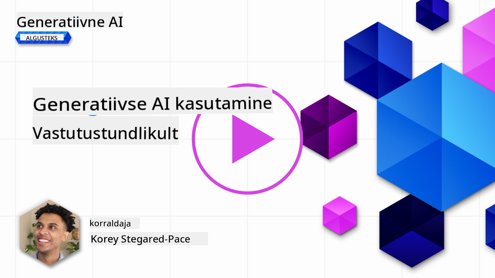
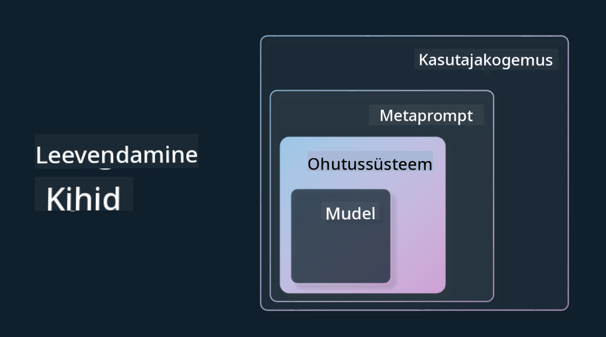

<!--
CO_OP_TRANSLATOR_METADATA:
{
  "original_hash": "4d57fad773cbeb69c5dd62e65c34200d",
  "translation_date": "2025-10-18T02:51:18+00:00",
  "source_file": "03-using-generative-ai-responsibly/README.md",
  "language_code": "et"
}
-->
# Generatiivse tehisintellekti vastutustundlik kasutamine

> _Klõpsa ülaloleval pildil, et vaadata selle õppetunni videot_

Tehisintellekt, eriti generatiivne tehisintellekt, võib olla väga põnev, kuid oluline on mõelda, kuidas seda vastutustundlikult kasutada. Tuleb arvestada näiteks sellega, kuidas tagada, et tulemused oleksid õiglased, mitte kahjulikud ja palju muud. See peatükk annab konteksti, mida arvestada ja kuidas astuda aktiivseid samme tehisintellekti kasutamise parandamiseks.

## Sissejuhatus

Selles õppetunnis käsitletakse:

- Miks peaks eelistama vastutustundlikku tehisintellekti generatiivse tehisintellekti rakenduste loomisel.
- Vastutustundliku tehisintellekti põhimõtteid ja nende seost generatiivse tehisintellektiga.
- Kuidas rakendada vastutustundliku tehisintellekti põhimõtteid strateegia ja tööriistade abil.

## Õppeeesmärgid

Pärast selle õppetunni läbimist tead:

- Miks on vastutustundlik tehisintellekt oluline generatiivse tehisintellekti rakenduste loomisel.
- Millal mõelda ja rakendada vastutustundliku tehisintellekti põhimõtteid generatiivse tehisintellekti rakenduste loomisel.
- Millised tööriistad ja strateegiad on saadaval, et rakendada vastutustundliku tehisintellekti kontseptsiooni.

## Vastutustundliku tehisintellekti põhimõtted

Generatiivse tehisintellekti populaarsus on saavutanud enneolematu taseme. See huvi on toonud valdkonda palju uusi arendajaid, tähelepanu ja rahastust. Kuigi see on väga positiivne kõigile, kes soovivad generatiivse tehisintellekti abil tooteid ja ettevõtteid luua, on oluline tegutseda vastutustundlikult.

Selle kursuse jooksul keskendume oma idufirma ja tehisintellekti haridustoodete loomisele. Kasutame vastutustundliku tehisintellekti põhimõtteid: õiglus, kaasatus, usaldusväärsus/turvalisus, turvalisus ja privaatsus, läbipaistvus ja vastutus. Nende põhimõtete abil uurime, kuidas need seostuvad generatiivse tehisintellekti kasutamisega meie toodetes.

## Miks peaks eelistama vastutustundlikku tehisintellekti

Toote loomisel viib inimkeskne lähenemine, kus arvestatakse kasutaja huvidega, parimate tulemusteni.

Generatiivse tehisintellekti unikaalsus seisneb selle võimes luua kasulikke vastuseid, teavet, juhiseid ja sisu kasutajatele. Seda saab teha ilma paljude käsitsi tehtavate sammudeta, mis võib viia väga muljetavaldavate tulemusteni. Ilma korraliku planeerimise ja strateegiateta võib see kahjuks viia ka kahjulike tulemusteni kasutajate, toote ja ühiskonna jaoks tervikuna.

Vaatame mõningaid (kuid mitte kõiki) potentsiaalselt kahjulikke tulemusi:

### Hallutsinatsioonid

Hallutsinatsioonid on termin, mida kasutatakse, et kirjeldada olukorda, kus LLM (suur keelemudel) genereerib sisu, mis on kas täiesti mõttetu või faktuaalselt vale teiste infoallikate põhjal.

Näiteks loome oma idufirmale funktsiooni, mis võimaldab õpilastel esitada ajaloolisi küsimusi mudelile. Õpilane küsib: `Kes oli Titanic'u ainus ellujäänu?`

Mudel genereerib vastuse, nagu allpool näidatud:

> _(Allikas: [Flying bisons](https://flyingbisons.com?WT.mc_id=academic-105485-koreyst))_

See on väga enesekindel ja põhjalik vastus. Kahjuks on see vale. Isegi minimaalne uurimistöö näitaks, et Titanic'u katastroofist oli rohkem kui üks ellujäänu. Õpilase jaoks, kes alles alustab selle teema uurimist, võib see vastus olla piisavalt veenev, et seda mitte kahtluse alla seada ja võtta faktina. Selle tagajärjed võivad muuta tehisintellekti süsteemi ebausaldusväärseks ja kahjustada meie idufirma mainet.

Iga LLM-i iteratsiooniga oleme näinud paranemist hallutsinatsioonide minimeerimisel. Isegi selle paranemise korral peame rakenduste loojate ja kasutajatena olema teadlikud nendest piirangutest.

### Kahjulik sisu

Eelmises osas käsitlesime olukorda, kus LLM genereerib valesid või mõttetuid vastuseid. Teine risk, mida peame arvestama, on olukord, kus mudel vastab kahjuliku sisuga.

Kahjulik sisu võib olla:

- Juhiste andmine või julgustamine enesevigastamiseks või kahju tekitamiseks teatud gruppidele.
- Vihkav või alandav sisu.
- Juhendamine rünnakute või vägivallategude planeerimiseks.
- Juhiste andmine ebaseadusliku sisu leidmiseks või ebaseaduslike tegude sooritamiseks.
- Seksuaalselt eksplitsiitse sisu kuvamine.

Meie idufirma jaoks tahame tagada, et meil oleks õiged tööriistad ja strateegiad, et takistada sellise sisu jõudmist õpilasteni.

### Õigluse puudumine

Õiglus tähendab, et tehisintellekti süsteem on vaba eelarvamustest ja diskrimineerimisest ning kohtleb kõiki õiglaselt ja võrdselt. Generatiivse tehisintellekti maailmas tahame tagada, et mudeli väljund ei tugevdaks marginaliseeritud gruppide välistavaid maailmavaateid.

Sellised väljundid ei ole ainult destruktiivsed positiivsete tootekogemuste loomisel meie kasutajatele, vaid põhjustavad ka täiendavat kahju ühiskonnale. Rakenduste loojatena peaksime alati arvestama laia ja mitmekesise kasutajaskonnaga, kui loome lahendusi generatiivse tehisintellektiga.

## Kuidas kasutada generatiivset tehisintellekti vastutustundlikult

Nüüd, kui oleme tuvastanud vastutustundliku generatiivse tehisintellekti olulisuse, vaatame 4 sammu, mida saame teha, et ehitada oma tehisintellekti lahendusi vastutustundlikult:

### Potentsiaalsete kahjude hindamine

Tarkvara testimisel testime kasutaja eeldatavaid tegevusi rakenduses. Samamoodi on hea testida mitmekesist valikut päringuid, mida kasutajad tõenäoliselt kasutavad, et hinnata potentsiaalset kahju.

Kuna meie idufirma ehitab haridustoodet, oleks hea koostada nimekiri haridusega seotud päringutest. See võiks hõlmata teatud teemat, ajaloolisi fakte ja päringuid õpilaste elust.

### Potentsiaalsete kahjude leevendamine

Nüüd on aeg leida viise, kuidas mudeli ja selle vastuste põhjustatud kahju ennetada või piirata. Seda saab vaadelda neljal erineval tasandil:

- **Mudel**. Õige mudeli valimine õige kasutusjuhtumi jaoks. Suuremad ja keerukamad mudelid, nagu GPT-4, võivad põhjustada suuremat kahjuliku sisu riski, kui neid rakendatakse väiksemates ja spetsiifilisemates kasutusjuhtumites. Oma treeningandmete kasutamine peenhäälestamiseks vähendab samuti kahjuliku sisu riski.

- **Turvasüsteem**. Turvasüsteem on tööriistade ja konfiguratsioonide komplekt platvormil, mis teenindab mudelit ja aitab kahju leevendada. Näiteks Azure OpenAI teenuse sisufiltreerimissüsteem. Süsteemid peaksid tuvastama ka jailbreak-rünnakuid ja soovimatut tegevust, nagu robotite päringud.

- **Metaprompt**. Metapromptid ja maandamine on viisid, kuidas saame mudelit suunata või piirata teatud käitumise ja teabe põhjal. See võib olla süsteemi sisendite kasutamine mudeli teatud piirangute määratlemiseks. Lisaks pakkudes väljundeid, mis on süsteemi ulatuse või valdkonnaga rohkem seotud.

Samuti võib kasutada tehnikaid, nagu Retrieval Augmented Generation (RAG), et mudel tõmbaks teavet ainult valitud usaldusväärsetest allikatest. Selle kursuse hilisemas osas on õppetund [otsingurakenduste loomise kohta](../08-building-search-applications/README.md?WT.mc_id=academic-105485-koreyst).

- **Kasutajakogemus**. Viimane kiht on koht, kus kasutaja suhtleb mudeliga otse meie rakenduse liidese kaudu. Sel viisil saame kujundada UI/UX-i, et piirata kasutajat mudelile saadetavate sisendite tüüpide osas, samuti teksti või pilte, mida kasutajale kuvatakse. Tehisintellekti rakenduse juurutamisel peame olema ka läbipaistvad selle osas, mida meie generatiivne tehisintellekti rakendus suudab ja mida mitte.

Meil on terve õppetund pühendatud [AI rakenduste UX-i kujundamisele](../12-designing-ux-for-ai-applications/README.md?WT.mc_id=academic-105485-koreyst).

- **Mudeli hindamine**. LLM-idega töötamine võib olla keeruline, kuna meil ei ole alati kontrolli mudeli treeningandmete üle. Sellegipoolest peaksime alati hindama mudeli jõudlust ja väljundeid. Oluline on mõõta mudeli täpsust, sarnasust, maandatust ja väljundi asjakohasust. See aitab pakkuda läbipaistvust ja usaldust sidusrühmadele ja kasutajatele.

### Vastutustundliku generatiivse tehisintellekti lahenduse haldamine

Tehisintellekti rakenduste ümber operatiivse praktika loomine on viimane etapp. See hõlmab koostööd meie idufirma teiste osadega, nagu juriidiline ja turvalisus, et tagada vastavus kõigile regulatiivsetele poliitikatele. Enne käivitamist tahame koostada ka plaanid tarnimise, intsidentide käsitlemise ja tagasipööramise kohta, et vältida kahju meie kasutajatele.

## Tööriistad

Kuigi vastutustundlike tehisintellekti lahenduste arendamine võib tunduda mahukas, on see töö vaeva väärt. Generatiivse tehisintellekti valdkonna kasvades küpsevad ka tööriistad, mis aitavad arendajatel vastutustundlikkust tõhusalt oma töövoogudesse integreerida. Näiteks [Azure AI Content Safety](https://learn.microsoft.com/azure/ai-services/content-safety/overview?WT.mc_id=academic-105485-koreyst) aitab tuvastada kahjulikku sisu ja pilte API päringu kaudu.

## Teadmiste kontroll

Millised asjad on olulised, et tagada vastutustundlik tehisintellekti kasutamine?

1. Et vastus oleks õige.
1. Kahjulik kasutamine, et tehisintellekti ei kasutataks kuritegelikel eesmärkidel.
1. Tagamine, et tehisintellekt oleks vaba eelarvamustest ja diskrimineerimisest.

A: 2 ja 3 on õiged. Vastutustundlik tehisintellekt aitab kaaluda, kuidas kahjulikke mõjusid ja eelarvamusi leevendada ja palju muud.

## 🚀 Väljakutse

Loe [Azure AI Content Safety](https://learn.microsoft.com/azure/ai-services/content-safety/overview?WT.mc_id=academic-105485-koreyst) kohta ja vaata, mida saad oma kasutuses rakendada.

## Suurepärane töö, jätka õppimist

Pärast selle õppetunni läbimist vaata meie [Generatiivse tehisintellekti õppekollektsiooni](https://aka.ms/genai-collection?WT.mc_id=academic-105485-koreyst), et jätkata generatiivse tehisintellekti teadmiste arendamist!

Liigu edasi 4. õppetundi, kus vaatame [Prompt Engineering Fundamentals](../04-prompt-engineering-fundamentals/README.md?WT.mc_id=academic-105485-koreyst)!

---

**Lahtiütlus**:  
See dokument on tõlgitud AI tõlketeenuse [Co-op Translator](https://github.com/Azure/co-op-translator) abil. Kuigi püüame tagada täpsust, palume arvestada, et automaatsed tõlked võivad sisaldada vigu või ebatäpsusi. Algne dokument selle algses keeles tuleks pidada autoriteetseks allikaks. Olulise teabe puhul soovitame kasutada professionaalset inimtõlget. Me ei vastuta arusaamatuste või valesti tõlgenduste eest, mis võivad tekkida selle tõlke kasutamise tõttu.