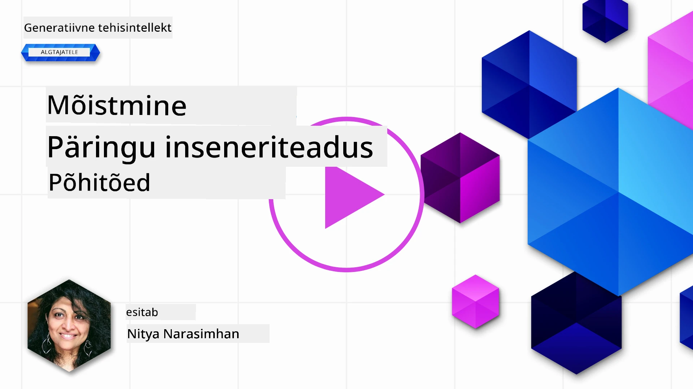
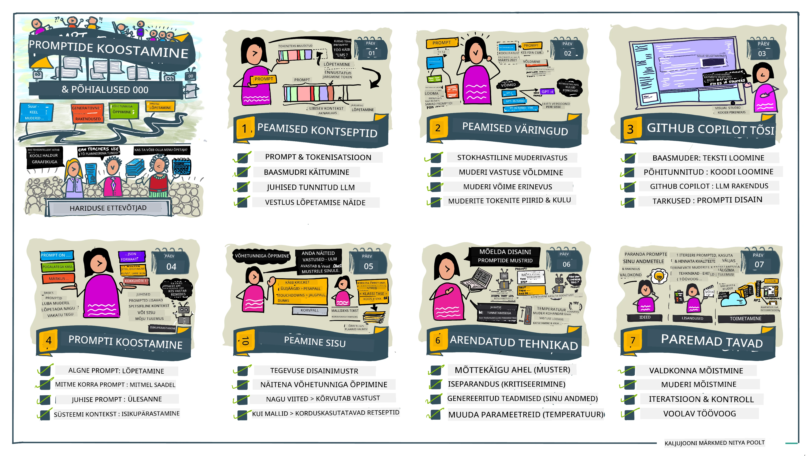
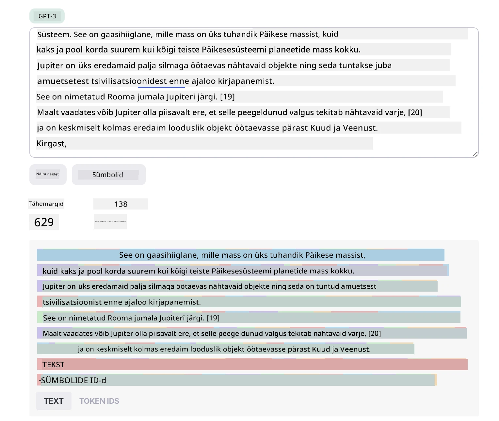
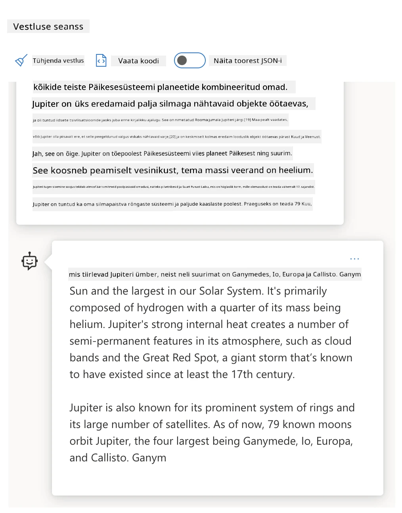
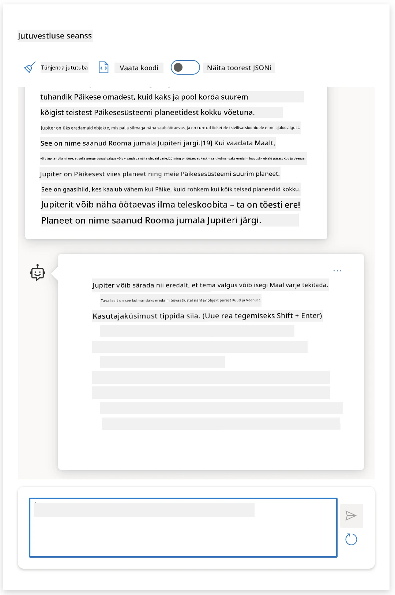
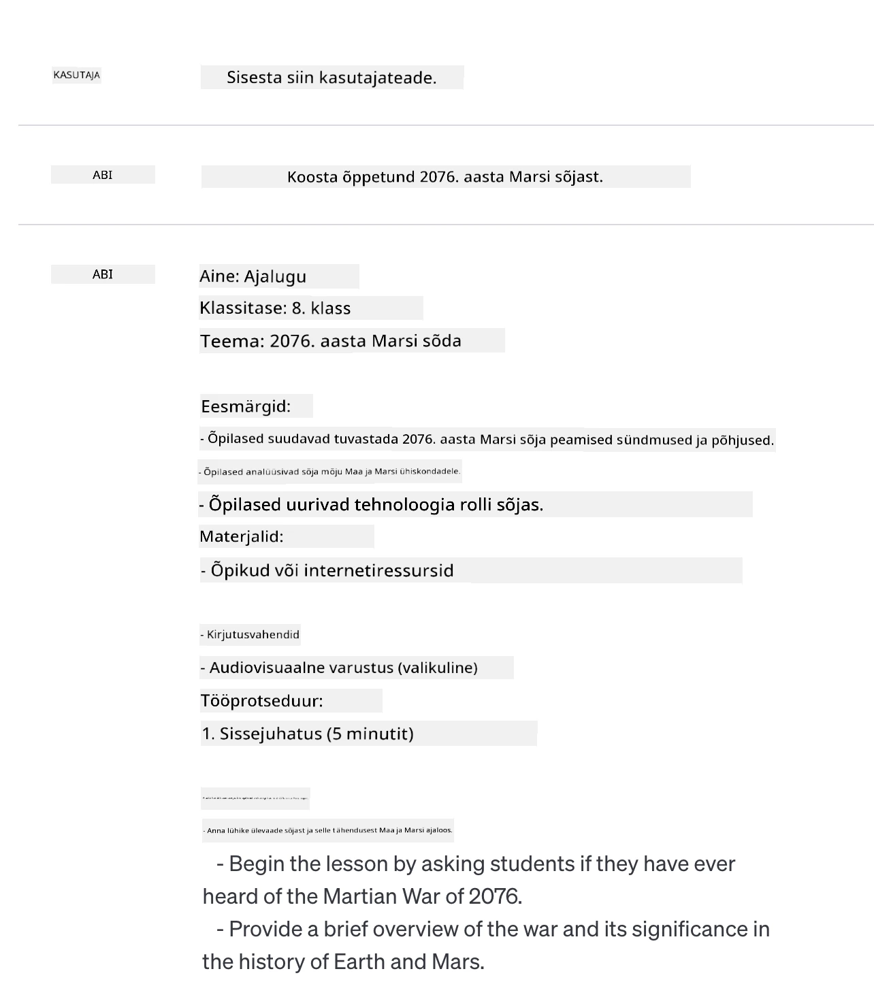
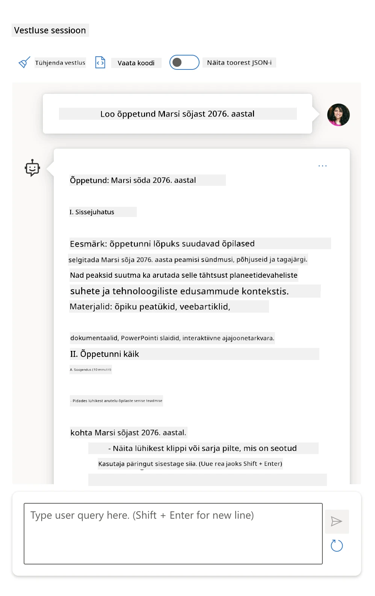
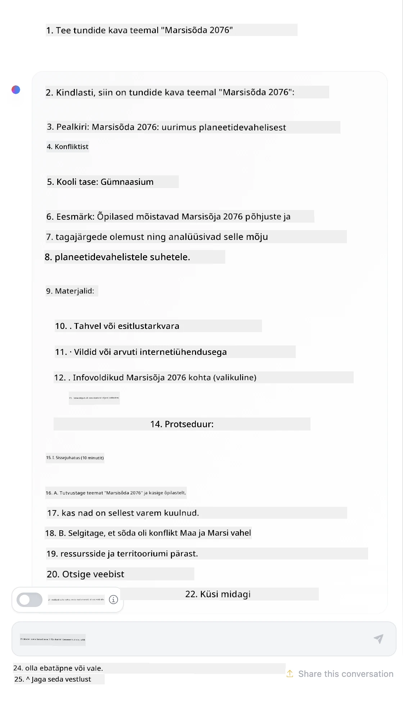

# Põhitõed promptide inseneriteaduses

[](https://youtu.be/GElCu2kUlRs?si=qrXsBvXnCW12epb8)

## Sissejuhatus
See moodul katab olulisi kontseptsioone ja tehnikaid tõhusate promptide loomiseks generatiivsetes tehisintellekti mudelites. Kuidas sa kirjutad oma prompti LLM-ile, on samuti oluline. Hoolikalt koostatud prompt võib saavutada parema kvaliteediga vastuse. Kuid mida täpselt tähendavad mõisted nagu _prompt_ ja _prompt engineering_? Ja kuidas ma saan parandada prompti _sisendit_, mida ma LLM-ile saadan? Need on küsimused, millele püüame vastuseid leida selles ja järgmises peatükis.

_Generatiivne tehisintellekt_ suudab luua uut sisu (nt tekst, pildid, heli, kood jms) vastusena kasutaja päringutele. Seda tehakse kasutades _suurte keelemudelite_ (Large Language Models) nagu OpenAI GPT (“Generative Pre-trained Transformer”) seeria mudeleid, mis on treenitud loodusliku keele ja koodi kasutamiseks.

Kasutajad saavad nüüd nendega suhelda tuttavate paradigmade kaudu, näiteks vestluses, ilma tehniliste teadmiste või koolituseta. Mudelid on _prompt-põhised_ – kasutajad saadavad teksti sisendi (prompti) ja saavad vastuse (täienduse). Neid saab seejärel korduvates mitmekäigulistes vestlustes refineerida, kuni vastus vastab ootustele.

„Promptid“ on nüüd generatiivsete tehisintellekti rakenduste peamised _programeerimisliidesed_, mis ütlevad mudelitele, mida teha ning mõjutavad tagastatavate vastuste kvaliteeti. „Promptide inseneriteadus“ on kiiresti kasvav uurimisvaldkond, mis keskendub promptide _kujundamisele ja optimeerimisele_, et tagada ühtlane ja kvaliteetne väljund suurtes mahtudes.

## Õpieesmärgid

Selles õppetükis õpime, mis on promptide inseneriteadus, miks see on oluline ja kuidas me saame luua antud mudeli ja rakenduse eesmärgi jaoks tõhusamaid promptisid. Mõistame põhikontseptsioone ja parimaid praktikaid promptide inseneriteaduses ning tutvume interaktiivse Jupyter Notebook'i „liivakasti“ keskkonnaga, kus neid kontseptsioone reaalselt rakendatakse.

Selle õppetüki lõpuks suudame:

1. Selgitada, mis on promptide inseneriteadus ja miks see on oluline.
2. Kirjeldada prompti komponente ja nende kasutust.
3. Õppida parimaid praktikaid ja tehnikaid promptide inseneriteaduseks.
4. Rakendada õpitud tehnikaid reaalsetele näidetele, kasutades OpenAI lõpp-punkti.

## Põhimõisted

Promptide inseneriteadus: Sisendite kujundamise ja täiendamise praktika, et juhatada tehisintellekti mudeleid soovitud väljundi loomisele.
Tokeniseerimine: Teksti muutmine väiksemateks üksusteks ehk tokeniteks, mida mudel suudab mõista ja töödelda.
Juhendussuunatud LLM-id: Suured keelemudelid, mis on täiendavalt kohandatud konkreetsete juhistega, et parandada vastuste täpsust ja asjakohasust.

## Õpiliivakast

Promptide inseneriteadus on praegu pigem kunst kui teadus. Parim viis selle tundlikkuse kasvatamiseks on _rohkem harjutada_ ja kasutada katse-eksituse lähenemist, mis ühendab rakendusvaldkonna ekspertiisi soovitatud tehnikate ja mudelispetsiifiliste optimeerimistega.

Selle õppetükiga kaasnev Jupyter Notebook pakub _liivakasti_ keskkonda, kus saad õpitut kohe proovida – nii jooksvalt kui ka lõpus koodiväljakutsena. Harjutuste täitmiseks vajad:

1. **Azure OpenAI API võtit** – teenuse lõpp-punkti juurdepääs suletud LLM-ile.
2. **Python'i jooksuaega** – milles Notebook saab täita.
3. **Kohalikke keskkonnamuutujaid** – _täida nüüd [SEADISTUSE](./../00-course-setup/02-setup-local.md?WT.mc_id=academic-105485-koreyst) sammud, et valmis saada_.

Notebook pakub _algus_ harjutusi – aga sind julgustatakse lisama enda _Markdown_ (kirjeldus) ja _Code_ (promptide soovid) sektsioone, et proovida rohkem näiteid või ideid – ja tugevdada oma tunnetust promptide kujundamisel.

## Illustreeritud juhend

Kas soovid saada ülevaadet sellest, mida see õppetükk hõlmab, enne sukeldumist? Vaata seda illustreeritud juhendit, mis annab pildi peamistest teemadest ja võtmejoontest, mille üle mõelda. Õppetüki teekaart viib sind põhikontseptsioonide ja väljakutsete mõistmisest nende lahendamiseni asjakohaste promptide inseneriteaduse tehnikate ja parimate praktikatega. Pane tähele, et selles juhendis toodud „Täiendavad tehnikad“ viitavad sisu järgmisel peatükil.



## Meie idufirma

Räägime nüüd sellest, kuidas _see teema_ seostub meie idufirma missiooniga [tuua haridusse tehisintellekti innovatsiooni](https://educationblog.microsoft.com/2023/06/collaborating-to-bring-ai-innovation-to-education?WT.mc_id=academic-105485-koreyst). Me soovime ehitada tehisintellektil põhinevaid _isikupärastatud õppimise_ rakendusi – mõtleme siis, kuidas meie rakenduse erinevad kasutajad võiksid „disainida“ promptisid:

- **Administraatorid** võivad paluda tehisintellektil _analüüsida õppekava andmeid, et tuvastada puudujääke_. AI saab tulemusi kokku võtta või kujutada koodi abil.
- **Õpetajad** võivad paluda AI-l _koostada õppetund sihtgrupile ja teemale_. AI saab ehitada isikupärastatud plaani ettenähtud vormingus.
- **Õpilased** võivad paluda AI-l _juhendada neid keerulises aines_. AI saab nüüd juhendada õpilasi nende tasemele kohandatud õppetundide, vihjete ja näidete kaudu.

See on alles jäämäe tipp. Vaata [Promptid hariduseks](https://github.com/microsoft/prompts-for-edu/tree/main?WT.mc_id=academic-105485-koreyst) – haridusekspertide kureeritud avatud lähtekoodiga promptide kogu – et saada laiem ülevaade võimalustest! _Proovi mõnda neist promptidest liivakastis või OpenAI Playground’is ja vaata, mis juhtub!_

<!--
LESSON TEMPLATE:
This unit should cover core concept #1.
Reinforce the concept with examples and references.

CONCEPT #1:
Prompt Engineering.
Define it and explain why it is needed.
-->

## Mis on promptide inseneriteadus?

Alustasime seda õppetükki, defineerides **promptide inseneriteaduse** kui teksti sisendite (promptide) _kujundamise ja optimeerimise_ protsessi, et tagada stabiilsed ja kvaliteetsed vastused (täitmised) antud rakenduse eesmärgi ja mudeli jaoks. Seda võib mõelda kahe etapi protsessina:

- _kujundada_ algne prompt antud mudeli ja eesmärgi jaoks
- _täpsustada_ prompti iteratiivselt, parandamaks vastuse kvaliteeti

See on paratamatult katse-eksituse protsess, mis nõuab kasutaja tajumist ja pingutust, et saada optimaalsed tulemused. Miks see siis tähtis on? Sellele küsimusele vastamiseks peame esmalt mõistma kolme mõistet:

- _tokeniseerimine_ = kuidas mudel „näeb“ prompti
- _põhimudelite LLM-id_ = kuidas baaskeelemudel prompti „töötleb“
- _juhendussuunatud LLM-id_ = kuidas mudel nüüd suudab „ülesandeid“ mõista

### Tokeniseerimine

LLM näeb prompti kui _tokenite jada_, kus erinevad mudelid (või mudeli versioonid) võivad sama prompti tokeniseerida erinevalt. Kuna LLM-id on treenitud tokenite peal (mitte toorteksti peal), mõjutab see, kuidas prompt tokeniseeritakse, otseselt loodud vastuse kvaliteeti.

Et saada tunnetus, kuidas tokeniseerimine toimib, proovi vahendeid nagu [OpenAI Tokenizer](https://platform.openai.com/tokenizer?WT.mc_id=academic-105485-koreyst) alljärgnevalt. Kopeeri oma prompt ja vaata, kuidas see tokeniteks teisendatakse, pöörates tähelepanu tühikute ja punktuatsiooni käsitlemisele. Pane tähele, et selles näites on kasutusel vanem LLM (GPT-3) – uue mudeliga võib tulemus olla erinev.



### Kontseptsioon: põhjamudelid

Kui prompt on tokeniseeritud, on ["baas-LLM"](https://blog.gopenai.com/an-introduction-to-base-and-instruction-tuned-large-language-models-8de102c785a6?WT.mc_id=academic-105485-koreyst) (või põhjamudel) peamine ülesanne prognoosida järgmist tokenit jadast. Kuna LLM-id on treenitud tohututel tekstikogudel, tunnevad nad hästi tokenite vahelist statistilist seost ja suudavad seda prognoosi teatud kindlusega teha. Tuleb siiski märkida, et nad ei mõista promptis või tokenis olevate sõnade _sisu_; nad näevad mustrit, mida saavad „täita“ järgmise prognoosiga. Nad võivad jätkata järjestuse täpsustamist, kuni kasutaja või mingi eelmääratletud tingimus selle lõpetab.

Kas soovid näha, kuidas promptipõhine täitmine töötab? Sisesta ülaltoodud prompt Azure OpenAI Studio [_Chat Playgroundi_](https://oai.azure.com/playground?WT.mc_id=academic-105485-koreyst) vaikehäälestusega. Süsteem on konfigureeritud käsitlema promte informatsiooni päringutena – nii peaksid nägema vastust, mis sellele kontekstile vastab.

Aga mis siis, kui kasutaja tahaks midagi konkreetset, mis vastaks mingile kriteeriumile või ülesande eesmärgile? Siin tulevad pildile _juhendussuunatud_ LLM-id.



### Kontseptsioon: juhendussuunatud LLM-id

[Juhendussuunatud LLM](https://blog.gopenai.com/an-introduction-to-base-and-instruction-tuned-large-language-models-8de102c785a6?WT.mc_id=academic-105485-koreyst) alustab põhjamudelist ja täiendavalt peenhäälestab seda näidete või sisendi/väljundi paaride (nt mitmekäiguliste „sõnumite“) põhjal, mis võivad sisaldada selgeid juhiseid – ning tehisintellekti vastus püüab neid juhiseid järgida.

Selleks kasutatakse meetodeid nagu inimtagasisidega tugevdusõpe (RLHF), mis koolitab mudelit _juhiseid järgima_ ja _tagasisidest õppima_, nii et see toodab vastuseid, mis on praktiliste rakenduste jaoks paremaks kohandatud ja vastavad kasutaja eesmärkidele.

Proovime järele – mine tagasi ülaltoodud prompti juurde, kuid muuda nüüdsest _süsteemisõnum_ nii, et see annaks järgmise juhise kontekstina:

> _Kokkuvõtte vient su teisele klassile mõeldud õppematerjalist. Hoia tulemus ühe lõigu ja 3–5 punktisõnaga._

Näed, kuidas vastus on nüüd suunatud soovitud eesmärgile ja vormingule? Õpetaja saab seda vastust nüüd otse kasutada oma klassi slaidides.



## Miks on promptide inseneriteadus vajalik?

Nüüd, kui teame, kuidas LLM-id promptidega töötlevad, räägime sellest, _miks_ on promptide inseneriteadus vajalik. Vastus peitub selles, et praegused LLM-id seavad mitmeid väljakutseid, mis muudavad _usaldusväärsete ja järjepidevate täitmiste_ saavutamise keerulisemaks ilma pingutusteta promptide koostamisel ja optimeerimisel. Näiteks:

1. **Mudelite vastused on stokastilised.** _Sama prompt_ võib anda erinevatel mudelitel või mudeli versioonidel erinevaid vastuseid. Ning sama mudeli puhul võivad vastused eri aegadel samuti erineda. _Promptide inseneriteaduse tehnikad aitavad meil neid variatsioone vähendada, pakkudes paremaid kaitsepiirdeid_.

1. **Mudelite vastused võivad olla leiutatud.** Mudelid on eelnevalt treenitud _suurte, kuid piiratud_ andmestikega, seega neil puudub teadmine mõistetest väljaspool treeninguala. Selle tulemusena võivad nad toota täitmisi, mis on ebatäpsed, väljamõeldud või otseselt vastuolus tuntud faktidega. _Promptide inseneriteadus aitab kasutajatel selliseid leiutisi tuvastada ja leevendada, nt küsides AI-lt allikaid või põhjendusi_.

1. **Mudelite võimekus võib varieeruda.** Uuemad mudelid või põlvkonnad omavad rikkalikumaid võimeid, kuid toovad kaasa ka unikaalseid iseärasusi ja kulude ning keerukuse kompromisse. _Promptide inseneriteadus aitab meil arendada parimaid praktikaid ja töövooge, mis peidavad erinevused ja kohanduvad mudelispetsiifiliste nõuetega skaleeritavalt ja sujuvalt_.

Vaatame seda ka OpenAI või Azure OpenAI Playgroundis:

- Kasuta sama prompti eri LLM-i juurutustega (nt OpenAI, Azure OpenAI, Hugging Face) – kas nägid erinevusi?
- Kasuta sama prompti korduvalt sama LLM-i juurutusega (nt Azure OpenAI Playground) – kuidas need variatsioonid erinesid?

### Leiutised ehk fabrications’i näide

Selles kursuses kasutame mõistet **„leiutised“** (fabrications) viitamaks nähtusele, kus LLM-id vahel toodavad faktuaalselt ebatäpset informatsiooni oma treeningu piirangute või muude piirangute tõttu. Seda on populaarsetes artiklites või teadustöödes mõnikord nimetatud ka _„hallutsinatsioonideks“_. Me soovitame siiski kasutada terminit _„leiutised“_, et mitte inimlikustada käitumist, omistades masiinipõhise tulemuse puhul inimomadusi. Samuti tugevdab see [Vastutustundliku AI juhiseid](https://www.microsoft.com/ai/responsible-ai?WT.mc_id=academic-105485-koreyst) terminoloogilisest aspektist, eemaldades mõisted, mida võib mõnes kontekstis pidada solvavateks või mittekaasaegseteks.

Kas soovid tunnetada, kuidas leiutised töötavad? Mõtle promptile, mis juhib AI-d genereerima sisu mitteeksisteerival teemal (et kindlustada, et seda pole treeningandmetes). Näiteks – proovin järgmist prompti:

> **Prompt:** genereeri tunniplaan Marsi sõja kohta aastal 2076.
Veebipäring näitas mulle, et olid väljamõeldud lood (nt telesarjad või raamatud) Marsi sõdadest – aga mitte aastast 2076. Terve mõistus ütleb ka, et 2076 on _tulevikus_ ja seega ei saa seda seostada päris sündmusega.

Mis siis juhtub, kui me seda päringut erinevate LLM-i pakkujatega käivitame?

> **Vastus 1**: OpenAI Playground (GPT-35)



> **Vastus 2**: Azure OpenAI Playground (GPT-35)



> **Vastus 3**: : Hugging Face Chat Playground (LLama-2)



Nagu oodata, toodab iga mudel (või mudeliversioon) veidi erinevaid vastuseid tänu juhuslikkusele ja mudelite võimekuste varieeruvusele. Näiteks üks mudel on suunatud 8. klassi tasemele, teine eeldab keskkooliõpilast. Kuid kõik kolm mudelit lõid vastused, mis võiksid veenda teadmata kasutajat, et see sündmus oli tõeline.

Päringu insenertehnika tehnikad nagu _meta-päringud_ ja _temperatuuri seadistamine_ võivad mõningal määral vähendada mudelipõhiseid väljamõeldisi. Uued päringu insenertehnika _arhitektuurid_ lisavad ka uusi tööriistu ja tehnikaid sujuvalt päringu voogu, et neid mõjusid leevendada või vähendada.

## Juhtumiuuring: GitHub Copilot

Lõpetame selle osa ühe juhtumiuuringuga, et saada aimu, kuidas päringu insenertehnikat kasutatakse pärismaailma lahendustes, vaadates [GitHub Copiloti](https://github.com/features/copilot?WT.mc_id=academic-105485-koreyst) näidet.

GitHub Copilot on teie "AI paarisprogrammeerija" – see teisendab tekstipäringud koodi täidisteks ja on integreeritud teie arenduskeskkonda (nt Visual Studio Code), et pakkuda sujuvat kasutuskogemust. Nagu alljärgnevates blogiseeriates dokumenteeritud, põhines varasem versioon OpenAI Codex mudelil – insenerid mõistsid kiiresti vajadust mudelit täpsustada ja paremaid päringuinsenertehnikaid välja töötada, et parandada koodi kvaliteeti. Juulis [tutvustati täiustatud tehisintellekti mudelit, mis läheb Codexist kaugemale](https://github.blog/2023-07-28-smarter-more-efficient-coding-github-copilot-goes-beyond-codex-with-improved-ai-model/?WT.mc_id=academic-105485-koreyst) veelgi kiiremaks soovitusteks.

Loe postitusi ajalises järjekorras, et jälgida nende õppimise teekonda.

- **Mai 2023** | [GitHub Copilot muutub paremaks teie koodi mõistmisel](https://github.blog/2023-05-17-how-github-copilot-is-getting-better-at-understanding-your-code/?WT.mc_id=academic-105485-koreyst)
- **Mai 2023** | [Sissevaade GitHubi – kuidas töötatakse GitHub Copiloti taga olevate LLM-idega](https://github.blog/2023-05-17-inside-github-working-with-the-llms-behind-github-copilot/?WT.mc_id=academic-105485-koreyst)
- **Juuni 2023** | [Kuidas kirjutada paremaid päringuid GitHub Copilotile](https://github.blog/2023-06-20-how-to-write-better-prompts-for-github-copilot/?WT.mc_id=academic-105485-koreyst)
- **Juuli 2023** | [GitHub Copilot läheb Codexist kaugemale täiustatud AI mudeliga](https://github.blog/2023-07-28-smarter-more-efficient-coding-github-copilot-goes-beyond-codex-with-improved-ai-model/?WT.mc_id=academic-105485-koreyst)
- **Juuli 2023** | [Arendaja juhend päringu insenertehnikate ja LLM-ide jaoks](https://github.blog/2023-07-17-prompt-engineering-guide-generative-ai-llms/?WT.mc_id=academic-105485-koreyst)
- **September 2023** | [Kuidas ehitada ettevõtte LLM-rakendust: GitHub Copiloti õppetunnid](https://github.blog/2023-09-06-how-to-build-an-enterprise-llm-application-lessons-from-github-copilot/?WT.mc_id=academic-105485-koreyst)

Saad sirvida ka nende [Inseneriblogi](https://github.blog/category/engineering/?WT.mc_id=academic-105485-koreyst) rohkemate postituste jaoks, nagu [see postitus](https://github.blog/2023-09-27-how-i-used-github-copilot-chat-to-build-a-reactjs-gallery-prototype/?WT.mc_id=academic-105485-koreyst), mis näitab, kuidas neid mudeleid ja tehnikaid kasutatakse _reaalsete_ rakenduste loomiseks.

---

<!--
LESSON TEMPLATE:
This unit should cover core concept #2.
Reinforce the concept with examples and references.

CONCEPT #2:
Prompt Design.
Illustrated with examples.
-->

## Päringu koostamine

Oleme näinud, miks päringu insenertehnika on oluline – nüüd mõistame, kuidas päringud on _koostatavad_, et saaksime hinnata erinevaid tehnikaid tõhusama päringukujunduse jaoks.

### Põhipäring

Alustame põhipäringust: tekstisisend, mis saadetakse mudelile ilma muude kontekstideta. Näiteks, kui me saadame mõned esimesed read USA hümnist OpenAI [Completion API-le](https://platform.openai.com/docs/api-reference/completions?WT.mc_id=academic-105485-koreyst), täidab see vastuse koheselt järgmiste ridadega, illustreerides põhilist ennustuskäitumist.

| Päring (sisend)       | Täitmine (väljund)                                                                                                                   |
| :-------------------- | :---------------------------------------------------------------------------------------------------------------------------------- |
| Oh say can you see    | Tundub, et alustate USA hümni "The Star-Spangled Banner" sõnadega. Täistekst on ...                                                  |

### Komplekspäring

Lisame nüüd põhikontekstile lisaks ka juhised. [Chat Completion API](https://learn.microsoft.com/azure/ai-services/openai/how-to/chatgpt?WT.mc_id=academic-105485-koreyst) võimaldab meil koostada keerulise päringu kui _sõnumite_ kogumi, mis sisaldab:

- Sisend-/väljundpaare, mis peegeldavad _kasutaja_ sisendit ja _abilise_ vastuseid.
- Süsteemiteadet, mis seab abilise käitumise või isiksuse konteksti.

Päring on nüüd allolevas vormis, kus _tokeniseerimine_ hõlmab tõhusalt kontekstist ja vestlusest olulist infot. Süsteemikonteksti muutmine võib olla nii kvalitatiivsetel täitmistel oluline kui kasutaja sisendid.

```python
response = openai.chat.completions.create(
    model="gpt-3.5-turbo",
    messages=[
        {"role": "system", "content": "You are a helpful assistant."},
        {"role": "user", "content": "Who won the world series in 2020?"},
        {"role": "assistant", "content": "The Los Angeles Dodgers won the World Series in 2020."},
        {"role": "user", "content": "Where was it played?"}
    ]
)
```

### Juhenduspäring

Ülaltoodud näidetes oli kasutaja päring lihtne tekstipäring, mida saab tõlgendada info päringuna. _Juhenduspäringutes_ saame seda teksti kasutada ülesande täpsemaks kirjeldamiseks ja AI-le parema juhise andmiseks. Näide:

| Päring (sisend)                                                                                     | Täitmine (väljund)                                                                               | Juhise tüüp      |
| :------------------------------------------------------------------------------------------------- | :------------------------------------------------------------------------------------------------- | :---------------- |
| Kirjuta kirjeldus Kodusõjast                                                                        | _tagastas lihtsa lõigu_                                                                          | Lihtne            |
| Kirjuta kirjeldus Kodusõjast. Too välja tähtsad kuupäevad ja sündmused ning kirjuta nende tähendusest                                     | _tagastas lõigu ja seejärel oluliste sündmuste kuupäevade nimekirja kirjeldustega_                 | Kompleksne        |
| Kirjuta Kodusõja kirjeldus 1 lõigus. Too 3 punktina tähtsad kuupäevad koos tähendustega. Too veel 3 punkti oluliste ajalooliste tegelaste ja nende panustega. Tagasta väljund JSON-failina | _tagastab ulatuslikumaid andmeid tekstikastis, vormindatuna JSON-ina, mida saab vajadusel failina kopeerida ja valideerida_  | Kompleksne. Vormindatud. |

## Peamine sisu

Ülaltoodud näidetes oli päring siiski üsna avatud, lubades LLM-il otsustada, milline osa oma treenitud andmestikust on oluline. _Peamine sisu_ disainimustris jagatakse sisendtekst kaheks osaks:

- juhis (tegevus)
- asjakohane sisu (mis mõjutab tegevust)

Näide, kus juhis on "kokkuvõtke see 2 lauses":

| Päring (sisend)                                                                                                                                                                                                                                                                                                                                                                    | Täitmine (väljund)                                                                                                                                                                                                                                                        |
| :--------------------------------------------------------------------------------------------------------------------------------------------------------------------------------------------------------------------------------------------------------------------------------------------------------------------------------------------------------------------------------- | :------------------------------------------------------------------------------------------------------------------------------------------------------------------------------------------------------------------------------------------------------------------------ |
| Jupiter on Päikesesüsteemi viies planeet ja suurim. See on gaasihiiglane, mille mass on üks tuhandik Päikesest, kuid kaks ja pool korda suurem kui kõigi teiste Päikesesüsteemi planeetide masside summa. Jupiter on üks eredamaid palja silmaga nähtavaid taevakehi ning seda on tuntud iidsetest tsivilisatsioonidest enne ajaloo kirjapanemist. Selle nimi tuleb Rooma jumalast Jupiter. <br/> **Kokkuvõtke see 2 lühikeses lauses** | Jupiter, Päikesest viies planeet, on Päikesesüsteemi suurim ja üks eredamaid taevakehi. Selle nimi on Rooma jumal Jupiter ning tegemist on gaasihiiglasega, mille mass on kaks ja pool korda suurem kui kõigi teiste planeetide ühismass Päikesesüsteemis. |

Peamise sisu segmenti saab kasutada mitmel viisil tõhusamate juhiste loomiseks:

- **Näited** – selle asemel, et öelda mudelile otseselt, mida teha, anna talle näited, mida teha ja lase mustri ise välja järeldada.
- **Vihjed** – pane juhise järel "vihje", mis suunab täitmist ja modelleerib mudelit asjakohasematele vastustele.
- **Mahlakad mallid** – korduvad "retseptid" päringute loomiseks, millel on kohatäitjad (muutujad), mida saab kohandada andmetega konkreetsete juhtumite jaoks.

Vaata, kuidas neid tegevuses kasutatakse.

### Näidete kasutamine

See on lähenemine, kus sa kasutad peamist sisu, et "toita mudelit" soovitud väljundi näidetega, lubades mudelil mustri tuvastada. Näidete arvu järgi saab esitada nulloplast, üks-plast või mõne-plast päringuid jne.

Päring koosneb nüüd kolmest komponendist:

- ülesande kirjeldus
- mõned soovitud väljundi näited
- uue näite algus (mis kujuneb implitsiitseks ülesandeks)

| Õppimise tüüp | Päring (sisend)                                                   | Täitmine (väljund)          |
| :------------ | :---------------------------------------------------------------- | :--------------------------- |
| Null-plast    | "The Sun is Shining". Tõlgi hispaania keelde                      | "El Sol está brillando".     |
| Üks-plast     | "The Sun is Shining" => ""El Sol está brillando". <br> "It's a Cold and Windy Day" => | "Es un día frío y ventoso".  |
| Mõne-plast    | The player ran the bases => Baseball <br/> The player hit an ace => Tennis <br/> The player hit a six => Cricket <br/> The player made a slam-dunk => | Korvpall                    |
|               |                                                                   |                             |

Pane tähele, kuidas null-plast päringus tuli lisada otsene juhis ("Tõlgi hispaania keelde"), kuid üks-plasti näites järeldati see kontekstist. Mõne-plasti näide näitab, kuidas suurem näidete arv võimaldab mudelil täpsemaid järeldusi teha ilma täiendavate juhisteta.

### Päringu vihjed

Teine peamise sisu kasutamise tehnika on pakkuda _vihjeid_ näidete asemel. Sel juhul anname mudelile suuna, alustades fragmendiga, mis peegeldab soovitud vastuse vormingut. Mudel "võtab vihje" ja jätkab selles stiilis.

| Vihjete arv | Päring (sisend)                                                                                                                                                                                                                                                                                                                                                                                                                              | Täitmine (väljund)                                                                                                                                                                                                                                                                               |
| :----------- | :------------------------------------------------------------------------------------------------------------------------------------------------------------------------------------------------------------------------------------------------------------------------------------------------------------------------------------------------------------------------------------------------------------------------------------------ | :---------------------------------------------------------------------------------------------------------------------------------------------------------------------------------------------------------------------------------------------------------------------------------------------- |
| 0            | Jupiter on Päikesest viies planeet ja suurim Päikesesüsteemis. See on gaasihiiglane, mille mass on üks tuhandik Päikesest, kuid kaks ja pool korda suurem kui kõigi teiste planeetide mass kokku. Jupiter on üks eredamaid öötaeva taevakehi, mida paljas silm näeb, ja seda on tuntud iidsetest tsivilisatsioonidest enne ajaloo algust. <br/>**Kokkuvõtke see**                                           | Jupiter on Päikesesüsteemi suurim planeet ja viies Päikesest. See on gaasihiiglane, mille mass on 1/1000 päikesemassist, kuid raskem kui kõik teised planeedid kokku. Iidsetest tsivilisatsioonidest on Jupiter pikalt tuntud ja see on öötaevas kergesti nähtav.                                       |
| 1              | Jupiter on Päikese viies planeet ja päikesesüsteemi suurim planeet. See on gaasihiiglane, mille mass on üks tuhandik Päikese massist, kuid kaks ja pool korda suurem kui kõigi teiste päikesesüsteemi planeetide mass kokku. Jupiter on üks eredamaid nood, mis palja silmaga öötaevas nähtavad on, ning see on olnud tuntud iidsetele tsivilisatsioonidele juba enne kirjapandud ajalugu. <br/>**Kokkuvõtteks** <br/> Mida me õppisime, on see, et Jupiter | on Päikese viies planeet ja päikesesüsteemi suurim planeet. See on gaasihiiglane, mille mass on üks tuhandik Päikese massist, kuid kaks ja pool korda suurem kui kõigi teiste planeetide mass kokku. See on hõlpsasti palja silmaga nähtav ja tuntud iidsetest aegadest saati.                        |
| 2              | Jupiter on Päikese viies planeet ja päikesesüsteemi suurim planeet. See on gaasihiiglane, mille mass on üks tuhandik Päikese massist, kuid kaks ja pool korda suurem kui kõigi teiste päikesesüsteemi planeetide mass kokku. Jupiter on üks eredamaid nood, mis palja silmaga öötaevas nähtavad on, ning see on olnud tuntud iidsetele tsivilisatsioonidele juba enne kirjapandud ajalugu. <br/>**Kokkuvõtteks** <br/> 3 peamist fakti, mida õppisime:         | 1. Jupiter on Päikese viies planeet ja päikesesüsteemi suurim planeet. <br/> 2. See on gaasihiiglane, mille mass on üks tuhandik Päikese massist...<br/> 3. Jupiter on olnud palja silmaga nähtav iidsetest aegadest saati ...                                                                       |
|                |                                                                                                                                                                                                                                                                                                                                                                                                                                                              |                                                                                                                                                                                                                                                                                                           |

### Prompti mallid

Prompti mall on _eelnevalt määratletud juhise retsept_, mida saab salvestada ja vajadusel uuesti kasutada, et tagada skaleeritult järjepidev kasutajakogemus. Lihtsas vormis on see lihtsalt valik näidispäringutest, nagu [see OpenAI näide](https://platform.openai.com/examples?WT.mc_id=academic-105485-koreyst), mis sisaldab nii interaktiivse päringu komponente (kasutaja ja süsteemi sõnumid) kui ka API-põhist päringu vormingut – tagamaks korduvkasutatavust.

Raskemas vormis, nagu [see LangChain näide](https://python.langchain.com/docs/concepts/prompt_templates/?WT.mc_id=academic-105485-koreyst), sisaldab see _kohatäiteid_, mida saab asendada eri andmeallikatest pärit infoga (kasutaja sisend, süsteemi kontekst, välised andmeallikad jms), et genereerida dünaamiliselt päringut. See võimaldab meil luua taaskasutatavate päringute raamatukogu, mida kasutatakse **programmiliselt** järjepideva kasutajakogemuse loomiseks ulatuslikult.

Lõpuks peitub tõeline väärtus mallides võimaluses luua ja avaldada _päringute raamatukogusid_ vertikaalsete rakenduste jaoks, kus päringu mall on nüüd _optimeeritud_ rakenduse konteksti või näidete põhjal, mis muudavad vastused sihitud kasutajatele asjakohasemaks ja täpsemaks. [Prompts For Edu](https://github.com/microsoft/prompts-for-edu?WT.mc_id=academic-105485-koreyst) hoidla on suurepärane näide sellest lähenemisest, koondades haridustehnoloogia jaoks päringute raamatukogu, rõhuga peamistele eesmärkidele nagu õppetundide planeerimine, õppekavade koostamine, õpilaste juhendamine jne.

## Tugimaterjal

Kui mõelda päringu koostamist kui juhise (ülesande) ja sihtmärgi (peamise sisu) olemasolule, siis _sekundaarne sisu_ on nagu täiendav kontekst, mida me anname, et **suunata väljundit mingil moel**. See võib olla häälestusparameetrid, vormindusjuhised, teema taksonoomiad jms, mis aitavad mudelil _kohandada_ vastust vastavalt soovitud kasutaja eesmärkidele või ootustele.

Näiteks: Kui meil on kursuse kataloog koos põhjaliku metaandmestikuga (nimi, kirjeldus, tase, metaandmete sildid, juhendaja jne) kõigi õppekava kursuste kohta:

- saame määratleda juhise "kokkuvõta sügissemestri 2023 kursuste kataloog"
- saame kasutada põhisisu, et anda mõned soovitud väljundi näited
- saame kasutada sekundaarset sisu, et tuvastada 5 enim huvipakkuvat "sildi" tüüpi.

Nüüd võib mudel anda kokkuvõtte vormingus, mis on ette antud näidete järgi – aga kui tulemusel on mitu silti, suudab see anda prioriteeti sekundaarse sisu poolt määratud viiele sildile.

---

<!--
ÕPETUSE MALL:
See osa peaks katma põhikontseptsiooni #1.
Tugevdage kontseptsiooni näidete ja viidetega.

KONTSEPTSIOON #3:
Päringuinsenertehnika.
Millised on mõned põhilised tehnikad päringuinsenerias?
Illustreerige seda harjutustega.
-->

## Päringuparimad tavad

Nüüd, kui teame, kuidas päringuid _koostada_, saame hakata mõtlema nende disainile, et peegeldada parimaid tavasid. Seda võib mõelda kahes osas – õige _mõtteviisi_ olemasolu ja sobivate _tehnikate_ rakendamine.

### Päringuinseneri mõtteviis

Päringuinseneria on katse-eksituse protsess, seega pea meeles kolme üldist juhist:

1. **Domeeni mõistmine on tähtis.** Vastuse täpsus ja asjakohasus sõltuvad _domeenist_, milles rakendus või kasutaja tegutseb. Kasuta oma intuitsiooni ja kogemust domeenis, et **kohandada tehnikaid** veelgi. Näiteks, määra domeenispetsiifilised isiksused süsteemi päringutes või kasuta domeenipõhiseid malle kasutajapäringutes. Paku sekundaarset sisu, mis peegeldab domeeni konteksti, või kasuta domeenikohaseid viiteid ja näiteid, et juhatada mudelit tuttavatele kasutusmustritele.

2. **Mudeli mõistmine on tähtis.** Teame, et mudelid on loomult juhuslikud. Kuid mudeli rakendused võivad erineda kasutatud treeningandmiku, võimaluste (nt API või SDK kaudu) ja optimeeritud sisu tüübi (nt kood, pildid, tekst) poolest. Mõista kasutatava mudeli tugevusi ja piiranguid ning kasuta seda teadmisi _ülesannete prioriseerimiseks_ või _kohandatud mallide loomisel_, mis on optimeeritud konkreetse mudeli võimekusele.

3. **Iteratsioon ja valideerimine on tähtsad.** Mudelid arenevad kiiresti, samamoodi ka päringuinseneria tehnikad. Domeenieksperdina võib sul olla spetsiifiline kontekst või kriteeriumid, mis sinu rakendusele kehtivad, kuid mitte laiema kogukonna jaoks. Kasuta päringuinseneria tööriistu ja tehnikaid, et „alustada päringute loomist“, seejärel iteratiivselt vaata üle ja valideeri tulemusi oma intuitsiooni ja domeenikogemuse alusel. Salvesta oma tähelepanekud ja loo **teadmiste baas** (nt päringute raamatukogud), mida teised saavad kasutada kui uut lähtepunkti kiiremateks korduvateks katsetusteks.

## Parimad praktikad

Vaatame nüüd üldisi parimaid tavasid, mida soovitavad [OpenAI](https://help.openai.com/en/articles/6654000-best-practices-for-prompt-engineering-with-openai-api?WT.mc_id=academic-105485-koreyst) ja [Azure OpenAI](https://learn.microsoft.com/azure/ai-services/openai/concepts/prompt-engineering#best-practices?WT.mc_id=academic-105485-koreyst) praktikud.

| Mida                               | Miks                                                                                                                                                                                                                                              |
| :-------------------------------- | :------------------------------------------------------------------------------------------------------------------------------------------------------------------------------------------------------------------------------------------------- |
| Hinda uusimaid mudeleid.           | Uued mudelisukupõlved sisaldavad tõenäoliselt paremaid omadusi ja kvaliteeti, kuid võivad olla ka kallimad. Hinda mõju ja tee selle põhjal migreerimisotsused.                                                                                      |
| Eristada juhiseid ja konteksti     | Kontrolli, kas sinu mudel või teenusepakkuja määratleb _eraldajad_, mis selgelt eristavad juhiseid, põhisisu ja sekundaarset sisu. See aitab mudelil tokenitele kaalu õigesti määrata.                                                           |
| Ole konkreetne ja selge             | Anna rohkem detaile soovitud konteksti, tulemuse, pikkuse, vormingu, stiili jms kohta. See parandab nii vastuste kvaliteeti kui järjepidevust. Dokumenteeri retseptid taaskasutatavatena mallides.                                                   |
| Ole kirjeldav, kasuta näiteid       | Mudelid reageerivad sageli paremini „näita ja räägi“ lähenemisele. Alusta `zero-shot` meetodiga, kus annad juhise (ilma näideteta), seejärel proovi `few-shot` tõhustust, pakkudes mõned soovitud väljundi näited. Kasuta analoogiaid.        |
| Kasuta vihjeid, et lähtestada      | Juhenda mudelit soovitud tulemusele, andes mõned algussõnad või fraasid, mida vastuse alustuseks kasutada.                                                                                        |
| Korda ja rõhuta                     | Mõnikord tuleb mudelile asjad mitmel korral ära öelda. Paku juhiseid enne ja pärast põhisisu, kasuta juhist ja vihjet jne. Itereeri ja valideeri, et näha, mis töötab.                                      |
| Järjestus on oluline                | Informatsiooni esitamise järjekord mudelile võib mõjutada väljundit, ka õpinenäidetes, tänu värskuse kallutusele. Proovi eri variante, et leida sobivaim.                                             |
| Anna mudelile „väljumisvõimalus“    | Paku mudelile _varuvastust_, mida see kasutab, kui ta mingil põhjusel ülesannet lõpuni täita ei suuda. See vähendab vale- või väljamõeldud vastuste tõenäosust.                                        |
|                                   |                                                                                                                                                                                                                                                   |

Nagu iga parima tava puhul, pea meeles, et _resultaat võib mudelist, ülesandest ja domeenist sõltuvalt erineda_. Kasuta neid lähtepunktina ja itereeri, et leida endale toimivaim. Hinda pidevalt oma päringuinseneria protsessi, kui ilmuvad uued mudelid ja tööriistad, pöörates tähelepanu protsessi mastaapsusele ja vastuste kvaliteedile.

<!--
ÕPETUSE MALL:
See osa peaks pakkuma koodiväljakutset, kui see on asjakohane.

VÄLJAKUTSE:
Lingita Jupyter Notebook, kus juhendis on ainult koodikommentaarid (koodilõigud on tühjad).

LAHENDUS:
Lingita koopia sellest Notebookist, kus päringud on täidetud ja käivitatud, näidates ühte näitevõimalust.
-->

## Ülesanne

Palju õnne! Sa jõudsid õppetunni lõpuni! Nüüd on aeg proovile panna osa neid kontseptsioone ja tehnikaid päris näidete abil!

Meie ülesande jaoks kasutame Jupyter Notebook’i, kus saad harjutusi interaktiivselt lahendada. Võid ka iseokumentaari juurde lisada oma Markdown’i ja koodi lahtrid, et iseseisvalt ideid ja tehnikaid uurida.

### Alustamiseks tee fork hoidlast, seejärel

- (Soovitatav) Käivita GitHub Codespaces
- (Või) klooni hoidla oma kohalikku masinasse ja kasuta seda Docker Desktopiga
- (Või) ava Notebook oma lemmikrakenduses, mis toetab Notebooki käitust.

### Järgmine samm: seadista keskkonnamuutujad

- Kopeeri hoidla juurest fail `.env.copy` faili nimega `.env` ja täida `AZURE_OPENAI_API_KEY`, `AZURE_OPENAI_ENDPOINT` ja `AZURE_OPENAI_DEPLOYMENT` väärtused. Tule tagasi [Õppemullialale](../../../04-prompt-engineering-fundamentals) ja õpi, kuidas neid kasutada.

### Seejärel ava Jupyter Notebook

- Vali jooksutamiskern. Kui kasutad valikut 1 või 2, vali lihtsalt vaikevalikuks olev Python 3.10.x kern.

Oled valmis harjutusi jooksutama. Pane tähele, et siin ei ole _õigeid ega valesid_ vastuseid – tegemist on katse-eksituse meetodiga ja mudeli käitumise tunnetamisega konkreetse mudeli ja rakenduse domeeni jaoks.

_Sellepärast pole siin lõigus ka koodi-lahenduse osi. Vastupidi, Notebookis on Markdown lahtrid pealkirjaga "Minu lahendus:", kus on näidatud üks näide väljundist võrdluseks._

 <!--
ÕPETUSE MALL:
Pane selle osa lõppu kokkuvõte ja soovitused iseseisvaks õppimiseks.
-->

## Teadmiste kontroll

Milline järgmistest on hea päring, mis järgib mõistlikke parimaid tavasid?

1. Näita mulle punast autot pildina
2. Näita mulle punast autot, mille mark on Volvo ja mudel XC90, seismas kalju ääres päikeseloojangul
3. Näita mulle punast autot, mille mark on Volvo ja mudel XC90

Vastus: 2 on parim päring, kuna see annab üksikasju "mida" ja lähtub spetsiifikast (mitte lihtsalt ükskõik milline auto, vaid kindel mark ja mudel) ning kirjeldab ka üldist situatsiooni. 3 on teine parim, kuna sisaldab samuti hulgaliselt kirjeldusi.

## 🚀 Väljakutse

Katseta „vihje“ tehnikaga järgmise päringuga: Täienda lauset "Näita mulle punast autot, mille mark on Volvo ja ". Millele mudel vastab ja kuidas saaksid seda parandada?

## Tubli töö! Jätka õppimist

Soovid rohkem teada erinevate päringuinseneria kontseptsioonide kohta? Mine [edasijõudnute lehele](https://aka.ms/genai-collection?WT.mc_id=academic-105485-koreyst), kust leiad teisi suurepäraseid ressursse sellel teemal.

Mine õppetundi 5, kus vaatleme [edasijõudnud päringu tehnikaid](../05-advanced-prompts/README.md?WT.mc_id=academic-105485-koreyst)!

---

<!-- CO-OP TRANSLATOR DISCLAIMER START -->
**Vastutusest loobumine**:  
See dokument on tõlgitud tehisintellekti tõlketeenuse [Co-op Translator](https://github.com/Azure/co-op-translator) abil. Kuigi püüdleme täpsuse poole, palun arvestage, et automatiseeritud tõlked võivad sisaldada vigu või ebatäpsusi. Originaaldokument oma algkeeles tuleks pidada autoriteetseks allikaks. Olulise info puhul soovitatakse kasutada professionaalset inimtõlget. Me ei vastuta selle tõlke kasutamisest tulenevate arusaamatuste ega väär-tõlgenduste eest.
<!-- CO-OP TRANSLATOR DISCLAIMER END -->