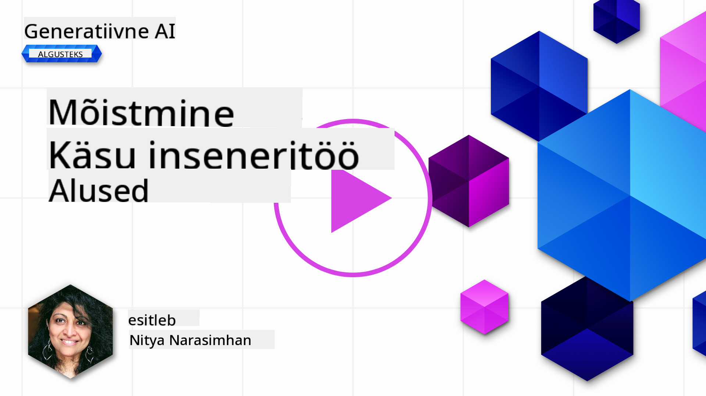
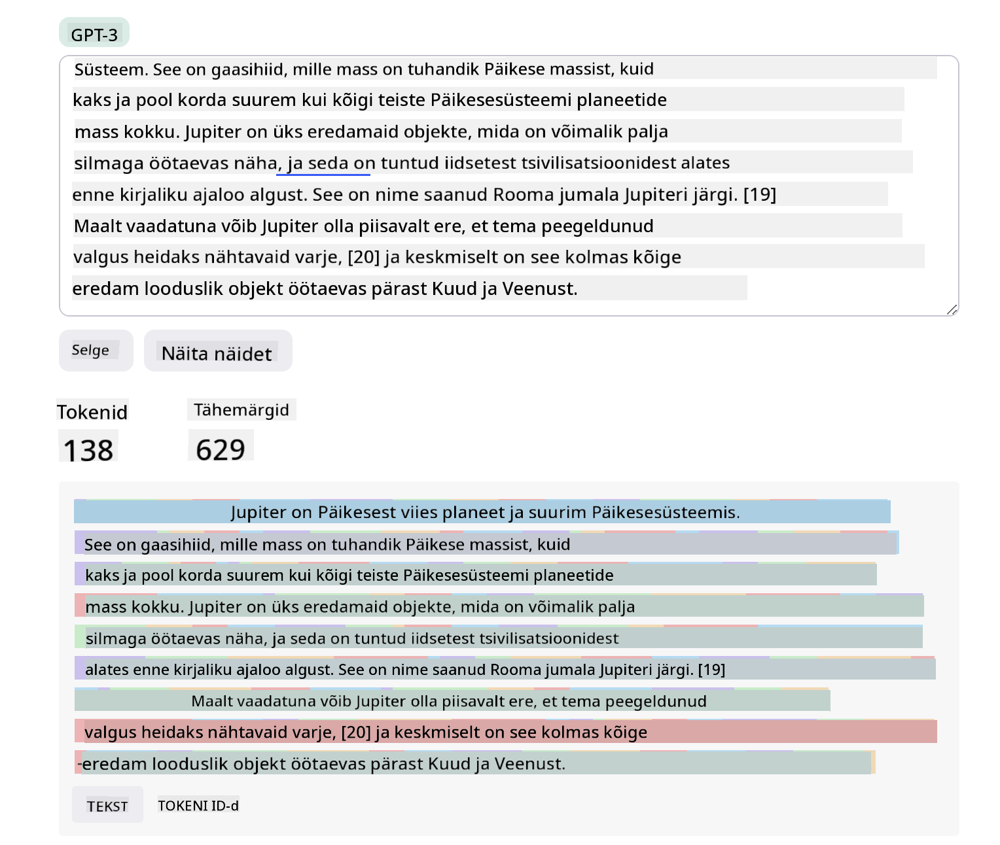
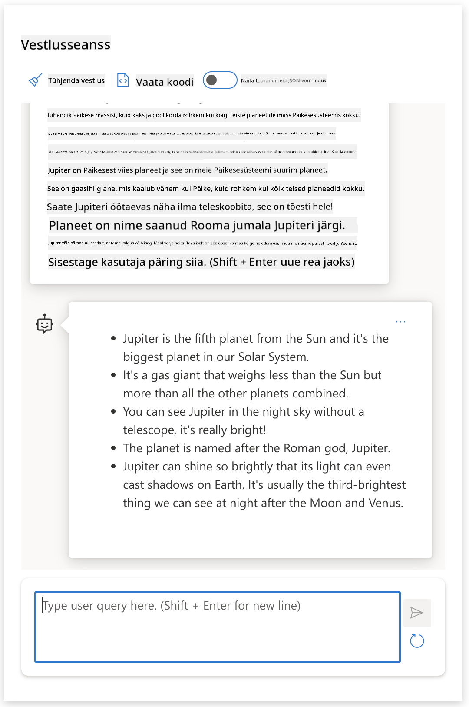
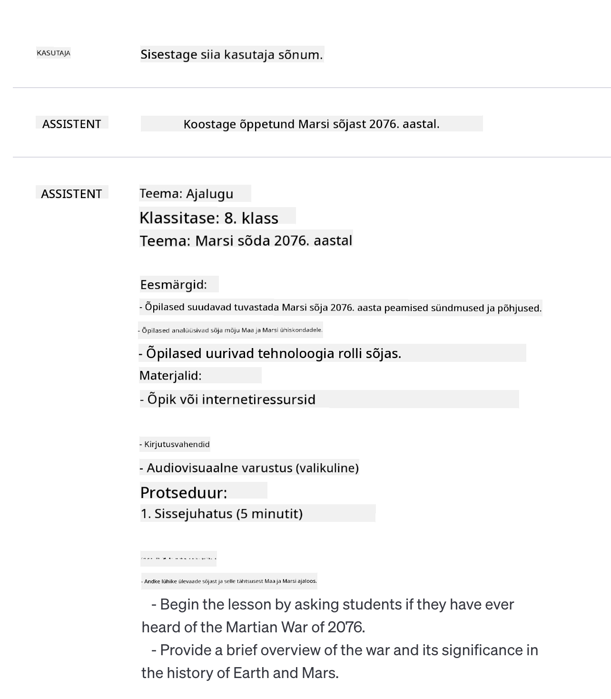
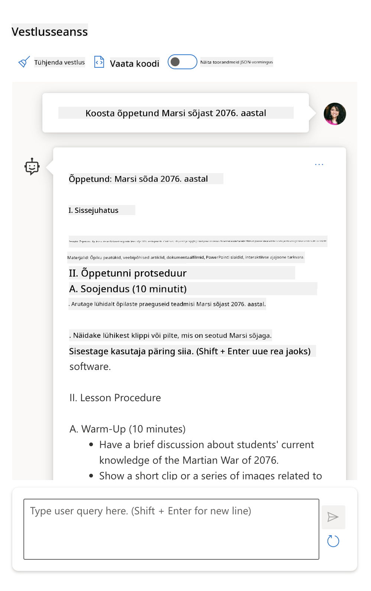
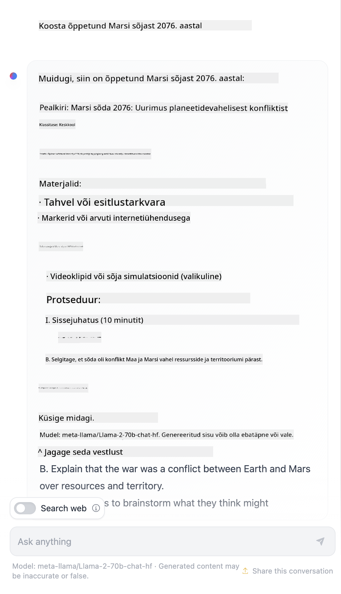

<!--
CO_OP_TRANSLATOR_METADATA:
{
  "original_hash": "0135e6c271f3ece8699050d4debbce88",
  "translation_date": "2025-10-18T02:56:29+00:00",
  "source_file": "04-prompt-engineering-fundamentals/README.md",
  "language_code": "et"
}
-->
# Põhitõed promptide kujundamisest

[](https://youtu.be/GElCu2kUlRs?si=qrXsBvXnCW12epb8)

## Sissejuhatus
See moodul käsitleb olulisi kontseptsioone ja tehnikaid tõhusate promptide loomiseks generatiivsete AI mudelite jaoks. Kuidas te oma prompti LLM-ile kirjutate, on samuti oluline. Hoolikalt koostatud prompt võib anda parema vastuse kvaliteedi. Kuid mida täpselt tähendavad sellised terminid nagu _prompt_ ja _promptide kujundamine_? Ja kuidas ma saan parandada prompti _sisendit_, mida ma LLM-ile saadan? Need on küsimused, millele püüame vastata selles ja järgmises peatükis.

_Generatiivne AI_ on võimeline looma uut sisu (nt teksti, pilte, heli, koodi jne) vastuseks kasutaja päringutele. See saavutatakse _suure keelemudeli_ abil, nagu OpenAI GPT ("Generative Pre-trained Transformer") seeria, mis on treenitud kasutama loomulikku keelt ja koodi.

Kasutajad saavad nüüd nende mudelitega suhelda tuttavate paradigmade kaudu, näiteks vestluse kaudu, ilma et neil oleks vaja tehnilist ekspertiisi või koolitust. Mudelid on _promptipõhised_ - kasutajad saadavad tekstisisendi (prompt) ja saavad tagasi AI vastuse (täitmise). Nad saavad seejärel "vestelda AI-ga" iteratiivselt, mitme pöördega vestlustes, täpsustades oma prompti, kuni vastus vastab nende ootustele.

"Promptid" muutuvad nüüd generatiivsete AI rakenduste peamiseks _programmeerimisliideseks_, mis ütleb mudelitele, mida teha, ja mõjutab tagastatud vastuste kvaliteeti. "Promptide kujundamine" on kiiresti kasvav uurimisvaldkond, mis keskendub promptide _kujundamisele ja optimeerimisele_, et tagada järjepidevad ja kvaliteetsed vastused suurel skaalal.

## Õpieesmärgid

Selles õppetükis õpime, mis on promptide kujundamine, miks see on oluline ja kuidas me saame luua tõhusamaid prompti konkreetse mudeli ja rakenduse eesmärgi jaoks. Me mõistame promptide kujundamise põhikontseptsioone ja parimaid praktikaid - ning õpime tundma interaktiivset Jupyter Notebooks "liivakasti" keskkonda, kus saame neid kontseptsioone rakendada reaalsetes näidetes.

Selle õppetüki lõpuks suudame:

1. Selgitada, mis on promptide kujundamine ja miks see on oluline.
2. Kirjeldada prompti komponente ja nende kasutamist.
3. Õppida parimaid praktikaid ja tehnikaid promptide kujundamiseks.
4. Rakendada õpitud tehnikaid reaalsetes näidetes, kasutades OpenAI lõpp-punkti.

## Olulised terminid

Promptide kujundamine: Praktika, mis seisneb sisendite kujundamises ja täpsustamises, et suunata AI mudeleid soovitud väljundite loomisele.
Tokeniseerimine: Teksti teisendamise protsess väiksemateks üksusteks, mida nimetatakse tokeniteks, mida mudel suudab mõista ja töödelda.
Instruktsioonidega häälestatud LLM-id: Suured keelemudelid (LLM-id), mida on täpsustatud konkreetsete juhistega, et parandada nende vastuste täpsust ja asjakohasust.

## Õppimise liivakast

Promptide kujundamine on praegu pigem kunst kui teadus. Parim viis selle intuitsiooni arendamiseks on _rohkem harjutada_ ja rakendada katse-eksituse meetodit, mis ühendab rakenduse valdkonna ekspertiisi soovitatud tehnikate ja mudelispetsiifiliste optimeerimistega.

Selle õppetüki juurde kuuluv Jupyter Notebook pakub _liivakasti_ keskkonda, kus saate õpitut katsetada - kas kohe või koodiväljakutse osana. Harjutuste täitmiseks vajate:

1. **Azure OpenAI API võtit** - teenuse lõpp-punkti juurutatud LLM-i jaoks.
2. **Python Runtime'i** - milles Notebooki saab käivitada.
3. **Kohalikke keskkonnamuutujaid** - _täitke [SEADISTUS](./../00-course-setup/02-setup-local.md?WT.mc_id=academic-105485-koreyst) sammud kohe, et olla valmis_.

Notebook sisaldab _algajate_ harjutusi - kuid teid julgustatakse lisama oma _Markdown_ (kirjeldus) ja _koodi_ (prompti päringud) sektsioone, et proovida rohkem näiteid või ideid - ja arendada oma intuitsiooni promptide kujundamise osas.

## Illustreeritud juhend

Kas soovite enne süvenemist saada ülevaate sellest, mida see õppetund hõlmab? Vaadake seda illustreeritud juhendit, mis annab ülevaate peamistest käsitletavatest teemadest ja olulisematest järeldustest, millele mõelda. Õppetüki teekond viib teid põhikontseptsioonide ja väljakutsete mõistmisest nende lahendamiseni asjakohaste promptide kujundamise tehnikate ja parimate praktikate abil. Pange tähele, et selle juhendi "Edasijõudnute tehnikad" osa viitab järgmises peatükis käsitletavale sisule.


## Meie idufirma

Räägime nüüd, kuidas _see teema_ on seotud meie idufirma missiooniga [tuua AI innovatsioon haridusse](https://educationblog.microsoft.com/2023/06/collaborating-to-bring-ai-innovation-to-education?WT.mc_id=academic-105485-koreyst). Me tahame luua AI-põhiseid rakendusi _personaalseteks õpinguteks_ - seega mõelgem, kuidas meie rakenduse erinevad kasutajad võiksid "kujundada" prompti:

- **Administraatorid** võivad paluda AI-l _analüüsida õppekava andmeid, et tuvastada katvuse puudujääke_. AI saab tulemusi kokku võtta või neid koodiga visualiseerida.
- **Õpetajad** võivad paluda AI-l _luua õppetundide plaan sihtrühma ja teema jaoks_. AI saab koostada isikupärastatud plaani määratud formaadis.
- **Õpilased** võivad paluda AI-l _õpetada neid raskes aines_. AI saab nüüd juhendada õpilasi tundide, vihjete ja näidetega, mis on kohandatud nende tasemele.

See on vaid jäämäe tipp. Vaadake [Prompts For Education](https://github.com/microsoft/prompts-for-edu/tree/main?WT.mc_id=academic-105485-koreyst) - avatud lähtekoodiga promptide raamatukogu, mille on koostanud hariduseksperdid - et saada laiemat ülevaadet võimalustest! _Proovige mõnda neist promptidest liivakastis või kasutades OpenAI Playgroundi, et näha, mis juhtub!_

<!--
ÕPPETÜKI MALL:
See üksus peaks käsitlema põhikontseptsiooni #1.
Tugevdage kontseptsiooni näidete ja viidetega.

KONTSEPTSIOON #1:
Promptide kujundamine.
Määratlege see ja selgitage, miks seda vaja on.
-->

## Mis on promptide kujundamine?

Alustasime seda õppetundi, määratledes **promptide kujundamise** kui tekstisisendite (promptide) _kujundamise ja optimeerimise_ protsessi, et tagada järjepidevad ja kvaliteetsed vastused (täitmised) konkreetse rakenduse eesmärgi ja mudeli jaoks. Me võime seda mõelda kui kaheastmelist protsessi:

- _kujundamine_ algse prompti loomiseks konkreetse mudeli ja eesmärgi jaoks
- _täpsustamine_ prompti iteratiivselt, et parandada vastuse kvaliteeti

See on paratamatult katse-eksituse protsess, mis nõuab kasutaja intuitsiooni ja pingutust, et saavutada optimaalsed tulemused. Miks see siis oluline on? Sellele küsimusele vastamiseks peame esmalt mõistma kolme kontseptsiooni:

- _Tokeniseerimine_ = kuidas mudel "näeb" prompti
- _Põhimudelid_ = kuidas baasmudel "töötleb" prompti
- _Instruktsioonidega häälestatud LLM-id_ = kuidas mudel suudab nüüd "ülesandeid" näha

### Tokeniseerimine

LLM näeb prompti kui _tokenite järjestust_, kus erinevad mudelid (või mudeli versioonid) võivad sama prompti tokeniseerida erinevalt. Kuna LLM-id on treenitud tokenite (mitte toorteksti) põhjal, mõjutab see, kuidas promptid tokeniseeritakse, otseselt genereeritud vastuse kvaliteeti.

Et saada intuitsiooni, kuidas tokeniseerimine toimib, proovige selliseid tööriistu nagu [OpenAI Tokenizer](https://platform.openai.com/tokenizer?WT.mc_id=academic-105485-koreyst), mis on allpool näidatud. Kopeerige oma prompt - ja vaadake, kuidas see tokeniteks muudetakse, pöörates tähelepanu sellele, kuidas käsitletakse tühikuid ja kirjavahemärke. Pange tähele, et see näide näitab vanemat LLM-i (GPT-3) - seega võib uuema mudeliga proovimine anda teistsuguse tulemuse.



### Kontseptsioon: Põhimudelid

Kui prompt on tokeniseeritud, on ["Baasmudeli"](https://blog.gopenai.com/an-introduction-to-base-and-instruction-tuned-large-language-models-8de102c785a6?WT.mc_id=academic-105485-koreyst) (või põhimudeli) peamine funktsioon ennustada tokenit selles järjestuses. Kuna LLM-id on treenitud massiivsete tekstikogumite põhjal, on neil hea arusaam tokenite statistilistest seostest ja nad suudavad seda ennustust teha teatud kindlusega. Pange tähele, et nad ei mõista _sõnade tähendust_ promptis või tokenis; nad näevad lihtsalt mustrit, mida nad saavad "täita" järgmise ennustusega. Nad võivad jätkata järjestuse ennustamist, kuni kasutaja sekkub või on kehtestatud mõni eelnevalt määratud tingimus.

Kas soovite näha, kuidas promptipõhine täitmine toimib? Sisestage ülaltoodud prompt Azure OpenAI Studio [_Chat Playgroundi_](https://oai.azure.com/playground?WT.mc_id=academic-105485-koreyst) vaikeseadetega. Süsteem on konfigureeritud käsitlema prompti kui teabe päringut - seega peaksite nägema täitmist, mis rahuldab selle konteksti.

Aga mis siis, kui kasutaja soovib näha midagi konkreetset, mis vastab teatud kriteeriumidele või ülesande eesmärgile? Siin tulevad mängu _instruktsioonidega häälestatud_ LLM-id.


### Kontseptsioon: Instruktsioonidega häälestatud LLM-id

[Instruktsioonidega häälestatud LLM](https://blog.gopenai.com/an-introduction-to-base-and-instruction-tuned-large-language-models-8de102c785a6?WT.mc_id=academic-105485-koreyst) algab põhimudelist ja täpsustatakse seda näidete või sisend/väljund paaridega (nt mitme pöördega "sõnumid"), mis võivad sisaldada selgeid juhiseid - ja AI vastus püüab järgida seda juhist.

See kasutab tehnikaid nagu tugevdatud õppimine inimeste tagasisidega (RLHF), mis suudab mudelit treenida _juhiseid järgima_ ja _tagasisidest õppima_, et see toodaks vastuseid, mis sobivad paremini praktiliste rakenduste jaoks ja on kasutaja eesmärkidega asjakohasemad.

Proovime seda - vaadake uuesti ülaltoodud prompti, kuid muutke nüüd _süsteemi sõnumit_, et anda järgmine juhis kontekstiks:

> _Kokkuvõtke teile antud sisu teise klassi õpilase jaoks. Hoidke tulemus ühe lõiguna, milles on 3-5 punkti._

Vaadake, kuidas tulemus on nüüd häälestatud, et kajastada soovitud eesmärki ja vormingut? Õpetaja saab nüüd seda vastust otse kasutada oma klassi slaidides.



## Miks on promptide kujundamist vaja?

Nüüd, kui me teame, kuidas LLM-id prompti töötlevad, räägime sellest, _miks_ on promptide kujundamist vaja. Vastus peitub selles, et praegused LLM-id esitavad mitmeid väljakutseid, mis muudavad _usaldusväärsete ja järjepidevate täitmiste_ saavutamise keerulisemaks, kui ei panustata prompti koostamisse ja optimeerimisse. Näiteks:

1. **Mudelivastused on juhuslikud.** _Sama prompt_ annab tõenäoliselt erinevaid vastuseid erinevate mudelite või mudeliversioonidega. Ja see võib anda erinevaid tulemusi isegi _sama mudeliga_ erinevatel aegadel. _Promptide kujundamise tehnikad aitavad meil neid variatsioone minimeerida, pakkudes paremaid juhiseid_.

1. **Mudelid võivad vastuseid välja mõelda.** Mudelid on eelnevalt treenitud _suure, kuid piiratud_ andmekogumiga, mis tähendab, et neil puudub teadmine kontseptsioonidest väljaspool seda treeningu ulatust. Selle tulemusena võivad nad anda täitmisi, mis on ebatäpsed, väljamõeldud või otseselt vastuolus teadaolevate faktidega. _Promptide kujundamise tehnikad aitavad kasutajatel tuvastada ja leevendada selliseid väljamõeldisi, näiteks paludes AI-l viiteid või põhjendusi_.

1. **Mudelite võimekus varieerub.** Uuematel mudelitel või mudelite generatsioonidel on rikkalikumad võimekused, kuid need toovad kaasa ka ainulaadsed veidrused ja kompromissid kulude ja keerukuse osas. _Promptide kujundamine aitab meil välja töötada parimaid praktikaid ja töövooge, mis abstraheerivad erinevused ja kohanduvad mudelispetsiifiliste nõuetega skaleeritaval ja sujuval viisil_.

Vaatame seda tegevuses OpenAI või Azure OpenAI Playgroundis:

- Kasutage sama prompti erinevate LLM-i juurutustega (nt OpenAI, Azure OpenAI, Hugging Face) - kas nägite variatsioone?
- Kasutage sama prompti korduvalt _sama_ LLM-i juurutusega (nt Azure OpenAI Playground) - kuidas need variatsioonid erinesid?

### Väljamõeldiste näide

Selles kursuses kasutame terminit **"väljamõeldis"**, et viidata nähtusele, kus LLM-id mõnikord genereerivad faktuaalselt ebaõiget teavet oma treeningu piirangute või muude piirangute tõttu. Võite olla kuulnud seda nimetatavat ka _"hallutsinatsioonideks"_ populaarsetes artiklites või teadusartiklites. Kuid me soovitame tungivalt kasutada terminit _"väljamõeldis"_, et me ei omistaks inimlikku omadust masinapõhisele tulemusele. See tugevdab ka [Vastutustundliku AI juhiseid](https://www.microsoft.com/ai/responsible-ai?WT.mc_id=academic-105485-koreyst) terminoloogia perspektiivist, eemaldades terminid, mis võivad olla mõnes kontekstis solvavad või mittekaasavad.

Kas soovite saada aimu, kuidas väljamõeldised toimivad? Mõelge promptile, mis juhendab AI-d looma sisu olematu teema kohta (et tagada, et seda ei leidu treeningu andmekogumis). Näiteks - ma proovisin seda prompti:

> **Prompt:** loo õppetundide plaan Marsi sõja kohta aastal 2076.
Veebist otsides leidsin, et Marsi sõdade kohta on olemas väljamõeldud lugusid (nt telesarjad või raamatud) – kuid mitte aastast 2076. Terve mõistus ütleb meile ka, et 2076 on _tulevikus_ ja seega ei saa see olla seotud reaalse sündmusega.

Mis juhtub, kui kasutame seda küsimust erinevate LLM-i pakkujatega?

> **Vastus 1**: OpenAI Playground (GPT-35)



> **Vastus 2**: Azure OpenAI Playground (GPT-35)



> **Vastus 3**: Hugging Face Chat Playground (LLama-2)



Nagu oodatud, genereerib iga mudel (või mudeli versioon) veidi erinevaid vastuseid tänu stohhastilisele käitumisele ja mudeli võimekuse variatsioonidele. Näiteks üks mudel sihib 8. klassi tasemel publikut, samas kui teine eeldab keskkooliõpilast. Kuid kõik kolm mudelit genereerisid vastuseid, mis võiksid veenda informeerimata kasutajat, et sündmus oli tõeline.

Küsimuste koostamise tehnikad, nagu _metaküsimuste koostamine_ ja _temperatuuri seadistamine_, võivad mudeli väljamõeldisi teatud määral vähendada. Uued küsimuste koostamise _arhitektuurid_ integreerivad sujuvalt uusi tööriistu ja tehnikaid küsimuste voogu, et leevendada või vähendada mõningaid neist mõjudest.

## Juhtumiuuring: GitHub Copilot

Lõpetame selle jaotise, saades ülevaate sellest, kuidas küsimuste koostamist kasutatakse reaalse maailma lahendustes, vaadates ühte juhtumiuuringut: [GitHub Copilot](https://github.com/features/copilot?WT.mc_id=academic-105485-koreyst).

GitHub Copilot on teie "AI paarisprogrammeerija" – see teisendab tekstiküsimused koodisoovitusteks ja on integreeritud teie arenduskeskkonda (nt Visual Studio Code), pakkudes sujuvat kasutajakogemust. Nagu allpool dokumenteeritud blogide seerias, põhines varaseim versioon OpenAI Codex mudelil – insenerid mõistsid kiiresti vajadust mudelit täpsustada ja arendada paremaid küsimuste koostamise tehnikaid, et parandada koodi kvaliteeti. Juulis [tutvustasid nad täiustatud AI mudelit, mis ületab Codexi](https://github.blog/2023-07-28-smarter-more-efficient-coding-github-copilot-goes-beyond-codex-with-improved-ai-model/?WT.mc_id=academic-105485-koreyst) veelgi kiiremate soovituste jaoks.

Lugege postitusi järjekorras, et jälgida nende õppimisteekonda.

- **Mai 2023** | [GitHub Copilot muutub teie koodi paremini mõistmiseks](https://github.blog/2023-05-17-how-github-copilot-is-getting-better-at-understanding-your-code/?WT.mc_id=academic-105485-koreyst)
- **Mai 2023** | [GitHubi sees: koostöö LLM-idega GitHub Copiloti taga](https://github.blog/2023-05-17-inside-github-working-with-the-llms-behind-github-copilot/?WT.mc_id=academic-105485-koreyst).
- **Juuni 2023** | [Kuidas kirjutada paremaid küsimusi GitHub Copilotile](https://github.blog/2023-06-20-how-to-write-better-prompts-for-github-copilot/?WT.mc_id=academic-105485-koreyst).
- **Juuli 2023** | [GitHub Copilot ületab Codexi täiustatud AI mudeliga](https://github.blog/2023-07-28-smarter-more-efficient-coding-github-copilot-goes-beyond-codex-with-improved-ai-model/?WT.mc_id=academic-105485-koreyst)
- **Juuli 2023** | [Arendaja juhend küsimuste koostamise ja LLM-ide kohta](https://github.blog/2023-07-17-prompt-engineering-guide-generative-ai-llms/?WT.mc_id=academic-105485-koreyst)
- **September 2023** | [Kuidas luua ettevõtte LLM-i rakendust: õppetunnid GitHub Copilotilt](https://github.blog/2023-09-06-how-to-build-an-enterprise-llm-application-lessons-from-github-copilot/?WT.mc_id=academic-105485-koreyst)

Samuti saate sirvida nende [inseneriblogi](https://github.blog/category/engineering/?WT.mc_id=academic-105485-koreyst) rohkemate postituste jaoks, nagu [see](https://github.blog/2023-09-27-how-i-used-github-copilot-chat-to-build-a-reactjs-gallery-prototype/?WT.mc_id=academic-105485-koreyst), mis näitab, kuidas neid mudeleid ja tehnikaid _rakendatakse_ reaalse maailma rakenduste arendamiseks.

---

<!--
ÕPPEMATERJALI MALL:
See üksus peaks käsitlema põhikontseptsiooni #2.
Tugevdage kontseptsiooni näidete ja viidetega.

KONTSEPTSIOON #2:
Küsimuste koostamine.
Illustreeritud näidetega.
-->

## Küsimuste koostamine

Oleme näinud, miks küsimuste koostamine on oluline – nüüd mõistame, kuidas küsimusi _koostatakse_, et saaksime hinnata erinevaid tehnikaid tõhusama küsimuste kujundamise jaoks.

### Lihtne küsimus

Alustame lihtsast küsimusest: tekstisisend, mis saadetakse mudelile ilma täiendava kontekstita. Siin on näide – kui saadame USA rahvushümni esimesed sõnad OpenAI [Completion API-le](https://platform.openai.com/docs/api-reference/completions?WT.mc_id=academic-105485-koreyst), täidab see vastuse koheselt järgmiste ridadega, illustreerides põhilist ennustuskäitumist.

| Küsimus (sisend) | Vastus (väljund)                                                                                                                        |
| :--------------- | :-------------------------------------------------------------------------------------------------------------------------------------- |
| Oh say can you see | Tundub, et alustate USA rahvushümni "The Star-Spangled Banner" sõnadega. Täielikud sõnad on ...                                        |

### Keeruline küsimus

Nüüd lisame sellele lihtsale küsimusele konteksti ja juhiseid. [Chat Completion API](https://learn.microsoft.com/azure/ai-services/openai/how-to/chatgpt?WT.mc_id=academic-105485-koreyst) võimaldab meil koostada keerulise küsimuse _sõnumite_ kogumina, mis sisaldab:

- Sisendi/väljundi paare, mis kajastavad _kasutaja_ sisendit ja _assistendi_ vastust.
- Süsteemi sõnumit, mis määrab assistendi käitumise või isiksuse konteksti.

Päring on nüüd allpool toodud kujul, kus _tokeniseerimine_ tõhusalt haarab konteksti ja vestluse asjakohase teabe. Süsteemi konteksti muutmine võib olla sama mõjus vastuste kvaliteedile kui kasutaja sisendite muutmine.

```python
response = openai.chat.completions.create(
    model="gpt-3.5-turbo",
    messages=[
        {"role": "system", "content": "You are a helpful assistant."},
        {"role": "user", "content": "Who won the world series in 2020?"},
        {"role": "assistant", "content": "The Los Angeles Dodgers won the World Series in 2020."},
        {"role": "user", "content": "Where was it played?"}
    ]
)
```

### Juhendav küsimus

Eelnevates näidetes oli kasutaja küsimus lihtne tekstipäring, mida võis tõlgendada kui teabe taotlust. _Juhendavate_ küsimuste puhul saame seda teksti kasutada ülesande täpsemaks määratlemiseks, andes AI-le paremat juhendamist. Siin on näide:

| Küsimus (sisend)                                                                                                                                                                                                                         | Vastus (väljund)                                                                                                        | Juhendi tüüp       |
| :------------------------------------------------------------------------------------------------------------------------------------------------------------------------------------------------------------------------------------- | :--------------------------------------------------------------------------------------------------------------------- | :----------------- |
| Kirjuta kirjeldus kodusõjast                                                                                                                                                                                                            | _tagastati lihtne lõik_                                                                                                 | Lihtne             |
| Kirjuta kirjeldus kodusõjast. Too välja olulised kuupäevad ja sündmused ning kirjelda nende tähtsust                                                                                                                                     | _tagastati lõik, millele järgnes oluliste sündmuste kuupäevade loetelu koos kirjeldustega_                              | Keeruline          |
| Kirjuta kirjeldus kodusõjast ühes lõigus. Too välja 3 punktis olulised kuupäevad ja nende tähtsus. Too välja veel 3 punktis olulised ajaloolised tegelased ja nende panus. Tagasta väljund JSON-failina.                                  | _tagastati ulatuslikumad üksikasjad tekstikastis, vormindatud JSON-ina, mida saab vajadusel kopeerida ja valideerida_   | Keeruline. Vormindatud. |

## Peamine sisu

Eelnevates näidetes oli küsimus endiselt üsna avatud, võimaldades LLM-il otsustada, milline osa selle eelnevalt treenitud andmestikust on asjakohane. _Peamise sisu_ kujundusmustriga jagatakse sisendtekst kaheks osaks:

- juhend (tegevus)
- asjakohane sisu (mis mõjutab tegevust)

Siin on näide, kus juhendiks on "kokkuvõtte tegemine kahes lauses".

| Küsimus (sisend)                                                                                                                                                                                                                                                                                                                                                                                                                                                                                                                                                                                                                                                                                      | Vastus (väljund)                                                                                                                                                                                                                                                                             |
| :-------------------------------------------------------------------------------------------------------------------------------------------------------------------------------------------------------------------------------------------------------------------------------------------------------------------------------------------------------------------------------------------------------------------------------------------------------------------------------------------------------------------------------------------------------------------------------------------------------------------------------------------------------------------------------------------------- | :------------------------------------------------------------------------------------------------------------------------------------------------------------------------------------------------------------------------------------------------------------------------------------------- |
| Jupiter on viies planeet Päikesest ja suurim Päikesesüsteemis. See on gaasihiid, mille mass on tuhandik Päikese massist, kuid kaks ja pool korda suurem kui kõigi teiste Päikesesüsteemi planeetide mass kokku. Jupiter on üks eredamaid objekte, mis on palja silmaga öötaevas nähtav, ja seda on tuntud iidsetest tsivilisatsioonidest alates enne kirjalikku ajalugu. See on nime saanud Rooma jumala Jupiteri järgi.[19] Maa pealt vaadates võib Jupiter olla nii ere, et selle peegeldunud valgus võib heita nähtavaid varje,[20] ja keskmiselt on see öötaevas kolmas kõige eredam looduslik objekt pärast Kuud ja Veenust. <br/> **Tee sellest kokkuvõte kahes lühikeses lauses** | Jupiter, viies planeet Päikesest, on Päikesesüsteemi suurim ja tuntud kui üks eredamaid objekte öötaevas. Rooma jumala Jupiteri järgi nime saanud gaasihiid on massilt kaks ja pool korda raskem kui kõik teised Päikesesüsteemi planeedid kokku. |

Peamist sisu saab kasutada mitmel viisil, et suunata tõhusamaid juhiseid:

- **Näited** – selle asemel, et öelda mudelile, mida teha, kasutades selgesõnalist juhendit, anna sellele näiteid soovitud väljundist ja lase tal mustrit järeldada.
- **Vihjed** – järgige juhendit "vihjega", mis suunab vastuse, juhatades mudeli asjakohasemate vastuste poole.
- **Mallid** – need on korduvkasutatavad küsimuste "retseptid", millel on kohandatavad kohatäited (muutujad) konkreetsete kasutusjuhtude jaoks.

Vaatame neid tegevuses.

### Näidete kasutamine

See on lähenemine, kus kasutate peamist sisu, et "toita mudelit" mõne soovitud väljundi näitega antud juhendi jaoks ja lasete tal järeldada soovitud väljundi mustrit. Sõltuvalt esitatud näidete arvust võib olla null-laskeküsimine, ühe-laskeküsimine, mitme-laskeküsimine jne.

Küsimus koosneb nüüd kolmest komponendist:

- Ülesande kirjeldus
- Mõned näited soovitud väljundist
- Uue näite algus (mis muutub kaudseks ülesande kirjelduseks)

| Õppimise tüüp | Küsimus (sisend)                                                                                                                                        | Vastus (väljund)         |
| :------------ | :---------------------------------------------------------------------------------------------------------------------------------------------------- | :----------------------- |
| Null-lask     | "Päike paistab". Tõlgi hispaania keelde                                                                                                              | "El Sol está brillando". |
| Ühe-lask      | "Päike paistab" => ""El Sol está brillando". <br> "See on külm ja tuuline päev" =>                                                                   | "Es un día frío y ventoso". |
| Mitme-lask    | Mängija jooksis baasidele => Pesapall <br/> Mängija lõi ässa => Tennis <br/> Mängija lõi kuue => Kriket <br/> Mängija tegi pealtpaneku =>            | Korvpall                 |
|               |                                                                                                                                                       |                          |

Pange tähele, kuidas pidime null-laskeküsimise näites andma selgesõnalise juhendi ("Tõlgi hispaania keelde"), kuid see järeldatakse ühe-laskeküsimise näites. Mitme-laskeküsimise näide näitab, kuidas rohkemate näidete lisamine võimaldab mudelitel teha täpsemaid järeldusi ilma täiendavate juhisteta.

### Küsimuste vihjed

Teine tehnika peamise sisu kasutamiseks on anda _vihjeid_ pigem näidete kui juhiste kaudu. Sel juhul anname mudelile _alguse_, mis peegeldab soovitud vastuse vormingut. Mudel "võtab vihje" ja jätkab samas suunas.

| Vihjete arv | Küsimus (sisend)                                                                                                                                                                                                                                                                                                                                                                                                                                               | Vastus (väljund)                                                                                                                                                                                                                                                                                       |
| :---------- | :----------------------------------------------------------------------------------------------------------------------------------------------------------------------------------------------------------------------------------------------------------------------------------------------------------------------------------------------------------------------------------------------------------------------------------------------------------- | :---------------------------------------------------------------------------------------------------------------------------------------------------------------------------------------------------------------------------------------------------------------------------------------------------- |
| 0           | Jupiter on viies planeet Päikesest ja suurim Päikesesüsteemis. See on gaasihiid, mille mass on tuhandik Päikese massist, kuid kaks ja pool korda suurem kui kõigi teiste Päikesesüsteemi planeetide mass kokku. Jupiter on üks eredamaid objekte, mis on palja silmaga öötaevas nähtav, ja seda on tuntud iidsetest tsivilisatsioonidest alates enne kirjalikku ajalugu. <br/>**Tee sellest kokkuvõte**                                       | Jupiter on Päikesesüsteemi suurim planeet ja viies Päikesest. See on gaasihiid, mis on tuntud oma ereda valguse poolest öötaevas ja iidsete tsivilisatsioonide seas.                                                                                                                                  |
| 1              | Jupiter on viies planeet Päikesest ja suurim planeet Päikesesüsteemis. See on gaasihiid, mille mass on tuhandik Päikese massist, kuid kaks ja pool korda suurem kui kõigi teiste Päikesesüsteemi planeetide mass kokku. Jupiter on üks eredamaid objekte, mida saab öötaevas palja silmaga näha, ja seda on tuntud juba iidsetest aegadest alates. <br/>**Kokkuvõte** <br/> Mida me õppisime, on see, et Jupiter | on viies planeet Päikesest ja suurim Päikesesüsteemis. See on gaasihiid, mille mass on tuhandik Päikese massist, kuid kaks ja pool korda suurem kui kõigi teiste planeetide mass kokku. Seda on lihtne palja silmaga näha ja seda on tuntud juba iidsetest aegadest.                        |
| 2              | Jupiter on viies planeet Päikesest ja suurim planeet Päikesesüsteemis. See on gaasihiid, mille mass on tuhandik Päikese massist, kuid kaks ja pool korda suurem kui kõigi teiste Päikesesüsteemi planeetide mass kokku. Jupiter on üks eredamaid objekte, mida saab öötaevas palja silmaga näha, ja seda on tuntud juba iidsetest aegadest alates. <br/>**Kokkuvõte** <br/> 3 peamist fakti, mida õppisime:         | 1. Jupiter on viies planeet Päikesest ja suurim Päikesesüsteemis. <br/> 2. See on gaasihiid, mille mass on tuhandik Päikese massist...<br/> 3. Jupiter on palja silmaga nähtav juba iidsetest aegadest ...                                                                       |
|                |                                                                                                                                                                                                                                                                                                                                                                                                                                                              |                                                                                                                                                                                                                                                                                                           |

### Mallid küsimuste koostamiseks

Küsimuste koostamise mall on _eelnevalt määratletud retsept küsimuse jaoks_, mida saab salvestada ja vajadusel uuesti kasutada, et tagada kasutajakogemuse järjepidevus suuremas ulatuses. Lihtsaimas vormis on see lihtsalt kogum küsimuste näiteid, nagu [see OpenAI näide](https://platform.openai.com/examples?WT.mc_id=academic-105485-koreyst), mis sisaldab nii interaktiivseid küsimuste komponente (kasutaja ja süsteemi sõnumeid) kui ka API-põhist päringuvormingut - et toetada korduvkasutust.

Keerukamas vormis, nagu [see LangChain näide](https://python.langchain.com/docs/concepts/prompt_templates/?WT.mc_id=academic-105485-koreyst), sisaldab see _kohatäiteid_, mida saab asendada andmetega erinevatest allikatest (kasutaja sisend, süsteemi kontekst, välised andmeallikad jne), et genereerida küsimus dünaamiliselt. See võimaldab luua korduvkasutatavate küsimuste raamatukogu, mida saab kasutada järjepidevate kasutajakogemuste **programmiliseks** loomiseks suuremas ulatuses.

Lõpuks seisneb mallide tegelik väärtus _küsimuste raamatukogude_ loomise ja avaldamise võimaluses vertikaalsete rakendusvaldkondade jaoks - kus küsimuste mall on nüüd _optimeeritud_, et kajastada rakenduse spetsiifilist konteksti või näiteid, mis muudavad vastused sihtrühmale asjakohasemaks ja täpsemaks. [Prompts For Edu](https://github.com/microsoft/prompts-for-edu?WT.mc_id=academic-105485-koreyst) repo on suurepärane näide sellest lähenemisest, koondades hariduse valdkonna küsimuste raamatukogu, rõhutades peamisi eesmärke nagu õppetundide planeerimine, õppekava kujundamine, õpilaste juhendamine jne.

## Täiendav sisu

Kui mõtleme küsimuste koostamisele kui ülesande (ülesanne) ja sihtmärgi (esmane sisu) määratlemisele, siis _sekundaarne sisu_ on nagu täiendav kontekst, mida pakume, et **mõjutada väljundit mingil viisil**. See võib olla häälestusparameetrid, vormindusjuhised, teemade taksonoomiad jne, mis aitavad mudelil _kohandada_ oma vastust vastavalt soovitud kasutaja eesmärkidele või ootustele.

Näiteks: Arvestades kursuste kataloogi, mis sisaldab ulatuslikku metaandmestikku (nimi, kirjeldus, tase, metaandmete sildid, juhendaja jne) kõigi õppekavas olevate kursuste kohta:

- saame määratleda juhise "kokkuvõtte tegemiseks 2023. aasta sügise kursuste kataloogist"
- saame kasutada esmast sisu, et pakkuda mõningaid näiteid soovitud väljundi kohta
- saame kasutada sekundaarset sisu, et tuvastada 5 peamist huvipakkuvat "silti".

Nüüd saab mudel pakkuda kokkuvõtet näidete abil näidatud vormingus - kuid kui tulemusel on mitu silti, saab see prioriteediks seada sekundaarse sisuga määratud 5 silti.

---

<!--
ÕPPETUNNI MALL:
See üksus peaks hõlmama põhikontsepti #1.
Tugevda kontsepti näidete ja viidetega.

KONTSEPT #3:
Küsimuste koostamise tehnikad.
Millised on mõned põhilised tehnikad küsimuste koostamiseks?
Illustreeri seda harjutustega.
-->

## Küsimuste koostamise parimad tavad

Nüüd, kui me teame, kuidas küsimusi saab _koostada_, saame hakata mõtlema, kuidas neid _kujundada_, et kajastada parimaid tavasid. Seda saab vaadelda kahes osas - õige _mõtteviisi_ omamine ja õige _tehnika_ rakendamine.

### Küsimuste koostamise mõtteviis

Küsimuste koostamine on katse-eksituse protsess, seega pidage meeles kolme laia juhendavat tegurit:

1. **Valdkonna mõistmine on oluline.** Vastuse täpsus ja asjakohasus sõltub rakenduse või kasutaja _valdkonnast_. Kasutage oma intuitsiooni ja valdkonna asjatundlikkust, et **kohandada tehnikaid** veelgi. Näiteks määratlege oma süsteemi küsimustes _valdkonnaspetsiifilised isiksused_ või kasutage oma kasutaja küsimustes _valdkonnaspetsiifilisi malle_. Pakkuge sekundaarset sisu, mis kajastab valdkonnaspetsiifilisi kontekste, või kasutage _valdkonnaspetsiifilisi vihjeid ja näiteid_, et suunata mudel tuttavate kasutusmustrite poole.

2. **Mõistke mudelit.** Me teame, et mudelid on oma olemuselt juhuslikud. Kuid mudelite rakendused võivad samuti erineda nende kasutatava treeningandmestiku (eelnevalt treenitud teadmised), pakutavate võimaluste (nt API või SDK kaudu) ja optimeeritud sisutüüpide (nt kood vs pildid vs tekst) osas. Mõistke kasutatava mudeli tugevusi ja piiranguid ning kasutage seda teadmist, et _prioriteerida ülesandeid_ või luua _kohandatud malle_, mis on optimeeritud mudeli võimaluste jaoks.

3. **Iteratsioon ja valideerimine on olulised.** Mudelid arenevad kiiresti ja sama kehtib ka küsimuste koostamise tehnikate kohta. Valdkonna eksperdina võib teil olla muid kontekste või kriteeriume, mis kehtivad _teie_ konkreetse rakenduse puhul, kuid ei pruugi laiemale kogukonnale sobida. Kasutage küsimuste koostamise tööriistu ja tehnikaid, et "kiirendada" küsimuste koostamist, seejärel iterige ja valideerige tulemusi, kasutades oma intuitsiooni ja valdkonna asjatundlikkust. Salvestage oma teadmised ja looge **teadmistebaas** (nt küsimuste raamatukogud), mida teised saavad kasutada uue baasina tulevaste kiiremate iteratsioonide jaoks.

## Parimad tavad

Nüüd vaatame levinud parimaid tavasid, mida soovitavad [OpenAI](https://help.openai.com/en/articles/6654000-best-practices-for-prompt-engineering-with-openai-api?WT.mc_id=academic-105485-koreyst) ja [Azure OpenAI](https://learn.microsoft.com/azure/ai-services/openai/concepts/prompt-engineering#best-practices?WT.mc_id=academic-105485-koreyst) praktikud.

| Mis                              | Miks                                                                                                                                                                                                                                               |
| :-------------------------------- | :------------------------------------------------------------------------------------------------------------------------------------------------------------------------------------------------------------------------------------------------ |
| Hinda uusimaid mudeleid.          | Uued mudelipõlvkonnad sisaldavad tõenäoliselt paremaid funktsioone ja kvaliteeti - kuid võivad kaasa tuua ka suuremaid kulusid. Hinda nende mõju ja tee seejärel üleminek otsuseid.                                                              |
| Erista juhised ja kontekst        | Kontrolli, kas sinu mudel/pakkuja määratleb _eraldajad_, et eristada juhiseid, esmast ja sekundaarset sisu selgemalt. See võib aidata mudelitel määrata täpsemalt kaalud tokenitele.                                                              |
| Ole konkreetne ja selge           | Anna rohkem üksikasju soovitud konteksti, tulemuse, pikkuse, vormingu, stiili jne kohta. See parandab nii vastuste kvaliteeti kui ka järjepidevust. Salvesta retseptid korduvkasutatavates mallides.                                              |
| Ole kirjeldav, kasuta näiteid     | Mudelid võivad paremini reageerida "näita ja räägi" lähenemisele. Alusta `null-lask` lähenemisega, kus annad juhise (kuid mitte näiteid), seejärel proovi `mõni-lask` täpsustust, pakkudes mõningaid näiteid soovitud väljundi kohta. Kasuta analoogiaid. |
| Kasuta vihjeid vastuste alustamiseks | Suuna mudel soovitud tulemuse poole, andes sellele mõned juhtsõnad või fraasid, mida ta saab kasutada vastuse alustamiseks.                                                                                                               |
| Korda üle                        | Mõnikord võib olla vajalik mudelile end korrata. Anna juhised enne ja pärast esmast sisu, kasuta juhist ja vihjet jne. Iterige ja valideerige, et näha, mis töötab.                                                                               |
| Järjekord on oluline             | Teave, mille järjekorras mudelile esitatakse, võib mõjutada väljundit, isegi õppimise näidetes, tänu hiljutise teabe kallutatusele. Proovi erinevaid võimalusi, et näha, mis kõige paremini töötab.                                               |
| Anna mudelile "väljapääs"         | Anna mudelile _tagasipöördumise_ vastus, mida ta saab anda, kui ta ei suuda ülesannet mingil põhjusel täita. See võib vähendada mudelite valede või väljamõeldud vastuste genereerimise tõenäosust.                                             |
|                                   |                                                                                                                                                                                                                                                   |

Nagu iga parima tava puhul, pidage meeles, et _tulemused võivad varieeruda_ sõltuvalt mudelist, ülesandest ja valdkonnast. Kasutage neid lähtepunktina ja iterige, et leida, mis teie jaoks kõige paremini töötab. Hindage pidevalt oma küsimuste koostamise protsessi, kui saadaval on uusi mudeleid ja tööriistu, keskendudes protsessi skaleeritavusele ja vastuste kvaliteedile.

<!--
ÕPPETUNNI MALL:
See üksus peaks pakkuma koodi väljakutset, kui see on asjakohane

VÄLJAKUTSE:
Link Jupyter Notebookile, kus juhistes on ainult koodi kommentaarid (koodi osad on tühjad).

LAHENDUS:
Link selle Notebooki koopiale, kus küsimused on täidetud ja käivitatud, näidates, milline üks näide võiks olla.
-->

## Ülesanne

Palju õnne! Olete jõudnud õppetunni lõpuni! Nüüd on aeg panna mõned neist kontseptsioonidest ja tehnikatest proovile reaalse elu näidete abil!

Meie ülesande jaoks kasutame Jupyter Notebooki harjutustega, mida saate interaktiivselt täita. Samuti saate Notebooki laiendada oma Markdowni ja koodirakkudega, et uurida ideid ja tehnikaid iseseisvalt.

### Alustamiseks kloonige repo ja

- (Soovitatav) Käivitage GitHub Codespaces
- (Alternatiiv) Kloonige repo oma kohalikku seadmesse ja kasutage seda koos Docker Desktopiga
- (Alternatiiv) Avage Notebook oma eelistatud Notebooki käituskeskkonnas.

### Järgmisena konfigureerige oma keskkonnamuutujad

- Kopeerige repo juurest `.env.copy` fail `.env`-iks ja täitke `AZURE_OPENAI_API_KEY`, `AZURE_OPENAI_ENDPOINT` ja `AZURE_OPENAI_DEPLOYMENT` väärtused. Tulge tagasi [õppimise liivakasti sektsiooni](../../../04-prompt-engineering-fundamentals/04-prompt-engineering-fundamentals), et õppida, kuidas.

### Järgmisena avage Jupyter Notebook

- Valige käitusmooduli tuum. Kui kasutate valikuid 1 või 2, valige lihtsalt arenduskonteineri pakutav vaikimisi Python 3.10.x tuum.

Olete valmis harjutusi käivitama. Pange tähele, et siin pole _õigeid ja valesid_ vastuseid - lihtsalt uurige võimalusi katse-eksituse meetodil ja arendage intuitsiooni, mis töötab antud mudeli ja rakendusvaldkonna jaoks.

_Sel põhjusel pole selles õppetunnis koodilahenduste segmente. Selle asemel on Notebookis Markdowni lahtrid pealkirjaga "Minu lahendus:", mis näitavad ühte näidisväljundit viitena._

 <!--
ÕPPETUNNI MALL:
Lõpeta sektsioon kokkuvõtte ja iseseisva õppimise ressurssidega.
-->

## Teadmiste kontroll

Milline järgmistest on hea küsimus, mis järgib mõningaid mõistlikke parimaid tavasid?

1. Näita mulle punast autot
2. Näita mulle punast autot, mis on Volvo mark ja mudel XC90, pargitud kalju ääres päikeseloojangul
3. Näita mulle punast autot, mis on Volvo mark ja mudel XC90

V: 2, see on parim küsimus, kuna see annab üksikasju "mille" kohta ja läheb konkreetseks (mitte lihtsalt ükskõik milline auto, vaid konkreetne mark ja mudel) ning kirjeldab ka üldist seadet. 3 on järgmine parim, kuna see sisaldab samuti palju kirjeldust.

## 🚀 Väljakutse

Proovige kasutada "vihje" tehnikat küsimusega: Täida lause "Näita mulle punast autot, mis on Volvo mark ja ". Mida see vastab ja kuidas saaksid seda parandada?

## Suurepärane töö! Jätka õppimist

Kas soovite rohkem teada saada erinevate küsimuste koostamise kontseptsioonide kohta? Minge [jätkuõppe lehele](https://aka.ms/genai-collection?WT.mc_id=academic-105485-koreyst), et leida teisi suurepäraseid ressursse selle teema kohta.

Liikuge edasi 5. õppetundi, kus vaatame [täiustatud küsimuste koostamise tehnikaid](../05-advanced-prompts/README.md?WT.mc_id=academic-105485-koreyst)!

---

**Lahtiütlus**:  
See dokument on tõlgitud AI tõlketeenuse [Co-op Translator](https://github.com/Azure/co-op-translator) abil. Kuigi püüame tagada täpsust, palume arvestada, et automaatsed tõlked võivad sisaldada vigu või ebatäpsusi. Algne dokument selle algses keeles tuleks pidada autoriteetseks allikaks. Olulise teabe puhul soovitame kasutada professionaalset inimtõlget. Me ei vastuta arusaamatuste või valesti tõlgenduste eest, mis võivad tekkida selle tõlke kasutamise tõttu.