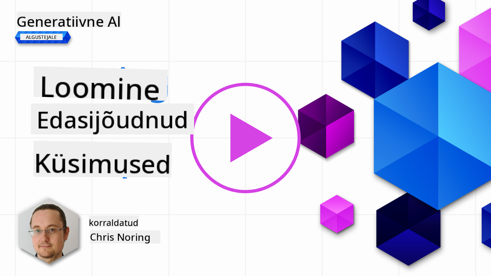

<!--
CO_OP_TRANSLATOR_METADATA:
{
  "original_hash": "b2651fb16bcfbc62b8e518751ed90fdb",
  "translation_date": "2025-10-18T02:47:55+00:00",
  "source_file": "05-advanced-prompts/README.md",
  "language_code": "et"
}
-->
# Täiustatud juhiste loomine

[](https://youtu.be/BAjzkaCdRok?si=NmUIyRf7-cDgbjtt)

Tuletame meelde eelmises peatükis õpitut:

> Juhiste _kujundamine_ on protsess, mille käigus me **suuname mudelit andma asjakohasemaid vastuseid**, pakkudes kasulikumaid juhiseid või konteksti.

Juhiste kirjutamisel on kaks sammu: juhise koostamine, pakkudes asjakohast konteksti, ja _optimeerimine_, kuidas juhist järk-järgult paremaks muuta.

Praeguseks on meil juba põhiline arusaam juhiste kirjutamisest, kuid peame minema sügavamale. Selles peatükis liigume erinevate juhiste katsetamisest arusaamiseni, miks üks juhis on parem kui teine. Õpid, kuidas koostada juhiseid, järgides mõningaid põhilisi tehnikaid, mida saab rakendada mis tahes LLM-i puhul.

## Sissejuhatus

Selles peatükis käsitleme järgmisi teemasid:

- Laienda oma teadmisi juhiste kujundamisest, rakendades erinevaid tehnikaid.
- Kohanda oma juhiseid, et saada erinevaid väljundeid.

## Õpieesmärgid

Pärast selle õppetunni läbimist oskad:

- Rakendada juhiste kujundamise tehnikaid, mis parandavad juhiste tulemusi.
- Teostada juhendamist, mis on kas varieeruv või deterministlik.

## Juhiste kujundamine

Juhiste kujundamine on protsess, mille käigus luuakse juhiseid, mis annavad soovitud tulemuse. Juhiste kujundamine ei tähenda ainult tekstilise juhise kirjutamist. See ei ole inseneriteadus, vaid pigem tehnikate kogum, mida saab rakendada soovitud tulemuse saavutamiseks.

### Näide juhisest

Vaatame ühte lihtsat juhist:

> Loo 10 küsimust geograafia kohta.

Selles juhises rakendad tegelikult mitmeid erinevaid juhendamise tehnikaid.

Lahkame selle lahti.

- **Kontekst**, sa täpsustad, et see peaks olema "geograafia" kohta.
- **Väljundi piiramine**, sa soovid mitte rohkem kui 10 küsimust.

### Lihtsate juhiste piirangud

Sa võid saada soovitud tulemuse või mitte. Küsimused küll genereeritakse, kuid geograafia on suur teema ja sa ei pruugi saada seda, mida soovid, järgmistel põhjustel:

- **Suur teema**, sa ei tea, kas see puudutab riike, pealinnu, jõgesid jne.
- **Formaat**, mis siis, kui sa soovid, et küsimused oleksid teatud viisil vormistatud?

Nagu näha, on juhiste loomisel palju asju, mida arvestada.

Siiani oleme näinud lihtsat juhise näidet, kuid generatiivne tehisintellekt on võimeline palju enamaks, et aidata inimesi erinevates rollides ja tööstusharudes. Uurime edasi mõningaid põhilisi tehnikaid.

### Juhendamise tehnikad

Kõigepealt peame mõistma, et juhendamine on LLM-i _esilekerkiv_ omadus, mis tähendab, et see ei ole mudelisse sisse ehitatud funktsioon, vaid midagi, mida avastame mudelit kasutades.

On mõned põhilised tehnikad, mida saame LLM-i juhendamiseks kasutada. Uurime neid.

- **Nullnäidisega juhendamine**, see on kõige lihtsam juhendamise vorm. See on üksik juhis, mis palub LLM-il vastata ainult oma treeningandmete põhjal.
- **Mõnenäidisega juhendamine**, see juhendamise tüüp suunab LLM-i, pakkudes 1 või rohkem näiteid, millele tuginedes see oma vastuse genereerib.
- **Mõttekäigu ahel**, see juhendamise tüüp õpetab LLM-i probleemi sammudeks jagama.
- **Genereeritud teadmised**, juhise vastuse parandamiseks võid lisada juhisele genereeritud fakte või teadmisi.
- **Lihtsamast keerulisemani**, nagu mõttekäigu ahel, seisneb see tehnika probleemi jagamises sammudeks ja nende sammude järjekorras täitmise juhendamises.
- **Iseparandus**, see tehnika seisneb LLM-i väljundi kriitilises hindamises ja seejärel selle parandamises.
- **Maieutiline juhendamine**, siin on eesmärk tagada, et LLM-i vastus oleks õige, ja paluda tal selgitada vastuse erinevaid osi. See on isekorrektsiooni vorm.

### Nullnäidisega juhendamine

See juhendamise stiil on väga lihtne, see koosneb ühest juhisest. See tehnika on tõenäoliselt see, mida sa kasutad, kui hakkad LLM-idega tutvuma. Siin on näide:

- Juhis: "Mis on algebra?"
- Vastus: "Algebra on matemaatika haru, mis uurib matemaatilisi sümboleid ja nende sümbolitega manipuleerimise reegleid."

### Mõnenäidisega juhendamine

See juhendamise stiil aitab mudelit, pakkudes mõningaid näiteid koos ülesandega. See koosneb ühest juhisest koos täiendavate ülesandespetsiifiliste andmetega. Siin on näide:

- Juhis: "Kirjuta luuletus Shakespeare'i stiilis. Siin on mõned näited Shakespeare'i sonettidest:
  Sonett 18: 'Kas ma võrdlen sind suvepäevaga? Sa oled armsam ja mõõdukam...'
  Sonett 116: 'Ärgu olgu tõeliste mõistuste abielus takistusi. Armastus ei ole armastus, mis muutub, kui muutus leiab aset...'
  Sonett 132: 'Sinu silmi ma armastan, ja nemad, nagu halastades mulle, Teades, et su süda piinab mind põlgusega,...'
  Nüüd kirjuta sonett kuu ilust."
- Vastus: "Taevasse kuu pehme valgus heidab, Hõbedases säras, mis õrnalt armu jagab,..."

Näited annavad LLM-ile konteksti, formaadi või soovitud väljundi stiili. Need aitavad mudelil mõista konkreetset ülesannet ja genereerida täpsemaid ja asjakohasemaid vastuseid.

### Mõttekäigu ahel

Mõttekäigu ahel on väga huvitav tehnika, kuna see seisneb LLM-i juhendamises läbi mitme sammu. Idee on juhendada LLM-i nii, et see mõistaks, kuidas midagi teha. Vaatame järgmist näidet, nii mõttekäigu ahelaga kui ka ilma:

    - Juhis: "Alice'il on 5 õuna, ta viskab 3 õuna ära, annab 2 Bobile ja Bob annab ühe tagasi, mitu õuna on Alice'il?"
    - Vastus: 5

LLM vastab 5, mis on vale. Õige vastus on 1 õun, arvestades arvutust (5 -3 -2 + 1 = 1).

Kuidas saame õpetada LLM-i seda õigesti tegema?

Proovime mõttekäigu ahelat. Mõttekäigu ahela rakendamine tähendab:

1. Anna LLM-ile sarnane näide.
1. Näita arvutust ja kuidas seda õigesti arvutada.
1. Esita algne juhis.

Näide:

- Juhis: "Lisal on 7 õuna, ta viskab 1 õuna ära, annab 4 õuna Bartile ja Bart annab ühe tagasi:
  7 -1 = 6
  6 -4 = 2
  2 +1 = 3  
  Alice'il on 5 õuna, ta viskab 3 õuna ära, annab 2 Bobile ja Bob annab ühe tagasi, mitu õuna on Alice'il?"
  Vastus: 1

Nagu näha, kirjutame oluliselt pikema juhise, lisades teise näite, arvutuse ja seejärel algse juhise, ning jõuame õige vastuseni 1.

Nagu näha, on mõttekäigu ahel väga võimas tehnika.

### Genereeritud teadmised

Sageli, kui soovid juhist koostada, tahad seda teha, kasutades oma ettevõtte andmeid. Osa juhisest peaks tulema ettevõttest ja teine osa peaks olema tegelik juhis, mis sind huvitab.

Näiteks, kui oled kindlustusäris, võib sinu juhis välja näha selline:

```text
{{company}}: {{company_name}}
{{products}}:
{{products_list}}
Please suggest an insurance given the following budget and requirements:
Budget: {{budget}}
Requirements: {{requirements}}
```

Ülal näed, kuidas juhis on koostatud malli abil. Mallis on mitmeid muutujaid, mida tähistatakse `{{muutuja}}`, ja need asendatakse tegelike väärtustega ettevõtte API-st.

Näide, kuidas juhis võib välja näha pärast muutujate asendamist ettevõtte sisuga:

```text
Insurance company: ACME Insurance
Insurance products (cost per month):
- Car, cheap, 500 USD
- Car, expensive, 1100 USD
- Home, cheap, 600 USD
- Home, expensive, 1200 USD
- Life, cheap, 100 USD

Please suggest an insurance given the following budget and requirements:
Budget: $1000
Requirements: Car, Home, and Life insurance
```

Kui see juhis LLM-i kaudu läbi lasta, saadakse selline vastus:

```output
Given the budget and requirements, we suggest the following insurance package from ACME Insurance:
- Car, cheap, 500 USD
- Home, cheap, 600 USD
- Life, cheap, 100 USD
Total cost: $1,200 USD
```

Nagu näha, soovitab see ka elukindlustust, mida see ei peaks tegema. See tulemus viitab sellele, et peame juhist optimeerima, muutes selle selgemaks, mida see lubab. Pärast mõningast _katsetamist ja eksimist_ jõuame järgmise juhiseni:

```text
Insurance company: ACME Insurance
Insurance products (cost per month):
- type: Car, cheap, cost: 500 USD
- type: Car, expensive, cost: 1100 USD
- type: Home, cheap, cost: 600 USD
- type: Home, expensive, cost: 1200 USD
- type: Life, cheap, cost: 100 USD

Please suggest an insurance given the following budget and requirements:
Budget: $1000 restrict choice to types: Car, Home
```

Pange tähele, kuidas _tüübi_ ja _kulu_ lisamine ning märksõna _piirata_ kasutamine aitab LLM-il mõista, mida me tahame.

Nüüd saame järgmise vastuse:

```output
Given the budget and requirements, we suggest the Car, Cheap insurance product which costs 500 USD per month.
```

Selle näite eesmärk oli näidata, et isegi kui kasutame põhilist tehnikat nagu _genereeritud teadmised_, peame enamasti juhist optimeerima, et saada soovitud tulemus.

### Lihtsamast keerulisemani

Lihtsamast keerulisemani juhendamise idee on jagada suurem probleem alamprobleemideks. Nii aitad LLM-il "vallutada" suurema probleemi. Hea näide võiks olla andmeteadus, kus saad paluda LLM-il jagada probleem järgmiselt:

> Juhis: Kuidas teha andmeteadust 5 sammuga?

Sinu AI-assistent vastab:

1. Andmete kogumine
1. Andmete puhastamine
1. Andmete analüüsimine
1. Andmete visualiseerimine
1. Andmete esitamine

### Iseparandus, tulemuste kriitika

Generatiivsete tehisintellektide ja LLM-ide puhul ei saa sa väljundit pimesi usaldada. Sa pead seda kontrollima. Lõppude lõpuks esitab LLM lihtsalt seda, mis on tõenäoliselt järgmine asi, mida öelda, mitte tingimata õiget vastust. Seetõttu on hea mõte paluda LLM-il ennast kritiseerida, mis viib meid iseparanduse tehnikani.

Kuidas see töötab:

1. Esmane juhis, milles palutakse LLM-il probleem lahendada
1. LLM vastab
1. Sa kritiseerid vastust ja palud AI-l seda parandada
1. LLM vastab uuesti, seekord arvestades kriitikat ja pakkudes välja lahendusi

Seda protsessi saab korrata nii palju kordi, kui soovid.

Näide selle tehnika kasutamisest:

> Juhis: "Loo Python Web API, millel on marsruudid toodete ja klientide jaoks"

AI vastus:

```python
import flask
app = Flask(__name__)

@app.route('/products')
def products():
    return 'Products'

@app.route('/customers')
def customers():
    return 'Customers'
```

> Juhis: paku ülaltoodud koodile 3 täiustust

AI vastus:

```text
Sure, here are three suggestions to improve the code:

Import the correct module: The first line should import Flask instead of flask. The correct import statement should be from flask import Flask.

Add a main function: Add a if __name__ == '__main__': block to the end of the file to run the application when the file is executed.

Use f-strings: Use f-strings to format the return statements in the route functions. For example, return 'Products' can be changed to return f'This is the {request.path} page'.
```

```python
from flask import Flask, request

app = Flask(__name__)

@app.route('/products')
def products():
    return f'This is the {request.path} page'

@app.route('/customers')
def customers():
    return f'This is the {request.path} page'

if __name__ == '__main__':
    app.run()
```

Nagu näha, parandab ülaltoodud AI vastus esialgset koodi tänu sellele, et esimesele vastusele anti kriitikat.

### Maieutiline juhendamine

Maieutiline juhendamine on tehnika, mis sarnaneb iseparandusega, kuid see seisneb rohkem LLM-ilt selgituste küsimises. Eesmärk on vähendada LLM-i väljundis esinevaid vastuolusid, et tagada õige vastus. Järgida tuleks järgmist töövoogu:

1. Palu LLM-il küsimusele vastata.
1. Küsi iga vastuse osa kohta LLM-ilt täpsemat selgitust.
1. Kui esineb vastuolusid, jäta vastuolulised osad kõrvale.

Korda samme 2 ja 3, kuni oled kõigi osadega rahul.

Näide juhisest:

> Juhis: Kuidas luua kriisiplaan pandeemia leevendamiseks 5 sammuga?
> LLM vastus:

```text
1. Identify the risks
1. Identify the stakeholders
1. Identify the resources
1. Identify the actions
1. Identify the communication channels
```

See tuvastas 5 sammu, kuid kas saame kindlaks teha, kas see on õige? Küsime LLM-ilt iga sammu kohta täpsemat selgitust:

> Juhis: Selgita esimest sammu täpsemalt, millised on pandeemiaga seotud riskid?

```text
The risks are the following:

- Loss of life
- Loss of business
- Loss of reputation
- Loss of customers
- Loss of employees
```

Selles punktis tahame veenduda, et LLM on õige, seega küsime, et see selgitaks esimest riski täpsemalt ja loodame, et see on vastusega kooskõlas:

> Juhis: Pandeemia korral, mis on suurim risk ja miks?

```text
The biggest risk is loss of life because it's the most important thing to protect.
```

> Millised on kaks suurimat riski pandeemia korral?

```text
The two biggest risks are loss of life and loss of business.
```

Selles punktis on LLM järjepidev ja mainib "elu" ja "äri" kui kahte suurimat riski. Nüüd saame liikuda järgmise sammu juurde ja olla üsna kindlad. Siiski ei tohiks LLM-i pimesi usaldada, alati tuleks väljundit kontrollida.

## Muuda oma väljundit

LLM-id on oma olemuselt mitte-deterministlikud, mis tähendab, et saad iga kord sama juhise käivitamisel erinevaid tulemusi. Proovi näiteks järgmist juhist:

> "Genereeri kood Python Web API jaoks"

```python
# Import necessary modules
import flask
from flask import request, jsonify

# Create a Flask app
app = flask.Flask(__name__)

# Create a route for the API
@app.route('/api', methods=['GET'])
def api():
    # Get the data from the request
    data = request.args

    # Process the data
    result = process_data(data)

    # Return the result as JSON
    return jsonify(result)

# Function to process the data
def process_data(data):
    # Do something with the data
    result = data + 1

    # Return the result
    return result

# Run the app
if __name__ == '__main__':
    app.run()

```

Sama juhise uuesti käivitamine annab veidi teistsuguse vastuse:

```python
#import necessary packages
import flask
from flask import request, jsonify

#create the Flask application
app = flask.Flask(__name__)
app.config["DEBUG"] = True

#create a list of books
books = [
    {'id': 0,
     'title': 'A Fire Upon the Deep',
     'author': 'Vernor Vinge',
     'first_sentence': 'The coldsleep itself was dreamless.',
     'year_published': '1992'},
    {'id': 1,
     'title': 'The Ones Who Walk Away From Omelas',
     'author': 'Ursula K. Le Guin',
     'first_sentence': 'With a clamor of bells that set the swallows soaring, the Festival of Summer came to the city Omelas, bright-towered by the sea.',
     'published': '1973'},
    {'id': 2,
     'title': 'Dhalgren',
     'author': 'Samuel R. Delany',
     'first_sentence': 'to wound the autumnal city.',
     'published': '1975'}
]

#create an endpoint for the API
@app.route('/', methods=['GET'])
def home():
    return '''<h1>Books API</h1>
<p>A prototype API for retrieving books.</p>'''

#create an endpoint to return all books
@app.route('/api/v1/resources/books/all', methods=['GET'])
def api_all():
    return jsonify(books)

#create an endpoint to return a single book
@app.route('/api/v1/resources/books', methods=['GET'])
def api_id():
    #check if an ID was provided as part of the URL
    #if ID is provided, assign it to a variable
    #if no ID is provided, display an error
    if 'id' in request.args:
        id = int(request.args['id'])
    else:
        return "Error: No id field provided. Please specify an id."

    #create an empty list for our results
    results = []

    #loop through the data and match results that fit the requested ID
    #IDs are unique, but other fields might return many results
    for book in books:
        if book['id'] == id:
            results.append(book)

    #use the jsonify function from Flask to convert our list of
    #Python dictionaries to the JSON format
    return jsonify(results)

app.run()
```

> Kas varieeruv väljund on probleem?

See sõltub sellest, mida sa üritad teha. Kui soovid konkreetset vastust, siis on see probleem. Kui oled rahul varieeruva väljundiga, näiteks "Genereeri 3 küsimust geograafia kohta", siis ei ole see probleem.

### Temperatuuri kasutamine väljundi varieerimiseks

Okei, oleme otsustanud, et soovime väljundit piirata, et see oleks ennustatavam, st deterministlikum. Kuidas seda teha?

Temperatuur on väärtus vahemikus 0 kuni 1, kus 0 on kõige deterministlikum ja 1 kõige varieeruvam. Vaikeväärtus on 0,7. Vaatame, mis juhtub, kui käivitame sama juhise kaks korda, määrates temperatuuri väärtuseks 0,1:

> "Genereeri kood Python Web API jaoks"

```python
#import necessary libraries
import flask
from flask import request, jsonify

#create an instance of the Flask class
app = flask.Flask(__name__)

#create an endpoint for the API
@app.route('/api/v1/endpoint', methods=['GET'])
def api_endpoint():
    #get the request data
    data = request.get_json()

    #process the data
    result = process_data(data)

    #return the result
    return jsonify(result)

#function to process the data
def process_data(data):
    #process the data
    result = {'result': 'success'}

    #return the result
    return result

#run the Flask app
if __name__ == '__main__':
    app.run()

```

Juhise uuesti käivitamine annab järgmise tulemuse:

```python
#import necessary libraries
import flask
from flask import request, jsonify

#create a Flask app
app = flask.Flask(__name__)

#create a route for the API
@app.route('/api', methods=['GET'])
def api_call():
    #get the data from the request
    data = request.get_json()

    #process the data
    result = process_data(data)

    #return the result
    return jsonify(result)

#define the process_data function
def process_data(data):
    #do something with the data
    result = data + 1

    #return the result
    return result

#run the app
if __name__ == '__main__':
    app.run()

```

Nende kahe väljundi vahel on ainult väike erinevus. Teeme seekord vastupidist, määrame temperatuuri väärtuseks 0,9:

```python
# Import necessary libraries
import flask
from flask import request, jsonify

# Create a Flask app
app = flask.Flask(__name__)

# Create a route for the API
@app.route('/api', methods=['GET'])
def api_call():
    # Get the data from the request
    data = request.args

    # Process the data
    result = process_data(data)

    # Return the result
    return jsonify(result)

# Function to process the data
def process_data(data):
    # Do something with the data
    result = data + 1

    # Return the result
    return result

# Run the app
if __name__ == '__main__':
    app.run()

```

ja teine katse temperatuuriväärtusega 0,9:

```python
import flask
from flask import request, jsonify

# create the Flask app
app = flask.Flask(__name__)
app.config['DEBUG'] = True

# create some test data
books = [
    {'id': 0, 'title': 'A Fire Upon The Deep', 'author': 'Vernor Vinge', 'first_sentence': 'The coldsleep itself was dreamless.', 'year_published': '1992'},
    {'id': 1, 'title': 'The Ones Who Walk Away From Omelas', 'author': 'Ursula K. Le Guin', 'first_sentence': 'With a clamor of bells that set the swallows soaring, the Festival of Summer came to the city Omelas, bright-towered by the sea.', 'published': '1973'},
    {'id': 2, 'title': 'Dhalgren', 'author': 'Samuel R. Delany', 'first_sentence': 'to wound the autumnal city.', 'published': '1975'}
]

# create an endpoint
@app.route('/', methods=['GET'])
def home():
    return '''<h1>Welcome to our book API!</h1>'''

@app.route('/api/v1/resources/books

```

Nagu näha, võivad tulemused olla väga erinevad.

> Pange tähele, et on veel mitmeid parameetreid, mida saate muuta, et väljundit varieerida, nagu top-k, top-p, korduse karistus, pikkuse karistus ja mitmekesisuse karistus, kuid need jäävad selle õppekava ulatusest välja.

## Head tavad

On mitmeid praktikaid, mida saate rakendada, et saavutada soovitud tulemus. Oma stiili leiate, kui kasutate järjest rohkem suunamist.

Lisaks tehnikatele, mida oleme käsitlenud, on mõned head tavad, mida tasub LLM-i suunamisel arvestada.

Siin on mõned head tavad, mida kaaluda:

- **Määratlege kontekst**. Kontekst on oluline – mida täpsemalt saate määratleda, näiteks valdkond, teema jne, seda parem.
- Piirake väljundit. Kui soovite kindlat arvu punkte või kindlat pikkust, siis määratlege see.
- **Määratlege nii mida kui ka kuidas**. Ärge unustage mainida nii seda, mida soovite, kui ka seda, kuidas te seda soovite, näiteks "Loo Python Web API marsruutidega products ja customers, jaga see 3 failiks".
- **Kasutage malle**. Sageli soovite rikastada oma suuniseid oma ettevõtte andmetega. Kasutage selleks malle. Mallid võivad sisaldada muutujaid, mida asendate tegelike andmetega.
- **Kirjutage õigesti**. LLM-id võivad anda teile õige vastuse, kuid kui kirjutate õigesti, saate parema vastuse.

## Ülesanne

Siin on Pythonis kood, mis näitab, kuidas luua lihtsat API-d kasutades Flaski:

```python
from flask import Flask, request

app = Flask(__name__)

@app.route('/')
def hello():
    name = request.args.get('name', 'World')
    return f'Hello, {name}!'

if __name__ == '__main__':
    app.run()
```
  
Kasutage AI assistenti nagu GitHub Copilot või ChatGPT ja rakendage "self-refine" tehnikat, et koodi täiustada.

## Lahendus

Proovige ülesannet lahendada, lisades koodile sobivaid suuniseid.

> [!TIP]  
> Sõnastage suunis, et paluda koodi täiustada; hea mõte on piirata, kui palju täiustusi tehakse. Samuti võite paluda täiustada seda teatud viisil, näiteks arhitektuuri, jõudluse, turvalisuse jne osas.

[Lahendus](../../../05-advanced-prompts/python/aoai-solution.py)

## Teadmiste kontroll

Miks ma peaksin kasutama chain-of-thought suunamist? Näidake mulle 1 õiget vastust ja 2 vale vastust.

1. Õpetada LLM-ile, kuidas probleemi lahendada.  
1. B, Õpetada LLM-ile, kuidas koodis vigu leida.  
1. C, Juhendada LLM-i leidma erinevaid lahendusi.  

A: 1, sest chain-of-thought seisneb selles, et näidata LLM-ile, kuidas probleemi lahendada, pakkudes sellele sammude jada, sarnaseid probleeme ja nende lahendusi.

## 🚀 Väljakutse

Te just kasutasite self-refine tehnikat ülesandes. Võtke mõni programm, mille olete loonud, ja mõelge, milliseid täiustusi sooviksite sellele rakendada. Nüüd kasutage self-refine tehnikat, et rakendada kavandatud muudatusi. Mis te arvate, kas tulemus oli parem või halvem?

## Suurepärane töö! Jätkake õppimist

Pärast selle õppetunni lõpetamist vaadake meie [Generatiivse AI õppekollektsiooni](https://aka.ms/genai-collection?WT.mc_id=academic-105485-koreyst), et jätkata oma generatiivse AI teadmiste arendamist!

Liikuge edasi 6. õppetundi, kus rakendame oma teadmisi suunamistehnikatest, [luues tekstigeneratsiooni rakendusi](../06-text-generation-apps/README.md?WT.mc_id=academic-105485-koreyst).

---

**Lahtiütlus**:  
See dokument on tõlgitud AI tõlketeenuse [Co-op Translator](https://github.com/Azure/co-op-translator) abil. Kuigi püüame tagada täpsust, palume arvestada, et automaatsed tõlked võivad sisaldada vigu või ebatäpsusi. Algne dokument selle algses keeles tuleks pidada autoriteetseks allikaks. Olulise teabe puhul soovitame kasutada professionaalset inimtõlget. Me ei vastuta arusaamatuste või valede tõlgenduste eest, mis võivad tekkida selle tõlke kasutamise tõttu.