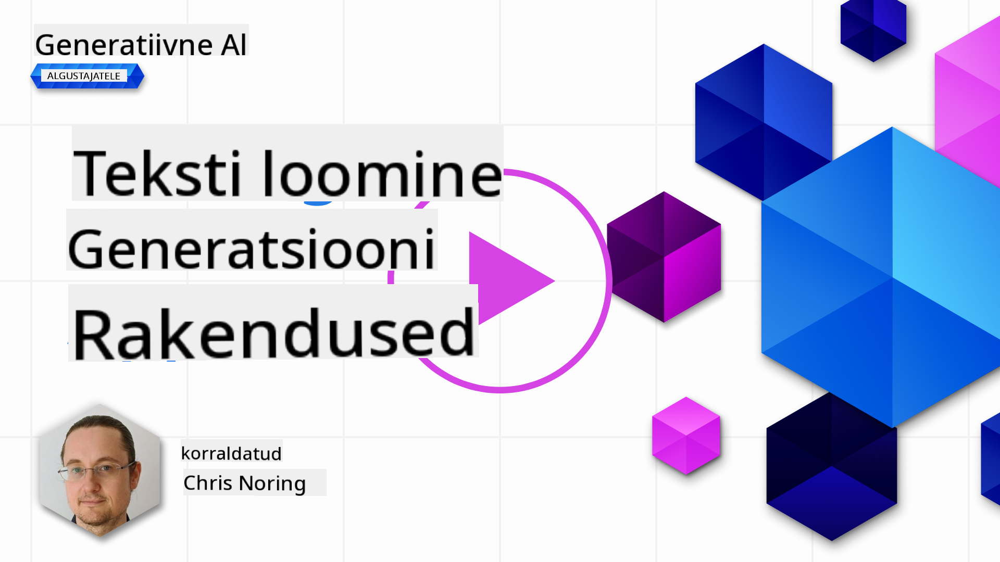

<!--
CO_OP_TRANSLATOR_METADATA:
{
  "original_hash": "df027997f1448323d6159b78a1b669bf",
  "translation_date": "2025-10-18T02:48:38+00:00",
  "source_file": "06-text-generation-apps/README.md",
  "language_code": "et"
}
-->
# Teksti genereerimise rakenduste loomine

[](https://youtu.be/0Y5Luf5sRQA?si=t_xVg0clnAI4oUFZ)

> _(Klõpsa ülaloleval pildil, et vaadata selle õppetunni videot)_

Selles õppekavas olete seni näinud, et on olemas põhikontseptsioone, nagu sisendid (prompts) ja isegi terve distsipliin nimega "sisendite inseneeria". Paljud tööriistad, nagu ChatGPT, Office 365, Microsoft Power Platform ja teised, võimaldavad teil kasutada sisendeid, et midagi saavutada.

Kui soovite sellist kogemust oma rakendusse lisada, peate mõistma kontseptsioone nagu sisendid, tulemused ja valima sobiva teegi, millega töötada. Just seda õpite selles peatükis.

## Sissejuhatus

Selles peatükis õpite:

- Tutvuma openai teegiga ja selle põhikontseptsioonidega.
- Looma teksti genereerimise rakendust, kasutades openai.
- Mõistma, kuidas kasutada kontseptsioone nagu sisend, temperatuur ja tokenid, et luua teksti genereerimise rakendus.

## Õpieesmärgid

Selle õppetunni lõpuks suudate:

- Selgitada, mis on teksti genereerimise rakendus.
- Luua teksti genereerimise rakendust, kasutades openai.
- Konfigureerida oma rakendust kasutama rohkem või vähem tokeneid ning muuta temperatuuri, et saada erinevaid tulemusi.

## Mis on teksti genereerimise rakendus?

Tavaliselt on rakendusel mingi liides, näiteks:

- Käsupõhine. Konsolirakendused on tüüpilised rakendused, kus sisestate käsu ja see täidab ülesande. Näiteks `git` on käsupõhine rakendus.
- Kasutajaliides (UI). Mõnel rakendusel on graafilised kasutajaliidesed (GUI), kus klõpsate nuppudel, sisestate teksti, valite valikuid ja palju muud.

### Konsoli- ja kasutajaliidesega rakenduste piirangud

Võrrelge seda käsupõhise rakendusega, kus sisestate käsu:

- **See on piiratud**. Te ei saa sisestada lihtsalt suvalist käsku, vaid ainult neid, mida rakendus toetab.
- **Keele spetsiifilisus**. Mõned rakendused toetavad mitut keelt, kuid vaikimisi on rakendus loodud konkreetse keele jaoks, isegi kui saate lisada rohkem keeletoetust.

### Teksti genereerimise rakenduste eelised

Kuidas erineb teksti genereerimise rakendus?

Teksti genereerimise rakenduses on teil rohkem paindlikkust, te ei ole piiratud kindlate käskude või konkreetse sisendkeelega. Selle asemel saate rakendusega suhelda loomuliku keele abil. Teine eelis on see, et suhtlete juba andmeallikaga, mis on treenitud suurel hulgal informatsioonil, samas kui traditsiooniline rakendus võib piirduda ainult andmebaasis oleva teabega.

### Mida saab teksti genereerimise rakendusega luua?

Võimalusi on palju. Näiteks:

- **Vestlusrobot**. Vestlusrobot, mis vastab küsimustele teemade kohta, nagu teie ettevõte ja selle tooted, võib olla hea valik.
- **Abiline**. LLM-id on suurepärased tekstide kokkuvõtete tegemisel, tekstist ülevaadete saamisel, CV-de ja muu teksti loomisel.
- **Koodiassistent**. Sõltuvalt kasutatavast keelemudelist saate luua koodiassistendi, mis aitab teil koodi kirjutada. Näiteks saate kasutada selliseid tooteid nagu GitHub Copilot ja ChatGPT, et aidata teil koodi kirjutada.

## Kuidas alustada?

Peate leidma viisi, kuidas integreeruda LLM-iga, mis tavaliselt hõlmab kahte lähenemist:

- Kasutada API-d. Siin koostate veebipäringuid oma sisendiga ja saate tagasi genereeritud teksti.
- Kasutada teeki. Teegid aitavad API-kõnesid kapseldada ja muudavad nende kasutamise lihtsamaks.

## Teegid/SDK-d

On mitmeid tuntud teeke, mis töötavad LLM-idega, näiteks:

- **openai**, see teek muudab mudeliga ühenduse loomise ja sisendite saatmise lihtsaks.

Samuti on olemas kõrgema taseme teegid, nagu:

- **Langchain**. Langchain on hästi tuntud ja toetab Pythonit.
- **Semantic Kernel**. Semantic Kernel on Microsofti teek, mis toetab keeli C#, Python ja Java.

## Esimene rakendus, kasutades openai

Vaatame, kuidas saame luua oma esimese rakenduse, milliseid teeke vajame, kui palju on vaja ja nii edasi.

### openai paigaldamine

OpenAI või Azure OpenAI-ga suhtlemiseks on palju teeke. Võimalik on kasutada ka mitmeid programmeerimiskeeli, nagu C#, Python, JavaScript, Java ja palju muud. Oleme valinud `openai` Python teegi, seega kasutame selle paigaldamiseks `pip`.

```bash
pip install openai
```

### Ressursi loomine

Peate tegema järgmised sammud:

- Looge konto Azure'is [https://azure.microsoft.com/free/](https://azure.microsoft.com/free/?WT.mc_id=academic-105485-koreyst).
- Saage juurdepääs Azure OpenAI-le. Minge [https://learn.microsoft.com/azure/ai-services/openai/overview#how-do-i-get-access-to-azure-openai](https://learn.microsoft.com/azure/ai-services/openai/overview#how-do-i-get-access-to-azure-openai?WT.mc_id=academic-105485-koreyst) ja taotlege juurdepääsu.

  > [!NOTE]
  > Kirjutamise ajal peate taotlema juurdepääsu Azure OpenAI-le.

- Paigaldage Python <https://www.python.org/>
- Looge Azure OpenAI teenuse ressurss. Vaadake seda juhendit, kuidas [ressurssi luua](https://learn.microsoft.com/azure/ai-services/openai/how-to/create-resource?pivots=web-portal?WT.mc_id=academic-105485-koreyst).

### API võtme ja lõpp-punkti leidmine

Praegusel hetkel peate oma `openai` teegile ütlema, millist API võtit kasutada. API võtme leidmiseks minge oma Azure OpenAI ressursi "Keys and Endpoint" sektsiooni ja kopeerige "Key 1" väärtus.


Nüüd, kui olete selle teabe kopeerinud, juhendame teeke seda kasutama.

> [!NOTE]
> Tasub eraldada oma API võti koodist. Seda saate teha, kasutades keskkonnamuutujaid.
>
> - Määrake keskkonnamuutuja `OPENAI_API_KEY` oma API võtmele.
>   `export OPENAI_API_KEY='sk-...'`

### Azure'i konfiguratsiooni seadistamine

Kui kasutate Azure OpenAI-d, siis siin on, kuidas konfiguratsiooni seadistada:

```python
openai.api_type = 'azure'
openai.api_key = os.environ["OPENAI_API_KEY"]
openai.api_version = '2023-05-15'
openai.api_base = os.getenv("API_BASE")
```

Ülaltoodud koodis määrame järgmised parameetrid:

- `api_type` väärtuseks `azure`. See ütleb teegile, et kasutada Azure OpenAI-d, mitte OpenAI-d.
- `api_key`, see on teie API võti, mille leiate Azure portaalist.
- `api_version`, see on API versioon, mida soovite kasutada. Kirjutamise ajal on uusim versioon `2023-05-15`.
- `api_base`, see on API lõpp-punkt. Selle leiate Azure portaalist oma API võtme kõrval.

> [!NOTE] > `os.getenv` on funktsioon, mis loeb keskkonnamuutujaid. Seda saab kasutada keskkonnamuutujate, nagu `OPENAI_API_KEY` ja `API_BASE`, lugemiseks. Määrake need keskkonnamuutujad oma terminalis või kasutades teeki nagu `dotenv`.

## Teksti genereerimine

Teksti genereerimiseks kasutatakse `Completion` klassi. Siin on näide:

```python
prompt = "Complete the following: Once upon a time there was a"

completion = openai.Completion.create(model="davinci-002", prompt=prompt)
print(completion.choices[0].text)
```

Ülaltoodud koodis loome completion objekti ja anname sellele mudeli, mida soovime kasutada, ning sisendi. Seejärel prindime genereeritud teksti.

### Vestluse tulemused

Siiani olete näinud, kuidas me kasutasime `Completion` klassi teksti genereerimiseks. Kuid on olemas ka teine klass nimega `ChatCompletion`, mis sobib paremini vestlusrobotite jaoks. Siin on näide selle kasutamisest:

```python
import openai

openai.api_key = "sk-..."

completion = openai.ChatCompletion.create(model="gpt-3.5-turbo", messages=[{"role": "user", "content": "Hello world"}])
print(completion.choices[0].message.content)
```

Rohkem sellest funktsionaalsusest järgmises peatükis.

## Harjutus - teie esimene teksti genereerimise rakendus

Nüüd, kui oleme õppinud, kuidas openai seadistada ja konfigureerida, on aeg luua oma esimene teksti genereerimise rakendus. Rakenduse loomiseks järgige neid samme:

1. Looge virtuaalne keskkond ja paigaldage openai:

   ```bash
   python -m venv venv
   source venv/bin/activate
   pip install openai
   ```

   > [!NOTE]
   > Kui kasutate Windowsi, sisestage `venv\Scripts\activate` asemel `source venv/bin/activate`.

   > [!NOTE]
   > Leidke oma Azure OpenAI võti, minnes [https://portal.azure.com/](https://portal.azure.com/?WT.mc_id=academic-105485-koreyst), otsige `Open AI` ja valige `Open AI resource`, seejärel valige `Keys and Endpoint` ja kopeerige `Key 1` väärtus.

1. Looge _app.py_ fail ja lisage sellele järgmine kood:

   ```python
   import openai

   openai.api_key = "<replace this value with your open ai key or Azure OpenAI key>"

   openai.api_type = 'azure'
   openai.api_version = '2023-05-15'
   openai.api_base = "<endpoint found in Azure Portal where your API key is>"
   deployment_name = "<deployment name>"

   # add your completion code
   prompt = "Complete the following: Once upon a time there was a"
   messages = [{"role": "user", "content": prompt}]

   # make completion
   completion = openai.chat.completions.create(model=deployment_name, messages=messages)

   # print response
   print(completion.choices[0].message.content)
   ```

   > [!NOTE]
   > Kui kasutate Azure OpenAI-d, peate määrama `api_type` väärtuseks `azure` ja `api_key` oma Azure OpenAI võtmele.

   Peaksite nägema väljundit, mis näeb välja umbes selline:

   ```output
    very unhappy _____.

   Once upon a time there was a very unhappy mermaid.
   ```

## Erinevat tüüpi sisendid erinevateks ülesanneteks

Nüüd olete näinud, kuidas sisendi abil teksti genereerida. Teil on isegi programm, mida saate muuta ja kohandada, et genereerida erinevat tüüpi teksti.

Sisendeid saab kasutada igasuguste ülesannete jaoks. Näiteks:

- **Teksti genereerimine**. Näiteks saate luua luuletusi, viktoriiniküsimusi jne.
- **Teabe otsimine**. Sisendeid saab kasutada teabe otsimiseks, näiteks "Mida tähendab CORS veebiarenduses?".
- **Koodi genereerimine**. Sisendeid saab kasutada koodi genereerimiseks, näiteks e-posti valideerimiseks mõeldud regulaaravaldiste loomiseks või miks mitte terve programmi, näiteks veebirakenduse, loomiseks?

## Praktilisem näide: retsepti generaator

Kujutage ette, et teil on kodus mõned koostisosad ja soovite midagi süüa teha. Selleks vajate retsepti. Üks viis retseptide leidmiseks on kasutada otsingumootorit või võite kasutada LLM-i.

Võite kirjutada sisendi järgmiselt:

> "Näita mulle 5 retsepti roogade jaoks, milles on järgmised koostisosad: kana, kartul ja porgand. Iga retsepti puhul loetle kõik kasutatud koostisosad."

Antud sisendi põhjal võite saada vastuse, mis on sarnane järgmisega:

```output
1. Roasted Chicken and Vegetables:
Ingredients:
- 4 chicken thighs
- 2 potatoes, cut into cubes
- 2 carrots, cut into cubes
- 2 tablespoons olive oil
- 2 cloves garlic, minced
- 1 teaspoon dried thyme
- 1 teaspoon dried oregano
- Salt and pepper, to taste

2. Chicken and Potato Stew:
Ingredients:
- 2 tablespoons olive oil
- 1 onion, diced
- 2 cloves garlic, minced
- 2 chicken breasts, cut into cubes
- 2 potatoes, cut into cubes
- 2 carrots, cut into cubes
- 1 teaspoon dried oregano
- 1 teaspoon dried thyme
- 1 cup chicken broth
- Salt and pepper, to taste

3. Chicken and Potato Bake:
Ingredients:
- 2 tablespoons olive oil
- 2 chicken breasts, cut into cubes
- 2 potatoes, cut into cubes
- 2 carrots, cut into cubes
- 1 onion, diced
- 2 cloves garlic, minced
- 1 teaspoon dried oregano
- 1 teaspoon dried thyme
- 1 cup chicken broth
- Salt and pepper, to taste

4. Chicken and Potato Soup:
Ingredients:
- 2 tablespoons olive oil
- 1 onion, diced
- 2 cloves garlic, minced
- 2 chicken breasts, cut into cubes
- 2 potatoes, cut into cubes
- 2 carrots, cut into cubes
- 1 teaspoon dried oregano
- 1 teaspoon dried thyme
- 4 cups chicken broth
- Salt and pepper, to taste

5. Chicken and Potato Hash:
Ingredients:
- 2 tablespoons olive oil
- 2 chicken breasts, cut into cubes
- 2 potatoes, cut into cubes
- 2 carrots, cut into cubes
- 1 onion, diced
- 2 cloves garlic, minced
- 1 teaspoon dried oregano
```

See tulemus on suurepärane, ma tean, mida süüa teha. Sel hetkel võiks kasulikud täiustused olla:

- Koostisosade filtreerimine, mida ma ei armasta või mille suhtes olen allergiline.
- Ostunimekirja koostamine juhuks, kui mul pole kõiki koostisosi kodus.

Ülaltoodud juhtumite jaoks lisame täiendava sisendi:

> "Palun eemaldage retseptid, milles on küüslauk, kuna olen selle suhtes allergiline, ja asendage see millegi muuga. Samuti koostage ostunimekiri retseptide jaoks, arvestades, et mul on kodus juba kana, kartul ja porgand."

Nüüd saate uue tulemuse, nimelt:

```output
1. Roasted Chicken and Vegetables:
Ingredients:
- 4 chicken thighs
- 2 potatoes, cut into cubes
- 2 carrots, cut into cubes
- 2 tablespoons olive oil
- 1 teaspoon dried thyme
- 1 teaspoon dried oregano
- Salt and pepper, to taste

2. Chicken and Potato Stew:
Ingredients:
- 2 tablespoons olive oil
- 1 onion, diced
- 2 chicken breasts, cut into cubes
- 2 potatoes, cut into cubes
- 2 carrots, cut into cubes
- 1 teaspoon dried oregano
- 1 teaspoon dried thyme
- 1 cup chicken broth
- Salt and pepper, to taste

3. Chicken and Potato Bake:
Ingredients:
- 2 tablespoons olive oil
- 2 chicken breasts, cut into cubes
- 2 potatoes, cut into cubes
- 2 carrots, cut into cubes
- 1 onion, diced
- 1 teaspoon dried oregano
- 1 teaspoon dried thyme
- 1 cup chicken broth
- Salt and pepper, to taste

4. Chicken and Potato Soup:
Ingredients:
- 2 tablespoons olive oil
- 1 onion, diced
- 2 chicken breasts, cut into cubes
- 2 potatoes, cut into cubes
- 2 carrots, cut into cubes
- 1 teaspoon dried oregano
- 1 teaspoon dried thyme
- 4 cups chicken broth
- Salt and pepper, to taste

5. Chicken and Potato Hash:
Ingredients:
- 2 tablespoons olive oil
- 2 chicken breasts, cut into cubes
- 2 potatoes, cut into cubes
- 2 carrots, cut into cubes
- 1 onion, diced
- 1 teaspoon dried oregano

Shopping List:
- Olive oil
- Onion
- Thyme
- Oregano
- Salt
- Pepper
```

Need on teie viis retsepti, kus küüslauku ei mainita, ja teil on ka ostunimekiri, arvestades, mis teil kodus juba olemas on.

## Harjutus - retsepti generaatori loomine

Nüüd, kui oleme stsenaariumi läbi mänginud, kirjutame koodi, mis vastab näidatud stsenaariumile. Selleks järgige neid samme:

1. Kasutage olemasolevat _app.py_ faili lähtepunktina.
1. Leidke `prompt` muutuja ja muutke selle koodi järgmiseks:

   ```python
   prompt = "Show me 5 recipes for a dish with the following ingredients: chicken, potatoes, and carrots. Per recipe, list all the ingredients used"
   ```

   Kui nüüd koodi käivitate, peaksite nägema väljundit, mis on sarnane järgmisega:

   ```output
   -Chicken Stew with Potatoes and Carrots: 3 tablespoons oil, 1 onion, chopped, 2 cloves garlic, minced, 1 carrot, peeled and chopped, 1 potato, peeled and chopped, 1 bay leaf, 1 thyme sprig, 1/2 teaspoon salt, 1/4 teaspoon black pepper, 1 1/2 cups chicken broth, 1/2 cup dry white wine, 2 tablespoons chopped fresh parsley, 2 tablespoons unsalted butter, 1 1/2 pounds boneless, skinless chicken thighs, cut into 1-inch pieces
   -Oven-Roasted Chicken with Potatoes and Carrots: 3 tablespoons extra-virgin olive oil, 1 tablespoon Dijon mustard, 1 tablespoon chopped fresh rosemary, 1 tablespoon chopped fresh thyme, 4 cloves garlic, minced, 1 1/2 pounds small red potatoes, quartered, 1 1/2 pounds carrots, quartered lengthwise, 1/2 teaspoon salt, 1/4 teaspoon black pepper, 1 (4-pound) whole chicken
   -Chicken, Potato, and Carrot Casserole: cooking spray, 1 large onion, chopped, 2 cloves garlic, minced, 1 carrot, peeled and shredded, 1 potato, peeled and shredded, 1/2 teaspoon dried thyme leaves, 1/4 teaspoon salt, 1/4 teaspoon black pepper, 2 cups fat-free, low-sodium chicken broth, 1 cup frozen peas, 1/4 cup all-purpose flour, 1 cup 2% reduced-fat milk, 1/4 cup grated Parmesan cheese

   -One Pot Chicken and Potato Dinner: 2 tablespoons olive oil, 1 pound boneless, skinless chicken thighs, cut into 1-inch pieces, 1 large onion, chopped, 3 cloves garlic, minced, 1 carrot, peeled and chopped, 1 potato, peeled and chopped, 1 bay leaf, 1 thyme sprig, 1/2 teaspoon salt, 1/4 teaspoon black pepper, 2 cups chicken broth, 1/2 cup dry white wine

   -Chicken, Potato, and Carrot Curry: 1 tablespoon vegetable oil, 1 large onion, chopped, 2 cloves garlic, minced, 1 carrot, peeled and chopped, 1 potato, peeled and chopped, 1 teaspoon ground coriander, 1 teaspoon ground cumin, 1/2 teaspoon ground turmeric, 1/2 teaspoon ground ginger, 1/4 teaspoon cayenne pepper, 2 cups chicken broth, 1/2 cup dry white wine, 1 (15-ounce) can chickpeas, drained and rinsed, 1/2 cup raisins, 1/2 cup chopped fresh cilantro
   ```

   > MÄRKUS, teie LLM on mittelineaarne, seega võite iga kord programmi käivitamisel saada erinevaid tulemusi.

   Suurepärane, vaatame, kuidas saame asju parandada. Parandamiseks tahame veenduda, et kood oleks paindlik, et koostisosi ja retseptide arvu saaks parandada ja muuta.

1. Muutke koodi järgmiselt:

   ```python
   no_recipes = input("No of recipes (for example, 5): ")

   ingredients = input("List of ingredients (for example, chicken, potatoes, and carrots): ")

   # interpolate the number of recipes into the prompt an ingredients
   prompt = f"Show me {no_recipes} recipes for a dish with the following ingredients: {ingredients}. Per recipe, list all the ingredients used"
   ```

   Koodi testimine võib välja näha järgmiselt:

   ```output
   No of recipes (for example, 5): 3
   List of ingredients (for example, chicken, potatoes, and carrots): milk,strawberries

   -Strawberry milk shake: milk, strawberries, sugar, vanilla extract, ice cubes
   -Strawberry shortcake: milk, flour, baking powder, sugar, salt, unsalted butter, strawberries, whipped cream
   -Strawberry milk: milk, strawberries, sugar, vanilla extract
   ```

### Parandamine, lisades filtri ja ostunimekirja

Nüüd on meil töötav rakendus, mis suudab retsepte luua ja on paindlik, kuna see tugineb kasutaja sisenditele, nii retseptide arvu kui ka kasutatavate koostisosade osas.

Edasiseks täiustamiseks tahame lisada järgmised funktsioonid:

- **Koostisosade filtreerimine**. Tahame olla võimelised filtreerima koostisosi, mida me ei armasta või mille suhtes oleme allergilised. Selle muudatuse saavutamiseks saame redigeerida olemasolevat sisendit ja lisada filtri tingimuse selle lõppu järgmiselt:

  ```python
  filter = input("Filter (for example, vegetarian, vegan, or gluten-free): ")

  prompt = f"Show me {no_recipes} recipes for a dish with the following ingredients: {ingredients}. Per recipe, list all the ingredients used, no {filter}"
  ```

  Ülaltoodud koodis lisame `{filter}` sisendi lõppu ja salvestame kasutajalt saadud filtri väärtuse.

  Näiteks programmi käivitamise sisend võib nüüd välja näha järgmiselt:

  ```output
  No of recipes (for example, 5): 3
  List of ingredients (for example, chicken, potatoes, and carrots): onion,milk
  Filter (for example, vegetarian, vegan, or gluten-free): no milk

  1. French Onion Soup

  Ingredients:

  -1 large onion, sliced
  -3 cups beef broth
  -1 cup milk
  -6 slices french bread
  -1/4 cup shredded Parmesan cheese
  -1 tablespoon butter
  -1 teaspoon dried thyme
  -1/4 teaspoon salt
  -1/4 teaspoon black pepper

  Instructions:

  1. In a large pot, sauté onions in butter until golden brown.
  2. Add beef broth, milk, thyme, salt, and pepper. Bring to a boil.
  3. Reduce heat and simmer for 10 minutes.
  4. Place french bread slices on soup bowls.
  5. Ladle soup over bread.
  6. Sprinkle with Parmesan cheese.

  2. Onion and Potato Soup

  Ingredients:

  -1 large onion, chopped
  -2 cups potatoes, diced
  -3 cups vegetable broth
  -1 cup milk
  -1/4 teaspoon black pepper

  Instructions:

  1. In a large pot, sauté onions in butter until golden brown.
  2. Add potatoes, vegetable broth, milk, and pepper. Bring to a boil.
  3. Reduce heat and simmer for 10 minutes.
  4. Serve hot.

  3. Creamy Onion Soup

  Ingredients:

  -1 large onion, chopped
  -3 cups vegetable broth
  -1 cup milk
  -1/4 teaspoon black pepper
  -1/4 cup all-purpose flour
  -1/2 cup shredded Parmesan cheese

  Instructions:

  1. In a large pot, sauté onions in butter until golden brown.
  2. Add vegetable broth, milk, and pepper. Bring to a boil.
  3. Reduce heat and simmer for 10 minutes.
  4. In a small bowl, whisk together flour and Parmesan cheese until smooth.
  5. Add to soup and simmer for an additional 5 minutes, or until soup has thickened.
  ```

  Nagu näete, on kõik retseptid, milles on piim, välja filtreeritud. Kuid kui olete laktoositalumatu, võiksite filtreerida ka retseptid, milles on juust, seega on oluline olla selge.

- **Ostunimekirja koostamine**. Tahame koostada ostunimekirja, arvestades, mis meil kodus juba olemas on.

  Selle funktsionaalsuse jaoks võiksime proovida lahendada kõik ühe sisendiga või jagada see kaheks sisendiks. Proovime viimast lähenemist. Siin soovitame lisada täiendava sisendi, kuid selleks, et see töötaks, peame lisama esimese sisendi tulemuse kontekstina teisele sisendile.

  Leidke koodiosa, mis prindib välja esimese sisendi tulemuse, ja lisage sellele järgmine kood:
  ```python
  old_prompt_result = completion.choices[0].message.content
  prompt = "Produce a shopping list for the generated recipes and please don't include ingredients that I already have."

  new_prompt = f"{old_prompt_result} {prompt}"
  messages = [{"role": "user", "content": new_prompt}]
  completion = openai.Completion.create(engine=deployment_name, messages=messages, max_tokens=1200)

  # print response
  print("Shopping list:")
  print(completion.choices[0].message.content)
  ```

  Pange tähele järgmist:

  1. Loome uue viipa, lisades esimese viipa tulemuse uuele viipale:

     ```python
     new_prompt = f"{old_prompt_result} {prompt}"
     ```

  1. Teeme uue päringu, kuid arvestame ka esimese viipa jaoks küsitud tokenite arvu, seega määrame seekord `max_tokens` väärtuseks 1200.

     ```python
     completion = openai.Completion.create(engine=deployment_name, prompt=new_prompt, max_tokens=1200)
     ```

     Selle koodi katsetamisel jõuame nüüd järgmise väljundini:

     ```output
     No of recipes (for example, 5): 2
     List of ingredients (for example, chicken, potatoes, and carrots): apple,flour
     Filter (for example, vegetarian, vegan, or gluten-free): sugar


     -Apple and flour pancakes: 1 cup flour, 1/2 tsp baking powder, 1/2 tsp baking soda, 1/4 tsp salt, 1 tbsp sugar, 1 egg, 1 cup buttermilk or sour milk, 1/4 cup melted butter, 1 Granny Smith apple, peeled and grated
     -Apple fritters: 1-1/2 cups flour, 1 tsp baking powder, 1/4 tsp salt, 1/4 tsp baking soda, 1/4 tsp nutmeg, 1/4 tsp cinnamon, 1/4 tsp allspice, 1/4 cup sugar, 1/4 cup vegetable shortening, 1/4 cup milk, 1 egg, 2 cups shredded, peeled apples
     Shopping list:
     -Flour, baking powder, baking soda, salt, sugar, egg, buttermilk, butter, apple, nutmeg, cinnamon, allspice
     ```

## Paranda oma seadistust

Praegune kood töötab, kuid on mõned muudatused, mida võiksime teha, et asju veelgi paremaks muuta. Mõned soovitused:

- **Eralda saladused koodist**, näiteks API võti. Saladused ei kuulu koodi ja need tuleks hoida turvalises kohas. Saladuste eraldamiseks koodist saame kasutada keskkonnamuutujaid ja selliseid teeke nagu `python-dotenv`, et laadida need failist. Näiteks näeks see koodis välja nii:

  1. Loo `.env` fail järgmise sisuga:

     ```bash
     OPENAI_API_KEY=sk-...
     ```

     > Märkus: Azure'i jaoks peate määrama järgmised keskkonnamuutujad:

     ```bash
     OPENAI_API_TYPE=azure
     OPENAI_API_VERSION=2023-05-15
     OPENAI_API_BASE=<replace>
     ```

     Koodis laadiksite keskkonnamuutujad järgmiselt:

     ```python
     from dotenv import load_dotenv

     load_dotenv()

     openai.api_key = os.environ["OPENAI_API_KEY"]
     ```

- **Märkus tokenite pikkuse kohta**. Peaksime arvestama, kui palju tokeneid on vaja teksti genereerimiseks, mida soovime. Tokenid maksavad raha, seega peaksime võimaluse korral püüdma kasutada võimalikult vähe tokeneid. Näiteks, kas saame viipa sõnastada nii, et saaksime kasutada vähem tokeneid?

  Tokenite arvu muutmiseks saate kasutada `max_tokens` parameetrit. Näiteks, kui soovite kasutada 100 tokenit, teeksite järgmist:

  ```python
  completion = client.chat.completions.create(model=deployment, messages=messages, max_tokens=100)
  ```

- **Temperatuuri katsetamine**. Temperatuur on midagi, mida me pole seni maininud, kuid see on oluline kontekst programmi toimimise jaoks. Mida kõrgem on temperatuuri väärtus, seda juhuslikum on väljund. Vastupidi, mida madalam on temperatuuri väärtus, seda ennustatavam on väljund. Mõelge, kas soovite oma väljundis varieeruvust või mitte.

  Temperatuuri muutmiseks saate kasutada `temperature` parameetrit. Näiteks, kui soovite kasutada temperatuuri 0.5, teeksite järgmist:

  ```python
  completion = client.chat.completions.create(model=deployment, messages=messages, temperature=0.5)
  ```

  > Märkus: mida lähemal 1.0-le, seda mitmekesisem on väljund.

## Ülesanne

Selle ülesande jaoks saate valida, mida ehitada.

Siin on mõned soovitused:

- Kohandage retseptigeneraatori rakendust, et seda veelgi paremaks muuta. Katsetage temperatuuri väärtusi ja viipasid, et näha, mida suudate välja mõelda.
- Looge "õppekaaslane". See rakendus peaks suutma vastata küsimustele teema kohta, näiteks Python. Võiksite kasutada viipasid nagu "Mis on teatud teema Pythoni kohta?" või viipa, mis ütleb, näita mulle koodi teatud teema kohta jne.
- Ajaloo bot, tehke ajalugu elavaks, juhendage boti mängima teatud ajaloolist tegelast ja esitage talle küsimusi tema elu ja aja kohta.

## Lahendus

### Õppekaaslane

Allpool on algviip, vaadake, kuidas saate seda kasutada ja oma soovidele vastavaks kohandada.

```text
- "You're an expert on the Python language

    Suggest a beginner lesson for Python in the following format:

    Format:
    - concepts:
    - brief explanation of the lesson:
    - exercise in code with solutions"
```

### Ajaloo bot

Siin on mõned viipad, mida võiksite kasutada:

```text
- "You are Abe Lincoln, tell me about yourself in 3 sentences, and respond using grammar and words like Abe would have used"
- "You are Abe Lincoln, respond using grammar and words like Abe would have used:

   Tell me about your greatest accomplishments, in 300 words"
```

## Teadmiste kontroll

Mida teeb temperatuuri kontseptsioon?

1. See kontrollib, kui juhuslik on väljund.
1. See kontrollib, kui suur on vastus.
1. See kontrollib, kui palju tokeneid kasutatakse.

## 🚀 Väljakutse

Ülesande kallal töötades proovige temperatuuri varieerida, proovige määrata see väärtustele 0, 0.5 ja 1. Pidage meeles, et 0 on kõige vähem varieeruv ja 1 on kõige rohkem. Milline väärtus sobib teie rakendusele kõige paremini?

## Suurepärane töö! Jätkake õppimist

Pärast selle õppetunni lõpetamist vaadake meie [Generatiivse tehisintellekti õppekollektsiooni](https://aka.ms/genai-collection?WT.mc_id=academic-105485-koreyst), et jätkata oma generatiivse tehisintellekti teadmiste arendamist!

Liikuge edasi 7. õppetundi, kus vaatame, kuidas [luua vestlusrakendusi](../07-building-chat-applications/README.md?WT.mc_id=academic-105485-koreyst)!

---

**Lahtiütlus**:  
See dokument on tõlgitud AI tõlketeenuse [Co-op Translator](https://github.com/Azure/co-op-translator) abil. Kuigi püüame tagada täpsust, palun olge teadlik, et automaatsed tõlked võivad sisaldada vigu või ebatäpsusi. Algne dokument selle algses keeles tuleks pidada autoriteetseks allikaks. Olulise teabe puhul on soovitatav kasutada professionaalset inimtõlget. Me ei vastuta arusaamatuste või valesti tõlgenduste eest, mis võivad tekkida selle tõlke kasutamise tõttu.