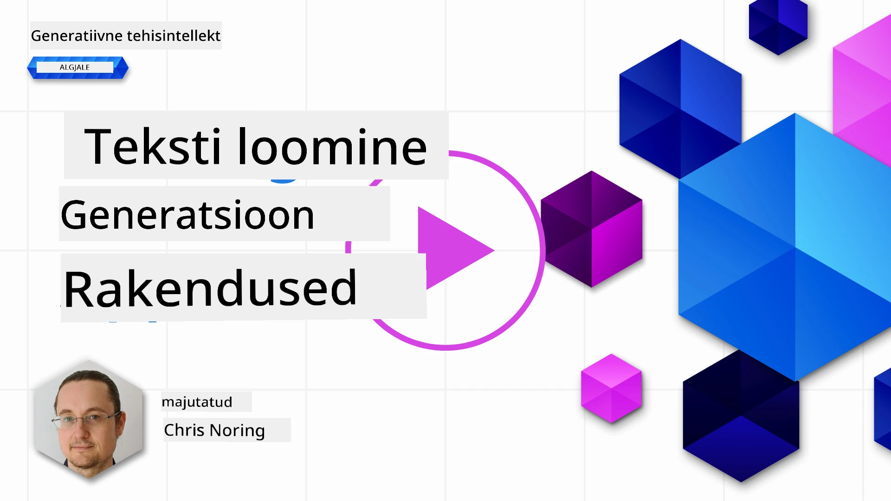

# Teksti genereerimise rakenduste loomine

[](https://youtu.be/0Y5Luf5sRQA?si=t_xVg0clnAI4oUFZ)

> _(Klõpsake ülaloleval pildil videosalvestuse vaatamiseks)_

Sellest õppekavast olete juba näinud, et eksisteerivad põhikontseptsioonid nagu promptid ja isegi kogu distsipliin nimega "promptide inseneriteadus". Paljud tööriistad, millega saate suhelda nagu ChatGPT, Office 365, Microsoft Power Platform ja teised, toetavad teid promptide abil midagi saavutama.

Selleks, et lisada sellist kogemust rakendusse, peate mõistma selliseid kontseptsioone nagu promptid, vastused ja valima teegi, millega töötada. Just seda te selles peatükis õpitegi.

## Sissejuhatus

Selles peatükis õpite:

- Tutvustust openai teegile ja selle põhikontseptsioonidele.
- Teksti genereerimise rakenduse loomist openai abil.
- Kuidas kasutada kontseptsioone nagu prompt, temperatuur ja tokenid teksti genereerimise rakenduse loomiseks.

## Õpieesmärgid

Selle õppetunni lõpus saate:

- Selgitada, mis on teksti genereerimise rakendus.
- Luua teksti genereerimise rakenduse openai abil.
- Seadistada oma rakendus kasutama rohkem või vähem tokeneid ning muuta ka temperatuuri, et saada erinevat väljundit.

## Mis on teksti genereerimise rakendus?

Tavaliselt, kui loote rakendust, on tal mingi liides, näiteks järgmine:

- Käskluspõhine. Konsoolirakendused on tüüpilised rakendused, kus sisestate käsu ja see täidab ülesande. Näiteks `git` on käskluspõhine rakendus.
- Kasutajaliides (UI). Mõnel rakendusel on graafilised kasutajaliidesed (GUI), kus klõpsate nuppe, sisestate teksti, valite valikuid jne.

### Konsooli- ja UI-rakendused on piiratud

Võrrelge seda käskluspõhise rakendusega, kus sisestate käsu:

- **See on piiratud**. Te ei saa lihtsalt sisestada mistahes käsku, vaid ainult neid, mida rakendus toetab.
- **Keelepõhine**. Mõned rakendused toetavad mitut keelt, kuid vaikimisi on rakendus loodud konkreetseks keeleks, isegi kui saate lisada rohkem keele tuge.

### Teksti genereerimise rakenduste eelised

Mis siis teeb teksti genereerimise rakenduse erinevaks?

Teksti genereerimise rakenduses on teil rohkem paindlikkust, te ei ole piiratud etteantud käskude või kindla sisendkeelega. Selle asemel saate kasutada loomulikku keelt rakendusega suhtlemiseks. Teine eelis on see, et te juba suhtlete andmeallikaga, mis on treenitud tohutul hulgal teavet, samas kui traditsiooniline rakendus võib olla piiratud andmebaasis oleva info järgi.

### Mida saab teksti genereerimise rakendusega teha?

On palju asju, mida saab teha. Näiteks:

- **Vestlusrobot**. Vestlusrobot, mis vastab küsimustele teemade kohta nagu teie ettevõte ja selle tooted, võiks olla hea sobivus.
- **Abiline**. Suured keelmodelid on head sellistes ülesannetes nagu teksti kokkuvõtete tegemine, tekstist teadmiste saamine, teksti tootmine nagu CV-d ja palju muud.
- **Koodiabimees**. Sõltuvalt kasutatavast keelemudelist saate luua koodiabimehe, mis aitab teil koodi kirjutada. Näiteks võite kasutada GitHub Copilot'i või ChatGPT-d, et aidata teil koodi kirjutada.

## Kust alustada?

Peate leidma viisi LLM-i integreerimiseks, mis tavaliselt hõlmab kahte lähenemisviisi:

- Kasutage API-d. Siin koostate veebipäringud oma promptiga ja saate genereeritud teksti tagasi.
- Kasutage teeki. Teegid aitavad kapseldada API kõnesid ja muudavad nende kasutamise lihtsamaks.

## Teegid/SDK-d

On mõned tuntud teegid LLM-idega töötamiseks nagu:

- **openai**, see teek teeb lihtsaks mudeliga ühenduse loomise ja promptide saatmise.

Siis on olemas teegid, mis toimivad kõrgemal tasandil nagu:

- **Langchain**. Langchain on hästi tuntud ja toetab Pythoni.
- **Semantic Kernel**. Semantic Kernel on Microsofti teek, mis toetab keeled C#, Python ja Java.

## Esimene rakendus openai abil

Vaatame, kuidas saame luua oma esimese rakenduse, milliseid teeke vajame, kui palju on vajalik ja nii edasi.

### Paigalda openai

On palju teeke, mis võimaldavad suhelda OpenAI või Azure OpenAI-ga. Võimalik on kasutada mitmeid programmeerimiskeeli nagu C#, Python, JavaScript, Java ja teised. Me valisime kasutada `openai` Pythoni teeki, seega kasutame selle paigaldamiseks `pip`-i.

```bash
pip install openai
```

### Loo ressurss

Peate läbi viima järgmised sammud:

- Loo konto Azure’is [https://azure.microsoft.com/free/](https://azure.microsoft.com/free/?WT.mc_id=academic-105485-koreyst).
- Saa juurdepääs Azure OpenAI-le. Minge lehele [https://learn.microsoft.com/azure/ai-foundry/openai/overview#how-do-i-get-access-to-azure-openai](https://learn.microsoft.com/azure/ai-foundry/openai/overview#how-do-i-get-access-to-azure-openai?WT.mc_id=academic-105485-koreyst) ja taotlege ligipääsu.

  > [!NOTE]
  > Käesoleva kirjutamise ajal peate rakenduma Azure OpenAI juurdepääsuks.

- Paigaldage Python <https://www.python.org/>
- Olete loonud Azure OpenAI teenuse ressursi. Juhend kuidas [luua ressurssi](https://learn.microsoft.com/azure/ai-foundry/openai/how-to/create-resource?pivots=web-portal?WT.mc_id=academic-105485-koreyst) on leitav.

### Leia API võti ja lõpp-punkt

Sel hetkel peate oma `openai` teegile ütlema, millist API võtit kasutada. Oma API võtme leidmiseks minge Azure OpenAI ressursi "Keys and Endpoint" (võtmed ja lõpp-punkt) sektsiooni ja kopeerige "Key 1" väärtus.


Nüüd, kui olete selle info kopeerinud, juhime teegid selle kasutamiseks.

> [!NOTE]
> Tasub eraldada oma API võti koodist. Seda saab teha keskkonnamuutujate abil.
>
> - Määrake keskkonnamuutuja `OPENAI_API_KEY` oma API võtmele.
>   `export OPENAI_API_KEY='sk-...'`

### Seadista konfiguratsioon Azure jaoks

Kui kasutate Azure OpenAI-d (nüüd osa Microsoft Foundry'st), siis nii seadistate konfiguratsiooni. Kasutame standardset `OpenAI` klienti, mis on suunatud Azure OpenAI `/openai/v1/` lõpp-punktile, mis töötab Responses API-ga ja ei vaja `api_version`:

```python
import os
from openai import OpenAI

client = OpenAI(
    api_key=os.environ["AZURE_OPENAI_API_KEY"],
    base_url=f"{os.environ['AZURE_OPENAI_ENDPOINT'].rstrip('/')}/openai/v1/",
)
```

Ülal seadistame järgmisi parameetreid:

- `api_key`, see on teie API võti, mis on leitav Azure Portalist või Microsoft Foundry portaalist.
- `base_url`, see on teie Foundry ressursi lõpp-punkt koos `/openai/v1/` lisandiga. Stabiilne v1 lõpp-punkt töötab nii OpenAI kui Azure OpenAI puhul ilma `api_version` halduseta.

> [!NOTE] > `os.environ` loeb keskkonnamuutujaid. Seda saate kasutada selliste muutujate nagu `AZURE_OPENAI_API_KEY` ja `AZURE_OPENAI_ENDPOINT` lugemiseks. Määrake need keskkonnamuutujad oma terminalis või kasutades teeki nagu `dotenv`.

## Teksti genereerimine

Teksti genereerimise viis on kasutada Responses API-d meetodi `responses.create` kaudu. Näide:

```python
prompt = "Complete the following: Once upon a time there was a"

response = client.responses.create(
    model="gpt-5-mini",  # see on su mudeli juurutamise nimi
    input=prompt,
    store=False,
)
print(response.output_text)
```

Ülaltoodud koodis loome vastuse ja anname mudeli, mida soovime kasutada, ning prompti. Seejärel prindime genereeritud teksti läbi `response.output_text`.

### Mitme-pöördega vestlused

Responses API sobib hästi nii ühe-pöörde teksti genereerimiseks kui ka mitme-pöörde vestlusrobotite jaoks – te annate `input` kaudu sõnumite nimekirja, et koostada vestlus:

```python
from openai import OpenAI

client = OpenAI(api_key="sk-...")

response = client.responses.create(model="gpt-5-mini", input="Hello world", store=False)
print(response.output_text)
```

Selle funktsionaalsuse kohta on rohkem järgmisel peatükil.

## Harjutus – teie esimene teksti genereerimise rakendus

Nüüd, kui õppisime, kuidas seadistada ja konfigureerida openai, on aeg luua oma esimene teksti genereerimise rakendus. Selleks järgige järgmisi samme:

1. Looge virtuaalne keskkond ja paigaldage openai:

   ```bash
   python -m venv venv
   source venv/bin/activate
   pip install openai
   ```

   > [!NOTE]
   > Kui kasutate Windowsi, tippige `venv\Scripts\activate` asemel `source venv/bin/activate`.

   > [!NOTE]
   > Leidke oma Azure OpenAI võti, minnes aadressile [https://portal.azure.com/](https://portal.azure.com/?WT.mc_id=academic-105485-koreyst) ja otsige `Open AI`, valige seejärel `Open AI resource`, siis valige `Keys and Endpoint` ja kopeerige `Key 1` väärtus.

1. Looge _app.py_ fail ja lisage sellele järgmine kood:

   ```python
   import os
   from openai import OpenAI

   client = OpenAI(
       api_key="<replace this value with your Azure OpenAI key>",
       base_url="<endpoint found in Azure Portal>/openai/v1/",
   )
   deployment_name = "<deployment name>"

   # lisa oma lõpetuskood
   prompt = "Complete the following: Once upon a time there was a"

   # tee päring Responses API kaudu
   response = client.responses.create(model=deployment_name, input=prompt, store=False)

   # prindi vastus
   print(response.output_text)
   ```

   > [!NOTE]
   > Kui kasutate tavalist OpenAI-d (mitte Azure), kasutage `client = OpenAI(api_key="<asendage see oma OpenAI võtmega>")` (ilma `base_url`-ta) ja pange mudeli nimeks näiteks `gpt-5-mini` mitte deploymenti nime.

   Te peaksite nägema väljaannet järgmine:

   ```output
    very unhappy _____.

   Once upon a time there was a very unhappy mermaid.
   ```

## Erinevat tüüpi promptid erinevate ülesannete jaoks

Nüüd olete näinud, kuidas teksti genereerida kasutades promti. Teil on nüüd programmi töölepanek, mida saate muuta ja kohandada erinevat tüüpi teksti genereerimiseks.

Promptisid saab kasutada kõikvõimalike ülesannete jaoks. Näiteks:

- **Genereerida teksti tüüpi**. Näiteks saate genereerida luuletuse, viktoriiniküsimusi jne.
- **Otsida infot**. Võite kasutada prompti info otsimiseks nagu näites 'Mida tähendab CORS veebiarenduses?'.
- **Genereerida koodi**. Võite kasutada prompti koodi genereerimiseks, näiteks arendades regulaarexpressiooni e-kirjade valideerimiseks või miks mitte genereerida terve programm, nagu veebirakendus?

## Praktilisem kasutus: retseptide generaator

Kujutage ette, et teil on kodus koostisosad ja soovite midagi süüa teha. Selleks vajate retsepti. Retseptide leidmiseks võite kasutada otsingumootorit või kasutada LLM-i.

Saaksite kirjutada prompti järgmiselt:

> "Näita mulle 5 retsepti roale järgmiste koostisosadega: kana, kartulid ja porgandid. Iga retsepti kohta loetle kõik kasutatud koostisosad."

Selle prompti puhul võite saada vastuseks midagi sellist:

```output
1. Roasted Chicken and Vegetables:
Ingredients:
- 4 chicken thighs
- 2 potatoes, cut into cubes
- 2 carrots, cut into cubes
- 2 tablespoons olive oil
- 2 cloves garlic, minced
- 1 teaspoon dried thyme
- 1 teaspoon dried oregano
- Salt and pepper, to taste

2. Chicken and Potato Stew:
Ingredients:
- 2 tablespoons olive oil
- 1 onion, diced
- 2 cloves garlic, minced
- 2 chicken breasts, cut into cubes
- 2 potatoes, cut into cubes
- 2 carrots, cut into cubes
- 1 teaspoon dried oregano
- 1 teaspoon dried thyme
- 1 cup chicken broth
- Salt and pepper, to taste

3. Chicken and Potato Bake:
Ingredients:
- 2 tablespoons olive oil
- 2 chicken breasts, cut into cubes
- 2 potatoes, cut into cubes
- 2 carrots, cut into cubes
- 1 onion, diced
- 2 cloves garlic, minced
- 1 teaspoon dried oregano
- 1 teaspoon dried thyme
- 1 cup chicken broth
- Salt and pepper, to taste

4. Chicken and Potato Soup:
Ingredients:
- 2 tablespoons olive oil
- 1 onion, diced
- 2 cloves garlic, minced
- 2 chicken breasts, cut into cubes
- 2 potatoes, cut into cubes
- 2 carrots, cut into cubes
- 1 teaspoon dried oregano
- 1 teaspoon dried thyme
- 4 cups chicken broth
- Salt and pepper, to taste

5. Chicken and Potato Hash:
Ingredients:
- 2 tablespoons olive oil
- 2 chicken breasts, cut into cubes
- 2 potatoes, cut into cubes
- 2 carrots, cut into cubes
- 1 onion, diced
- 2 cloves garlic, minced
- 1 teaspoon dried oregano
```

See tulemus on suurepärane, ma tean, mida süüa teha. Sel hetkel võivad kasulikud parandused olla:

- Filterdamine koostisosade järgi, mis mulle ei meeldi või millele olen allergiline.
- Ostunimekirja koostamine juhuks kui mul ei ole kõiki koostisosi kodus.

Ülalmainitud juhtumite jaoks lisame täiendava prompti:

> "Palun eemalda retseptid, mis sisaldavad küüslauku, kuna olen sellele allergiline, ja asenda see millegi muuga. Samuti tee retseptide jaoks ostunimekiri, arvestades, et mul on kodus kana, kartulid ja porgandid."

Nüüd on teil uus tulemus, nimelt:

```output
1. Roasted Chicken and Vegetables:
Ingredients:
- 4 chicken thighs
- 2 potatoes, cut into cubes
- 2 carrots, cut into cubes
- 2 tablespoons olive oil
- 1 teaspoon dried thyme
- 1 teaspoon dried oregano
- Salt and pepper, to taste

2. Chicken and Potato Stew:
Ingredients:
- 2 tablespoons olive oil
- 1 onion, diced
- 2 chicken breasts, cut into cubes
- 2 potatoes, cut into cubes
- 2 carrots, cut into cubes
- 1 teaspoon dried oregano
- 1 teaspoon dried thyme
- 1 cup chicken broth
- Salt and pepper, to taste

3. Chicken and Potato Bake:
Ingredients:
- 2 tablespoons olive oil
- 2 chicken breasts, cut into cubes
- 2 potatoes, cut into cubes
- 2 carrots, cut into cubes
- 1 onion, diced
- 1 teaspoon dried oregano
- 1 teaspoon dried thyme
- 1 cup chicken broth
- Salt and pepper, to taste

4. Chicken and Potato Soup:
Ingredients:
- 2 tablespoons olive oil
- 1 onion, diced
- 2 chicken breasts, cut into cubes
- 2 potatoes, cut into cubes
- 2 carrots, cut into cubes
- 1 teaspoon dried oregano
- 1 teaspoon dried thyme
- 4 cups chicken broth
- Salt and pepper, to taste

5. Chicken and Potato Hash:
Ingredients:
- 2 tablespoons olive oil
- 2 chicken breasts, cut into cubes
- 2 potatoes, cut into cubes
- 2 carrots, cut into cubes
- 1 onion, diced
- 1 teaspoon dried oregano

Shopping List:
- Olive oil
- Onion
- Thyme
- Oregano
- Salt
- Pepper
```

Need on teie viis retsepti ilma küüslauguta ja teil on ostunimekiri, arvestades, mida teil juba kodus on.

## Harjutus – ehitage retseptide generaator

Nüüd, kui mängisime välja stsenaariumi, kirjutame koodi selle vastendamiseks. Selleks järgige järgmisi samme:

1. Kasutage alustamiseks olemasolevat _app.py_ faili
1. Leidke muutuja `prompt` ja muutke selle kood järgmiseks:

   ```python
   prompt = "Show me 5 recipes for a dish with the following ingredients: chicken, potatoes, and carrots. Per recipe, list all the ingredients used"
   ```

   Kui nüüd koodi käivitate, peaksite nägema midagi sellist:

   ```output
   -Chicken Stew with Potatoes and Carrots: 3 tablespoons oil, 1 onion, chopped, 2 cloves garlic, minced, 1 carrot, peeled and chopped, 1 potato, peeled and chopped, 1 bay leaf, 1 thyme sprig, 1/2 teaspoon salt, 1/4 teaspoon black pepper, 1 1/2 cups chicken broth, 1/2 cup dry white wine, 2 tablespoons chopped fresh parsley, 2 tablespoons unsalted butter, 1 1/2 pounds boneless, skinless chicken thighs, cut into 1-inch pieces
   -Oven-Roasted Chicken with Potatoes and Carrots: 3 tablespoons extra-virgin olive oil, 1 tablespoon Dijon mustard, 1 tablespoon chopped fresh rosemary, 1 tablespoon chopped fresh thyme, 4 cloves garlic, minced, 1 1/2 pounds small red potatoes, quartered, 1 1/2 pounds carrots, quartered lengthwise, 1/2 teaspoon salt, 1/4 teaspoon black pepper, 1 (4-pound) whole chicken
   -Chicken, Potato, and Carrot Casserole: cooking spray, 1 large onion, chopped, 2 cloves garlic, minced, 1 carrot, peeled and shredded, 1 potato, peeled and shredded, 1/2 teaspoon dried thyme leaves, 1/4 teaspoon salt, 1/4 teaspoon black pepper, 2 cups fat-free, low-sodium chicken broth, 1 cup frozen peas, 1/4 cup all-purpose flour, 1 cup 2% reduced-fat milk, 1/4 cup grated Parmesan cheese

   -One Pot Chicken and Potato Dinner: 2 tablespoons olive oil, 1 pound boneless, skinless chicken thighs, cut into 1-inch pieces, 1 large onion, chopped, 3 cloves garlic, minced, 1 carrot, peeled and chopped, 1 potato, peeled and chopped, 1 bay leaf, 1 thyme sprig, 1/2 teaspoon salt, 1/4 teaspoon black pepper, 2 cups chicken broth, 1/2 cup dry white wine

   -Chicken, Potato, and Carrot Curry: 1 tablespoon vegetable oil, 1 large onion, chopped, 2 cloves garlic, minced, 1 carrot, peeled and chopped, 1 potato, peeled and chopped, 1 teaspoon ground coriander, 1 teaspoon ground cumin, 1/2 teaspoon ground turmeric, 1/2 teaspoon ground ginger, 1/4 teaspoon cayenne pepper, 2 cups chicken broth, 1/2 cup dry white wine, 1 (15-ounce) can chickpeas, drained and rinsed, 1/2 cup raisins, 1/2 cup chopped fresh cilantro
   ```

   > MÄRKUS, teie LLM on mittedeterministlik, nii et võite saada iga kord programmi käivitamisel erinevaid tulemusi.

   Väga hea, vaatame, kuidas saame asja parandada. Parandamiseks tahame, et kood oleks paindlik, nii et koostisosad ja retseptide arv oleksid muudetavad.

1. Muutkem koodi järgmisel viisil:

   ```python
   no_recipes = input("No of recipes (for example, 5): ")

   ingredients = input("List of ingredients (for example, chicken, potatoes, and carrots): ")

   # interpoleeri retseptide arv koostisosadega prompti
   prompt = f"Show me {no_recipes} recipes for a dish with the following ingredients: {ingredients}. Per recipe, list all the ingredients used"
   ```

   Testkäivituse kood võib välja näha järgmiselt:

   ```output
   No of recipes (for example, 5): 3
   List of ingredients (for example, chicken, potatoes, and carrots): milk,strawberries

   -Strawberry milk shake: milk, strawberries, sugar, vanilla extract, ice cubes
   -Strawberry shortcake: milk, flour, baking powder, sugar, salt, unsalted butter, strawberries, whipped cream
   -Strawberry milk: milk, strawberries, sugar, vanilla extract
   ```

### Paranda, lisades filtri ja ostunimekirja

Meil on nüüd toimiv rakendus, mis suudab toota retsepte ning on paindlik, sest tugineb kasutajalt saadud sisendile, nii retseptide arvu kui ka kasutatavate koostisosade kohta.

Et seda veelgi parandada, soovime lisada järgmist:

- **Filtreerige välja koostisosad**. Soovime suutlikkust välja filterdada koostisosad, mis meile ei meeldi või millele oleme allergilised. Selle saavutamiseks võime muuta oma olemasolevat prompti ja lisada selle lõppu filtritingimuse järgmiselt:

  ```python
  filter = input("Filter (for example, vegetarian, vegan, or gluten-free): ")

  prompt = f"Show me {no_recipes} recipes for a dish with the following ingredients: {ingredients}. Per recipe, list all the ingredients used, no {filter}"
  ```

  Ülal lisame prompti lõppu `{filter}` ja kaame kasutajalt filtreerimise väärtuse.

  Näidis sisend programmi käivitamisel võib nüüd välja näha järgmine:

  ```output
  No of recipes (for example, 5): 3
  List of ingredients (for example, chicken, potatoes, and carrots): onion,milk
  Filter (for example, vegetarian, vegan, or gluten-free): no milk

  1. French Onion Soup

  Ingredients:

  -1 large onion, sliced
  -3 cups beef broth
  -1 cup milk
  -6 slices french bread
  -1/4 cup shredded Parmesan cheese
  -1 tablespoon butter
  -1 teaspoon dried thyme
  -1/4 teaspoon salt
  -1/4 teaspoon black pepper

  Instructions:

  1. In a large pot, sauté onions in butter until golden brown.
  2. Add beef broth, milk, thyme, salt, and pepper. Bring to a boil.
  3. Reduce heat and simmer for 10 minutes.
  4. Place french bread slices on soup bowls.
  5. Ladle soup over bread.
  6. Sprinkle with Parmesan cheese.

  2. Onion and Potato Soup

  Ingredients:

  -1 large onion, chopped
  -2 cups potatoes, diced
  -3 cups vegetable broth
  -1 cup milk
  -1/4 teaspoon black pepper

  Instructions:

  1. In a large pot, sauté onions in butter until golden brown.
  2. Add potatoes, vegetable broth, milk, and pepper. Bring to a boil.
  3. Reduce heat and simmer for 10 minutes.
  4. Serve hot.

  3. Creamy Onion Soup

  Ingredients:

  -1 large onion, chopped
  -3 cups vegetable broth
  -1 cup milk
  -1/4 teaspoon black pepper
  -1/4 cup all-purpose flour
  -1/2 cup shredded Parmesan cheese

  Instructions:

  1. In a large pot, sauté onions in butter until golden brown.
  2. Add vegetable broth, milk, and pepper. Bring to a boil.
  3. Reduce heat and simmer for 10 minutes.
  4. In a small bowl, whisk together flour and Parmesan cheese until smooth.
  5. Add to soup and simmer for an additional 5 minutes, or until soup has thickened.
  ```

  Nagu näha, filtriti välja retseptid, mis sisaldasid piima. Kuid kui olete laktoositalumatu, võiksite filtreerida välja ka juustu sisaldavad retseptid, seega on vaja olla täpne.


- **Koosta ostunimekiri**. Tahame koostada ostunimekirja, arvestades sellega, mis meil kodus juba olemas on.

  Selle funktsionaalsuse jaoks võime proovida kõike lahendada ühe päringuga või jagada see kaheks päringuks. Proovime viimast lähenemist. Siin soovitame lisada täiendava päringu, kuid selle toimimiseks peame esimese päringu tulemi lisama teise päringu kontekstina.

  Leia koodist koht, kus prinditakse esimese päringu tulemus, ja lisa alljärgnev kood alla:

  ```python
  old_prompt_result = response.output_text
  prompt = "Produce a shopping list for the generated recipes and please don't include ingredients that I already have."

  new_prompt = f"{old_prompt_result} {prompt}"
  response = client.responses.create(model=deployment_name, input=new_prompt, max_output_tokens=1200, store=False)

  # trüki vastus
  print("Shopping list:")
  print(response.output_text)
  ```

  Võta arvesse järgmist:

  1. Koostame uue päringu, lisades esimese päringu tulemuse uuele päringule:

     ```python
     new_prompt = f"{old_prompt_result} {prompt}"
     ```

  1. Teeme uue taotluse, arvestades ka esimese päringu tookenite arvu, seega etteantud `max_output_tokens` väärtuseks on seekord 1200.

     ```python
     response = client.responses.create(model=deployment_name, input=new_prompt, max_output_tokens=1200, store=False)
     ```

     Käivitades selle koodi, jõuame nüüd järgmise väljundini:

     ```output
     No of recipes (for example, 5): 2
     List of ingredients (for example, chicken, potatoes, and carrots): apple,flour
     Filter (for example, vegetarian, vegan, or gluten-free): sugar


     -Apple and flour pancakes: 1 cup flour, 1/2 tsp baking powder, 1/2 tsp baking soda, 1/4 tsp salt, 1 tbsp sugar, 1 egg, 1 cup buttermilk or sour milk, 1/4 cup melted butter, 1 Granny Smith apple, peeled and grated
     -Apple fritters: 1-1/2 cups flour, 1 tsp baking powder, 1/4 tsp salt, 1/4 tsp baking soda, 1/4 tsp nutmeg, 1/4 tsp cinnamon, 1/4 tsp allspice, 1/4 cup sugar, 1/4 cup vegetable shortening, 1/4 cup milk, 1 egg, 2 cups shredded, peeled apples
     Shopping list:
     -Flour, baking powder, baking soda, salt, sugar, egg, buttermilk, butter, apple, nutmeg, cinnamon, allspice
     ```

## Täienda oma seadistust

Senine kood töötab, kuid on mõned parandused, mida peaksime tegema, et asju veelgi paremaks muuta. Mõned asjad, mida teha:

- **Eralda salasõnad koodist**, näiteks API võti. Saladused ei kuulu koodi ja peaksid olema hoitud turvalises kohas. Saladuste eraldamiseks koodist võime kasutada keskkonnamuutujaid ja teeke nagu `python-dotenv`, et laadida need failist. Koodis näeks see välja järgmiselt:

  1. Loo `.env` fail järgnevate andmetega:

     ```bash
     OPENAI_API_KEY=sk-...
     ```

     > Märkus: Azure OpenAI Microsoft Foundrys nõuab asemel järgmiste keskkonnamuutujate seadistamist:

     ```bash
     AZURE_OPENAI_API_KEY=<replace>
     AZURE_OPENAI_ENDPOINT=<replace>
     AZURE_OPENAI_API_VERSION=2024-10-21
     ```

     Koodis laed keskkonnamuutujad järgmiselt:

     ```python
     import os
     from dotenv import load_dotenv
     from openai import OpenAI

     load_dotenv()

     client = OpenAI(api_key=os.environ["OPENAI_API_KEY"])
     ```

- **Sõna tokenite pikkusest**. Peaksime arvestama, kui palju tokeneid tekstide genereerimiseks vajame. Tokendamine maksab raha, seega peaksime võimalusel olema tokenite kasutamisel kokkuhoidlikud. Näiteks, kas prompti saab nii sõnastada, et kasutada vähem tokeneid?

  Tokenite arvu muutmiseks võid kasutada `max_output_tokens` parameetrit. Näiteks, kui tahad kasutada 100 tokenit, teeksid järgmiselt:

  ```python
  response = client.responses.create(model=deployment, input=prompt, max_output_tokens=100, store=False)
  ```

- **Katsetamine temperatuuriga**. Temperatuur on midagi, mida me pole seni maininud, kuid see on oluline kontekst programmi käitumise mõistmiseks. Mida kõrgem on temperatuur, seda juhuslikum on väljund. Mida madalam temperatuur, seda ennustatavam väljund on. Mõtle, kas soovid oma väljundis varieeruvust või mitte.

  Temperatuuri muutmiseks võid kasutada `temperature` parameetrit. Näiteks, kui tahad kasutada temperatuuri väärtusega 0.5, teeksid järgmiselt:

  ```python
  response = client.responses.create(model=deployment, input=prompt, temperature=0.5, store=False)
  ```

  > Märkus, mida lähemal väärtus on 1.0, seda varieeruvam on väljund.

- **Põhjendusmudelid ei kasuta `temperature` parameetrit**. See on oluline 2026. aasta muutus. Praegused Microsoft Foundry mitte-vana- jaotusmudelid on **põhjendusmudelid** (GPT-5 perekond, o-seeria) - ja need **ei toeta `temperature` ega `top_p`** (ega ka `max_tokens`; kasuta `max_output_tokens`). Kui saadad `temperature` mudelile `gpt-5-mini`, saad veateate "parameeter ei ole toetatud". Seega, et proovida ülalmainitud temperatuurinäidet, kasuta mudelit, mis toetab veel proovivõtu kontrolle - näiteks avatud **Llama** mudelit nagu `Llama-3.3-70B-Instruct` Microsoft Foundry mudelikataloogist ([link](https://ai.azure.com/catalog/models?WT.mc_id=academic-105485-koreyst)), mida kutsutakse Foundry mudelite / Azure AI inference lõpp-punktist (sarnaselt `githubmodels-*` näidetele). Põhjendusmudelite nagu GPT-5 puhul juhitakse väljundit teistmoodi:
  - **Prompti inseneeria** - selged juhised, näited ja struktureeritud väljund (vt õppetundi [04 - Prompt Engineering](../04-prompt-engineering-fundamentals/README.md?WT.mc_id=academic-105485-koreyst)) täidavad tööd, mida proovivõtu nupud varem tegid.
  - **Põhjendamise juhtimine** - parameetrid nagu põhjenduse pingutus/sõnakasutussagedus vahetavad põhjendamise sügavuse välja arendamise kiiruse ja maksumuse vastu.

  Lühidalt: `temperature`/`top_p` on paljude mudelite puhul endiselt kehtivad (Llama, Mistral, Phi ja GPT-4.x perekond - kuigi GPT-4.x on mahajääv), kuid tulevikusuund on prompti inseneeria + põhjenduse juhtimine põhjendusmudelitel nagu GPT-5.

## Ülesanne

Selle ülesande puhul saad valida, mida ehitada.

Siin on mõned soovitused:

- Paranda retseptide generaatori rakendust veelgi. Mängi temperatuuriväärtustega ja promptidega, et näha, mida suudad luua.
- Ehita "õppekaaslane". See rakendus peaks oskama vastata küsimustele teatud teema kohta, näiteks Python: võid kasutada prompti "Mis on teatud teema Pythonis?", või prompti, mis ütleb "näita mulle koodi teatud teema kohta" jne.
- Ajaloo-bot, too ajalugu ellu, palu bot-il kehastuda kindlaks ajalooliseks tegelaseks ja küsi temalt küsimusi tema elu ja aja kohta.

## Lahendus

### Õppekaaslane

Allpool on stardiprompt, vaata kuidas saad seda kasutada ja enda maitse järgi kohandada.

```text
- "You're an expert on the Python language

    Suggest a beginner lesson for Python in the following format:

    Format:
    - concepts:
    - brief explanation of the lesson:
    - exercise in code with solutions"
```

### Ajaloo-bot

Siin on mõned promptid, mida võid kasutada:

```text
- "You are Abe Lincoln, tell me about yourself in 3 sentences, and respond using grammar and words like Abe would have used"
- "You are Abe Lincoln, respond using grammar and words like Abe would have used:

   Tell me about your greatest accomplishments, in 300 words"
```

## Teadmiste kontroll

Mida teeb mõiste temperatuur?

1. Kontrollib, kui juhuslik väljund on.
1. Kontrollib, kui suur vastus on.
1. Kontrollib, kui palju tokeneid kasutatakse.

## 🚀 Väljakutse

Töötades ülesandega, proovi varieerida temperatuuri, sea see väärtusele 0, 0.5 ja 1. Pea meeles, et 0 on vähe varieeruv ja 1 kõige varieeruvam. Milline väärtus sobib sinu rakendusele kõige paremini?

## Suurepärane töö! Jätka õppimist

Pärast selle õppetunni lõpetamist vaata meie [Generatiivse tehisintellekti õppe kollektsiooni](https://aka.ms/genai-collection?WT.mc_id=academic-105485-koreyst), et oma generatiivse tehisintellekti teadmisi veelgi parandada!

Mine edasi õppetund 7-le, kus vaatleme, kuidas [ehitada vestlusrakendusi](../07-building-chat-applications/README.md?WT.mc_id=academic-105485-koreyst)!

---

<!-- CO-OP TRANSLATOR DISCLAIMER START -->
**Lahtiütlus**:
See dokument on tõlgitud kasutades AI tõlketeenust [Co-op Translator](https://github.com/Azure/co-op-translator). Kuigi me püüdleme täpsuse poole, palun pange tähele, et automatiseeritud tõlgetes võib esineda vigu või ebatäpsusi. Originaaldokument selle emakeeles tuleks pidada autoriteetseks allikaks. Olulise teabe puhul soovitatakse kasutada professionaalset inimtõlget. Me ei vastuta selle tõlkega seotud eksimustest või valesti mõistmistest.
<!-- CO-OP TRANSLATOR DISCLAIMER END -->