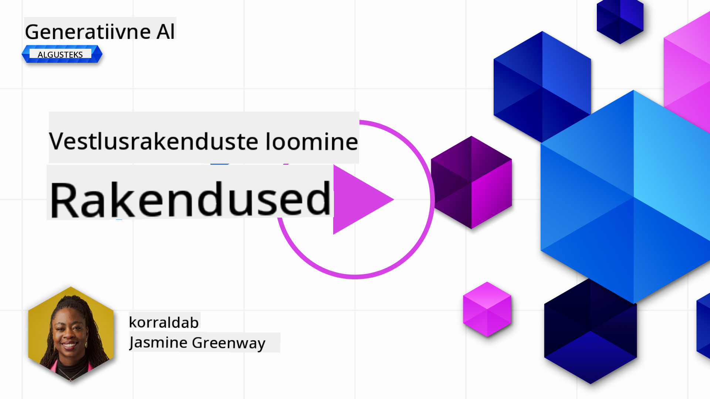
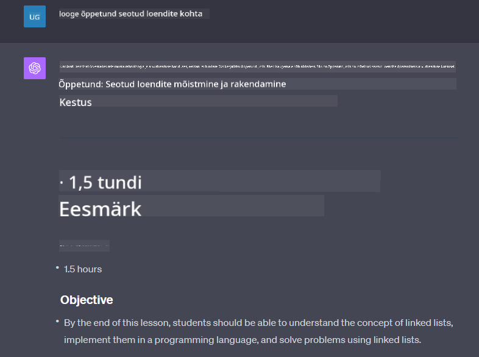

<!--
CO_OP_TRANSLATOR_METADATA:
{
  "original_hash": "a5308963a56cfbad2d73b0fa99fe84b3",
  "translation_date": "2025-10-18T02:55:16+00:00",
  "source_file": "07-building-chat-applications/README.md",
  "language_code": "et"
}
-->
# Generatiivse AI-põhiste vestlusrakenduste loomine

[](https://youtu.be/R9V0ZY1BEQo?si=IHuU-fS9YWT8s4sA)

> _(Klõpsa ülaloleval pildil, et vaadata selle õppetunni videot)_

Nüüd, kui oleme näinud, kuidas luua tekstigeneratsiooni rakendusi, vaatame lähemalt vestlusrakendusi.

Vestlusrakendused on muutunud meie igapäevaelu lahutamatuks osaks, pakkudes rohkemat kui lihtsalt juhuslikku suhtlust. Need on olulised klienditeeninduses, tehnilises toetamises ja isegi keerukates nõustamissüsteemides. Tõenäoliselt olete hiljuti saanud abi mõnest vestlusrakendusest. Kui integreerime nendesse platvormidesse arenenud tehnoloogiaid, nagu generatiivne AI, suureneb nii keerukus kui ka väljakutsed.

Mõned küsimused, millele peame vastused leidma, on:

- **Rakenduse loomine**. Kuidas ehitada ja integreerida tõhusalt neid AI-põhiseid rakendusi konkreetsete kasutusjuhtude jaoks?
- **Jälgimine**. Kuidas tagada, et rakendused töötavad pärast kasutuselevõttu kõrgeima kvaliteediga, nii funktsionaalsuse kui ka [vastutustundliku AI kuue põhimõtte](https://www.microsoft.com/ai/responsible-ai?WT.mc_id=academic-105485-koreyst) järgimise osas?

Kuna liigume edasi ajastusse, mida iseloomustavad automatiseerimine ja sujuvad inimese-masina interaktsioonid, muutub oluliseks mõista, kuidas generatiivne AI muudab vestlusrakenduste ulatust, sügavust ja kohanemisvõimet. See õppetund uurib arhitektuuri aspekte, mis toetavad neid keerukaid süsteeme, süveneb meetoditesse nende kohandamiseks valdkonnapõhiste ülesannete jaoks ning hindab meetrikaid ja kaalutlusi, mis on olulised vastutustundliku AI kasutuselevõtu tagamiseks.

## Sissejuhatus

Selles õppetunnis käsitletakse:

- Tehnikaid vestlusrakenduste tõhusaks loomiseks ja integreerimiseks.
- Kohandamise ja peenhäälestuse rakendamist rakendustes.
- Strateegiaid ja kaalutlusi vestlusrakenduste tõhusaks jälgimiseks.

## Õppeeesmärgid

Selle õppetunni lõpuks suudate:

- Kirjeldada kaalutlusi vestlusrakenduste loomiseks ja integreerimiseks olemasolevatesse süsteemidesse.
- Kohandada vestlusrakendusi konkreetsete kasutusjuhtude jaoks.
- Tuvastada peamisi meetrikaid ja kaalutlusi, et tõhusalt jälgida ja säilitada AI-põhiste vestlusrakenduste kvaliteeti.
- Tagada, et vestlusrakendused kasutavad AI-d vastutustundlikult.

## Generatiivse AI integreerimine vestlusrakendustesse

Vestlusrakenduste täiustamine generatiivse AI abil ei seisne ainult nende nutikamaks muutmises; see hõlmab ka nende arhitektuuri, jõudluse ja kasutajaliidese optimeerimist, et pakkuda kvaliteetset kasutajakogemust. See hõlmab arhitektuuriliste aluste, API integratsioonide ja kasutajaliidese kaalutluste uurimist. See osa pakub teile terviklikku teekaarti nende keerukate maastike navigeerimiseks, olgu siis nende integreerimine olemasolevatesse süsteemidesse või nende ehitamine iseseisvate platvormidena.

Selle osa lõpuks olete varustatud teadmistega vestlusrakenduste tõhusaks loomiseks ja integreerimiseks.

### Vestlusrobot või vestlusrakendus?

Enne kui sukeldume vestlusrakenduste loomisse, võrdleme "vestlusroboteid" ja "AI-põhiseid vestlusrakendusi", mis täidavad erinevaid rolle ja funktsioone. Vestlusroboti peamine eesmärk on automatiseerida konkreetseid vestlusülesandeid, nagu korduma kippuvatele küsimustele vastamine või paketi jälgimine. Seda juhivad tavaliselt reeglipõhine loogika või keerukad AI algoritmid. AI-põhine vestlusrakendus on seevastu palju laiem keskkond, mis on loodud hõlbustama erinevaid digitaalse suhtluse vorme, nagu tekst-, hääl- ja videovestlused inimkasutajate vahel. Selle määravaks omaduseks on generatiivse AI mudeli integreerimine, mis simuleerib nüansirikkaid, inimlikke vestlusi, genereerides vastuseid mitmesuguste sisendite ja kontekstuaalsete vihjete põhjal. Generatiivse AI-põhine vestlusrakendus suudab osaleda avatud domeeni aruteludes, kohaneda muutuvate vestluskontekstidega ja isegi luua loomingulisi või keerukaid dialooge.

Allolev tabel toob välja peamised erinevused ja sarnasused, et aidata meil mõista nende ainulaadseid rolle digitaalses suhtluses.

| Vestlusrobot                        | Generatiivse AI-põhine vestlusrakendus |
| ----------------------------------- | ------------------------------------- |
| Ülesandekeskne ja reeglipõhine      | Kontekstitundlik                      |
| Sageli integreeritud suurematesse süsteemidesse | Võib majutada ühte või mitut vestlusrobotit |
| Piirdub programmeeritud funktsioonidega | Sisaldab generatiivseid AI mudeleid   |
| Spetsialiseeritud ja struktureeritud suhtlus | Võimeline avatud domeeni aruteludeks |

### Eelvalmistatud funktsioonide kasutamine SDK-de ja API-de abil

Vestlusrakenduse loomisel on suurepärane esimene samm hinnata, mis juba olemas on. SDK-de ja API-de kasutamine vestlusrakenduste loomiseks on mitmel põhjusel kasulik strateegia. Hästi dokumenteeritud SDK-de ja API-de integreerimisega positsioneerite oma rakenduse strateegiliselt pikaajalise edu saavutamiseks, lahendades mastaapsuse ja hooldusega seotud probleeme.

- **Kiirendab arendusprotsessi ja vähendab kulusid**: Tuginedes eelvalmistatud funktsioonidele, mitte kulukale protsessile nende ise ehitamisel, saate keskenduda oma rakenduse teistele aspektidele, mida peate olulisemaks, näiteks äriloogikale.
- **Parem jõudlus**: Funktsionaalsuse nullist ehitamisel küsite endalt lõpuks: "Kuidas see skaleerub? Kas see rakendus suudab toime tulla äkilise kasutajate sissevooluga?" Hästi hooldatud SDK-d ja API-d sisaldavad sageli lahendusi nendele probleemidele.
- **Lihtsam hooldus**: Uuendusi ja täiustusi on lihtsam hallata, kuna enamik API-sid ja SDK-sid nõuavad lihtsalt teegi uuendamist, kui ilmub uuem versioon.
- **Juurdepääs tipptasemel tehnoloogiale**: Mudelite kasutamine, mis on peenhäälestatud ja treenitud ulatuslike andmekogumite põhjal, annab teie rakendusele loomuliku keele võimekuse.

SDK või API funktsionaalsusele juurdepääs hõlmab tavaliselt loa saamist pakutavate teenuste kasutamiseks, mis toimub sageli unikaalse võtme või autentimistunnuse kaudu. Kasutame OpenAI Python Library't, et uurida, kuidas see välja näeb. Võite seda ise proovida järgmises [OpenAI märkmikus](./python/oai-assignment.ipynb?WT.mc_id=academic-105485-koreyst) või [Azure OpenAI Services märkmikus](./python/aoai-assignment.ipynb?WT.mc_id=academic-105485-koreys) selle õppetunni jaoks.

```python
import os
from openai import OpenAI

API_KEY = os.getenv("OPENAI_API_KEY","")

client = OpenAI(
    api_key=API_KEY
    )

chat_completion = client.chat.completions.create(model="gpt-3.5-turbo", messages=[{"role": "user", "content": "Suggest two titles for an instructional lesson on chat applications for generative AI."}])
```

Ülaltoodud näide kasutab GPT-3.5 Turbo mudelit, et täita käsk, kuid märkige, et API võti määratakse enne seda. Kui te võtit ei määraks, saaksite vea.

## Kasutajakogemus (UX)

Üldised UX-põhimõtted kehtivad vestlusrakenduste puhul, kuid siin on mõned täiendavad kaalutlused, mis muutuvad eriti oluliseks masinõppe komponentide tõttu.

- **Ebaselguse lahendamise mehhanism**: Generatiivsed AI mudelid genereerivad aeg-ajalt ebaselgeid vastuseid. Funktsioon, mis võimaldab kasutajatel selgitust küsida, võib olla kasulik, kui nad selle probleemiga kokku puutuvad.
- **Konteksti säilitamine**: Täiustatud generatiivsed AI mudelid suudavad vestluse konteksti meeles pidada, mis võib olla kasutajakogemuse jaoks vajalik eelis. Kasutajatele võimaluse andmine konteksti kontrollimiseks ja haldamiseks parandab kasutajakogemust, kuid toob kaasa riski säilitada tundlikku kasutajainfot. Kaalutlused selle kohta, kui kaua seda teavet säilitatakse, näiteks säilitamispoliitika kehtestamine, võivad tasakaalustada konteksti vajadust privaatsuse vastu.
- **Personaliseerimine**: AI mudelitel on võime õppida ja kohaneda, pakkudes kasutajale individuaalset kogemust. Kasutajakogemuse kohandamine selliste funktsioonide kaudu nagu kasutajaprofiilid mitte ainult ei anna kasutajale tunnet, et teda mõistetakse, vaid aitab tal leida konkreetseid vastuseid, luues tõhusama ja rahuldustpakkuvama suhtluse.

Üks selline personaliseerimise näide on OpenAI ChatGPT "Kohandatud juhiste" seaded. See võimaldab teil anda teavet enda kohta, mis võib olla teie käskude jaoks oluline kontekst. Siin on näide kohandatud juhistest.


See "profiil" palub ChatGPT-l koostada õppetund lingitud loendite kohta. Märkige, et ChatGPT arvestab, et kasutaja võib soovida põhjalikumat õppetundi, lähtudes tema kogemustest.



### Microsofti süsteemisõnumite raamistik suurte keelemudelite jaoks

[Microsoft on pakkunud juhiseid](https://learn.microsoft.com/azure/ai-services/openai/concepts/system-message#define-the-models-output-format?WT.mc_id=academic-105485-koreyst) tõhusate süsteemisõnumite kirjutamiseks LLM-idelt vastuste genereerimisel, jagades need neljaks valdkonnaks:

1. Määratlege, kellele mudel on mõeldud, samuti selle võimekused ja piirangud.
2. Määratlege mudeli väljundi formaat.
3. Esitage konkreetseid näiteid, mis demonstreerivad mudeli soovitud käitumist.
4. Esitage täiendavaid käitumispiiranguid.

### Juurdepääsetavus

Olgu kasutajal nägemis-, kuulmis-, motoorika- või kognitiivsed häired, hästi kujundatud vestlusrakendus peaks olema kõigile kasutatav. Järgmine loetelu jagab konkreetseid funktsioone, mille eesmärk on parandada juurdepääsetavust erinevate kasutajate vajaduste jaoks.

- **Funktsioonid nägemispuudega kasutajatele**: Kõrge kontrastsusega teemad ja muudetava suurusega tekst, ekraanilugeja ühilduvus.
- **Funktsioonid kuulmispuudega kasutajatele**: Teksti kõneks ja kõne tekstiks funktsioonid, visuaalsed vihjed heliteavituste jaoks.
- **Funktsioonid motoorikahäiretega kasutajatele**: Klaviatuuri navigatsiooni tugi, häälkäsklused.
- **Funktsioonid kognitiivsete häiretega kasutajatele**: Lihtsustatud keelevalikud.

## Kohandamine ja peenhäälestus valdkonnapõhiste keelemudelite jaoks

Kujutage ette vestlusrakendust, mis mõistab teie ettevõtte erialatermineid ja ennustab kasutajate tavapäraseid päringuid. Siin on kaks lähenemisviisi, mida tasub mainida:

- **DSL-mudelite kasutamine**. DSL tähistab valdkonnapõhist keelt. Võite kasutada nn DSL-mudelit, mis on treenitud konkreetse valdkonna mõistmiseks ja selle kontseptsioonide käsitlemiseks.
- **Peenhäälestuse rakendamine**. Peenhäälestus on protsess, kus teie mudelit treenitakse täiendavalt konkreetsete andmetega.

## Kohandamine: DSL-i kasutamine

Valdkonnapõhiste keelemudelite (DSL-mudelite) kasutamine võib parandada kasutajate kaasatust, pakkudes spetsialiseeritud ja kontekstuaalselt asjakohaseid interaktsioone. See on mudel, mis on treenitud või peenhäälestatud, et mõista ja genereerida teksti, mis on seotud konkreetse valdkonna, tööstuse või teemaga. DSL-mudeli kasutamise võimalused võivad varieeruda selle nullist treenimisest kuni olemasolevate mudelite kasutamiseni SDK-de ja API-de kaudu. Teine võimalus on peenhäälestus, mis hõlmab olemasoleva eeltreenitud mudeli kohandamist konkreetse valdkonna jaoks.

## Kohandamine: Peenhäälestuse rakendamine

Peenhäälestust kaalutakse sageli siis, kui eeltreenitud mudel jääb erialases valdkonnas või konkreetse ülesande täitmisel alla.

Näiteks meditsiinilised päringud on keerulised ja nõuavad palju konteksti. Kui meditsiinitöötaja diagnoosib patsienti, tugineb ta mitmesugustele teguritele, nagu elustiil või olemasolevad haigusseisundid, ja võib isegi toetuda hiljutistele meditsiinilistele artiklitele, et oma diagnoosi kinnitada. Sellistes nüansirikastes olukordades ei saa üldotstarbeline AI vestlusrakendus olla usaldusväärne allikas.

### Näide: meditsiiniline rakendus

Mõelge vestlusrakendusele, mis on loodud meditsiinitöötajate abistamiseks, pakkudes kiiret viidet ravijuhistele, ravimite koostoimetele või hiljutistele teadusuuringutele.

Üldotstarbeline mudel võib olla piisav, et vastata põhilistele meditsiinilistele küsimustele või anda üldist nõu, kuid see võib hätta jääda järgmistes olukordades:

- **Väga spetsiifilised või keerulised juhtumid**. Näiteks võib neuroloog küsida rakenduselt: "Millised on praegused parimad tavad ravimiresistentse epilepsia juhtimiseks lastel?"
- **Viimaste edusammude puudumine**. Üldotstarbeline mudel võib raskustega anda praegust vastust, mis sisaldab neuroloogia ja farmakoloogia viimaseid edusamme.

Sellistel juhtudel võib mudeli peenhäälestamine spetsialiseeritud meditsiinilise andmekogumiga oluliselt parandada selle võimet käsitleda neid keerukaid meditsiinilisi päringuid täpsemalt ja usaldusväärsemalt. See nõuab juurdepääsu suurele ja asjakohasele andmekogumile, mis esindab valdkonnapõhiseid väljakutseid ja küsimusi, mida tuleb lahendada.

## Kaalutlused kvaliteetse AI-põhise vestluskogemuse jaoks

Selles osas tuuakse välja "kvaliteetsete" vestlusrakenduste kriteeriumid, mis hõlmavad tegevusvõimeliste meetrikate kogumist ja raamistiku järgimist, mis kasutab AI tehnoloogiat vastutustundlikult.

### Põhimõõdikud

Rakenduse kõrgekvaliteedilise toimivuse säilitamiseks on oluline jälgida põhimõõdikuid ja kaalutlusi. Need mõõtmised mitte ainult ei taga rakenduse funktsionaalsust, vaid hindavad ka AI mudeli ja kasutajakogemuse kvaliteeti. Allpool on loetelu, mis hõlmab põhilisi, AI ja kasutajakogemuse mõõdikuid, mida arvestada.

| Mõõdik                        | Definitsioon                                                                                                             | Kaalutlused vestlusrakenduse arendajale                                   |
| ----------------------------- | ---------------------------------------------------------------------------------------------------------------------- | ------------------------------------------------------------------------- |
| **Tööaeg**                    | Mõõdab aega, mil rakendus on kasutajatele operatiivne ja kättesaadav.                                                     | Kuidas minimeerida seisakuid?                                             |
| **Reaktsiooniaeg**             | Aeg, mis kulub rakendusel kasutaja päringule vastamiseks.                                                                | Kuidas optimeerida päringute töötlemist, et parandada reaktsiooniaega
| **Anomaaliate tuvastamine**   | Tööriistad ja tehnikad ebatavaliste mustrite tuvastamiseks, mis ei vasta oodatud käitumisele.                          | Kuidas reageerid anomaaliatele?                                             |

### Vastutustundliku tehisintellekti praktikate rakendamine vestlusrakendustes

Microsofti lähenemine vastutustundlikule tehisintellektile on tuvastanud kuus põhimõtet, mis peaksid suunama tehisintellekti arendamist ja kasutamist. Allpool on toodud põhimõtted, nende definitsioonid ning asjad, mida vestlusrakenduse arendaja peaks arvesse võtma ja miks neid tõsiselt võtta.

| Põhimõtted             | Microsofti definitsioon                               | Vestlusrakenduse arendaja kaalutlused                                   | Miks see on oluline                                                                     |
| ---------------------- | ----------------------------------------------------- | ---------------------------------------------------------------------- | -------------------------------------------------------------------------------------- |
| Õiglus                 | Tehisintellekti süsteemid peaksid kohtlema kõiki inimesi õiglaselt. | Veendu, et vestlusrakendus ei diskrimineeri kasutajaandmete põhjal.    | Usalduse ja kaasatuse loomiseks kasutajate seas; väldib õiguslikke tagajärgi.          |
| Usaldusväärsus ja ohutus | Tehisintellekti süsteemid peaksid toimima usaldusväärselt ja ohutult. | Rakenda testimist ja turvameetmeid, et vähendada vigu ja riske.        | Tagab kasutajate rahulolu ja väldib potentsiaalset kahju.                              |
| Privaatsus ja turvalisus | Tehisintellekti süsteemid peaksid olema turvalised ja austama privaatsust. | Rakenda tugevat krüpteerimist ja andmekaitsemeetmeid.                  | Kaitseb tundlikke kasutajaandmeid ja vastab privaatsusseadustele.                      |
| Kaasatus               | Tehisintellekti süsteemid peaksid andma kõigile võimaluse ja kaasama inimesi. | Kujunda kasutajaliides, mis on ligipääsetav ja lihtne kasutada erinevatele sihtrühmadele. | Tagab, et laiem valik inimesi saab rakendust tõhusalt kasutada.                        |
| Läbipaistvus           | Tehisintellekti süsteemid peaksid olema arusaadavad.  | Paku selget dokumentatsiooni ja põhjendusi tehisintellekti vastuste kohta. | Kasutajad usaldavad süsteemi rohkem, kui nad mõistavad, kuidas otsuseid tehakse.       |
| Vastutus               | Inimesed peaksid olema tehisintellekti süsteemide eest vastutavad. | Loo selge protsess tehisintellekti otsuste auditeerimiseks ja parandamiseks. | Võimaldab pidevat täiustamist ja parandusmeetmeid vigade korral.                       |

## Ülesanne

Vaata [ülesannet](../../../07-building-chat-applications/python). See viib sind läbi mitmete harjutuste, alates esimestest vestluskäskudest kuni teksti klassifitseerimise ja kokkuvõtete tegemiseni. Pane tähele, et ülesanded on saadaval erinevates programmeerimiskeeltes!

## Suurepärane töö! Jätka teekonda

Pärast selle õppetunni lõpetamist tutvu meie [Generatiivse tehisintellekti õppekollektsiooniga](https://aka.ms/genai-collection?WT.mc_id=academic-105485-koreyst), et jätkata oma generatiivse tehisintellekti teadmiste arendamist!

Liigu edasi 8. õppetundi, et näha, kuidas alustada [otsingurakenduste loomist](../08-building-search-applications/README.md?WT.mc_id=academic-105485-koreyst)!

---

**Lahtiütlus**:  
See dokument on tõlgitud AI tõlketeenuse [Co-op Translator](https://github.com/Azure/co-op-translator) abil. Kuigi püüame tagada täpsust, palun arvestage, et automaatsed tõlked võivad sisaldada vigu või ebatäpsusi. Algne dokument selle algses keeles tuleks pidada autoriteetseks allikaks. Olulise teabe puhul on soovitatav kasutada professionaalset inimtõlget. Me ei vastuta selle tõlke kasutamisest tulenevate arusaamatuste või valesti tõlgenduste eest.