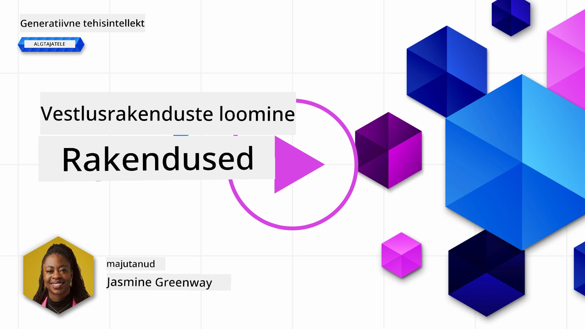
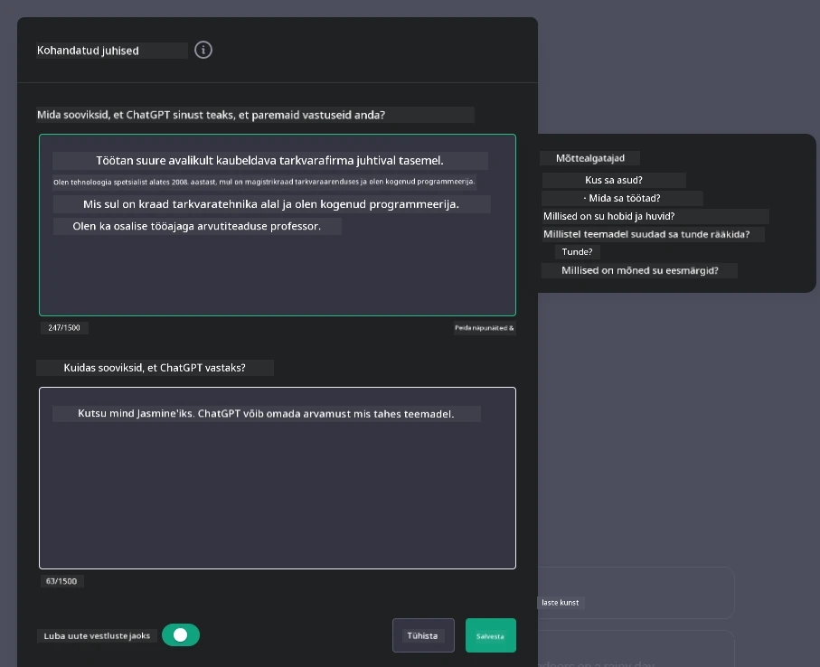
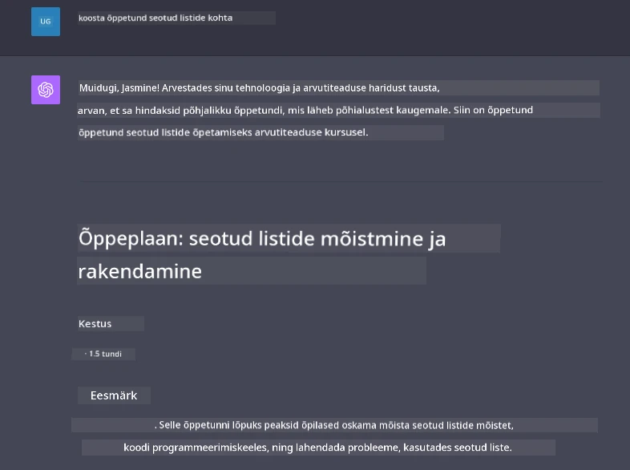

# Generatiivsel tehisintellektil põhinevate vestlusrakenduste loomine

[](https://youtu.be/R9V0ZY1BEQo?si=IHuU-fS9YWT8s4sA)

> _(Klõpsake ülaltoodud pildil, et vaadata selle õppetunni videot)_

Nüüd, kui oleme näinud, kuidas saame luua tekstigeneratsiooni rakendusi, vaatame vestlusrakendusi.

Vestlusrakendused on saanud meie igapäevaelu lahutamatuks osaks, pakkudes enam kui lihtsalt juhuslikku vestlemisviisi. Need on olulised osad klienditeeninduses, tehnilises toetus ning isegi keerukates nõustamissüsteemides. On tõenäoline, et olete hiljuti saanud abi vestlusrakendusest. Kui integreerime neisse platvormidesse edasijõudnud tehnoloogiaid, nagu generatiivne tehisintellekt, suureneb nii keerukus kui ka väljakutsed.

Mõned küsimused, millele peame vastuseid leidma, on:

- **Rakenduse ehitamine**. Kuidas ehitada tõhusalt ning sujuvalt integreerida neid tehisintellektil põhinevaid rakendusi konkreetseteks kasutusjuhtudeks?
- **Jälgimine**. Kui rakendused on kasutusele võetud, kuidas võime neid jälgida ja tagada, et need töötavad kõrgeima kvaliteediga nii funktsionaalsuse kui ka [vastutustundliku AI kuue põhimõtte](https://www.microsoft.com/ai/responsible-ai?WT.mc_id=academic-105485-koreyst) järgimise mõttes?

Liikudes edasi automatiseerimise ja sujuva inim-masin suhtluse ajastusse, muutub generatiivse AI mõju vestlusrakenduste ulatusele, sügavusele ja kohanemisvõimele oluliseks mõistmiseks. See õppetund uurib arhitektuuripõhimõtteid, mis toetavad neid keerukaid süsteeme, süveneb valdkonnapõhiste ülesannete peenhäälestusmetoodikatesse ning hindab mõõdikuid ja kaalutlusi, mis on olulised vastutustundliku AI kasutuse kindlustamiseks.

## Sissejuhatus

See õppetund käsitleb:

- Vestlusrakenduste tõhusa ehitamise ja integreerimise tehnikad.
- Kuidas rakendustele kohandamist ja peenhäälestamist rakendada.
- Strateegiad ja kaalutlused vestlusrakenduste tõhusaks jälgimiseks.

## Õpieesmärgid

Selle õppetunni lõpuks suudate:

- Kirjeldada kaalutlusi vestlusrakenduste ehitamisel ja olemasolevatesse süsteemidesse integreerimisel.
- Kohandada vestlusrakendusi konkreetseteks kasutusjuhtudeks.
- Tuvastada võtmemõõdikud ja kaalutlused AI-põhiste vestlusrakenduste kvaliteedi tõhusaks jälgimiseks ja hoolduseks.
- Tagada, et vestlusrakendused kasutavad AI-d vastutustundlikult.

## Generatiivse AI integreerimine vestlusrakendustesse

Vestlusrakenduste täiustamine generatiivse AI abil ei keskendu ainult nende nutikuse suurendamisele; see hõlmab ka arhitektuuri, jõudluse ja kasutajaliidese optimeerimist kvaliteetse kasutajakogemuse pakkumiseks. See hõlmab arhitektuuriliste aluste, API integratsioonide ja kasutajaliidese kaalutluste uurimist. See osa pakub teile põhjalikku teekaarti nende keeruliste maastike läbitöötamiseks, olenemata sellest, kas ühendate need olemasolevate süsteemidega või ehitate need iseseisvaks platvormiks.

Selle osa lõpuks olete varustatud oskustega vestlusrakenduste tõhusaks ehitamiseks ja integreerimiseks.

### Chatbot või vestlusrakendus?

Enne vestlusrakenduste loomise sukeldumist võrdleme 'chatbot'e ja 'AI-põhiseid vestlusrakendusi', millel on erinevad rollid ja funktsioonid. Chatboti peamine eesmärk on automatiseerida konkreetseid vestlustoiminguid, nagu korduma kippuvatele küsimustele vastamine või paki jälgimine. Tavaliselt juhindub see reeglitel põhinevast loogikast või keerukatest AI algoritmidest. Seevastu AI-põhine vestlusrakendus on palju laiem keskkond, mis võimaldab erinevaid digitaalseid suhtlusviise, nagu tekst, hääl ja videovestlused inimkasutajate vahel. Selle määrav tunnusjoon on generatiivse AI mudeli integreerimine, mis simuleerib nüansirohkeid, inimlaadseid vestlusi, luues vastuseid mitmesuguste sisendite ja kontekstuaalsete vihjete põhjal. Generatiivsel AI-l põhinev vestlusrakendus võib osaleda avatud valdkonna aruteludes, kohaneda arenevate vestluskontekstidega ja isegi toota loomingulist või keerukat dialoogi.

Alljärgnev tabel toob välja peamised erinevused ja sarnasused, mis aitavad mõista nende ainulaadseid rolle digitaalses suhtluses.

| Chatbot                               | Generatiivsel tehisintellektil põhinev vestlusrakendus  |
| ------------------------------------- | -------------------------------------- |
| Ülesandekeskne ja reeglil põhinev           | Kontekstiteadlik                          |
| Sageli integreeritud suuremate süsteemidega  | Võib majutada ühte või mitut chatbot'i      |
| Piiratud programmeeritud funktsioonidega       | Hõlmab generatiivseid AI mudeleid      |
| Spetsialiseeritud ja struktureeritud suhtlused | Võimeline avatud valdkonna aruteludeks     |

### Eelnevalt ehitatud funktsioonide kasutamine SDK-de ja API-de abil

Vestlusrakendust luues on mõistlik alustada juba olemasolevate võimaluste hindamisest. SDK-de ja API-de kasutamine vestlusrakenduste ehitamiseks on mitmel põhjusel kasulik strateegia. Hästi dokumenteeritud SDK-de ja API-de integreerimisega paigutate oma rakenduse strateegiliselt pikaajaliseks eduks, lahendades skaleeritavuse ja hooldusprobleemid.

- **Kiirendab arenduse protsessi ja vähendab koormust**: Eelnevalt ehitatud funktsioonide kasutamine, selle asemel et neid kulukalt ise ehitada, võimaldab teil keskenduda teistele rakenduse aspektidele, mida peate olulisemaks, näiteks äriloogikale.
- **Parem jõudlus**: Funktsionaalsuse loomisel nullist küsime lõpuks: "Kuidas see skaleerub? Kas see rakendus suudab hakkama saada ootamatult suurenenud kasutajate hulgaga?" Korralikult hooldatud SDK-del ja API-del on sageli sisseehitatud lahendused nendele küsimustele.
- **Kergem hooldus**: Uuendusi ja parandusi on lihtsam hallata, kuna enamik API-sid ja SDK-sid nõuavad lihtsalt teegiversiooni uuendamist, kui ilmub uuem versioon.
- **Juurdepääs tipptasemel tehnoloogiale**: Peenhäälestatud ja suurel andmekogupil põhinevate mudelite kasutamine annab teie rakendusele loomuliku keele töötlemise võimed.

SDK või API funktsionaalsuse kasutamiseks on tavaliselt vaja saada õigused pakutavate teenuste kasutamiseks, mis toimub sageli ainulaadse võtme või autentimistokeni abil. Kasutame OpenAI Python'i teeki, et uurida, kuidas see välja näeb. Võite proovida ise järgmistes [OpenAI märkmikus](./python/oai-assignment.ipynb?WT.mc_id=academic-105485-koreyst) või [Azure OpenAI teenuste märkmikus](./python/aoai-assignment.ipynb?WT.mc_id=academic-105485-koreys) selle õppetunni jaoks.

```python
import os
from openai import OpenAI

API_KEY = os.getenv("OPENAI_API_KEY","")

client = OpenAI(
    api_key=API_KEY
    )

response = client.responses.create(model="gpt-4o-mini", input="Suggest two titles for an instructional lesson on chat applications for generative AI.", store=False)
print(response.output_text)
```

Ülaltoodud näites kasutatakse GPT-4o mini mudelit koos Responses API-ga prompti täitmiseks, kuid märkige, et API võti on enne seda seatud. Kui te võtme ei seadistaks, saaksite veateate.

## Kasutajakogemus (UX)

Üldised UX põhimõtted kehtivad vestlusrakenduste puhul, kuid siin on mõned täiendavad kaalutlused, mis muutuvad eriti oluliseks masinõppe komponentide kaasamisel.

- **Ebamäärasuse käsitlemise mehhanism**: Generatiivsed AI-mudelid genereerivad mõnikord ebamääraseid vastuseid. Funktsioon, mis võimaldab kasutajatel selgitust küsida, võib abi olla, kui nad sellele probleemile satuvad.
- **Konteksti säilitamine**: Arenenud generatiivsetel AI-mudelitel on võime vestluses konteksti meeles pidada, mis võib olla vajalik kasutajakogemuse jaoks. Kasutajatele võimalus konteksti kontrollida ja hallata parandab kasutajakogemust, kuid tekitab riski tundliku kasutajateabe säilitamiseks. Kaalutlused selle kohta, kui kaua seda teavet hoitakse, näiteks säilitamispoliitika kehtestamine, võivad tasakaalustada konteksti vajadust privaatsusega.
- **Personalisatsioon**: Võime õppida ja kohanduda pakub AI mudelitel individuaalset kogemust kasutajale. Kasutajakogemuse isikupärastamine näiteks kasutajaprofiilide kaudu annab kasutajale tundmise, et teda mõistetakse, ning aitab tal leida spetsiifilisi vastuseid, luues sujuvama ja rahuldustpakkuvama suhtluse.

Üks näide personalisatsioonist on OpenAI ChatGPT "Kohandatud juhised" seadistus, mis võimaldab teil anda teavet iseenda kohta, mis võib olla teie promptide jaoks oluline kontekst. Siin on näide kohandatud juhisest.



See "profiil" palub ChatGPT-l luua õppetunni plaani lingitud listide kohta. Märkige, et ChatGPT võtab arvesse, et kasutaja võib oma kogemuse põhjal soovida põhjalikumat õppetunni plaani.



### Microsofti süsteemsõnumiraamistik suurte keelemudelite jaoks

[Microsoft on pakkunud juhiseid](https://learn.microsoft.com/azure/ai-services/openai/concepts/system-message#define-the-models-output-format?WT.mc_id=academic-105485-koreyst) tõhusate süsteemsõnumite kirjutamiseks LLM-idelt vastuste saamisel, mis on jagatud neljaks valdkonnaks:

1. Määratleda, kelle jaoks mudel on ning selle võimed ja piirangud.
2. Määratleda mudeli väljundvorming.
3. Pakkuda konkreetseid näiteid, mis demonstreerivad mudeli kavandatud käitumist.
4. Pakkuda täiendavaid käitumisalaga turvapiire.

### Juurdepääsetavus

Olenemata sellest, kas kasutajal on nägemis-, kuulmis-, motoorne või kognitiivne puudega, peab hästi kujundatud vestlusrakendus olema kõigile kasutatav. Järgmine nimekiri toob välja konkreetseid funktsioone, mis on suunatud erinevate kasutajate puuete juurdepääsetavuse parandamiseks.

- **Visuaalse puude funktsioonid**: Kõrge kontrastiga teemad ja suurendatav tekst, ekraanilugerite ühilduvus.
- **Kuulmispuudega funktsioonid**: Tekst kõneks ja kõne tekstiks funktsioonid, heliteavituste visuaalsed märgid.
- **Motoorse puude funktsioonid**: Klaviatuuriga navigeerimise tugi, häälkäsklused.
- **Kognitiivse puude funktsioonid**: Lihtsustatud keelevalikud.

## Kohandamine ja peenhäälestus valdkonnapõhiste keelemudelite jaoks

Kujutage ette vestlusrakendust, mis mõistab teie ettevõtte žargooni ja oskab ette näha kasutajaskonna sagedased spetsiifilised päringud. On paar väärt lähenemist:

- **DSL mudelite kasutamine**. DSL tähistab valdkonnapõhist keelt. Võite kasutada nii-öelda DSL mudelit, mis on treenitud mõistma konkreetse valdkonna kontseptsioone ja stsenaariume.
- **Peenhäälestuse rakendamine**. Peenhäälestus on protsess, kus oma mudelit täiendavalt treenitakse spetsiifiliste andmetega.

## Kohandamine: DSL kasutamine

Valdkonnapõhiste keelemudelite (DSL mudelid) kasutamine võib suurendada kasutajate kaasatust, pakkudes spetsialiseeritud, kontekstuaalselt asjakohaseid suhtlusi. See on mudel, mis on treenitud või peenhäälestatud mõistma ja looma teksti, mis on seotud konkreetse valdkonna, tööstusharu või teadmistevaldkonnaga. DSL mudeli kasutamise võimalused varieeruvad nullist treenimisest kuni olemasolevate kasutamiseni SDK-de ja API-de kaudu. Teine võimalus on peenhäälestus, mis seisneb olemasoleva eeltreenitud mudeli kohandamises konkreetse valdkonna jaoks.

## Kohandamine: Peenhäälestuse rakendamine

Peenhäälestust kaalutakse sageli siis, kui eelnevalt treenitud mudel jääb spetsiifilises valdkonnas või ülesandes napiks.

Näiteks on meditsiinilised küsimused keerukad ja vajavad palju konteksti. Kui meditsiiniprofessionaal diagnoosib patsiendi, põhineb see mitmel teguril, nagu elustiil või eelnevad seisundid, ning võib isegi tugineda hiljutistele meditsiinilistele artiklitele diagnoosi kinnitamiseks. Sellistes nüansirohketes olukordades ei saa üldotstarbeline AI vestlusrakendus olla usaldusväärne allikas.

### Stsenaarium: meditsiinirakendus

Kujutage ette vestlusrakendust, mis aitab meditsiiniprofessionaale, pakkudes kiiret viidet ravijuhistele, ravimite koostoimetele või hiljutistele uurimistulemustele.

Üldotstarbeline mudel võib olla piisav põhiliste meditsiiniliste küsimuste vastamiseks või üldiste nõuannete andmiseks, kuid võib hädas olla järgmistega:

- **Eriti spetsiifilised või keerulised juhtumid**. Näiteks võib neuroloog rakendusele küsida: "Millised on praegused parimad praktikad ravimiresistentse epilepsia juhtimisel lastel?"
- **Puuduvad hiljutised arengud**. Üldotstarbeline mudel võib olla raskustes anda ajakohast vastust, mis hõlmab viimaseid arenguid neuroloogias ja farmakoloogias.

Sellistes olukordades võib mudeli peenhäälestamine spetsialiseeritud meditsiinilise andmekoguga märkimisväärselt parandada selle suutlikkust neid keerulisi meditsiinilisi päringuid täpsemalt ja usaldusväärsemalt käsitleda. Selleks on vaja suurt ja asjakohast andmekogu, mis esindab valdkonnapõhiseid väljakutseid ja küsimusi, mida tuleb lahendada.

## Kaalutlused kvaliteetse AI-põhise vestluskogemuse tagamisel

See osa kirjeldab kõrgekvaliteediliste vestlusrakenduste kriteeriume, mis hõlmavad teostatavate mõõdikute kogumist ja raamistiku järgimist, mis vastutustundlikult kasutab AI tehnoloogiat.

### Olulised mõõdikud

Rakenduse kõrgekvaliteedilise jõudluse säilitamiseks on oluline jälgida võtmemõõdikuid ja kaalutlusi. Need mõõtmised tagavad mitte ainult rakenduse funktsionaalsuse, vaid hindavad ka AI mudeli ja kasutajakogemuse kvaliteeti. Allpool on nimekiri põhilistest, AI ja kasutajakogemuse mõõdikutest, mida kaaluda.

| Mõõdik                      | Määratlus                                                                                                             | Kaalutlused vestlusrakenduse arendajale                      |
| ----------------------------- | ---------------------------------------------------------------------------------------------------------------------- | ------------------------------------------------------------ |
| **Kättesaadavus (Uptime)**   | Mõõdab aega, mil rakendus on kasutajatele töökorras ja kättesaadav.                                                      | Kuidas minimeerite seisakuid?                                 |
| **Vastamise aeg**            | Aeg, mis kulub rakendusel kasutaja päringule vastamiseks.                                                               | Kuidas optimeerida päringute töötlemist vastamisaja parandamiseks? |
| **Täpsus (Precision)**       | Positiivsete ennustuste tõeliste positiivsete osatähtsus kogu positiivsete ennustuste arvust.                            | Kuidas valideerida mudeli täpsust?                            |
| **Tagastatavus (Recall)**    | Positiivsete ennustuste tõeliste positiivsete osatähtsus kõigist tegelikest positiivsetest.                              | Kuidas mõõta ja parandada tagastatavust?                      |
| **F1 score**                | Täpsuse ja tagastatavuse harmooniline keskmine, mis tasakaalustab mõlema kompromissi.                                   | Mis on teie siht-F1 tulemus? Kuidas tasakaalustate täpsust ja tagastatavust?  |
| **Segadusaste (Perplexity)** | Mõõdab, kui hästi mudeli poolt ennustatud tõenäosusjaotus vastab tegelikule andmete jaotusele.                           | Kuidas minimeerida segadusastet?                             |
| **Kasutajate rahulolu mõõdikud** | Mõõdab kasutaja tajutud rahulolu rakendusega. Sageli kogutakse küsitluste kaudu.                                         | Kui tihti kogute kasutajate tagasisidet? Kuidas kohandate selle põhjal?      |
| **Vigade määr**             | Määr, mil määral mudel teeb mõistmis- või väljundvigu.                                                                   | Millised strateegiad teil on vigade määra vähendamiseks?       |
| **Uuendustsüklid**          | Kui tihti mudelit uuendatakse, et kaasata uusi andmeid ja teadmisi.                                                    | Kui tihti uuendate mudelit? Mis käivitab uuendustsükli?      |

| **Anomaaliate tuvastamine** | Tööriistad ja tehnikad ebatavaliste mustrite tuvastamiseks, mis ei vasta ootuspärasele käitumisele. | Kuidas reageerite anomaaliatele? |

### Vastutustundliku tehisintellekti praktikate rakendamine vestlusrakendustes

Microsofti lähenemine vastutustundlikule tehisintellektile on tuvastanud kuus põhimõtet, mis peaksid juhinduma tehisintellekti arendamist ja kasutamist. Allpool on põhimõtted, nende määratlus ning asjad, mida vestlusrakenduse arendaja peaks kaaluma ja miks neid tuleks tõsiselt võtta.

| Põhimõtted           | Microsofti määratlus                                  | Mõtted vestluse arendajale                                         | Miks see on oluline                                              |
| -------------------- | ----------------------------------------------------- | ----------------------------------------------------------------- | ---------------------------------------------------------------- |
| Õiglus               | Tehisintellekti süsteemid peaksid kõiki inimesi õiglaselt kohtlema. | Veenduge, et vestlusrakendus ei diskrimineeriks kasutajate andmete alusel. | Usalduse ja kaasatuse loomine kasutajate seas; vältida juriidilisi tagajärgi. |
| Usaldusväärsus ja turvalisus | Tehisintellekti süsteemid peaksid töötama usaldusväärselt ja turvaliselt. | Rakendage testimist ja tõrjekindlaid lahendusi vigade ja riskide vähendamiseks. | Tagab kasutajate rahulolu ja ennetab võimalikke kahjusid.       |
| Privaatsus ja turvalisus | Tehisintellekti süsteemid peaksid olema turvalised ja austama privaatsust. | Rakendage tugevat krüptimist ja andmekaitsemeetmeid.               | Kaitsta tundlikke kasutajaandmeid ja järgida privaatsusseadusi.  |
| Kaasatus             | Tehisintellekti süsteemid peaksid kõiki kaasama ja julgustama osalema. | Kujundage kasutajaliides ja kasutajakogemus ligipääsetavaks ja lihtsasti kasutatavaks mitmekesisele publikule. | Tagab, et laiem kasutajate ring saab rakendust tõhusalt kasutada. |
| Läbipaistvus          | Tehisintellekti süsteemid peaksid olema arusaadavad.  | Pakkuge selget dokumentatsiooni ja põhjendust tehisintellekti vastustele. | Kasutajad usaldavad süsteemi rohkem, kui nad mõistavad, kuidas otsuseid tehakse. |
| Vastutus             | Inimesed peaksid vastutama tehisintellekti süsteemide eest. | Looge selge protsess tehisintellekti otsuste auditeerimiseks ja parandamiseks. | Võimaldab pidevat parandamist ja vigade korral parandusmeetmeid. |

## Ülesanne

Vaata [assignment](../../../07-building-chat-applications/python). See viib sind läbi mitme harjutuse alates esimestest vestluse päringutest kuni teksti klassifitseerimise ja kokkuvõtmiseni ning rohkem. Pane tähele, et ülesanded on saadaval erinevates programmeerimiskeeltes!

## Suurepärane töö! Jätka teekonda

Pärast selle õppetunni läbimist vaata meie [generatiivse tehisintellekti õppimise kollektsiooni](https://aka.ms/genai-collection?WT.mc_id=academic-105485-koreyst), et jätkata oma generatiivse tehisintellekti teadmiste taseme tõstmist!

Mine üle 8. õppetunni juurde ja vaata, kuidas saad hakata [ehitama otsingurakendusi](../08-building-search-applications/README.md?WT.mc_id=academic-105485-koreyst)!

---

<!-- CO-OP TRANSLATOR DISCLAIMER START -->
**Lahtiütlus**:
See dokument on tõlgitud kasutades AI tõlketeenust [Co-op Translator](https://github.com/Azure/co-op-translator). Kuigi me püüdleme täpsuse poole, palun pange tähele, et automatiseeritud tõlgetes võib esineda vigu või ebatäpsusi. Originaaldokument selle emakeeles tuleks pidada autoriteetseks allikaks. Olulise teabe puhul soovitatakse kasutada professionaalset inimtõlget. Me ei vastuta selle tõlkega seotud eksimustest või valesti mõistmistest.
<!-- CO-OP TRANSLATOR DISCLAIMER END -->