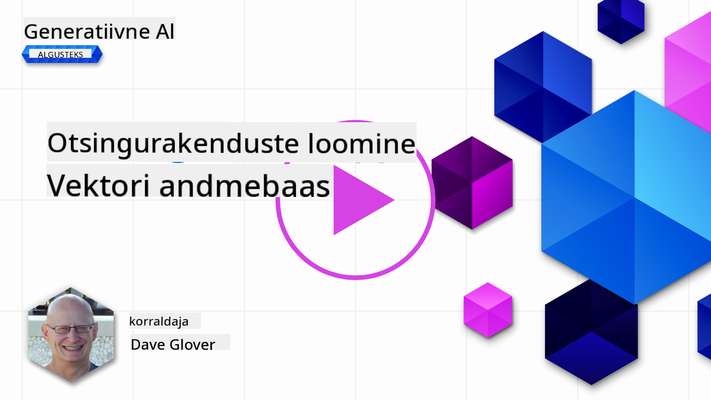
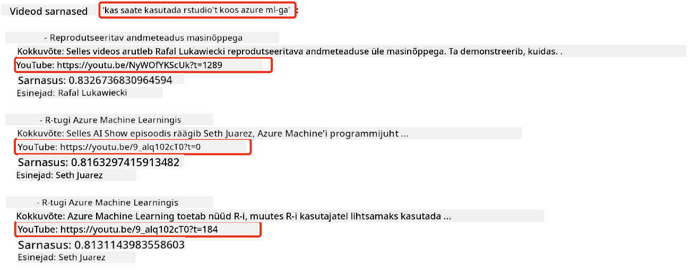
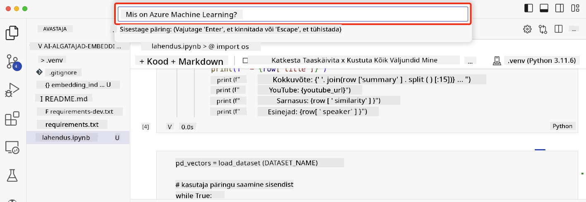

<!--
CO_OP_TRANSLATOR_METADATA:
{
  "original_hash": "58953c08b8ba7073b836d4270ea0fe86",
  "translation_date": "2025-10-18T02:49:38+00:00",
  "source_file": "08-building-search-applications/README.md",
  "language_code": "et"
}
-->
# Otsingurakenduste loomine

[](https://youtu.be/W0-nzXjOjr0?si=GcsqiTTvd7RKbo7V)

> > _Klõpsa ülaloleval pildil, et vaadata selle õppetunni videot_

LLM-id (suured keelemudelid) ei piirdu ainult vestlusrobotite ja tekstigeneratsiooniga. Nende abil on võimalik luua ka otsingurakendusi, kasutades sisendvektoreid (Embeddings). Sisendvektorid on andmete numbrilised esitlused, mida tuntakse ka vektorite nime all, ja neid saab kasutada semantilise otsingu jaoks.

Selles õppetunnis loome otsingurakenduse meie haridusalgatuse jaoks. Meie algatus on mittetulundusühing, mis pakub tasuta haridust arengumaade õpilastele. Algatusel on suur hulk YouTube'i videoid, mida õpilased saavad kasutada tehisintellekti õppimiseks. Algatus soovib luua otsingurakenduse, mis võimaldab õpilastel otsida YouTube'i videoid, sisestades küsimuse.

Näiteks võib õpilane sisestada küsimuse "Mis on Jupyter Notebooks?" või "Mis on Azure ML?" ja otsingurakendus tagastab nimekirja YouTube'i videotest, mis on küsimusega seotud. Veelgi enam, otsingurakendus tagastab lingi video sellele kohale, kus küsimusele vastus asub.

## Sissejuhatus

Selles õppetunnis käsitleme:

- Semantiline vs märksõnaotsing.
- Mis on tekstisisendvektorid (Text Embeddings).
- Tekstisisendvektorite indeksi loomine.
- Tekstisisendvektorite indeksi otsing.

## Õppeeesmärgid

Pärast selle õppetunni läbimist oskad:

- Eristada semantilist ja märksõnaotsingut.
- Selgitada, mis on tekstisisendvektorid.
- Luua rakenduse, mis kasutab sisendvektoreid andmete otsimiseks.

## Miks luua otsingurakendust?

Otsingurakenduse loomine aitab sul mõista, kuidas kasutada sisendvektoreid andmete otsimiseks. Samuti õpid, kuidas luua otsingurakendust, mida õpilased saavad kasutada teabe kiireks leidmiseks.

Õppetund sisaldab sisendvektorite indeksit Microsofti [AI Show](https://www.youtube.com/playlist?list=PLlrxD0HtieHi0mwteKBOfEeOYf0LJU4O1) YouTube'i kanali transkriptsioonide jaoks. AI Show on YouTube'i kanal, mis õpetab tehisintellekti ja masinõppe kohta. Sisendvektorite indeks sisaldab kõigi YouTube'i transkriptsioonide sisendvektoreid kuni oktoobrini 2023. Kasutad sisendvektorite indeksit, et luua meie algatuse jaoks otsingurakendus. Otsingurakendus tagastab lingi video sellele kohale, kus küsimusele vastus asub. See on suurepärane viis, kuidas õpilased saavad kiiresti vajaliku teabe leida.

Allpool on näide semantilisest päringust küsimuse "Kas Azure ML-i saab kasutada koos RStudio-ga?" kohta. Vaata YouTube'i URL-i, näed, et URL sisaldab ajatemplit, mis viib sind video sellele kohale, kus küsimusele vastus asub.



## Mis on semantiline otsing?

Võid küsida, mis on semantiline otsing? Semantiline otsing on otsingutehnika, mis kasutab päringus olevate sõnade tähendust, et tagastada asjakohaseid tulemusi.

Siin on näide semantilisest otsingust. Oletame, et otsid autot ja sisestad otsingusse "minu unistuste auto". Semantiline otsing mõistab, et sa ei "unista" autost, vaid otsid oma "ideaalset" autot. Semantiline otsing mõistab sinu kavatsust ja tagastab asjakohased tulemused. Alternatiiviks on "märksõnaotsing", mis otsiks sõna otseses mõttes unenägusid autode kohta ja tagastaks sageli ebaolulisi tulemusi.

## Mis on tekstisisendvektorid?

[Tekstisisendvektorid](https://en.wikipedia.org/wiki/Word_embedding?WT.mc_id=academic-105485-koreyst) on tekstiesituse tehnika, mida kasutatakse [loomuliku keele töötlemises](https://en.wikipedia.org/wiki/Natural_language_processing?WT.mc_id=academic-105485-koreyst). Tekstisisendvektorid on teksti semantilised numbrilised esitlused. Sisendvektoreid kasutatakse andmete esitamiseks viisil, mis on masinale kergesti mõistetav. Tekstisisendvektorite loomiseks on palju mudeleid, kuid selles õppetunnis keskendume sisendvektorite genereerimisele OpenAI sisendvektori mudeli abil.

Siin on näide: kujutame ette, et järgmine tekst on ühe AI Show YouTube'i kanali episoodi transkriptsioonist:

```text
Today we are going to learn about Azure Machine Learning.
```

Edastame teksti OpenAI sisendvektori API-le ja see tagastab järgmise sisendvektori, mis koosneb 1536 numbrist ehk vektorist. Iga number vektoris esindab teksti erinevat aspekti. Lühiduse huvides on siin vektori esimesed 10 numbrit.

```python
[-0.006655829958617687, 0.0026128944009542465, 0.008792596869170666, -0.02446001023054123, -0.008540431968867779, 0.022071078419685364, -0.010703742504119873, 0.003311325330287218, -0.011632772162556648, -0.02187200076878071, ...]
```

## Kuidas luuakse sisendvektorite indeks?

Selle õppetunni sisendvektorite indeks loodi mitme Python skripti abil. Leiad skriptid koos juhistega [README](./scripts/README.md?WT.mc_id=academic-105485-koreyst) failist õppetunni 'scripts' kaustas. Sa ei pea neid skripte käivitama, et õppetundi lõpetada, kuna sisendvektorite indeks on sulle juba ette antud.

Skriptid teevad järgmised toimingud:

1. Laetakse alla iga YouTube'i video transkriptsioon [AI Show](https://www.youtube.com/playlist?list=PLlrxD0HtieHi0mwteKBOfEeOYf0LJU4O1) esitusloendist.
2. Kasutades [OpenAI funktsioone](https://learn.microsoft.com/azure/ai-services/openai/how-to/function-calling?WT.mc_id=academic-105485-koreyst), tehakse katse tuvastada kõneleja nimi YouTube'i transkriptsiooni esimese 3 minuti jooksul. Iga video kõneleja nimi salvestatakse sisendvektorite indeksisse nimega `embedding_index_3m.json`.
3. Transkriptsiooni tekst jagatakse **3-minutilisteks tekstisegmentideks**. Segment sisaldab umbes 20 sõna kattumist järgmise segmendiga, et tagada, et segmendi sisendvektor ei katkeks ja et otsingukontekst oleks parem.
4. Iga tekstisegment edastatakse OpenAI Chat API-le, et kokku võtta tekst 60 sõnaga. Kokkuvõte salvestatakse samuti sisendvektorite indeksisse `embedding_index_3m.json`.
5. Lõpuks edastatakse segmendi tekst OpenAI sisendvektori API-le. Sisendvektori API tagastab vektori, mis koosneb 1536 numbrist ja esindab segmendi semantilist tähendust. Segment koos OpenAI sisendvektori vektoriga salvestatakse sisendvektorite indeksisse `embedding_index_3m.json`.

### Vektorandmebaasid

Õppetunni lihtsuse huvides salvestatakse sisendvektorite indeks JSON-faili nimega `embedding_index_3m.json` ja laaditakse Pandas DataFrame'i. Kuid tootmises salvestatakse sisendvektorite indeks vektorandmebaasi, nagu näiteks [Azure Cognitive Search](https://learn.microsoft.com/training/modules/improve-search-results-vector-search?WT.mc_id=academic-105485-koreyst), [Redis](https://cookbook.openai.com/examples/vector_databases/redis/readme?WT.mc_id=academic-105485-koreyst), [Pinecone](https://cookbook.openai.com/examples/vector_databases/pinecone/readme?WT.mc_id=academic-105485-koreyst), [Weaviate](https://cookbook.openai.com/examples/vector_databases/weaviate/readme?WT.mc_id=academic-105485-koreyst), ja teised.

## Kosinuse sarnasuse mõistmine

Oleme õppinud tekstisisendvektorite kohta, järgmine samm on õppida, kuidas kasutada tekstisisendvektoreid andmete otsimiseks ja eriti leida kõige sarnasemad sisendvektorid antud päringule, kasutades kosinuse sarnasust.

### Mis on kosinuse sarnasus?

Kosinuse sarnasus on sarnasuse mõõt kahe vektori vahel, mida nimetatakse ka `lähima naabri otsinguks`. Kosinuse sarnasuse otsingu tegemiseks tuleb _vektoriseerida_ päringu tekst OpenAI sisendvektori API abil. Seejärel arvutatakse _kosinuse sarnasus_ päringu vektori ja iga sisendvektorite indeksis oleva vektori vahel. Pea meeles, et sisendvektorite indeksis on vektor iga YouTube'i transkriptsiooni tekstisegmendi jaoks. Lõpuks sorteeritakse tulemused kosinuse sarnasuse järgi ja tekstisegmendid, millel on kõige suurem kosinuse sarnasus, on päringule kõige sarnasemad.

Matemaatilisest vaatenurgast mõõdab kosinuse sarnasus kahe vektori vahelist nurka mitmemõõtmelises ruumis. See mõõtmine on kasulik, sest kui kaks dokumenti on Eukleidese kauguse järgi kaugel, kuna nende suurus erineb, võivad nad siiski olla väiksema nurga all ja seega suurema kosinuse sarnasusega. Lisateavet kosinuse sarnasuse valemite kohta leiad [Kosinuse sarnasus](https://en.wikipedia.org/wiki/Cosine_similarity?WT.mc_id=academic-105485-koreyst).

## Esimese otsingurakenduse loomine

Järgmisena õpime, kuidas luua otsingurakendust, kasutades sisendvektoreid. Otsingurakendus võimaldab õpilastel otsida videot, sisestades küsimuse. Otsingurakendus tagastab nimekirja videotest, mis on küsimusega seotud. Otsingurakendus tagastab ka lingi video sellele kohale, kus küsimusele vastus asub.

See lahendus loodi ja testiti Windows 11, macOS-i ja Ubuntu 22.04 operatsioonisüsteemides, kasutades Python 3.10 või uuemat versiooni. Sa saad Python'i alla laadida [python.org](https://www.python.org/downloads/?WT.mc_id=academic-105485-koreyst) veebilehelt.

## Ülesanne - otsingurakenduse loomine, et aidata õpilasi

Tutvustasime oma algatust selle õppetunni alguses. Nüüd on aeg võimaldada õpilastel luua otsingurakendus oma ülesannete jaoks.

Selles ülesandes lood Azure OpenAI teenused, mida kasutatakse otsingurakenduse loomiseks. Lood järgmised Azure OpenAI teenused. Selle ülesande täitmiseks on sul vaja Azure'i tellimust.

### Azure Cloud Shelli käivitamine

1. Logi sisse [Azure'i portaali](https://portal.azure.com/?WT.mc_id=academic-105485-koreyst).
2. Vali Azure'i portaali paremas ülanurgas Cloud Shelli ikoon.
3. Vali **Bash** keskkonna tüübiks.

#### Ressursigrupi loomine

> Nendes juhistes kasutame ressursigruppi nimega "semantic-video-search" East US piirkonnas.
> Ressursigrupi nime muutmisel kontrolli [mudelite saadavuse tabelit](https://aka.ms/oai/models?WT.mc_id=academic-105485-koreyst).

```shell
az group create --name semantic-video-search --location eastus
```

#### Azure OpenAI teenuse ressursi loomine

Käivita Azure Cloud Shellis järgmine käsk, et luua Azure OpenAI teenuse ressurss.

```shell
az cognitiveservices account create --name semantic-video-openai --resource-group semantic-video-search \
    --location eastus --kind OpenAI --sku s0
```

#### Endpoint'i ja võtmete hankimine rakenduse jaoks

Käivita Azure Cloud Shellis järgmised käsud, et hankida endpoint ja võtmed Azure OpenAI teenuse ressursi jaoks.

```shell
az cognitiveservices account show --name semantic-video-openai \
   --resource-group  semantic-video-search | jq -r .properties.endpoint
az cognitiveservices account keys list --name semantic-video-openai \
   --resource-group semantic-video-search | jq -r .key1
```

#### OpenAI sisendvektori mudeli juurutamine

Käivita Azure Cloud Shellis järgmine käsk, et juurutada OpenAI sisendvektori mudel.

```shell
az cognitiveservices account deployment create \
    --name semantic-video-openai \
    --resource-group  semantic-video-search \
    --deployment-name text-embedding-ada-002 \
    --model-name text-embedding-ada-002 \
    --model-version "2"  \
    --model-format OpenAI \
    --sku-capacity 100 --sku-name "Standard"
```

## Lahendus

Ava [lahenduse märkmik](./python/aoai-solution.ipynb?WT.mc_id=academic-105485-koreyst) GitHub Codespaces'is ja järgi Jupyter Notebookis antud juhiseid.

Kui käivitad märkmiku, palutakse sul sisestada päring. Sisendkast näeb välja selline:



## Tubli töö! Jätka õppimist

Pärast selle õppetunni lõpetamist tutvu meie [Generatiivse tehisintellekti õppekollektsiooniga](https://aka.ms/genai-collection?WT.mc_id=academic-105485-koreyst), et jätkata oma teadmiste täiendamist generatiivse tehisintellekti valdkonnas!

Liigu edasi 9. õppetundi, kus uurime, kuidas [luua pildigeneratsiooni rakendusi](../09-building-image-applications/README.md?WT.mc_id=academic-105485-koreyst)!

---

**Lahtiütlus**:  
See dokument on tõlgitud AI tõlketeenuse [Co-op Translator](https://github.com/Azure/co-op-translator) abil. Kuigi püüame tagada täpsust, palume arvestada, et automaatsed tõlked võivad sisaldada vigu või ebatäpsusi. Algne dokument selle algses keeles tuleks pidada autoriteetseks allikaks. Olulise teabe puhul soovitame kasutada professionaalset inimtõlget. Me ei vastuta arusaamatuste või valesti tõlgenduste eest, mis võivad tuleneda selle tõlke kasutamisest.