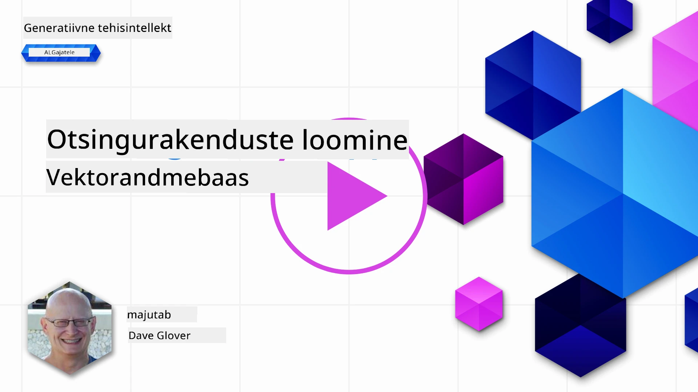
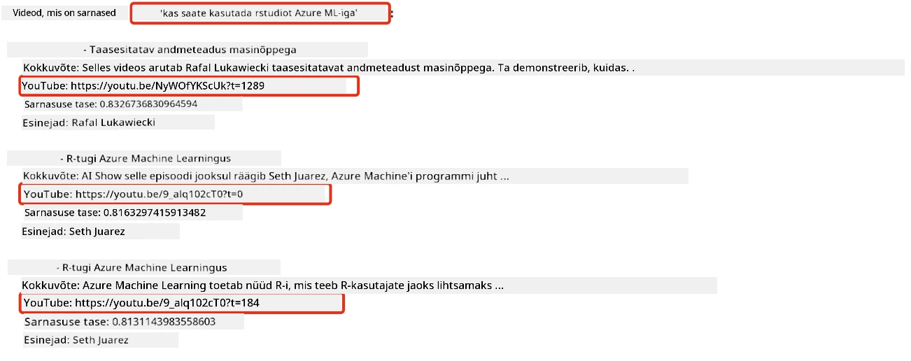
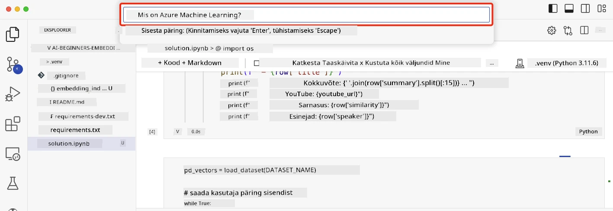

# Otsingurakenduste loomine

[](https://youtu.be/W0-nzXjOjr0?si=GcsqiTTvd7RKbo7V)

> > _Klõpsake ülaloleval pildil, et vaadata selle õppetunni videot_

Suuremates keelemudelites on rohkem kui lihtsalt vestlusrobotid ja teksti genereerimine. Samuti on võimalik luua otsingurakendusi, kasutades manustusi. Manustused on andmete numbrilised esitlused ehk vektorid, mida saab kasutada semantiliseks otsinguks andmetes.

Selles õppetükis ehitate otsingurakenduse meie haridusettevõttele. Meie ettevõte on mittetulundusühing, mis pakub tasuta haridust arengumaade õpilastele. Meie ettevõttel on suur hulk YouTube'i videoid, mida õpilased saavad kasutada AI õppimiseks. Meie ettevõte soovib luua otsingurakenduse, mis võimaldab õpilastel otsida YouTube'i videot, tippides küsimuse.

Näiteks võib õpilane sisestada „Mis on Jupyter Notebookid?“ või „Mis on Azure ML?“ ning otsingurakendus tagastab nimekirja YouTube'i videotest, mis küsimusega seotud on, ja mis veel parem – otsingurakendus annab lingi kohta videos, kus küsimusele vastus asub.

## Sissejuhatus

Selles õppetükis käsitleme:

- Semantilist vs märksõnapõhist otsingut.
- Mis on teksti manustused.
- Teksti manustuste indeksi loomist.
- Teksti manustuste indeksi otsimist.

## Õpieesmärgid

Pärast selle õppetüki lõpetamist oskad:

- Erinevust semantilise ja märksõnapõhise otsingu vahel selgitada.
- Selgitada, mis on teksti manustused.
- Luua rakenduse, mis kasutab manustusi andmete otsimiseks.

## Miks ehitada otsingurakendus?

Otsingurakenduse loomine aitab sul mõista, kuidas kasutada manustusi andmete otsimiseks. Samuti õpid, kuidas ehitada otsingurakendust, mida õpilased saavad kasutada info kiireks leidmiseks.

Õppetükk sisaldab manustuste indeksit YouTube'i tekstide kohta Microsofti [AI Show](https://www.youtube.com/playlist?list=PLlrxD0HtieHi0mwteKBOfEeOYf0LJU4O1) kanali jaoks. AI Show on YouTube'i kanal, mis õpetab AI-d ja masinõpetust. Manustuste indeksi koosseisus on manustused kõikide kuni oktoober 2023 kestvuste YouTube'i transkriptsioonide jaoks. Kasutad seda indeksit, et luua otsingurakendus meie ettevõttele. Otsingurakendus annab lingi kohta videos, kus küsimusele vastus asub. See on suurepärane viis, kuidas õpilased saavad kiiresti vajaliku info kätte.

Järgnev näide on semantilisest päringust küsimusele „kas saate kasutada rstudiot Azure ML-iga?“. Vaata YouTube'i URL-i, näed seal ajatemplit, mis viib kohale videos, kus vastus asub.



## Mis on semantiline otsing?

Võid ju mõelda, mis see semantiline otsing siis on? Semantiline otsing on otsingutehnika, mis kasutab päringus sõnade tähendust ehk semantikat, et tagastada asjakohased tulemused.

Näiteks semantilises otsingus, kui otsid autot ja sisestad „minu unistuste auto“, mõistab semantiline otsing, et sa ei `unenägi` autot, vaid otsid oma `ideaalselt` autot. Semantiline otsing mõistab su kavatsust ja tagastab asjakohased tulemused. Alternatiiviks on „märksõnaotsing“, mis otsib sõnasõnaliselt unistusi autodest ja sageli tagastab ebaolulisi tulemusi.

## Mis on teksti manustused?

[Teksti manustused](https://en.wikipedia.org/wiki/Word_embedding?WT.mc_id=academic-105485-koreyst) on tekstide esindamise meetod, mida kasutatakse [loomuliku keele töötlemises](https://en.wikipedia.org/wiki/Natural_language_processing?WT.mc_id=academic-105485-koreyst). Tekstimanustused on teksti semantilised numbrilised esitlused. Manustusi kasutatakse andmete esitamiseks masinale arusaadaval moel. Tekstimanustuste loomisel on palju mudeleid, selles õppetükis keskendume manustuste genereerimisele OpenAI manustumudeli abil.

Näiteks kujuta ette, et järgmine tekst on ühes episoodis AI Show YouTube'i kanali transkriptsioonis:

```text
Today we are going to learn about Azure Machine Learning.
```

Anname selle teksti OpenAI manustuste API-le ja see tagastab 1536 numbrist koosneva manustuse ehk vektori. Iga vektoriosa esindab teistsugust aspekti tekstist. Lühiduse mõttes on siin toodud vektori esimesed 10 numbrit.

```python
[-0.006655829958617687, 0.0026128944009542465, 0.008792596869170666, -0.02446001023054123, -0.008540431968867779, 0.022071078419685364, -0.010703742504119873, 0.003311325330287218, -0.011632772162556648, -0.02187200076878071, ...]
```

## Kuidas manustuste indeks luuakse?

Selle õppetüki manustuste indeks loodi Python-skriptide abil. Leia skriptid koos juhistega [README](./scripts/README.md?WT.mc_id=academic-105485-koreyst) dokumendist selles õppetüki kaustas. Sul ei ole vaja neid skripte käivitada, sest manustuste indeks on sulle ette valmistatud.

Skriptid teostavad järgmisi toiminguid:

1. Tõmbab alla iga YouTube'i video transkriptsiooni [AI Show](https://www.youtube.com/playlist?list=PLlrxD0HtieHi0mwteKBOfEeOYf0LJU4O1) esitusloendist.
2. Kasutades [OpenAI funktsioone](https://learn.microsoft.com/azure/ai-foundry/openai/how-to/function-calling?WT.mc_id=academic-105485-koreyst), püütakse YouTube'i videote transkriptsiooni esimesest 3 minutist välja lugeda esineja nimi. Iga video esineja nimi salvestatakse manustuste indeksisse nimega `embedding_index_3m.json`.
3. Seejärel jagatakse transkriptsiooni tekst **3-minutilisteks tekstilõikudeks**. Lõik sisaldab umbes 20 sõna kattuvust järgmise lõiguga, et manustus ei lõigataks pooleli ja et paremini otsingu konteksti pakkuda.
4. Iga lõik antakse OpenAI Chat API-le, mis kokkuvõtlikult teisendab teksti ~60 sõnaks. Kokkuvõte salvestatakse ka manustuste indeksisse `embedding_index_3m.json`.
5. Lõpuks antakse lõigu tekst OpenAI manustuste API-le. Manustuste API tagastab vektori 1536 numbriga, mis esindavad lõigu semantilist tähendust. Lõik koos OpenAI manustusvektoriga salvestatakse manustuste indeksisse `embedding_index_3m.json`.

### Vektorandmebaasid

Lihtsuse mõttes hoitakse selles õppetükis manustuste indeksit JSON-failis nimega `embedding_index_3m.json` ning laaditakse Pandas DataFrame'i. Kuid tootmiskeskkonnas hoitakse indeksit vektorandmebaasis, näiteks [Azure Cognitive Search](https://learn.microsoft.com/training/modules/improve-search-results-vector-search?WT.mc_id=academic-105485-koreyst), [Redis](https://cookbook.openai.com/examples/vector_databases/redis/readme?WT.mc_id=academic-105485-koreyst), [Pinecone](https://cookbook.openai.com/examples/vector_databases/pinecone/readme?WT.mc_id=academic-105485-koreyst), [Weaviate](https://cookbook.openai.com/examples/vector_databases/weaviate/readme?WT.mc_id=academic-105485-koreyst) ja teised.

## Kosinussarnasusest mõistmine

Oleme õppinud teksti manustusi, järgmine samm on õppida, kuidas neid manustusi kasutada andmete otsimiseks ja konkreetsemalt leida päringule kõige sarnasemad manustused kosinussarnasuse abil.

### Mis on kosinussarnasus?

Kosinussarnasus on kahe vektori vahelise sarnasuse mõõt, seda nimetatakse ka `lähedase naabri otsinguks`. Kosinussarnasuse otsingu tegemiseks pead päringu teksti vektoriseerima OpenAI manustuste API abil. Seejärel arvutad kosinussarnasuse päringu vektori ja iga vektori vahel manustuste indeksis. Pea meeles, et indeks sisaldab vektoreid iga YouTube'i teksti lõigu kohta. Lõpuks sorteerid tulemused kosinussarnasuse järgi ning tekstilõigud, mille kosinussarnasus on kõrgeim, on päringule kõige sarnasemad.

Matemaatiliselt mõõdab kosinussarnasus kahe vektori vahelist nurka mitmemõõtmelises ruumis. See mõõde on kasulik, sest kui kaks dokumenti on euclidese kauguse poolest kaugel, näiteks erineva suuruse tõttu, võivad neil siiski olla väiksem nurk ja seetõttu suurem kosinussarnasus. Lisateavet kosinussarnasuse valemite kohta leiad [siit](https://en.wikipedia.org/wiki/Cosine_similarity?WT.mc_id=academic-105485-koreyst).

## Oma esimese otsingurakenduse loomine

Järgnevalt õpime, kuidas luua otsingurakendus kasutades manustusi. Otsingurakendus võimaldab õpilastel otsida videot, tippides küsimuse. Rakendus tagastab nimekirja videotest, mis küsimusega seotud on. Rakendus annab ka lingi kohtale videos, kus vastus asub.

See lahendus ehitati ja testiti Windows 11, macOS ja Ubuntu 22.04 platvormidel kasutades Python 3.10 või uuemat versiooni. Python’i saad alla laadida aadressilt [python.org](https://www.python.org/downloads/?WT.mc_id=academic-105485-koreyst).

## Ülesanne - otsingurakenduse ehitamine õpilastele

Tutvustasime oma ettevõtet selle õppetunni alguses. Nüüd on aeg lubada õpilastel ehitada otsingurakendus oma ülesannete jaoks.

Selles ülesandes loote Azure OpenAI teenused, mida kasutatakse otsingurakenduse ehitamisel. Lood need Azure OpenAI teenused. Ülesande täitmiseks on vaja Azure tellimust.

### Käivita Azure Cloud Shell

1. Logi sisse [Azure portaali](https://portal.azure.com/?WT.mc_id=academic-105485-koreyst).
2. Vali nurgas ülemises paremas nurgas Cloud Shell ikoon.
3. Vali keskkonna tüübiks **Bash**.

#### Loo ressursirühm

> Nendes juhistes kasutame ressursirühma nimega „semantic-video-search“ East USA piirkonnas.
> Võid ressursirühma nime muuta, kuid kui muudad ressursside asukohta,
> kontrolli [mudeli saadavuse tabelit](https://aka.ms/oai/models?WT.mc_id=academic-105485-koreyst).

```shell
az group create --name semantic-video-search --location eastus
```

#### Loo Azure OpenAI teenuse ressurss

Azure Cloud Shellis käivita järgmine käsk, et luua Azure OpenAI teenuse ressurss.

```shell
az cognitiveservices account create --name semantic-video-openai --resource-group semantic-video-search \
    --location eastus --kind OpenAI --sku s0
```

#### Saa teenuse aadress ja võtmed rakenduse kasutamiseks

Azure Cloud Shellis käivita järgmised käsud, et saada Azure OpenAI teenuse ressursi aadress ja võtmed.

```shell
az cognitiveservices account show --name semantic-video-openai \
   --resource-group  semantic-video-search | jq -r .properties.endpoint
az cognitiveservices account keys list --name semantic-video-openai \
   --resource-group semantic-video-search | jq -r .key1
```

#### Hoiusta OpenAI manustusmudelit

Azure Cloud Shellis käivita järgmine käsk, et juurutada OpenAI manustusmudel.

```shell
az cognitiveservices account deployment create \
    --name semantic-video-openai \
    --resource-group  semantic-video-search \
    --deployment-name text-embedding-ada-002 \
    --model-name text-embedding-ada-002 \
    --model-version "2"  \
    --model-format OpenAI \
    --sku-capacity 100 --sku-name "Standard"
```

## Lahendus

Ava [lahendusnotebook](./python/aoai-solution.ipynb?WT.mc_id=academic-105485-koreyst) GitHub Codespaces’is ja järgi juhiseid Jupyter Notebookis.

Kui käivitad notebooki, küsitakse päringut. Sisendkast näeb välja nii:



## Suurepärane töö! Jätka õppimist

Pärast selle õppetüki lõpetamist vaata meie [Generative AI õppimiskogu](https://aka.ms/genai-collection?WT.mc_id=academic-105485-koreyst), et jätkata generatiivse AI teadmiste täiustamist!

Suleb Lesson 9, kus vaatame, kuidas [ehitada pildigeneratsiooni rakendusi](../09-building-image-applications/README.md?WT.mc_id=academic-105485-koreyst)!

---

<!-- CO-OP TRANSLATOR DISCLAIMER START -->
**Lahtiütlus**:
See dokument on tõlgitud kasutades AI tõlketeenust [Co-op Translator](https://github.com/Azure/co-op-translator). Kuigi me püüdleme täpsuse poole, palun pange tähele, et automatiseeritud tõlgetes võib esineda vigu või ebatäpsusi. Originaaldokument selle emakeeles tuleks pidada autoriteetseks allikaks. Olulise teabe puhul soovitatakse kasutada professionaalset inimtõlget. Me ei vastuta selle tõlkega seotud eksimustest või valesti mõistmistest.
<!-- CO-OP TRANSLATOR DISCLAIMER END -->