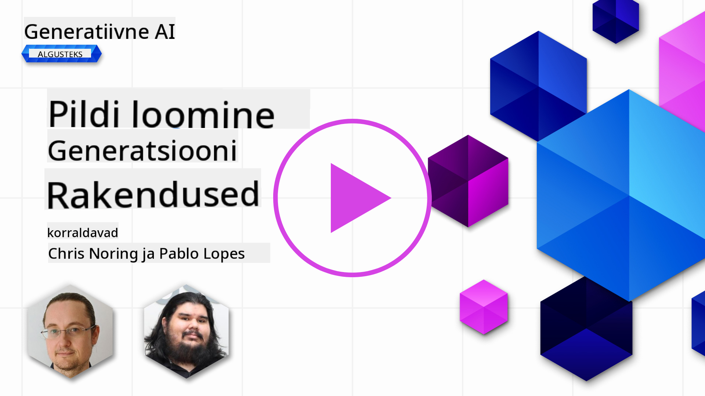

<!--
CO_OP_TRANSLATOR_METADATA:
{
  "original_hash": "063a2ac57d6b71bea0eaa880c68770d2",
  "translation_date": "2025-10-11T11:40:16+00:00",
  "source_file": "09-building-image-applications/README.md",
  "language_code": "et"
}
-->
# Pildigeneratsiooni rakenduste loomine

[](https://aka.ms/gen-ai-lesson9-gh?WT.mc_id=academic-105485-koreyst)

LLM-id ei piirdu ainult tekstigeneratsiooniga. Tekstikirjelduste abil on võimalik luua ka pilte. Pildid kui meedium võivad olla väga kasulikud mitmes valdkonnas, nagu meditsiinitehnoloogia, arhitektuur, turism, mänguarendus ja palju muud. Selles peatükis vaatleme kahte populaarseimat pildigeneratsiooni mudelit: DALL-E ja Midjourney.

## Sissejuhatus

Selles õppetükis käsitleme:

- Pildigeneratsiooni ja selle kasulikkust.
- DALL-E ja Midjourney: mis need on ja kuidas need töötavad.
- Kuidas luua pildigeneratsiooni rakendust.

## Õppe-eesmärgid

Pärast selle õppetüki läbimist oskad:

- Luua pildigeneratsiooni rakendust.
- Määratleda rakenduse piirid metapromptide abil.
- Töötada DALL-E ja Midjourneyga.

## Miks luua pildigeneratsiooni rakendust?

Pildigeneratsiooni rakendused on suurepärane viis Generatiivse AI võimaluste uurimiseks. Neid saab kasutada näiteks:

- **Pilditöötlus ja süntees**. Pilte saab luua mitmesugusteks kasutusjuhtudeks, nagu pilditöötlus ja pildisüntees.

- **Rakendatav erinevates tööstusharudes**. Pilte saab luua mitmesuguste tööstusharude jaoks, nagu meditsiinitehnoloogia, turism, mänguarendus ja palju muud.

## Stsenaarium: Edu4All

Selle õppetüki osana jätkame tööd meie idufirmaga Edu4All. Õpilased loovad pilte oma ülesannete jaoks. Milliseid pilte nad loovad, on nende enda otsustada, kuid need võivad olla illustratsioonid nende enda muinasjutule, uue tegelase loomine nende loole või nende ideede ja kontseptsioonide visualiseerimine.

Näiteks, kui Edu4Alli õpilased töötavad klassis monumentide teemal, võivad nad luua midagi sellist:


kasutades sellist prompti nagu:

> "Koer Eiffeli torni kõrval varahommikuses päikesevalguses"

## Mis on DALL-E ja Midjourney?

[DALL-E](https://openai.com/dall-e-2?WT.mc_id=academic-105485-koreyst) ja [Midjourney](https://www.midjourney.com/?WT.mc_id=academic-105485-koreyst) on kaks populaarseimat pildigeneratsiooni mudelit, mis võimaldavad kasutada prompt'e piltide loomiseks.

### DALL-E

Alustame DALL-E-st, mis on Generatiivse AI mudel, mis loob pilte tekstikirjelduste põhjal.

> [DALL-E on kahe mudeli, CLIP ja hajutatud tähelepanu, kombinatsioon](https://towardsdatascience.com/openais-dall-e-and-clip-101-a-brief-introduction-3a4367280d4e?WT.mc_id=academic-105485-koreyst).

- **CLIP** on mudel, mis loob sisendite (piltide ja teksti) numbrilisi esitlusi ehk embeddings'eid.

- **Hajutatud tähelepanu** on mudel, mis loob pilte embeddings'ide põhjal. DALL-E on treenitud piltide ja tekstide andmestikul ning seda saab kasutada piltide loomiseks tekstikirjelduste põhjal. Näiteks saab DALL-E abil luua pilte kassist mütsiga või koerast mohawk'iga.

### Midjourney

Midjourney töötab sarnaselt DALL-E-le, luues pilte tekstipromptide abil. Midjourney abil saab samuti luua pilte, kasutades prompt'e nagu "kass mütsiga" või "koer mohawk'iga".


_Pildi autor Wikipedia, pilt loodud Midjourney abil_

## Kuidas DALL-E ja Midjourney töötavad

Esiteks, [DALL-E](https://arxiv.org/pdf/2102.12092.pdf?WT.mc_id=academic-105485-koreyst). DALL-E on Generatiivse AI mudel, mis põhineb transformer-arhitektuuril ja kasutab _autoregressiivset transformerit_.

_Autoregressiivne transformer_ määratleb, kuidas mudel loob pilte tekstikirjelduste põhjal: see genereerib ühe piksli korraga ja kasutab genereeritud piksleid järgmise piksli loomiseks. Protsess läbib mitmeid kihte närvivõrgus, kuni pilt on valmis.

Selle protsessi abil suudab DALL-E kontrollida pildi atribuute, objekte, omadusi ja palju muud. Kuid DALL-E 2 ja 3 pakuvad veelgi suuremat kontrolli loodud pildi üle.

## Esimese pildigeneratsiooni rakenduse loomine

Mida on vaja pildigeneratsiooni rakenduse loomiseks? Vajalikud on järgmised teegid:

- **python-dotenv**, soovitatav kasutada seda teeki, et hoida oma konfidentsiaalsed andmed _.env_ failis eemal koodist.
- **openai**, teek, mida kasutatakse OpenAI API-ga suhtlemiseks.
- **pillow**, Pythonis piltidega töötamiseks.
- **requests**, HTTP-päringute tegemiseks.

## Azure OpenAI mudeli loomine ja juurutamine

Kui seda pole veel tehtud, järgige [Microsoft Learn](https://learn.microsoft.com/azure/ai-foundry/openai/how-to/create-resource?pivots=web-portal) lehel olevaid juhiseid, et luua Azure OpenAI ressurss ja mudel. Valige mudeliks DALL-E 3.

## Rakenduse loomine

1. Looge fail _.env_ järgmise sisuga:

   ```text
   AZURE_OPENAI_ENDPOINT=<your endpoint>
   AZURE_OPENAI_API_KEY=<your key>
   AZURE_OPENAI_DEPLOYMENT="dall-e-3"
   ```

   Leidke see teave Azure OpenAI Foundry portaali "Deployments" sektsioonist.

1. Koguge ülaltoodud teegid faili _requirements.txt_ järgmiselt:

   ```text
   python-dotenv
   openai
   pillow
   requests
   ```

1. Seejärel looge virtuaalne keskkond ja installige teegid:

   ```bash
   python3 -m venv venv
   source venv/bin/activate
   pip install -r requirements.txt
   ```

   Windowsi puhul kasutage järgmisi käske virtuaalse keskkonna loomiseks ja aktiveerimiseks:

   ```bash
   python3 -m venv venv
   venv\Scripts\activate.bat
   ```

1. Lisage järgmine kood faili _app.py_:

    ```python
    import openai
    import os
    import requests
    from PIL import Image
    import dotenv
    from openai import OpenAI, AzureOpenAI
    
    # import dotenv
    dotenv.load_dotenv()
    
    # configure Azure OpenAI service client 
    client = AzureOpenAI(
      azure_endpoint = os.environ["AZURE_OPENAI_ENDPOINT"],
      api_key=os.environ['AZURE_OPENAI_API_KEY'],
      api_version = "2024-02-01"
      )
    try:
        # Create an image by using the image generation API
        generation_response = client.images.generate(
                                prompt='Bunny on horse, holding a lollipop, on a foggy meadow where it grows daffodils',
                                size='1024x1024', n=1,
                                model=os.environ['AZURE_OPENAI_DEPLOYMENT']
                              )

        # Set the directory for the stored image
        image_dir = os.path.join(os.curdir, 'images')

        # If the directory doesn't exist, create it
        if not os.path.isdir(image_dir):
            os.mkdir(image_dir)

        # Initialize the image path (note the filetype should be png)
        image_path = os.path.join(image_dir, 'generated-image.png')

        # Retrieve the generated image
        image_url = generation_response.data[0].url  # extract image URL from response
        generated_image = requests.get(image_url).content  # download the image
        with open(image_path, "wb") as image_file:
            image_file.write(generated_image)

        # Display the image in the default image viewer
        image = Image.open(image_path)
        image.show()

    # catch exceptions
    except openai.InvalidRequestError as err:
        print(err)
   ```

Selgitame seda koodi:

- Esiteks impordime vajalikud teegid, sealhulgas OpenAI teegi, dotenv teegi, requests teegi ja Pillow teegi.

  ```python
  import openai
  import os
  import requests
  from PIL import Image
  import dotenv
  ```

- Järgmisena laadime keskkonnamuutujad _.env_ failist.

  ```python
  # import dotenv
  dotenv.load_dotenv()
  ```

- Seejärel konfigureerime Azure OpenAI teenuse kliendi.

  ```python
  # Get endpoint and key from environment variables
  client = AzureOpenAI(
      azure_endpoint = os.environ["AZURE_OPENAI_ENDPOINT"],
      api_key=os.environ['AZURE_OPENAI_API_KEY'],
      api_version = "2024-02-01"
      )
  ```

- Järgmisena genereerime pildi:

  ```python
  # Create an image by using the image generation API
  generation_response = client.images.generate(
                        prompt='Bunny on horse, holding a lollipop, on a foggy meadow where it grows daffodils',
                        size='1024x1024', n=1,
                        model=os.environ['AZURE_OPENAI_DEPLOYMENT']
                      )
  ```

  Ülaltoodud kood vastab JSON-objektiga, mis sisaldab loodud pildi URL-i. URL-i saab kasutada pildi allalaadimiseks ja faili salvestamiseks.

- Lõpuks avame pildi ja kuvame selle standardse pildivaaturiga:

  ```python
  image = Image.open(image_path)
  image.show()
  ```

### Pildi genereerimise üksikasjad

Vaatame pildi genereerimise koodi lähemalt:

   ```python
     generation_response = client.images.generate(
                               prompt='Bunny on horse, holding a lollipop, on a foggy meadow where it grows daffodils',
                               size='1024x1024', n=1,
                               model=os.environ['AZURE_OPENAI_DEPLOYMENT']
                           )
   ```

- **prompt** on tekstiprompt, mida kasutatakse pildi loomiseks. Antud juhul kasutame prompt'i "Jänes hobuse seljas, hoiab pulgakommi, udusel niidul, kus kasvavad nartsissid".
- **size** on loodud pildi suurus. Antud juhul loome pildi, mille suurus on 1024x1024 pikslit.
- **n** on loodud piltide arv. Antud juhul loome kaks pilti.
- **temperature** on parameeter, mis kontrollib Generatiivse AI mudeli väljundi juhuslikkust. Temperatuur on väärtus vahemikus 0 kuni 1, kus 0 tähendab, et väljund on deterministlik, ja 1 tähendab, et väljund on juhuslik. Vaikeväärtus on 0.7.

Piltidega saab teha veel palju muud, mida käsitleme järgmises osas.

## Pildigeneratsiooni täiendavad võimalused

Olete näinud, kuidas saime Pythonis mõne rea koodiga pildi genereerida. Kuid piltidega saab teha veel palju muud.

Samuti saate teha järgmist:

- **Teha muudatusi**. Olemasolevale pildile maski ja prompt'i lisamisega saate pilti muuta. Näiteks saate pildile midagi juurde lisada. Kujutage ette meie jänese pilti, saate jänesele mütsi lisada. Selleks tuleb anda pilt, mask (muudatuse ala määramiseks) ja tekstiprompt, mis ütleb, mida tuleks teha.
> Märkus: see ei ole toetatud DALL-E 3-s.

Siin on näide GPT Image'i kasutamisest:

   ```python
   response = client.images.edit(
       model="gpt-image-1",
       image=open("sunlit_lounge.png", "rb"),
       mask=open("mask.png", "rb"),
       prompt="A sunlit indoor lounge area with a pool containing a flamingo"
   )
   image_url = response.data[0].url
   ```

  Algne pilt sisaldaks ainult basseini ja lounge'i, kuid lõplik pilt sisaldaks flamingot:

<div style="display: flex; justify-content: space-between; align-items: center; margin: 20px 0;">
  
  
  
</div>

- **Loo variatsioone**. Idee seisneb selles, et võtate olemasoleva pildi ja palute luua variatsioone. Variatsiooni loomiseks annate pildi ja tekstiprompti ning koodi, nagu allpool:

  ```python
  response = openai.Image.create_variation(
    image=open("bunny-lollipop.png", "rb"),
    n=1,
    size="1024x1024"
  )
  image_url = response['data'][0]['url']
  ```

  > Märkus: see on toetatud ainult OpenAI-s.

## Temperatuur

Temperatuur on parameeter, mis kontrollib Generatiivse AI mudeli väljundi juhuslikkust. Temperatuur on väärtus vahemikus 0 kuni 1, kus 0 tähendab, et väljund on deterministlik, ja 1 tähendab, et väljund on juhuslik. Vaikeväärtus on 0.7.

Vaatame, kuidas temperatuur töötab, käivitades selle prompt'i kaks korda:

> Prompt: "Jänes hobuse seljas, hoiab pulgakommi, udusel niidul, kus kasvavad nartsissid"


Nüüd käivitame sama prompt'i uuesti, et näha, et me ei saa kaks korda täpselt sama pilti:


Nagu näete, on pildid sarnased, kuid mitte identsed. Proovime muuta temperatuuri väärtust 0.1 ja vaatame, mis juhtub:

```python
 generation_response = client.images.create(
        prompt='Bunny on horse, holding a lollipop, on a foggy meadow where it grows daffodils',    # Enter your prompt text here
        size='1024x1024',
        n=2
    )
```

### Temperatuuri muutmine

Proovime muuta vastust deterministlikumaks. Võime täheldada, et kahes loodud pildis on esimeses pildis jänes ja teises pildis hobune, seega pildid erinevad oluliselt.

Muudame seetõttu oma koodi ja määrame temperatuuri väärtuseks 0, nagu allpool:

```python
generation_response = client.images.create(
        prompt='Bunny on horse, holding a lollipop, on a foggy meadow where it grows daffodils',    # Enter your prompt text here
        size='1024x1024',
        n=2,
        temperature=0
    )
```

Nüüd, kui käivitate selle koodi, saate need kaks pilti:

- 
- 

Siin näete selgelt, kuidas pildid sarnanevad üksteisega rohkem.

## Kuidas määratleda rakenduse piirid metapromptide abil

Meie demo abil saame juba klientidele pilte luua. Kuid peame looma rakendusele mõned piirid.

Näiteks ei soovi me luua pilte, mis ei ole sobivad tööks või mis ei ole lastele sobivad.

Seda saame teha _metapromptide_ abil. Metapromptid on tekstipromptid, mida kasutatakse Generatiivse AI mudeli väljundi kontrollimiseks. Näiteks saame metapromptide abil kontrollida väljundit ja tagada, et loodud pildid oleksid sobivad tööks või lastele.

### Kuidas see töötab?

Kuidas metapromptid siis töötavad?

Metapromptid on tekstipromptid, mida kasutatakse Generatiivse AI mudeli väljundi kontrollimiseks. Need paigutatakse tekstiprompti ette ja neid kasutatakse mudeli väljundi kontrollimiseks ning rakendustes mudeli väljundi kontrollimiseks. Need ühendavad prompt'i sisendi ja metaprompt'i sisendi üheks tekstipromptiks.

Üks näide metapromptist oleks järgmine:

```text
You are an assistant designer that creates images for children.

The image needs to be safe for work and appropriate for children.

The image needs to be in color.

The image needs to be in landscape orientation.

The image needs to be in a 16:9 aspect ratio.

Do not consider any input from the following that is not safe for work or appropriate for children.

(Input)

```

Nüüd vaatame, kuidas saame metaprompt'e oma demos kasutada.

```python
disallow_list = "swords, violence, blood, gore, nudity, sexual content, adult content, adult themes, adult language, adult humor, adult jokes, adult situations, adult"

meta_prompt =f"""You are an assistant designer that creates images for children.

The image needs to be safe for work and appropriate for children.

The image needs to be in color.

The image needs to be in landscape orientation.

The image needs to be in a 16:9 aspect ratio.

Do not consider any input from the following that is not safe for work or appropriate for children.
{disallow_list}
"""

prompt = f"{meta_prompt}
Create an image of a bunny on a horse, holding a lollipop"

# TODO add request to generate image
```

Ülaltoodud promptist näete, kuidas kõik loodud pildid arvestavad metaprompti.

## Ülesanne - lubame õpilastel tegutseda

Tutvustasime õppetüki alguses Edu4Alli. Nüüd on aeg lubada õpilastel luua pilte oma ülesannete jaoks.

Õpilased loovad pilte oma ülesannete jaoks, mis sisaldavad monumente. Millised monumendid, on õpilaste enda otsustada. Õpilastel palutakse kasutada oma loovust selles ülesandes, et paigutada need monumendid erinevatesse kontekstidesse.

## Lahendus

Siin on üks võimalik lahendus:
```python
import openai
import os
import requests
from PIL import Image
import dotenv
from openai import AzureOpenAI
# import dotenv
dotenv.load_dotenv()

# Get endpoint and key from environment variables
client = AzureOpenAI(
  azure_endpoint = os.environ["AZURE_OPENAI_ENDPOINT"],
  api_key=os.environ['AZURE_OPENAI_API_KEY'],
  api_version = "2024-02-01"
  )


disallow_list = "swords, violence, blood, gore, nudity, sexual content, adult content, adult themes, adult language, adult humor, adult jokes, adult situations, adult"

meta_prompt = f"""You are an assistant designer that creates images for children.

The image needs to be safe for work and appropriate for children.

The image needs to be in color.

The image needs to be in landscape orientation.

The image needs to be in a 16:9 aspect ratio.

Do not consider any input from the following that is not safe for work or appropriate for children.
{disallow_list}
"""

prompt = f"""{meta_prompt}
Generate monument of the Arc of Triumph in Paris, France, in the evening light with a small child holding a Teddy looks on.
""""

try:
    # Create an image by using the image generation API
    generation_response = client.images.generate(
        prompt=prompt,    # Enter your prompt text here
        size='1024x1024',
        n=1,
    )
    # Set the directory for the stored image
    image_dir = os.path.join(os.curdir, 'images')

    # If the directory doesn't exist, create it
    if not os.path.isdir(image_dir):
        os.mkdir(image_dir)

    # Initialize the image path (note the filetype should be png)
    image_path = os.path.join(image_dir, 'generated-image.png')

    # Retrieve the generated image
    image_url = generation_response.data[0].url  # extract image URL from response
    generated_image = requests.get(image_url).content  # download the image
    with open(image_path, "wb") as image_file:
        image_file.write(generated_image)

    # Display the image in the default image viewer
    image = Image.open(image_path)
    image.show()

# catch exceptions
except openai.BadRequestError as err:
    print(err)
```

## Suurepärane töö! Jätka õppimist

Pärast selle õppetunni lõpetamist vaata meie [Generatiivse AI õppekollektsiooni](https://aka.ms/genai-collection?WT.mc_id=academic-105485-koreyst), et jätkata oma generatiivse AI teadmiste arendamist!

Liigu edasi 10. õppetundi, kus uurime, kuidas [luua AI-rakendusi madala koodiga](../10-building-low-code-ai-applications/README.md?WT.mc_id=academic-105485-koreyst)

---

**Lahtiütlus**:  
See dokument on tõlgitud AI tõlketeenuse [Co-op Translator](https://github.com/Azure/co-op-translator) abil. Kuigi püüame tagada täpsust, palume arvestada, et automaatsed tõlked võivad sisaldada vigu või ebatäpsusi. Algne dokument selle algses keeles tuleks pidada autoriteetseks allikaks. Olulise teabe puhul soovitame kasutada professionaalset inimtõlget. Me ei vastuta selle tõlke kasutamisest tulenevate arusaamatuste või valesti tõlgenduste eest.