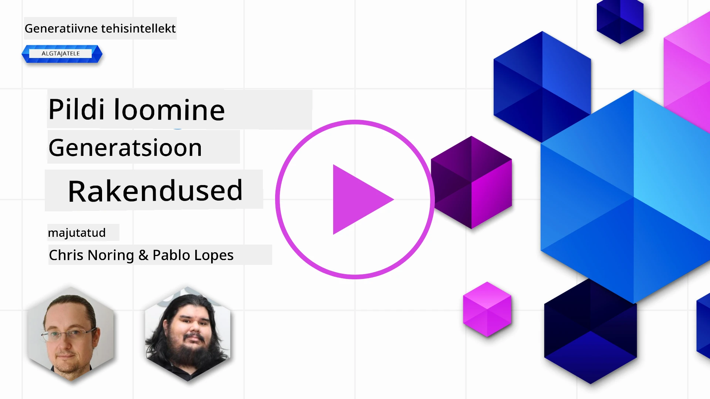

# Pildiloome rakenduste loomine

[](https://youtu.be/B5VP0_J7cs8?si=5P3L5o7F_uS_QcG9)

LLM-id ei tähenda ainult teksti genereerimist. On võimalik ka kujutada pilte tekstikirjelduste põhjal. Piltide kasutamine modaliteedina võib olla väga kasulik mitmetes valdkondades nagu meditsiinitehnika, arhitektuur, turism, mänguarendus ja palju muud. Selles peatükis vaatleme kahte populaarseimat pildiloome mudelit, DALL-E ja Midjourney.

## Sissejuhatus

Selles õppetükis käsitleme:

- Pildiloome olemust ja miks see on kasulik.
- DALL-E ja Midjourney mudelid, mis need on ja kuidas need töötavad.
- Kuidas luua pildiloome rakendust.

## Õpitulemused

Pärast selle õppetüki lõpetamist oskad:

- Luua pildiloome rakenduse.
- Määratleda rakendusele piirid meta-päringute abil.
- Töötada DALL-E ja Midjourney mudelitega.

## Miks ehitada pildiloome rakendus?

Pildiloome rakendused pakuvad suurepärast võimalust uurida generatiivse tehisintellekti võimeid. Neid saab kasutada näiteks järgmistel eesmärkidel:

- **Piltide muutmine ja süntees**. Saad luua pilte mitmesugusteks kasutusjuhtudeks, nagu piltide redigeerimine ja sünteesi loomine.

- **Rakendudes mitmetes tööstusharudes**. Saad kasutada neid piltide genereerimiseks meditsiinitehnika, turismi, mänguarenduse ja paljude teiste tööstusharude jaoks.

## Stsenaarium: Edu4All

Selle õppetüki raames jätkame tööd meie startupiga Edu4All. Õpilased loovad pilte oma hindamisteks, milliseid pilte täpselt luuakse, otsustavad õpilased ise — need võivad olla illustreerivad pildid enda muinasloole või uue tegelase loomine oma loole või aitavad visualiseerida ideid ja kontseptsioone.

Näiteks seda võiksid Edu4Alli õpilased genereerida, kui nad töötavad klassis monumentide teemal:


kasutades järgmist päringut

> "Koer Eiffel-torni kõrval varahommikuses päikesepaistes"

## Mis on DALL-E ja Midjourney?

[DALL-E](https://openai.com/dall-e-2?WT.mc_id=academic-105485-koreyst) ja [Midjourney](https://www.midjourney.com/?WT.mc_id=academic-105485-koreyst) on kaks populaarseimat pildiloome mudelit, mis võimaldavad teksti kirjelduste abil pilte genereerida.

### DALL-E

Alustame DALL-E mudelist, mis on generatiivse tehisintellekti mudel, mis loob pilte tekstikirjelduste põhjal.

> [DALL-E koosneb kahest mudelist, CLIP ja diffuusse tähelepanu mehhanismist](https://towardsdatascience.com/openais-dall-e-and-clip-101-a-brief-introduction-3a4367280d4e?WT.mc_id=academic-105485-koreyst).

- **CLIP** on mudel, mis genereerib piltidest ja tekstist arvulisi esitlusi ehk embedingeid.

- **Diffuusne tähelepanu** on mudel, mis genereerib pilte embedidingitest. DALL-E on välja õpetatud piltide ja teksti andmestikul ning suudab luua pilte tekstikirjeldustest. Näiteks saab DALL-E abil genereerida pildi kassist kübaras või koerast mohawk soenguga.

### Midjourney

Midjourney töötab sarnaselt DALL-E-le — see genereerib pilte tekstipäringutega. Midjourney'ga saab samuti luua pilte, näiteks “kass kübaraga” või “koer mohawki soenguga”.


_Pildi allikas Wikipedia, pilt loodud Midjourney abil_

## Kuidas DALL-E ja Midjourney töötavad

Alustame [DALL-E](https://arxiv.org/pdf/2102.12092.pdf?WT.mc_id=academic-105485-koreyst) mudelist. DALL-E on generatiivse tehisintellekti mudel, mis põhineb transformeri arhitektuuril ja kasutab _autoregressiivset transformerit_.

_Autoregressiivne transformer_ määratleb, kuidas mudel genereerib pilti tekstikirjeldusest, genereerides korraga ühe piksli ning kasutades seda järgmisel sammul järgmise piksli genereerimiseks. See protsess läbib mitmeid närvivõrgu kihte, kuni pilt on täielik.

Selle protsessi kaudu kontrollib DALL-E genereeritud pildi atribuute, objekte, omadusi ja palju muud. DALL-E 2 ja 3 andvad veelgi parema kontrolli genereeritud pildi üle.

## Kuidas luua oma esimene pildiloome rakendus

Mida on vaja pildiloome rakenduse loomiseks? Vajalikud on järgmised raamatukogud:

- **python-dotenv** — soovitatav hoida oma salajased võtmed _.env_ failis eraldi koodist.
- **openai** — seda raamatukogu kasutatakse OpenAI API-ga suhtlemiseks.
- **pillow** — pildivahemiku töötlemiseks Pythonis.
- **requests** — HTTP päringute tegemiseks.

## Loo ja juuruta Azure OpenAI mudel

Kui seda veel pole tehtud, järgi juhiseid [Microsoft Learni](https://learn.microsoft.com/azure/ai-foundry/openai/how-to/create-resource?pivots=web-portal&WT.mc_id=academic-105485-koreyst) lehel
, et luua Azure OpenAI ressurss ja mudel. Valige mudeliks **gpt-image-1** (hetkel uuem Azure OpenAI pildiloome mudel; DALL-E 3 on vana versioon ning pole enam kasutusel uutes juurutustes).

## Loo rakendus

1. Loo fail _.env_ järgmise sisuga:

   ```text
   AZURE_OPENAI_ENDPOINT=<your endpoint>
   AZURE_OPENAI_API_KEY=<your key>
   AZURE_OPENAI_DEPLOYMENT="gpt-image-1"
   ```

   Selle info leiab Azure OpenAI Foundry portaalist oma ressursi "Deployments" sektsioonist.

1. Kogu eelmainitud raamatukogud faili _requirements.txt_, näiteks nii:

   ```text
   python-dotenv
   openai
   pillow
   requests
   ```

1. Seejärel loo virtuaalne keskkond ja paigalda raamatukogud:

   ```bash
   python3 -m venv venv
   source venv/bin/activate
   pip install -r requirements.txt
   ```

   Windowsi puhul kasutage järgmisi käske virtuaalse keskkonna loomiseks ja aktiveerimiseks:

   ```bash
   python3 -m venv venv
   venv\Scripts\activate.bat
   ```

1. Lisa faili _app.py_ järgmine kood:

    ```python
    import openai
    import os
    import requests
    from PIL import Image
    import dotenv
    from openai import OpenAI, AzureOpenAI
    
    # impordi dotenv
    dotenv.load_dotenv()
    
    # konfigureeri Azure OpenAI teenuse klient
    client = AzureOpenAI(
      azure_endpoint = os.environ["AZURE_OPENAI_ENDPOINT"],
      api_key=os.environ['AZURE_OPENAI_API_KEY'],
      api_version = "2024-10-21"
      )
    try:
        # Loo pilt, kasutades piltide genereerimise API-t
        generation_response = client.images.generate(
                                prompt='Bunny on horse, holding a lollipop, on a foggy meadow where it grows daffodils',
                                size='1024x1024', n=1,
                                model=os.environ['AZURE_OPENAI_DEPLOYMENT']
                              )

        # Määra kaust salvestatud pildile
        image_dir = os.path.join(os.curdir, 'images')

        # Kui kaust puudub, loo see
        if not os.path.isdir(image_dir):
            os.mkdir(image_dir)

        # Algata pildi tee (märgi, et failitüüp peaks olema png)
        image_path = os.path.join(image_dir, 'generated-image.png')

        # Hangi genereeritud pilt
        image_url = generation_response.data[0].url  # eralda pildi URL vastusest
        generated_image = requests.get(image_url).content  # laadi pilt alla
        with open(image_path, "wb") as image_file:
            image_file.write(generated_image)

        # Kuva pilt vaikimisi pildivaatajas
        image = Image.open(image_path)
        image.show()

    # püüdke erandid kinni
    except openai.BadRequestError as err:
        print(err)
   ```

Selgitame seda koodi:

- Kõigepealt impordime vajalikud raamatukogud, sh OpenAI raamatukogu, dotenv, requests ja Pillow.

  ```python
  import openai
  import os
  import requests
  from PIL import Image
  import dotenv
  ```

- Seejärel laadime keskkonnamuutujad _.env_ failist.

  ```python
  # impordi dotenv
  dotenv.load_dotenv()
  ```

- Seejärel konfigureerime Azure OpenAI teenuse kliendi.

  ```python
  # Hangi lõpp-punkt ja võti keskkonnamuutujatest
  client = AzureOpenAI(
      azure_endpoint = os.environ["AZURE_OPENAI_ENDPOINT"],
      api_key=os.environ['AZURE_OPENAI_API_KEY'],
      api_version = "2024-10-21"
      )
  ```

- Nüüd genereerime pildi:

  ```python
  # Loo pilt, kasutades pildiloome API-d
  generation_response = client.images.generate(
                        prompt='Bunny on horse, holding a lollipop, on a foggy meadow where it grows daffodils',
                        size='1024x1024', n=1,
                        model=os.environ['AZURE_OPENAI_DEPLOYMENT']
                      )
  ```

  Ülaltoodud kood tagastab JSON objekti, mis sisaldab loodud pildi URL-i. Seda URL-i saab kasutada pildi allalaadimiseks ja faili salvestamiseks.

- Lõpuks avame pildi ja kasutame standardset pildivaaturit selle kuvamiseks:

  ```python
  image = Image.open(image_path)
  image.show()
  ```

### Rohkem detailid pildi genereerimise kohta

Vaatame pildi genereerimise koodi veidi lähemalt:

   ```python
     generation_response = client.images.generate(
                               prompt='Bunny on horse, holding a lollipop, on a foggy meadow where it grows daffodils',
                               size='1024x1024', n=1,
                               model=os.environ['AZURE_OPENAI_DEPLOYMENT']
                           )
   ```

- **prompt** ehk päring on tekstipäring, mida kasutatakse pildi genereerimiseks. Antud juhul kasutame päringut "Jänes hobuse seljas, hoiab käes komme, uduses lagedal, kus kasvavad nartsissid".
- **size** on genereeritava pildi suurus. Antud juhul on see 1024x1024 pikslit.
- **n** määrab genereeritavate piltide arvu. Antud juhul genereeritakse kaks pilti.
- **temperature** on parameeter, mis kontrollib generatiivse tehisintellekti mudeli väljundi juhuslikkust. Temperatuur on väärtus vahemikus 0 kuni 1, kus 0 tähendab deterministlikku väljundit ja 1 juhuslikku väljundit. Vaikeväärtus on 0.7.

Järgmises jaotises käsitleme rohkem asju, mida piltidega teha saab.

## Pildiloome täiendavad võimalused

Seni nägime, kuidas saime mõne rea Python koodiga pildi genereerida. Kuid piltidega saab teha veel palju muud.

Saad teha ka järgmist:

- **Muuta pilte**. Olevale pildile maski ja päringu andes saab pilti muuta. Näiteks saab lisada midagi pildi kindlasse piirkonda. Kujutage ette meie jänese pilti, millele saaks lisada kübara. Seda tehes tuleb anda olemasolev pilt, mask (mask tuvastab pildi osa, mida muuta soovitakse) ja tekstipäring, mis ütleb, mida muuta tuleks. 
> Märkus: seda funktsiooni DALL-E 3 ei toeta. 
 
Näide GPT Image kasutamisest:

   ```python
   response = client.images.edit(
       model="gpt-image-1",
       image=open("sunlit_lounge.png", "rb"),
       mask=open("mask.png", "rb"),
       prompt="A sunlit indoor lounge area with a pool containing a flamingo"
   )
   image_url = response.data[0].url
   ```

  Algpilt sisaldaks ainult basseini ja puhkeala, kuid lõplik pilt lisaks sinna flamingo:

<div style="display: flex; justify-content: space-between; align-items: center; margin: 20px 0;">
  
  
  
</div>


- **Loo variatsioonid**. Võimalus võtta olemasolev pilt ja paluda selle põhjal luua variatsioone. Variatsiooni loomiseks esitatakse pilt ja tekstipäring ning kood näeb välja selline:

  ```python
  response = client.images.create_variation(
    image=open("bunny-lollipop.png", "rb"),
    n=1,
    size="1024x1024"
  )
  image_url = response.data[0].url
  ```

  > Märkus, seda toetab ainult OpenAI DALL-E 2 mudel, mitte gpt-image-1.

## Temperature (temperatuur)

Temperatuur on parameeter, mis kontrollib generatiivse tehisintellekti mudeli väljundi juhuslikkust. Temperatuur on väärtus vahemikus 0 kuni 1, kus 0 tähendab deterministlikku väljundit ja 1 juhuslikku väljundit. Vaikimisi väärtus on 0.7.

Näiteks vaatame kaht järjestikust päringut ja temperatuuri mõju:

> Päring : "Jänes hobuse seljas, hoiab käes komme, uduses lagedal, kus kasvavad nartsissid"


Nüüd käivitame sama päringu veelkord, et näha, et me ei saa täpselt sama pilti kahekordselt:


Nagu näed, on pildid sarnased, kuid mitte identsed. Proovime muuta temperatuuriks 0.1 ja vaatame, mis juhtub:

```python
 generation_response = client.images.generate(
        prompt='Bunny on horse, holding a lollipop, on a foggy meadow where it grows daffodils',    # Sisestage siia oma käsu tekst
        size='1024x1024',
        n=2
    )
```

### Temperatuuri muutmine

Proovime muuta vastust deterministlikumaks. Võib täheldada, et esimesel pildil on jänes ja teisel hobune, seega pildid erinevad märkimisväärselt.

Muudame koodi ja määrame temperatuuri väärtuseks 0, sellisel kujul:

```python
generation_response = client.images.generate(
        prompt='Bunny on horse, holding a lollipop, on a foggy meadow where it grows daffodils',    # Sisestage siia oma käsu tekst
        size='1024x1024',
        n=2,
        temperature=0
    )
```

Nüüd saad selle koodi käivitamisel järgmised kaks pilti:

- 
- 

Siin on selgelt näha, kuidas pildid teineteisele rohkem sarnanevad.

## Kuidas määratleda rakenduse piirid metapäringutega

Meie demos saame juba klientidele pilte luua. Kuid peame rakendusele piirid määratlema.

Näiteks me ei taha genereerida mitte-töökindlaid pilte ega selliseid, mis pole lastele sobivad.

Selle jaoks kasutame _metapäringuid_. Metapäringud on tekstipäringud, mida kasutatakse generatiivse tehisintellekti mudeli väljundi kontrollimiseks. Näiteks saab metapäringutega tagada, et loodud pildid on töökindlad või lastele sobivad.

### Kuidas see töötab?

Kuidas metapäringud toimivad?

Metapäringud on tekstipäringud, mis asetatakse tavapäringu ette ning mida kasutatakse mudeli väljundi kontrollimiseks ja mis on rakendustega integreeritud mudeli väljundi piiramiseks. Need kapseldavad päringu sisendi ja metapäringu ühte tekstipäringusse.

Näide metapäringust võiks olla järgmine:

```text
You are an assistant designer that creates images for children.

The image needs to be safe for work and appropriate for children.

The image needs to be in color.

The image needs to be in landscape orientation.

The image needs to be in a 16:9 aspect ratio.

Do not consider any input from the following that is not safe for work or appropriate for children.

(Input)

```

Nüüd vaatame, kuidas kasutada metapäringuid meie demos.

```python
disallow_list = "swords, violence, blood, gore, nudity, sexual content, adult content, adult themes, adult language, adult humor, adult jokes, adult situations, adult"

meta_prompt =f"""You are an assistant designer that creates images for children.

The image needs to be safe for work and appropriate for children.

The image needs to be in color.

The image needs to be in landscape orientation.

The image needs to be in a 16:9 aspect ratio.

Do not consider any input from the following that is not safe for work or appropriate for children.
{disallow_list}
"""

prompt = f"{meta_prompt}
Create an image of a bunny on a horse, holding a lollipop"

# TODO lisa päring pildi genereerimiseks
```

Eelnevast päringust näed, kuidas kõik loodavad pildid arvestavad metapäringut.

## Ülesanne – võimaldame õpilastel ise luua pilte

Tutvustasime Edu4All'i selle õppetüki alguses. Nüüd on aeg võimaldada õpilastel ise luua pilte oma hindamiseks.


Õpilased loovad oma hindamiste jaoks pilte, mis sisaldavad monumendid, just millised monumendid, see jääb õpilaste otsustada. Õpilastelt palutakse selles ülesandes kasutada oma loovust, et asetada need monumendid erinevatesse kontekstidesse.

## Lahendus

Siin on üks võimalik lahendus:

```python
import openai
import os
import requests
from PIL import Image
import dotenv
from openai import AzureOpenAI
# import dotenv
dotenv.load_dotenv()

# Hangi lõpp-punkt ja võti keskkonnamuutujatest
client = AzureOpenAI(
  azure_endpoint = os.environ["AZURE_OPENAI_ENDPOINT"],
  api_key=os.environ['AZURE_OPENAI_API_KEY'],
  api_version = "2024-10-21"
  )


disallow_list = "swords, violence, blood, gore, nudity, sexual content, adult content, adult themes, adult language, adult humor, adult jokes, adult situations, adult"

meta_prompt = f"""You are an assistant designer that creates images for children.

The image needs to be safe for work and appropriate for children.

The image needs to be in color.

The image needs to be in landscape orientation.

The image needs to be in a 16:9 aspect ratio.

Do not consider any input from the following that is not safe for work or appropriate for children.
{disallow_list}
"""

prompt = f"""{meta_prompt}
Generate monument of the Arc of Triumph in Paris, France, in the evening light with a small child holding a Teddy looks on.
"""

try:
    # Loo pilt kasutades pildigeneratsiooni API-d
    generation_response = client.images.generate(
        prompt=prompt,    # Sisesta siia oma käskkirja tekst
        size='1024x1024',
        n=1,
    )
    # Määra kataloog salvestatud pildi jaoks
    image_dir = os.path.join(os.curdir, 'images')

    # Kui kataloogi ei eksisteeri, loo see
    if not os.path.isdir(image_dir):
        os.mkdir(image_dir)

    # Initsialiseeri pildi tee (pane tähele, et failitüüp peaks olema png)
    image_path = os.path.join(image_dir, 'generated-image.png')

    # Hangi genereeritud pilt
    image_url = generation_response.data[0].url  # eralda pildi URL vastusest
    generated_image = requests.get(image_url).content  # lae pilt alla
    with open(image_path, "wb") as image_file:
        image_file.write(generated_image)

    # Kuvage pilt vaikimisi pildivaaturi rakenduses
    image = Image.open(image_path)
    image.show()

# püüdke kinni erindid
except openai.BadRequestError as err:
    print(err)
```

## Suurepärane töö! Jätka õppimist

Pärast selle tunni lõpetamist vaata meie [Generatiivse tehisintellekti õppimise kollektsiooni](https://aka.ms/genai-collection?WT.mc_id=academic-105485-koreyst), et jätkata oma generatiivse tehisintellekti teadmiste taseme tõstmist!

Mine üle 10. tunnile, kus vaatame, kuidas [ehitada tehisintellekti rakendusi madala koodiga](../10-building-low-code-ai-applications/README.md?WT.mc_id=academic-105485-koreyst)

---

<!-- CO-OP TRANSLATOR DISCLAIMER START -->
**Lahtiütlus**:
See dokument on tõlgitud kasutades AI tõlketeenust [Co-op Translator](https://github.com/Azure/co-op-translator). Kuigi me püüdleme täpsuse poole, palun pange tähele, et automatiseeritud tõlgetes võib esineda vigu või ebatäpsusi. Originaaldokument selle emakeeles tuleks pidada autoriteetseks allikaks. Olulise teabe puhul soovitatakse kasutada professionaalset inimtõlget. Me ei vastuta selle tõlkega seotud eksimustest või valesti mõistmistest.
<!-- CO-OP TRANSLATOR DISCLAIMER END -->