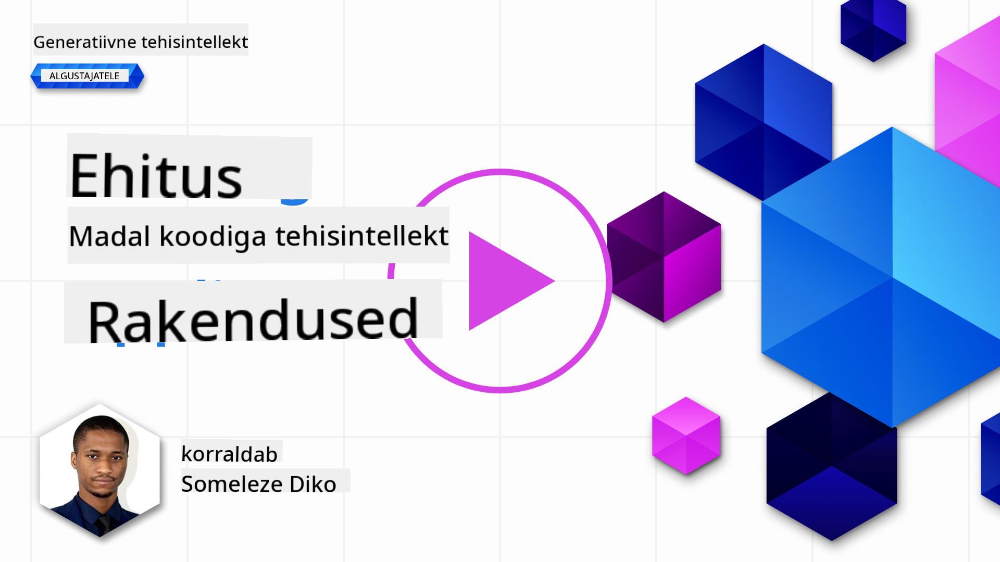
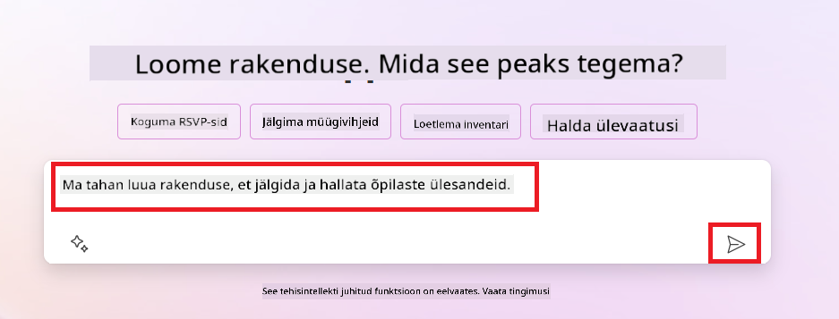
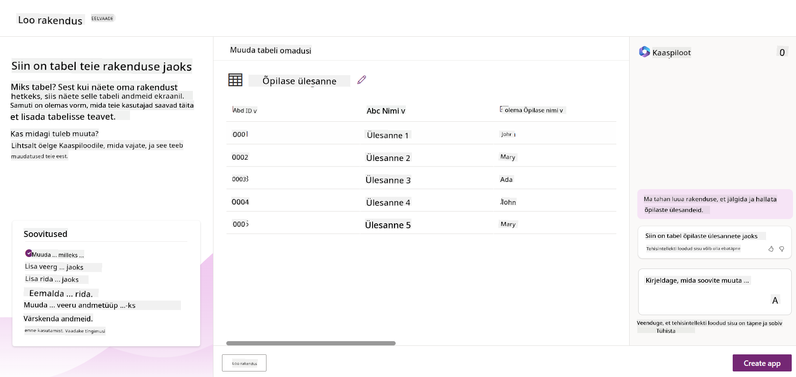
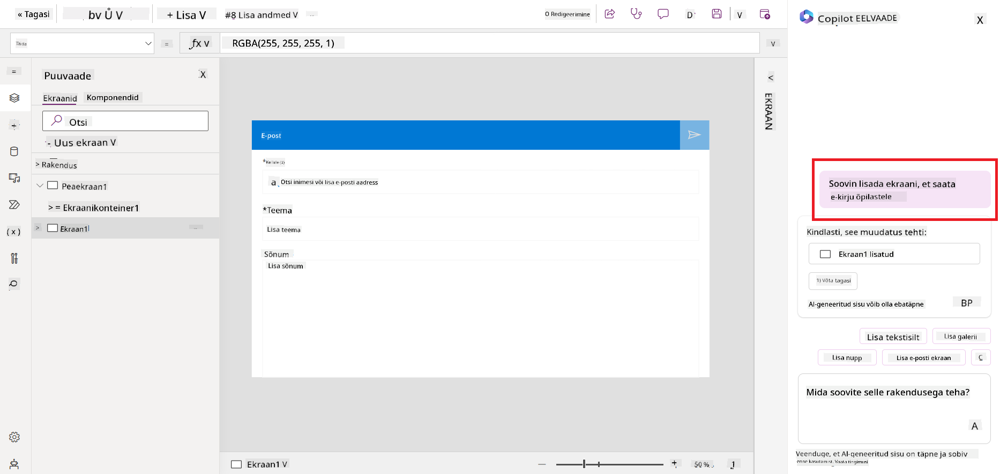
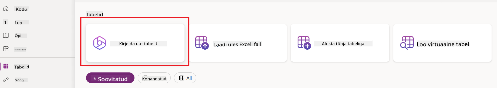
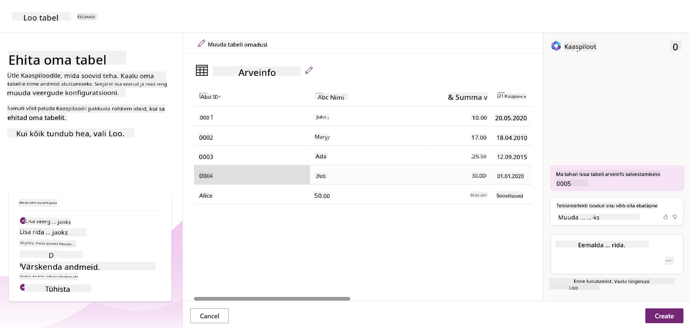
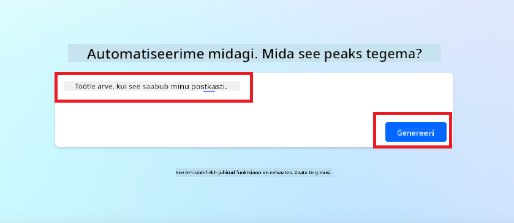
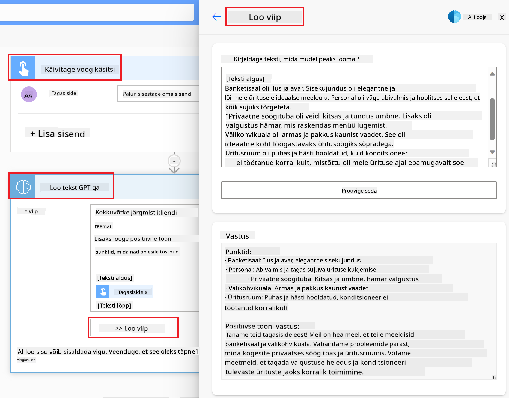

<!--
CO_OP_TRANSLATOR_METADATA:
{
  "original_hash": "846ac8e3b7dcfb697d3309fec05f0fea",
  "translation_date": "2025-10-18T02:53:21+00:00",
  "source_file": "10-building-low-code-ai-applications/README.md",
  "language_code": "et"
}
-->
# Madal koodiga tehisintellekti rakenduste loomine

> _(Klõpsake ülaloleval pildil, et vaadata selle õppetunni videot)_

## Sissejuhatus

Nüüd, kui oleme õppinud, kuidas luua pildigeneratsiooni rakendusi, räägime madalast koodist. Generatiivset tehisintellekti saab kasutada mitmesugustes valdkondades, sealhulgas madala koodiga arenduses, kuid mis on madal kood ja kuidas saame sellele tehisintellekti lisada?

Rakenduste ja lahenduste loomine on muutunud traditsioonilistele arendajatele ja mitte-arendajatele lihtsamaks madala koodiga arendusplatvormide abil. Madala koodiga arendusplatvormid võimaldavad luua rakendusi ja lahendusi vähese või üldse ilma koodita. See saavutatakse visuaalse arenduskeskkonna abil, mis võimaldab rakenduste ja lahenduste loomiseks komponente lohistada ja paigutada. See võimaldab rakendusi ja lahendusi luua kiiremini ja väiksemate ressurssidega. Selles õppetunnis süveneme madala koodiga arendusse ja uurime, kuidas täiustada madala koodiga arendust tehisintellekti abil, kasutades Power Platformi.

Power Platform pakub organisatsioonidele võimalust anda oma meeskondadele võimalus luua oma lahendusi intuitiivses madala koodiga või koodivabas keskkonnas. See keskkond aitab lihtsustada lahenduste loomise protsessi. Power Platformi abil saab lahendusi luua päevade või nädalate jooksul, mitte kuude või aastate jooksul. Power Platform koosneb viiest põhitootest: Power Apps, Power Automate, Power BI, Power Pages ja Copilot Studio.

Selles õppetunnis käsitletakse:

- Generatiivse tehisintellekti tutvustust Power Platformis
- Copiloti tutvustust ja selle kasutamist
- Generatiivse tehisintellekti kasutamist rakenduste ja voogude loomiseks Power Platformis
- AI Builderi abil Power Platformi tehisintellekti mudelite mõistmist

## Õppeeesmärgid

Selle õppetunni lõpuks oskate:

- Mõista, kuidas Copilot töötab Power Platformis.

- Luua õpilaste ülesannete jälgimise rakenduse meie hariduse idufirma jaoks.

- Luua arve töötlemise voo, mis kasutab tehisintellekti arvete andmete eraldamiseks.

- Rakendada parimaid praktikaid GPT tehisintellekti mudeli tekstiloome kasutamisel.

Selles õppetunnis kasutatavad tööriistad ja tehnoloogiad on:

- **Power Apps**, õpilaste ülesannete jälgimise rakenduse jaoks, mis pakub madala koodiga arenduskeskkonda rakenduste loomiseks, et jälgida, hallata ja suhelda andmetega.

- **Dataverse**, õpilaste ülesannete jälgimise rakenduse andmete salvestamiseks, kus Dataverse pakub madala koodiga andmeplatvormi rakenduse andmete salvestamiseks.

- **Power Automate**, arve töötlemise voo jaoks, kus on madala koodiga arenduskeskkond töövoogude loomiseks, et automatiseerida arve töötlemise protsessi.

- **AI Builder**, arve töötlemise tehisintellekti mudeli jaoks, kus kasutatakse eelnevalt loodud tehisintellekti mudeleid meie idufirma arvete töötlemiseks.

## Generatiivne tehisintellekt Power Platformis

Madala koodiga arenduse ja rakenduste täiustamine generatiivse tehisintellektiga on Power Platformi üks peamisi fookusvaldkondi. Eesmärk on võimaldada kõigil luua tehisintellektiga rakendusi, saite, juhtpaneele ja automatiseerida protsesse tehisintellekti abil, _ilma et oleks vaja andmeteaduse ekspertiisi_. See eesmärk saavutatakse generatiivse tehisintellekti integreerimisega madala koodiga arenduskogemusse Power Platformis Copiloti ja AI Builderi kujul.

### Kuidas see töötab?

Copilot on tehisintellekti assistent, mis võimaldab teil luua Power Platformi lahendusi, kirjeldades oma nõudeid loomuliku keele abil vestluslike sammude kaudu. Näiteks saate anda oma tehisintellekti assistendile juhiseid, milliseid välju teie rakendus kasutab, ja see loob nii rakenduse kui ka aluseks oleva andmemudeli. Samuti saate määrata, kuidas seadistada voogu Power Automate'is.

Copiloti juhitud funktsioone saab kasutada rakenduse ekraanidel, et võimaldada kasutajatel vestluslike interaktsioonide kaudu teadmisi avastada.

AI Builder on madala koodiga tehisintellekti võimekus, mis on saadaval Power Platformis ja võimaldab kasutada tehisintellekti mudeleid, et aidata automatiseerida protsesse ja ennustada tulemusi. AI Builderi abil saate tuua tehisintellekti oma rakendustesse ja voogudesse, mis ühenduvad teie andmetega Dataverses või erinevates pilveandmeallikates, nagu SharePoint, OneDrive või Azure.

Copilot on saadaval kõigis Power Platformi toodetes: Power Apps, Power Automate, Power BI, Power Pages ja Power Virtual Agents. AI Builder on saadaval Power Appsis ja Power Automate'is. Selles õppetunnis keskendume sellele, kuidas kasutada Copilotit ja AI Builderit Power Appsis ja Power Automate'is, et luua lahendus meie hariduse idufirma jaoks.

### Copilot Power Appsis

Power Platformi osana pakub Power Apps madala koodiga arenduskeskkonda rakenduste loomiseks, et jälgida, hallata ja suhelda andmetega. See on rakenduste arendamise teenuste komplekt koos skaleeritava andmeplatvormiga ja võimalusega ühendada pilveteenuseid ja kohapealseid andmeid. Power Apps võimaldab luua rakendusi, mis töötavad brauserites, tahvelarvutites ja telefonides ning mida saab jagada kolleegidega. Power Apps lihtsustab kasutajate jaoks rakenduste arendamist lihtsa liidesega, nii et iga ärikasutaja või professionaalne arendaja saab luua kohandatud rakendusi. Rakenduste arendamise kogemust täiustatakse ka generatiivse tehisintellekti abil Copiloti kaudu.

Copiloti tehisintellekti assistendi funktsioon Power Appsis võimaldab teil kirjeldada, millist tüüpi rakendust vajate ja millist teavet soovite, et teie rakendus jälgiks, koguks või kuvaks. Copilot genereerib seejärel teie kirjelduse põhjal reageeriva Canvas-rakenduse. Seejärel saate rakendust oma vajadustele vastavaks kohandada. AI Copilot genereerib ja soovitab ka Dataverse'i tabeli koos vajalike väljadega, et salvestada andmeid, mida soovite jälgida, ja mõned näidisandmed. Selles õppetunnis vaatame hiljem, mis on Dataverse ja kuidas saate seda Power Appsis kasutada. Seejärel saate tabelit kohandada vastavalt oma vajadustele, kasutades AI Copiloti assistendi funktsiooni vestluslike sammude kaudu. See funktsioon on saadaval otse Power Appsi avalehelt.

### Copilot Power Automate'is

Power Platformi osana võimaldab Power Automate kasutajatel luua automatiseeritud töövooge rakenduste ja teenuste vahel. See aitab automatiseerida korduvaid äriprotsesse, nagu suhtlus, andmete kogumine ja otsuste kinnitamine. Selle lihtne liides võimaldab igasuguse tehnilise tasemega kasutajatel (alates algajatest kuni kogenud arendajateni) automatiseerida tööülesandeid. Töövoogude arendamise kogemust täiustatakse ka generatiivse tehisintellekti abil Copiloti kaudu.

Copiloti tehisintellekti assistendi funktsioon Power Automate'is võimaldab teil kirjeldada, millist tüüpi voogu vajate ja milliseid toiminguid soovite, et teie voog teeks. Copilot genereerib seejärel voogu teie kirjelduse põhjal. Seejärel saate voogu oma vajadustele vastavaks kohandada. AI Copilot genereerib ja soovitab ka toiminguid, mida vajate ülesande automatiseerimiseks. Selles õppetunnis vaatame hiljem, mis on vood ja kuidas saate neid Power Automate'is kasutada. Seejärel saate toiminguid kohandada vastavalt oma vajadustele, kasutades AI Copiloti assistendi funktsiooni vestluslike sammude kaudu. See funktsioon on saadaval otse Power Automate'i avalehelt.

## Ülesanne: Halda õpilaste ülesandeid ja arveid meie idufirma jaoks, kasutades Copilotit

Meie idufirma pakub õpilastele veebikursusi. Idufirma on kiiresti kasvanud ja nüüd on neil raske kursuste nõudlusega sammu pidada. Idufirma palkas teid Power Platformi arendajaks, et aidata neil luua madala koodiga lahendus, mis aitaks hallata õpilaste ülesandeid ja arveid. Lahendus peaks aitama neil jälgida ja hallata õpilaste ülesandeid rakenduse kaudu ning automatiseerida arvete töötlemise protsessi töövoo kaudu. Teilt palutakse kasutada generatiivset tehisintellekti lahenduse arendamiseks.

Kui hakkate Copilotit kasutama, saate alustada [Power Platform Copilot Prompt Library](https://github.com/pnp/powerplatform-prompts?WT.mc_id=academic-109639-somelezediko) abil, et tutvuda juhistega. See raamatukogu sisaldab loetelu juhistest, mida saate kasutada Copilotiga rakenduste ja voogude loomiseks. Samuti saate kasutada raamatukogu juhiseid, et saada aimu, kuidas oma nõudeid Copilotile kirjeldada.

### Looge õpilaste ülesannete jälgimise rakendus meie idufirma jaoks

Meie idufirma õpetajatel on olnud raskusi õpilaste ülesannete jälgimisega. Nad on kasutanud tabelarvutust ülesannete jälgimiseks, kuid see on muutunud keeruliseks, kuna õpilaste arv on suurenenud. Nad on palunud teil luua rakenduse, mis aitaks neil õpilaste ülesandeid jälgida ja hallata. Rakendus peaks võimaldama neil lisada uusi ülesandeid, vaadata ülesandeid, uuendada ülesandeid ja kustutada ülesandeid. Rakendus peaks võimaldama ka õpetajatel ja õpilastel vaadata, millised ülesanded on hinnatud ja millised mitte.

Loote rakenduse Copilotiga Power Appsis, järgides alltoodud samme:

1. Minge [Power Appsi](https://make.powerapps.com?WT.mc_id=academic-105485-koreyst) avalehele.

1. Kasutage avalehel olevat tekstiala, et kirjeldada rakendust, mida soovite luua. Näiteks **_Soovin luua rakenduse õpilaste ülesannete jälgimiseks ja haldamiseks_**. Klõpsake nuppu **Saada**, et saata juhis AI Copilotile.

1. AI Copilot soovitab Dataverse'i tabelit koos vajalike väljadega, et salvestada andmeid, mida soovite jälgida, ja mõned näidisandmed. Seejärel saate tabelit kohandada vastavalt oma vajadustele, kasutades AI Copiloti assistendi funktsiooni vestluslike sammude kaudu.

   > **Oluline**: Dataverse on Power Platformi aluseks olev andmeplatvorm. See on madala koodiga andmeplatvorm rakenduse andmete salvestamiseks. See on täielikult hallatav teenus, mis salvestab andmeid turvaliselt Microsofti pilves ja on teie Power Platformi keskkonnas ette nähtud. Sellega kaasnevad sisseehitatud andmehalduse võimalused, nagu andmete klassifikatsioon, andmete päritolu, peeneteraline juurdepääsukontroll ja palju muud. Lisateavet Dataverse'i kohta leiate [siit](https://docs.microsoft.com/powerapps/maker/data-platform/data-platform-intro?WT.mc_id=academic-109639-somelezediko).

   

1. Õpetajad soovivad saata e-kirju õpilastele, kes on oma ülesanded esitanud, et hoida neid kursis nende ülesannete edenemisega. Saate kasutada Copilotit, et lisada tabelisse uus väli õpilaste e-posti aadressi salvestamiseks. Näiteks saate kasutada järgmist juhist, et lisada tabelisse uus väli: **_Soovin lisada veeru õpilaste e-posti aadressi salvestamiseks_**. Klõpsake nuppu **Saada**, et saata juhis AI Copilotile.

1. AI Copilot genereerib uue välja ja seejärel saate välja oma vajadustele vastavaks kohandada.

1. Kui olete tabeliga valmis, klõpsake nuppu **Loo rakendus**, et rakendus luua.

1. AI Copilot genereerib teie kirjelduse põhjal reageeriva Canvas-rakenduse. Seejärel saate rakendust oma vajadustele vastavaks kohandada.

1. Selleks, et õpetajad saaksid õpilastele e-kirju saata, saate kasutada Copilotit, et lisada rakendusele uus ekraan. Näiteks saate kasutada järgmist juhist, et lisada rakendusele uus ekraan: **_Soovin lisada ekraani õpilastele e-kirjade saatmiseks_**. Klõpsake nuppu **Saada**, et saata juhis AI Copilotile.

1. AI Copilot genereerib uue ekraani ja seejärel saate ekraani oma vajadustele vastavaks kohandada.

1. Kui olete rakendusega valmis, klõpsake nuppu **Salvesta**, et rakendus salvestada.

1. Rakenduse õpetajatega jagamiseks klõpsake nuppu **Jaga** ja seejärel klõpsake uuesti nuppu **Jaga**. Seejärel saate rakenduse õpetajatega jagada, sisestades nende e-posti aadressid.

> **Teie kodutöö**: Rakendus, mille te just lõite, on hea algus, kuid seda saab täiustada. E-posti funktsiooni puhul saavad õpetajad õpilastele e-kirju saata ainult käsitsi, sisestades nende e-posti aadressid. Kas saate kasutada Copilotit, et luua automatiseerimine, mis võimaldab õpetajatel õpilastele e-kirju automaatselt saata, kui nad oma ülesanded esitavad? Teie vihje: õige juhisega saate kasutada Copilotit Power Automate'is, et seda luua.

### Looge meie idufirma jaoks arvete andmetabel

Meie idufirma finantsmeeskonnal on olnud raskusi arvete jälgimisega. Nad on kasutanud tabelarvutust arvete jälgimiseks, kuid see on muutunud keeruliseks, kuna arvete arv on suurenenud. Nad on palunud teil luua tabeli, mis aitaks neil salvestada, jälgida ja hallata saadud arvete teavet. Tabelit tuleks kasutada automatiseerimise loomiseks, mis eraldab kõik arvete andmed ja salvestab need tabelisse. Tabel peaks võimaldama finantsmeeskonnal vaadata arveid, mis on tasutud, ja neid, mis ei ole tasutud.

Power Platformil on aluseks olev andmeplatvorm nimega Dataverse, mis võimaldab salvestada andmeid teie rakenduste ja lahenduste jaoks. Dataverse pakub madala koodiga andmeplatvormi rakenduse andmete salvestamiseks. See on täielikult hallatav teenus, mis salvestab andmeid turvaliselt Microsofti pilves ja on teie Power Platformi keskkonnas ette nähtud. Sellega kaasnevad sisseehitatud andmehalduse võimalused, nagu andmete klassifikatsioon, andmete päritolu, peeneteraline juurdepääsukontroll ja palju muud. Lisateavet [Dataverse'i kohta leiate siit](https://docs.microsoft.com/powerapps/maker/data-platform/data-platform-intro?WT.mc_id=academic-109639-somelezediko).
Miks peaksime kasutama Dataverse'i oma idufirma jaoks? Dataverse'i standardsed ja kohandatud tabelid pakuvad turvalist ja pilvepõhist andmesalvestusvõimalust. Tabelid võimaldavad salvestada erinevat tüüpi andmeid, sarnaselt sellele, kuidas kasutate mitut töölehte ühes Exceli töövihikus. Tabeleid saab kasutada andmete salvestamiseks, mis on spetsiifilised teie organisatsiooni või ärivajaduste jaoks. Mõned eelised, mida meie idufirma Dataverse'i kasutamisest saab, hõlmavad muu hulgas järgmist:

- **Lihtne hallata**: Nii metaandmed kui ka andmed salvestatakse pilves, seega ei pea te muretsema selle pärast, kuidas neid hallatakse või salvestatakse. Saate keskenduda oma rakenduste ja lahenduste loomisele.

- **Turvaline**: Dataverse pakub turvalist ja pilvepõhist andmesalvestusvõimalust. Saate kontrollida, kes pääseb teie tabelites olevatele andmetele ligi ja kuidas nad sellele ligi pääsevad, kasutades rollipõhist turvalisust.

- **Rikkalikud metaandmed**: Andmetüüpe ja seoseid kasutatakse otse Power Appsis.

- **Loogika ja valideerimine**: Saate kasutada ärireegleid, arvutatud välju ja valideerimisreegleid, et rakendada äriloogikat ja säilitada andmete täpsust.

Nüüd, kui teate, mis on Dataverse ja miks peaksite seda kasutama, vaatame, kuidas saate Copilot'i abil luua Dataverse'is tabeli, mis vastab meie finantsmeeskonna nõuetele.

> **Note**: Kasutate seda tabelit järgmises osas, et luua automatiseerimine, mis eraldab kõik arveandmed ja salvestab need tabelisse.

Tabeli loomiseks Dataverse'is Copilot'i abil järgige alltoodud samme:

1. Minge [Power Apps](https://make.powerapps.com?WT.mc_id=academic-105485-koreyst) avalehele.

2. Vasakpoolses navigeerimisribal valige **Tables** ja klõpsake **Describe the new Table**.

3. **Describe the new Table** ekraanil kasutage tekstiala, et kirjeldada tabelit, mida soovite luua. Näiteks: **_Soovin luua tabeli arveandmete salvestamiseks_**. Klõpsake **Send** nuppu, et saata päring AI Copilot'ile.

4. AI Copilot soovitab Dataverse'i tabelit koos vajalike väljadega, et salvestada andmeid, mida soovite jälgida, ja lisab näidisandmeid. Seejärel saate tabelit kohandada vastavalt oma vajadustele, kasutades AI Copilot'i abifunktsiooni vestluse kaudu.

5. Finantsmeeskond soovib saata tarnijale e-kirja, et teavitada neid arve praegusest olekust. Saate kasutada Copilot'i, et lisada tabelisse uus väli tarnija e-posti salvestamiseks. Näiteks saate kasutada järgmist päringut, et lisada tabelisse uus väli: **_Soovin lisada veeru tarnija e-posti salvestamiseks_**. Klõpsake **Send** nuppu, et saata päring AI Copilot'ile.

6. AI Copilot genereerib uue välja ja seejärel saate välja kohandada vastavalt oma vajadustele.

7. Kui olete tabeliga valmis, klõpsake **Create** nuppu, et tabel luua.

## AI mudelid Power Platformis koos AI Builderiga

AI Builder on madala koodiga AI võimekus, mis on saadaval Power Platformis ja võimaldab teil kasutada AI mudeleid, et aidata automatiseerida protsesse ja ennustada tulemusi. AI Builderiga saate tuua AI oma rakendustesse ja voogudesse, mis ühenduvad teie andmetega Dataverse'is või erinevates pilveandmeallikates, nagu SharePoint, OneDrive või Azure.

## Eelvalmistatud AI mudelid vs Kohandatud AI mudelid

AI Builder pakub kahte tüüpi AI mudeleid: eelvalmistatud AI mudelid ja kohandatud AI mudelid. Eelvalmistatud AI mudelid on valmis kasutamiseks ja treenitud Microsofti poolt ning saadaval Power Platformis. Need aitavad teil lisada intelligentsust oma rakendustesse ja voogudesse, ilma et peaksite andmeid koguma ja seejärel oma mudeleid looma, treenima ja avaldama. Neid mudeleid saab kasutada protsesside automatiseerimiseks ja tulemuste ennustamiseks.

Mõned eelvalmistatud AI mudelid, mis on saadaval Power Platformis, hõlmavad:

- **Oluliste fraaside tuvastamine**: See mudel tuvastab tekstist olulised fraasid.
- **Keele tuvastamine**: See mudel tuvastab teksti keele.
- **Sentimendi analüüs**: See mudel tuvastab tekstis positiivse, negatiivse, neutraalse või segatud sentimendi.
- **Visiitkaardi lugeja**: See mudel eraldab visiitkaartidelt teavet.
- **Teksti tuvastamine**: See mudel eraldab pilte tekstist.
- **Objektide tuvastamine**: See mudel tuvastab ja eraldab pilte objekte.
- **Dokumentide töötlemine**: See mudel eraldab vormidelt teavet.
- **Arvete töötlemine**: See mudel eraldab arvetelt teavet.

Kohandatud AI mudelitega saate tuua oma mudeli AI Builderisse, et see toimiks nagu iga AI Builderi kohandatud mudel, võimaldades teil mudelit treenida oma andmetega. Neid mudeleid saab kasutada protsesside automatiseerimiseks ja tulemuste ennustamiseks nii Power Appsis kui ka Power Automates. Oma mudeli kasutamisel kehtivad teatud piirangud. Lisateavet nende [piirangute kohta](https://learn.microsoft.com/ai-builder/byo-model#limitations?WT.mc_id=academic-105485-koreyst).

## Ülesanne #2 - Loo arve töötlemise voog meie idufirma jaoks

Finantsmeeskonnal on olnud raskusi arvete töötlemisega. Nad on kasutanud arvutustabelit arvete jälgimiseks, kuid see on muutunud keeruliseks, kuna arvete arv on suurenenud. Nad on palunud teil luua töövoo, mis aitaks neil arveid AI abil töödelda. Töövoog peaks võimaldama neil arvetelt teavet eraldada ja salvestada see Dataverse'i tabelisse. Töövoog peaks võimaldama neil saata e-kirja finantsmeeskonnale koos eraldatud teabega.

Nüüd, kui teate, mis on AI Builder ja miks peaksite seda kasutama, vaatame, kuidas saate kasutada AI Builderi arve töötlemise AI mudelit, mida käsitlesime varem, et luua töövoog, mis aitab finantsmeeskonnal arveid töödelda.

Töövoo loomiseks, mis aitab finantsmeeskonnal arveid töödelda, kasutades AI Builderi arve töötlemise AI mudelit, järgige alltoodud samme:

1. Minge [Power Automate](https://make.powerautomate.com?WT.mc_id=academic-105485-koreyst) avalehele.

2. Kasutage avalehel olevat tekstiala, et kirjeldada töövoogu, mida soovite luua. Näiteks: **_Töötle arvet, kui see saabub minu postkasti_**. Klõpsake **Send** nuppu, et saata päring AI Copilot'ile.

   

3. AI Copilot soovitab toiminguid, mida vajate ülesande automatiseerimiseks. Saate klõpsata **Next** nupul, et liikuda järgmistele sammudele.

4. Järgmises etapis palub Power Automate teil seadistada voo jaoks vajalikud ühendused. Kui olete valmis, klõpsake **Create flow** nuppu, et voog luua.

5. AI Copilot genereerib voo ja seejärel saate voogu kohandada vastavalt oma vajadustele.

6. Uuendage voo käivitajat ja määrake **Folder** kaustaks, kuhu arved salvestatakse. Näiteks saate määrata kaustaks **Inbox**. Klõpsake **Show advanced options** ja määrake **Only with Attachments** väärtuseks **Yes**. See tagab, et voog käivitub ainult siis, kui kausta saabub e-kiri koos manusega.

7. Eemaldage voost järgmised toimingud: **HTML to text**, **Compose**, **Compose 2**, **Compose 3** ja **Compose 4**, kuna te ei kasuta neid.

8. Eemaldage voost **Condition** toiming, kuna te ei kasuta seda. See peaks välja nägema nagu järgmine ekraanipilt:

   

9. Klõpsake **Add an action** nuppu ja otsige **Dataverse**. Valige **Add a new row** toiming.

10. **Extract Information from invoices** toimingus uuendage **Invoice File**, et see osutaks e-kirja **Attachment Content**-ile. See tagab, et voog eraldab teavet arve manusest.

11. Valige varem loodud **Table**. Näiteks saate valida **Invoice Information** tabeli. Valige eelmisest toimingust dünaamiline sisu, et täita järgmised väljad:

    - ID
    - Summa
    - Kuupäev
    - Nimi
    - Olek - Määrake **Status** väärtuseks **Pending**.
    - Tarnija e-post - Kasutage **From** dünaamilist sisu **When a new email arrives** käivitajast.

    

12. Kui olete vooga valmis, klõpsake **Save** nuppu, et voog salvestada. Seejärel saate voogu testida, saates e-kirja koos arvega kausta, mille määrasite käivitajas.

> **Teie kodutöö**: Voo, mille just ehitasite, on hea algus, nüüd peate mõtlema, kuidas saaksite luua automatiseerimise, mis võimaldab meie finantsmeeskonnal saata tarnijale e-kirja, et teavitada neid arve praegusest olekust. Teie vihje: voog peab käivituma, kui arve olek muutub.

## Teksti genereerimise AI mudeli kasutamine Power Automates

AI Builderi Create Text with GPT AI mudel võimaldab teil genereerida teksti vastavalt päringule ja seda toetab Microsoft Azure OpenAI teenus. Selle võimekuse abil saate integreerida GPT (Generative Pre-Trained Transformer) tehnoloogiat oma rakendustesse ja voogudesse, et luua mitmesuguseid automatiseeritud vooge ja informatiivseid rakendusi.

GPT mudelid läbivad ulatusliku treeningu suurel hulgal andmetel, mis võimaldab neil toota teksti, mis sarnaneb inimkeelele, kui neile esitatakse päring. Kui integreerida töövoo automatiseerimisega, saab AI mudeleid nagu GPT kasutada mitmesuguste ülesannete sujuvamaks muutmiseks ja automatiseerimiseks.

Näiteks saate luua vooge, mis genereerivad automaatselt teksti erinevateks kasutusjuhtudeks, nagu e-kirjade mustandid, tootekirjeldused ja palju muud. Samuti saate mudelit kasutada teksti genereerimiseks erinevates rakendustes, nagu vestlusrobotid ja klienditeenindusrakendused, mis võimaldavad klienditeenindajatel tõhusalt ja tulemuslikult klientide päringutele vastata.

Et õppida, kuidas seda AI mudelit Power Automates kasutada, minge läbi [Add intelligence with AI Builder and GPT](https://learn.microsoft.com/training/modules/ai-builder-text-generation/?WT.mc_id=academic-109639-somelezediko) mooduli.

## Suurepärane töö! Jätkake õppimist

Pärast selle õppetunni lõpetamist tutvuge meie [Generative AI Learning collection](https://aka.ms/genai-collection?WT.mc_id=academic-105485-koreyst), et jätkata oma generatiivse AI teadmiste arendamist!

Liikuge edasi 11. õppetundi, kus vaatame, kuidas [integreerida generatiivset AI-d funktsioonide kutsumisega](../11-integrating-with-function-calling/README.md?WT.mc_id=academic-105485-koreyst)!

---

**Lahtiütlus**:  
See dokument on tõlgitud AI tõlketeenuse [Co-op Translator](https://github.com/Azure/co-op-translator) abil. Kuigi püüame tagada täpsust, palume arvestada, et automaatsed tõlked võivad sisaldada vigu või ebatäpsusi. Algne dokument selle algses keeles tuleks pidada autoriteetseks allikaks. Olulise teabe puhul soovitame kasutada professionaalset inimtõlget. Me ei vastuta arusaamatuste või valesti tõlgenduste eest, mis võivad tekkida selle tõlke kasutamise tõttu.