# Madala koodiga tehisintellekti rakenduste loomine

[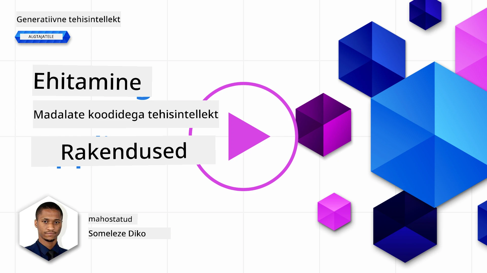](https://youtu.be/1vzq3Nd8GBA?si=h6LHWJXdmqf6mhDg)

> _(Video vaatamiseks klõpsake ülaloleval pildil)_

## Sissejuhatus

Nüüd, kui me oleme õppinud, kuidas luua pildi genereerimise rakendusi, räägime madalast koodist. Generatiivset tehisintellekti saab kasutada mitmetes erinevates valdkondades, sealhulgas madal koodiga arenduses, kuid mis on madal kood ja kuidas saame sinna tehisintellekti lisada?

Rakenduste ja lahenduste loomine on traditsiooniliste arendajate ja mittearendajate jaoks muutunud lihtsamaks tänu Madala Koodi Arendusplatvormidele. Madala koodi arendusplatvormid võimaldavad teil luua rakendusi ja lahendusi vähese või üldse mitte mingis koodita. See saavutatakse visuaalse arenduskeskkonna pakkumisega, mis võimaldab komponentide lohistamist ja langetamist rakenduste ja lahenduste ehitamiseks. See võimaldab arendajatel luua rakendusi ja lahendusi kiiremini ja vähemate ressursidega. Selles õppetükis uurime põhjalikult, kuidas kasutada madalat koodi ning kuidas täiustada madala koodi arendust tehisintellekti abil Power Platformi kaudu.

Power Platform annab organisatsioonidele võimaluse anda oma meeskondadele võimu luua oma lahendusi intuitiivse madala või nullkoodiga keskkonna kaudu. See keskkond lihtsustab lahenduste loomise protsessi. Power Platform abil saab lahendusi luua päevade või nädalatega, mitte kuude või aastatega. Power Platform koosneb viiest põhitooteist: Power Apps, Power Automate, Power BI, Power Pages ja Copilot Studio.

Selles õppetükis käsitletakse:

- Sissejuhatus generatiivsesse tehisintellekti Power Platformis
- Sissejuhatus Copiloti ja selle kasutamisse
- Generatiivse tehisintellekti kasutamine rakenduste ja voogude loomiseks Power Platformis
- Tehisintellektimudelite mõistmine Power Platformis AI Builderiga
- Nutikate agentide loomine Microsoft Copilot Studioga

## Õpieesmärgid

Selle õppetüki lõpetamisel saate:

- Mõista, kuidas Copilot töötab Power Platformis.

- Luua meie haridusettevõtte jaoks õpilaste ülesannete jälgimise rakenduse.

- Luua arvete töötlemise voog, mis kasutab tehisintellekti arvete info väljavõtmiseks.

- Rakendada parimaid tavasid GPT mudeli Create Text kasutamisel.

- Mõista, mis on Microsoft Copilot Studio ja kuidas selle abil nutikaid agente luua.

Selle õppetüki tööriistad ja tehnoloogiad on:

- **Power Apps**, õpilaste ülesannete jälgimise rakenduseks, mis pakub madala koodi arenduskeskkonda rakenduste loomiseks andmete jälgimiseks, haldamiseks ja nendega suhtlemiseks.

- **Dataverse**, õpilaste ülesannete jälgimise rakenduse andmete salvestamiseks, mis võimaldab madala koodi andmeplatvormi rakenduse andmete hoidmiseks.

- **Power Automate**, arvete töötlemise voo loomiseks, kus teil on madala koodi arenduskeskkond töövoogude loomiseks arvete töötlemise protsessi automatiseerimiseks.

- **AI Builder**, arvete töötlemise tehisintellekti mudeliks, kus kasutate eelnevalt ehitatud tehisintellekti mudeleid arvete töötlemiseks meie ettevõttes.

## Generatiivne tehisintellekt Power Platformis

Madala koodi arenduse ja rakenduste täiustamine generatiivse tehisintellektiga on Power Platformi üks peamisi fookusvaldkondi. Eesmärk on võimaldada kõigil luua tehisintellektiga rakendusi, veebisaite, juhtpaneele ja automatiseerida protsesse tehisintellekti abil, _ilma andmeteaduse ekspertiisi nõudmata_. Seda eesmärki toetab generatiivse tehisintellekti integreerimine madala koodi arenduskogemusse Power Platformis Copiloti ja AI Builderi vormis.

### Kuidas see toimib?

Copilot on tehisintellekti assistent, mis võimaldab teil ehitada Power Platformi lahendusi, kirjeldades oma nõudeid looduslikus keeles vestluslike sammude kaupa. Näiteks võite paluda oma tehisintellekti assistendil öelda, milliseid välju teie rakendus kasutab, ja see loob nii rakenduse kui ka aluseks oleva andmemudeli, või võite täpsustada, kuidas panna voog tööle Power Automatessa.

Võite kasutada Copiloti juhitud funktsioone oma rakenduste ekraanidel, et võimaldada kasutajatel läbi vestluse avastada teadmisi.

AI Builder on madala koodi tehisintellekti võimekus Power Platformis, mis võimaldab kasutajal kasutada tehisintellekti mudeleid protsesside automatiseerimiseks ja tulemuste ennustamiseks. AI Builderiga saate tuua tehisintellekti oma rakendustesse ja voogudesse, mis ühenduvad teie andmetega Dataverse'is või erinevates pilvandmetallikates, nagu SharePoint, OneDrive või Azure.

Copilot on saadaval kõigis Power Platformi toodetes: Power Apps, Power Automate, Power BI, Power Pages ja Copilot Studio (endine Power Virtual Agents). AI Builder on saadaval Power Appsis ja Power Automates. Selles õppetükis keskendume Copiloti ja AI Builderi kasutamisele Power Appsis ja Power Automates, et luua lahendus meie haridusettevõttele.

### Copilot Power Appsis

Power Apps on osa Power Platformist ja pakub madala koodi arenduskeskkonda rakenduste loomiseks, mis jälgivad, haldavad ja suhtlevad andmetega. See on rakenduste arendusteenuste komplekt, millel on skaleeritav andmeplatvorm ja võimalus ühenduda pilveteenuste ning kohapealsete andmetega. Power Apps võimaldab luua rakendusi, mis töötavad brauserites, tahvelarvutites ja telefonides ning mida saab jagada kolleegidega. Power Apps teeb rakenduste loomise lihtsaks lihtsa kasutajaliidese abil, nii et iga ärikasutaja või professionaalne arendaja saab luua kohandatud rakendusi. Rakenduste arenduskogemust täiustatakse ka Generatiivse tehisintellekti kaudu Copiloti abil.

Copiloti tehisintellekti assistendi funktsioon Power Appsis võimaldab teil kirjeldada, millist tüüpi rakendust vajate ja millist teavet soovite, et teie rakendus jälgiks, koguks või kuvaks. Copilot genereerib seejärel teie kirjelduse põhjal reageeriva Canvas-rakenduse. Seejärel saate rakendust vastavalt oma vajadustele kohandada. AI Copilot genereerib ja soovitab ka Dataverse'i tabelit koos väljadega, mis on vajalikud jälgitava andmete salvestamiseks, ning mõnd näidisandmeid. Selles õppetükis vaatleme hiljem, mis on Dataverse ja kuidas seda Power Appsis kasutada. Seejärel saate tabelit AI Copiloti assistendi funktsiooni abil vestluslike sammude kaudu kohandada. See funktsioon on hõlpsasti ligipääsetav Power Apps'i avalehelt.

### Copilot Power Automates

Power Automate on osa Power Platformist ja võimaldab kasutajatel luua automatiseeritud töövooge rakenduste ja teenuste vahel. See aitab automatiseerida korduvaid äriprotsesse nagu suhtlus, andmete kogumine ja otsuste kinnitamine. Selle lihtne liides võimaldab erineva tehnilise tasemega kasutajatel (algajatest kogenud arendajateni) tööülesandeid automatiseerida. Töövoogude arenduskogemust täiustatakse ka Generatiivse tehisintellekti kaudu Copiloti abil.

Copiloti tehisintellekti assistendi funktsioon Power Automates võimaldab teil kirjeldada, millist tüüpi voogu vajate ja milliseid toiminguid soovite, et teie voog täidaks. Copilot genereerib teie kirjelduse põhjal voogu. Seejärel saate voogu vastavalt oma vajadustele kohandada. AI Copilot genereerib ja soovitab ka toiminguid, mis on vajalikud teie automatiseeritava ülesande täitmiseks. Selles õppetükis vaatleme hiljem, mis on töövood ja kuidas neid Power Automates kasutada. Seejärel saate toiminguid AI Copiloti assistendi funktsiooni kaudu vestluslike sammude abil kohandada. See funktsioon on hõlpsasti ligipääsetav Power Automate'i avalehelt.

## Nutikate agentide loomine Microsoft Copilot Studioga

[Microsoft Copilot Studio](https://learn.microsoft.com/microsoft-copilot-studio/fundamentals-what-is-copilot-studio?WT.mc_id=academic-105485-koreyst) (endine Power Virtual Agents) on Power Platformi madala koodi liige, mis võimaldab luua **tehisintellekti agente** — vestluslikke copilote, kes saavad vastata küsimustele, võtta vastu toiminguid ja automatiseerida kasutajate nimel ülesandeid. Nii nagu ülejäänud Power Platformis, ehitate neid agente visuaalses, esmalt loomuliku keele kogemuses: kirjeldage, mida soovite agendilt, ja Copilot Studio aitab üles ehitada selle juhiseid, teadmisi ja toiminguid.

Meie haridusettevõtte jaoks võiksite luua agendi, kes vastab õpilaste küsimustele kursuste kohta, kontrollib ülesannete tähtaegu ja saadab isegi õpetajale e-kirja — kõik ilma koodi kirjutamata.

Siin on mõned viimased võimed, mis muudavad Copilot Studio võimsaks:

- **Generatiivsed vastused teie teadmistest**. Kõik vestlused ei pea olema käsitsi kirjutatud, saate ühendada **teadmiste allikad** — avalikud veebisaidid, SharePoint, OneDrive, Dataverse, üleslaaditud failid või ettevõtte andmed läbi ühenduste — ja agent genereerib vastuseid nendest allikatest lähtuvalt.

- **Generatiivne orkestreerimine**. Selle asemel, et tugineda jäikadele päästikfraasidele, kasutab agent AI-d, et mõista päringut ja dünaamiliselt otsustada, milliseid teadmisi, teemasid ja toiminguid selle täitmiseks kombineerida, sh mitme sammu omavaheline ühendamine.

- **Toimingud ja ühendused**. Agendid ei pea ainult vestlema. Neile saab anda toiminguid, mida toetab üle 1500 eelnevalt ehitatud Power Platformi ühenduse, Power Automate töövoolud, kohandatud REST API-d, juhised või **Model Context Protocol (MCP)** serverid.

- **Autonoomsed agendid**. Agendid ei piirdu vestlusaknas vastamisega. Võite luua **autonoomseid agente**, keda käivitavad sündmused — näiteks uus e-kiri, uus kirje Dataverse'is või faili üleslaadimine — ja kes tegutsevad taustal ülesande täitmiseks.

- **Mitme agendi orkestreerimine**. Agendid saavad kutsuda teisi agente. Copilot Studio agent saab üle anda või olla teise agendi poolt laiendatud, sealhulgas Microsoft 365 Copiloti avaldatud ja Microsoft Foundrys loodud agentide poolt.

- **Mudelite valik**. Sisseehitatud mudelite kõrval saate tuua mudeleid Microsoft Foundry mudelikataloogist, et kohandada, kuidas teie agent põhjendab ja vastab.

- **Avalda kõikjal**. Kui agent on loodud, saab selle avaldada mitmetes kanalites — Microsoft Teams, Microsoft 365 Copilot, veebisaitidel või kohandatud rakendustes — ja turvalisust, autentimist ja analüütikat haldatakse Power Platformi administraatori kogemuse kaudu.

Alustage esimese agendi loomist aadressil [copilotstudio.microsoft.com](https://copilotstudio.microsoft.com?WT.mc_id=academic-105485-koreyst) ja lisateavet leiate [Microsoft Copilot Studio dokumentatsioonist](https://learn.microsoft.com/microsoft-copilot-studio/?WT.mc_id=academic-105485-koreyst).

## Ülesanne: õpilaste ülesannete ja arvete haldamine meie ettevõttele, kasutades Copilotit

Meie idufirma pakub veebikursuseid õpilastele. Ettevõte on kiiresti kasvanud ja nüüd on raske kursuste nõudlusega sammu pidada. Nad on teid palganud Power Platformi arendajana, et aidata neil luua madala koodi lahendus õpilaste ülesannete ja arvete haldamiseks. Nende lahendus peaks aitama jälgida ja hallata õpilaste ülesandeid rakenduse kaudu ja automatiseerima arvete töötlemise protsessi töövoo läbi. Teil palutakse kasutada generatiivset tehisintellekti lahenduse arendamiseks.

Copiloti kasutamise alustamisel võite testida [Power Platform Copilot Prompt Library](https://github.com/pnp/powerplatform-prompts?WT.mc_id=academic-109639-somelezediko), et alustada oma promptide koostamist. See kogu sisaldab loendit promptidest, mida saate kasutada rakenduste ja voogude loomiseks Copiloti abil. Võite samuti neid promptesid kasutada, et saada aimu, kuidas oma nõudeid Copilotile kirjeldada.

### Looge õpilaste ülesannete jälgimise rakendus meie ettevõttele

Meie haridusettevõtte õpetajad on raskustes õpilaste ülesannete jälgimisega. Nad on kasutanud ülesannete jälgimiseks tabelarvutust, kuid see on muutunud raskesti hallatavaks õpilaste arvu suurenedes. Nad on palunud teil luua rakendus, mis aitab neil õpilaste ülesandeid jälgida ja hallata. Rakendus peaks võimaldama lisada uusi ülesandeid, vaadata ülesandeid, uuendada ja kustutada ülesandeid. Rakendus peaks võimaldama õpetajatel ja õpilastel vaadata, millised ülesanded on hinnatud ja millised mitte.

Rakenduse loomiseks kasutate Copiloti Power Appsis järgmiselt:

1. Minge [Power Apps](https://make.powerapps.com?WT.mc_id=academic-105485-koreyst) avalehele.

1. Kasutage avalehel tekstiala, et kirjeldada rakendust, mida soovite luua. Näiteks **_Ma tahan luua rakenduse õpilaste ülesannete jälgimiseks ja haldamiseks_**. Klõpsake nuppu **Saada**, et saata prompt AI Copilotile.

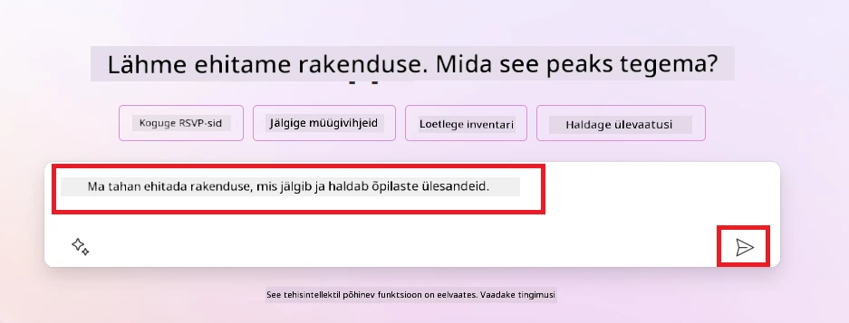

1. AI Copilot soovitab Dataverse'i tabelit koos väljadega, mida vajate jälgitava info salvestamiseks ja mõned näidisandmed. Seejärel saate tabelit AI Copiloti assistendi funktsiooni kaudu vestluslike sammude abil kohandada vastavalt oma vajadustele.

   > **Oluline**: Dataverse on Power Platformi aluseks olev andmeplatvorm. See on madala koodi andmeplatvorm rakenduse andmete salvestamiseks. See on täielikult hallatav teenus, mis hoiab andmeid turvaliselt Microsofti pilves ja mis on teie Power Platformi keskkonnas käivitatud. See sisaldab sisseehitatud andmehaldustegevusi, nagu andmete klassifitseerimine, andmete jälgitavus, peenhäälestatud juurdepääsukontroll jms. Rohkem infot leiate [siit](https://docs.microsoft.com/powerapps/maker/data-platform/data-platform-intro?WT.mc_id=academic-109639-somelezediko).

   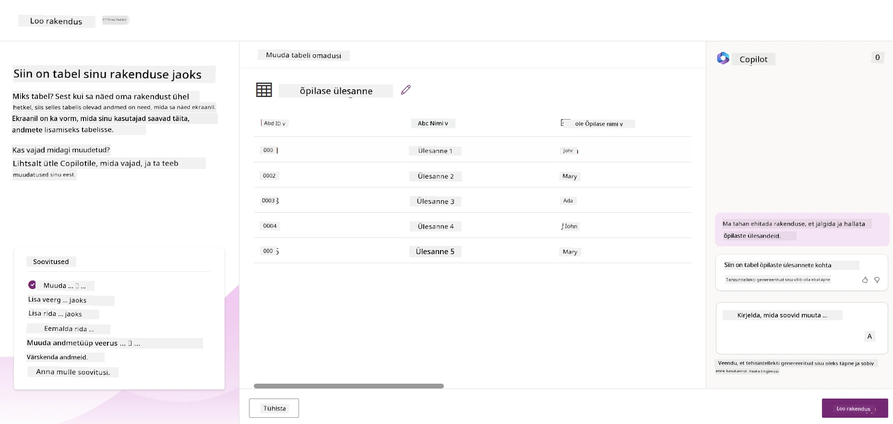

1. Õpetajad soovivad saata e-kirju neile õpilastele, kes on esitanud oma ülesanded, et neid kursis hoida nende ülesannete edenemisega. Võite kasutada Copiloti, et lisada tabelile uus väli õpilase e-posti salvestamiseks. Näiteks võite kasutada järgmist prompti: **_Ma tahan lisada veeru, kuhu salvestada õpilase e-posti_**. Klõpsake nuppu **Saada**, et prompt Copilotile saata.

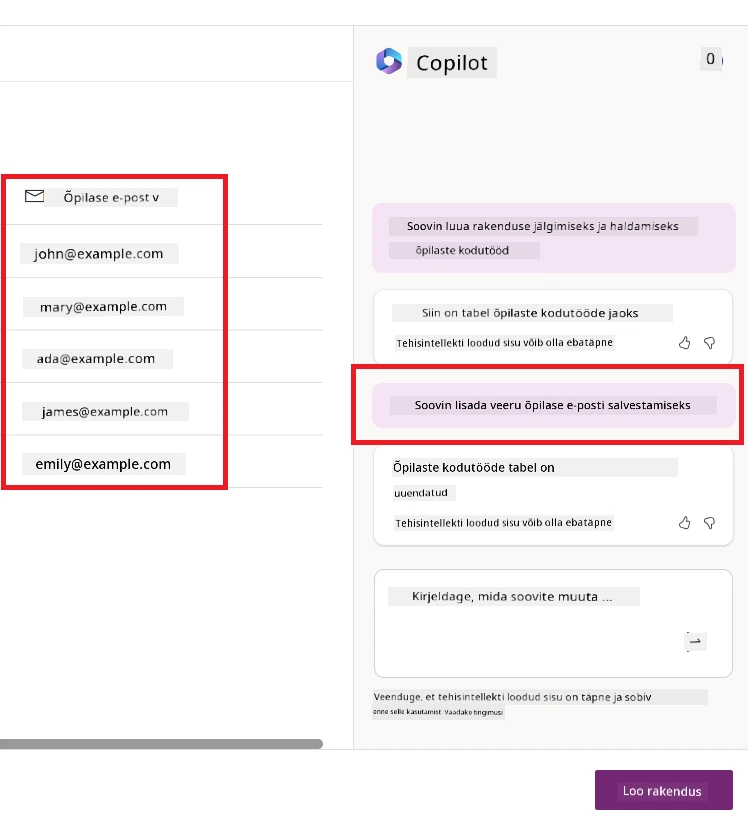

1. AI Copilot loob uue välja ja seejärel saate välja vastavalt oma vajadustele kohandada.

1. Kui tabel on valmis, klõpsake rakenduse loomiseks nuppu **Loo rakendus**.

1. AI Copilot genereerib teie kirjelduse põhjal reageeriva Canvas-rakenduse. Seejärel saate rakendust vastavalt oma vajadustele kohandada.

1. Õpetajate jaoks, kes soovivad saata õpilastele e-kirju, saate Copiloti abil rakendusse lisada uue ekraani. Näiteks võite kasutada järgmise sisendi: **_Soovin lisada ekraani, et saata õpilastele e-kirju_**. Klõpsake nuppu **Saada**, et saata päring AI Copilotile.

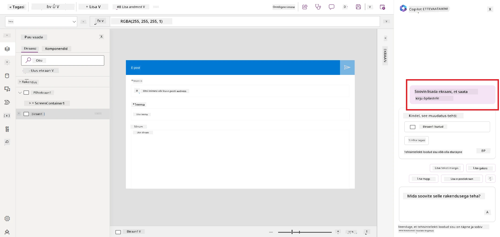

1. AI Copilot loob uue ekraani, mida saate seejärel vastavalt oma vajadustele kohandada.

1. Kui rakenduse loomine on lõppenud, klõpsake rakenduse salvestamiseks nuppu **Salvesta**.

1. Rakenduse jagamiseks õpetajatega klõpsake nuppu **Jaga** ja seejärel uuesti nuppu **Jaga**. Seejärel saate rakenduse jagada, sisestades nende e-posti aadressid.

> **Teie kodutöö**: Väsitatud rakendus on hea algus, kuid seda saab täiustada. E-posti funktsiooniga saavad õpetajad saata õpilastele ainult käsitsi e-kirju, sisestades nende e-posti aadressid. Kas saate Copilotit kasutada automaatika loomiseks, mis võimaldaks õpetajatel saata õpilastele e-kirju automaatselt, kui nad esitlevad oma ülesandeid? Viide: õige päringu abil saate Copilotit kasutada Power Automate'is selle loomiseks.

### Arendame meie idufirma jaoks arveinfosüsteemi tabeli

Meie idufirma finantstugi on vaevlenud arvete jälgimisega. Nad on kasutanud arvutustabelit arvete jälgimiseks, kuid selle haldamine on muutunud keeruliseks arvede hulga suurenemise tõttu. Nad palusid teil koostada tabel, mis aitaks talletada, jälgida ja hallata vastu võetud arvete teavet. Tabelit kasutatakse automaatika loomiseks, mis ekstraheerib kogu arveinfo ja salvestab selle tabelisse. Lisaks võimaldab tabel finantsmeeskonnal vaadata, millised arved on tasutud ja millised mitte.

Power Platformil on aluseks andmeplatvorm nimega Dataverse, mis võimaldab teil salvestada oma rakenduste ja lahenduste andmeid. Dataverse on madala koodiga andmeplatvorm rakenduse andmete talletamiseks. See on täielikult hallatav teenus, mis talletab andmeid turvaliselt Microsofti pilves ja on loodud teie Power Platformi keskkonnas. Sellel on sisseehitatud andmehaldusfunktsioonid, näiteks andmete klassifitseerimine, järeltulijate jälgimine, peenhäälestatud juurdepääsujärelvalve ja palju muud. Rohkem infot [Dataverse kohta leiate siit](https://docs.microsoft.com/powerapps/maker/data-platform/data-platform-intro?WT.mc_id=academic-109639-somelezediko).

Miks peaksime oma idufirmas kasutama Dataverse'i? Dataverse'i standardsed ja kohandatud tabelid pakuvad turvalist ja pilvepõhist andmete talletamise võimalust. Tabelid võimaldavad talletada erinevat tüüpi andmeid sarnaselt, nagu Exceli töövihikus võiks kasutada mitut töölehte. Tabeleid saab kasutada teie organisatsiooni või äri vajadustele kohandatud andmete hoidmiseks. Mõned eelised, mida meie idufirma Dataverse'i kasutamisest saab, hõlmavad, kuid ei piirdu:

- **Lihtne hallata**: Nii metaandmed kui ka andmed talletatakse pilves, nii et te ei pea muretsema nende haldamise üksikasjade pärast. Võite keskenduda rakenduste ja lahenduste loomisele.

- **Turvaline**: Dataverse pakub turvalist ja pilvepõhist andmete talletamise võimalust. Saate kontrollida, kellel on tabelite andmetele juurdepääs ja kuidas nad seda juurdepääsu saavad kasutada rollipõhise turva abil.

- **Rikkalik metaandmestik**: Andmetüüpe ja suhteid kasutatakse otse Power Appsis

- **Loogika ja valideerimine**: Saate kasutada ärireegleid, arvutatud välju ning valideerimisreegleid äriloogika jõustamiseks ja andmete täpsuse tagamiseks.

Nüüd kui teate, mis on Dataverse ja miks seda kasutada, vaatame, kuidas saate Copiloti abil Dataverse'isse tabeli luua, et vastata meie finantstiimi nõuetele.

> **Märkus**: Seda tabelit kasutatakse järgmises osas automaatika loomiseks, mis ekstraheerib kogu arveinfo ja salvestab selle tabelisse.

Dataverse'i tabeli loomiseks Copiloti abil järgige alltoodud samme:

1. Minge [Power Apps](https://make.powerapps.com?WT.mc_id=academic-105485-koreyst) avalehele.

2. Vasakul navigeerimisribal valige **Tabelid** ja seejärel klõpsake nuppu **Kirjelda uut tabelit**.

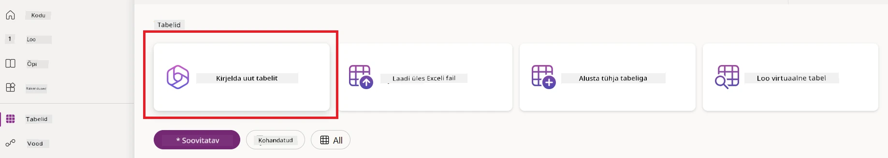

1. Ekraanil **Kirjelda uut tabelit** kasutage tekstiala, et kirjeldada tabelit, mida soovite luua. Näiteks **_Soovin luua tabeli arveinfo talletamiseks_**. Klõpsake nuppu **Saada**, et saata päring AI Copilotile.

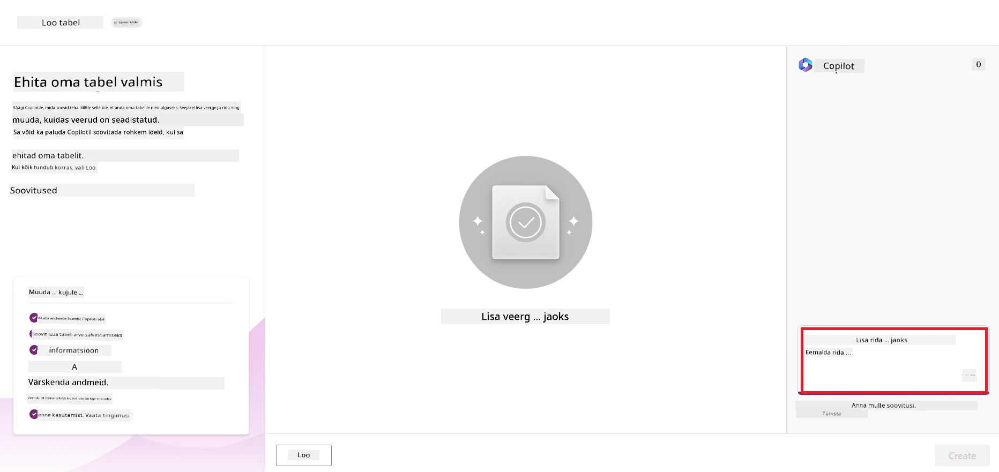

1. AI Copilot soovitab Dataverse'i tabelit koos väljadega, mida vajate oma jälgimisdandmete talletamiseks, ning näidisteavet. Seejärel saate tabelit oma vajadustele vastavalt kohandada läbi vestluslike sammude Copiloti abil.

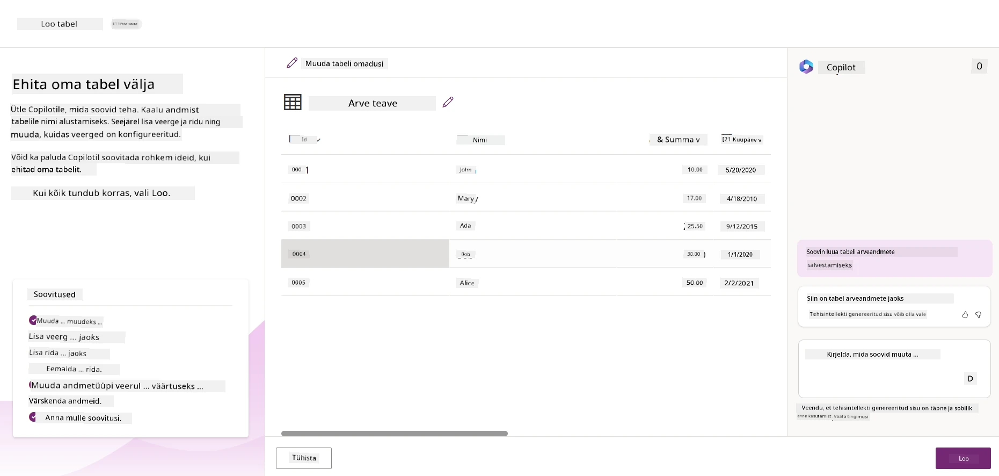

1. Finantstugi soovib saata tarnijale e-kirja, et uuendada neid arve praeguse seisuga. Copilotiga saate tabelisse lisada uue välja tarnija e-posti salvestamiseks. Näiteks võite kasutada järgmise sisendi: **_Soovin lisada veeru tarnija e-posti salvestamiseks_**. Klõpsake nuppu **Saada**, et saata päring AI Copilotile.

1. AI Copilot loob uue välja, mida saate seejärel vastavalt vajadusele kohandada.

1. Kui tabeli loomine on lõppenud, klõpsake nuppu **Loo**, et tabel luua.

## AI mudelid Power Platformis AI Builderiga

AI Builder on Power Platformis madala koodiga AI võimekus, mis võimaldab teil kasutada AI mudeleid protsesside automatiseerimiseks ja tulemuste prognoosimiseks. AI Builderiga saate oma rakendustesse ja voogudesse lisada tehisintellekti, mis ühenduvad teie andmetega Dataverses või mitmetes pilveandmete allikates nagu SharePoint, OneDrive või Azure.

## Eelnevalt ehitatud AI mudelid vs Kohandatud AI mudelid

AI Builder pakub kahte tüüpi AI mudeleid: eelnevalt ehitatud ja kohandatud AI mudelid. Eelnevalt ehitatud AI mudelid on Microsofti poolt treenitud ning Power Platformis kohe kasutamiseks valmis. Nende abil saate lisada intelligentsust oma rakendustesse ja voogudesse ilma ise andmeid kogumata või mudeleid ehitamata, treenimata ja avaldamata. Nende mudelite abil saate automatiseerida protsesse ja prognoosida tulemusi.

Mõned Power Platformis saadaval olevad eelnevalt ehitatud AI mudelid on:

- **Oluliste fraaside ekstraheerimine**: See mudel ekstraheerib tekstist võtmesõnu.
- **Keele tuvastamine**: See mudel tuvastab teksti keele.
- **Sentimendi analüüs**: See mudel tuvastab tekstis positiivset, negatiivset, neutraalset või segatud tundeid.
- **Visiitkaardi lugeja**: See mudel ekstraheerib informatsiooni visiitkaartidelt.
- **Teksti tuvastamine**: See mudel tuvastab tekstipildi pealt.
- **Objektituvastus**: See mudel tuvastab ja ekstraheerib objektid piltidelt.
- **Dokumendi töötlemine**: See mudel ekstraheerib infot vormidelt.
- **Arve töötlemine**: See mudel ekstraheerib infot arvetelt.

Kohandatud AI mudelitega saate tuua oma mudeli AI Builderisse, et see toimiks nagu üks kohandatud mudel, lubades treenida mudelit oma andmetega. Saate neid mudeleid kasutada protsesside automatiseerimiseks ja tulemuste prognoosimiseks nii Power Appsis kui Power Automates. Oma mudelit kasutades kehtivad piirangud. Lisateavet nende kohta leiate [siit](https://learn.microsoft.com/ai-builder/byo-model#limitations?WT.mc_id=academic-105485-koreyst).

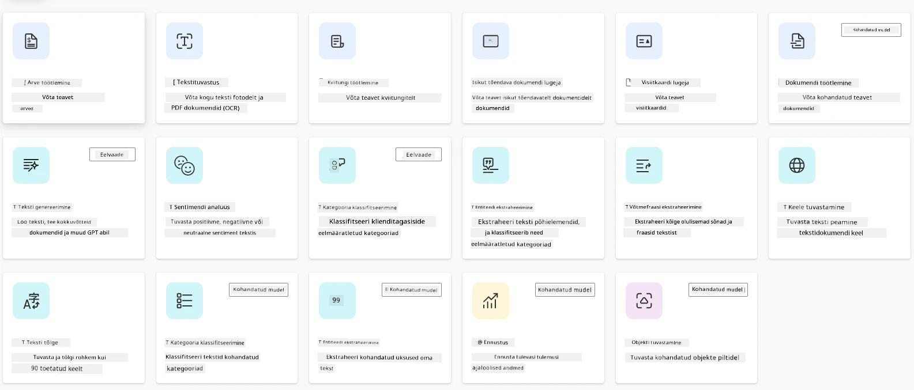

## Ülesanne nr 2 - Arve töötlemise voog meie idufirmale

Finantstugi on vaevlenud arvete töötlemisega. Nad on kasutanud arvutustabelit arvete jälgimiseks, kuid see on muutunud raskesti hallatavaks arvede hulga kasvades. Nad palusid teil luua töövoog, mis aitaks neil AI abil arveid töödelda. Töövoog peaks võimaldama arvetelt info ekstraheerida ja salvestada see Dataverse'i tabelisse. Samuti peaks voog võimaldama saata finantsmeeskonnale e-kirja ekstraheeritud info kokkuvõttega.

Nüüd kui teate, mis on AI Builder ja miks seda kasutada, vaatame, kuidas kasutada arve töötlemise AI mudelit AI Builderis, mida varem käsitlesime, töövoo loomiseks, mis aitab finantstuge arveid töödelda.

Arvete töötlemiseks AI mudelit kasutava töövoo loomiseks järgige alltoodud samme:

1. Minge [Power Automate](https://make.powerautomate.com?WT.mc_id=academic-105485-koreyst) avalehele.

2. Kasutage avalehel tekstiala, et kirjeldada loodavat töövoogu. Näiteks **_Töötle arve, kui see jõuab minu postkasti_**. Klõpsake nuppu **Saada**, et päring Copilotile saata.

   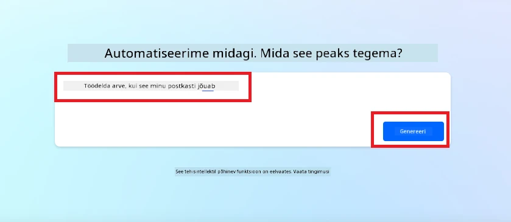

3. AI Copilot soovitab toimingud, mida vajate soovitud automaatika elluviimiseks. Järgmiseks sammuks klõpsake nuppu **Järgmine**.

4. Järgmises sammus palub Power Automate teil seada ühendused, mis töövoo loomiseks vajalikud on. Kui kõik on valmis, klõpsake nuppu **Loo voog**.

5. AI Copilot genereerib töövoo, mida saate seejärel vastavalt vajadusele kohandada.

6. Uuendage töövoo käivitajat ning seadke **Kaust** selle kausta nimeks, kuhu arved salvestatakse. Näiteks võite seadistada kaustaks **Sissetulek**. Klõpsake **Kuva täpsemad valikud** ja seadke **Ainult manustega** väärtuseks **Jah**. See tagab, et voog töötab ainult siis, kui kausta tuleb manusega e-kiri.

7. Eemaldage töövoost järgmised toimingud: **HTML tekstiks**, **Koosta**, **Koosta 2**, **Koosta 3** ja **Koosta 4**, kuna neid ei kasutata.

8. Eemaldage töövoost ka toiming **Tingimus**, kuna te seda ei kasuta. See peaks välja nägema järgmiselt:

   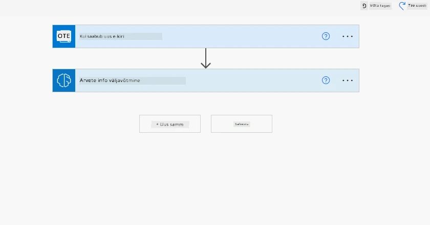

9. Klõpsake nuppu **Lisa toiming** ning otsige üles **Dataverse**. Valige toiming **Lisa uus rida**.

10. Toimingus **Ekstraheerige info arvete töötlemisest** määrake **Arve fail** viitama e-kirja **Manuse sisule**. See tagab, et töövoog ekstraheerib info arve manusest.

11. Valige varem loodud **Tabel**. Näiteks **Arveinfo** tabel. Kasutage eelneva toimingu dünaamilist sisu järgmiste väljade täitmiseks:

    - ID
    - Summa
    - Kuupäev
    - Nimi
    - Staatus - Seadke **Staatus** väärtuseks **Ootel**.
    - Tarnija e-post - Kasutage **Saatja** dünaamilist sisu käivitajast **Kui saabub uus e-kiri**.

    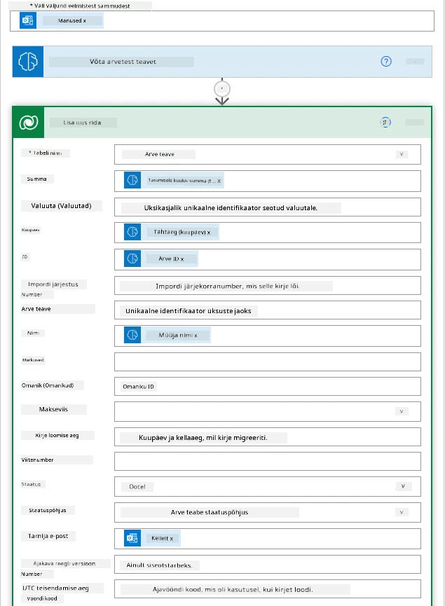

12. Kui töövoo loomine on lõpetatud, klõpsake nuppu **Salvesta**, et voog salvestada. Seejärel saate testida voogu, saates arve manusena kausta, mille välja valisite.

> **Teie kodutöö**: äsja loodud voog on hea algus, nüüd mõelge välja automaatika, mis võimaldab meie finantsmeeskonnal saata tarnijale e-kiri, et neid arve seisundist teavitada. Nõuanne: voog peaks käivituma, kui arve staatus muutub.

## Kasutage Power Automates tekstigeneratsiooni AI mudelit

AI Builderi GPT tekstiloome mudel võimaldab teil luua teksti päringu põhjal ning töötab Microsoft Azure OpenAI teenuse toel. Selle võimekusega saate oma rakendustesse ja voogudesse lisada GPT (Generative Pre-Trained Transformer) tehnoloogiat erinevate automatiseeritud voogude ja nutikate rakenduste loomiseks.

GPT mudelid läbivad põhjaliku koolituse suurte andmehulkade peal, võimaldades toota tekst, mis sarnaneb inimese kirjutatud keelega, kui mudelile esitada sobiv päring. Töövoo automatiseerimisega on selliseid AI mudeleid nagu GPT võimalik kasutada paljude ülesannete lihtsustamiseks ja automatiseerimiseks.

Näiteks saate luua voogusid, mis automaatselt genereerivad teksti mitmesugusteks kasutusjuhtudeks, nagu e-kirjade mustandid, tootetekstid ja muud. Mudelit saab kasutada ka erinevate rakenduste jaoks, näiteks vestlusrobotite ja klienditeeninduslahenduste loomisel, võimaldades esindajatel klientide päringutele tõhusalt vastata.

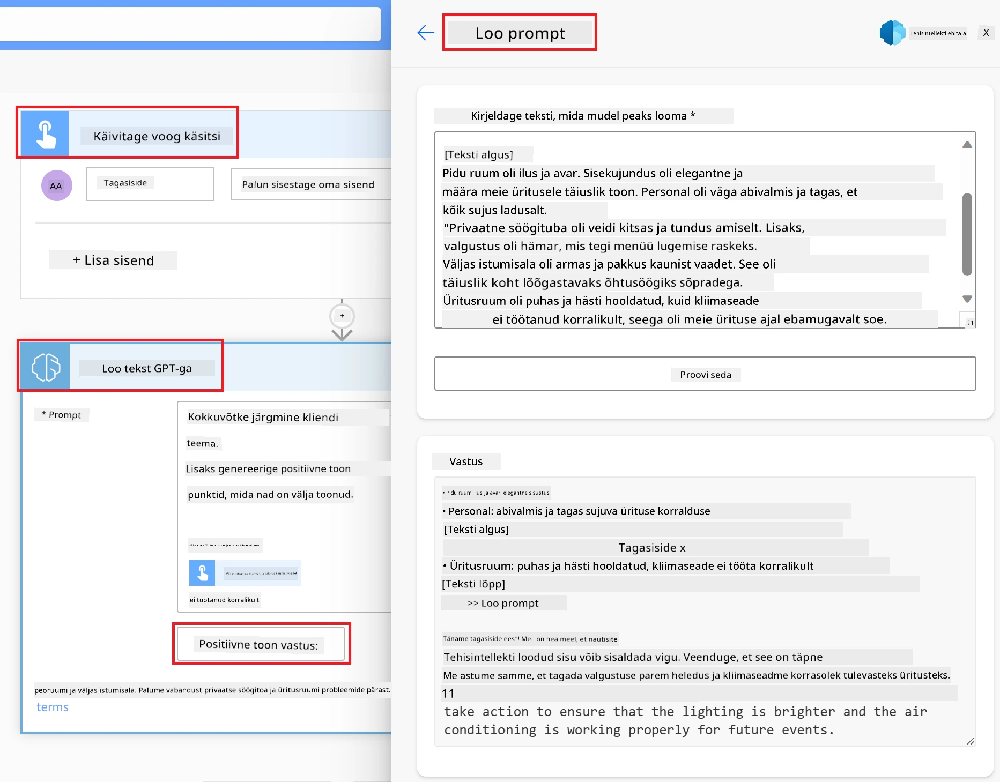

Selle AI-mudeli kasutamise õppimiseks Power Automates, tutvu mooduliga [Lisa intelligentsust AI Builderi ja GPT abil](https://learn.microsoft.com/training/modules/ai-builder-text-generation/?WT.mc_id=academic-109639-somelezediko).

## Suurepärane töö! Jätka õppimist

Pärast selle õppetüki lõpetamist vaata meie [Generatiivse tehisintellekti õppe kollektsiooni](https://aka.ms/genai-collection?WT.mc_id=academic-105485-koreyst), et jätkata oma generatiivse tehisintellekti teadmiste täiustamist!

Kas soovid kohandada ja Copilotist rohkem saada? Uuri lähemalt [Awesome Copilot](https://github.com/github/awesome-copilot?WT.mc_id=academic-105485-koreyst) — kogukonna poolt koostatud juhiste, agentide, oskuste ja seadistuste kogu, mis aitab sul GitHub Copiloti võimalused maksimaalselt ära kasutada.

Liigu õppetüki 11 juurde, kus vaatleme, kuidas [integreerida generatiivset tehisintellekti funktsioonikõnedega](../11-integrating-with-function-calling/README.md?WT.mc_id=academic-105485-koreyst)!

---

<!-- CO-OP TRANSLATOR DISCLAIMER START -->
**Lahtiütlus**:
See dokument on tõlgitud kasutades AI tõlketeenust [Co-op Translator](https://github.com/Azure/co-op-translator). Kuigi me püüdleme täpsuse poole, palun pange tähele, et automatiseeritud tõlgetes võib esineda vigu või ebatäpsusi. Originaaldokument selle emakeeles tuleks pidada autoriteetseks allikaks. Olulise teabe puhul soovitatakse kasutada professionaalset inimtõlget. Me ei vastuta selle tõlkega seotud eksimustest või valesti mõistmistest.
<!-- CO-OP TRANSLATOR DISCLAIMER END -->