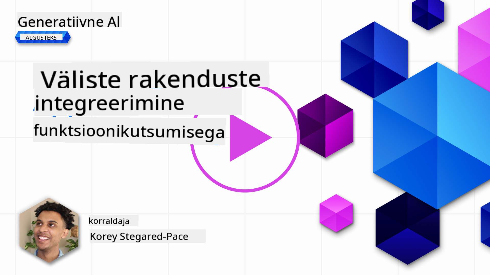
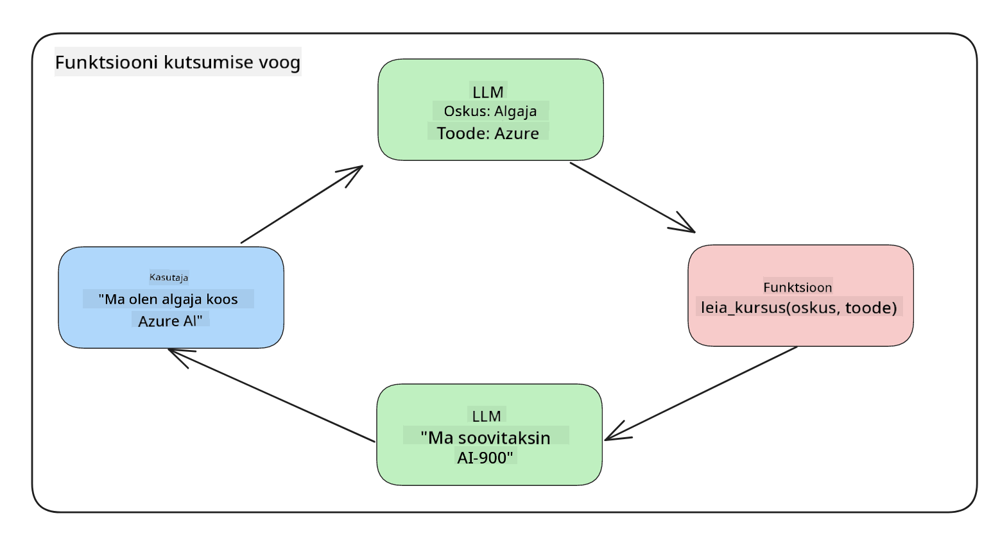
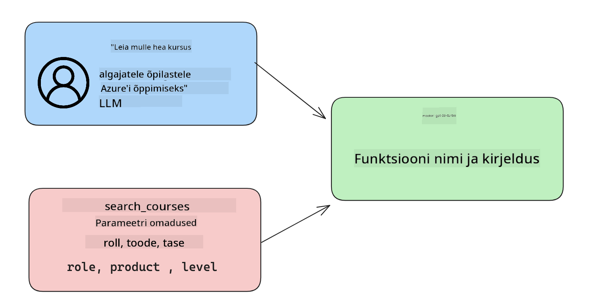

<!--
CO_OP_TRANSLATOR_METADATA:
{
  "original_hash": "f6f84f9ef2d066cd25850cab93580a50",
  "translation_date": "2025-10-18T02:50:02+00:00",
  "source_file": "11-integrating-with-function-calling/README.md",
  "language_code": "et"
}
-->
# Funktsioonikutsumise integreerimine

[](https://youtu.be/DgUdCLX8qYQ?si=f1ouQU5HQx6F8Gl2)

Eelnevates tundides oled juba päris palju õppinud. Siiski on veel ruumi edasiminekuks. Mõned asjad, mida saame parandada, on vastuste formaadi järjepidevuse suurendamine, et lihtsustada nende kasutamist edasises töövoos. Samuti võiksime lisada andmeid teistest allikatest, et oma rakendust veelgi rikastada.

Need probleemid ongi selle peatüki fookuses.

## Sissejuhatus

Selles tunnis käsitleme:

- Selgitame, mis on funktsioonikutsumine ja selle kasutusvõimalused.
- Loome funktsioonikutsumise Azure OpenAI abil.
- Kuidas integreerida funktsioonikutsumine rakendusse.

## Õpieesmärgid

Selle tunni lõpuks oskad:

- Selgitada, miks kasutada funktsioonikutsumist.
- Seadistada funktsioonikutsumist Azure OpenAI teenuse abil.
- Kujundada tõhusaid funktsioonikutsumisi vastavalt oma rakenduse vajadustele.

## Stsenaarium: Meie vestlusroboti täiustamine funktsioonidega

Selles tunnis loome funktsiooni meie hariduse idufirmale, mis võimaldab kasutajatel vestlusroboti abil leida tehnilisi kursusi. Soovitame kursusi, mis sobivad nende oskuste tasemele, praegusele rollile ja huvipakkuvale tehnoloogiale.

Selle stsenaariumi täitmiseks kasutame kombinatsiooni:

- `Azure OpenAI`, et luua kasutajale vestluskogemus.
- `Microsoft Learn Catalog API`, et aidata kasutajatel leida kursusi vastavalt nende päringule.
- `Funktsioonikutsumine`, et võtta kasutaja päring ja saata see funktsioonile API päringu tegemiseks.

Alustuseks vaatame, miks me üldse tahaksime kasutada funktsioonikutsumist:

## Miks kasutada funktsioonikutsumist

Enne funktsioonikutsumist olid LLM-i (suurte keelemudelite) vastused struktureerimata ja ebajärjekindlad. Arendajad pidid kirjutama keerulist valideerimiskoodi, et tagada iga vastuse variatsiooni käsitlemine. Kasutajad ei saanud vastuseid küsimustele nagu "Mis on praegune ilm Stockholmis?". Seda seetõttu, et mudelid olid piiratud ajaga, mil andmed treeniti.

Funktsioonikutsumine on Azure OpenAI teenuse funktsioon, mis aitab ületada järgmisi piiranguid:

- **Järjekindel vastuse formaat**. Kui suudame paremini kontrollida vastuse formaati, saame seda lihtsamini integreerida teiste süsteemidega.
- **Välised andmed**. Võimalus kasutada rakenduse teistest allikatest pärit andmeid vestluskontekstis.

## Probleemi illustreerimine läbi stsenaariumi

> Soovitame kasutada [kaasatud märkmikku](./python/aoai-assignment.ipynb?WT.mc_id=academic-105485-koreyst), kui soovite allpool toodud stsenaariumi käivitada. Võite ka lihtsalt lugeda, kuna püüame illustreerida probleemi, kus funktsioonid võivad aidata lahendust leida.

Vaatame näidet, mis illustreerib vastuse formaadi probleemi:

Oletame, et tahame luua andmebaasi õpilaste andmetega, et saaksime neile soovitada sobivaid kursusi. Allpool on kaks õpilaste kirjeldust, mis sisaldavad väga sarnaseid andmeid.

1. Loome ühenduse meie Azure OpenAI ressursiga:

   ```python
   import os
   import json
   from openai import AzureOpenAI
   from dotenv import load_dotenv
   load_dotenv()

   client = AzureOpenAI(
   api_key=os.environ['AZURE_OPENAI_API_KEY'],  # this is also the default, it can be omitted
   api_version = "2023-07-01-preview"
   )

   deployment=os.environ['AZURE_OPENAI_DEPLOYMENT']
   ```

   Allpool on Python kood, mis konfigureerib meie ühenduse Azure OpenAI-ga, kus määrame `api_type`, `api_base`, `api_version` ja `api_key`.

1. Loome kaks õpilaste kirjeldust, kasutades muutujaid `student_1_description` ja `student_2_description`.

   ```python
   student_1_description="Emily Johnson is a sophomore majoring in computer science at Duke University. She has a 3.7 GPA. Emily is an active member of the university's Chess Club and Debate Team. She hopes to pursue a career in software engineering after graduating."

   student_2_description = "Michael Lee is a sophomore majoring in computer science at Stanford University. He has a 3.8 GPA. Michael is known for his programming skills and is an active member of the university's Robotics Club. He hopes to pursue a career in artificial intelligence after finishing his studies."
   ```

   Tahame saata ülaltoodud õpilaste kirjeldused LLM-ile, et andmeid analüüsida. Neid andmeid saab hiljem kasutada meie rakenduses ja saata API-le või salvestada andmebaasi.

1. Loome kaks identset käsku, milles juhendame LLM-i, millist teavet me otsime:

   ```python
   prompt1 = f'''
   Please extract the following information from the given text and return it as a JSON object:

   name
   major
   school
   grades
   club

   This is the body of text to extract the information from:
   {student_1_description}
   '''

   prompt2 = f'''
   Please extract the following information from the given text and return it as a JSON object:

   name
   major
   school
   grades
   club

   This is the body of text to extract the information from:
   {student_2_description}
   '''
   ```

   Ülaltoodud käsud juhendavad LLM-i teavet välja võtma ja vastust JSON-formaadis tagastama.

1. Pärast käskude ja ühenduse seadistamist Azure OpenAI-ga saadame nüüd käsud LLM-ile, kasutades `openai.ChatCompletion`. Salvestame käsu muutujasse `messages` ja määrame rolliks `user`. See jäljendab kasutaja sõnumit, mis kirjutatakse vestlusrobotile.

   ```python
   # response from prompt one
   openai_response1 = client.chat.completions.create(
   model=deployment,
   messages = [{'role': 'user', 'content': prompt1}]
   )
   openai_response1.choices[0].message.content

   # response from prompt two
   openai_response2 = client.chat.completions.create(
   model=deployment,
   messages = [{'role': 'user', 'content': prompt2}]
   )
   openai_response2.choices[0].message.content
   ```

Nüüd saame saata mõlemad päringud LLM-ile ja uurida vastust, mille saame, leides selle näiteks nii: `openai_response1['choices'][0]['message']['content']`.

1. Lõpuks saame vastuse JSON-formaadiks teisendada, kutsudes `json.loads`:

   ```python
   # Loading the response as a JSON object
   json_response1 = json.loads(openai_response1.choices[0].message.content)
   json_response1
   ```

   Vastus 1:

   ```json
   {
     "name": "Emily Johnson",
     "major": "computer science",
     "school": "Duke University",
     "grades": "3.7",
     "club": "Chess Club"
   }
   ```

   Vastus 2:

   ```json
   {
     "name": "Michael Lee",
     "major": "computer science",
     "school": "Stanford University",
     "grades": "3.8 GPA",
     "club": "Robotics Club"
   }
   ```

   Kuigi käsud on samad ja kirjeldused sarnased, näeme, et `Grades` omaduse väärtused on erinevalt vormindatud, näiteks mõnikord saame formaadi `3.7` või `3.7 GPA`.

   See tulemus on tingitud sellest, et LLM võtab struktureerimata andmeid kirjaliku käsu kujul ja tagastab samuti struktureerimata andmeid. Meil on vaja struktureeritud formaati, et teaksime, mida oodata, kui salvestame või kasutame neid andmeid.

Kuidas siis lahendada vormindamise probleemi? Kasutades funktsioonikutsumist, saame tagada, et saame tagasi struktureeritud andmeid. Funktsioonikutsumist kasutades LLM tegelikult ei kutsu ega käivita ühtegi funktsiooni. Selle asemel loome LLM-ile struktuuri, mida ta oma vastustes järgib. Seejärel kasutame neid struktureeritud vastuseid, et teada saada, millist funktsiooni meie rakendustes käivitada.



Seejärel saame funktsioonist tagastatud andmed saata tagasi LLM-ile. LLM vastab seejärel loomulikus keeles, et vastata kasutaja päringule.

## Funktsioonikutsumise kasutusvõimalused

Funktsioonikutsumine võib parandada teie rakendust mitmel viisil, näiteks:

- **Väliste tööriistade kutsumine**. Vestlusrobotid on suurepärased kasutajate küsimustele vastamiseks. Funktsioonikutsumist kasutades saavad vestlusrobotid kasutada kasutajate sõnumeid teatud ülesannete täitmiseks. Näiteks võib õpilane paluda vestlusrobotil "Saada minu juhendajale e-kiri, et mul on vaja selle teemaga rohkem abi". See võib teha funktsioonikutsumise `send_email(to: string, body: string)`.

- **API või andmebaasi päringute loomine**. Kasutajad saavad leida teavet loomuliku keele abil, mis muudetakse vormindatud päringuks või API päringuks. Näiteks võib õpetaja küsida: "Kes on õpilased, kes viimase ülesande lõpetasid", mis võib kutsuda funktsiooni nimega `get_completed(student_name: string, assignment: int, current_status: string)`.

- **Struktureeritud andmete loomine**. Kasutajad saavad võtta tekstiploki või CSV ja kasutada LLM-i, et sellest olulist teavet välja võtta. Näiteks võib õpilane teisendada Wikipedia artikli rahulepingutest AI õppekaartide loomiseks. Seda saab teha, kasutades funktsiooni nimega `get_important_facts(agreement_name: string, date_signed: string, parties_involved: list)`.

## Esimese funktsioonikutsumise loomine

Funktsioonikutsumise loomise protsess hõlmab kolme peamist sammu:

1. **Kutsumine**: Chat Completions API kutsumine koos funktsioonide loendi ja kasutaja sõnumiga.
2. **Lugemine**: Mudeli vastuse lugemine, et teostada tegevus, näiteks funktsiooni või API päringu käivitamine.
3. **Teostamine**: Teine Chat Completions API kutsumine funktsiooni vastusega, et kasutada seda teavet kasutajale vastuse loomiseks.



### 1. samm - sõnumite loomine

Esimene samm on luua kasutaja sõnum. Selle saab dünaamiliselt määrata, võttes väärtuse tekstisisendist, või määrata väärtus otse siin. Kui see on teie esimene kord töötada Chat Completions API-ga, peame määratlema sõnumi `role` ja `content`.

`Role` võib olla kas `system` (reeglite loomine), `assistant` (mudel) või `user` (lõppkasutaja). Funktsioonikutsumise jaoks määrame selle `user` ja lisame näitena küsimuse.

```python
messages= [ {"role": "user", "content": "Find me a good course for a beginner student to learn Azure."} ]
```

Rollide määramisega on LLM-ile selge, kas tegemist on süsteemi või kasutaja sõnumiga, mis aitab luua vestluse ajalugu, millele LLM saab tugineda.

### 2. samm - funktsioonide loomine

Järgmisena määratleme funktsiooni ja selle parameetrid. Kasutame siin ainult ühte funktsiooni nimega `search_courses`, kuid võite luua mitu funktsiooni.

> **Oluline**: Funktsioonid lisatakse LLM-i süsteemisõnumisse ja need arvestatakse teie kasutatavate saadaval olevate tokenite hulka.

Allpool loome funktsioonid elementide massiivina. Iga element on funktsioon ja sellel on omadused `name`, `description` ja `parameters`:

```python
functions = [
   {
      "name":"search_courses",
      "description":"Retrieves courses from the search index based on the parameters provided",
      "parameters":{
         "type":"object",
         "properties":{
            "role":{
               "type":"string",
               "description":"The role of the learner (i.e. developer, data scientist, student, etc.)"
            },
            "product":{
               "type":"string",
               "description":"The product that the lesson is covering (i.e. Azure, Power BI, etc.)"
            },
            "level":{
               "type":"string",
               "description":"The level of experience the learner has prior to taking the course (i.e. beginner, intermediate, advanced)"
            }
         },
         "required":[
            "role"
         ]
      }
   }
]
```

Selgitame iga funktsiooni eksemplari üksikasjalikumalt:

- `name` - Funktsiooni nimi, mida soovime kutsuda.
- `description` - Funktsiooni töö kirjeldus. Siin on oluline olla konkreetne ja selge.
- `parameters` - Väärtuste ja formaadi loend, mida soovime mudelil vastuses toota. Parameetrite massiiv koosneb elementidest, kus elementidel on järgmised omadused:
  1.  `type` - Omaduste andmetüüp, milles need salvestatakse.
  1.  `properties` - Spetsiifiliste väärtuste loend, mida mudel kasutab oma vastuses.
      1. `name` - Võtme nimi, mida mudel kasutab oma vormindatud vastuses, näiteks `product`.
      1. `type` - Selle omaduse andmetüüp, näiteks `string`.
      1. `description` - Konkreetse omaduse kirjeldus.

Samuti on olemas valikuline omadus `required` - nõutav omadus, et funktsioonikutsumine saaks lõpule viidud.

### 3. samm - Funktsioonikutsumise teostamine

Pärast funktsiooni määratlemist peame selle lisama Chat Completion API päringusse. Teeme seda, lisades `functions` päringusse. Sel juhul `functions=functions`.

Samuti on võimalus määrata `function_call` väärtuseks `auto`. See tähendab, et laseme LLM-il otsustada, millist funktsiooni tuleks kutsuda vastavalt kasutaja sõnumile, selle asemel et seda ise määrata.

Allpool on kood, kus kutsume `ChatCompletion.create`, märkige, kuidas määrame `functions=functions` ja `function_call="auto"`, andes LLM-ile valiku, millal meie pakutud funktsioone kutsuda:

```python
response = client.chat.completions.create(model=deployment,
                                        messages=messages,
                                        functions=functions,
                                        function_call="auto")

print(response.choices[0].message)
```

Tagastatud vastus näeb nüüd välja selline:

```json
{
  "role": "assistant",
  "function_call": {
    "name": "search_courses",
    "arguments": "{\n  \"role\": \"student\",\n  \"product\": \"Azure\",\n  \"level\": \"beginner\"\n}"
  }
}
```

Siin näeme, kuidas funktsiooni `search_courses` kutsuti ja milliste argumentidega, nagu on loetletud JSON-vastuse `arguments` omaduses.

LLM suutis leida andmed, mis sobivad funktsiooni argumentidega, kuna ta eraldas need väärtused `messages` parameetris antud väärtusest vestluse lõpetamise päringus. Allpool on meeldetuletus `messages` väärtusest:

```python
messages= [ {"role": "user", "content": "Find me a good course for a beginner student to learn Azure."} ]
```

Nagu näete, eraldati `student`, `Azure` ja `beginner` `messages`-ist ja määrati funktsiooni sisendiks. Funktsioonide kasutamine sel viisil on suurepärane viis teabe väljavõtmiseks käsust, aga ka LLM-ile struktuuri pakkumiseks ja taaskasutatava funktsionaalsuse loomiseks.

Järgmisena peame nägema, kuidas seda oma rakenduses kasutada.

## Funktsioonikutsumiste integreerimine rakendusse

Pärast LLM-i vormindatud vastuse testimist saame selle nüüd oma rakendusse integreerida.

### Töövoo haldamine

Selle rakendusse integreerimiseks järgime järgmisi samme:

1. Kõigepealt teeme OpenAI teenustele päringu ja salvestame sõnumi muutujasse `response_message`.

   ```python
   response_message = response.choices[0].message
   ```

1. Nüüd määratleme funktsiooni, mis kutsub Microsoft Learn API-d, et saada kursuste loend:

   ```python
   import requests

   def search_courses(role, product, level):
     url = "https://learn.microsoft.com/api/catalog/"
     params = {
        "role": role,
        "product": product,
        "level": level
     }
     response = requests.get(url, params=params)
     modules = response.json()["modules"]
     results = []
     for module in modules[:5]:
        title = module["title"]
        url = module["url"]
        results.append({"title": title, "url": url})
     return str(results)
   ```

   Pange tähele, kuidas me nüüd loome tegeliku Python funktsiooni, mis vastab `functions` muutujas määratud funktsiooninimedele. Samuti teeme reaalseid väliseid API päringuid, et hankida vajalikke andmeid. Sel juhul pöördume Microsoft Learn API poole, et otsida koolitusmoduleid.

Olgu, nii et me lõime `functions` muutujad ja vastava Python funktsiooni, kuidas me ütleme LLM-ile, kuidas neid kahte omavahel siduda, et meie Python funktsiooni kutsutaks?

1. Et näha, kas peame Python funktsiooni kutsuma, peame vaatama LLM-i vastust ja kontrollima, kas seal on `function_call`, ning kutsuma välja toodud funktsiooni. Allpool on näidatud, kuidas seda kontrolli teha:

   ```python
   # Check if the model wants to call a function
   if response_message.function_call.name:
    print("Recommended Function call:")
    print(response_message.function_call.name)
    print()

    # Call the function.
    function_name = response_message.function_call.name

    available_functions = {
            "search_courses": search_courses,
    }
    function_to_call = available_functions[function_name]

    function_args = json.loads(response_message.function_call.arguments)
    function_response = function_to_call(**function_args)

    print("Output of function call:")
    print(function_response)
    print(type(function_response))


    # Add the assistant response and function response to the messages
    messages.append( # adding assistant response to messages
        {
            "role": response_message.role,
            "function_call": {
                "name": function_name,
                "arguments": response_message.function_call.arguments,
            },
            "content": None
        }
    )
    messages.append( # adding function response to messages
        {
            "role": "function",
            "name": function_name,
            "content":function_response,
        }
    )
   ```

   Need kolm rida tagavad, et me eraldame funktsiooni nime, argumendid ja teeme kutsumise:

   ```python
   function_to_call = available_functions[function_name]

   function_args = json.loads(response_message.function_call.arguments)
   function_response = function_to_call(**function_args)
   ```

   Allpool on meie koodi käivitamise tulemus:

   **Väljund**

   ```Recommended Function call:
   {
     "name": "search_courses",
     "arguments": "{\n  \"role\": \"student\",\n  \"product\": \"Azure\",\n  \"level\": \"beginner\"\n}"
   }

   Output of function call:
   [{'title': 'Describe concepts of cryptography', 'url': 'https://learn.microsoft.com/training/modules/describe-concepts-of-cryptography/?
   WT.mc_id=api_CatalogApi'}, {'title': 'Introduction to audio classification with TensorFlow', 'url': 'https://learn.microsoft.com/en-
   us/training/modules/intro-audio-classification-tensorflow/?WT.mc_id=api_CatalogApi'}, {'title': 'Design a Performant Data Model in Azure SQL
   Database with Azure Data Studio', 'url': 'https://learn.microsoft.com/training/modules/design-a-data-model-with-ads/?
   WT.mc_id=api_CatalogApi'}, {'title': 'Getting started with the Microsoft Cloud Adoption Framework for Azure', 'url':
   'https://learn.microsoft.com/training/modules/cloud-adoption-framework-getting-started/?WT.mc_id=api_CatalogApi'}, {'title': 'Set up the
   Rust development environment', 'url': 'https://learn.microsoft.com/training/modules/rust-set-up-environment/?WT.mc_id=api_CatalogApi'}]
   <class 'str'>
   ```

1. Nüüd saadame uuendatud sõnumi, `messages`, LLM-ile, et saaksime loomuliku keele vastuse API JSON-vormindatud vastuse asemel.

   ```python
   print("Messages in next request:")
   print(messages)
   print()

   second_response = client.chat.completions.create(
      messages=messages,
      model=deployment,
      function_call="auto",
      functions=functions,
      temperature=0
         )  # get a new response from GPT where it can see the function response


   print(second_response.choices[0].message)
   ```

   **Väljund**

   ```python
   {
     "role": "assistant",
     "content": "I found some good courses for beginner students to learn Azure:\n\n1. [Describe concepts of cryptography] (https://learn.microsoft.com/training/modules/describe-concepts-of-cryptography/?WT.mc_id=api_CatalogApi)\n2. [Introduction to audio classification with TensorFlow](https://learn.microsoft.com/training/modules/intro-audio-classification-tensorflow/?WT.mc_id=api_CatalogApi)\n3. [Design a Performant Data Model in Azure SQL Database with Azure Data Studio](https://learn.microsoft.com/training/modules/design-a-data-model-with-ads/?WT.mc_id=api_CatalogApi)\n4. [Getting started with the Microsoft Cloud Adoption Framework for Azure](https://learn.microsoft.com/training/modules/cloud-adoption-framework-getting-started/?WT.mc_id=api_CatalogApi)\n5. [Set up the Rust development environment](https://learn.microsoft.com/training/modules/rust-set-up-environment/?WT.mc_id=api_CatalogApi)\n\nYou can click on the links to access the courses."
   }

   ```

## Ülesanne

Azure OpenAI funktsioonikutsumise õppimise jätkamiseks saate luua:

- Rohkem funktsiooni parameetreid, mis aitavad õppijatel leida rohkem kursusi.
- Luua teise funktsioonikutsumise, mis võtab õppijalt rohkem teavet, näiteks nende emakeele.
- Loo veakäsitlus, kui funktsiooni või API päring ei tagasta sobivaid kursusi

Vihje: Vaata [Learn API viitedokumentatsiooni](https://learn.microsoft.com/training/support/catalog-api-developer-reference?WT.mc_id=academic-105485-koreyst) lehte, et näha, kuidas ja kus need andmed on saadaval.

## Suurepärane töö! Jätka teekonda

Pärast selle õppetunni lõpetamist tutvu meie [Generatiivse tehisintellekti õppekollektsiooniga](https://aka.ms/genai-collection?WT.mc_id=academic-105485-koreyst), et jätkata oma generatiivse tehisintellekti teadmiste arendamist!

Liigu edasi 12. õppetundi, kus uurime, kuidas [kujundada UX-i AI rakenduste jaoks](../12-designing-ux-for-ai-applications/README.md?WT.mc_id=academic-105485-koreyst)!

---

**Lahtiütlus**:  
See dokument on tõlgitud AI tõlketeenuse [Co-op Translator](https://github.com/Azure/co-op-translator) abil. Kuigi püüame tagada täpsust, palume arvestada, et automaatsed tõlked võivad sisaldada vigu või ebatäpsusi. Algne dokument selle algses keeles tuleks pidada autoriteetseks allikaks. Olulise teabe puhul soovitame kasutada professionaalset inimtõlget. Me ei vastuta selle tõlke kasutamisest tulenevate arusaamatuste või valesti tõlgenduste eest.