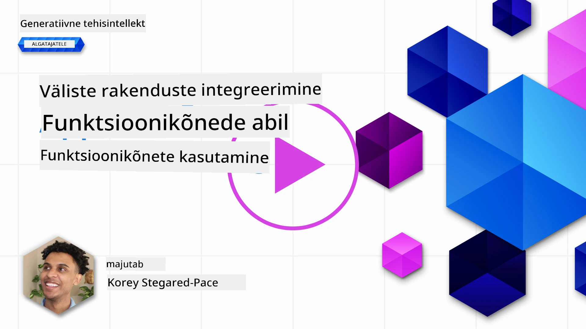
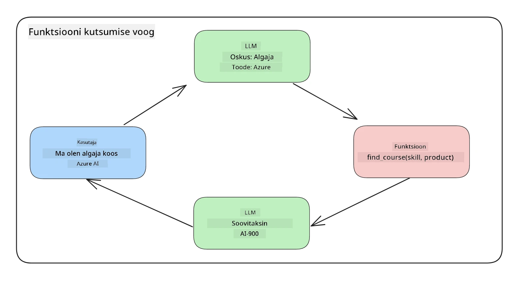
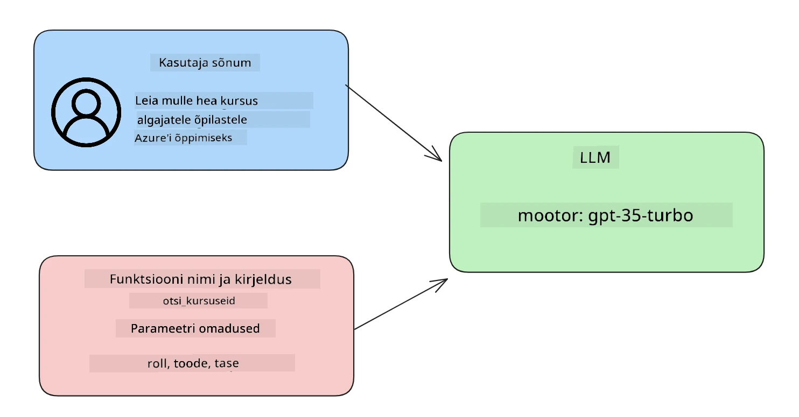

# Funktsioonikutsega integreerimine

[](https://youtu.be/DgUdCLX8qYQ?si=f1ouQU5HQx6F8Gl2)

Oled varasemates õppetundides juba üsna palju õppinud. Kuid me saame veelgi paremaks saada. Mõned asjad, mida saame käsitleda, on kuidas saada järjepidevam vastuse formaat, et vastustega oleks hiljem lihtsam töötada. Samuti võime soovida lisada andmeid teistest allikatest, et meie rakendust veelgi rikastada.

Ülalmainitud probleemid on need, mida see peatükk lahendada püüab.

## Sissejuhatus

See õppetund hõlmab:

- Selgitada, mis on funktsioonikutse ja selle kasutusjuhtumid.
- Funktsioonikutse loomine Azure OpenAI abil.
- Kuidas integreerida funktsioonikutse rakendusse.

## Õpieesmärgid

Selle õppetunni lõpuks oskad:

- Selgitada funktsioonikutsede kasutamise eesmärki.
- Seada üles funktsioonikutse Azure OpenAI Teenuse abil.
- Kujundada tõhusaid funktsioonikutseid oma rakenduse kasutusjuhtumi jaoks.

## Stsenaarium: meie vestlusroboti täiustamine funktsioonidega

Selle õppetunni jaoks tahame ehitada funktsiooni meie haridusettevõttele, mis võimaldab kasutajatel vestlusroboti kaudu leida tehnilisi kursuseid. Soovitame kursusi, mis vastavad nende oskuste tasemele, praegusele ametikohale ja huvipakkuvale tehnoloogiale.

Selle stsenaariumi lõpuleviimiseks kasutame kombinatsiooni:

- `Azure OpenAI` kasutamist kasutajale vestluskogemuse loomiseks.
- `Microsoft Learn Catalog API` kasutamist, et aidata kasutajatel leida kursuseid vastavalt nende päringule.
- `Funktsioonikutsed` kasutamist, et võtta kasutaja päring ja saata see funktsioonile API-päringuks.

Alustamiseks vaatame, miks me üldse tahaksime funktsioonikutsed kasutusele võtta:

## Miks kasutada funktsioonikutsed

Enne funktsioonikutsede kasutamist olid LLM-i vastused struktuurita ja ebajärjekindlad. Arendajad pidid kirjutama keerukat valideerimiskoodi, et igat vastuse varianti toime tulla. Kasutajad ei saanud näiteks vastust küsimusele "Milline on hetke ilm Stockholmis?". See tulenes sellest, et mudelid põhinesid treeningandmetel oma väljaõppe ajal.

Funktsioonikutse on Azure OpenAI Teenuse funktsioon, mis aitab ületada järgmisi piiranguid:

- **Järjepidev vastuse formaat**. Kui me saame vastuse formaati paremini kontrollida, on lihtsam vastust integreerida edasi teistesse süsteemidesse.
- **Välised andmed**. Võimalus kasutada rakenduse muid andmeallikaid vestluses.

## Probleemi illustreerimine stsenaariumi kaudu

> Soovitame kasutada kaasasolevat [notebooki](./python/aoai-assignment.ipynb?WT.mc_id=academic-105485-koreyst), kui soovid järgmist stsenaariumi ise töös näha. Võid ka lihtsalt lugeda, kuna püüame näidata probleemi, mida funktsioonid aitavad lahendada.

Vaatame näidet, mis näitab vastuse formaadi probleemi:

Oletame, et tahame luua andmebaasi õpilaste andmetest, et neile sobivaid kursuseid soovitada. Allpool on kaks õpilaste kirjeldust, mis andmete poolest on väga sarnased.

1. Loo ühendus meie Azure OpenAI ressursiga:

   ```python
   import os
   import json
   from openai import OpenAI
   from dotenv import load_dotenv
   load_dotenv()

   # Responses API teenindatakse Azure OpenAI (Microsoft Foundry) v1 lõpp-punktist
   # , nii et suuname OpenAI kliendi aadressile <your-endpoint>/openai/v1/.
   endpoint = os.environ['AZURE_OPENAI_ENDPOINT']
   client = OpenAI(
   api_key=os.environ['AZURE_OPENAI_API_KEY'],
   base_url=f"{endpoint.rstrip('/')}/openai/v1/",
   )

   deployment=os.environ['AZURE_OPENAI_DEPLOYMENT']
   ```

   Allpool on Python kood, mis seadistab meie ühenduse Azure OpenAI-ga. Kuna kasutame v1 lõpp-punkti, piisab `api_key` ja `base_url` määramisest (ei ole vaja `api_version`).

1. Loome kaks õpilaste kirjeldust muutujatega `student_1_description` ja `student_2_description`.

   ```python
   student_1_description="Emily Johnson is a sophomore majoring in computer science at Duke University. She has a 3.7 GPA. Emily is an active member of the university's Chess Club and Debate Team. She hopes to pursue a career in software engineering after graduating."

   student_2_description = "Michael Lee is a sophomore majoring in computer science at Stanford University. He has a 3.8 GPA. Michael is known for his programming skills and is an active member of the university's Robotics Club. He hopes to pursue a career in artificial intelligence after finishing his studies."
   ```

   Tahame need kirjeldused saata LLM-ile, et see andmed parsiks. Neid andmeid saab hiljem rakenduses kasutada ja neid kas API-le saata või andmebaasis hoida.

1. Loome kaks identset prompti, milles juhendame LLM-i, millist infot me soovime:

   ```python
   prompt1 = f'''
   Please extract the following information from the given text and return it as a JSON object:

   name
   major
   school
   grades
   club

   This is the body of text to extract the information from:
   {student_1_description}
   '''

   prompt2 = f'''
   Please extract the following information from the given text and return it as a JSON object:

   name
   major
   school
   grades
   club

   This is the body of text to extract the information from:
   {student_2_description}
   '''
   ```

   Need promptid annavad LLM-ile juhise eraldada info ja tagastada see JSON formaadis.

1. Pärast promptide ja ühenduse seadistamist Azure OpenAI-ga, saadame need `client.responses.create` abil LLM-ile. Salvestame prompti muutujasse `input` ja määrame rolli `user`. See jäljendab kasutaja sõnumi kirjutamist vestlusrobotile.

   ```python
   # vastus esimesele küsimusele
   openai_response1 = client.responses.create(
   model=deployment,
   input = [{'role': 'user', 'content': prompt1}],
   store=False,
   )
   openai_response1.output_text

   # vastus teisele küsimusele
   openai_response2 = client.responses.create(
   model=deployment,
   input = [{'role': 'user', 'content': prompt2}],
   store=False,
   )
   openai_response2.output_text
   ```

Nüüd saame saata mõlemad päringud LLM-ile ja vaadata saadud vastust, kutsudes seda näiteks `openai_response1.output_text`.

1. Lõpuks saame vastuse konverteerida JSON formaati, kutsudes `json.loads`:

   ```python
   # Vastuse laadimine JSON-objektina
   json_response1 = json.loads(openai_response1.output_text)
   json_response1
   ```

   Vastus 1:

   ```json
   {
     "name": "Emily Johnson",
     "major": "computer science",
     "school": "Duke University",
     "grades": "3.7",
     "club": "Chess Club"
   }
   ```

   Vastus 2:

   ```json
   {
     "name": "Michael Lee",
     "major": "computer science",
     "school": "Stanford University",
     "grades": "3.8 GPA",
     "club": "Robotics Club"
   }
   ```

   Kuigi promptid on samad ja kirjeldused sarnased, on `Grades` atribuudi väärtused vormindatud erinevalt, sest mõnikord on see kujul `3.7` ja teinekord `3.7 GPA`.

   See tulemus tekib, sest LLM võtab sisendiks struktuurita teksti ja tagastab samuti struktuurita andmeid. Vajame struktureeritud vormingut, et täpselt teada, mida oodata andmete salvestamisel või kasutamisel.

Kuidas me siis vormindamisprobleemi lahendame? Funktsioonikutsede abil saame tagada, et saame vastuseks struktureeritud andmed. Funktsioonikutset kasutades LLM tegelikult funktsioone ei käivita ega kutsu. Selle asemel loome LLM-i jaoks struktuuri, mida ta peab oma vastustes järgima. Me kasutame neid struktureeritud vastuseid, et teada, millist funktsiooni meie rakendustes käivitada.



Saame seejärel võtta funktsioonilt saadud tulemuse ja saata selle tagasi LLM-ile. LLM vastab siis loomulikus keeles kasutaja päringule.

## Funktsioonikutse kasutusjuhtumid

On palju erinevaid kasutusjuhte, kus funktsioonikutsed saavad teie rakendust täiustada, näiteks:

- **Väliste tööriistade kutsumine**. Vestlusrobotid on head kasutajate küsimustele vastamiseks. Funktsioonikutsede abil saavad vestlusrobotid kasutada kasutajate sõnumeid teatud ülesannete täitmiseks. Näiteks võib õpilane paluda robotil: "Saada minu juhendajale e-kiri, et vajan selle aine kohta rohkem abi". See võiks teha funktsioonikutse `send_email(to: string, body: string)`.

- **API või andmebaasi päringute loomine**. Kasutajad saavad looduskeeles esitatud päringu muuta vormindatud päringuks või API-päringuks. Näiteks õpetaja võib küsida: "Kes lõpetasid viimase töö", mis võiks kutsuda funktsiooni `get_completed(student_name: string, assignment: int, current_status: string)`.

- **Struktureeritud andmete loomine**. Kasutajad saavad tekstiploki või CSV ja kasutada LLM-i olulise info ekstraktimiseks. Näiteks võiks õpilane teisendada Wikipedia artikli rahulepingute kohta AI-mälukaartide loomiseks. Selleks saab kasutada funktsiooni `get_important_facts(agreement_name: string, date_signed: string, parties_involved: list)`.

## Oma esimese funktsioonikutse loomine

Funktsioonikutse loomise protsess sisaldab 3 peamist sammu:

1. **Kutsuda** vastuste API funktsioonide (tööriistade) nimekirja ja kasutaja sõnumiga.
2. **Lugeda** mudeli vastust, et sooritada tegevus ehk käivitada funktsioon või API-kutse.
3. **Teha** veel üks kutse vastuste API-le oma funktsiooni vastusega, et selle teabega koostada kasutajale vastus.



### 1. samm - sõnumite loomine

Esimene samm on luua kasutaja sõnum. Seda saab dünaamiliselt määrata tekstisisendi väärtuse kaudu või määrata väärtuse siin. Kui see on sinu esimene kord töötada vastuste API-ga, tuleb määratleda sõnumi `role` ja `content`.

`role` võib olla `system` (reeglite loomine), `assistant` (mudel) või `user` (lõppkasutaja). Funktsioonikutsete puhul määrame selle `user`-ks ja anname näite küsimusest.

```python
messages= [ {"role": "user", "content": "Find me a good course for a beginner student to learn Azure."} ]
```

Erinevate rollide määramine annab LLM-ile selge arusaama, kas midagi ütleb süsteem või kasutaja, mis aitab luua vestlusajaloo, millele LLM saab tugineda.

### 2. samm - funktsioonide loomine

Järgmisena määratleme funktsiooni ja selle parameetrid. Kasutame siin vaid ühte funktsiooni nimega `search_courses`, aga võid luua mitu funktsiooni.

> **Oluline**: funktsioonid lisatakse süsteemisõnumisse LLM-ile ning need hitavad sinu saadaolevate tokenite hulka.

Allpool loome funktsioonide massiivi. Iga element on tööriist, vormindatud vastuste API formaadis, millel on omadused `type`, `name`, `description` ja `parameters`:

```python
functions = [
   {
      "type":"function",
      "name":"search_courses",
      "description":"Retrieves courses from the search index based on the parameters provided",
      "parameters":{
         "type":"object",
         "properties":{
            "role":{
               "type":"string",
               "description":"The role of the learner (i.e. developer, data scientist, student, etc.)"
            },
            "product":{
               "type":"string",
               "description":"The product that the lesson is covering (i.e. Azure, Power BI, etc.)"
            },
            "level":{
               "type":"string",
               "description":"The level of experience the learner has prior to taking the course (i.e. beginner, intermediate, advanced)"
            }
         },
         "required":[
            "role"
         ]
      }
   }
]
```

Kirjeldame allpool iga funktsiooni osa üksikasjalikumalt:

- `name` - Funktsiooni nimi, mida tahame kutsuda.
- `description` - Selgitus, kuidas funktsioon töötab. On oluline olla konkreetne ja selge.
- `parameters` - Väärtuste ja vormingu nimekiri, mida mudel peaks vastuseks genereerima. Parameetrite massiiv koosneb elementidest, millel on järgmised omadused:
  1.  `type` - Andmetüüp, millesse omadused talletatakse.
  1.  `properties` - Spetsiifiliste väärtuste nimekiri, mida mudel vastuses kasutab.
      1. `name` - Võti on konkreetse omaduse nimi, mida mudel kasutab oma vormindatud vastuses, näiteks `product`.
      1. `type` - Selle omaduse andmetüüp, näiteks `string`.
      1. `description` - Konkreetse omaduse kirjeldus.

Lisaks on olemas valikuline omadus `required` - vajalik parameeter, et funktsioonikutse õnnestuks.

### 3. samm - funktsioonikutse tegemine

Pärast funktsiooni määratlemist tuleb see lisada päringusse vastuste API-le, lisades `tools` atribuudi. Selles näites `tools=functions`.

Võimalik on ka määrata `tool_choice` väärtuseks `auto`. See tähendab, et LLM otsustab, millist funktsiooni kutsuda, mitte me ise ei määra.

Allpool on koodinäide, kus kutsume `client.responses.create`, märgi, et oleme seadnud `tools=functions` ja `tool_choice="auto"`, andes LLM-ile valiku, millal kutseid teha:

```python
response = client.responses.create(model=deployment,
                                        input=messages,
                                        tools=functions,
                                        tool_choice="auto",
                                        store=False)

print(response.output)
```

Tagastatavas vastuses on nüüd `function_call` element `response.output` sees, mis näeb välja nii:

```json
{
  "type": "function_call",
  "name": "search_courses",
  "call_id": "call_abc123",
  "arguments": "{\n  \"role\": \"student\",\n  \"product\": \"Azure\",\n  \"level\": \"beginner\"\n}"
}
```

Näeme, kuidas funktsioon `search_courses` kutsuti ja milliste argumentidega, mis on loetletud JSON vastuse `arguments` omaduses.

Järeldus on, et LLM suutis andmed sobitada funktsiooni argumentidega, kuna ta ekstraktis need `input` parameetrile vastava väärtuse seest Responses API kutses. Allpool on meeldetuletus `messages` väärtusest:

```python
messages= [ {"role": "user", "content": "Find me a good course for a beginner student to learn Azure."} ]
```

Nagu näha, ekstraktiti `student`, `Azure` ja `beginner` `messages` seest ja määrati sisendiks funktsioonile. Funktsioonide kasutamine sellel viisil on suurepärane viis info saamiseks promptist, aga ka LLM struktuuri andmiseks ja taaskasutatava funktsionaalsuse loomiseks.

Järgmiseks vaatame, kuidas seda oma rakenduses kasutada.

## Funktsioonikutsete integreerimine rakendusse

Pärast LLM-ilt vormindatud vastuse testimist saame selle nüüd rakendusse integreerida.

### Voogude haldamine

Selle rakendusse integreerimiseks järgime järgmisi samme:

1. Kõigepealt teeme OpenAI teenusele päringu ja ekstraheerime vastusest `output` osa, mis sisaldab funktsioonikutsed.

   ```python
   response_items = response.output
   tool_calls = [item for item in response_items if item.type == "function_call"]
   ```

1. Nüüd määratleme funktsiooni, mis kutsub Microsoft Learn API-t ja hangib kursuste nimekirja:

   ```python
   import requests

   def search_courses(role, product, level):
     url = "https://learn.microsoft.com/api/catalog/"
     params = {
        "role": role,
        "product": product,
        "level": level
     }
     response = requests.get(url, params=params)
     modules = response.json()["modules"]
     results = []
     for module in modules[:5]:
        title = module["title"]
        url = module["url"]
        results.append({"title": title, "url": url})
     return str(results)
   ```

   Pööra tähelepanu, et nüüd loome tõelise Python funktsiooni, mis kaardistub `functions` muutuja funktsiooninimedele. Samuti teeme reaalseid väliseid API-kutseid vajalike andmete saamiseks, antud juhul Microsoft Learn API-le otsimiseks.

No nii, meil on `functions` muutuja ja vastav Python funktsioon loodud, kuidas me LLM-ile ütleme, kuidas neid kaht omavahel seostada, et meie Python funktsioon käivitatakse?

1. Selleks, et teada, kas peame Python funktsiooni käivitama, vaatame LLM vastusest, kas seal on `function_call` element ja kutsume välja osutatud funktsiooni. Allpool näide, kuidas seda kontrolli teha:

   ```python
   # Kontrolli, kas mudel soovib funktsiooni kutsuda
   if tool_calls:
    for tool_call in tool_calls:
     print("Recommended Function call:")
     print(tool_call.name)
     print()

     # Kutsu funktsiooni.
     function_name = tool_call.name

     available_functions = {
             "search_courses": search_courses,
     }
     function_to_call = available_functions[function_name]

     function_args = json.loads(tool_call.arguments)
     function_response = function_to_call(**function_args)

     print("Output of function call:")
     print(function_response)
     print(type(function_response))

     # Lisa funktsiooni kõne ja selle tulemus vestlusse tagasi.
     # Mudeli function_call element tuleb lisada enne selle väljundit.
     messages.append(tool_call)  # abistaja function_call element
     messages.append( # funktsiooni tulemus
         {
             "type": "function_call_output",
             "call_id": tool_call.call_id,
             "output": function_response,
         }
     )
   ```

   Need kolm rida tagavad, et eraldame funktsiooni nime, argumendid ja teeme funktsioonikutse:

   ```python
   function_to_call = available_functions[function_name]

   function_args = json.loads(tool_call.arguments)
   function_response = function_to_call(**function_args)
   ```

   Allpool on selle koodi jooksutamise väljund:

   **Väljund**

   ```Recommended Function call:
   {
     "name": "search_courses",
     "arguments": "{\n  \"role\": \"student\",\n  \"product\": \"Azure\",\n  \"level\": \"beginner\"\n}"
   }

   Output of function call:
   [{'title': 'Describe concepts of cryptography', 'url': 'https://learn.microsoft.com/training/modules/describe-concepts-of-cryptography/?
   WT.mc_id=api_CatalogApi'}, {'title': 'Introduction to audio classification with TensorFlow', 'url': 'https://learn.microsoft.com/en-
   us/training/modules/intro-audio-classification-tensorflow/?WT.mc_id=api_CatalogApi'}, {'title': 'Design a Performant Data Model in Azure SQL
   Database with Azure Data Studio', 'url': 'https://learn.microsoft.com/training/modules/design-a-data-model-with-ads/?
   WT.mc_id=api_CatalogApi'}, {'title': 'Getting started with the Microsoft Cloud Adoption Framework for Azure', 'url':
   'https://learn.microsoft.com/training/modules/cloud-adoption-framework-getting-started/?WT.mc_id=api_CatalogApi'}, {'title': 'Set up the
   Rust development environment', 'url': 'https://learn.microsoft.com/training/modules/rust-set-up-environment/?WT.mc_id=api_CatalogApi'}]
   <class 'str'>
   ```

1. Nüüd saadame uuendatud sõnumi `messages` edasi LLM-ile, et saada loomulikus keeles vastus, mitte API JSON vormingus.

   ```python
   print("Messages in next request:")
   print(messages)
   print()

   second_response = client.responses.create(
      input=messages,
      model=deployment,
      tool_choice="auto",
      tools=functions,
      temperature=0,
      store=False,
         )  # saa mudelilt uus vastus, kus ta näeb funktsiooni vastust


   print(second_response.output_text)
   ```

   **Väljund**

   ```text
   I found some good courses for beginner students to learn Azure:

   1. [Describe concepts of cryptography](https://learn.microsoft.com/training/modules/describe-concepts-of-cryptography/?WT.mc_id=api_CatalogApi)
   2. [Introduction to audio classification with TensorFlow](https://learn.microsoft.com/training/modules/intro-audio-classification-tensorflow/?WT.mc_id=api_CatalogApi)
   3. [Design a Performant Data Model in Azure SQL Database with Azure Data Studio](https://learn.microsoft.com/training/modules/design-a-data-model-with-ads/?WT.mc_id=api_CatalogApi)
   4. [Getting started with the Microsoft Cloud Adoption Framework for Azure](https://learn.microsoft.com/training/modules/cloud-adoption-framework-getting-started/?WT.mc_id=api_CatalogApi)
   5. [Set up the Rust development environment](https://learn.microsoft.com/training/modules/rust-set-up-environment/?WT.mc_id=api_CatalogApi)

   You can click on the links to access the courses.
   ```

## Kodune ülesanne

Et jätkata Azure OpenAI funktsioonikutsete õppimist, võid lisada:

- Funktsiooni rohkem parameetreid, mis aitaks õppuritel leida rohkem kursuseid.

- Loo teine funktsioonikõne, mis võtab õppijalt vastu rohkem teavet, näiteks nende emakeele
- Loo veahaldus juhuks, kui funktsiooni- ja/või API-kõne ei tagasta sobivaid kursusi

Vihje: Järgi [Learn API viitedokumentatsiooni](https://learn.microsoft.com/training/support/catalog-api-developer-reference?WT.mc_id=academic-105485-koreyst) lehte, et näha, kuidas ja kus seda andmeid on saadaval.

## Suurepärane töö! Jätka teekonda

Pärast selle õppetunni lõpetamist vaata meie [Generatiivse tehisintellekti õppimise kogu](https://aka.ms/genai-collection?WT.mc_id=academic-105485-koreyst), et jätkata oma generatiivse tehisintellekti teadmiste taseme tõstmist!

Mine 12. õppetundi, kus vaatleme, kuidas [kujundada kasutajakogemust tehisintellekti rakendustele](../12-designing-ux-for-ai-applications/README.md?WT.mc_id=academic-105485-koreyst)!

---

<!-- CO-OP TRANSLATOR DISCLAIMER START -->
**Lahtiütlus**:
See dokument on tõlgitud kasutades AI tõlketeenust [Co-op Translator](https://github.com/Azure/co-op-translator). Kuigi me püüdleme täpsuse poole, palun pange tähele, et automatiseeritud tõlgetes võib esineda vigu või ebatäpsusi. Originaaldokument selle emakeeles tuleks pidada autoriteetseks allikaks. Olulise teabe puhul soovitatakse kasutada professionaalset inimtõlget. Me ei vastuta selle tõlkega seotud eksimustest või valesti mõistmistest.
<!-- CO-OP TRANSLATOR DISCLAIMER END -->