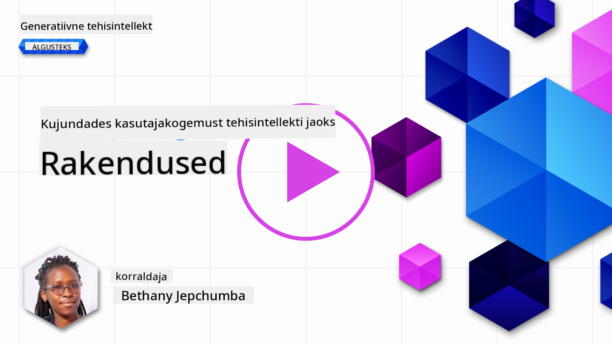
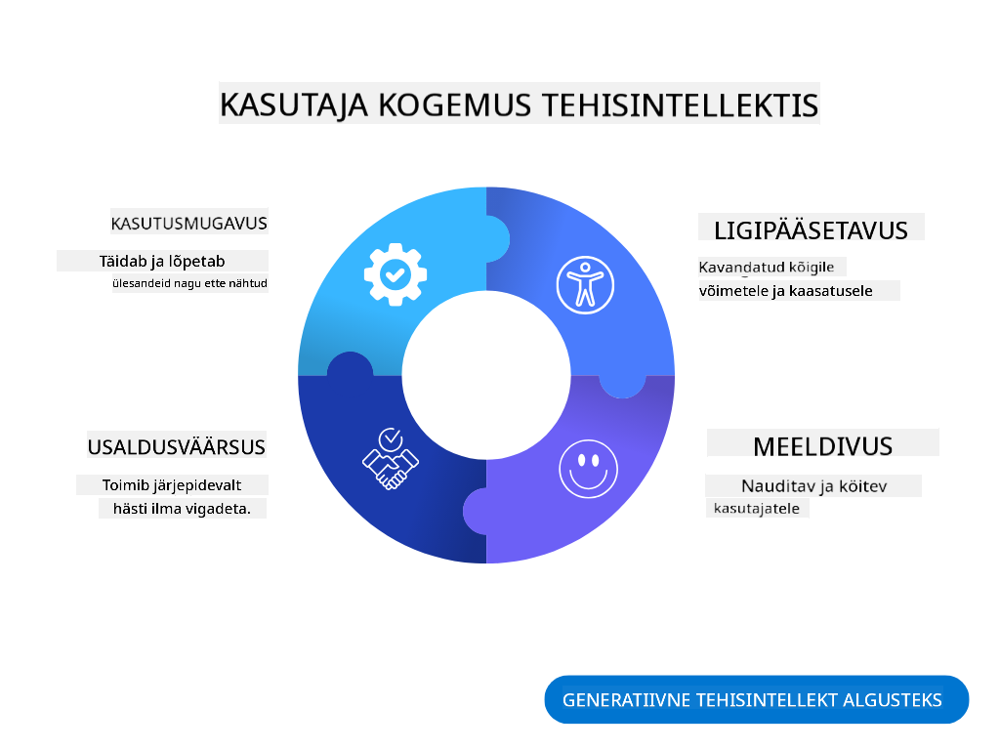
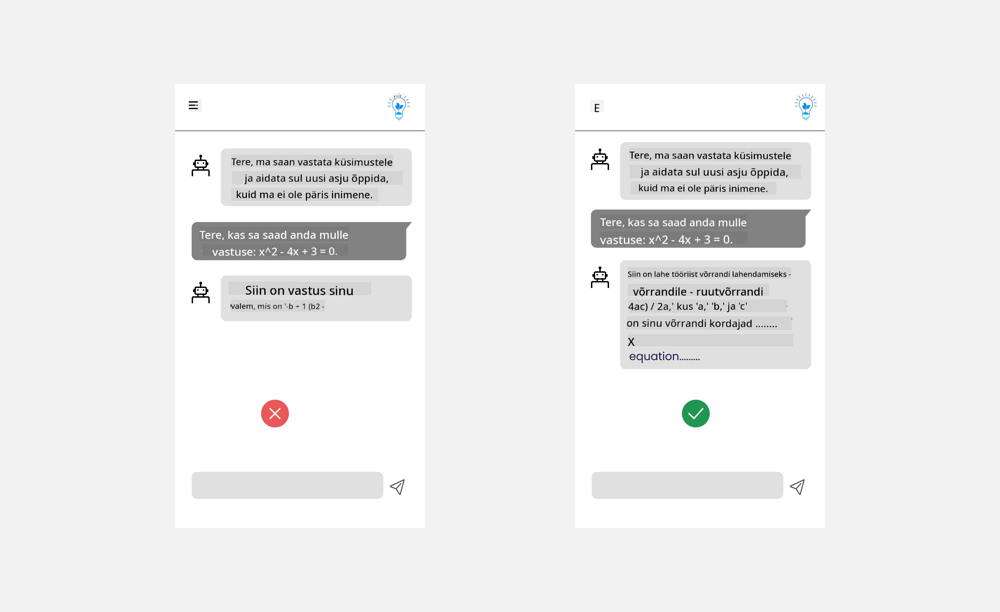
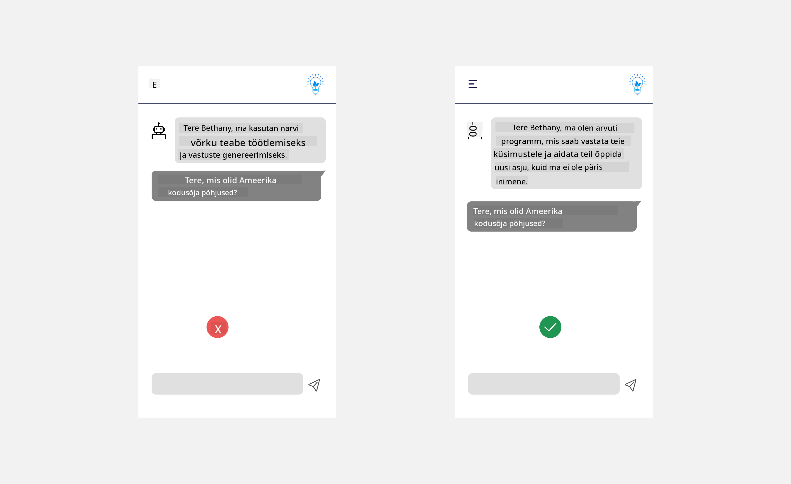
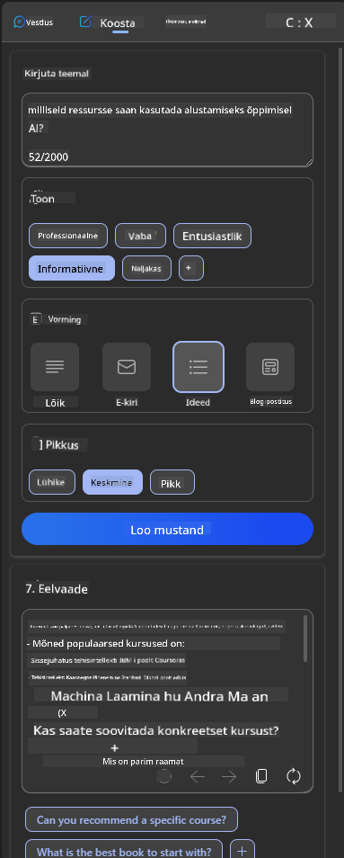
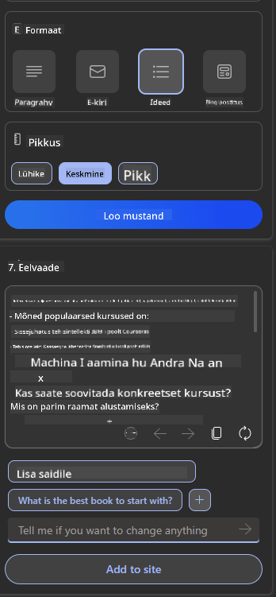
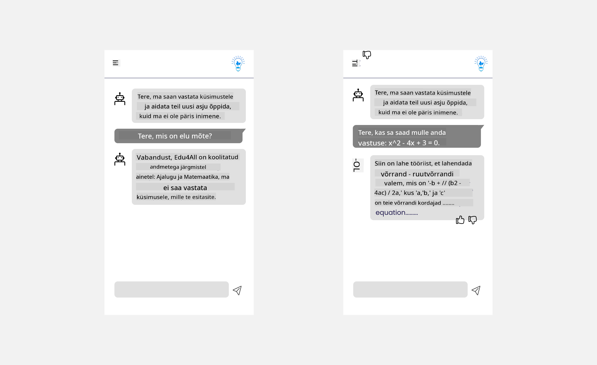

<!--
CO_OP_TRANSLATOR_METADATA:
{
  "original_hash": "78bbeed50fd4dc9fdee931f5daf98cb3",
  "translation_date": "2025-10-18T02:49:14+00:00",
  "source_file": "12-designing-ux-for-ai-applications/README.md",
  "language_code": "et"
}
-->
# UX-i kujundamine tehisintellekti rakenduste jaoks

> _(Klõpsake ülaloleval pildil, et vaadata selle õppetunni videot)_

Kasutajakogemus on rakenduste loomisel väga oluline aspekt. Kasutajad peavad saama teie rakendust tõhusalt kasutada, et ülesandeid täita. Tõhusus on üks asi, kuid rakendused tuleb kujundada ka nii, et neid saaks kasutada kõik, muutes need _kättesaadavaks_. See peatükk keskendub sellele valdkonnale, et saaksite kujundada rakenduse, mida inimesed saavad ja tahavad kasutada.

## Sissejuhatus

Kasutajakogemus tähendab seda, kuidas kasutaja suhtleb konkreetse toote või teenusega, olgu see siis süsteem, tööriist või disain. Tehisintellekti rakendusi arendades keskenduvad arendajad mitte ainult tõhusa kasutajakogemuse tagamisele, vaid ka eetilisusele. Selles õppetunnis käsitleme, kuidas luua tehisintellekti (AI) rakendusi, mis vastavad kasutajate vajadustele.

Õppetund hõlmab järgmisi valdkondi:

- Kasutajakogemuse tutvustus ja kasutajate vajaduste mõistmine
- Tehisintellekti rakenduste kujundamine usalduse ja läbipaistvuse tagamiseks
- Tehisintellekti rakenduste kujundamine koostöö ja tagasiside jaoks

## Õppeesmärgid

Pärast selle õppetunni läbimist oskate:

- Mõista, kuidas luua tehisintellekti rakendusi, mis vastavad kasutajate vajadustele.
- Kujundada tehisintellekti rakendusi, mis edendavad usaldust ja koostööd.

### Eeltingimus

Võtke aega ja lugege rohkem [kasutajakogemuse ja disainmõtlemise kohta.](https://learn.microsoft.com/training/modules/ux-design?WT.mc_id=academic-105485-koreyst)

## Kasutajakogemuse tutvustus ja kasutajate vajaduste mõistmine

Meie väljamõeldud hariduse idufirmas on kaks peamist kasutajat: õpetajad ja õpilased. Mõlemal kasutajal on unikaalsed vajadused. Kasutajakeskne disain seab esikohale kasutaja, tagades, et tooted on asjakohased ja kasulikud neile, kellele need on mõeldud.

Rakendus peaks olema **kasulik, usaldusväärne, kättesaadav ja meeldiv**, et pakkuda head kasutajakogemust.

### Kasulikkus

Kasulik olemine tähendab, et rakendusel on funktsionaalsus, mis vastab selle kavandatud eesmärgile, näiteks hindamisprotsessi automatiseerimine või kordamisküsimuste loomine. Rakendus, mis automatiseerib hindamisprotsessi, peaks suutma täpselt ja tõhusalt määrata õpilaste tööle hindeid vastavalt eelnevalt määratletud kriteeriumidele. Samamoodi peaks rakendus, mis loob kordamisküsimusi, suutma luua asjakohaseid ja mitmekesiseid küsimusi oma andmete põhjal.

### Usaldusväärsus

Usaldusväärne olemine tähendab, et rakendus suudab oma ülesandeid järjepidevalt ja vigadeta täita. Kuid tehisintellekt, nagu inimesedki, pole täiuslik ja võib olla vigadele vastuvõtlik. Rakendused võivad kokku puutuda vigade või ootamatute olukordadega, mis vajavad inimeste sekkumist või parandamist. Kuidas te vigadega toime tulete? Selle õppetunni viimases osas käsitleme, kuidas tehisintellekti süsteeme ja rakendusi kujundatakse koostöö ja tagasiside jaoks.

### Kättesaadavus

Kättesaadav olemine tähendab kasutajakogemuse laiendamist erinevate võimetega kasutajatele, sealhulgas puuetega inimestele, tagades, et keegi ei jääks kõrvale. Järgides kättesaadavuse juhiseid ja põhimõtteid, muutuvad tehisintellekti lahendused kõigile kasutajatele kaasavamaks, kasutatavamaks ja kasulikumaks.

### Meeldivus

Meeldiv olemine tähendab, et rakendust on nauditav kasutada. Atraktiivne kasutajakogemus võib avaldada positiivset mõju kasutajale, julgustades teda rakendust uuesti kasutama ja suurendades ettevõtte tulusid.

Mitte iga väljakutset ei saa lahendada tehisintellektiga. Tehisintellekt täiendab teie kasutajakogemust, olgu selleks siis käsitsi tehtavate ülesannete automatiseerimine või kasutajakogemuste isikupärastamine.

## Tehisintellekti rakenduste kujundamine usalduse ja läbipaistvuse tagamiseks

Usalduse loomine on tehisintellekti rakenduste kujundamisel ülioluline. Usaldus tagab, et kasutaja on kindel, et rakendus täidab oma ülesandeid, annab järjepidevaid tulemusi ja et tulemused vastavad kasutaja vajadustele. Selle valdkonna riskiks on usaldamatus ja ülemäärane usaldus. Usaldamatus tekib siis, kui kasutajal on tehisintellekti süsteemi suhtes vähe või üldse mitte usaldust, mis viib rakenduse tagasilükkamiseni. Ülemäärane usaldus tekib siis, kui kasutaja hindab tehisintellekti süsteemi võimekust üle, mis viib selleni, et kasutajad usaldavad tehisintellekti süsteemi liiga palju. Näiteks automaatse hindamissüsteemi puhul võib ülemäärane usaldus viia selleni, et õpetaja ei kontrolli mõningaid töid, et veenduda hindamissüsteemi korrektsuses. See võib põhjustada õpilastele ebaõiglasi või ebatäpseid hindeid või kaotatud võimalusi tagasisideks ja parandusteks.

Kaks viisi, kuidas tagada usalduse keskne roll disainis, on selgitatavus ja kontroll.

### Selgitatavus

Kui tehisintellekt aitab otsuseid teha, näiteks tulevastele põlvkondadele teadmisi edasi anda, on õpetajatele ja vanematele oluline mõista, kuidas tehisintellekti otsused tehakse. See on selgitatavus - arusaamine, kuidas tehisintellekti rakendused otsuseid teevad. Selgitatavuse kujundamine hõlmab üksikasjade lisamist, mis toovad esile, kuidas tehisintellekt jõudis tulemuseni. Publik peab olema teadlik, et tulemus on genereeritud tehisintellekti, mitte inimese poolt. Näiteks selle asemel, et öelda "Alusta vestlust oma juhendajaga kohe", ütle "Kasuta tehisintellekti juhendajat, kes kohandub sinu vajadustega ja aitab sul õppida omas tempos."

Teine näide on see, kuidas tehisintellekt kasutab kasutaja ja isiklikke andmeid. Näiteks võib õpilase persona piirata teatud funktsioone. Tehisintellekt ei pruugi olla võimeline vastuseid küsimustele avaldama, kuid võib aidata kasutajal mõelda, kuidas probleemi lahendada.

Viimane oluline osa selgitatavusest on selgituste lihtsustamine. Õpilased ja õpetajad ei pruugi olla tehisintellekti eksperdid, seetõttu peaksid selgitused rakenduse võimekuse ja piirangute kohta olema lihtsad ja kergesti arusaadavad.

### Kontroll

Generatiivne tehisintellekt loob koostöö tehisintellekti ja kasutaja vahel, kus näiteks kasutaja saab muuta päringuid erinevate tulemuste saamiseks. Lisaks peaksid kasutajad saama pärast tulemuse genereerimist seda muuta, andes neile kontrolli tunde. Näiteks Bingis otsingut tehes saab kasutaja kohandada oma päringut formaadi, tooni ja pikkuse alusel. Lisaks saab ta muuta tulemust ja kohandada seda vastavalt oma vajadustele, nagu allpool näidatud:

Teine Bingi funktsioon, mis võimaldab kasutajal rakenduse üle kontrolli omada, on võimalus valida, kas lubada või keelata andmete kasutamine tehisintellekti poolt. Näiteks koolirakenduse puhul võib õpilane soovida kasutada oma märkmeid ja õpetaja ressursse kordamismaterjalina.

> Tehisintellekti rakenduste kujundamisel on oluline tagada, et kasutajad ei usaldaks süsteemi liigselt ega seaks selle võimekusele ebarealistlikke ootusi. Üks viis selle saavutamiseks on luua päringute ja tulemuste vahel teatud takistus, mis tuletab kasutajale meelde, et tegemist on tehisintellektiga, mitte teise inimesega.

## Tehisintellekti rakenduste kujundamine koostöö ja tagasiside jaoks

Nagu varem mainitud, loob generatiivne tehisintellekt koostöö kasutaja ja tehisintellekti vahel. Enamik suhtlusi toimub nii, et kasutaja sisestab päringu ja tehisintellekt genereerib tulemuse. Mis juhtub, kui tulemus on vale? Kuidas rakendus vigade korral käitub? Kas tehisintellekt süüdistab kasutajat või võtab aega vea selgitamiseks?

Tehisintellekti rakendused peaksid olema loodud nii, et nad suudaksid tagasisidet vastu võtta ja anda. See mitte ainult ei aita tehisintellekti süsteemil areneda, vaid suurendab ka kasutajate usaldust. Tagasiside tsükkel peaks olema disainis arvestatud, näiteks võib see olla lihtne pöidla üles- või allapoole märk väljundi juures.

Teine viis sellega tegelemiseks on süsteemi võimekuse ja piirangute selge kommunikeerimine. Kui kasutaja teeb vea, küsides midagi, mis ületab tehisintellekti võimekust, peaks olema viis, kuidas sellega toime tulla, nagu allpool näidatud.

Süsteemivead on rakendustes tavalised, kus kasutaja võib vajada abi teabega, mis jääb tehisintellekti ulatusest välja, või rakendusel võib olla piirang, kui palju küsimusi/teemasid saab kasutaja kokkuvõtteid genereerida. Näiteks tehisintellekti rakendus, mis on treenitud piiratud teemade andmetega, näiteks ajalugu ja matemaatika, ei pruugi olla võimeline vastama geograafia küsimustele. Selle leevendamiseks võib tehisintellekti süsteem anda vastuse nagu: "Vabandust, meie toode on treenitud järgmiste teemade andmetega....., ma ei saa vastata teie esitatud küsimusele."

Tehisintellekti rakendused pole täiuslikud, seetõttu on neil paratamatult vigu. Oma rakendusi kujundades peaksite tagama, et loote kasutajate tagasiside ja vigade käsitlemise võimaluse viisil, mis on lihtne ja kergesti arusaadav.

## Ülesanne

Vaadake üle kõik tehisintellekti rakendused, mida olete seni loonud, ja kaaluge järgmiste sammude rakendamist oma rakenduses:

- **Meeldivus:** Mõelge, kuidas saaksite oma rakenduse meeldivamaks muuta. Kas lisate igale poole selgitusi? Kas julgustate kasutajat avastama? Kuidas sõnastate oma veateateid?

- **Kasulikkus:** Veebirakenduse loomine. Veenduge, et teie rakendust saaks kasutada nii hiire kui ka klaviatuuriga.

- **Usaldus ja läbipaistvus:** Ärge usaldage tehisintellekti ja selle väljundit täielikult, mõelge, kuidas lisada protsessi inimene, et väljundit kontrollida. Samuti kaaluge ja rakendage muid viise usalduse ja läbipaistvuse saavutamiseks.

- **Kontroll:** Andke kasutajale kontroll rakendusele antavate andmete üle. Rakendage viis, kuidas kasutaja saab tehisintellekti rakenduses andmete kogumisest loobuda või sellega nõustuda.

<!-- ## [Loengu järgne viktoriin](../../../12-designing-ux-for-ai-applications/quiz-url) -->

## Jätkake õppimist!

Pärast selle õppetunni läbimist vaadake meie [Generatiivse tehisintellekti õppekollektsiooni](https://aka.ms/genai-collection?WT.mc_id=academic-105485-koreyst), et jätkata oma generatiivse tehisintellekti teadmiste arendamist!

Liikuge edasi 13. õppetundi, kus vaatame, kuidas [tehisintellekti rakendusi turvata](../13-securing-ai-applications/README.md?WT.mc_id=academic-105485-koreyst)!

---

**Lahtiütlus**:  
See dokument on tõlgitud AI tõlketeenuse [Co-op Translator](https://github.com/Azure/co-op-translator) abil. Kuigi püüame tagada täpsust, palume arvestada, et automaatsed tõlked võivad sisaldada vigu või ebatäpsusi. Algne dokument selle algses keeles tuleks pidada autoriteetseks allikaks. Olulise teabe puhul soovitame kasutada professionaalset inimtõlget. Me ei vastuta arusaamatuste või valesti tõlgenduste eest, mis võivad tekkida selle tõlke kasutamise tõttu.