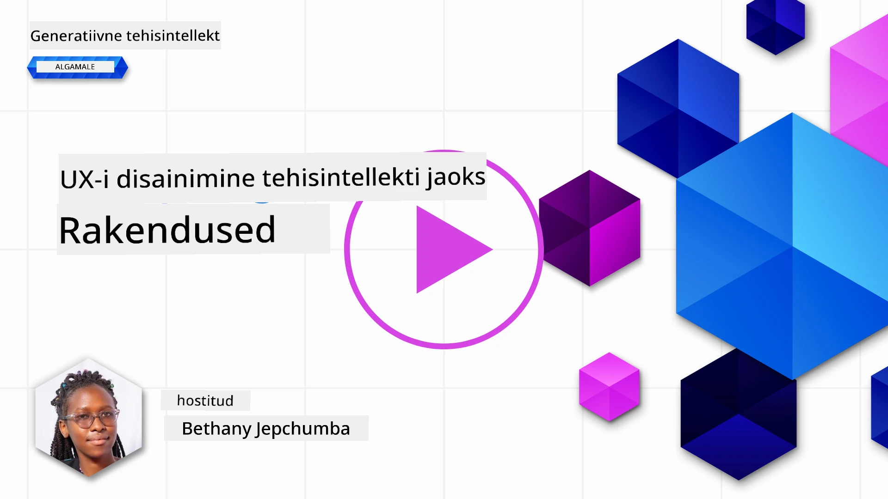
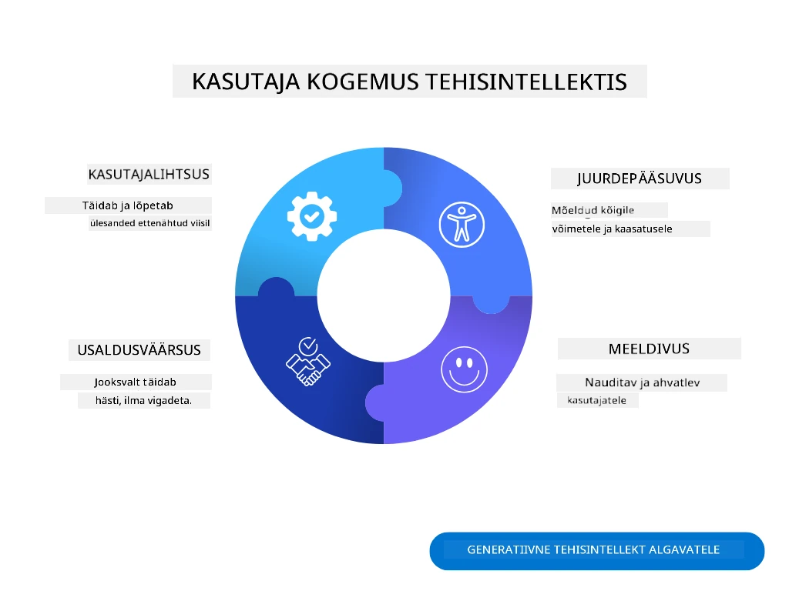
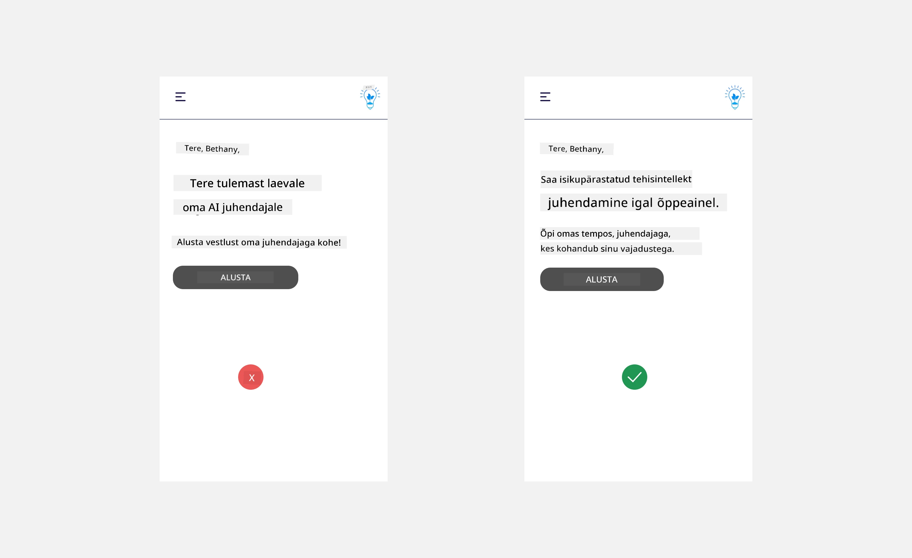
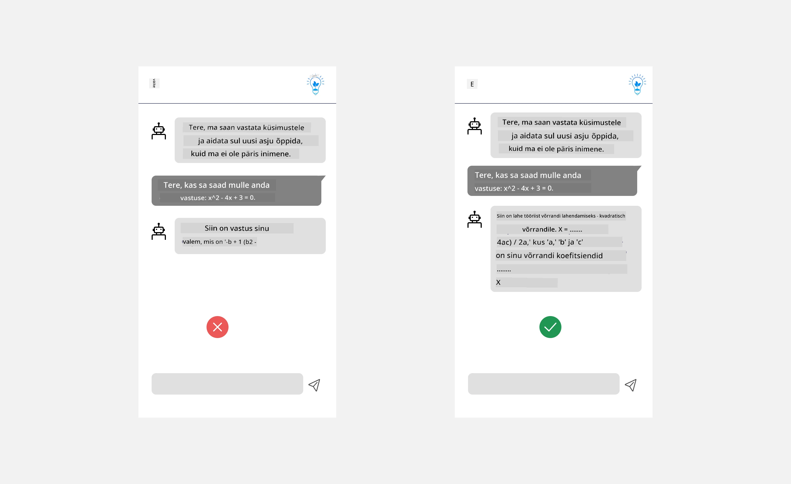
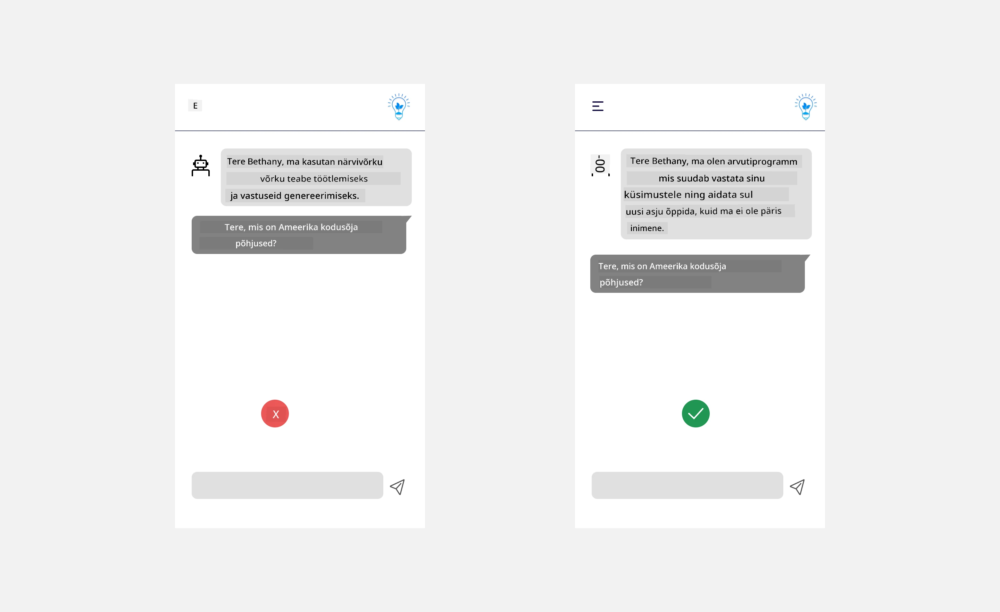
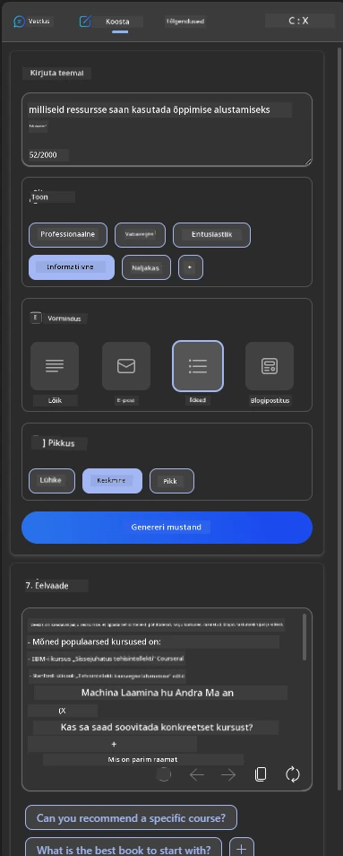
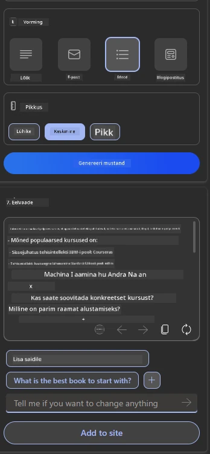
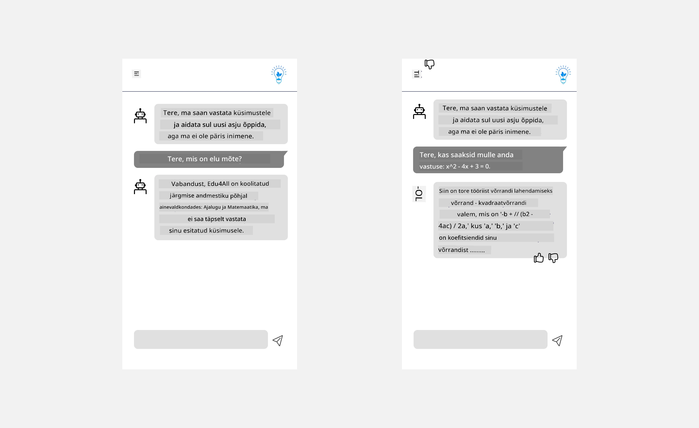

# AI-rakenduste UX-i disainimine

> _(Klõpsake ülaloleval pildil, et vaadata selle tunni videot)_

Kasutajakogemus on väga oluline rakenduste loomisel. Kasutajad peavad suutma teie rakendust kasutada tõhusalt ülesannete täitmiseks. Tõhus olemine on üks asi, kuid peate ka rakendused kujundama nii, et neid saaks kasutada igaüks, muutes need _ligipääsetavateks_. See peatükk keskendub sellele valdkonnale, et loodetavasti kujundate rakenduse, mida inimesed saavad ja soovivad kasutada.

## Sissejuhatus

Kasutajakogemus tähendab, kuidas kasutaja suhtleb ja kasutab konkreetset toodet või teenust, olgu see siis süsteem, tööriist või disain. AI-rakenduste arendamisel keskenduvad arendajad mitte ainult kasutajakogemuse tõhususele, vaid ka eetilisusele. Selles tunnis käsitleme, kuidas ehitada tehisintellekti (AI) rakendusi, mis vastavad kasutajate vajadustele.

Tund käsitleb järgmisi valdkondi:

- Sissejuhatus kasutajakogemusse ja kasutajate vajaduste mõistmine
- AI-rakenduste disainimine usalduse ja läbipaistvuse tagamiseks
- AI-rakenduste disainimine koostöö ja tagasiside jaoks

## Õppeesmärgid

Selle tundi läbimise järel suudate:

- Mõista, kuidas ehitada AI-rakendusi, mis vastavad kasutaja vajadustele.
- Kujundada AI-rakendusi, mis soodustavad usaldust ja koostööd.

### Eeltingimus

Võtke aega ja lugege rohkem [kasutajakogemusest ja disainmõtlemisest.](https://learn.microsoft.com/training/modules/ux-design?WT.mc_id=academic-105485-koreyst)

## Sissejuhatus kasutajakogemusse ja kasutajate vajaduste mõistmine

Meie väljamõeldud haridusettevõttes on kaks peamist kasutajat – õpetajad ja õpilased. Mõlemal neist kasutajatest on unikaalsed vajadused. Kasutajakeskne disain seab kasutaja esikohale, tagades, et tooted on asjakohased ja kasulikud neile, kelle jaoks need on mõeldud.

Rakendus peaks olema **kasulik, usaldusväärne, ligipääsetav ja meeldiv**, et pakkuda head kasutajakogemust.

### Kasutatavus

Kasutuslikkus tähendab, et rakendusel on funktsionaalsus, mis vastab selle eesmärgile, nagu näiteks hindamisprotsessi automatiseerimine või kordamiseks mõeldud kaartide genereerimine. Rakendus, mis automatiseerib hindamisprotsessi, peaks suutma täpselt ja tõhusalt hinnata õpilaste töid eelnevalt määratletud kriteeriumide alusel. Samamoodi peaks kordamiseks mõeldud kaartide genereerimise rakendus suutma luua asjakohaseid ja mitmekesiseid küsimusi oma andmete põhjal.

### Usaldusväärsus

Usaldusväärsus tähendab, et rakendus suudab oma ülesandeid järjepidevalt ja veatult täita. Kuid AI, nagu inimesedki, ei ole täiuslik ja võib eksida. Rakendused võivad kokku puutuda vigade või ootamatute olukordadega, mis vajavad inimsekkumist või parandus. Kuidas te vigu käsitlete? Selle tunni viimases osas käsitleme, kuidas AI süsteeme ja rakendusi disainitakse koostöö ja tagasiside jaoks.

### Ligipääsetavus

Ligipääsetavus tähendab kasutajakogemuse laiendamist erinevate võimetega kasutajatele, sh puudega inimestele, tagades, et keegi ei jää kõrvale. Järgides ligipääsetavuse juhiseid ja põhimõtteid, muutuvad AI lahendused kaasavamaks, kasutajasõbralikumaks ja kasulikumaks kõigile kasutajatele.

### Meeldivus

Meeldivus tähendab, et rakendust on nauditav kasutada. Atraktiivne kasutajakogemus võib avaldada positiivset mõju kasutajale, julgustades teda rakendust uuesti kasutama ja suurendades ettevõtte tulu.

Iga väljakutset ei saa AI-ga lahendada. AI aitab täiendada teie kasutajakogemust, olgu see siis manuaalsete ülesannete automatiseerimine või kasutajakogemuse isikupärastamine.

## AI-rakenduste disainimine usalduse ja läbipaistvuse tagamiseks

Usalduse loomine on AI-rakenduste disainimisel kriitilise tähtsusega. Usaldus tagab, et kasutaja on kindel, et rakendus töötab ning toob järjepidevalt tulemusi, mis vastavad kasutaja vajadustele. Selle valdkonna riskid on usaldamatuse ja liigselt suure usalduse tekkimine. Usaldamatus tekib siis, kui kasutajal on AI süsteemi vastu vähe või üldse mitte usaldust, mis viib rakenduse hülgamisele. Liigne usaldus tekib siis, kui kasutaja hindab AI süsteemi võimeid üle, mis viib AI süsteemi liiga suurele usaldamisele. Näiteks automaatse hindamissüsteemi puhul võib liigne usaldus põhjustada, et õpetaja ei kontrolli mõnda tööd, et veenduda hindamissüsteemi toimimises. See võib viia ebaõiglaste või ebatäpsete hinneteni õpilaste jaoks või tagasiside ja parenduste võimaluste kaotamiseni.

Kaks viisi, kuidas tagada usalduse seadmine disaini keskmesse, on seletatavus ja kontroll.

### Seletatavus

Kui AI aitab teha otsuseid, nagu tulevastele põlvedele teadmiste edasiandmine, on õpetajatel ja vanematel oluline mõista, kuidas AI otsuseid teeb. See on seletatavus – arusaamine, kuidas AI rakendused otsuseid langetavad. Seletatavuse tagamiseks lisatakse detaile, mis rõhutavad, kuidas AI jõudis väljundini. Publikul peab olema teadlik, et tulemus on genereeritud AI poolt, mitte inimese poolt. Näiteks öelge "Kasuta AI juhendajat, mis kohandub sinu vajadustega ja aitab õppida omas tempos" asemel "Alusta vestlust oma juhendajaga kohe."

Teine näide on, kuidas AI kasutab kasutaja ja isikuandmeid. Näiteks kasutajal, kelle persona on õpilane, võivad olla teatud piirangud vastavalt tema personale. AI ei pruugi vastata küsimustele otse, kuid võib aidata kasutajal mõelda, kuidas probleemi lahendada.

Viimane oluline osa seletatavusest on selgituste lihtsustamine. Õpilased ja õpetajad ei pruugi olla AI eksperdid, seetõttu peaksid rakenduse võimaluste või piirangute selgitused olema lihtsad ja kergesti mõistetavad.

### Kontroll

Generatiivne AI loob koostöö AI ja kasutaja vahel, kus kasutaja saab muuta sisendeid erinevate tulemuste saamiseks. Kui väljund on genereeritud, peaks kasutajal olema võimalik tulemusi muuta, mis annab neile kontrollitunde. Näiteks Microsoft Copiloti (endise Bing Chat) kasutamisel saate ümber sõnastada sisendi vastavalt vormingule, toonile ja pikkusele. Lisaks saate väljundit muuta, nagu allpool näidatud:

Veel üks Microsoft Copiloti funktsioon, mis võimaldab kasutajal rakendust kontrollida, on võimalus valida andmete kasutamisse ja mittekasutamisse. Näiteks koolirakenduse puhul võib õpilane soovida kasutada nii oma märkmeid kui ka õpetajate materjale kordamismaterjalina.

> AI-rakendusi kujundades on kavatsuslikkus võtmetähtsusega, et vältida kasutajate liigset usaldamist ja ebarealistlike ootuste teket süsteemi võimekuste suhtes. Üks viis selleks on luua hõõrdumist sisendi ja väljundi vahele, tuletades kasutajale meelde, et tegemist on AI-ga, mitte teise inimesega.

## AI-rakenduste disainimine koostöö ja tagasiside jaoks

Nagu eelnevalt mainitud, loob generatiivne AI koostöö kasutaja ja AI vahel. Enamik vestlusi koosneb kasutaja sisendist ja AI väljundist. Mis juhtub, kui väljund on vale? Kuidas rakendus vigu käsitleb, kui need esinevad? Kas AI süüdistab kasutajat või võtab aega vea selgitamiseks?

AI-rakendused peaksid olema loodud tagasiside saamiseks ja andmiseks. See aitab AI süsteemil areneda ja ehitab usaldust kasutajate seas. Disaini peaks kaasama tagasisideahela, näiteks lihtne pöidla üles või alla hinnang väljundile.

Teine viis selleks on süsteemi võimekuste ja piirangute selge kommunikeerimine. Kui kasutaja teeb vea, paludes AI-l ietsat, mis on tema võimetest väljas, peaks olema samuti viis selle käsitlemiseks, nagu allpool näidatud.

Süsteemivead on tavalised rakendustes, kus kasutaja võib vajada abi teabe osas, mis jääb AI või rakenduse piiridest välja, või kus rakendusel võib olla piirang selle kohta, mitu küsimust või teemat kasutaja saab kokkuvõtteks genereerida. Näiteks AI-rakendus, mis on koolitatud piiratud teemade andmete pealt nagu ajalugu ja matemaatika, ei pruugi osata vastata geograafia küsimustele. Selle leevendamiseks võib AI süsteem anda vastuse nagu: "Vabandame, meie toode on koolitatud järgmistes ainetes..., ma ei saa vastata teie esitatud küsimusele."

AI-rakendused ei ole täiuslikud, seega teevad nad vigu. Rakendusi disainides peate tagama, et kasutajate tagasiside ja vigade käsitlemise võimalused on lihtsad ja kergesti selgitavad.

## Ülesanne

Võtke ükskõik milline seni loodud AI-rakendus ja proovige oma rakenduses arvestada järgmisi samme:

- **Meeldivus:** Mõelge, kuidas muuta oma rakendus meeldivamaks. Kas lisate igale poole selgitusi? Kas julgustate kasutajat avastama? Kuidas formuleerite oma veateateid?

- **Kasutatavus:** Loote veebirakendust. Veenduge, et rakendus oleks navigeeritav nii hiire kui klaviatuuriga.

- **Usaldus ja läbipaistvus:** Ärge usaldage AI-t ja selle väljundit täielikult, mõelge, kuidas lisada protsessi inimene, kes kinnitaks väljundi õigsust. Samuti mõelge ja rakendage teisi viise usalduse ja läbipaistvuse saavutamiseks.

- **Kontroll:** Andke kasutajale kontroll võimaluse üle, mida andmeid nad rakendusele annavad. Rakendage viisi, mille abil kasutaja saab AI rakenduses andmete kogumisse vabatahtlikult valida või sellest loobuda.

<!-- ## [Loengu lõpu viktoriin](../../../12-designing-ux-for-ai-applications/quiz-url) -->

## Jätkake õppimist!

Pärast selle tunni lõpetamist vaadake meie [Generatiivse AI õppimise kogumikku](https://aka.ms/genai-collection?WT.mc_id=academic-105485-koreyst), et tõsta oma generatiivse AI teadmiste taset!

Minge järgmise, 13. tunnini, kus vaatleme, kuidas [AI-rakendusi turvata](../13-securing-ai-applications/README.md?WT.mc_id=academic-105485-koreyst)!

---

<!-- CO-OP TRANSLATOR DISCLAIMER START -->
**Lahtiütlus**:
See dokument on tõlgitud kasutades AI tõlketeenust [Co-op Translator](https://github.com/Azure/co-op-translator). Kuigi me püüdleme täpsuse poole, palun pange tähele, et automatiseeritud tõlgetes võib esineda vigu või ebatäpsusi. Originaaldokument selle emakeeles tuleks pidada autoriteetseks allikaks. Olulise teabe puhul soovitatakse kasutada professionaalset inimtõlget. Me ei vastuta selle tõlkega seotud eksimustest või valesti mõistmistest.
<!-- CO-OP TRANSLATOR DISCLAIMER END -->