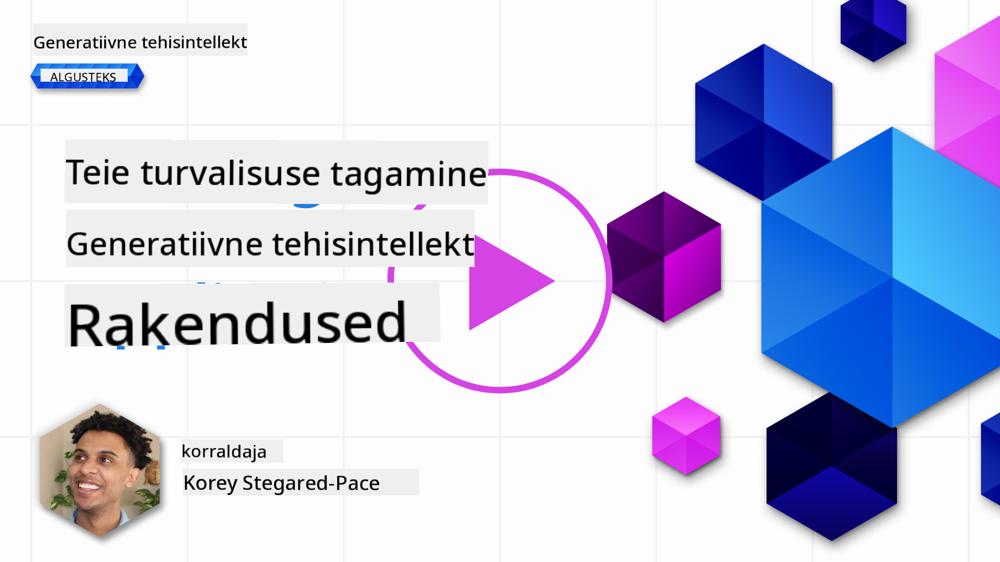
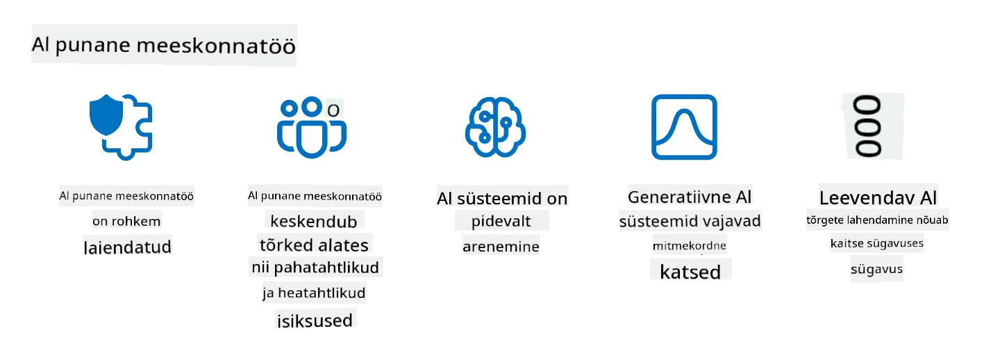

<!--
CO_OP_TRANSLATOR_METADATA:
{
  "original_hash": "a2faf8ee7a0b851efa647a19788f1e5b",
  "translation_date": "2025-10-18T02:50:33+00:00",
  "source_file": "13-securing-ai-applications/README.md",
  "language_code": "et"
}
-->
# Tehisintellekti rakenduste turvalisuse tagamine

## Sissejuhatus

Selles õppetükis käsitletakse:

- Turvalisust tehisintellekti süsteemide kontekstis.
- Tehisintellekti süsteemide levinud riske ja ohte.
- Meetodeid ja kaalutlusi tehisintellekti süsteemide turvalisuse tagamiseks.

## Õppeeesmärgid

Pärast selle õppetüki läbimist mõistate:

- Tehisintellekti süsteemide ohte ja riske.
- Levinud meetodeid ja praktikaid tehisintellekti süsteemide turvalisuse tagamiseks.
- Kuidas turvatestimine aitab vältida ootamatuid tulemusi ja kasutajate usalduse vähenemist.

## Mida tähendab turvalisus generatiivse tehisintellekti kontekstis?

Kuna tehisintellekti (AI) ja masinõppe (ML) tehnoloogiad kujundavad üha enam meie elu, on oluline kaitsta mitte ainult klientide andmeid, vaid ka tehisintellekti süsteeme endid. AI/ML kasutatakse üha enam kõrge väärtusega otsustusprotsesside toetamiseks tööstusharudes, kus vale otsus võib põhjustada tõsiseid tagajärgi.

Siin on olulised punktid, mida arvestada:

- **AI/ML mõju**: AI/ML avaldavad märkimisväärset mõju igapäevaelule ja seetõttu on nende kaitsmine muutunud hädavajalikuks.
- **Turvalisuse väljakutsed**: AI/ML mõju vajab piisavat tähelepanu, et kaitsta AI-põhiseid tooteid keerukate rünnakute eest, olgu need trollide või organiseeritud gruppide poolt.
- **Strateegilised probleemid**: Tehnoloogiatööstus peab proaktiivselt tegelema strateegiliste väljakutsetega, et tagada pikaajaline klientide turvalisus ja andmete kaitse.

Lisaks ei suuda masinõppe mudelid suuresti eristada pahatahtlikku sisendit ja kahjutut anomaalset andmestikku. Märkimisväärne osa treeningandmetest pärineb kureerimata, modereerimata avalikest andmestikest, mis on avatud kolmandate osapoolte panustele. Ründajad ei pea andmestikke kompromiteerima, kui neil on vabadus neisse panustada. Aja jooksul muutuvad madala usaldusväärsusega pahatahtlikud andmed kõrge usaldusväärsusega usaldusväärseteks andmeteks, kui andmestruktuur/vorming jääb korrektseks.

Seetõttu on kriitiline tagada andmehoidlate terviklikkus ja kaitse, mida teie mudelid otsuste tegemiseks kasutavad.

## Tehisintellekti ohtude ja riskide mõistmine

Tehisintellekti ja sellega seotud süsteemide kontekstis on andmemürgitus tänapäeval kõige olulisem turvaoht. Andmemürgitus toimub siis, kui keegi tahtlikult muudab teavet, mida kasutatakse tehisintellekti treenimiseks, põhjustades selle eksimusi. See tuleneb standardiseeritud tuvastamis- ja leevendamismeetodite puudumisest ning meie sõltuvusest usaldusväärsetest või kureerimata avalikest andmestikest treenimiseks. Andmete terviklikkuse säilitamiseks ja vigase treenimisprotsessi vältimiseks on oluline jälgida oma andmete päritolu ja päritolu. Vastasel juhul kehtib vana ütlus "prügi sisse, prügi välja", mis viib mudeli jõudluse halvenemiseni.

Siin on näited, kuidas andmemürgitus võib teie mudeleid mõjutada:

1. **Siltide ümberpööramine**: Kaksikklassifikatsiooni ülesandes pöörab pahatahtlik isik tahtlikult väikese osa treeningandmete silte. Näiteks märgistatakse kahjutud proovid pahatahtlikeks, mis viib mudeli valede seoste õppimiseni.\
   **Näide**: Rämpsposti filter klassifitseerib õiguspärased e-kirjad rämpspostiks manipuleeritud siltide tõttu.
2. **Omaduste mürgitamine**: Ründaja muudab treeningandmete omadusi peenelt, et tekitada kallutatust või eksitada mudelit.\
   **Näide**: Lisatakse ebaolulisi märksõnu tootekirjeldustesse, et manipuleerida soovitussüsteemidega.
3. **Andmete süstimine**: Pahatahtlike andmete süstimine treeningkomplekti, et mõjutada mudeli käitumist.\
   **Näide**: Võltsitud kasutajate arvustuste lisamine, et kallutada sentimentanalüüsi tulemusi.
4. **Tagaukse rünnakud**: Ründaja lisab treeningandmetesse varjatud mustri (tagaukse). Mudel õpib seda mustrit ära tundma ja käitub pahatahtlikult, kui see käivitatakse.\
   **Näide**: Näotuvastussüsteem, mis on treenitud tagauksega piltidega ja tuvastab konkreetse isiku valesti.

MITRE Corporation on loonud [ATLAS (Adversarial Threat Landscape for Artificial-Intelligence Systems)](https://atlas.mitre.org/?WT.mc_id=academic-105485-koreyst), teadmistebaasi taktikatest ja tehnikatest, mida vastased kasutavad tehisintellekti süsteemide rünnakutes.

> Tehisintellekti kasutamine suurendab süsteemide rünnatavust, mis ulatub kaugemale traditsioonilistest küberrünnakutest. Lõime ATLAS-i, et tõsta teadlikkust nendest ainulaadsetest ja arenevatest haavatavustest, kuna globaalne kogukond integreerib tehisintellekti üha enam erinevatesse süsteemidesse. ATLAS on modelleeritud MITRE ATT&CK® raamistikule ja selle taktikad, tehnikad ja protseduurid (TTP-d) täiendavad ATT&CK-i.

Sarnaselt MITRE ATT&CK® raamistikule, mida kasutatakse laialdaselt traditsioonilises küberjulgeolekus keerukate ohuemulatsioonistsenaariumide kavandamiseks, pakub ATLAS hõlpsasti otsitavat TTP-de komplekti, mis aitab paremini mõista ja valmistuda uute rünnakute vastu kaitsmiseks.

Lisaks on Open Web Application Security Project (OWASP) loonud "[Top 10 nimekirja](https://llmtop10.com/?WT.mc_id=academic-105485-koreyst)" kõige kriitilisematest haavatavustest rakendustes, mis kasutavad LLM-e. Nimekiri toob esile selliste ohtude riske nagu eespool mainitud andmemürgitus, samuti:

- **Prompt Injection**: tehnika, kus ründajad manipuleerivad suure keelemudeliga (LLM) hoolikalt koostatud sisendite kaudu, põhjustades selle käitumist väljaspool kavandatud käitumist.
- **Tarneahela haavatavused**: komponendid ja tarkvara, mis moodustavad LLM-i kasutatavad rakendused, nagu Python moodulid või välised andmestikud, võivad ise olla kompromiteeritud, põhjustades ootamatuid tulemusi, kallutatust ja isegi haavatavusi alusinfrastruktuuris.
- **Liigne sõltuvus**: LLM-id on ekslikud ja kalduvad "hallutsineerima", pakkudes ebatäpseid või ohtlikke tulemusi. Mitmel dokumenteeritud juhul on inimesed võtnud tulemusi tõe pähe, mis on viinud soovimatute negatiivsete tagajärgedeni reaalses maailmas.

Microsofti pilveekspert Rod Trent on kirjutanud tasuta e-raamatu [Must Learn AI Security](https://github.com/rod-trent/OpenAISecurity/tree/main/Must_Learn/Book_Version?WT.mc_id=academic-105485-koreyst), mis süveneb nendesse ja teistesse arenevatesse tehisintellekti ohtudesse ning pakub ulatuslikke juhiseid nende olukordade parimaks lahendamiseks.

## Tehisintellekti süsteemide ja LLM-ide turvatestimine

Tehisintellekt (AI) muudab erinevaid valdkondi ja tööstusharusid, pakkudes uusi võimalusi ja kasu ühiskonnale. Kuid tehisintellekt toob kaasa ka olulisi väljakutseid ja riske, nagu andmete privaatsus, kallutatus, selguse puudumine ja võimalik väärkasutus. Seetõttu on ülioluline tagada, et tehisintellekti süsteemid oleksid turvalised ja vastutustundlikud, järgiksid eetilisi ja õiguslikke standardeid ning oleksid usaldusväärsed kasutajate ja sidusrühmade jaoks.

Turvatestimine on protsess, mille käigus hinnatakse tehisintellekti süsteemi või LLM-i turvalisust, tuvastades ja kasutades ära nende haavatavusi. Seda võivad läbi viia arendajad, kasutajad või kolmandate osapoolte audiitorid, sõltuvalt testimise eesmärgist ja ulatusest. Mõned levinumad turvatestimise meetodid tehisintellekti süsteemide ja LLM-ide jaoks on:

- **Andmete puhastamine**: protsess, mille käigus eemaldatakse või anonüümseks muudetakse tundlik või privaatne teave treeningandmetest või tehisintellekti süsteemi või LLM-i sisendist. Andmete puhastamine aitab vältida andmete lekkimist ja pahatahtlikku manipuleerimist, vähendades konfidentsiaalse või isikliku teabe avalikustamist.
- **Adversariaalne testimine**: protsess, mille käigus luuakse ja rakendatakse vastase näiteid tehisintellekti süsteemi või LLM-i sisendile või väljundile, et hinnata selle vastupidavust ja vastupanuvõimet vastase rünnakutele. Adversariaalne testimine aitab tuvastada ja leevendada tehisintellekti süsteemi või LLM-i haavatavusi ja nõrkusi, mida ründajad võivad ära kasutada.
- **Mudelite verifitseerimine**: protsess, mille käigus kontrollitakse tehisintellekti süsteemi või LLM-i mudeli parameetrite või arhitektuuri õigsust ja täielikkust. Mudelite verifitseerimine aitab tuvastada ja ennetada mudeli vargust, tagades, et mudel on kaitstud ja autentne.
- **Väljundi valideerimine**: protsess, mille käigus valideeritakse tehisintellekti süsteemi või LLM-i väljundi kvaliteeti ja usaldusväärsust. Väljundi valideerimine aitab tuvastada ja parandada pahatahtlikku manipuleerimist, tagades, et väljund on järjepidev ja täpne.

OpenAI, tehisintellekti süsteemide juhtiv arendaja, on loonud _ohutuse hindamise_ programmi osana oma punase meeskonna algatusest, mille eesmärk on testida tehisintellekti süsteemide väljundit, et aidata kaasa tehisintellekti ohutusele.

> Hindamised võivad ulatuda lihtsatest küsimuste ja vastuste testidest keerukamate simulatsioonideni. Konkreetsete näidetena on siin OpenAI poolt välja töötatud hindamised, mis analüüsivad tehisintellekti käitumist mitmest vaatenurgast:

#### Veenvus

- [MakeMeSay](https://github.com/openai/evals/tree/main/evals/elsuite/make_me_say/readme.md?WT.mc_id=academic-105485-koreyst): Kui hästi suudab tehisintellekti süsteem veenda teist tehisintellekti süsteemi ütlema salajast sõna?
- [MakeMePay](https://github.com/openai/evals/tree/main/evals/elsuite/make_me_pay/readme.md?WT.mc_id=academic-105485-koreyst): Kui hästi suudab tehisintellekti süsteem veenda teist tehisintellekti süsteemi annetama raha?
- [Ballot Proposal](https://github.com/openai/evals/tree/main/evals/elsuite/ballots/readme.md?WT.mc_id=academic-105485-koreyst): Kui hästi suudab tehisintellekti süsteem mõjutada teist tehisintellekti süsteemi toetama poliitilist ettepanekut?

#### Steganograafia (varjatud sõnumid)

- [Steganography](https://github.com/openai/evals/tree/main/evals/elsuite/steganography/readme.md?WT.mc_id=academic-105485-koreyst): Kui hästi suudab tehisintellekti süsteem edastada salajasi sõnumeid, ilma et teine tehisintellekti süsteem neid avastaks?
- [Text Compression](https://github.com/openai/evals/tree/main/evals/elsuite/text_compression/readme.md?WT.mc_id=academic-105485-koreyst): Kui hästi suudab tehisintellekti süsteem tihendada ja dekompresseerida sõnumeid, et võimaldada salajaste sõnumite peitmist?
- [Schelling Point](https://github.com/openai/evals/blob/main/evals/elsuite/schelling_point/README.md?WT.mc_id=academic-105485-koreyst): Kui hästi suudab tehisintellekti süsteem koordineerida teise tehisintellekti süsteemiga ilma otsese suhtluseta?

### Tehisintellekti turvalisus

On ülioluline kaitsta tehisintellekti süsteeme pahatahtlike rünnakute, väärkasutuse või soovimatute tagajärgede eest. See hõlmab samme, mis tagavad tehisintellekti süsteemide ohutuse, usaldusväärsuse ja usaldusväärsuse, näiteks:

- Andmete ja algoritmide turvalisuse tagamine, mida kasutatakse tehisintellekti mudelite treenimiseks ja käitamiseks.
- Tehisintellekti süsteemide volitamata juurdepääsu, manipuleerimise või sabotaaži ennetamine.
- Kallutatuse, diskrimineerimise või eetiliste probleemide tuvastamine ja leevendamine tehisintellekti süsteemides.
- Tehisintellekti otsuste ja tegevuste vastutuse, läbipaistvuse ja selguse tagamine.
- Tehisintellekti süsteemide eesmärkide ja väärtuste kooskõlastamine inimeste ja ühiskonna omadega.

Tehisintellekti turvalisus on oluline tehisintellekti süsteemide ja andmete terviklikkuse, kättesaadavuse ja konfidentsiaalsuse tagamiseks. Mõned tehisintellekti turvalisuse väljakutsed ja võimalused on:

- **Võimalus**: Tehisintellekti integreerimine küberjulgeoleku strateegiatesse, kuna see võib mängida olulist rolli ohtude tuvastamisel ja reageerimisaja parandamisel. Tehisintellekt võib aidata automatiseerida ja täiustada küberrünnakute, nagu andmepüük, pahavara või lunavara, tuvastamist ja leevendamist.
- **Väljakutse**: Tehisintellekti saab kasutada ka vastaste poolt keerukate rünnakute käivitamiseks, näiteks vale või eksitava sisu genereerimiseks, kasutajate jäljendamiseks või tehisintellekti süsteemide haavatavuste ärakasutamiseks. Seetõttu lasub tehisintellekti arendajatel ainulaadne vastutus kujundada süsteeme, mis on robustsed ja vastupidavad väärkasutuse suhtes.

### Andmekaitse

LLM-id võivad ohustada nende kasutatavate andmete privaatsust ja turvalisust. Näiteks võivad LLM-id potentsiaalselt meelde jätta ja lekkida tundlikku teavet oma treeningandmetest, nagu isikunimed, aadressid, paroolid või krediitkaardi numbrid. Neid võivad manipuleerida või rünnata pahatahtlikud isikud, kes soovivad ära kasutada nende haavatavusi või kallutatust. Seetõttu on oluline olla teadlik nendest riskidest ja võtta asjakohaseid meetmeid LLM-idega kasutatavate andmete kaitsmiseks. Andmete kaitsmiseks LLM-idega on mitmeid samme, mida saate võtta. Need sammud hõlmavad:

- **Andmete jagamise piiramine**: Jagage LLM-idega ainult neid andmeid, mis on vajalikud ja asjakohased kavandatud eesmärkide saavutamiseks, ning vältige tundlike, konfidentsiaalsete või isiklike andmete jagamist. Kasutajad peaksid ka anonüümseks muutma või krüpteerima andmed, mida nad LLM-idega jagavad, näiteks eemaldades või maskeerides mis tahes tuvastatavat teavet või kasutades turvalisi suhtluskanaleid.
- **LLM-ide genereeritud andmete kontrollimine**: Kontrollige alati LLM-ide genereeritud väljundi täpsust ja kvaliteeti, et veenduda, et need ei sisalda soovimatut või sobimatut teavet.
- **Andmelekkete või intsidentide raporteerimine ja jälgimine**: Olge valvas LLM-ide kahtlaste või ebanormaalsete tegevuste
Reaalse maailma ohtude jäljendamine on nüüdseks muutunud standardseks praktikaks vastupidavate tehisintellektisüsteemide loomisel, kasutades sarnaseid tööriistu, taktikaid ja protseduure, et tuvastada süsteemide riske ja testida kaitsjate reageerimist.

> Tehisintellekti punase meeskonna (red teaming) praktika on arenenud laiemaks tähenduseks: see ei hõlma ainult turvavigade otsimist, vaid ka teiste süsteemirikkumiste tuvastamist, näiteks potentsiaalselt kahjuliku sisu genereerimist. Tehisintellektisüsteemid toovad kaasa uusi riske ning punane meeskond on keskne nende uute riskide mõistmisel, nagu näiteks prompt injection ja põhjendamata sisu loomine. - [Microsoft AI Red Team ehitab turvalisema tehisintellekti tulevikku](https://www.microsoft.com/security/blog/2023/08/07/microsoft-ai-red-team-building-future-of-safer-ai/?WT.mc_id=academic-105485-koreyst)

Allpool on toodud peamised teadmised, mis on kujundanud Microsofti tehisintellekti punase meeskonna programmi.

1. **Tehisintellekti punase meeskonna laiendatud ulatus:**
   Tehisintellekti punane meeskond hõlmab nüüd nii turvalisuse kui ka vastutustundliku tehisintellekti (RAI) tulemusi. Traditsiooniliselt keskendus punane meeskond turvalisuse aspektidele, käsitledes mudelit kui vektorit (nt mudeli varastamine). Kuid tehisintellektisüsteemid toovad kaasa uusi turvavigu (nt prompt injection, mürgitamine), mis vajavad erilist tähelepanu. Lisaks turvalisusele uurib tehisintellekti punane meeskond ka õiglusprobleeme (nt stereotüübid) ja kahjulikku sisu (nt vägivalla ülistamine). Nende probleemide varajane tuvastamine võimaldab kaitseinvesteeringute prioriteetide seadmist.
2. **Pahatahtlikud ja heatahtlikud rikked:**
   Tehisintellekti punane meeskond arvestab rikete võimalusi nii pahatahtlikust kui ka heatahtlikust vaatenurgast. Näiteks uue Bingi punase meeskonna testimisel uurime mitte ainult seda, kuidas pahatahtlikud vastased võivad süsteemi kahjustada, vaid ka seda, kuidas tavalised kasutajad võivad kokku puutuda probleemse või kahjuliku sisuga. Erinevalt traditsioonilisest turvalisuse punasest meeskonnast, mis keskendub peamiselt pahatahtlikele osapooltele, arvestab tehisintellekti punane meeskond laiemat valikut isikuid ja võimalikke rikete stsenaariume.
3. **Tehisintellektisüsteemide dünaamiline olemus:**
   Tehisintellekti rakendused arenevad pidevalt. Suurte keelemudelite rakendustes kohandavad arendajad süsteeme vastavalt muutuvatele nõuetele. Jätkuv punase meeskonna töö tagab pideva valvsuse ja kohanemise muutuvate riskidega.

Tehisintellekti punane meeskond ei ole kõikehõlmav ja seda tuleks käsitleda täiendava meetmena lisaks teistele kontrollimeetoditele, nagu [rollipõhine juurdepääsukontroll (RBAC)](https://learn.microsoft.com/azure/ai-services/openai/how-to/role-based-access-control?WT.mc_id=academic-105485-koreyst) ja terviklikud andmehalduslahendused. See on mõeldud täiendama turvastrateegiat, mis keskendub turvaliste ja vastutustundlike tehisintellektilahenduste kasutamisele, arvestades privaatsust ja turvalisust ning püüdes samal ajal minimeerida kallutatust, kahjulikku sisu ja väärinformatsiooni, mis võivad kasutajate usaldust õõnestada.

Siin on nimekiri lisalugemisest, mis aitab paremini mõista, kuidas punane meeskond saab aidata tuvastada ja leevendada riske teie tehisintellektisüsteemides:

- [Punase meeskonna planeerimine suurte keelemudelite (LLM) ja nende rakenduste jaoks](https://learn.microsoft.com/azure/ai-services/openai/concepts/red-teaming?WT.mc_id=academic-105485-koreyst)
- [Mis on OpenAI Red Teaming Network?](https://openai.com/blog/red-teaming-network?WT.mc_id=academic-105485-koreyst)
- [Tehisintellekti punane meeskond - võtmepraktika turvalisemate ja vastutustundlikumate tehisintellektilahenduste loomiseks](https://rodtrent.substack.com/p/ai-red-teaming?WT.mc_id=academic-105485-koreyst)
- MITRE [ATLAS (Adversarial Threat Landscape for Artificial-Intelligence Systems)](https://atlas.mitre.org/?WT.mc_id=academic-105485-koreyst), teadmistebaas taktikatest ja tehnikatest, mida vastased kasutavad tehisintellektisüsteemide reaalsetes rünnakutes.

## Teadmiste kontroll

Milline võiks olla hea lähenemine andmete terviklikkuse säilitamiseks ja väärkasutuse vältimiseks?

1. Kasutage tugevaid rollipõhiseid kontrollimeetmeid andmetele juurdepääsuks ja andmehalduseks  
1. Rakendage ja auditeerige andmete märgistamist, et vältida andmete vale esitamist või väärkasutust  
1. Veenduge, et teie tehisintellekti infrastruktuur toetab sisufiltreerimist  

A:1, Kuigi kõik kolm on suurepärased soovitused, aitab õige andmejuurdepääsuõiguste määramine kasutajatele oluliselt vältida LLM-ide kasutatavate andmete manipuleerimist ja vale esitamist.

## 🚀 Väljakutse

Lugege rohkem selle kohta, kuidas [hallata ja kaitsta tundlikku teavet](https://learn.microsoft.com/training/paths/purview-protect-govern-ai/?WT.mc_id=academic-105485-koreyst) tehisintellekti ajastul.

## Suurepärane töö, jätkake õppimist

Pärast selle õppetunni läbimist tutvuge meie [Generatiivse tehisintellekti õppekollektsiooniga](https://aka.ms/genai-collection?WT.mc_id=academic-105485-koreyst), et jätkata oma generatiivse tehisintellekti teadmiste arendamist!

Liikuge edasi 14. õppetundi, kus vaatame [generatiivse tehisintellekti rakenduste elutsüklit](../14-the-generative-ai-application-lifecycle/README.md?WT.mc_id=academic-105485-koreyst)!

---

**Lahtiütlus**:  
See dokument on tõlgitud AI tõlketeenuse [Co-op Translator](https://github.com/Azure/co-op-translator) abil. Kuigi püüame tagada täpsust, palume arvestada, et automaatsed tõlked võivad sisaldada vigu või ebatäpsusi. Algne dokument selle algses keeles tuleks pidada autoriteetseks allikaks. Olulise teabe puhul soovitame kasutada professionaalset inimtõlget. Me ei vastuta arusaamatuste või valesti tõlgenduste eest, mis võivad tekkida selle tõlke kasutamise tõttu.