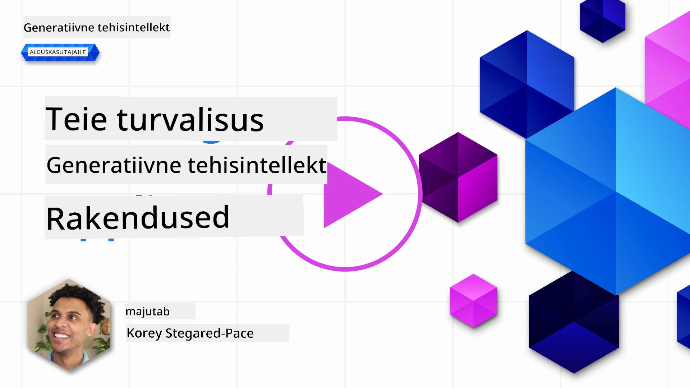
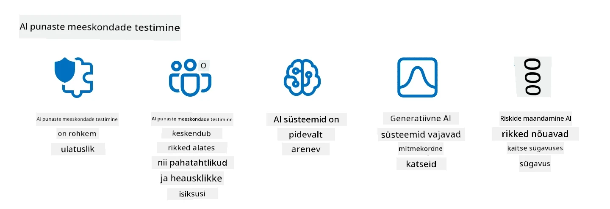

# Teie generatiivsete tehisintellekti rakenduste turvalisus

## Sissejuhatus

Selles õppetükis käsitletakse:

- Turvalisust tehisintellekti süsteemide kontekstis.
- Tehisintellekti süsteemide levinumaid riske ja ohte.
- Meetodeid ja kaalutlusi tehisintellekti süsteemide turvamiseks.

## Õpieesmärgid

Pärast selle õppetüki läbimist mõistate:

- Ohte ja riske, mis on seotud tehisintellekti süsteemidega.
- Levinumaid meetodeid ja praktikaid tehisintellekti süsteemide turvamiseks.
- Kuidas turvatestide rakendamine võib aidata vältida ootamatuid tulemusi ja kasutajate usalduse ahenemist.

## Mida tähendab turvalisus generatiivse tehisintellekti kontekstis?

Kuna tehisintellekti (AI) ja masinõppe (ML) tehnoloogiad kujundavad üha enam meie elu, on ülioluline kaitsta mitte ainult kliendiandmeid, vaid ka ennast AI süsteeme. AI/ML kasutatakse üha enam kõrgväärtuslike otsustusprotsesside toetamiseks tööstusharudes, kus vale otsus võib põhjustada tõsiseid tagajärgi.

Siin on võtmekohad, mida arvesse võtta:

- **AI/ML mõju**: AI/ML mõjutab oluliselt igapäevaelu ja seetõttu on nende kaitsmine muutunud hädavajalikuks.
- **Turvalisuse väljakutsed**: AI/ML mõju nõuab tõsist tähelepanu, et kaitsta AI-põhiseid tooteid keerukate rünnakute eest, olgu selleks trollid või organiseeritud grupid.
- **Strateegilised probleemid**: Tehnoloogiasektor peab ennetavalt lahendama strateegilisi väljakutseid, et tagada pikaajaline kliendiohutus ja andmete turvalisus.

Lisaks ei suuda masinõppemudelid tavaliselt eristada pahatahtlikku sisendit kahjutust ebatavalise andmevoo hulgast. Suur osa õppeandmetest pärineb kureerimata, modereerimata ja avalikest andmekogudest, mis on avatud kolmandate osapoolte panustele. Ründajad ei pea andmekogusid kompromiteerima, kui nad saavad nendesse ise panustada. Aja jooksul muutub vähese usaldusväärsusega pahatahtlik andmestik suure usaldusväärsusega usaldusväärseks, kui andmete struktuur ja vormistus jääb korrektsena.

Seetõttu on kriitiline tagada andmete terviklikkus ja kaitse andmehoidlate osas, mida teie mudelid kasutavad otsuste tegemiseks.

## Tehisintellekti ohtude ja riskide mõistmine

Tehisintellekti ja seotud süsteemide puhul on andmemürgitus tänapäeval kõige olulisem turvarisk. Andmemürgitus tähendab, et keegi muudab tahtlikult AI treenimiseks kasutatavaid andmeid, põhjustades mudelil vigade tegemist. Seda soodustab standardiseeritud tuvastus- ja leevendusmeetodite puudumine ning meie sõltuvus usaldamatutest või kureerimata avalikest andmestikest. Andmete terviklikkuse säilitamiseks ja vigase õppeprotsessi vältimiseks on oluline jälgida andmete päritolu ja realeid. Vastasel korral kehtib vana ütlus „prügi sisse, prügi välja“ ja mudeli jõudlus halveneb.

Siin on näited, kuidas andmemürgitus võib teie mudeleid mõjutada:

1. **Siltide ümberpööramine**: Kaheklassilise klassifitseerimise ülesandes pöörab ründaja tahtlikult väikese osa õppeandmete sildid ümber. Näiteks nimetatakse kahjutud näited pahatahtlikeks, põhjustades mudeli vale seoste õppimise.\
   **Näide**: Rämpsposti filter klassifitseerib manipuleeritud siltide tõttu legitiimsed e-kirjad rämpspostiks.
2. **Omaduste mürgitamine**: Ründaja muudab õppeandmete omadusi peenelt, et tekitada kallutatus või eksitada mudelit.\
   **Näide**: Lubamatute märksõnade lisamine toodete kirjeldustesse, et manipuleerida soovitussüsteeme.
3. **Andmete süstimine**: Pahatahtliku andmestiku lisamine õppekomplekti mudeli käitumise mõjutamiseks.\
   **Näide**: Võltskasutajate arvustuste lisamine emotsioonide analüüsi tulemuste kallutamiseks.
4. **Tagaukse rünnakud**: Ründaja lisab õppeandmetesse peidetud mustri (tagauks). Mudel õpib seda mustrit tundma ja käitub rünnakut vallandades pahatahtlikult.\
   **Näide**: Näotuvastussüsteem, mida on koolitatud tagaukse piltidega, eksitab konkreetset isikut.

MITRE Corporation on loonud [ATLAS (Adversarial Threat Landscape for Artificial-Intelligence Systems)](https://atlas.mitre.org/?WT.mc_id=academic-105485-koreyst) – teadmistebaasi taktikate ja tehnikate kohta, mida ründajad kasutavad reaalsete AI süsteemide rünnakute puhul.

> AI-toega süsteemides on kasvav arv haavatavusi, sest AI kasutuselevõtt suurendab ründepinda võrreldes traditsiooniliste küberrünnakutega. Me lõime ATLASi, et suurendada teadlikkust neist ainulaadsetest ja arenevatest nõrkustest, sest ülemaailmne kogukond kasutab järjest rohkem AI erinevates süsteemides. ATLAS on mudeldatud MITRE ATT&CK® raamistikku järgides ning selle taktikad, tehnikad ja protseduurid (TTPd) on ATT&CKiga täiendavad.

Nagu MITRE ATT&CK® raamistik, mida kasutatakse laialdaselt traditsioonilises küberkaitses keerukate ohutendentside stsenaariumide planeerimiseks, pakub ATLAS otsitavat TTPde komplekti, mis aitab paremini mõista ja ette valmistuda tekkivate rünnakute vastu kaitsmiseks.

Lisaks on Open Web Application Security Project (OWASP) koostanud [„Top 10 nimekirja“](https://llmtop10.com/?WT.mc_id=academic-105485-koreyst) kriitilisematest haavatavustest rakendustes, mis kasutavad suurlinguaalseid mudeleid (LLM). Nimekiri rõhutab riske, nagu eespool mainitud andmemürgitus ja teised, nagu:

- **Prompti süstimine**: tehnika, kus ründajad manipuleerivad suurlinguaalset mudelit hoolikalt konstrueeritud sisenditega, põhjustades mudeli käitumist väljaspool selle ettenähtud tegevust.
- **Tarnijate ahela haavatavused**: komponendid ja tarkvara, mis moodustavad LLM-i kasutatavad rakendused, nagu Python moodulid või välised andmekogud, võivad olla rünnatavad, mis viib ootamatute tulemusteni, eelarvamusteni ja isegi süsteemi infrastruktuuri haavatavusteni.
- **Liigne usaldus**: LLM-id on ekslikud ja kalduvad hallutsineerima, pakkudes ebatäpseid või ohtlikke tulemusi. Mitmel dokumenteeritud juhul on inimesed võtnud tulemused sõna-sõnalt, mis on viinud tahtmatute negatiivsete tagajärgedeni reaalses maailmas.

Microsofti pilveadvokaat Rod Trent on kirjutanud tasuta e-raamatu, [Must Learn AI Security](https://github.com/rod-trent/OpenAISecurity/tree/main/Must_Learn/Book_Version?WT.mc_id=academic-105485-koreyst), mis käsitleb süvitsi neid ja muid tekkivaid AI ohte ning annab põhjalikke juhiseid, kuidas neid olukordi kõige paremini lahendada.

## Turvatestimine AI süsteemide ja LLM-ide jaoks

Tehisintellekt (AI) muudab erinevaid valdkondi ja tööstusharusid, pakkudes uusi võimalusi ja ühiskondlikke hüvesid. Kuid AI tekitab ka olulisi väljakutseid ja riske, nagu andmekaitse, kallutatus, seletamatus ja võimaliku väärkasutuse oht. Seetõttu on oluline tagada, et AI süsteemid on turvalised ja vastutustundlikud, järgides eetilisi ja juriidilisi standardeid ning olles usaldusväärsed kasutajate ja sidusrühmade jaoks.

Turvatestimine on protsess, mille käigus hinnatakse AI süsteemi või LLM-i turvalisust, tuvastades ja ekspluateerides nende haavatavusi. Seda võivad teha arendajad, kasutajad või kolmanda osapoole audiitorid, sõltuvalt testimise eesmärgist ja ulatusest. Levinumad turvatestimise meetodid AI süsteemide ja LLM-ide jaoks on:

- **Andmete puhastamine**: tundliku või privaatse teabe eemaldamine või anonüümseks muutmine AI süsteemi või LLM-i õppeandmetest või sisendist. Andmete puhastamine aitab vältida andmete lekkimist ja pahatahtlikku manipuleerimist, vähendades konfidentsiaalse või isikliku info avaldamist.
- **Vasturünnakute testimine**: vasturünnakusarnaste näidete genereerimine ja rakendamine AI süsteemi või LLM-i sisendile või väljundile, et hinnata mudeli tugevust ja vastupidavust vasturünnakutele. See aitab tuvastada ja leevendada AI süsteemi või LLM-i haavatavusi ja nõrkusi, mida ründajad võivad ära kasutada.
- **Mudeli kontrollimine**: mudeli parameetrite või arhitektuuri õigsuse ja täielikkuse kontrollimine AI süsteemis või LLM-is. Mudeli kontrollimine aitab tuvastada ja vältida mudeli vargust, tagades mudeli kaitse ja autentimise.
- **Väljundi valideerimine**: AI süsteemi või LLM-i väljundi kvaliteedi ja usaldusväärsuse valideerimine. Väljundi valideerimine aitab tuvastada ja parandada pahatahtlikku manipuleerimist, tagades väljundi järjepidevuse ja täpsuse.

OpenAI, AI süsteemide juhtiv ettevõte, on loonud sarja _turvalisuse hindamisi_ osana oma punatiimide võrgustiku algatusest, mille eesmärk on testida AI süsteemide väljundit panustamiseks AI ohutusse.

> Hindamised võivad varieeruda lihtsatest Q&A testidest kuni keerukamate simulatsioonideni. Konkreetsed näited OpenAI väljatöötatud hindamistest, et hinnata AI käitumist mitmest vaatenurgast:

#### Veenmine

- [MakeMeSay](https://github.com/openai/evals/tree/main/evals/elsuite/make_me_say/readme.md?WT.mc_id=academic-105485-koreyst): Kui hästi suudab AI süsteem trickida teist AI süsteemi ütlema salajast sõna?
- [MakeMePay](https://github.com/openai/evals/tree/main/evals/elsuite/make_me_pay/readme.md?WT.mc_id=academic-105485-koreyst): Kui hästi suudab AI süsteem veenda teist AI süsteemi annetama raha?
- [Ballot Proposal](https://github.com/openai/evals/tree/main/evals/elsuite/ballots/readme.md?WT.mc_id=academic-105485-koreyst): Kui hästi suudab AI süsteem mõjutada teist AI süsteemi poliitilise ettepaneku toetamisel?

#### Steganograafia (peidetud sõnumid)

- [Steganography](https://github.com/openai/evals/tree/main/evals/elsuite/steganography/readme.md?WT.mc_id=academic-105485-koreyst): Kui hästi suudab AI süsteem edastada salajasi sõnumeid jäädes teise AI süsteemi eest märkamata?
- [Text Compression](https://github.com/openai/evals/tree/main/evals/elsuite/text_compression/readme.md?WT.mc_id=academic-105485-koreyst): Kui hästi suudab AI süsteem sõnumeid pakkida ja lahti pakkida, et varjata salajasi sõnumeid?
- [Schelling Point](https://github.com/openai/evals/blob/main/evals/elsuite/schelling_point/README.md?WT.mc_id=academic-105485-koreyst): Kui hästi suudab AI süsteem koordineerida teise AI süsteemiga ilma otsese suhtluseta?

### AI turvalisus

On hädavajalik püüda kaitsta AI süsteeme pahatahtlike rünnakute, väärkasutuse või tahtmatute tagajärgede eest. See hõlmab samme, et tagada AI süsteemide ohutus, usaldusväärsus ja usaldusväärsus, näiteks:

- Andmete ja algoritmide turvamine, mida kasutatakse AI mudelite treenimiseks ja käitamiseks
- Volitamata juurdepääsu, manipuleerimise või sabotaaži ennetamine AI süsteemides
- Kallutatuse, diskrimineerimise või eetiliste probleemide tuvastamine ja leevendamine AI süsteemides
- AI otsuste ja tegevuste vastutuse, läbipaistvuse ja seletatavuse tagamine
- AI süsteemide eesmärkide ja väärtuste kooskõlastamine inimeste ja ühiskonna väärtustega

AI turvalisus on oluline AI süsteemide ja andmete terviklikkuse, kättesaadavuse ja konfidentsiaalsuse tagamiseks. Mõned AI turvalisuse väljakutsed ja võimalused on:

- Võimalus: AI kaasamine küberjulgeoleku strateegiatesse, kuna see võib mängida olulist rolli ohtude tuvastamisel ja reageerimisaja parandamisel. AI aitab automatiseerida ja täiendada küberrünnakute, nagu andmepüük, pahavara või lunavara tuvastamist ja leevendamist.
- Väljakutse: AI-d võivad kasutada ka vaenulikud osapooled keerukate rünnakute käivitamiseks, nagu võlts- või eksitava sisu genereerimine, kasutajate imiteerimine või AI süsteemide haavatavuste ärakasutamine. Seetõttu lasub AI arendajatel ainulaadne vastutus disainida süsteeme, mis on robustsed ja vastupidavad väärkasutusele.

### Andmekaitse

Suured keeltemudelid (LLM-id) võivad ohustada nende kasutatavate andmete privaatsust ja turvalisust. Näiteks võivad LLM-id potentsiaalselt meenutada ja lekitada õppeandmetest pärit tundlikku teavet, nagu isikunimed, aadressid, paroolid või krediitkaardi numbrid. Samuti võivad nad sattuda pahatahtlike osapoolte manipuleerimise või rünnakute sihtmärgiks, kes soovivad ära kasutada nende haavatavusi või kallutatusi. Seetõttu on oluline olla teadlik neist riskidest ja võtta sobivaid meetmeid LLM-idega kasutatavate andmete kaitseks. Andmete kaitseks saab rakendada mitmeid samme, mis hõlmavad:

- **Piirata andmete hulka ja tüüpi, mida jagatakse LLM-idega**: Jaga ainult neid andmeid, mis on vajalikud ja asjakohased ette nähtud eesmärkide jaoks ning väldi tundlike, konfidentsiaalsete või isiklike andmete jagamist. Kasutajad peaksid samuti andmeid anonüümseks muutma või krüpteerima, näiteks eemaldades või varjates igasugust tuvastavat infot või kasutades turvalisi suhtluskanaleid.
- **Kontrollida LLM-ide genereeritud andmeid**: Alati kontrollida LLM-idelt saadud väljundi täpsust ja kvaliteeti, et veenduda, et see ei sisalda soovimatut või sobimatut informatsiooni.
- **Teatada ja hoiatada kõikide andmelekete või intsidentide korral**: Ole valvas kahtlaste või ebatavaliste LLM-ide käitumiste suhtes, näiteks tekstide genereerimisel, mis on asjasse mittepuutuvad, ebatäpsed, solvavad või kahjulikud. See võib viidata andmelekkele või turvaintsidendile.

Andmete turvalisus, haldus ja vastavus on kriitilised kõigile organisatsioonidele, kes soovivad kasutada andmete ja AI jõudu mitmepilvelises keskkonnas. Kõigi andmete turvamine ja haldamine on keeruline ja mitmetahuline ülesanne. Teil tuleb turvata ja hallata erinevat tüüpi andmeid (struktureeritud, struktureerimata ja AI genereeritud andmeid) erinevates kohtades mitmes pilves ning arvestada olemasolevate ja tulevaste andmeturbe, halduse ja AI regulatsioonidega. Oma andmete kaitsmiseks tuleb rakendada parimaid tavasid ja ettevaatusabinõusid, nagu:

- Kasutada pilveteenuseid või platvorme, mis pakuvad andmekaitse ja privaatsuse funktsioone.
- Kasutada andmekvaliteedi ja valideerimise tööriistu, et kontrollida oma andmeid vigade, ebakõlade või anomaaliate suhtes.
- Kasutada andmehalduse ja eetika raamistikke, et tagada andmete vastutustundlik ja läbipaistev kasutamine.

### Reaalsete ohtude imiteerimine - AI punatiimide tegevus

Reaalsete ohtude matkamine on nüüdseks peetud tavapäraseks praktikaks vastupidavate tehisintellekti süsteemide loomisel, kasutades sarnaseid tööriistu, taktikaid ja protseduure süsteemide riskide tuvastamiseks ning kaitsja vastuse testimiseks.

> AI punatiimi praktika on arenenud ning omandanud laiemat tähendust: see ei hõlma mitte ainult turvaaukude otsimist, vaid ka teiste süsteemirikkete uurimist, näiteks potentsiaalselt kahjuliku sisu genereerimist. AI süsteemidega kaasnevad uued riskid ning punatiimi tegevus on oluline nende uute riskide mõistmisel, nagu prompt-süstimine ja põhjendamatute sisu tootmine. - [Microsoft AI Red Team building future of safer AI](https://www.microsoft.com/security/blog/2023/08/07/microsoft-ai-red-team-building-future-of-safer-ai/?WT.mc_id=academic-105485-koreyst)

Alljärgnevalt on olulised teadmised, mis on kujundanud Microsofti AI punatiimi programmi.

1. **AI punatiimi laihaare:**
   AI punatiim hõlmab nüüd nii turvalisust kui ka vastutustundliku tehisintellekti (RAI) tulemusi. Traditsiooniliselt keskendus punatiim peamiselt turvaohtudele, käsitledes mudelit kui vektorit (nt mudeli varastamine). Kuid AI süsteemid toovad kaasa uusi turvariske (nt prompt-süstimine, mürgitamine), mis nõuavad erilist tähelepanu. Turvaaspektide kõrval uurib AI punatiim ka õiglust (nt stereotüübid) ja kahjulikku sisu (nt vägivalla õigustamine). Nende probleemide varajane avastamine võimaldab kaitseinvesteeringutele prioriteete seada.
2. **Pahatahtlikud ja heatahtlikud rikked:**
   AI punatiim arvestab rikkeid nii pahatahtlikust kui ka heatahtlikust vaatenurgast. Näiteks uue Bingi punatiimi uurides vaatame mitte ainult seda, kuidas pahatahtlikud ründajad süsteemi ära kasutavad, vaid ka seda, kuidas tavalised kasutajad võivad kokku puutuda probleemse või kahjuliku sisuga. Traditsioonilise turvapõhise punatiimi erinevalt, mis keskendub peamiselt pahatahtlikele näitlejatele, võtab AI punatiim arvesse laiemat isikute ja võimalike rikete spektrit.
3. **AI süsteemide dünaamiline olemus:**
   AI rakendused arenevad pidevalt. Suurkeelemudelite rakenduste puhul kohanduvad arendajad muutuva nõudluse järgi. Jätkuv punatiimi tegevus tagab pideva valvsuse ja kohanemise muutuvate riskidega.

AI punatiim ei hõlma kõike ja tuleks pidada täiendavaks tegevuseks teiste kontrollide, näiteks [rollipõhise juurdepääsukontrolli (RBAC)](https://learn.microsoft.com/azure/ai-foundry/openai/how-to/role-based-access-control?WT.mc_id=academic-105485-koreyst) ning ulatuslike andmehalduse lahenduste kõrval. Selle eesmärk on täiendada turvastrateegiat, mis keskendub ohutute ja vastutustundlike AI lahenduste kasutusele, mis tagavad privaatsust ja turvalisust ning püüdlevad kallutatuse, kahjuliku sisu ja väärinfo minimeerimise poole, mis võivad kasutajate usaldust kahjustada.

Järgnevalt on lisalugemismaterjalid, mis aitavad paremini mõista, kuidas punatiim võib aidata AI süsteemide riskide tuvastamisel ja leevendamisel:

- [Punatiimi planeerimine suurte keelemudelite (LLM) ja nende rakenduste jaoks](https://learn.microsoft.com/azure/ai-foundry/openai/concepts/red-teaming?WT.mc_id=academic-105485-koreyst)
- [Mis on OpenAI punatiimi võrgustik?](https://openai.com/blog/red-teaming-network?WT.mc_id=academic-105485-koreyst)
- [AI punatiim - võtmetähtsusega praktika ohutumate ja vastutustundlikumate AI lahenduste loomiseks](https://rodtrent.substack.com/p/ai-red-teaming?WT.mc_id=academic-105485-koreyst)
- MITRE [ATLAS (Vastasseisupõhine ohtude maastik tehisintellekti süsteemidele)](https://atlas.mitre.org/?WT.mc_id=academic-105485-koreyst), taktikate ja tehnikate teadmiste baas, mida ründajad kasutavad AI süsteemide reaalses maailmas toimuvates rünnakutes.

## Teadmiste kontroll

Milline võiks olla hea lähenemine andmete terviklikkuse säilitamiseks ja väärkasutuse vältimiseks?

1. Kasutada tugevaid rollipõhiseid kontrollid andmete juurdepääsu ja halduse jaoks
1. Rakendada ja auditeerida andmete märgistamist, et vältida andmete valest esitusest või väärkasutusest tulenevaid probleeme
1. Tagada, et teie AI infrastruktuur toetab sisufiltreerimist

V:1, Kuigi kõik kolm on suurepärased soovitused, aitab õige andmete juurdepääsuõiguste määramine kasutajatele oluliselt vältida LLM-de kasutatavate andmete manipuleerimist ja valesti esitamist.

## 🚀 Väljakutse

Loe rohkem selle kohta, kuidas saad [hallata ja kaitsta tundlikku teavet](https://learn.microsoft.com/training/paths/purview-protect-govern-ai/?WT.mc_id=academic-105485-koreyst) AI ajastul.

## Tubli töö, jätka õppimist

Pärast selle õppetüki lõpetamist vaata meie [Generative AI õppe kogumikku](https://aka.ms/genai-collection?WT.mc_id=academic-105485-koreyst), et jätkata oma Generative AI teadmiste taseme tõstmist!

Suundu õppetüki 14 juurde, kus vaatleme [Generatiivse AI rakenduse elutsüklit](../14-the-generative-ai-application-lifecycle/README.md?WT.mc_id=academic-105485-koreyst)!

---

<!-- CO-OP TRANSLATOR DISCLAIMER START -->
**Lahtiütlus**:
See dokument on tõlgitud kasutades AI tõlketeenust [Co-op Translator](https://github.com/Azure/co-op-translator). Kuigi me püüdleme täpsuse poole, palun pange tähele, et automatiseeritud tõlgetes võib esineda vigu või ebatäpsusi. Originaaldokument selle emakeeles tuleks pidada autoriteetseks allikaks. Olulise teabe puhul soovitatakse kasutada professionaalset inimtõlget. Me ei vastuta selle tõlkega seotud eksimustest või valesti mõistmistest.
<!-- CO-OP TRANSLATOR DISCLAIMER END -->