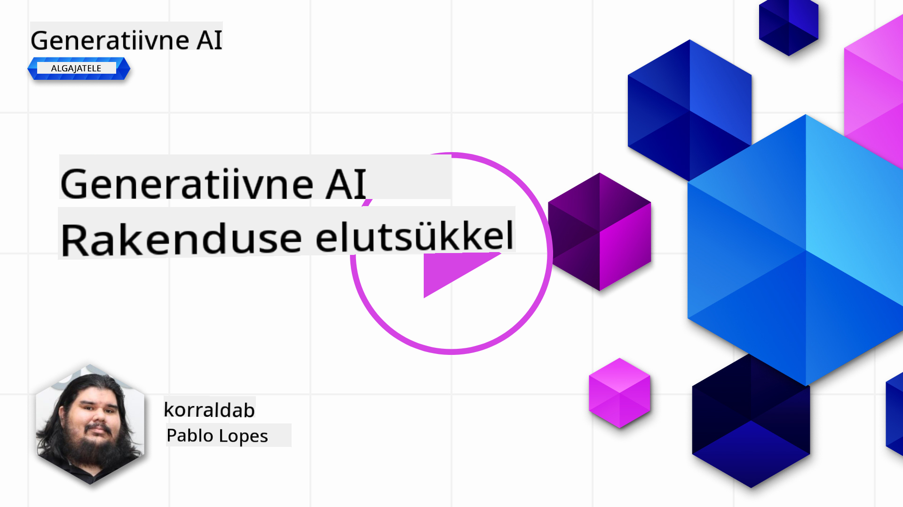
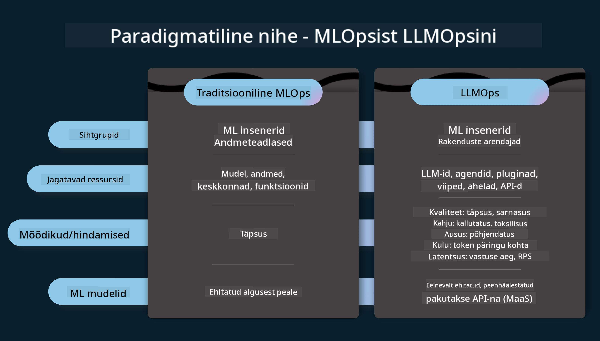
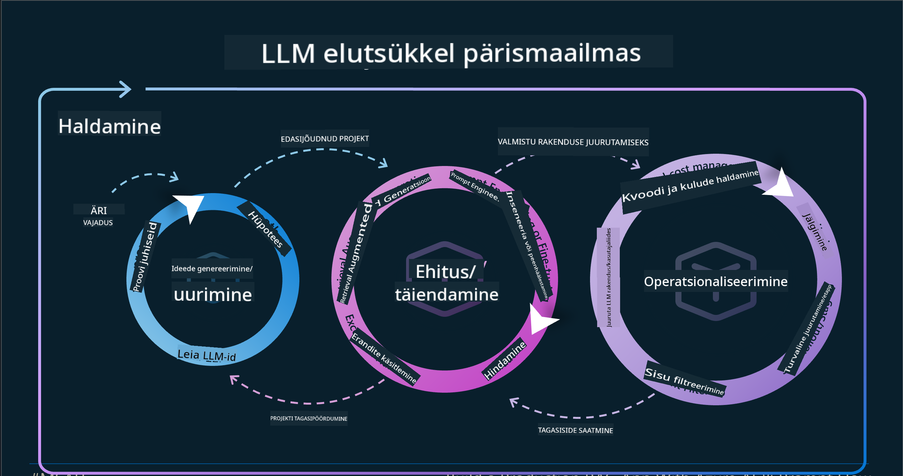
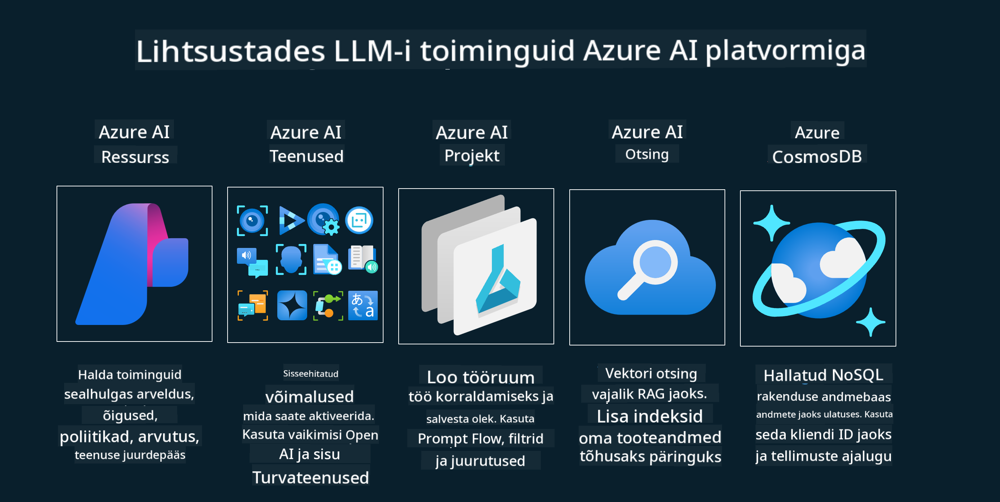

<!--
CO_OP_TRANSLATOR_METADATA:
{
  "original_hash": "b9d32511b27373a1b21b5789d4fda057",
  "translation_date": "2025-10-18T02:54:35+00:00",
  "source_file": "14-the-generative-ai-application-lifecycle/README.md",
  "language_code": "et"
}
-->

# Generatiivse tehisintellekti rakenduse elutsükkel

Oluline küsimus kõigi tehisintellekti rakenduste puhul on AI funktsioonide asjakohasus, kuna tehisintellekti valdkond areneb kiiresti. Selleks, et teie rakendus jääks asjakohaseks, usaldusväärseks ja vastupidavaks, peate seda pidevalt jälgima, hindama ja täiustama. Siin tulebki mängu generatiivse tehisintellekti elutsükkel.

Generatiivse tehisintellekti elutsükkel on raamistik, mis juhendab teid generatiivse tehisintellekti rakenduse arendamise, juurutamise ja hooldamise etappides. See aitab teil määratleda oma eesmärgid, mõõta oma tulemuslikkust, tuvastada väljakutseid ja rakendada lahendusi. Samuti aitab see viia teie rakenduse vastavusse teie valdkonna ja sidusrühmade eetiliste ja juriidiliste standarditega. Järgides generatiivse tehisintellekti elutsüklit, saate tagada, et teie rakendus pakub alati väärtust ja rahuldab kasutajaid.

## Sissejuhatus

Selles peatükis õpite:

- MLOpsist LLMOpsi paradigma muutuse mõistmine
- LLM elutsükkel
- Elutsükli tööriistad
- Elutsükli mõõdikud ja hindamine

## MLOpsist LLMOpsi paradigma muutuse mõistmine

LLM-id on uus tööriist tehisintellekti arsenalis, mis on äärmiselt võimsad analüüsi- ja generatsioonülesannete jaoks rakendustes. Kuid selle võimsusega kaasnevad ka tagajärjed, mis mõjutavad tehisintellekti ja klassikalise masinõppe ülesannete sujuvust.

Seetõttu vajame uut paradigmat, et kohandada seda tööriista dünaamiliselt ja õige motivatsiooniga. Vanemad tehisintellekti rakendused saab kategoriseerida kui "ML rakendused" ja uuemad tehisintellekti rakendused kui "GenAI rakendused" või lihtsalt "AI rakendused", mis peegeldavad ajakohaseid tehnoloogiaid ja tehnikaid. See muudab meie narratiivi mitmel viisil, vaadake järgmist võrdlust.

Pange tähele, et LLMOpsis keskendume rohkem rakenduste arendajatele, kasutades integratsioone võtmetähtsusega punktina, rakendades "Models-as-a-Service" ja mõeldes järgmistele mõõdikutele:

- Kvaliteet: vastuste kvaliteet
- Kahju: vastutustundlik tehisintellekt
- Ausus: vastuste põhjendatus (Kas see on loogiline? Kas see on õige?)
- Kulud: lahenduse eelarve
- Latentsus: keskmine vastuse aeg tokeni kohta

## LLM elutsükkel

Esmalt, et mõista elutsüklit ja selle muudatusi, vaatame järgmist infograafikat.

Nagu näete, erineb see tavapärastest MLOpsi elutsüklitest. LLM-idel on palju uusi nõudeid, nagu promptimine, erinevad tehnikad kvaliteedi parandamiseks (Fine-Tuning, RAG, Meta-Prompts), erinevad hindamismeetodid ja vastutus vastutustundliku tehisintellekti osas, ning lõpuks uued hindamismõõdikud (kvaliteet, kahju, ausus, kulud ja latentsus).

Näiteks vaadake, kuidas me ideid genereerime. Kasutame promptide inseneritööd, et katsetada erinevaid LLM-e ja uurida võimalusi, kas nende hüpoteesid võiksid olla õiged.

Pange tähele, et see ei ole lineaarne protsess, vaid integreeritud tsüklid, iteratiivsed ja üldise tsükliga.

Kuidas saaksime neid samme uurida? Vaatame lähemalt, kuidas elutsüklit üles ehitada.

See võib tunduda veidi keeruline, keskendume esmalt kolmele suurele sammule.

1. Ideede genereerimine/uurimine: Uurimine, siin saame uurida vastavalt oma ärivajadustele. Prototüüpimine, [PromptFlow](https://microsoft.github.io/promptflow/index.html?WT.mc_id=academic-105485-koreyst) loomine ja testimine, kas see on meie hüpoteesi jaoks piisavalt tõhus.
2. Ehitamine/täiustamine: Rakendamine, nüüd hakkame hindama suuremaid andmekogumeid, rakendama tehnikaid nagu Fine-tuning ja RAG, et kontrollida lahenduse vastupidavust. Kui see ei tööta, võib aidata selle uuesti rakendamine, uute sammude lisamine voogu või andmete ümberstruktureerimine. Pärast voogu ja skaalat testimist, kui see töötab ja mõõdikud on kontrollitud, on see valmis järgmise sammu jaoks.
3. Operatsioonide rakendamine: Integreerimine, nüüd lisame süsteemile jälgimis- ja hoiatussüsteemid, juurutame ja integreerime rakenduse.

Seejärel on meil üldine haldustsükkel, mis keskendub turvalisusele, vastavusele ja juhtimisele.

Palju õnne, nüüd on teie tehisintellekti rakendus valmis ja töökorras. Praktilise kogemuse saamiseks vaadake [Contoso vestluse demo.](https://nitya.github.io/contoso-chat/?WT.mc_id=academic-105485-koreys)

Milliseid tööriistu saaksime kasutada?

## Elutsükli tööriistad

Tööriistade osas pakub Microsoft [Azure AI platvormi](https://azure.microsoft.com/solutions/ai/?WT.mc_id=academic-105485-koreys) ja [PromptFlow](https://microsoft.github.io/promptflow/index.html?WT.mc_id=academic-105485-koreyst), mis lihtsustavad teie elutsükli rakendamist ja muudavad selle kasutusvalmiks.

[Azure AI platvorm](https://azure.microsoft.com/solutions/ai/?WT.mc_id=academic-105485-koreys) võimaldab kasutada [AI Studio](https://ai.azure.com/?WT.mc_id=academic-105485-koreys). AI Studio on veebikeskkond, mis võimaldab uurida mudeleid, näidiseid ja tööriistu, hallata ressursse, arendada kasutajaliidese vooge ning kasutada SDK/CLI võimalusi koodipõhiseks arendamiseks.

Azure AI võimaldab kasutada mitmeid ressursse, et hallata oma operatsioone, teenuseid, projekte, vektorotsingut ja andmebaaside vajadusi.

Ehitage Proof-of-Conceptist (POC) kuni suurte rakendusteni PromptFlow abil:

- Kujundage ja ehitage rakendusi VS Code'i abil, kasutades visuaalseid ja funktsionaalseid tööriistu
- Testige ja täiustage oma rakendusi kvaliteetse tehisintellekti jaoks lihtsalt
- Kasutage Azure AI Studiot, et integreerida ja iteratsioonida pilvega, juurutada ja rakendada kiireks integreerimiseks.

## Suurepärane! Jätkake õppimist!

Väga hea, nüüd õppige rohkem selle kohta, kuidas me rakendust struktureerime, et kasutada neid kontseptsioone [Contoso vestlusrakenduses](https://nitya.github.io/contoso-chat/?WT.mc_id=academic-105485-koreyst), et näha, kuidas pilve propageerimine lisab neid kontseptsioone demonstratsioonidesse. Rohkem sisu leiate meie [Ignite'i sessioonist!](https://www.youtube.com/watch?v=DdOylyrTOWg)

Järgmisena vaadake 15. õppetundi, et mõista, kuidas [Retrieval Augmented Generation ja vektorandmebaasid](../15-rag-and-vector-databases/README.md?WT.mc_id=academic-105485-koreyst) mõjutavad generatiivset tehisintellekti ja aitavad luua kaasahaaravamaid rakendusi!

---

**Lahtiütlus**:  
See dokument on tõlgitud AI tõlketeenuse [Co-op Translator](https://github.com/Azure/co-op-translator) abil. Kuigi püüame tagada täpsust, palume arvestada, et automaatsed tõlked võivad sisaldada vigu või ebatäpsusi. Algne dokument selle algses keeles tuleks pidada autoriteetseks allikaks. Olulise teabe puhul soovitame kasutada professionaalset inimtõlget. Me ei vastuta selle tõlke kasutamisest tulenevate arusaamatuste või valesti tõlgenduste eest.