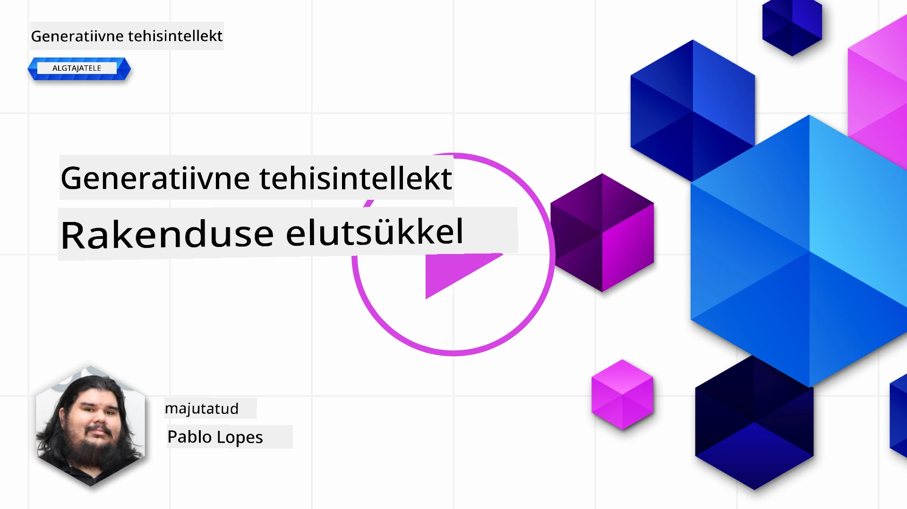
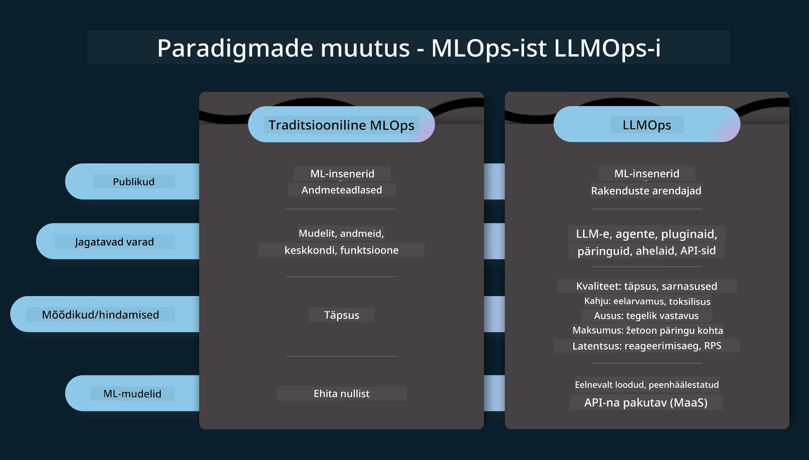
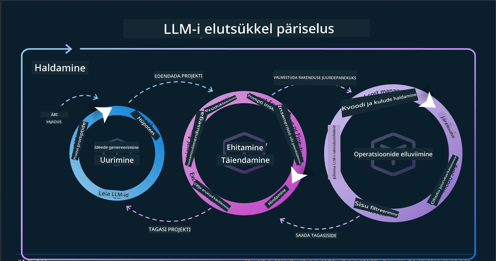
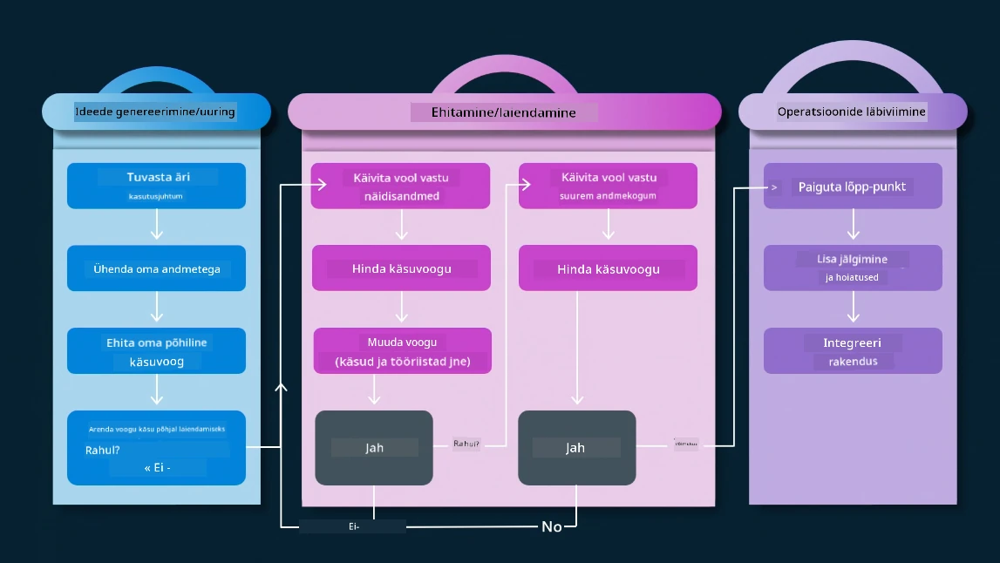
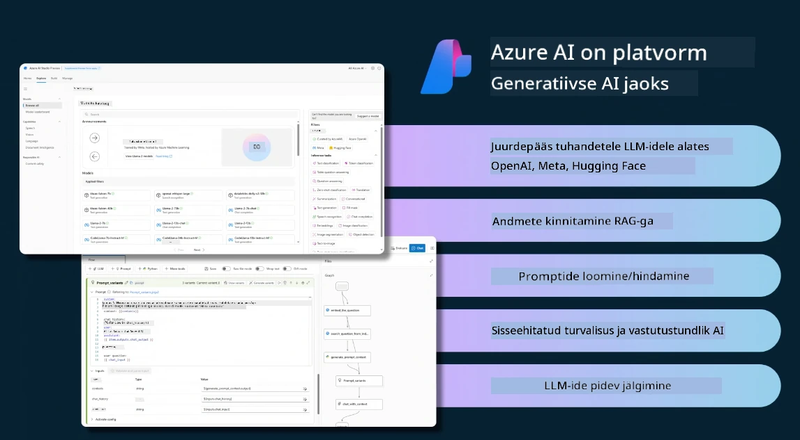
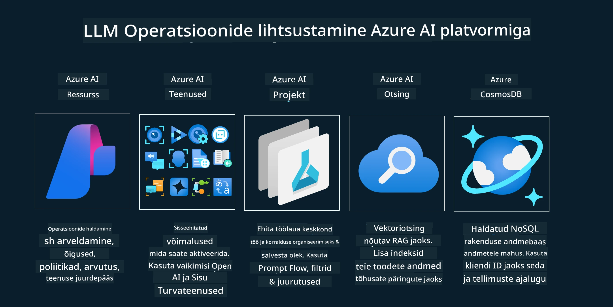
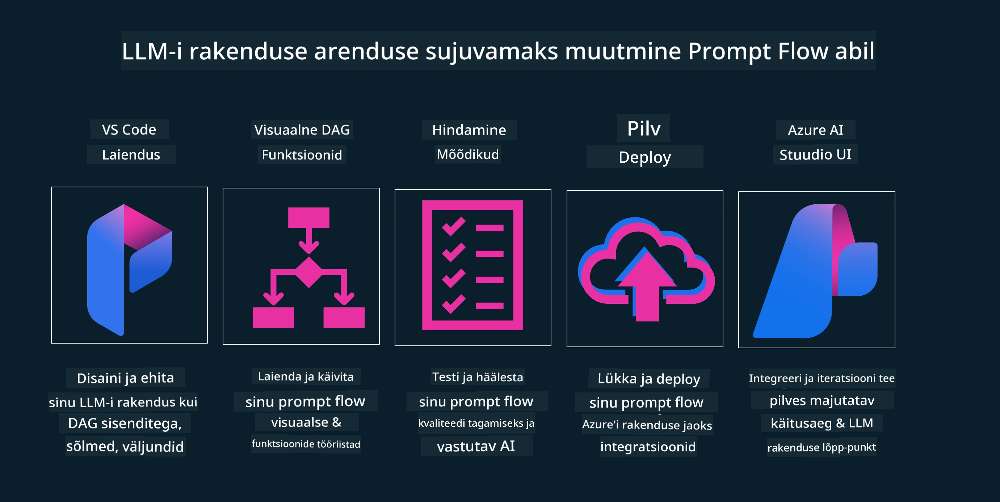

# Generatiivse tehisintellekti rakenduse elutsükkel

Kõigi tehisintellekti rakenduste jaoks on oluline küsimus AI omaduste asjakohasus, kuna AI on kiiresti arenev valdkond. Selleks, et teie rakendus jääks asjakohaseks, usaldusväärseks ja vastupidavaks, peate seda pidevalt jälgima, hindama ja täiustama. Siin tuleb mängu generatiivse AI elutsükkel.

Generatiivse AI elutsükkel on raamistik, mis juhendab teid generatiivse AI rakenduse arendamise, juurutamise ja hooldamise etappides. See aitab teil määratleda oma eesmärgid, mõõta sooritust, tuvastada väljakutsed ja rakendada lahendusi. Samuti aitab see joondada teie rakenduse teie valdkonna ja sidusrühmade eetiliste ja seaduslike standarditega. Järgides generatiivse AI elutsüklit, saate tagada, et teie rakendus pakub alati väärtust ja rahuldab teie kasutajaid.

## Sissejuhatus

Selles peatükis:

- Mõistate üleminekut MLOps-ist LLMOps-ile
- LLM elutsükkel
- Elutsükli tööriistad
- Elutsükli mõõtmine ja hindamine

## Mõistke paradigma muutust MLOps-ist LLMOps-ile

LLM-id on uus tööriist tehisintellekti arsenalist, neid kasutatakse äärmiselt võimsalt rakenduste analüüsi ja genereerimise ülesannetes, kuid see võimsus toob kaasa teatud tagajärjed AI ja tavapäraste masinõppe ülesannete sujuvamaks muutmisel.

Sellega seoses on vaja uut paradigma, et seda tööriista dünaamiliselt ja õige stiimulitega kohandada. Võime vanemaid AI rakendusi kategoriseerida kui "ML-rakendusi" ja uuemaid kui "GenAI-rakendusi" või lihtsalt "AI-rakendusi", mis kajastab valitsevat tehnoloogiat ja kasutatud meetodeid tol ajal. See muudab meie narratiivi mitmel moel, vaadake järgmist võrdlust.

Pange tähele, et LLMOps-is keskendume rohkem rakenduste arendajatele, kasutades integreerimisi võtmeelemendina, kasutades "mudelite teenusena" ning mõeldes järgmistele mõõdikutele.

- Kvaliteet: vastuse kvaliteet
- Kahju: vastutustundlik AI
- Ausus: vastuse põhjendatus (Kas see mõistlik? Kas see on õige?)
- Kulu: lahenduse eelarve
- Latentsus: keskmine aeg tokeni vastamiseks

## LLM elutsükkel

Kõigepealt elutsükli ja muudatuste mõistmiseks vaatame järgmist infograafikut.

Nagu võite märgata, erineb see tavapärasest MLOpsi elutsüklist. LLM-idel on palju uusi nõudeid, nagu suuniste koostamine, erinevad meetodid kvaliteedi parandamiseks (peenhäälestus, RAG, meta-käsud), erinev hindamine ja vastutus vastutustundliku AI-ga ning lõpuks uued hindamismõõdikud (kvaliteet, kahju, ausus, kulu ja latentsus).

Näiteks vaadake, kuidas me ideid genereerime. Kasutades prompt-engineeringut, eksperimenteerime erinevate LLM-idega, et uurida võimalusi ja testida, kas nende hüpotees võiks olla õige.

Pidage meeles, et see ei ole lineaarne, vaid integreeritud silmused, korduvad ja üleüldine tsükkel.

Kuidas võiksime neid samme uurida? Sukeldugem üksikasjadesse, kuidas elutsüklit üles ehitada.

See võib tunduda veidi keeruline, keskendume esmalt kolmele suurele sammule.

1. Ideede genereerimine/uurimine: Uurimine, siin saame uurida vastavalt ärivajadustele. Prototüüpimine, luues [PromptFlow](https://microsoft.github.io/promptflow/index.html?WT.mc_id=academic-105485-koreyst) ja testides, kas see on meie hüpoteesi jaoks piisavalt efektiivne.
1. Loomine/Täiendamine: Rakendamine, nüüd hakkame hindama suuremate andmekogumite jaoks ja rakendame tehnikaid nagu peenhäälestus ja RAG, et kontrollida lahenduse vastupidavust. Kui see ei tööta, võib abi olla ümbertegemisest, uute sammude lisamisest voogu või andmete ümberstruktureerimisest. Pärast voolu ja skaalatesti, kui see töötab ja mõõdikud on head, on see järgmisesse etappi valmis.
1. Juhtimine: Integreerimine, nüüd lisame süsteemile jälgimise ja häiresüsteemid, juurutamise ja rakenduse integreerimise.

Seejärel on üleval juhtimistsükkel, mis keskendub turvalisusele, vastavusele ja haldusele.

Palju õnne, nüüd on teie AI rakendus valmis ja tööks valmis. Praktikakogemuse saamiseks vaadake [Contoso Chat Demo](https://nitya.github.io/contoso-chat/?WT.mc_id=academic-105485-koreyst).

Nüüd, milliseid tööriistu võiksime kasutada?

## Elutsükli tööriistad

Tööriistade jaoks pakub Microsoft [Azure AI platvormi](https://azure.microsoft.com/solutions/ai/?WT.mc_id=academic-105485-koreyst) ja [PromptFlow](https://microsoft.github.io/promptflow/index.html?WT.mc_id=academic-105485-koreyst), mis hõlbustavad ja muudavad teie tsükli rakendamise lihtsaks ja valmis kasutamiseks.

[Azure AI platvorm](https://azure.microsoft.com/solutions/ai/?WT.mc_id=academic-105485-koreyst) võimaldab teil kasutada [AI Stuudiot](https://ai.azure.com/?WT.mc_id=academic-105485-koreyst). AI Studio on veebipõhine portaal, mis võimaldab teil uurida mudeleid, näiteid ja tööriistu, hallata oma ressursse, kujundada arendusvooge ning kasutada SDK/CLI valikuid kodeerimise esmasel tasemel.

Azure AI võimaldab kasutada mitmeid ressursse, et hallata oma operatsioone, teenuseid, projekte, vektorotsingut ja andmebaaside vajadusi.

Koostage kontseptsioonist (POC) kuni suuremahuliste rakendusteni PromptFlow abil:

- Kujundage ja ehitage rakendusi VS Code's visuaalsete ja funktsionaalsete tööriistadega
- Testige ja peenhäälestage oma rakendusi kvaliteetse AI jaoks lihtsalt
- Kasutage Azure AI Studiot pilvega integreerimiseks ja iteratsioonideks, kiireks juurutamiseks ja edastamiseks

## Väga hea! Jätkake õppimist!

Väga hea, nüüd õppige rohkem, kuidas me ehitame rakendust kontseptsioonide rakendamiseks koos [Contoso Chat Appiga](https://nitya.github.io/contoso-chat/?WT.mc_id=academic-105485-koreyst), et näha, kuidas pilvekaitse lisab neid kontseptsioone demonstratsioonidesse. Rohkem sisu leiate meie [Ignite sessioonist!](https://www.youtube.com/watch?v=DdOylyrTOWg)

Nüüd vaadake 15. peatükk, et mõista, kuidas [Retrieval Augmented Generation ja Vektoriandmebaasid](../15-rag-and-vector-databases/README.md?WT.mc_id=academic-105485-koreyst) mõjutavad generatiivset AI-d ja võimaldavad luua kaasahaaravamaid rakendusi!

---

<!-- CO-OP TRANSLATOR DISCLAIMER START -->
**Eraldis**:
See dokument on tõlgitud kasutades AI tõlketeenust [Co-op Translator](https://github.com/Azure/co-op-translator). Kuigi püüame täpsust tagada, palun arvestage, et automaatsed tõlked võivad sisaldada vigu või ebatäpsusi. Originaaldokument selle emakeeles tuleks pidada autoriteetseks allikaks. Kriitilise teabe puhul soovitatakse professionaalset inimtõlget. Me ei vastuta selle tõlkega kaasnevate arusaamatuste ega väärtõlgenduste eest.
<!-- CO-OP TRANSLATOR DISCLAIMER END -->