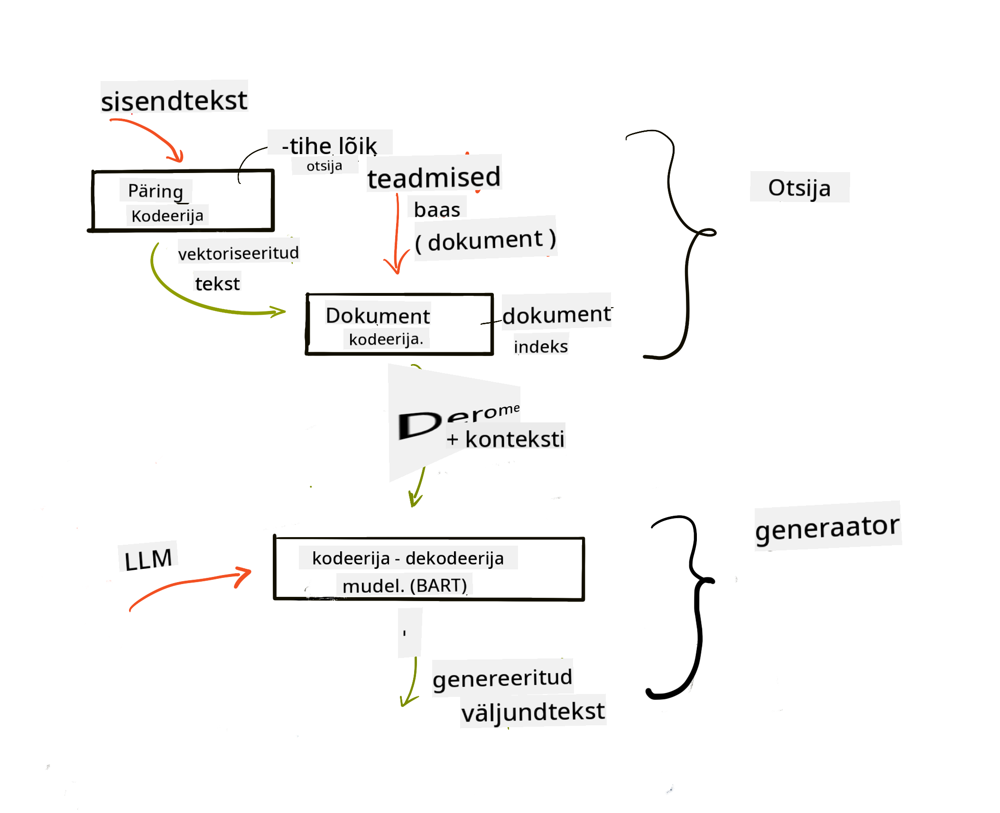

<!--
CO_OP_TRANSLATOR_METADATA:
{
  "original_hash": "b4b0266fbadbba7ded891b6485adc66d",
  "translation_date": "2025-10-18T02:52:08+00:00",
  "source_file": "15-rag-and-vector-databases/README.md",
  "language_code": "et"
}
-->
# Andmete täiendatud genereerimine (RAG) ja vektoriandmebaasid

[](https://youtu.be/4l8zhHUBeyI?si=BmvDmL1fnHtgQYkL)

Otsingurakenduste õppetunnis õppisime lühidalt, kuidas integreerida oma andmeid suurtesse keelemudelitesse (LLM). Selles õppetunnis süveneme rohkem andmete sidumise kontseptsioonidesse LLM-i rakenduses, protsessi mehhanismidesse ja andmete salvestamise meetoditesse, sealhulgas nii sisukirjeldustesse kui ka tekstidesse.

> **Video tulekul peagi**

## Sissejuhatus

Selles õppetunnis käsitleme järgmist:

- Sissejuhatus RAG-i, mis see on ja miks seda tehisintellektis kasutatakse.

- Arusaamine, mis on vektoriandmebaasid, ja ühe loomine meie rakenduse jaoks.

- Praktiline näide, kuidas integreerida RAG rakendusse.

## Õpieesmärgid

Pärast selle õppetunni läbimist suudad:

- Selgitada RAG-i olulisust andmete otsimisel ja töötlemisel.

- Seadistada RAG-i rakendust ja siduda oma andmed LLM-iga.

- Tõhusalt integreerida RAG-i ja vektoriandmebaase LLM-i rakendustesse.

## Meie stsenaarium: LLM-i täiustamine oma andmetega

Selles õppetunnis soovime lisada oma märkmed hariduse idufirmasse, mis võimaldab vestlusrobotil saada rohkem teavet erinevate teemade kohta. Kasutades meie märkmeid, saavad õppijad paremini õppida ja erinevaid teemasid mõista, mis muudab eksamiteks valmistumise lihtsamaks. Stsenaariumi loomiseks kasutame:

- `Azure OpenAI:` LLM-i, mida kasutame vestlusroboti loomiseks

- `AI algajatele mõeldud õppetund närvivõrkudest:` see on andmestik, millele me oma LLM-i põhistame

- `Azure AI Search` ja `Azure Cosmos DB:` vektoriandmebaas, kuhu salvestame oma andmed ja loome otsinguindeksi

Kasutajad saavad oma märkmetest luua harjutusteste, kordamiskaarte ja kokkuvõtteid. Alustamiseks vaatame, mis on RAG ja kuidas see töötab:

## Andmete täiendatud genereerimine (RAG)

LLM-i poolt juhitud vestlusrobot töötleb kasutaja sisendeid, et genereerida vastuseid. See on loodud interaktiivseks ja suhtleb kasutajatega mitmesugustel teemadel. Kuid selle vastused on piiratud antud konteksti ja algse treeningandmestikuga. Näiteks GPT-4 teadmiste piirang on september 2021, mis tähendab, et tal puuduvad teadmised pärast seda perioodi toimunud sündmustest. Lisaks ei sisalda LLM-i treeningandmestik konfidentsiaalset teavet, nagu isiklikud märkmed või ettevõtte tootekäsiraamat.

### Kuidas RAG (Andmete täiendatud genereerimine) töötab


Oletame, et soovite juurutada vestlusrobotit, mis loob teie märkmetest teste, siis vajate ühendust teadmistebaasiga. Siin tuleb appi RAG. RAG töötab järgmiselt:

- **Teadmistebaas:** Enne otsingut tuleb dokumendid sisestada ja eeltöödelda, tavaliselt jagades suured dokumendid väiksemateks osadeks, muutes need tekstisisukirjeldusteks ja salvestades andmebaasi.

- **Kasutaja päring:** Kasutaja esitab küsimuse.

- **Otsing:** Kui kasutaja esitab küsimuse, otsib sisukirjelduste mudel meie teadmistebaasist asjakohast teavet, et pakkuda rohkem konteksti, mis lisatakse sisendile.

- **Täiendatud genereerimine:** LLM täiustab oma vastust leitud andmete põhjal. See võimaldab genereeritud vastusel põhineda mitte ainult eelnevalt treenitud andmetel, vaid ka lisatud konteksti asjakohasel teabel. Leitud andmeid kasutatakse LLM-i vastuste täiendamiseks. Seejärel tagastab LLM vastuse kasutaja küsimusele.



RAG-i arhitektuur on rakendatud transformeerijate abil, mis koosnevad kahest osast: kodeerija ja dekodeerija. Näiteks kui kasutaja esitab küsimuse, kodeeritakse sisendtekst vektoriteks, mis hõlmavad sõnade tähendust, ja vektorid dekodeeritakse meie dokumendi indeksisse, et genereerida kasutaja päringu põhjal uus tekst. LLM kasutab nii kodeerija-dekodeerija mudelit, et genereerida väljund.

Kaks lähenemisviisi RAG-i rakendamisel vastavalt ettepanekule: [Andmete täiendatud genereerimine teadmiste intensiivsete NLP (loomuliku keele töötlemise tarkvara) ülesannete jaoks](https://arxiv.org/pdf/2005.11401.pdf?WT.mc_id=academic-105485-koreyst) on:

- **_RAG-Sequence_** kasutab leitud dokumente, et ennustada parimat võimalikku vastust kasutaja päringule.

- **RAG-Token** kasutab dokumente järgmise märgi genereerimiseks ja seejärel otsib neid, et vastata kasutaja päringule.

### Miks kasutada RAG-i?

- **Teabe rikkus:** tagab, et tekstivastused on ajakohased ja asjakohased. Seega parandab see domeenispetsiifiliste ülesannete täitmist, pääsedes juurde sisemisele teadmistebaasile.

- Vähendab väljamõeldisi, kasutades **kontrollitavat teavet** teadmistebaasis, et pakkuda konteksti kasutaja päringutele.

- See on **kulutõhus**, kuna need on ökonoomsemad võrreldes LLM-i peenhäälestamisega.

## Teadmistebaasi loomine

Meie rakendus põhineb meie isiklikel andmetel, st AI algajate õppekava närvivõrkude õppetunnil.

### Vektoriandmebaasid

Vektoriandmebaas, erinevalt traditsioonilistest andmebaasidest, on spetsialiseerunud andmebaas, mis on loodud sisukirjelduste salvestamiseks, haldamiseks ja otsimiseks. See salvestab dokumentide numbrilisi esitlusi. Andmete jagamine numbrilisteks sisukirjeldusteks muudab meie AI süsteemile andmete mõistmise ja töötlemise lihtsamaks.

Salvestame oma sisukirjeldused vektoriandmebaasidesse, kuna LLM-idel on piirang sisendina aktsepteeritavate märkide arvule. Kuna te ei saa kogu sisukirjeldust LLM-ile edastada, peame need jagama osadeks ja kui kasutaja esitab küsimuse, tagastatakse sisukirjeldused, mis on küsimusega kõige sarnasemad, koos sisendiga. Osadeks jagamine vähendab ka kulusid LLM-i kaudu edastatavate märkide arvu osas.

Mõned populaarsed vektoriandmebaasid on Azure Cosmos DB, Clarifyai, Pinecone, Chromadb, ScaNN, Qdrant ja DeepLake. Azure Cosmos DB mudeli saab luua Azure CLI abil järgmise käsuga:

```bash
az login
az group create -n <resource-group-name> -l <location>
az cosmosdb create -n <cosmos-db-name> -r <resource-group-name>
az cosmosdb list-keys -n <cosmos-db-name> -g <resource-group-name>
```

### Tekstist sisukirjeldusteni

Enne andmete salvestamist peame need teisendama vektori sisukirjeldusteks, enne kui need andmebaasi salvestatakse. Kui töötate suurte dokumentide või pikkade tekstidega, saate need jagada osadeks vastavalt oodatavatele päringutele. Osadeks jagamine võib toimuda lause tasemel või lõigu tasemel. Kuna osadeks jagamine tuletab tähendusi ümbritsevatest sõnadest, saate osale lisada mõne muu konteksti, näiteks dokumendi pealkirja või lisada osa ette või taha teksti. Andmeid saab osadeks jagada järgmiselt:

```python
def split_text(text, max_length, min_length):
    words = text.split()
    chunks = []
    current_chunk = []

    for word in words:
        current_chunk.append(word)
        if len(' '.join(current_chunk)) < max_length and len(' '.join(current_chunk)) > min_length:
            chunks.append(' '.join(current_chunk))
            current_chunk = []

    # If the last chunk didn't reach the minimum length, add it anyway
    if current_chunk:
        chunks.append(' '.join(current_chunk))

    return chunks
```

Kui andmed on osadeks jagatud, saame seejärel teksti sisukirjeldada, kasutades erinevaid sisukirjelduste mudeleid. Mõned mudelid, mida saate kasutada, on: word2vec, ada-002 OpenAI poolt, Azure Computer Vision ja palju muud. Mudeli valik sõltub kasutatavatest keeltest, kodeeritava sisu tüübist (tekst/pildid/audio), sisendi suurusest ja sisukirjelduse väljundi pikkusest.

Näide sisukirjeldatud tekstist, kasutades OpenAI mudelit `text-embedding-ada-002`:


## Otsing ja vektorotsing

Kui kasutaja esitab küsimuse, teisendab otsija selle vektoriks, kasutades päringu kodeerijat, seejärel otsib meie dokumendi otsinguindeksist sisendiga seotud vektoreid. Kui see on tehtud, konverteerib see nii sisendvektori kui ka dokumendivektorid tekstiks ja edastab need LLM-ile.

### Otsing

Otsing toimub siis, kui süsteem püüab kiiresti leida indeksist dokumente, mis vastavad otsingukriteeriumidele. Otsija eesmärk on leida dokumendid, mida kasutatakse konteksti pakkumiseks ja LLM-i sidumiseks teie andmetega.

Andmebaasis otsingut saab teha mitmel viisil, näiteks:

- **Märksõnaotsing** - kasutatakse tekstotsinguteks.

- **Semantiline otsing** - kasutab sõnade semantilist tähendust.

- **Vektorotsing** - teisendab dokumendid tekstist vektori esitluseks, kasutades sisukirjelduste mudeleid. Otsing tehakse dokumentide päringuga, mille vektori esitlused on kasutaja küsimusele kõige lähemal.

- **Hübriid** - märksõna- ja vektorotsingu kombinatsioon.

Otsinguga kaasneb väljakutse, kui andmebaasis pole päringule sarnast vastust, siis tagastab süsteem parima saadaval oleva teabe. Siiski saate kasutada taktikaid, nagu määrata maksimaalne kaugus asjakohasuse jaoks või kasutada hübriidotsingut, mis kombineerib nii märksõna- kui ka vektorotsingut. Selles õppetunnis kasutame hübriidotsingut, mis ühendab nii vektori- kui ka märksõnaotsingu. Salvestame oma andmed andmeraamistikku, mille veerud sisaldavad osasid ja sisukirjeldusi.

### Vektori sarnasus

Otsija otsib teadmistebaasist sisukirjeldusi, mis on üksteisele lähedal, lähim naaber, kuna need on tekstid, mis on sarnased. Kui kasutaja esitab päringu, sisukirjeldatakse see esmalt ja seejärel sobitatakse sarnaste sisukirjeldustega. Üldine mõõt, mida kasutatakse erinevate vektorite sarnasuse leidmiseks, on kosinuse sarnasus, mis põhineb kahe vektori vahelisel nurgal.

Sarnasuse mõõtmiseks võib kasutada ka alternatiive, nagu Eukleidese kaugus, mis on sirgjoon vektori otspunktide vahel, ja punktkorrutis, mis mõõdab kahe vektori vastavate elementide korrutiste summat.

### Otsinguindeks

Otsingu tegemisel peame looma oma teadmistebaasi jaoks otsinguindeksi, enne kui otsingut teostame. Indeks salvestab meie sisukirjeldused ja suudab kiiresti leida kõige sarnasemaid osasid isegi suures andmebaasis. Indeksi saame luua lokaalselt, kasutades:

```python
from sklearn.neighbors import NearestNeighbors

embeddings = flattened_df['embeddings'].to_list()

# Create the search index
nbrs = NearestNeighbors(n_neighbors=5, algorithm='ball_tree').fit(embeddings)

# To query the index, you can use the kneighbors method
distances, indices = nbrs.kneighbors(embeddings)
```

### Tulemuste järjestamine

Kui olete andmebaasi päringu teinud, võib olla vajalik tulemuste sorteerimine kõige asjakohasemate järgi. Järjestamise LLM kasutab masinõpet, et parandada otsingutulemuste asjakohasust, järjestades need kõige asjakohasemate järgi. Kasutades Azure AI Search'i, tehakse järjestamine automaatselt semantilise järjestaja abil. Näide, kuidas järjestamine töötab lähimate naabrite abil:

```python
# Find the most similar documents
distances, indices = nbrs.kneighbors([query_vector])

index = []
# Print the most similar documents
for i in range(3):
    index = indices[0][i]
    for index in indices[0]:
        print(flattened_df['chunks'].iloc[index])
        print(flattened_df['path'].iloc[index])
        print(flattened_df['distances'].iloc[index])
    else:
        print(f"Index {index} not found in DataFrame")
```

## Kõik kokku viimine

Viimane samm on LLM-i lisamine, et saada vastuseid, mis põhinevad meie andmetel. Seda saab rakendada järgmiselt:

```python
user_input = "what is a perceptron?"

def chatbot(user_input):
    # Convert the question to a query vector
    query_vector = create_embeddings(user_input)

    # Find the most similar documents
    distances, indices = nbrs.kneighbors([query_vector])

    # add documents to query  to provide context
    history = []
    for index in indices[0]:
        history.append(flattened_df['chunks'].iloc[index])

    # combine the history and the user input
    history.append(user_input)

    # create a message object
    messages=[
        {"role": "system", "content": "You are an AI assistant that helps with AI questions."},
        {"role": "user", "content": history[-1]}
    ]

    # use chat completion to generate a response
    response = openai.chat.completions.create(
        model="gpt-4",
        temperature=0.7,
        max_tokens=800,
        messages=messages
    )

    return response.choices[0].message

chatbot(user_input)
```

## Meie rakenduse hindamine

### Hindamiskriteeriumid

- Esitatud vastuste kvaliteet, tagades, et need kõlavad loomulikult, sujuvalt ja inimlikult.

- Andmete sidusus: hinnates, kas vastus pärineb esitatud dokumentidest.

- Asjakohasus: hinnates, kas vastus vastab ja on seotud esitatud küsimusega.

- Sujuvus - kas vastus on grammatiliselt arusaadav.

## RAG-i (Andmete täiendatud genereerimine) ja vektoriandmebaaside kasutusvõimalused

Funktsioonikõned võivad teie rakendust mitmel viisil täiustada, näiteks:

- Küsimuste ja vastuste süsteemid: oma ettevõtte andmete sidumine vestlusega, mida töötajad saavad kasutada küsimuste esitamiseks.

- Soovitussüsteemid: süsteemi loomine, mis sobitab kõige sarnasemad väärtused, näiteks filmid, restoranid ja palju muud.

- Vestlusrobotite teenused: saate salvestada vestluste ajalugu ja isikupärastada vestlust kasutaja andmete põhjal.

- Pildiotsing vektori sisukirjelduste põhjal, kasulik pildituvastuses ja anomaaliate tuvastamises.

## Kokkuvõte

Oleme käsitlenud RAG-i põhivaldkondi, alates andmete lisamisest rakendusse kuni kasutaja päringu ja väljundini. RAG-i loomise lihtsustamiseks saate kasutada selliseid raamistikke nagu Semantic Kernel, Langchain või Autogen.

## Ülesanne

Jätkake oma õppimist andmete täiendatud genereerimise (RAG) teemal, luues:

- Looge rakenduse esikülg, kasutades endale sobivat raamistikku.

- Kasutage raamistikku, kas LangChain või Semantic Kernel, ja looge oma rakendus uuesti.

Palju õnne õppetunni lõpetamise puhul 👏.

## Õppimine ei lõpe siin, jätkake teekonda

Pärast selle õppetunni lõpetamist vaadake meie [Generatiivse tehisintellekti õppekollektsiooni](https://aka.ms/genai-collection?WT.mc_id=academic-105485-koreyst), et jätkata oma generatiivse tehisintellekti teadmiste arendamist!

---

**Lahtiütlus**:  
See dokument on tõlgitud AI tõlketeenuse [Co-op Translator](https://github.com/Azure/co-op-translator) abil. Kuigi püüame tagada täpsust, palume arvestada, et automaatsed tõlked võivad sisaldada vigu või ebatäpsusi. Algne dokument selle algkeeles tuleks pidada autoriteetseks allikaks. Olulise teabe puhul soovitame kasutada professionaalset inimtõlget. Me ei vastuta arusaamatuste või valesti tõlgenduste eest, mis võivad tekkida selle tõlke kasutamise tõttu.