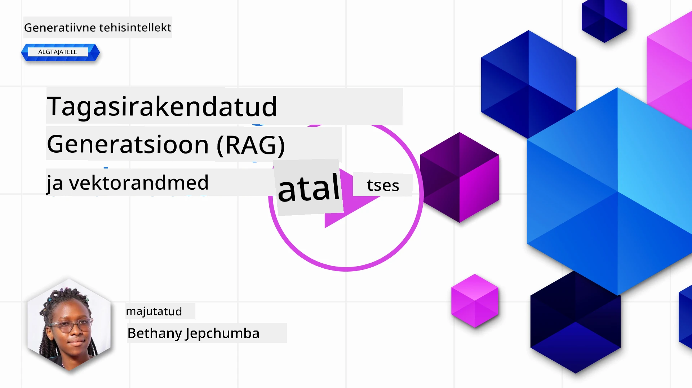
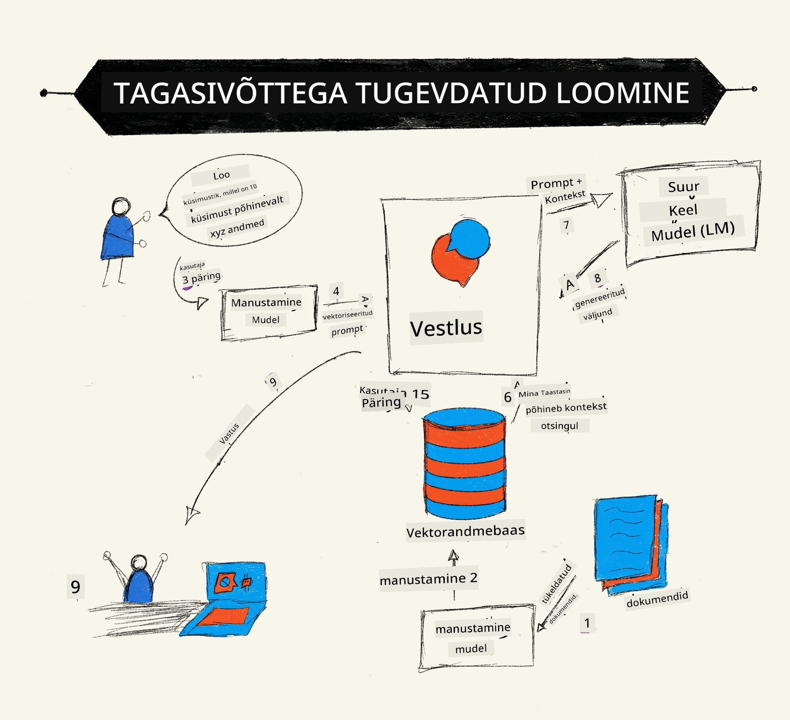
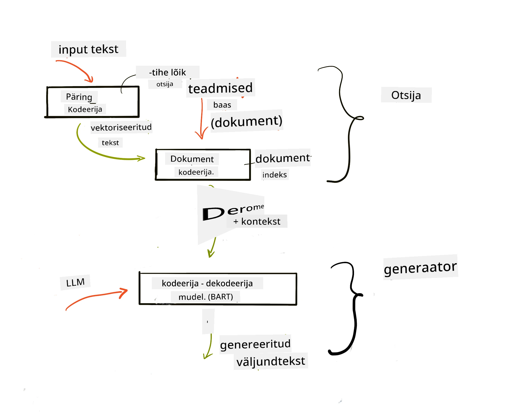

# Taastepõhine täiustatud genereerimine (RAG) ja vektorandmebaasid

[](https://youtu.be/4l8zhHUBeyI?si=BmvDmL1fnHtgQYkL)

Otsingurakenduste õppetunnis õppisime lühidalt, kuidas integreerida oma andmeid suurtesse keelemudelitesse (LLM). Selles õppetunnis süveneme andmete sidumisse teie LLM-rakenduses, protsessi mehhaanikasse ja andmete salvestamise meetoditesse, sealhulgas nii manustesse kui tekstidesse.

> **Video tuleb peagi**

## Sissejuhatus

Selles õppetunnis käsitleme järgmist:

- Sissejuhatus RAG-i, mis see on ja miks seda tehisintellektis kasutatakse.

- Mõistmine, mis on vektorandmebaasid ja nende loomine meie rakenduse jaoks.

- Praktiline näide, kuidas RAG-i rakendusse integreerida.

## Õpieesmärgid

Pärast selle õppetunni läbimist oskad:

- Selgitada RAG-i tähtsust andmete päringus ja töötlemises.

- Seadistada RAG-rakendus ja siduda oma andmed LLM-iga.

- Tõhusalt integreerida RAG ja vektorandmebaasid LLM-rakendustesse.

## Meie stsenaarium: täiustame meie LLM-e oma andmetega

Selle õppetunni jaoks tahame lisada oma märkmed haridusstartupisse, mis võimaldab chatbotil saada rohkem teavet erinevate õppeainete kohta. Kasutades olemasolevaid märkmeid, saavad õppijad paremini õppida ja mõista erinevaid teemasid, mis teeb eksamiteks kordamise lihtsamaks. Stsenaariumi loomiseks kasutame:

- `Azure OpenAI:` LLM, mida kasutame oma chatbot'i loomiseks

- `AI algajatele õppetund närvivõrkudest:` see saab olema andmed, millele oma LLM-i põhistame

- `Azure AI Search` ja `Azure Cosmos DB:` vektorandmebaasid meie andmete salvestamiseks ja otsinguindeksi loomiseks

Kasutajad saavad oma märkmetest luua harjutusülesandeid, kordamiskaarte ja kokkuvõtteid. Alustame RAG-i mõistmisest ja toimimisest:

## Taastepõhine täiustatud genereerimine (RAG)

LLM-toega chatbot töötleb kasutajate sisendeid, et genereerida vastuseid. See on loodud interaktiivseks ning suudab suhelda inimestega paljudel erinevatel teemadel. Selle vastused sõltuvad aga ainult kontekstist ja põhikoolitusandmetest. Näiteks GPT-4 teadmiste lõppkuupäev on september 2021, mis tähendab, et tal puudub info selle ajaperioodi järgselt toimunud sündmuste kohta. Lisaks on LLM-ide treeningandmetest välja jäetud konfidentsiaalsed andmed nagu isiklikud märkmed või ettevõtte tootemanuaal.

### Kuidas RAG-id (taastepõhine täiustatud genereerimine) töötavad



Oletame, et soovid juurutada chatbot’i, mis loob sinu märkmetest viktoriine, vajalik on ühendus teadmistebaasiga. Siin tuleb mängu RAG. RAG-id töötavad järgmiselt:

- **Teadmistebaas:** Enne päringut tuleb dokumendid importida ja eeltöödelda, tavaliselt lõhestades suured dokumendid väiksemateks osadeks, teisendades need tekstiliseks manuseks ja salvestades andmebaasi.

- **Kasutaja päring:** kasutaja esitab küsimuse

- **Päring:** Kui kasutaja esitab küsimuse, otsib manustamismudel meie teadmistebaasist asjakohast teavet, mida lisatakse vestluse konteksti.

- **Täiustatud genereerimine:** LLM täiendab oma vastust päringust saadud olulise teabe põhjal. See võimaldab genereeritud vastusel põhineda mitte ainult eelneval koolitusandmestikul, vaid ka lisatud konteksti asjakohasel informatsioonil. RAG abil tuuakse vastustesse juurde teadmisbaasi infot, mille alusel LLM kasutajale lõpuks vastab.



RAG arhitektuur on üles ehitatud transformeritele, millel on kaks osa: kodeerija ja dekodeerija. Näiteks kui kasutaja esitab küsimuse, kodeeritakse sisendtekst vektoriteks, mis haaravad sõnade tähenduse ning vektorid dekodeeritakse meie dokumentide indeksisse ja genereeritakse uus tekst kasutajapäringu põhjal. LLM kasutab nii kodeerija kui dekodeerija mudelit väljundi loomiseks.

RAG-i rakendamisel on teadusartikli [Retrieval-Augmented Generation for Knowledge intensive NLP Tasks](https://arxiv.org/pdf/2005.11401.pdf?WT.mc_id=academic-105485-koreyst) kohaselt kaks lähenemist:

- **_RAG-Sequence_** kasutab päringus leitud dokumente, et ennustada parimat võimalikku vastust kasutaja küsimusele

- **RAG-Token** kasutab dokumente järgmise sõna (tokeni) genereerimiseks ning seejärel otsib neid uuesti kasutaja päringu jaoks vastuse saamiseks

### Miks kasutada RAG-e?

- **Informatiivsus:** tagab, et tekstivastused on värsked ja ajakohased. Parandab seega spetsiifiliste valdkondade ülesannete täitmist, pöördudes sisemise teadmistebaasi poole.

- Vähendab väljamõtlemist, kasutades **kontrollitavat teavet** teadmistebaasis, et pakkuda kasutajate päringutele konteksti.

- On **kulutõhus**, sest on odavam kui LLM-i peenhäälestamine.

## Teadmistebaasi loomine

Meie rakendus põhineb meie isiklikel andmetel ehk AI algajatele närvivõrkude õppetunnil.

### Vektorandmebaasid

Vektorandmebaas erinevalt traditsioonilistest andmebaasidest on spetsiaalne andmebaas vektorite salvestamiseks, haldamiseks ja otsimiseks. See hoiab dokumentide arvulisi esitlusi. Andmete lagundamine numbrilisteks manusteks teeb meie AI süsteemil andmete mõistmise ja töötlemise lihtsamaks.

Salvestame oma manused vektorandmebaasides, sest LLM-idel on sisendi jaoks tokenite arv piiratud. Kuna me ei saa kogu manustust korraga LLM-ile anda, tuleb see jagada tükkideks ja kui kasutaja esitab päringu, tagastatakse selle küsimusele kõige sarnasemad manused koos promptiga. Jagamine vähendab ka kulusid tokenite arvu pealt.

Populaarsed vektorandmebaasid on Azure Cosmos DB, Clarifyai, Pinecone, Chromadb, ScaNN, Qdrant ja DeepLake. Azure Cosmos DB mudeli saab luua Azure CLI abil järgmise käsuga:

```bash
az login
az group create -n <resource-group-name> -l <location>
az cosmosdb create -n <cosmos-db-name> -r <resource-group-name>
az cosmosdb list-keys -n <cosmos-db-name> -g <resource-group-name>
```

### Tekstist manusteks

Enne andmete salvestamist peame need teisendama vektormanusteks. Kui töötad suurte dokumentide või pikkade tekstidega, saad need lõhkuda vastavalt päringutele, mida ootad. Jagamine võib toimuda lausetasandil või lõigutasandil. Kuna jagamine tuletab tähenduse sõnade ümber, võid lisada lõikudele ka täiendava konteksti, näiteks dokumendi pealkirja või teksti enne või pärast lõiku. Näiteks võid andmed nii jagada:

```python
def split_text(text, max_length, min_length):
    words = text.split()
    chunks = []
    current_chunk = []

    for word in words:
        current_chunk.append(word)
        if len(' '.join(current_chunk)) < max_length and len(' '.join(current_chunk)) > min_length:
            chunks.append(' '.join(current_chunk))
            current_chunk = []

    # Kui viimane tükk ei saavutanud minimaalset pikkust, lisa see siiski
    if current_chunk:
        chunks.append(' '.join(current_chunk))

    return chunks
```

Pärast lõikude moodustamist saame teksti kattes manustamismudelitega. Mõned mudelid, mida saad kasutada: word2vec, OpenAI ada-002, Azure Computer Vision ja paljud teised. Mudeli valik sõltub kasutatavatest keeltest, kodeeritava sisu tüübist (tekst/pildid/audio), sisendi mahust ja katte väljundi pikkusest.

Näide tekstimanusest OpenAI `text-embedding-ada-002` mudeli abil:


## Päringud ja vektorotsing

Kui kasutaja esitab küsimuse, teisendab otsija selle päringukodeerija abil vektoriks, otsib meie dokumentide otsinguindeksist sarnaseid vektoreid. Pärast seda teisendab nii sisendi kui dokumentide vektorid tekstiks ja edastab LLM-ile.

### Päring

Päring toimub siis, kui süsteem proovib kiiresti leida indeksi põhjal dokumente, mis vastavad otsingukriteeriumile. Otsija eesmärk on saada dokumente, mida kasutatakse konteksti pakkumiseks ja LLM-i andmetega sidumiseks.

Otsingut saab meie andmebaasis teha mitmel viisil:

- **Märksõnaotsing** – tekstipõhine otsing

- **Vektorotsing** – teisendab dokumendid tekstist vektoriesitlusteks, võimaldades **semantilist otsingut** sõnade tähenduse põhjal. Päring toimub dokumentide järgi, mille vektorid on kasutaja küsimusele lähimad.

- **Hübriid** – märksõna- ja vektorotsingu kombinatsioon.

Väljakutse on siis, kui andmebaasis pole päringule sarnast vastust. Sel juhul tagastab süsteem parima saadaoleva vastuse, kuid võid kasutada meetodeid nagu asjakohasuse maksimaalse kauguse seadistamine või hübriidotsing, mis ühendab mõlemad otsingutüübid. Selles tunnis kasutame hübriidotsingut, mis ühendab nii vektori- kui märksõnaotsingu. Salvestame andmed andmeraamatusse, mille veerud sisaldavad nii lõike kui manuseid.

### Vektorsarnasus

Otsija otsib teadmistebaasist manuseid, mis asuvad teineteisele lähedal, s.t lähimad naabrid, mis näitavad sarnaseid tekste. Kui kasutaja esitab päringu, manustatakse see esmalt ja leitakse sarnased manused. Levim kõnekeeles kasutatav mõõdupuu sarnasuse hindamiseks on kosiinussarnasus, mis põhineb kahe vektori vahelisel nurgal.

Sarnasust saab mõõta ka alternatiivide abil, nagu Eukleidese kaugus (otsejoon kahe vektori otspunktide vahel) ja punktitoodang (kahe vektori vastavate elementide korrutiste summa).

### Otsinguindeks

Päringu teostamiseks tuleb teadmistebaasile luua otsinguindeks. Indeks salvestab manused ja võimaldab isegi suures andmebaasis kiiresti leida kõige sarnasemaid lõike. Indeksi saab luua lokaalselt:

```python
from sklearn.neighbors import NearestNeighbors

embeddings = flattened_df['embeddings'].to_list()

# Loo otsinguisindeks
nbrs = NearestNeighbors(n_neighbors=5, algorithm='ball_tree').fit(embeddings)

# Indeksi päringuks võite kasutada meetodit kneighbors
distances, indices = nbrs.kneighbors(embeddings)
```

### Ümberjärjestamine

Pärast päringu tegemist võib olla vaja tulemusi sorteerida asjakohasuse järgi. Ümberjärjestav LLM kasutab masinõpet, et parandada otsingutulemuste asjakohasust, järjestades need asjakohasuse järgi. Azure AI Search kasutab seda protsessi automaatselt semantilise ümberjärjestajaga. Näide sellest, kuidas ümberjärjestamine töötab lähim naaber meetodi abil:

```python
# Leia kõige sarnasemad dokumendid
distances, indices = nbrs.kneighbors([query_vector])

index = []
# Trüki välja kõige sarnasemad dokumendid
for i in range(3):
    index = indices[0][i]
    for index in indices[0]:
        print(flattened_df['chunks'].iloc[index])
        print(flattened_df['path'].iloc[index])
        print(flattened_df['distances'].iloc[index])
    else:
        print(f"Index {index} not found in DataFrame")
```

## Kõik kokku

Viimane samm on lisada LLM, et saada vastuseid, mis põhinevad meie andmetel. Rakendame selle järgmiselt:

```python
user_input = "what is a perceptron?"

def chatbot(user_input):
    # Muuda küsimus päringuvektoriks
    query_vector = create_embeddings(user_input)

    # Leia kõige sarnasemad dokumendid
    distances, indices = nbrs.kneighbors([query_vector])

    # lisa dokumendid päringule konteksti pakkumiseks
    history = []
    for index in indices[0]:
        history.append(flattened_df['chunks'].iloc[index])

    # ühenda ajalugu ja kasutaja sisend
    history.append(user_input)

    # loo sõnumi objekt
    messages=[
        {"role": "system", "content": "You are an AI assistant that helps with AI questions."},
        {"role": "user", "content": "\n\n".join(history) }
    ]

    # kasuta vestluse lõpetamist vastuse genereerimiseks
    response = openai.chat.completions.create(
        model="gpt-4",
        temperature=0.7,
        max_tokens=800,
        messages=messages
    )

    return response.choices[0].message

chatbot(user_input)
```

## Rakenduse hindamine

### Hindamiskriteeriumid

- Vastuste kvaliteet: veenduda, et kõlaks loomulikult, sujuvalt ja inimlikult

- Andmete sidusus: hinnata, kas vastus pärineb esitatud dokumentidest

- Asjakohasus: kontrollida, kas vastus on seotud esitatud küsimusega

- Sujuvus – kas vastus on grammatiliselt mõistlik

## RAG (taastepõhine täiustatud genereerimine) ja vektorandmebaaside kasutusvõimalused

RAG funktsionaalsus võib parandada sinu rakendust mitmel moel:

- Küsimuste ja vastuste süsteemid: oma ettevõtte andmete sidumine chatbot-iga, mida töötajad saavad kasutada küsimuste esitamiseks.

- Soovitussüsteemid: süsteemi loomine, mis leiab kõige sarnasemad väärtused, nt filmid, restoranid jpm.

- Chatboti teenused: vestlusajaloo salvestamine ja vestluse isikupärastamine kasutajaandmete põhjal.

- Põhineb vektormanustel pildiotsing, kasulik pildituvastuses ja anomaaliate avastamisel.

## Kokkuvõte

Käsitlesime RAG-i põhitõdesid, kuidas lisada andmeid rakendusse, kasutaja päringut ja väljundit. RAG-i loomise lihtsustamiseks võid kasutada raamistikke nagu Semantic Kernel, Langchain või Autogen.

## Kodutöö

Jätkamaks oma teadmiste arendamist Retrieval Augmented Generation (RAG) valdkonnas, võid ehitada:

- Rakenduse kasutajaliidese raamistiku abil, mida ise valid

- Kasutada raamistikku, näiteks LangChain või Semantic Kernel, ning taasluua oma rakendus

Palju õnne õppetunni lõpetamise puhul 👏.

## Õppimine siin ei lõpe, jätka teekonda

Pärast selle õppetunni lõpetamist vaata meie [Generative AI õppimiskogu](https://aka.ms/genai-collection?WT.mc_id=academic-105485-koreyst), et jätkata generatiivse tehisintellekti teadmiste tõstmist!

---

<!-- CO-OP TRANSLATOR DISCLAIMER START -->
**Vastutusest loobumine**:
See dokument on tõlgitud AI tõlketeenuse [Co-op Translator](https://github.com/Azure/co-op-translator) abil. Kuigi püüame tõlke täpsust tagada, palun arvestage, et automaatsed tõlked võivad sisaldada vigu või ebatäpsusi. Originaaldokument selle emakeeles on ametlik ja autoriteetne allikas. Olulise info puhul soovitatakse kasutada professionaalse inimtõlke teenust. Me ei vastuta ühegi arusaamatuse või valesti tõlgendamise eest, mis võib sellest tõlkest tekkida.
<!-- CO-OP TRANSLATOR DISCLAIMER END -->