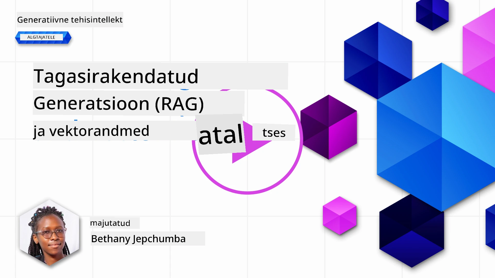
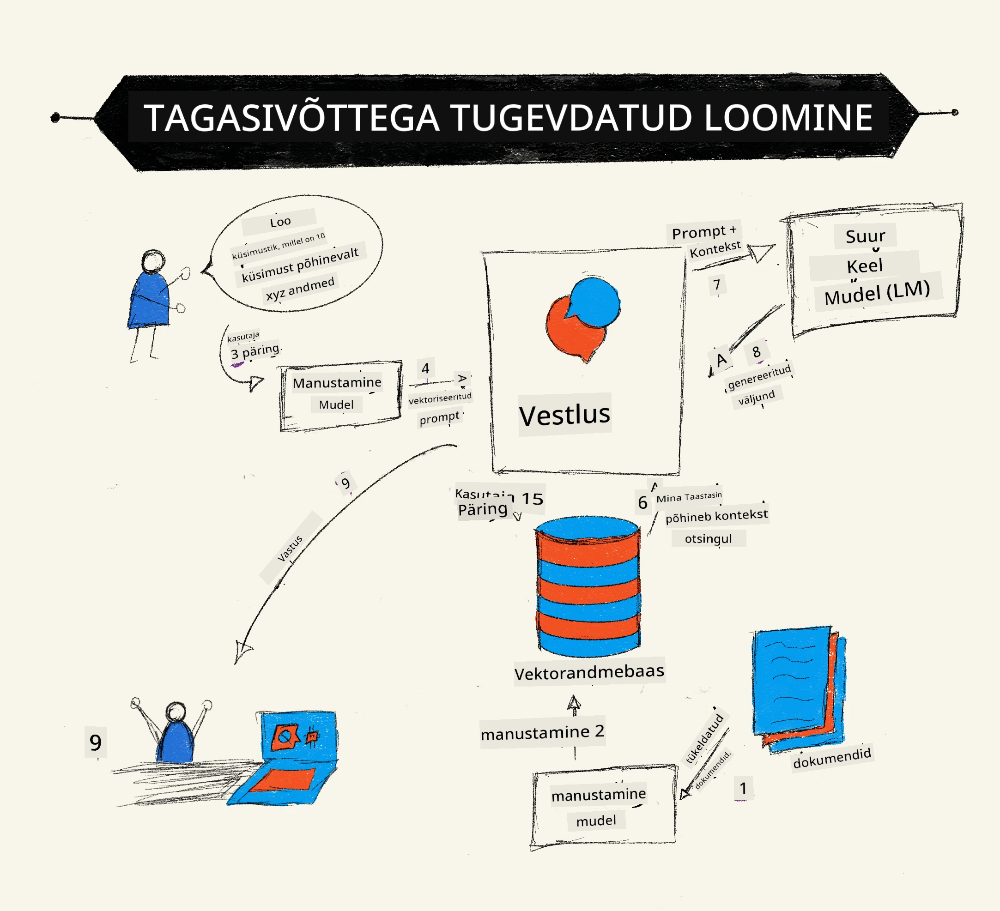
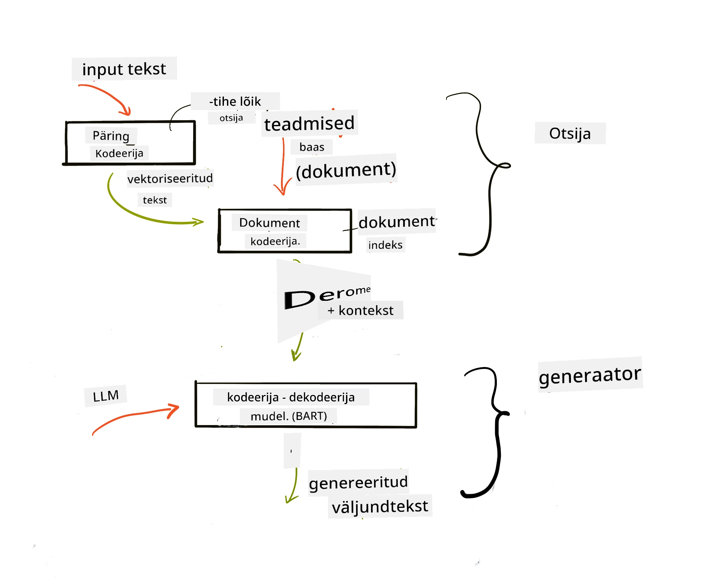

# Taastega täiustatud genereerimine (RAG) ja vektoriandmebaasid

[](https://youtu.be/4l8zhHUBeyI?si=BmvDmL1fnHtgQYkL)

Otsingurakenduste õppetükis õppisime lühidalt, kuidas oma andmeid suures keelemudelis (LLM) integreerida. Selles õppetükis süveneme täiendavalt andmete aluseks olemise kontseptsioonidesse LLM-i rakenduses, protsessi mehhanismidesse ja andmete salvestamise meetoditesse, sealhulgas nii manustesse kui ka teksti.

> **Video varsti saadaval**

## Sissejuhatus

Selles õppetükis käsitleme järgmist:

- Sissejuhatus RAGi mõistesse, mis see on ja miks seda tehisintellektis (AI) kasutatakse.

- Vektoriandmebaaside mõistmine ja ühe loomine meie rakenduse jaoks.

- Praktiline näide, kuidas RAGi rakendusse integreerida.

## Õpieesmärgid

Pärast selle õppetüki läbimist oskad:

- Selgitada RAG tähtsust andmete otsimisel ja töötlemisel.

- Seadistada RAG-rakendust ja siduda oma andmed LLM-iga.

- Tõhusalt integreerida RAG ja vektoriandmebaasid LLM-rakendustesse.

## Meie stsenaarium: oma andmetega LLMide täiustamine

Selle õppetüki jaoks tahame lisada haridusettevõtte jaoks oma märkmed, mis võimaldavad vestlusrobotil saada rohkem teavet erinevate teemade kohta. Märkmeid kasutades saavad õppijad paremini õppida ja mõista erinevaid teemasid, mis teeb eksamiteks kordamise lihtsamaks. Meie stsenaariumi loomiseks kasutame:

- `Azure OpenAI:` LLM, mida kasutame vestlusroboti loomiseks

- `AI algajatele õpetus Neuraalvõrkudest`: see on andmestik, millele meie LLM aluse paneme

- `Azure AI Search` ja `Azure Cosmos DB:` vektoriandmebaas andmete salvestamiseks ja otsingukataloogi loomiseks

Kasutajad saavad luua oma märkmetest harjutusquizze, kordamise flash-kaarte ning kokkuvõtteid lühidalt. Alustuseks vaatame, mis on RAG ja kuidas see töötab:

## Taastega täiustatud genereerimine (RAG)

LLM-i toel töötav vestlusrobot töötleb kasutaja juhiseid, et genereerida vastuseid. Ta on kujundatud olema interaktiivne ja suhelda kasutajatega paljudel teemadel. Kuid tema vastused piirduvad antud kontekstiga ja põhinevad treeningandmetel. Näiteks GPT-4 teadmiste katkestusaeg on september 2021, mis tähendab, et tal puudub teadmine sündmustest pärast seda perioodi. Lisaks ei sisalda treeningandmed konfidentsiaalset informatsiooni, nagu isiklikud märkmed või ettevõtte kasutusjuhendid.

### Kuidas RAGid (Taastega täiustatud genereerimine) töötavad



Oletame, et soovid luua vestlusroboti, mis teeb sinu märkmetest teste, vajab ta ühendust teadmistebaasiga. Siin tulebki appi RAG. RAGid töötavad järgmiselt:

- **Teadmistebaas:** Enne tagasitoomist tuleb dokumendid sisse lugeda ja eelprotsessida, tavaliselt lõigates pikad dokumendid väiksemateks tükkideks, muutes need tekstimanusteks ja salvestades andmebaasi.

- **Kasutaja päring:** kasutaja esitab küsimuse

- **Tagasitoomine:** Kui kasutaja küsib, toovad manustamismudelid meie teadmistebaasist välja asjakohase info, mis lisatakse kontekstina küsimusele.

- **Täiendatud genereerimine:** LLM täiendab oma vastust saadud andmete põhjal. See võimaldab vastusel põhineda mitte ainult eeltreenitud andmetel, vaid ka lisatud kontekstist pärineval asjakohasel infoallikal. Tagasitoodud andmeid kasutatakse LLM-i vastuste parandamiseks. LLM vastab seejärel kasutaja küsimusele.



RAG-i arhitektuur põhineb transformeerijatel, mis koosneb kahest osast: kodeerija ja dekodeerija. Näiteks kui kasutaja esitab küsimuse, kooderitakse sisendtekst vektoriteks, mis kajastavad sõnade tähendust, ja seejärel dekodeeritakse need meie dokumendiindeksis ning genereeritakse uut teksti kasutaja päringu põhjal. LLM kasutab väljundi genereerimiseks nii kodeerija kui dekodeerija mudelit.

Vastavalt artiklile [Retrieval-Augmented Generation for Knowledge intensive NLP (natural language processing software) Tasks](https://arxiv.org/pdf/2005.11401.pdf?WT.mc_id=academic-105485-koreyst) on RAG-i rakendamiseks kaks lähenemist:

- **_RAG-Sequence_** kasutab tagastatud dokumente, et ennustada parimat võimalikku vastust kasutaja päringule

- **RAG-Token** kasutab dokumente järgmise tokeni genereerimiseks, seejärel toob need uuesti, et vastata kasutaja päringule

### Miks kasutada RAGi? 

- **Info rikkus:** tagab, et tekstivastused on ajakohased ja värsked. See parandab domeenispetsiifiliste ülesannete sooritust, pääsedes ligi sisemisele teadmistebaasile.

- Vähendab väljamõtlemist, kasutades teadmistebaasis olevat **kontrollitavat andmestikku**, et pakkuda kasutajaküsimustele konteksti.

- See on **kuluefektiivne**, kuna on odavam kui LLM-i peenhäälestamine.

## Teadmistebaasi loomine

Meie rakendus põhineb isiklikel andmetel, st AI algajate kursuse neuraalvõrkude õppetükil.

### Vektoriandmebaasid

Vektoriandmebaas, erinevalt traditsioonilistest andmebaasidest, on spetsiaalne andmebaas, mis on loodud vektorite manuste salvestamiseks, haldamiseks ja otsimiseks. See salvestab dokumentide numbrilisi esitusi. Andmete teisendamine numbrilisteks manusteks teeb meie AI süsteemi jaoks lihtsamaks andmete mõistmise ja töötlemise.

Manused salvestatakse vektoriandmebaasidesse, sest LLM-i sõnade limiit sisendina on piiratud. Kuna kogu manuseid korraga ei saa LLM-i anda, tuleb need jagada tükkideks ning kui kasutaja küsib, tagastatakse küsimusele kõige sarnasemad mansid koos küsimusega. Jagamine aitab vähendada ka LLM-i läbitavate sõnade arvu ja sellest tulenevaid kulusid.

Mõned populaarsed vektoriandmebaasid on Azure Cosmos DB, Clarifyai, Pinecone, Chromadb, ScaNN, Qdrant ja DeepLake. Azure Cosmos DB mudeli loomiseks saate Azure CLI-s käivitada järgmise käsu:

```bash
az login
az group create -n <resource-group-name> -l <location>
az cosmosdb create -n <cosmos-db-name> -r <resource-group-name>
az cosmosdb list-keys -n <cosmos-db-name> -g <resource-group-name>
```

### Tekstist manusteni

Enne andmete salvestamist tuleb need teisendada vektormanusteks. Kui töötate pikkade dokumentidega, saate need jagada osadeks vastavalt eeldatavatele küsimustele. Jagamine võib toimuda lausetasandil või lõigutena. Kuna jagamine tugineb ümbritsevate sõnade tähendusele, võite lisada iga tükki juurde mõnda konteksti nagu dokumendi pealkiri või mõni tekst osa enne või pärast tükki. Andmed saab tükkideks jagada järgmiselt:

```python
def split_text(text, max_length, min_length):
    words = text.split()
    chunks = []
    current_chunk = []

    for word in words:
        current_chunk.append(word)
        if len(' '.join(current_chunk)) < max_length and len(' '.join(current_chunk)) > min_length:
            chunks.append(' '.join(current_chunk))
            current_chunk = []

    # Kui viimane tükk ei saavutanud miinimumpikkust, lisa see siiski
    if current_chunk:
        chunks.append(' '.join(current_chunk))

    return chunks
```

Kui tükkidena on andmed jagatud, saab teksti manustada erinevate mudelite abil nagu word2vec, OpenAI ada-002, Azure Computer Vision jpt. Mudeli valik sõltub kasutatavatest keeltest, kooditavast sisust (tekst/pildid/heli), sisendi suurusest ja väljundi pikkusest.

Näidis manustatud tekstist OpenAI `text-embedding-ada-002` mudeli abil:


## Taaste ja vektorotsing

Kui kasutaja esitab küsimuse, teisendab otsija selle päringu kodeerijaga vektoriks, seejärel otsib relevantseid vektoreid dokumendipõhisest otsingukataloogist, mis on seotud sisendiga. Seejärel teisendab ta nii sisendi kui dokumendi vektorid tekstiks ja edastab LLM-ile.

### Taaste

Taaste toimub siis, kui süsteem üritab kiiresti leida indeksist dokumente, mis vastavad otsingukriteeriumitele. Eesmärgiks on saada dokumendid, mida kasutatakse konteksti andmiseks ja LLM-i aluseks.

Andmebaasis otsimiseks on mitmeid viise, näiteks:

- **Märksõnaotsing** - tekstipäringute jaoks

- **Vektoriotsing** - teisendab tekstist dokumente vector-representatsioonideks manustamismudelite abil, võimaldades **semantilist otsingut** sõnade tähenduse alusel. Otsing toimib päringuga dokumentide vastu, mille vektorid on kasutaja küsimusele lähimad.

- **Hübriid** - kombinatsioon märksõna- ja vektoriotsingust.

Otsinguga kaasneb probleem, kui andmebaasis ei ole küsimusele sarnast vastust – süsteem tagastab siis parima olemasoleva info. Saate kasutada strateegiaid nagu maksimaalse kauguse seadmine relevantsuse jaoks või kasutada hübriidot otsingut. Selles õppetükis kasutame hübriidot, mis ühendab vektori- ja märksõnaotsingu. Andmed salvestame andmeraamatusse, mis sisaldab nii tükke kui manuseid.

### Vektorsarnasus

Otsija otsib teadmistebaasist manuseid, mis on üksteisele lähedased, ehk lähimad naabrid, kuna need on sarnased tekstid. Kasutaja päring manustatakse, seejärel leitakse sarnased manused. Üldkasutuses olev mõõde erinevate vektorite sarnasuse hindamiseks on kosinus-sarnasus, mis põhineb kahe vektori vahelisel nurgal.

Sarnasuse mõõtmiseks saab kasutada ka teisi meetodeid: Eukleidese kaugus, mis on sirgjoon kahe vektori lõpp-punktide vahel, ja skalaartehe, mis mõõdab kahe vektori vastavate elementide korrutiste summat.

### Otsingukataloog

Otsingu tegemiseks peame enne üles ehitama otsingukataloogi meie teadmistebaasile. Kataloog salvestab manuseid ning tagastab kiiresti sarnaseimad tükid ka suurtes andmebaasides. Kataloogi saab luua lokaalselt järgmiselt:

```python
from sklearn.neighbors import NearestNeighbors

embeddings = flattened_df['embeddings'].to_list()

# Loo otsinguindeks
nbrs = NearestNeighbors(n_neighbors=5, algorithm='ball_tree').fit(embeddings)

# Indeksi pärimiseks saad kasutada meetodit kneighbors
distances, indices = nbrs.kneighbors(embeddings)
```

### Ümberjärjestamine

Pärast päringu tegemist võib vaja minna tulemuste sorteerimist kõige asjakohasemast. Ümberjärjestav LLM kasutab masinõpet, et parandada otsingutulemuste relevantsust ja järjestada need asjakohasuse alusel. Azure AI Search kasutab seda teile automaatselt semantilise ümberjärjestaja abil. Näide ümberjärjestamisest lähimate naabrite abil:

```python
# Leia kõige sarnasemad dokumendid
distances, indices = nbrs.kneighbors([query_vector])

index = []
# Prindi välja kõige sarnasemad dokumendid
for i in range(3):
    index = indices[0][i]
    for index in indices[0]:
        print(flattened_df['chunks'].iloc[index])
        print(flattened_df['path'].iloc[index])
        print(flattened_df['distances'].iloc[index])
    else:
        print(f"Index {index} not found in DataFrame")
```

## Kõige ühendamine

Viimane samm on lisada meie LLM, et saada vastuseid, mis põhinevad meie andmetel. Saame selle rakendada järgmiselt:

```python
user_input = "what is a perceptron?"

def chatbot(user_input):
    # Muuda küsimus päringutektoriks
    query_vector = create_embeddings(user_input)

    # Leia kõige sarnasemad dokumendid
    distances, indices = nbrs.kneighbors([query_vector])

    # lisa dokumendid päringule konteksti pakkumiseks
    history = []
    for index in indices[0]:
        history.append(flattened_df['chunks'].iloc[index])

    # ühenda ajalugu ja kasutaja sisend
    history.append(user_input)

    # loo sõnumi objekt
    messages=[
        {"role": "system", "content": "You are an AI assistant that helps with AI questions."},
        {"role": "user", "content": "\n\n".join(history) }
    ]

    # kasuta Responses API-d vastuse genereerimiseks
    response = client.responses.create(
        model="gpt-4o-mini",
        temperature=0.7,
        max_output_tokens=800,
        input=messages,
        store=False,
    )

    return response.output_text

chatbot(user_input)
```

## Rakenduse hindamine

### Hindamismõõdikud

- Vastuste kvaliteet: tagab, et need kõlavad loomulikult, sujuvalt ja inimlikult

- Andmete aluseks olemine: hindab, kas vastus pärineb esitatud dokumentidest

- Asjakohasus: hindab, kas vastus sobib ja on seotud esitatud küsimusega

- Sujuvus: kas vastus on grammatiliselt mõistlik

## RAG-i ja vektoriandmebaaside kasutusvõimalused

On palju erinevaid kasutusjuhtumeid, kus funktsioonikõned saavad rakendust parandada, näiteks:

- Küsimuste ja vastuste süsteem: ettevõtte andmete ühendamine vestlusse, mida töötajad saavad kasutada küsimuste esitamiseks.

- Soovitussüsteemid: süsteem, mis leiab kõige sarnasemad väärtused näiteks filmide, restoranide jms kohta.

- Vestlusroboti teenused: vestluse ajaloo salvestamine ja vestluse personaalsust kasutajaandmete põhjal.

- Pildipõhine otsing vektorimustrite alusel, kasulik pildituvastuses ja anomaaliate tuvastamisel.

## Kokkuvõte

Oleme käsitlenud RAG põhitõdesid, alates andmete lisamisest rakendusse, kasutajapäringust kuni väljundini. RAGi loomise lihtsustamiseks võite kasutada raamistikke nagu Semantic Kernel, Langchain või Autogen.

## Kodune ülesanne

Jätkates oma õppimist Taastega täiustatud genereerimisest (RAG), võite luua:

- Rakenduse kasutajaliidese, valides teie eelistatud raamistik

- Kasutada raamistiku LangChain või Semantic Kernel ja taasluua oma rakendus.

Palju õnne õppetüki lõpetamise puhul 👏.

## Õppimine siin ei peatu, jätka teekonda

Pärast õppetüki lõpetamist vaata meie [Generatiivse AI õppekollektsiooni](https://aka.ms/genai-collection?WT.mc_id=academic-105485-koreyst), et jätkata oma generatiivse AI teadmiste taseme tõstmist!

---

<!-- CO-OP TRANSLATOR DISCLAIMER START -->
**Lahtiütlus**:
See dokument on tõlgitud kasutades AI tõlketeenust [Co-op Translator](https://github.com/Azure/co-op-translator). Kuigi me püüdleme täpsuse poole, palun pange tähele, et automatiseeritud tõlgetes võib esineda vigu või ebatäpsusi. Originaaldokument selle emakeeles tuleks pidada autoriteetseks allikaks. Olulise teabe puhul soovitatakse kasutada professionaalset inimtõlget. Me ei vastuta selle tõlkega seotud eksimustest või valesti mõistmistest.
<!-- CO-OP TRANSLATOR DISCLAIMER END -->