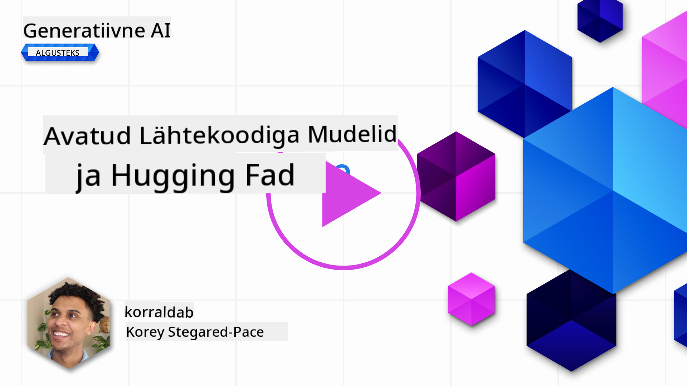
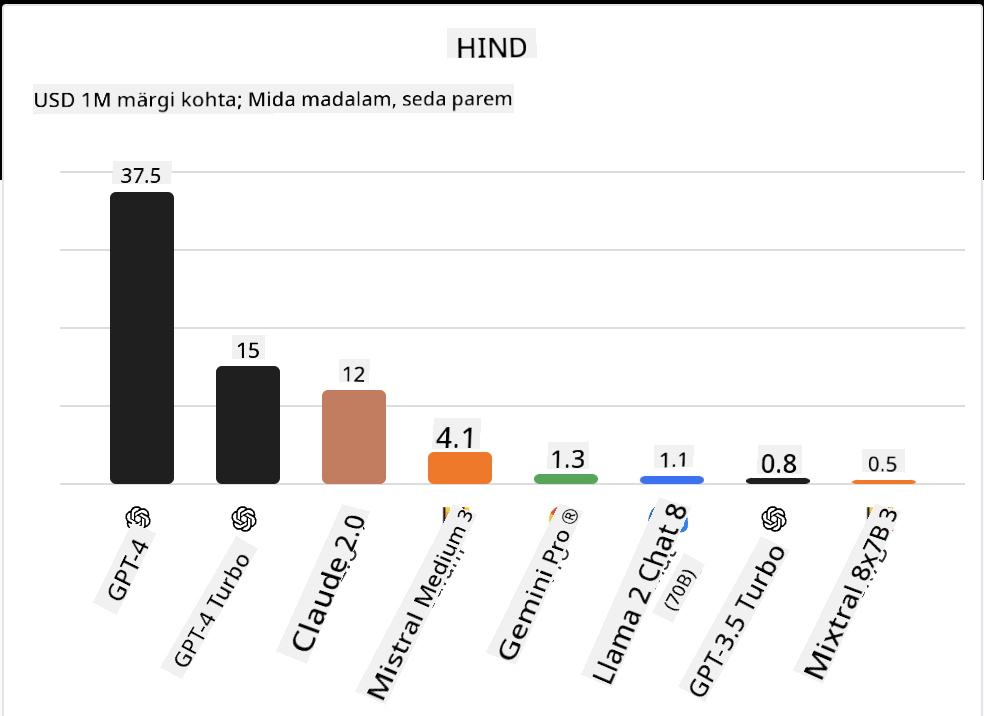
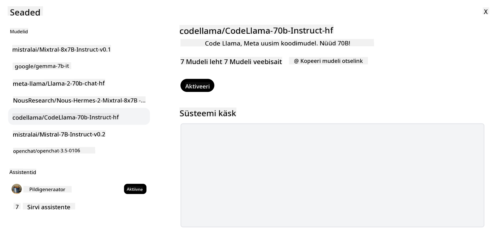
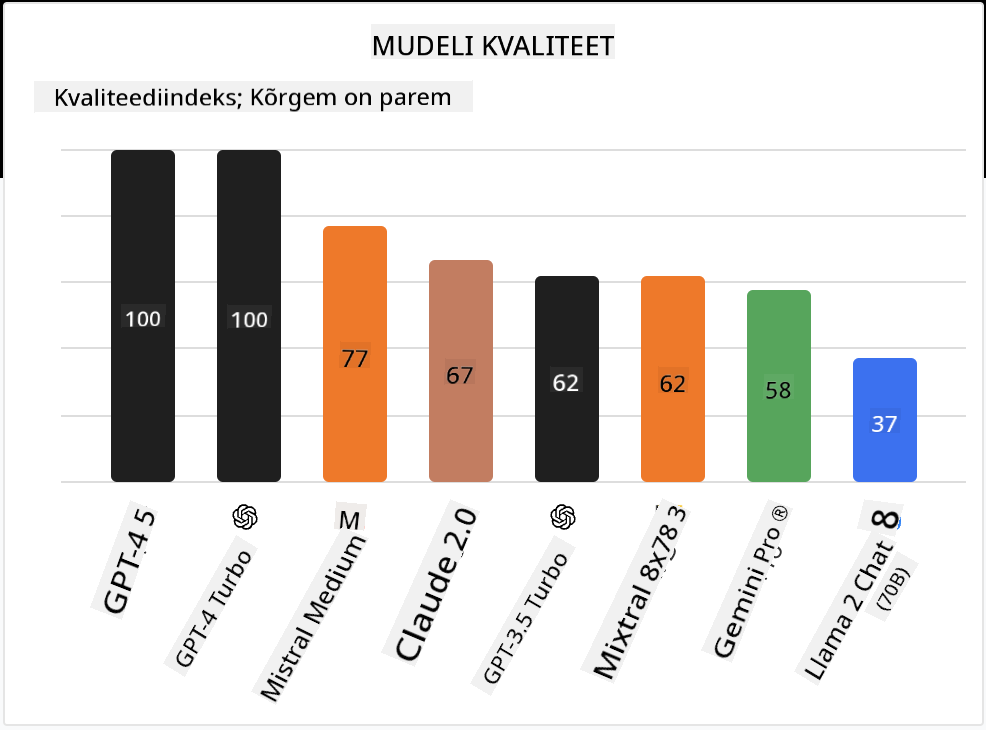

<!--
CO_OP_TRANSLATOR_METADATA:
{
  "original_hash": "a2a83aac52158c23161046cbd13faa2b",
  "translation_date": "2025-10-18T02:58:14+00:00",
  "source_file": "16-open-source-models/README.md",
  "language_code": "et"
}
-->

## Sissejuhatus

Avatud lähtekoodiga LLM-ide maailm on põnev ja pidevalt arenev. Selle õppetunni eesmärk on anda põhjalik ülevaade avatud lähtekoodiga mudelitest. Kui otsite teavet selle kohta, kuidas omandimudelid võrreldes avatud lähtekoodiga mudelitega erinevad, minge õppetundi ["Erinevate LLM-ide uurimine ja võrdlemine"](../02-exploring-and-comparing-different-llms/README.md?WT.mc_id=academic-105485-koreyst). Selles õppetunnis käsitletakse ka mudelite peenhäälestamist, kuid põhjalikuma selgituse leiate õppetunnist ["LLM-ide peenhäälestamine"](../18-fine-tuning/README.md?WT.mc_id=academic-105485-koreyst).

## Õppeeesmärgid

- Saada arusaam avatud lähtekoodiga mudelitest
- Mõista avatud lähtekoodiga mudelitega töötamise eeliseid
- Uurida Hugging Face'i ja Azure AI Studio avatud mudeleid

## Mis on avatud lähtekoodiga mudelid?

Avatud lähtekoodiga tarkvara on mänginud olulist rolli tehnoloogia arengus erinevates valdkondades. Open Source Initiative (OSI) on määratlenud [10 kriteeriumi tarkvara jaoks](https://web.archive.org/web/20241126001143/https://opensource.org/osd?WT.mc_id=academic-105485-koreyst), et seda saaks klassifitseerida avatud lähtekoodiga tarkvarana. Lähtekood peab olema avalikult jagatud OSI poolt heaks kiidetud litsentsi alusel.

Kuigi LLM-ide arendamisel on sarnasusi tarkvara arendamisega, ei ole protsess täpselt sama. See on tekitanud kogukonnas palju arutelu avatud lähtekoodi definitsiooni üle LLM-ide kontekstis. Selleks, et mudel vastaks traditsioonilisele avatud lähtekoodi definitsioonile, peaks olema avalikult kättesaadav järgmine teave:

- Andmekogumid, mida mudeli treenimiseks kasutati.
- Täielikud mudeli kaalud osana treenimisest.
- Hindamiskood.
- Peenhäälestamise kood.
- Täielikud mudeli kaalud ja treenimismõõdikud.

Praegu on vaid mõned mudelid, mis vastavad neile kriteeriumidele. [OLMo mudel, mille on loonud Allen Institute for Artificial Intelligence (AllenAI)](https://huggingface.co/allenai/OLMo-7B?WT.mc_id=academic-105485-koreyst), on üks neist.

Selles õppetunnis viidatakse mudelitele edaspidi kui "avatud mudelid", kuna need ei pruugi vastata ülaltoodud kriteeriumidele kirjutamise ajal.

## Avatud mudelite eelised

**Väga kohandatav** - Kuna avatud mudelid avaldatakse koos üksikasjaliku treenimisinfoga, saavad teadlased ja arendajad mudeli sisemust muuta. See võimaldab luua väga spetsialiseeritud mudeleid, mis on peenhäälestatud konkreetse ülesande või uurimisvaldkonna jaoks. Mõned näited on koodi genereerimine, matemaatilised operatsioonid ja bioloogia.

**Kulud** - Nende mudelite kasutamise ja juurutamise maksumus ühe märgi kohta on madalam kui omandimudelite puhul. Generatiivse tehisintellekti rakenduste loomisel tuleks nende mudelitega töötades arvestada jõudluse ja hinna suhtega vastavalt teie kasutusjuhtumile.

  
Allikas: Artificial Analysis

**Paindlikkus** - Avatud mudelitega töötamine võimaldab olla paindlik erinevate mudelite kasutamisel või nende kombineerimisel. Näiteks [HuggingChat Assistants](https://huggingface.co/chat?WT.mc_id=academic-105485-koreyst), kus kasutaja saab otse kasutajaliideses valida, millist mudelit kasutada:

## Erinevate avatud mudelite uurimine

### Llama 2

[LLama2](https://huggingface.co/meta-llama?WT.mc_id=academic-105485-koreyst), mille on välja töötanud Meta, on avatud mudel, mis on optimeeritud vestluspõhiste rakenduste jaoks. See tuleneb selle peenhäälestamise meetodist, mis hõlmas suurt hulka dialooge ja inimeste tagasisidet. Selle meetodi abil toodab mudel rohkem tulemusi, mis vastavad inimeste ootustele, pakkudes paremat kasutajakogemust.

Mõned Llama peenhäälestatud versioonide näited on [Japanese Llama](https://huggingface.co/elyza/ELYZA-japanese-Llama-2-7b?WT.mc_id=academic-105485-koreyst), mis on spetsialiseerunud jaapani keelele, ja [Llama Pro](https://huggingface.co/TencentARC/LLaMA-Pro-8B?WT.mc_id=academic-105485-koreyst), mis on baasmudeli täiustatud versioon.

### Mistral

[Mistral](https://huggingface.co/mistralai?WT.mc_id=academic-105485-koreyst) on avatud mudel, mis keskendub suurele jõudlusele ja efektiivsusele. See kasutab ekspertide segamise meetodit (Mixture-of-Experts), mis ühendab grupi spetsialiseeritud eksperte ühte süsteemi, kus sõltuvalt sisendist valitakse teatud mudelid kasutamiseks. See muudab arvutuse tõhusamaks, kuna mudelid tegelevad ainult sisenditega, milles nad on spetsialiseerunud.

Mõned Mistrali peenhäälestatud versioonide näited on [BioMistral](https://huggingface.co/BioMistral/BioMistral-7B?text=Mon+nom+est+Thomas+et+mon+principal?WT.mc_id=academic-105485-koreyst), mis keskendub meditsiinivaldkonnale, ja [OpenMath Mistral](https://huggingface.co/nvidia/OpenMath-Mistral-7B-v0.1-hf?WT.mc_id=academic-105485-koreyst), mis teostab matemaatilisi arvutusi.

### Falcon

[Falcon](https://huggingface.co/tiiuae?WT.mc_id=academic-105485-koreyst) on LLM, mille on loonud Technology Innovation Institute (**TII**). Falcon-40B treeniti 40 miljardi parameetriga, mis on näidanud paremat jõudlust kui GPT-3, kasutades vähem arvutusressursse. See on võimalik tänu FlashAttention algoritmile ja mitmeküsimuse tähelepanu meetodile, mis võimaldab vähendada mälunõudeid järelduste tegemise ajal. Tänu sellele lühemale järelduste tegemise ajale sobib Falcon-40B vestlusrakenduste jaoks.

Mõned Falconi peenhäälestatud versioonide näited on [OpenAssistant](https://huggingface.co/OpenAssistant/falcon-40b-sft-top1-560?WT.mc_id=academic-105485-koreyst), assistent, mis on ehitatud avatud mudelitele, ja [GPT4ALL](https://huggingface.co/nomic-ai/gpt4all-falcon?WT.mc_id=academic-105485-koreyst), mis pakub kõrgemat jõudlust kui baasmudel.

## Kuidas valida

Avatud mudeli valimiseks ei ole ühte kindlat vastust. Hea koht alustamiseks on kasutada Azure AI Studio ülesande järgi filtreerimise funktsiooni. See aitab teil mõista, milliste ülesannete jaoks mudel on treenitud. Hugging Face haldab ka LLM-i edetabelit, mis näitab parimaid mudeleid teatud mõõdikute alusel.

Kui soovite võrrelda LLM-e erinevat tüüpi mudelite vahel, on [Artificial Analysis](https://artificialanalysis.ai/?WT.mc_id=academic-105485-koreyst) veel üks suurepärane ressurss:

  
Allikas: Artificial Analysis

Kui töötate konkreetse kasutusjuhtumiga, võib olla tõhus otsida peenhäälestatud versioone, mis keskenduvad samale valdkonnale. Hea praktika on katsetada mitut avatud mudelit, et näha, kuidas need vastavad teie ja teie kasutajate ootustele.

## Järgmised sammud

Avatud mudelite parim osa on see, et nendega saab üsna kiiresti tööle hakata. Vaadake [Azure AI Foundry mudelikataloogi](https://ai.azure.com?WT.mc_id=academic-105485-koreyst), mis sisaldab konkreetset Hugging Face'i kollektsiooni koos siin käsitletud mudelitega.

## Õppimine ei lõpe siin, jätkake teekonda

Pärast selle õppetunni läbimist vaadake meie [Generatiivse tehisintellekti õppekollektsiooni](https://aka.ms/genai-collection?WT.mc_id=academic-105485-koreyst), et jätkata oma generatiivse tehisintellekti teadmiste arendamist!

---

**Lahtiütlus**:  
See dokument on tõlgitud AI tõlketeenuse [Co-op Translator](https://github.com/Azure/co-op-translator) abil. Kuigi püüame tagada täpsust, palume arvestada, et automaatsed tõlked võivad sisaldada vigu või ebatäpsusi. Algne dokument selle algses keeles tuleks pidada autoriteetseks allikaks. Olulise teabe puhul soovitame kasutada professionaalset inimtõlget. Me ei vastuta arusaamatuste või valesti tõlgenduste eest, mis võivad tekkida selle tõlke kasutamise tõttu.