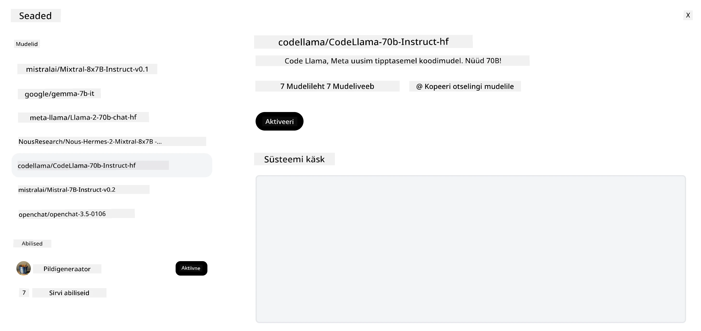
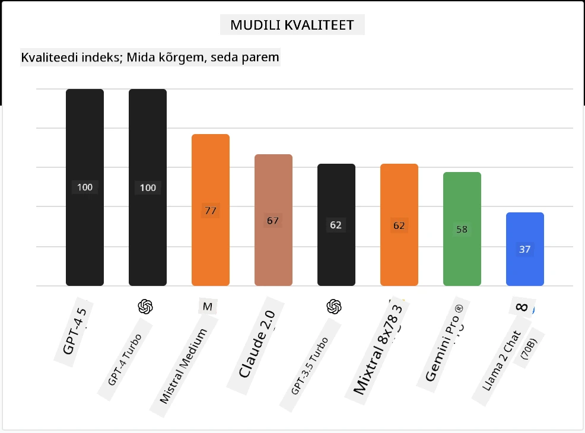

## Sissejuhatus

Avatud lähtekoodiga LLM-ide maailm on põnev ja pidevas arengus. Selle õppetunni eesmärk on anda põhjalik ülevaade avatud lähtekoodiga mudelitest. Kui otsite teavet selle kohta, kuidas omandatud mudelid võrreldavad avatud lähtekoodiga mudelitega, minge õppetunnile ["Erinevate LLM-ide uurimine ja võrdlemine"](../02-exploring-and-comparing-different-llms/README.md?WT.mc_id=academic-105485-koreyst). See õppetund käsitleb ka peenhäälestamist, kuid põhjalikumat selgitust leiate õppetunnist ["LLM-ide peenhäälestamine"](../18-fine-tuning/README.md?WT.mc_id=academic-105485-koreyst).

## Õpieesmärgid

- Saada arusaam avatud lähtekoodiga mudelitest
- Mõista avatud mudelitega töötamise eeliseid
- Uurida Hugging Face’i ja Azure AI Studio avatud mudeleid

## Mis on avatud lähtekoodiga mudelid?

Avatud lähtekoodiga tarkvara on mänginud olulist rolli tehnoloogia arengus erinevates valdkondades. Open Source Initiative (OSI) on määratlenud [10 kriteeriumi tarkvarale](https://web.archive.org/web/20241126001143/https://opensource.org/osd?WT.mc_id=academic-105485-koreyst), et see oleks klassifitseeritud avatud lähtekoodiks. Allikakood peab olema avalikult jagatud OSI poolt heaks kiidetud litsentsi alusel.

Kuigi LLM-ide arendamisel on sarnaseid elemente tarkvara arendamisega, ei ole protsess täpselt sama. See on tekitanud kogukonnas palju arutelusid avatud lähtekoodi definitsiooni üle LLM-ide kontekstis. Selleks, et mudel vastaks traditsioonilisele avatud lähtekoodi definitsioonile, peaks järgmine teave olema avalikult kättesaadav:

- Mudeli treenimiseks kasutatud andmekogud.
- Täielikud mudeli kaalud treeningu osana.
- Hindamiskood.
- Peenhäälestuskood.
- Täielikud mudeli kaalud ja treeningu mõõdikud.

Praegu on vaid mõned mudelid, mis vastavad neile kriteeriumidele. [OLMo mudel, mille lõi Allen Institute for Artificial Intelligence (AllenAI)](https://huggingface.co/allenai/OLMo-7B?WT.mc_id=academic-105485-koreyst) sobib sellesse kategooriasse.

Selles õppetunnis nimetame mudeleid edaspidi "avatud mudeliteks", kuna need ei pruugi kirjutamise ajal kõiki ülaltoodud kriteeriume täita.

## Avatud mudelite eelised

**Väga kohandatav** – Kuna avatud mudelid avaldatakse koos üksikasjaliku treeningteabega, saavad teadlased ja arendajad mudeli sisemust muuta. See võimaldab luua väga spetsialiseeritud mudeleid, mis on peenhäälestatud konkreetse ülesande või uurimisvaldkonna jaoks. Mõned näited on koodi genereerimine, matemaatilised operatsioonid ja bioloogia.

**Kulu** – Nende mudelite kasutamise ja juurutamise tokeni hind on madalam kui omandatud mudelitel. Generatiivsete tehisintellekti rakenduste loomisel tuleks hinnata jõudlust ja hinda vastavalt oma kasutusjuhtumile.

Allikas: Artificial Analysis

**Paindlikkus** – Avatud mudelitega töötamine võimaldab olla paindlik erinevate mudelite kasutamisel või nende kombineerimisel. Näiteks [HuggingChat Assistants](https://huggingface.co/chat?WT.mc_id=academic-105485-koreyst), kus kasutaja saab kasutajaliideses otse valida kasutatava mudeli:

## Erinevate avatud mudelite uurimine

### Llama 2

[LLama2](https://huggingface.co/meta-llama?WT.mc_id=academic-105485-koreyst), mille arendas Meta, on avatud mudel, mis on optimeeritud vestluspõhiste rakenduste jaoks. See tuleneb selle peenhäälestusmeetodist, mis sisaldas suures koguses dialoogi ja inimtagasisidet. Selle meetodiga toodab mudel rohkem tulemusi, mis vastavad inimeste ootustele, pakkudes paremat kasutajakogemust.

Mõned näited Llama peenhäälestatud versioonidest on [Jaapani Llama](https://huggingface.co/elyza/ELYZA-japanese-Llama-2-7b?WT.mc_id=academic-105485-koreyst), mis on spetsialiseerunud jaapani keelele, ja [Llama Pro](https://huggingface.co/TencentARC/LLaMA-Pro-8B?WT.mc_id=academic-105485-koreyst), mis on baasmudeli täiustatud versioon.

### Mistral

[Mistral](https://huggingface.co/mistralai?WT.mc_id=academic-105485-koreyst) on avatud mudel, mis keskendub tugevalt kõrgele jõudlusele ja efektiivsusele. See kasutab Mixture-of-Experts lähenemist, mis ühendab spetsialiseerunud ekspertmudelite grupi üheks süsteemiks, kus sisendi põhjal valitakse kasutamiseks teatud mudelid. See muudab arvutuse tõhusamaks, kuna mudelid töötlevad ainult neid sisendeid, millele nad on spetsialiseerunud.

Mõned näited Mistrali peenhäälestatud versioonidest on [BioMistral](https://huggingface.co/BioMistral/BioMistral-7B?text=Mon+nom+est+Thomas+et+mon+principal?WT.mc_id=academic-105485-koreyst), mis keskendub meditsiinivaldkonnale, ja [OpenMath Mistral](https://huggingface.co/nvidia/OpenMath-Mistral-7B-v0.1-hf?WT.mc_id=academic-105485-koreyst), mis teostab matemaatilisi arvutusi.

### Falcon

[Falcon](https://huggingface.co/tiiuae?WT.mc_id=academic-105485-koreyst) on LLM, mille lõi Technology Innovation Institute (**TII**). Falcon-40B treeniti 40 miljardi parameetriga, mis on näidanud paremat jõudlust kui GPT-3 väiksema arvutusressursi kuluga. See tuleneb FlashAttention algoritmi ja multiquery tähelepanu kasutamisest, mis vähendab mälunõudeid järeldusajal. Tänu lühemale järeldusajale sobib Falcon-40B vestlusrakendusteks.

Mõned näited Falconi peenhäälestatud versioonidest on [OpenAssistant](https://huggingface.co/OpenAssistant/falcon-40b-sft-top1-560?WT.mc_id=academic-105485-koreyst), avatud mudelitele ehitatud assistent, ja [GPT4ALL](https://huggingface.co/nomic-ai/gpt4all-falcon?WT.mc_id=academic-105485-koreyst), mis pakub baasmudelist kõrgemat jõudlust.

## Kuidas valida

Avatud mudeli valimiseks ei ole ühtset vastust. Hea koht alustamiseks on Azure AI Studio ülesandepõhine filtreerimisfunktsioon. See aitab mõista, milliste ülesannetega mudelit on treenitud. Hugging Face haldab ka LLM-i edetabelit, mis näitab parimaid mudeleid teatud mõõdikute põhjal.

Kui soovite võrrelda erinevat tüüpi LLM-e, on [Artificial Analysis](https://artificialanalysis.ai/?WT.mc_id=academic-105485-koreyst) veel üks suurepärane ressurss:

Allikas: Artificial Analysis

Kui töötate konkreetse kasutusjuhtumiga, võib olla tõhus otsida sama valdkonna peenhäälestatud versioone. Samuti on hea tava katsetada mitut avatud mudelit, et näha, kuidas need vastavad teie ja teie kasutajate ootustele.

## Järgmised sammud

Avatud mudelite parim osa on see, et nendega saab üsna kiiresti tööle hakata. Vaadake [Azure AI Foundry mudelikataloogi](https://ai.azure.com?WT.mc_id=academic-105485-koreyst), mis sisaldab spetsiaalset Hugging Face’i kollektsiooni nende siin käsitletud mudelitega.

## Õppimine ei peatu siin, jätka teekonda

Pärast selle õppetunni lõpetamist vaadake meie [Generatiivse tehisintellekti õppimise kollektsiooni](https://aka.ms/genai-collection?WT.mc_id=academic-105485-koreyst), et jätkata oma generatiivse tehisintellekti teadmiste taseme tõstmist!

---

<!-- CO-OP TRANSLATOR DISCLAIMER START -->
**Vastutusest loobumine**:
See dokument on tõlgitud kasutades tehisintellektil põhinevat tõlketeenust [Co-op Translator](https://github.com/Azure/co-op-translator). Kuigi püüame tagada täpsust, palun arvestage, et automaatsed tõlked võivad sisaldada vigu või ebatäpsusi. Originaaldokument selle emakeeles tuleks pidada autoriteetseks allikaks. Olulise teabe puhul soovitatakse kasutada professionaalset inimtõlget. Me ei vastuta selle tõlke kasutamisest tulenevate arusaamatuste või valesti mõistmiste eest.
<!-- CO-OP TRANSLATOR DISCLAIMER END -->