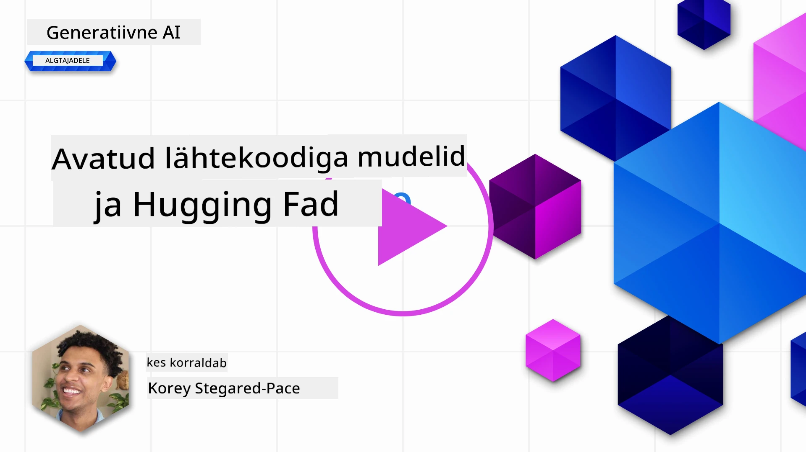
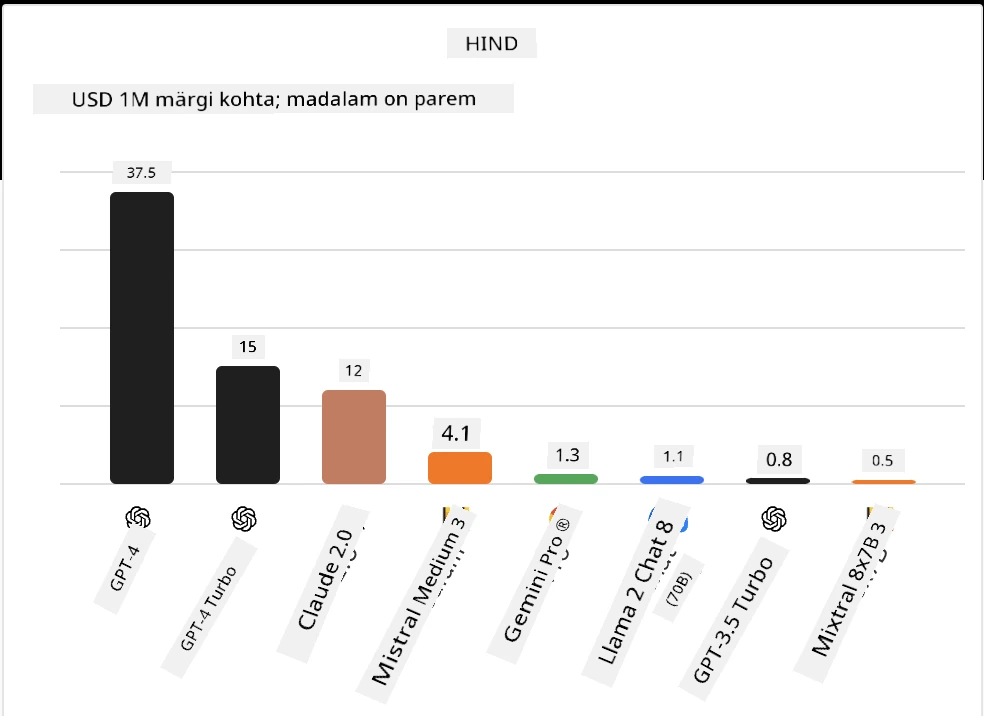
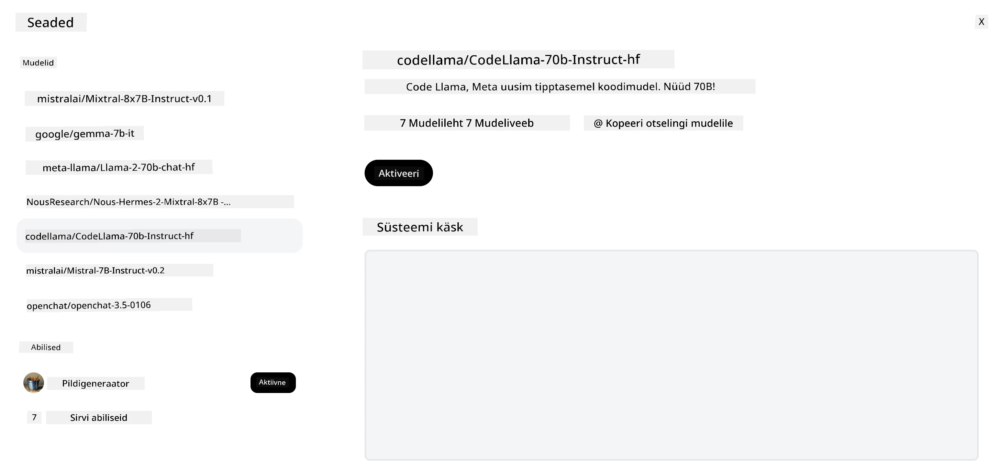
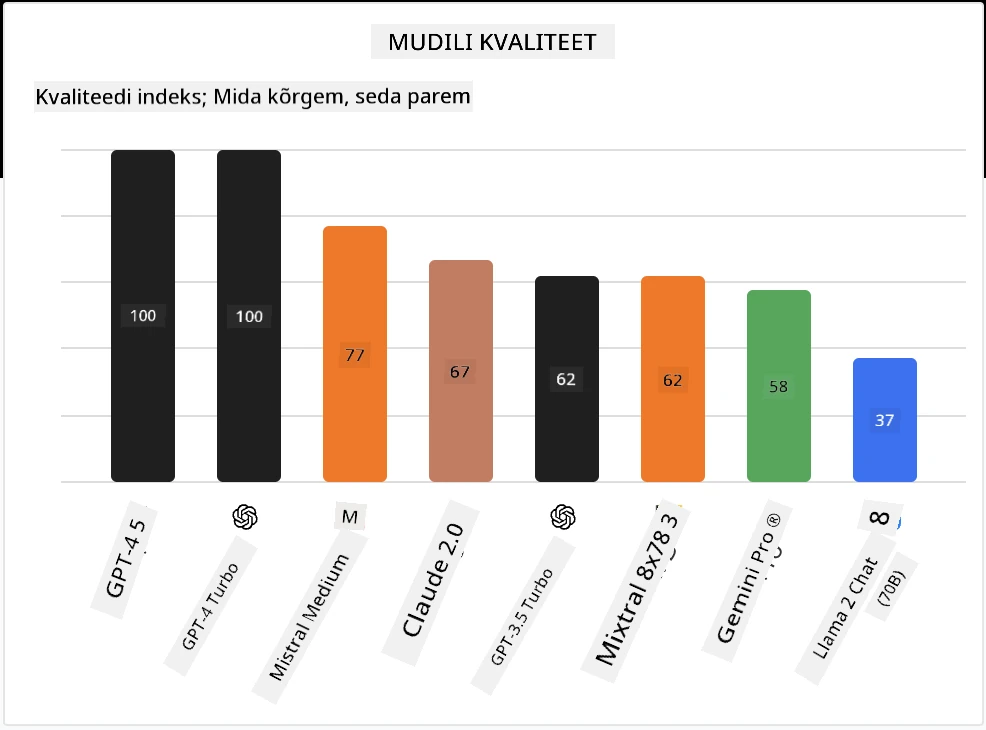

## Sissejuhatus

Avatud lähtekoodiga suurte keelemudelite maailm on põnev ja pidevalt arenev. See õppetund annab põhjaliku ülevaate avatud lähtekoodiga mudelitest. Kui otsid teavet selle kohta, kuidas omanikuõigusega mudelid avatud lähtekoodiga mudelitega võrreldes toimivad, mine õppetundi ["Erinevate suurte keelemudelite uurimine ja võrdlemine" ](../02-exploring-and-comparing-different-llms/README.md?WT.mc_id=academic-105485-koreyst). See õppetund käsitleb ka peenhäälestust, kuid põhjalikuma selgituse leiad õppetunnist ["Suurte keelemudelite peenhäälestus"](../18-fine-tuning/README.md?WT.mc_id=academic-105485-koreyst).

## Õpieesmärgid

- Saada arusaam avatud lähtekoodiga mudelitest
- Mõista avatud mudelitega töötamise eeliseid
- Uuri avatud mudeleid, mis on saadaval Hugging Face'is ja Microsoft Foundry mudelikataloogis

## Mis on avatud lähtekoodiga mudelid?

Avatud lähtekoodiga tarkvara on mänginud olulist rolli tehnoloogia arengus erinevates valdkondades. Open Source Initiative (OSI) on määratlenud [10 tarkvara kriteeriumit](https://web.archive.org/web/20241126001143/https://opensource.org/osd?WT.mc_id=academic-105485-koreyst), et seda saaks klassifitseerida avatud lähtekoodiga tarkvaraks. Allikas peab olema avalikult jagatud litsentsi alusel, mis on OSI poolt heaks kiidetud.

Kuigi suurte keelemudelite arendamine on tarkvaraarendusega sarnaste elementidega, ei ole see protsess täpselt sama. See on tekitanud palju arutelu kogukonnas avatud lähtekoodi mõiste kohta LLM-ide kontekstis. Selleks, et mudel vastaks avatud lähtekoodi traditsioonilisele definitsioonile, peaks järgmine teave olema avalikult kättesaadav:

- Mudeli treenimiseks kasutatud andmekogud.
- Täielikud mudeli kaalud treeningu osana.
- Hindamiskood.
- Peenhäälestuskood.
- Täielikud mudeli kaalud ja treeningumõõdikud.

Praegu on vaid mõned mudelid, mis sellele kriteeriumile vastavad. [OLMo mudel, mille lõi Allen Institute for Artificial Intelligence (AllenAI)](https://huggingface.co/allenai/OLMo-7B?WT.mc_id=academic-105485-koreyst) on üks, mis kuulub sellesse kategooriasse.

Selles õppetunnis nimetame neid mudeleid edaspidi "avatud mudeliteks", kuna nad ei pruugi kirjutamise ajal vastata ülaltoodud kriteeriumitele.

## Avatud mudelite eelised

**Väga kohandatav** – Kuna avatud mudelid avaldatakse koos üksikasjalike treeningandmetega, saavad teadlased ja arendajad mudeli sisemust muuta. See võimaldab luua väga spetsialiseeritud mudeleid, mis on peenhäälestatud konkreetseks ülesandeks või uurimisvaldkonnaks. Mõned näited on koodigeneratsioon, matemaatilised operatsioonid ja bioloogia.

**Maksumus** – Tokeni kasutamise ja rakendamise maksumus on madalam kui omanikuõigusega mudelitel. Luuakse generatiivseid tehisintellekti rakendusi, tuleb nende mudelitega oma kasutusjuhtumi puhul vaadata jõudlust ja hinda.

Allikas: Artificial Analysis

**Paindlikkus** – Avatud mudelitega töötamine võimaldab olla paindlik erinevate mudelite kasutamisel või nende kombineerimisel. Näiteks [HuggingChat assistendid](https://huggingface.co/chat?WT.mc_id=academic-105485-koreyst) võimaldavad kasutajal valida kasutatava mudeli otse kasutajaliideses:

## Erinevate avatud mudelite uurimine

### Llama 2

[Llama2](https://huggingface.co/meta-llama?WT.mc_id=academic-105485-koreyst), mille arendas Meta, on avatud mudel, mis on optimeeritud vestluspõhisteks rakendusteks. See tuleneb peenhäälestusmeetodist, mis hõlmas suures koguses dialoogi ja inimtagasisidet. Selle meetodi abil toodab mudel rohkem inimootustele vastavaid tulemusi, mis parandab kasutajakogemust.

Mõned Llama peenhäälestatud versioonide näited on [Jaapani Llama](https://huggingface.co/elyza/ELYZA-japanese-Llama-2-7b?WT.mc_id=academic-105485-koreyst), mis on spetsialiseerunud jaapani keelele, ja [Llama Pro](https://huggingface.co/TencentARC/LLaMA-Pro-8B?WT.mc_id=academic-105485-koreyst), mis on baasmudeli täiustatud versioon.

### Mistral

[Mistral](https://huggingface.co/mistralai?WT.mc_id=academic-105485-koreyst) on avatud mudel, mille peamine fookus on kõrge jõudlus ja efektiivsus. See kasutab ekspertide segu lähenemist, mis ühendab spetsialiseerunud ekspertmudelite grupi üheks süsteemiks, kus sisendi põhjal valitakse kasutamiseks teatud mudelid. See teeb arvutused efektiivsemaks, kuna mudelid töötlevad ainult neid sisendeid, millele nad on spetsialiseerunud.

Mõned Mistrali peenhäälestatud versioonide näited on [BioMistral](https://huggingface.co/BioMistral/BioMistral-7B?text=Mon+nom+est+Thomas+et+mon+principal?WT.mc_id=academic-105485-koreyst), mis keskendub meditsiinivaldkonnale, ja [OpenMath Mistral](https://huggingface.co/nvidia/OpenMath-Mistral-7B-v0.1-hf?WT.mc_id=academic-105485-koreyst), mis teostab matemaatilisi arvutusi.

### Falcon

[Falcon](https://huggingface.co/tiiuae?WT.mc_id=academic-105485-koreyst) on tehnoloogiainnovatsiooni instituudi (TII) loodud suur keelemudel. Falcon-40B treeniti 40 miljardi parameetriga, millel on näidatud paremat sooritust kui GPT-3 väiksema arvutusressursiga. See tuleneb FlashAttention-algoritmi ja multiquery tähelepanu kasutamisest, mis vähendab mälunõudeid järeldusajal. Tänu lühendatud järeldusajale sobib Falcon-40B hästi vestlusrakendusteks.

Mõned Falconi peenhäälestatud versioonide näited on [OpenAssistant](https://huggingface.co/OpenAssistant/falcon-40b-sft-top1-560?WT.mc_id=academic-105485-koreyst), avatud mudelitele rajatud assistent, ja [GPT4ALL](https://huggingface.co/nomic-ai/gpt4all-falcon?WT.mc_id=academic-105485-koreyst), mis pakub baasmudelist kõrgemat jõudlust.

## Kuidas valida

Avatud mudeli valimiseks ei ole ühtset vastust. Hea koht alustamiseks on Microsoft Foundry mudelikataloogi valiku funktsioon ülesande järgi, mis aitab mõista, milliste ülesannetega on mudel treenitud. Hugging Face haldab ka suurte keelemudelite edetabelit, mis näitab parimaid mudeleid teatud mõõdikute põhjal.

Kui soovid erinevaid LLM-e võrrelda, on [Artificial Analysis](https://artificialanalysis.ai/?WT.mc_id=academic-105485-koreyst) suurepärane ressurss:

Allikas: Artificial Analysis

Kui töötab konkreetse kasutusjuhtumiga, võib olla efektiivne otsida samale valdkonnale keskendunud peenhäälestatud versioone. Mitme avatud mudeli katsetamine, et näha, kuidas need vastavad sinu ja kasutajate ootustele, on samuti hea tava.

## Järgmised sammud

Parim asi avatud mudelite juures on see, et nende kasutamisega saab üsna kiiresti alustada. Vaata [Microsoft Foundry mudelikataloogi](https://ai.azure.com?WT.mc_id=academic-105485-koreyst), kus on esile toodud spetsiaalne Hugging Face'i kollektsioon nendest siin käsitletud mudelitest.

## Õppimine siin ei peatu, jätka teekonda

Pärast selle õppetunni läbimist vaata meie [Generatiivse tehisintellekti õppekollektsiooni](https://aka.ms/genai-collection?WT.mc_id=academic-105485-koreyst), et jätkata oma generatiivse tehisintellekti teadmiste taseme tõstmist!

---

<!-- CO-OP TRANSLATOR DISCLAIMER START -->
**Lahtiütlus**:
See dokument on tõlgitud kasutades AI tõlketeenust [Co-op Translator](https://github.com/Azure/co-op-translator). Kuigi me püüdleme täpsuse poole, palun pange tähele, et automatiseeritud tõlgetes võib esineda vigu või ebatäpsusi. Originaaldokument selle emakeeles tuleks pidada autoriteetseks allikaks. Olulise teabe puhul soovitatakse kasutada professionaalset inimtõlget. Me ei vastuta selle tõlkega seotud eksimustest või valesti mõistmistest.
<!-- CO-OP TRANSLATOR DISCLAIMER END -->