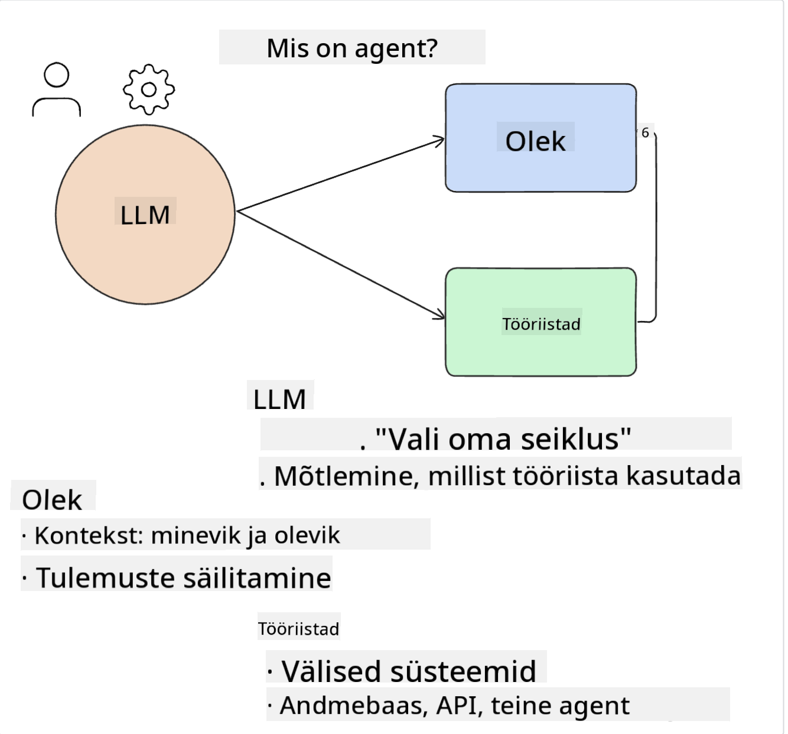
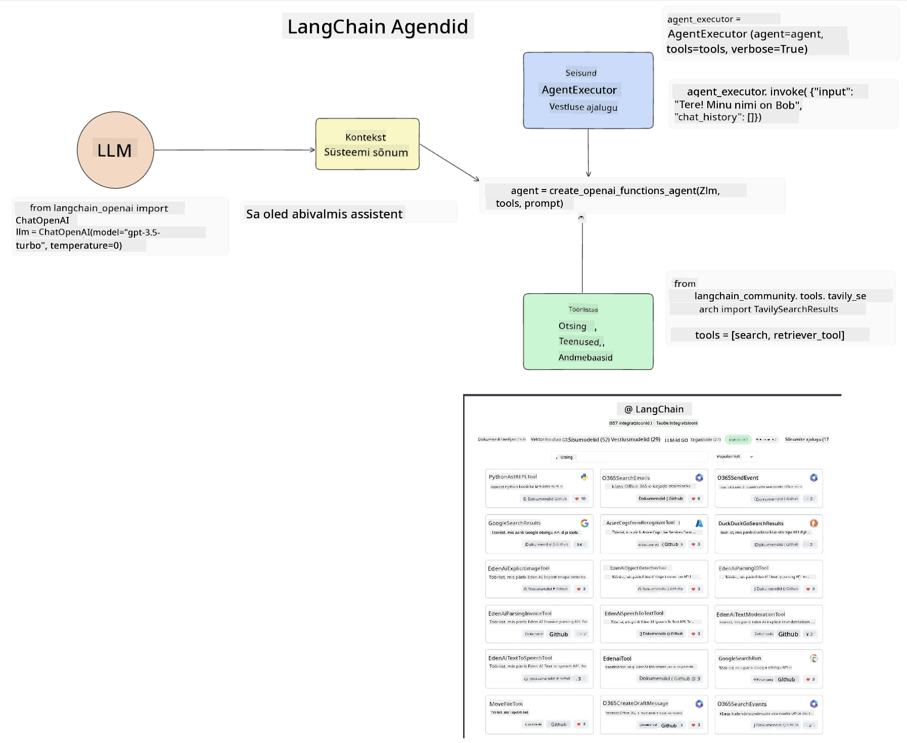
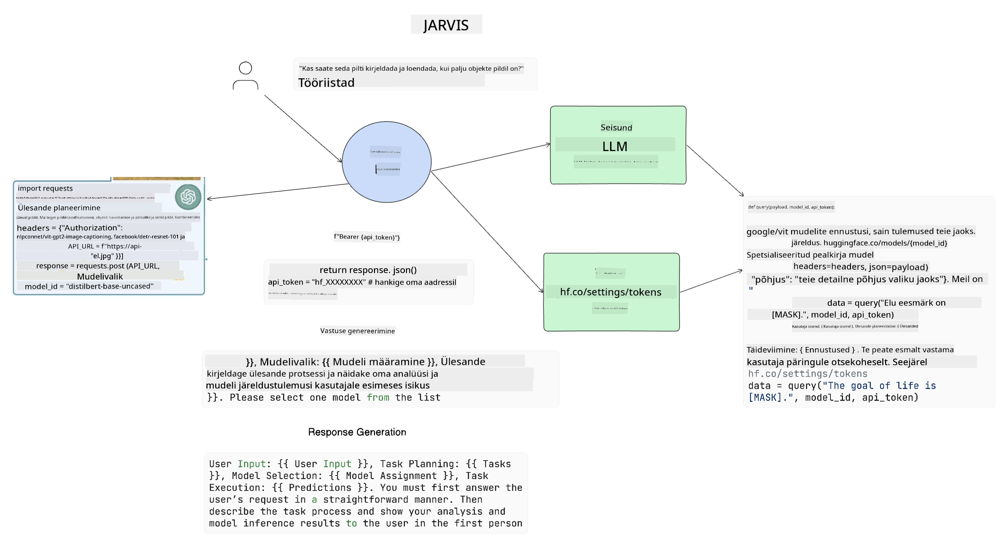

<!--
CO_OP_TRANSLATOR_METADATA:
{
  "original_hash": "11f03c81f190d9cbafd0f977dcbede6c",
  "translation_date": "2025-10-11T11:34:40+00:00",
  "source_file": "17-ai-agents/README.md",
  "language_code": "et"
}
-->
[](https://aka.ms/gen-ai-lesson17-gh?WT.mc_id=academic-105485-koreyst)

## Sissejuhatus

AI agendid esindavad põnevat arengut generatiivses tehisintellektis, võimaldades suurte keelemudelite (LLM) areneda assistentidest agentideks, kes suudavad tegutseda. AI agentide raamistikud võimaldavad arendajatel luua rakendusi, mis annavad LLM-idele juurdepääsu tööriistadele ja oleku haldamisele. Need raamistikud parandavad ka nähtavust, võimaldades kasutajatel ja arendajatel jälgida LLM-ide kavandatud tegevusi, parandades seeläbi kogemuste haldamist.

Õppetund hõlmab järgmisi teemasid:

- Mis on AI agent? - Mis täpselt on AI agent?
- Nelja erineva AI agentide raamistiku uurimine - Mis teeb need ainulaadseks?
- Nende AI agentide rakendamine erinevates kasutusjuhtudes - Millal peaksime AI agente kasutama?

## Õpieesmärgid

Pärast selle õppetunni läbimist suudad:

- Selgitada, mis on AI agendid ja kuidas neid saab kasutada.
- Mõista mõningate populaarsete AI agentide raamistikude erinevusi ja nende eripärasid.
- Mõista, kuidas AI agendid toimivad, et luua rakendusi nende abil.

## Mis on AI agendid?

AI agendid on väga põnev valdkond generatiivse tehisintellekti maailmas. Selle põnevusega kaasneb sageli terminite ja nende rakenduste segadus. Et asjad lihtsaks ja enamiku AI agentide tööriistadega kooskõlas hoida, kasutame järgmist definitsiooni:

AI agendid võimaldavad suurte keelemudelite (LLM) täita ülesandeid, andes neile juurdepääsu **olekule** ja **tööriistadele**.



Määratleme need terminid:

**Suured keelemudelid** - Need on mudelid, mida käsitletakse kogu kursuse vältel, nagu GPT-3.5, GPT-4, Llama-2 jne.

**Olek** - See viitab kontekstile, milles LLM töötab. LLM kasutab oma varasemate tegevuste ja praeguse konteksti konteksti, et suunata oma otsuste tegemist järgnevateks tegevusteks. AI agentide raamistikud võimaldavad arendajatel seda konteksti lihtsamalt hallata.

**Tööriistad** - Kasutaja taotletud ja LLM-i kavandatud ülesande täitmiseks vajab LLM juurdepääsu tööriistadele. Mõned näited tööriistadest võivad olla andmebaas, API, väline rakendus või isegi teine LLM!

Need definitsioonid peaksid andma hea aluse edasiseks uurimiseks, kuidas neid rakendatakse. Vaatame mõningaid erinevaid AI agentide raamistikke:

## LangChain agendid

[LangChain agendid](https://python.langchain.com/docs/how_to/#agents?WT.mc_id=academic-105485-koreyst) on ülaltoodud definitsioonide rakendus.

**Oleku** haldamiseks kasutab see sisseehitatud funktsiooni nimega `AgentExecutor`. See aktsepteerib määratletud `agent` ja saadaval olevad `tööriistad`.

`AgentExecutor` salvestab ka vestluse ajaloo, et pakkuda vestluse konteksti.



LangChain pakub [tööriistade kataloogi](https://integrations.langchain.com/tools?WT.mc_id=academic-105485-koreyst), mida saab importida rakendusse, kus LLM saab neile juurdepääsu. Need on loodud kogukonna ja LangChaini meeskonna poolt.

Saad seejärel määratleda need tööriistad ja edastada need `AgentExecutor`-ile.

Nähtavus on AI agentide puhul veel üks oluline aspekt. Rakenduste arendajatele on oluline mõista, millist tööriista LLM kasutab ja miks. Selleks on LangChaini meeskond välja töötanud LangSmithi.

## AutoGen

Järgmine AI agentide raamistik, mida arutame, on [AutoGen](https://microsoft.github.io/autogen/?WT.mc_id=academic-105485-koreyst). AutoGeni peamine fookus on vestlused. Agendid on nii **vestlusvõimelised** kui ka **kohandatavad**.

**Vestlusvõimelised** - LLM-id saavad alustada ja jätkata vestlust teise LLM-iga, et täita ülesannet. Seda tehakse, luues `AssistantAgents` ja andes neile konkreetse süsteemisõnumi.

```python

autogen.AssistantAgent( name="Coder", llm_config=llm_config, ) pm = autogen.AssistantAgent( name="Product_manager", system_message="Creative in software product ideas.", llm_config=llm_config, )

```

**Kohandatavad** - Agendid võivad olla määratletud mitte ainult LLM-idena, vaid ka kasutaja või tööriistana. Arendajana saad määratleda `UserProxyAgent`, mis vastutab kasutajaga suhtlemise eest, et saada tagasisidet ülesande täitmiseks. See tagasiside võib kas jätkata ülesande täitmist või selle peatada.

```python
user_proxy = UserProxyAgent(name="user_proxy")
```

### Olek ja tööriistad

Oleku muutmiseks ja haldamiseks genereerib AssistantAgent Python-koodi, et ülesanne täita.

Siin on näide protsessist:


#### LLM määratletud süsteemisõnumiga

```python
system_message="For weather related tasks, only use the functions you have been provided with. Reply TERMINATE when the task is done."
```

See süsteemisõnum suunab konkreetse LLM-i, millised funktsioonid on tema ülesande jaoks asjakohased. Pea meeles, et AutoGenis saad määratleda mitu AssistantAgent'i erinevate süsteemisõnumitega.

#### Vestlust alustab kasutaja

```python
user_proxy.initiate_chat( chatbot, message="I am planning a trip to NYC next week, can you help me pick out what to wear? ", )

```

See sõnum kasutaja proxylt (inimene) käivitab agendi protsessi, et uurida, milliseid funktsioone tuleks täita.

#### Funktsioon täidetakse

```bash
chatbot (to user_proxy):

***** Suggested tool Call: get_weather ***** Arguments: {"location":"New York City, NY","time_periond:"7","temperature_unit":"Celsius"} ******************************************************** --------------------------------------------------------------------------------

>>>>>>>> EXECUTING FUNCTION get_weather... user_proxy (to chatbot): ***** Response from calling function "get_weather" ***** 112.22727272727272 EUR ****************************************************************

```

Kui algne vestlus on töödeldud, saadab agent soovitatud tööriista, mida kasutada. Antud juhul on see funktsioon nimega `get_weather`. Sõltuvalt konfiguratsioonist võib see funktsioon automaatselt täituda ja agendi poolt lugeda või täituda kasutaja sisendi põhjal.

Leiad [AutoGeni koodinäidete loendi](https://microsoft.github.io/autogen/docs/Examples/?WT.mc_id=academic-105485-koreyst), et uurida, kuidas alustada ehitamist.

## Taskweaver

Järgmine agentide raamistik, mida uurime, on [Taskweaver](https://microsoft.github.io/TaskWeaver/?WT.mc_id=academic-105485-koreyst). Seda tuntakse kui "koodipõhist" agenti, kuna selle asemel, et töötada rangelt `stringidega`, saab see töötada Pythonis DataFrame'idega. See muutub äärmiselt kasulikuks andmeanalüüsi ja generatiivsete ülesannete jaoks, nagu graafikute ja diagrammide loomine või juhuslike numbrite genereerimine.

### Olek ja tööriistad

Vestluse oleku haldamiseks kasutab Taskweaver `Planner` kontseptsiooni. `Planner` on LLM, mis võtab kasutajate taotluse ja kaardistab ülesanded, mis tuleb täita, et taotlust täita.

Ülesannete täitmiseks on `Planner`-il juurdepääs tööriistade kogumile, mida nimetatakse `Plugins`. Need võivad olla Python klassid või üldine koodi tõlgendaja. Need pluginad salvestatakse embeddingutena, et LLM saaks paremini otsida õiget pluginit.


Siin on näide pluginast, mis tegeleb anomaaliate tuvastamisega:

```python
class AnomalyDetectionPlugin(Plugin): def __call__(self, df: pd.DataFrame, time_col_name: str, value_col_name: str):
```

Kood kontrollitakse enne täitmist. Teine funktsioon konteksti haldamiseks Taskweaveris on `experience`. Kogemus võimaldab vestluse konteksti pikaajaliselt YAML-failis salvestada. Seda saab konfigureerida nii, et LLM paraneb aja jooksul teatud ülesannetes, kuna see puutub kokku varasemate vestlustega.

## JARVIS

Viimane agentide raamistik, mida uurime, on [JARVIS](https://github.com/microsoft/JARVIS?tab=readme-ov-file?WT.mc_id=academic-105485-koreyst). Mis teeb JARVIS-e ainulaadseks, on see, et see kasutab LLM-i vestluse oleku haldamiseks ja `tööriistad` on teised AI mudelid. Iga AI mudel on spetsialiseerunud mudel, mis täidab teatud ülesandeid, nagu objektide tuvastamine, transkriptsioon või pildiallkirjade loomine.



LLM, olles üldotstarbeline mudel, võtab kasutajalt taotluse ja tuvastab konkreetse ülesande ning kõik argumendid/andmed, mis on vajalikud ülesande täitmiseks.

```python
[{"task": "object-detection", "id": 0, "dep": [-1], "args": {"image": "e1.jpg" }}]
```

LLM vormindab taotluse viisil, mida spetsialiseerunud AI mudel suudab tõlgendada, näiteks JSON-ina. Kui AI mudel on ülesande põhjal oma ennustuse tagastanud, võtab LLM vastuse vastu.

Kui ülesande täitmiseks on vaja mitut mudelit, tõlgendab LLM ka nende mudelite vastuseid, enne kui need kokku viib ja kasutajale vastuse genereerib.

Allolev näide näitab, kuidas see toimiks, kui kasutaja taotleb pildi objektide kirjeldust ja loendamist:

## Ülesanne

AI agentide õppimise jätkamiseks saad AutoGeniga ehitada:

- Rakenduse, mis simuleerib ärikoosolekut hariduse idufirma erinevate osakondade vahel.
- Loo süsteemisõnumid, mis suunavad LLM-e mõistma erinevaid isikuid ja prioriteete ning võimaldavad kasutajal esitada uue toote idee.
- LLM peaks seejärel genereerima järelküsimusi igast osakonnast, et täpsustada ja parandada ideed ja toodet.

## Õppimine ei lõpe siin, jätka teekonda

Pärast selle õppetunni lõpetamist vaata meie [Generatiivse AI õppekollektsiooni](https://aka.ms/genai-collection?WT.mc_id=academic-105485-koreyst), et jätkata oma generatiivse tehisintellekti teadmiste arendamist!

---

**Lahtiütlus**:  
See dokument on tõlgitud AI tõlketeenuse [Co-op Translator](https://github.com/Azure/co-op-translator) abil. Kuigi püüame tagada täpsust, palume arvestada, et automaatsed tõlked võivad sisaldada vigu või ebatäpsusi. Algne dokument selle algses keeles tuleks pidada autoriteetseks allikaks. Olulise teabe puhul soovitame kasutada professionaalset inimtõlget. Me ei vastuta selle tõlke kasutamisest tulenevate arusaamatuste või valesti tõlgenduste eest.