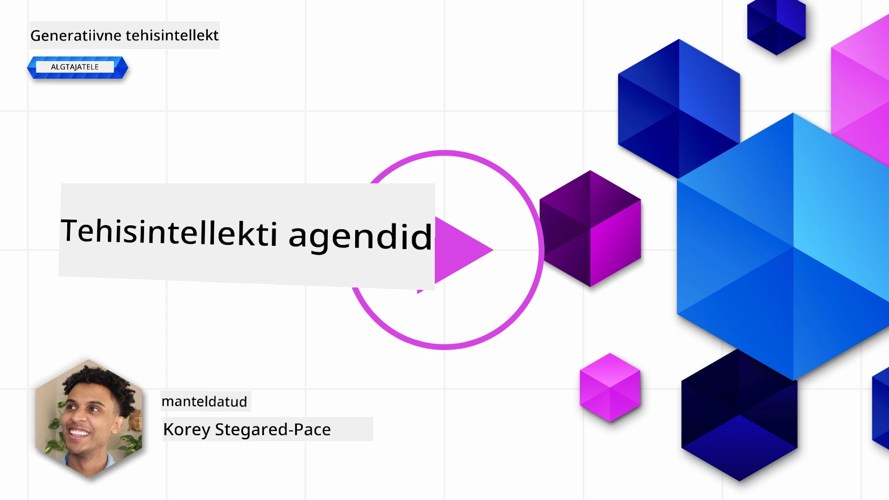
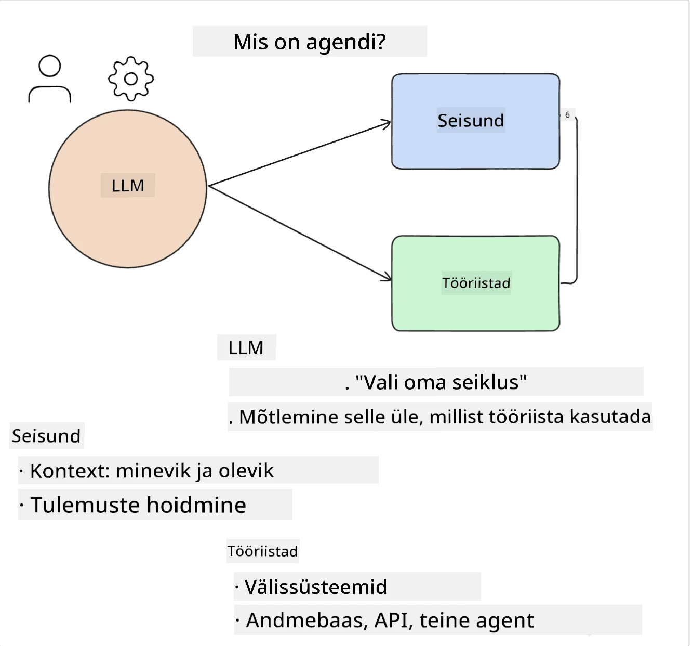
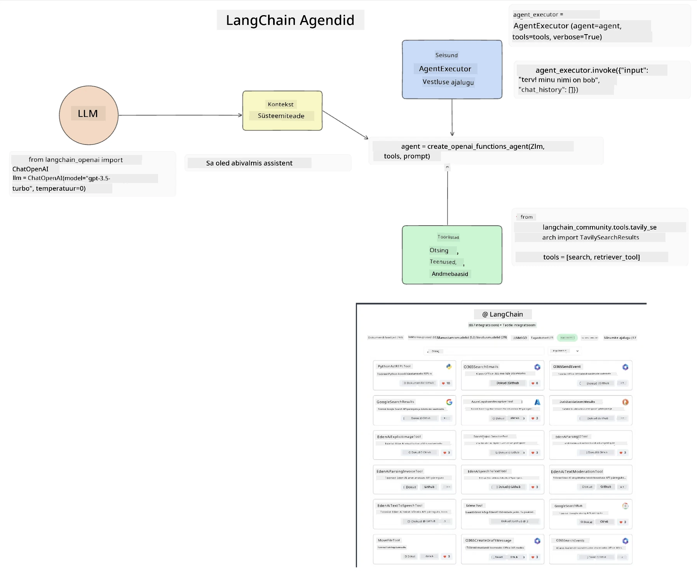
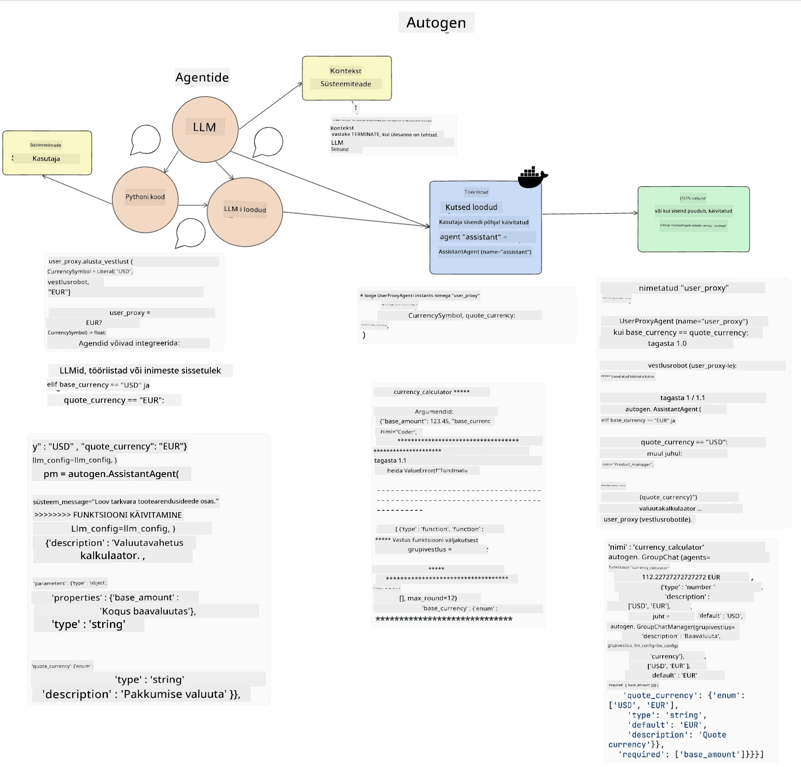
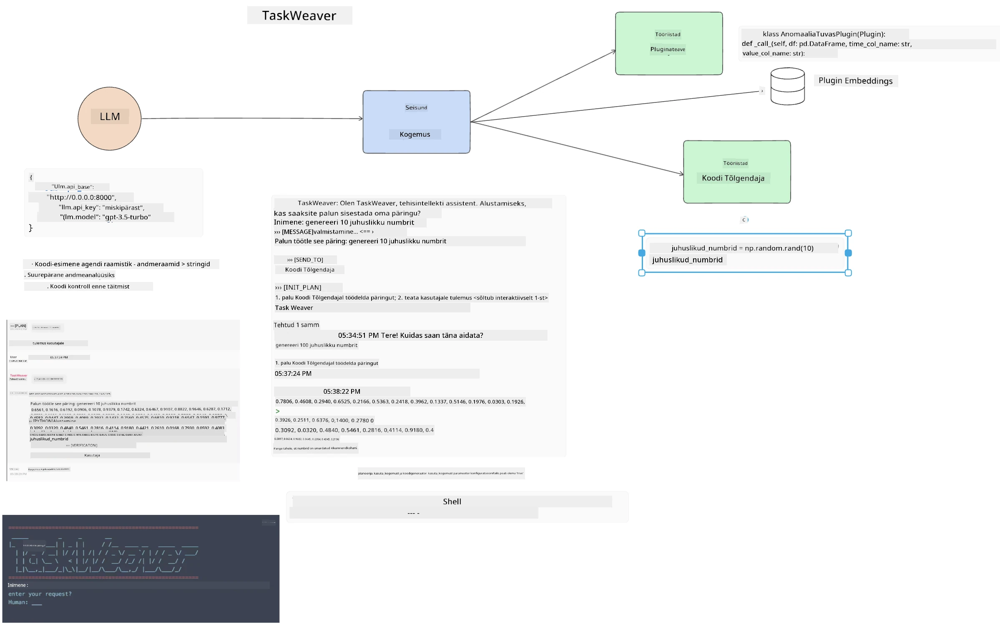
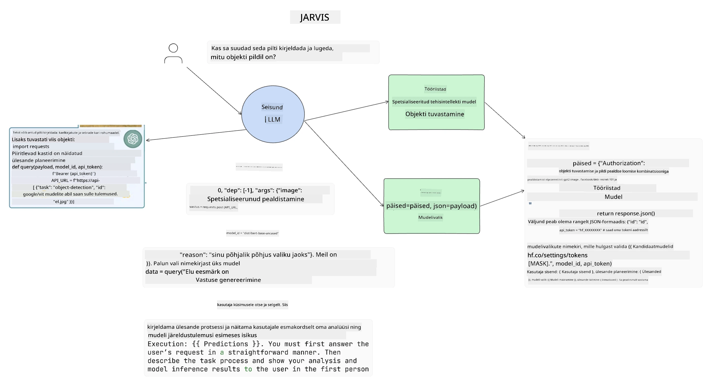

[](https://youtu.be/yAXVW-lUINc?si=bOtW9nL6jc3XJgOM)

## Sissejuhatus

AI agentid esindavad põnevat arengut generatiivses tehisintellektis, võimaldades suurte keelemudelite (LLM-id) areneda assistentidest agentideks, kes suudavad toiminguid teha. AI agentide raamistikud võimaldavad arendajatel luua rakendusi, mis annavad LLM-idele juurdepääsu tööriistadele ja olekuhaldussüsteemile. Need raamistikud parandavad ka nähtavust, võimaldades kasutajatel ja arendajatel jälgida LLM-ide kavandatud toiminguid, parandades seeläbi kasutajakogemust.

Õppetükk katab järgmised teemad:

- Arusaamine, mis on AI agent – mis täpselt on AI agent?
- Nelja erineva AI agentide raamistikuga tutvumine – mis teeb need unikaalseks?
- Nende AI agentide rakendamine erinevates kasutusjuhtumites – millal peaks AI agente kasutama?

## Õpieesmärgid

Pärast selle õppetüki läbimist suudad:

- Selgitada, mis on AI agentid ja kuidas neid saab kasutada.
- Mõista mõningate populaarsete AI agentide raamistikute erinevusi ja erisusi.
- Mõista, kuidas AI agentid toimivad, et nendega rakendusi ehitada.

## Mis on AI agentid?

AI agentid on väga põnev valdkond generatiivse tehisintellekti maailmas. Selle põnevuse kõrval võib ilmneda mõnede terminite ja nende rakenduste segadus. Et hoida asjad lihtsana ja kaasata enamik tööriistu, mis viitavad AI agentidele, kasutame järgmist definitsiooni:

AI agentid võimaldavad suurte keelemudelite (LLM-ide) täita ülesandeid, andes neile juurdepääsu **olekule** ja **tööriistadele**.



Määratleme need terminid:

**Suured keelemudelid** – need on selles kursuses mainitud mudelid nagu GPT-3.5, GPT-4, Llama-2 jmt.

**Olek** – see viitab kontekstile, milles LLM töötab. LLM kasutab oma varasemate toimingute ja praeguse konteksti teavet, mis juhib tema otsuseid edasiste toimingute kohta. AI agentide raamistikud võimaldavad arendajatel selle konteksti lihtsamalt hallata.

**Tööriistad** – kasutaja soovitud ja LLM-i kavandatud ülesande täitmiseks peab LLM-l olema juurdepääs tööriistadele. Mõned näited tööriistadest võivad olla andmebaas, API, väline rakendus või isegi teine LLM!

Need definitsioonid annavad loodetavasti hea aluse, kui vaatame nende teostust. Tutvume mõne erineva AI agentide raamistikuga:

## LangChaini agentid

[LangChaini agentid](https://python.langchain.com/docs/how_to/#agents?WT.mc_id=academic-105485-koreyst) on ülaltoodud definitsioonide rakendus.

**Olek** haldamiseks kasutatakse sisseehitatud funktsiooni `AgentExecutor`, mis võtab vastu määratletud `agent`i ja sellele kättesaadavad `tööriistad`.

`AgentExecutor` salvestab ka vestluse ajaloo, et pakkuda vestluse konteksti.



LangChain pakub [tööriistade kataloogi](https://integrations.langchain.com/tools?WT.mc_id=academic-105485-koreyst), mida saab teie rakendusse importida, võimaldades LLM-il nendele ligi pääseda. Need on loodud kogukonna ja LangChaini meeskonna poolt.

Seejärel saate need tööriistad määratleda ja anda need `AgentExecutor`ile.

Nähtavus on AI agentide puhul oluline. Rakenduste arendajatel on tähtis mõista, millist tööriista LLM kasutab ja miks. Selleks on LangChaini meeskond välja töötanud LangSmithi.

## AutoGen

Järgmine AI agentide raamistik, mida arutame, on [AutoGen](https://microsoft.github.io/autogen/?WT.mc_id=academic-105485-koreyst). AutoGeni peamine fookus on vestlused. Agendid on nii **vestlevad** kui ka **kohandatavad**.

**Vestlevad -** LLM-id saavad alustada ja jätkata vestlust teise LLM-iga ülesande täitmiseks. Seda tehakse, luues `AssistantAgent`e ja andes neile kindla süsteemisõnumi.

```python

autogen.AssistantAgent( name="Coder", llm_config=llm_config, ) pm = autogen.AssistantAgent( name="Product_manager", system_message="Creative in software product ideas.", llm_config=llm_config, )

```

**Kohandatavad** – agente saab määratleda mitte ainult LLM-idena, vaid ka kasutajana või tööriistana. Arendajana võid määratleda `UserProxyAgent`i, kes vastutab kasutajalt tagasiside kogumise eest ülesande täitmisel. See tagasiside võib kas jätkata ülesande täitmist või seda peatada.

```python
user_proxy = UserProxyAgent(name="user_proxy")
```

### Olek ja tööriistad

Olekut muutmiseks ja haldamiseks genereerib abistav agent Python-koodi ülesande täitmiseks.

Siin on protsessi näide:



#### LLM määratletud süsteemisõnumiga

```python
system_message="For weather related tasks, only use the functions you have been provided with. Reply TERMINATE when the task is done."
```

See süsteemisõnum juhib seda konkreetset LLM-i, millised funktsioonid on tema ülesande jaoks olulised. AutoGenis võid määratleda mitmeid erinevaid AssistantAgent’e erinevate süsteemisõnumitega.

#### Vestlus algatatud kasutaja poolt

```python
user_proxy.initiate_chat( chatbot, message="I am planning a trip to NYC next week, can you help me pick out what to wear? ", )

```

See sõnum `user_proxy`lt (inimeselt) alustab agenti, et uurida võimalikke funktsioone, mida tuleks täita.

#### Funktsioon täidetakse

```bash
chatbot (to user_proxy):

***** Suggested tool Call: get_weather ***** Arguments: {"location":"New York City, NY","time_periond:"7","temperature_unit":"Celsius"} ******************************************************** --------------------------------------------------------------------------------

>>>>>>>> EXECUTING FUNCTION get_weather... user_proxy (to chatbot): ***** Response from calling function "get_weather" ***** 112.22727272727272 EUR ****************************************************************

```

Kui esmane vestlus on töödeldud, saadab agent soovitatava tööriista kutse, antud juhul funktsioon `get_weather`. Sõltuvalt teie konfiguratsioonist võib see funktsioon automaatselt täituda ja agent seda lugeda või täidetakse see kasutaja sisendi alusel.

Leiad nimekirja [AutoGen koodinäidetest](https://microsoft.github.io/autogen/docs/Examples/?WT.mc_id=academic-105485-koreyst), et veelgi paremini alustada rakenduste ehitamist.

## Taskweaver

Järgmine agentide raamistik, mida vaatleme, on [Taskweaver](https://microsoft.github.io/TaskWeaver/?WT.mc_id=academic-105485-koreyst). Seda tuntakse kui "code-first" agenti, sest selle asemel, et töötada rangelt `string`idega, saab see töötada DataFrame’idega Pythoni keeles. See on eriti kasulik andmeanalüüsi ja genereerimise ülesannetes, näiteks graafikute ja diagrammide loomisel või juhuslike arvude genereerimisel.

### Olek ja tööriistad

Vestluse oleku haldamiseks kasutab TaskWeaver mõistet `Planner`. `Planner` on LLM, mis võtab kasutajate taotluse ja kavandab ülesanded, mis tuleb täita taotluse rahuldamiseks.

Ülesannete täitmiseks kasutab `Planner` tööriistade kogu nimega `Plugins`. Need võivad olla Python klassid või üldine kooditõlgendaja. Need pluginad salvestatakse embedding’utena, et LLM saaks paremini otsida õiget lisa.



Siin on näide pistikprogrammist anomaaliate tuvastamiseks:

```python
class AnomalyDetectionPlugin(Plugin): def __call__(self, df: pd.DataFrame, time_col_name: str, value_col_name: str):
```

Kood kontrollitakse enne täitmist. Teine TaskWeaveris konteksti haldava funktsioonina kasutatakse `experience`i. Experience võimaldab vestluse konteksti pikaajaliselt salvestada YAML-faili. Seda saab konfigureerida nii, et LLM paraneb aja jooksul teatud ülesannetes, tuginedes varasematele vestlustele.

## JARVIS

Viimane agentide raamistik, mida uurime, on [JARVIS](https://github.com/microsoft/JARVIS?tab=readme-ov-file&WT.mc_id=academic-105485-koreyst). JARVISi unikaalsus seisneb selles, et see kasutab LLM-i vestluse `oleku` haldamiseks ning `tööriistad`eks on teised AI mudelid. Iga AI mudel on spetsialiseerunud konkreetsete ülesannete täitmisele nagu objekti tuvastamine, transkriptsioon või pildi kirjeldus.



LLM, mis on üldotstarbeline mudel, võtab kasutajalt taotluse, tuvastab konkreetse ülesande ja kõik vajalikud argumendid/andmed ülesande täitmiseks.

```python
[{"task": "object-detection", "id": 0, "dep": [-1], "args": {"image": "e1.jpg" }}]
```

Seejärel vormindab LLM taotluse nii, et spetsialiseerunud AI mudel seda suudab tõlgendada, näiteks JSON-vormingus. Kui AI mudel on vastuse ülesande põhjal tagastanud, saab LLM vastuse.

Kui ülesande täitmiseks on vaja mitut mudelit, tõlgendab LLM ka nende mudelite vastuseid ning koondab need kokku, et genereerida kasutajale vastus.

Järgmine näide näitab, kuidas see toimiks, kui kasutaja palub pilti kirjeldada ja selles olevaid objekte lugeda:

## Ülesanne

Enda AI agentide õppimise jätkamiseks saad AutoGeniga ehitada:

- Rakenduse, mis simuleerib ärikoosolekut haridusstartup’i erinevate osakondade vahel.
- Loo süsteemisõnumid, mis juhendavad LLM-e mõistma erinevaid isikupärasid ja prioriteete ning võimaldavad kasutajal esitada uut tooteideed.
- LLM peaks seejärel genereerima edasiarenduslikke küsimusi igalt osakonnalt, et täpsustada ja parandada esitust ning tooteideed.

## Õppimine siin ei peatu, jätka teekonda

Pärast selle õppetüki lõpetamist vaata meie [Generatiivse tehisintellekti õppematerjalide kollektsiooni](https://aka.ms/genai-collection?WT.mc_id=academic-105485-koreyst), et jätkata oma generatiivse AI teadmiste tõstmist!

---

<!-- CO-OP TRANSLATOR DISCLAIMER START -->
**Vastutusest loobumine**:
See dokument on tõlgitud kasutades tehisintellekti tõlketeenust [Co-op Translator](https://github.com/Azure/co-op-translator). Kuigi pingutame täpsuse nimel, palun arvestage, et automatiseeritud tõlgetes võib esineda vigu või ebatäpsusi. Originaaldokument selle emakeeles tuleks pidada autoriteetseks allikaks. Kriitilise teabe puhul soovitatakse kasutada professionaalset inimtõlget. Me ei vastuta selle tõlke kasutamisest tulenevate arusaamatuste või väärtõlgenduste eest.
<!-- CO-OP TRANSLATOR DISCLAIMER END -->