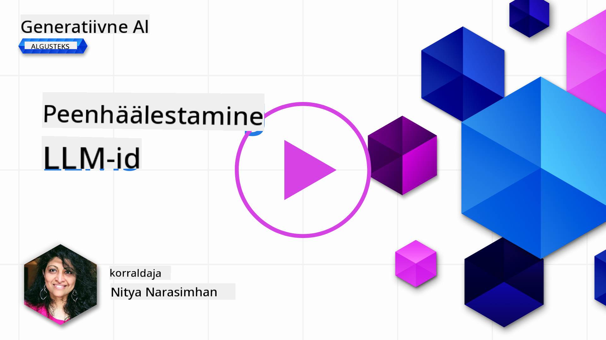
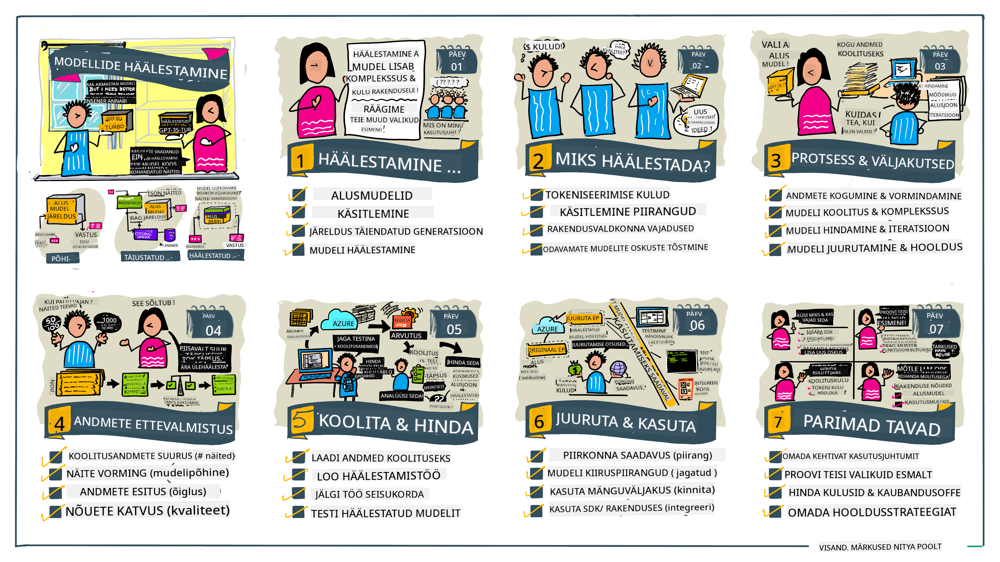

<!--
CO_OP_TRANSLATOR_METADATA:
{
  "original_hash": "68664f7e754a892ae1d8d5e2b7bd2081",
  "translation_date": "2025-10-11T11:50:01+00:00",
  "source_file": "18-fine-tuning/README.md",
  "language_code": "et"
}
-->

# LLM-i peenhäälestamine

Generatiivse tehisintellekti rakenduste loomine suurte keelemudelite abil toob kaasa uusi väljakutseid. Üks peamisi probleeme on tagada vastuste kvaliteet (täpsus ja asjakohasus), mida mudel genereerib vastuseks kasutaja päringule. Eelnevates tundides arutasime tehnikaid nagu _põhivihjete kujundamine_ ja _otsinguga täiustatud genereerimine_, mis püüavad probleemi lahendada, _muutes mudeli sisendit_.

Tänases tunnis käsitleme kolmandat tehnikat, **peenhäälestamist**, mis püüab väljakutset lahendada, _treenides mudelit uuesti_ täiendavate andmetega. Sukeldume detailidesse.

## Õpieesmärgid

Selles tunnis tutvustatakse peenhäälestamise kontseptsiooni eelnevalt treenitud keelemudelite jaoks, uuritakse selle lähenemisviisi eeliseid ja väljakutseid ning antakse juhiseid, millal ja kuidas kasutada peenhäälestamist, et parandada generatiivse tehisintellekti mudelite jõudlust.

Tunni lõpuks peaksid sa olema võimeline vastama järgmistele küsimustele:

- Mis on keelemudelite peenhäälestamine?
- Millal ja miks on peenhäälestamine kasulik?
- Kuidas saab eelnevalt treenitud mudelit peenhäälestada?
- Millised on peenhäälestamise piirangud?

Valmis? Alustame.

## Illustreeritud juhend

Tahad enne süvitsi minemist saada ülevaate, mida me käsitleme? Vaata seda illustreeritud juhendit, mis kirjeldab õpiteekonda selles tunnis – alates peenhäälestamise põhikontseptsioonide ja motivatsiooni õppimisest kuni protsessi ja parimate praktikate mõistmiseni peenhäälestamise ülesande täitmiseks. See on põnev teema uurimiseks, nii et ära unusta vaadata [Ressursid](./RESOURCES.md?WT.mc_id=academic-105485-koreyst) lehte, et leida lisalinke, mis toetavad sinu iseseisvat õpiteekonda!

## Mis on keelemudelite peenhäälestamine?

Definitsiooni järgi on suured keelemudelid _eelnevalt treenitud_ suurte tekstikoguste põhjal, mis pärinevad mitmesugustest allikatest, sealhulgas internetist. Nagu oleme eelnevates tundides õppinud, vajame tehnikaid nagu _põhivihjete kujundamine_ ja _otsinguga täiustatud genereerimine_, et parandada mudeli vastuste kvaliteeti kasutaja küsimustele ("vihjetele").

Populaarne põhivihjete kujundamise tehnika hõlmab mudelile rohkem juhiste andmist selle kohta, mida vastuses oodatakse, kas _instruktsioonide_ (selged juhised) või _mõne näite andmise_ (kaudsed juhised) kaudu. Seda nimetatakse _mõne näite õppimiseks_ (few-shot learning), kuid sellel on kaks piirangut:

- Mudeli tokenite piirangud võivad piirata näidete arvu, mida saab anda, ja vähendada tõhusust.
- Mudeli tokenite kulud võivad muuta kalliks näidete lisamise igale vihjele ja piirata paindlikkust.

Peenhäälestamine on masinõppe süsteemides levinud praktika, kus võtame eelnevalt treenitud mudeli ja treenime seda uuesti uute andmetega, et parandada selle jõudlust konkreetse ülesande puhul. Keelemudelite kontekstis saame peenhäälestada eelnevalt treenitud mudelit _hoolikalt valitud näidete kogumiga konkreetse ülesande või rakendusvaldkonna jaoks_, et luua **kohandatud mudel**, mis võib olla täpsem ja asjakohasem selle konkreetse ülesande või valdkonna jaoks. Peenhäälestamise kõrvalkasuks on ka see, et see võib vähendada näidete arvu, mida on vaja mõne näite õppimiseks – vähendades tokenite kasutust ja sellega seotud kulusid.

## Millal ja miks peaksime mudeleid peenhäälestama?

_Selles_ kontekstis, kui räägime peenhäälestamisest, viitame **juhendatud** peenhäälestamisele, kus uuesti treenimine toimub **uute andmete lisamisega**, mis ei olnud osa algsest treeningandmestikust. See erineb juhendamata peenhäälestamise lähenemisest, kus mudelit treenitakse uuesti algsete andmete põhjal, kuid erinevate hüperparameetritega.

Peamine, mida meeles pidada, on see, et peenhäälestamine on edasijõudnud tehnika, mis nõuab teatud tasemel ekspertiisi, et saavutada soovitud tulemusi. Kui seda tehakse valesti, ei pruugi see anda oodatud parandusi ja võib isegi halvendada mudeli jõudlust sihitud valdkonnas.

Seega, enne kui õpid "kuidas" keelemudeleid peenhäälestada, pead teadma "miks" peaksid seda teed minema ja "millal" alustada peenhäälestamise protsessi. Alusta nende küsimuste esitamisest:

- **Kasutusjuht**: Mis on sinu _kasutusjuht_ peenhäälestamiseks? Millist aspekti praegusest eelnevalt treenitud mudelist tahad parandada?
- **Alternatiivid**: Kas oled proovinud _teisi tehnikaid_, et saavutada soovitud tulemusi? Kasuta neid võrdlusaluse loomiseks.
  - Põhivihjete kujundamine: Proovi tehnikaid nagu mõne näite vihjete andmine koos asjakohaste vastuste näidetega. Hinda vastuste kvaliteeti.
  - Otsinguga täiustatud genereerimine: Proovi täiendada vihjeid päringutulemustega, mis on saadud sinu andmete otsinguga. Hinda vastuste kvaliteeti.
- **Kulud**: Kas oled tuvastanud peenhäälestamise kulud?
  - Häälestatavus – kas eelnevalt treenitud mudel on peenhäälestamiseks saadaval?
  - Pingutus – treeningandmete ettevalmistamiseks, mudeli hindamiseks ja täiendamiseks.
  - Arvutusvõimsus – peenhäälestamise tööde käivitamiseks ja peenhäälestatud mudeli juurutamiseks.
  - Andmed – piisava kvaliteediga näidete kättesaadavus peenhäälestamise mõju jaoks.
- **Eelised**: Kas oled kinnitanud peenhäälestamise eelised?
  - Kvaliteet – kas peenhäälestatud mudel ületas võrdlusaluse?
  - Kulud – kas see vähendab tokenite kasutust, lihtsustades vihjeid?
  - Laiendatavus – kas saad baasmudelit uute valdkondade jaoks uuesti kasutada?

Nendele küsimustele vastates peaksid suutma otsustada, kas peenhäälestamine on sinu kasutusjuhtumi jaoks õige lähenemine. Ideaalis on lähenemine kehtiv ainult siis, kui eelised kaaluvad üles kulud. Kui otsustad jätkata, on aeg mõelda, _kuidas_ saad eelnevalt treenitud mudelit peenhäälestada.

Tahad saada rohkem teadmisi otsustusprotsessi kohta? Vaata [Kas peenhäälestada või mitte peenhäälestada](https://www.youtube.com/watch?v=0Jo-z-MFxJs).

## Kuidas saame eelnevalt treenitud mudelit peenhäälestada?

Eelnevalt treenitud mudeli peenhäälestamiseks on sul vaja:

- eelnevalt treenitud mudelit, mida peenhäälestada
- andmestikku, mida kasutada peenhäälestamiseks
- treeningkeskkonda peenhäälestamise töö käivitamiseks
- hostimiskeskkonda peenhäälestatud mudeli juurutamiseks

## Peenhäälestamine praktikas

Järgnevad ressursid pakuvad samm-sammulisi juhendeid, mis viivad sind läbi reaalse näite, kasutades valitud mudelit ja hoolikalt valitud andmestikku. Nende juhendite läbimiseks on sul vaja konto konkreetse teenusepakkuja juures, samuti juurdepääsu vastavale mudelile ja andmestikele.

| Teenusepakkuja | Juhend                                                                                                                                                                       | Kirjeldus                                                                                                                                                                                                                                                                                                                                                                                                                        |
| -------------- | ---------------------------------------------------------------------------------------------------------------------------------------------------------------------------- | -------------------------------------------------------------------------------------------------------------------------------------------------------------------------------------------------------------------------------------------------------------------------------------------------------------------------------------------------------------------------------------------------------------------------------- |
| OpenAI         | [Kuidas peenhäälestada vestlusmudeleid](https://github.com/openai/openai-cookbook/blob/main/examples/How_to_finetune_chat_models.ipynb?WT.mc_id=academic-105485-koreyst)     | Õpi peenhäälestama `gpt-35-turbo` konkreetse valdkonna jaoks ("retsepti assistent"), valmistades ette treeningandmed, käivitades peenhäälestamise töö ja kasutades peenhäälestatud mudelit järelduste tegemiseks.                                                                                                                                                                                                                  |
| Azure OpenAI   | [GPT 3.5 Turbo peenhäälestamise juhend](https://learn.microsoft.com/azure/ai-services/openai/tutorials/fine-tune?tabs=python-new%2Ccommand-line?WT.mc_id=academic-105485-koreyst) | Õpi peenhäälestama `gpt-35-turbo-0613` mudelit **Azure'is**, astudes samme treeningandmete loomiseks ja üleslaadimiseks, peenhäälestamise töö käivitamiseks. Juuruta ja kasuta uut mudelit.                                                                                                                                                                                                                                     |
| Hugging Face   | [LLM-ide peenhäälestamine Hugging Face'iga](https://www.philschmid.de/fine-tune-llms-in-2024-with-trl?WT.mc_id=academic-105485-koreyst)                                      | See blogipostitus juhendab sind _avatud LLM-i_ (nt `CodeLlama 7B`) peenhäälestamisel, kasutades [transformers](https://huggingface.co/docs/transformers/index?WT.mc_id=academic-105485-koreyst) teeki ja [Transformer Reinforcement Learning (TRL)](https://huggingface.co/docs/trl/index?WT.mc_id=academic-105485-koreyst) avatud [andmestike](https://huggingface.co/docs/datasets/index?WT.mc_id=academic-105485-koreyst) abil Hugging Face'is. |
|                |                                                                                                                                                                              |                                                                                                                                                                                                                                                                                                                                                                                                                                |
| 🤗 AutoTrain   | [LLM-ide peenhäälestamine AutoTrain'iga](https://github.com/huggingface/autotrain-advanced/?WT.mc_id=academic-105485-koreyst)                                                | AutoTrain (või AutoTrain Advanced) on Hugging Face'i poolt arendatud Python'i teek, mis võimaldab peenhäälestamist paljude erinevate ülesannete jaoks, sealhulgas LLM-i peenhäälestamine. AutoTrain on koodivaba lahendus ja peenhäälestamist saab teha oma pilves, Hugging Face Spaces'is või lokaalselt. See toetab nii veebipõhist GUI-d, CLI-d kui ka treenimist YAML-konfiguratsioonifailide kaudu.                                                |
|                |                                                                                                                                                                              |                                                                                                                                                                                                                                                                                                                                                                                                                                |

## Ülesanne

Vali üks ülaltoodud juhenditest ja tööta see läbi. _Me võime replitseerida nende juhendite versiooni Jupyter Notebookides selles repos ainult viitamiseks. Palun kasuta otse algallikaid, et saada kõige uuemaid versioone_.

## Tubli töö! Jätka õppimist.

Pärast selle tunni lõpetamist vaata meie [Generatiivse tehisintellekti õppekollektsiooni](https://aka.ms/genai-collection?WT.mc_id=academic-105485-koreyst), et jätkata oma generatiivse tehisintellekti teadmiste arendamist!

Palju õnne!! Oled lõpetanud selle kursuse v2 seeria viimase tunni! Ära lõpeta õppimist ja loomist. \*\*Vaata [RESSURSID](RESOURCES.md?WT.mc_id=academic-105485-koreyst) lehte, et leida täiendavaid soovitusi just selle teema kohta.

Meie v1 tundide seeria on samuti uuendatud rohkemate ülesannete ja kontseptsioonidega. Võta hetk, et värskendada oma teadmisi – ja palun [jaga oma küsimusi ja tagasisidet](https://github.com/microsoft/generative-ai-for-beginners/issues?WT.mc_id=academic-105485-koreyst), et aidata meil neid tunde kogukonna jaoks paremaks muuta.

---

**Lahtiütlus**:  
See dokument on tõlgitud AI tõlketeenuse [Co-op Translator](https://github.com/Azure/co-op-translator) abil. Kuigi püüame tagada täpsust, palume arvestada, et automaatsed tõlked võivad sisaldada vigu või ebatäpsusi. Algne dokument selle algses keeles tuleks pidada autoriteetseks allikaks. Olulise teabe puhul soovitame kasutada professionaalset inimtõlget. Me ei vastuta selle tõlke kasutamisest tulenevate arusaamatuste või valesti tõlgenduste eest.