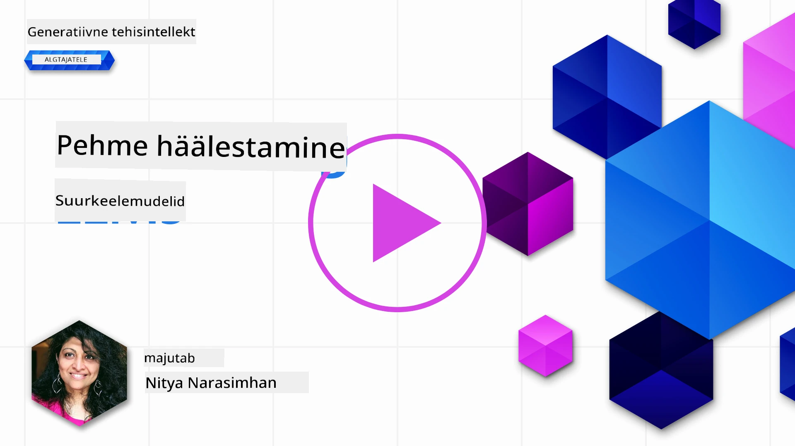
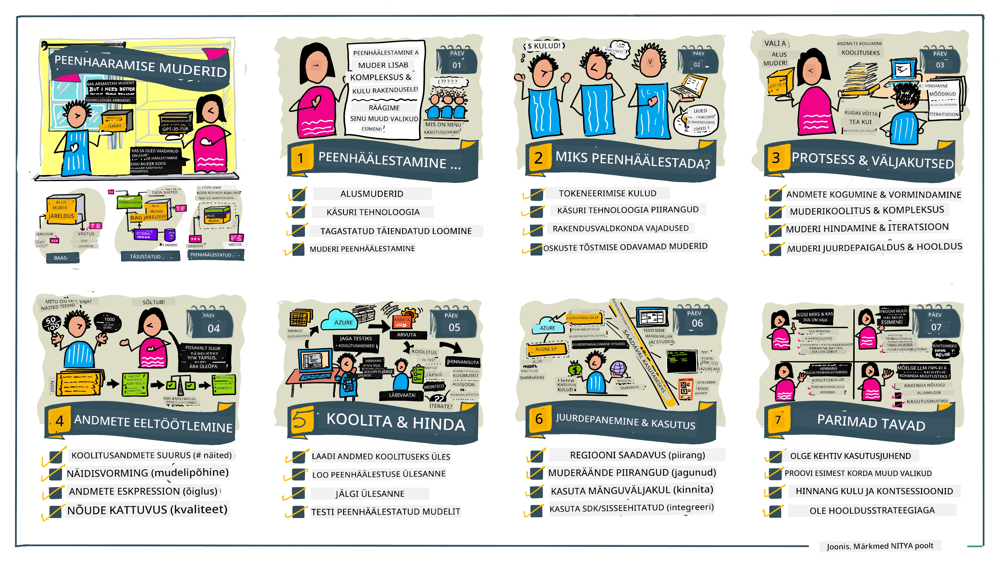

# Oma LLM-i täpsustamine

Suurte keelemodellide kasutamine generatiivsete tehisintellekti rakenduste loomiseks toob kaasa uusi väljakutseid. Üks peamisi küsimusi on tagada mudeli genereeritud sisu vastuste kvaliteet (täpsus ja asjakohasus) kasutaja konkreetse päringu kohta. Varasemates tundides käsitlesime tehnikaid nagu promptide konstrueerimine ja otsingu-lisatud genereerimine, mis püüavad probleemi lahendada _muutes olemasolevasse mudelisse sisestatavat prompti_.

Selles tänases tunnis arutleme kolmanda tehnika, **täpsustamise** üle, mis püüab lahendada väljakutset _mudeli endi ümberõppega_ täiendavate andmete abil. Sukeldume detailidesse.

## Õpieesmärgid

See tund tutvustab täpsustamise kontseptsiooni eelõpetatud keelemudelite puhul, uurib selle lähenemise eeliseid ja väljakutseid ning annab juhiseid, millal ja kuidas kasutada täpsustamist, et parandada oma generatiivsete tehisintellekti mudelite sooritust.

Tunni lõpus peaksid sa suutma vastata järgmistele küsimustele:

- Mis on keelemudelite täpsustamine?
- Millal ja miks on täpsustamine kasulik?
- Kuidas ma saan eelõpetatud mudelit täpsustada?
- Millised on täpsustamise piirangud?

Valmis? Alustame.

## Illustreeritud juhend

Tahad saada ülevaate sellest, mida me käsitleme, enne kui süveneda? Vaata seda illustreeritud juhendit, mis kirjeldab õppimise teekonda selle tunni jaoks – alates põhikontseptsioonide ja täpsustamise motivatsiooni õppimisest kuni protsessi ja parimate tavade mõistmiseni täpsustamise ülesande sooritamiseks. See on põnev uurimisvaldkond, nii et ära unusta vaadata [ressursside](./RESOURCES.md?WT.mc_id=academic-105485-koreyst) lehte, kust leiad lisalinke oma iseseisva õppe toetamiseks!

## Mis on keelemudelite täpsustamine?

Määratluse järgi on suured keelemudelid _eelõpetatud_ suurte tekstikogustega, mis pärinevad mitmesugustest allikatest, sealhulgas internetist. Nagu oleme varasemates tundides õppinud, vajame mudeli vastuste kvaliteedi parandamiseks kasutaja küsimustele ("promptidele") selliseid tehnikaid nagu _promptide konstrueerimine_ ja _otsingu-lisatud genereerimine_.

Populaarne promptide konstrueerimise tehnika on anda mudelile rohkem juhiseid selle kohta, mida vastuses oodatakse, kas siis _juhiste_ (selged juhised) või _mõne näite_ (kaudsed juhised) kaudu. Seda nimetatakse _väheste näideteõppeks_, kuid sellel on kaks piirangut:

- Mudeli tokenite limiidid võivad piirata näidete arvu, mida saab esitada, ja vähendada tõhusust.
- Mudeli tokeni kulud võivad muuta iga prompti näidetega täitmise kalliks ja piirata paindlikkust.

Täpsustamine on masinõppes tavaline praktika, kus võtame eelõpetatud mudeli ja õpime seda uuesti uute andmetega, et parandada selle sooritust konkreetse ülesande puhul. Keelemudelite kontekstis saame eelõpetatud mudelit täpsustada _valitud näidete komplektiga antud ülesande või rakendusvaldkonna jaoks_ ja luua **kohandatud mudeli**, mis võib olla selle spetsiifilise ülesande või valdkonna jaoks täpsem ja asjakohasem. Täpsustamise kõrvalnäht on see, et see võib vähendada väheste näidete vajadust – vähendades tokenite kasutust ja sellega seotud kulusid.

## Millal ja miks peaksime malle täpsustama?

Selles kontekstis, kui räägime täpsustamisest, viitame me **juhendatud** täpsustamisele, kus ümberõpe toimub, **lisades uusi andmeid**, mis ei olnud osa esialgsest treeningandmestikust. See erineb juhendamata täpsustamisest, kus mudelit uuesti õpitakse originaalandmestikul, kuid teistsuguste hüperparameetritega.

Oluline on meeles pidada, et täpsustamine on edasijõudnud tehnika, mis nõuab teatud tasemel ekspertiisi soovitud tulemuste saavutamiseks. Kui seda tehakse valesti, ei pruugi see anda oodatud paranemist ning võib isegi mudeli jõudlust sihitud valdkonnas halvendada.

Seega, enne kui õpid "kuidas" keelemudeleid täpsustada, pead teadma "miks" valida see tee ja "millal" alustada täpsustamise protsessi. Alusta nende küsimuste esitamisest:

- **Kasutusjuhtum**: Mis on sinu _kasutusjuhtum_ täpsustamiseks? Millist aspekti praegusest eelõpetatud mudelist soovid parandada?
- **Alternatiivid**: Kas oled proovinud _teisi tehnikaid_ soovitud tulemuste saavutamiseks? Kasuta neid enda võrdlusalusena.
  - Promptide konstrueerimine: Proovi tehnikaid nagu väheste näidete promptid asjakohaste vastustega. Hinda vastuste kvaliteeti.
  - Otsingu-lisatud genereerimine: Proovi promptide täiendamist päringu tulemustega, mis leiti su andmetest. Hinda vastuste kvaliteeti.
- **Kulud**: Kas oled määratlenud täpsustamise kulud?
  - Kohandatavus – kas eelõpetatud mudel on täpsustamiseks saadaval?
  - Pingutus – treeningandmete ettevalmistamine, mudeli hindamine ja täiendamine.
  - Arvutusressursid – täpsustamise tööde käivitamine ja täpsustatud mudeli juurutamine.
  - Andmed – piisava kvaliteediga näidete kättesaadavus täpsustamise mõjutamiseks.
- **Eelised**: Kas oled kinnitanud täpsustamise eelised?
  - Kvaliteet – kas täpsustatud mudel ületas baasmudelit?
  - Kulu – kas see vähendab tokenite kasutust lihtsustades promptide koostamist?
  - Laiendatavus – kas saad baasmudelit kasutada uutes valdkondades?

Vastates neile küsimustele, peaksid suutma otsustada, kas täpsustamine on sinu kasutusjuhtu jaoks õige lähenemine. Ideaalselt on see sobiv ainult siis, kui eelised kaaluvad üles kulud. Kui otsustad edasi minna, on aeg mõelda, _kuidas_ sa saad eelõpetatud mudelit täpsustada.

Tahan rohkem aru otsimisprotsessist? Vaata [Täpsustada või mitte täpsustada](https://www.youtube.com/watch?v=0Jo-z-MFxJs).

## Kuidas saame eelõpetatud mudelit täpsustada?

Eelõpetatud mudeli täpsustamiseks vajad:

- eelõpetatud mudelit täpsustamiseks
- andmekogumit täpsustamise jaoks
- treeningkeskkonda täpsustamise töö käivitamiseks
- hostimiskeskkonda täpsustatud mudeli juurutamiseks

## Täpsustamine praktikas

Järgnevad ressursid pakuvad samm-sammulisi õpetusi, mis juhendavad sind läbi reaalse näite valitud mudeli ja kureeritud andmekogumi kasutamisel. Neis juhendites töötamiseks vajad konkreetse teenusepakkuja kontot, samuti juurdepääsu vastavatele mudelitele ja andmekogudele.

| Teenusepakkuja | Õpetus                                                                                                                                                                       | Kirjeldus                                                                                                                                                                                                                                                                                                                                                                                                                        |
| -------------- | ---------------------------------------------------------------------------------------------------------------------------------------------------------------------------- | -------------------------------------------------------------------------------------------------------------------------------------------------------------------------------------------------------------------------------------------------------------------------------------------------------------------------------------------------------------------------------------------------------------------------------- |
| OpenAI         | [Kuidas täpsustada vestlusmudeleid](https://github.com/openai/openai-cookbook/blob/main/examples/How_to_finetune_chat_models.ipynb?WT.mc_id=academic-105485-koreyst)           | Õpi, kuidas täpsustada mudelit `gpt-35-turbo` konkreetse valdkonna ("retsepti assistent") jaoks, valmistades ette treeningandmed, käivitades täpsustamise ülesande ja kasutades täpsustatud mudelit päringute vastamiseks.                                                                                                                                                                                                         |
| Azure OpenAI   | [GPT 3.5 Turbo täpsustamise õpetus](https://learn.microsoft.com/azure/ai-services/openai/tutorials/fine-tune?tabs=python-new%2Ccommand-line&WT.mc_id=academic-105485-koreyst)   | Õpi, kuidas täpsustada mudelit `gpt-35-turbo-0613` **Azure platvormil**, luues ja üles laadides treeningandmeid, käivitades täpsustamise ülesande, ning siis juurutades ja kasutades uut mudelit.                                                                                                                                                                                                                                |
| Hugging Face   | [LLM-ide täpsustamine Hugging Face'iga](https://www.philschmid.de/fine-tune-llms-in-2024-with-trl?WT.mc_id=academic-105485-koreyst)                                          | See blogipostitus juhendab avatud keelemudeli (näiteks `CodeLlama 7B`) täpsustamist, kasutades [transformers](https://huggingface.co/docs/transformers/index?WT.mc_id=academic-105485-koreyst) raamatukogu ja [Transformer Reinforcement Learning (TRL)](https://huggingface.co/docs/trl/index?WT.mc_id=academic-105485-koreyst) ning avatud [andmekogusid](https://huggingface.co/docs/datasets/index?WT.mc_id=academic-105485-koreyst) Hugging Face platvormil. |
|                |                                                                                                                                                                              |                                                                                                                                                                                                                                                                                                                                                                                                                                  |
| 🤗 AutoTrain   | [LLM-ide täpsustamine AutoTrainiga](https://github.com/huggingface/autotrain-advanced/?WT.mc_id=academic-105485-koreyst)                                                      | AutoTrain (või AutoTrain Advanced) on Hugging Face’i python'i teek, mis võimaldab täpsustada mitmesuguste ülesannete jaoks, sealhulgas LLM täpsustamine. AutoTrain on mitteskriptitav lahendus, mille abil saab täpsustamist teha oma pilves, Hugging Face'i töölaual või lokaalselt. Toetab veebipõhist GUI-d, käsurealiidest ja treeningut yaml-konfiguratsioonifailide kaudu.                                                                  |
|                |                                                                                                                                                                              |                                                                                                                                                                                                                                                                                                                                                                                                                                  |
| 🦥 Unsloth     | [LLM-ide täpsustamine Unslothiga](https://github.com/unslothai/unsloth)                                                                                                     | Unsloth on avatud lähtekoodiga raamistik, mis toetab LLM täpsustamist ja tugevdamisõpet (RL). Unsloth lihtsustab lokaalset treeningut, hindamist ja juurutamist, pakkudes valmis [märkmeid](https://github.com/unslothai/notebooks). Toetab ka teksti kõneks (TTS), BERT ja multimodaalseid mudeleid. Alustamiseks loe nende samm-sammult [Täpsustamise juhendit LLM'idele](https://docs.unsloth.ai/get-started/fine-tuning-llms-guide).                                         |
|                |                                                                                                                                                                              |                                                                                                                                                                                                                                                                                                                                                                                                                                  |
## Kodune ülesanne

Vali üks ülaltoodud õpetustest ja käi see läbi. _Võime replitseerida nende õpetuste versiooni Jupyter Notebookides selles hoidlas ainult viitamiseks. Palun kasuta versioonide saamiseks otse originaalallikaid_.

## Suurepärane töö! Jätka õppimist.

Pärast selle tunni lõpetamist vaata meie [Generatiivse tehisintellekti õppimiskogu](https://aka.ms/genai-collection?WT.mc_id=academic-105485-koreyst), et jätkata oma generatiivse AI teadmiste täiendamist!

Palju õnne!! Sa oled lõpetanud selle kursuse v2 seeria viimase tunni! Ära lõpeta õppimist ja loomist. \*\*Vaata [RESSURSSE](RESOURCES.md?WT.mc_id=academic-105485-koreyst) lehte, kus on selle teema kohta lisasoovitused.

Meie v1 seeria tunde on samuti värskendatud rohkemate ülesannete ja mõistetega. Võta hetk oma teadmiste värskendamiseks – ja palun [jaga oma küsimusi ja tagasisidet](https://github.com/microsoft/generative-ai-for-beginners/issues?WT.mc_id=academic-105485-koreyst), et aidata meil neid tunde kogukonna jaoks parandada.

---

<!-- CO-OP TRANSLATOR DISCLAIMER START -->
**Vastutusest loobumine**:
See dokument on tõlgitud tehisintellekti tõlketeenuse [Co-op Translator](https://github.com/Azure/co-op-translator) abil. Kuigi me püüame täpsust, palun arvestage, et automaatsed tõlked võivad sisaldada vigu või ebatäpsusi. Originaaldokument oma algkeeles tuleks pidada autoriteetseks allikaks. Olulise teabe puhul soovitatakse kasutada professionaalset inimtõlget. Me ei vastuta selle tõlke kasutamisest tulenevate arusaamatuste või valesti mõistmiste eest.
<!-- CO-OP TRANSLATOR DISCLAIMER END -->