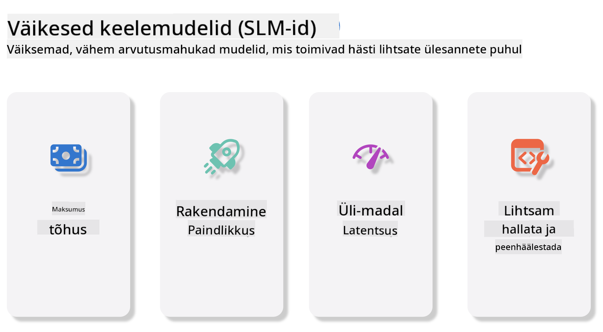
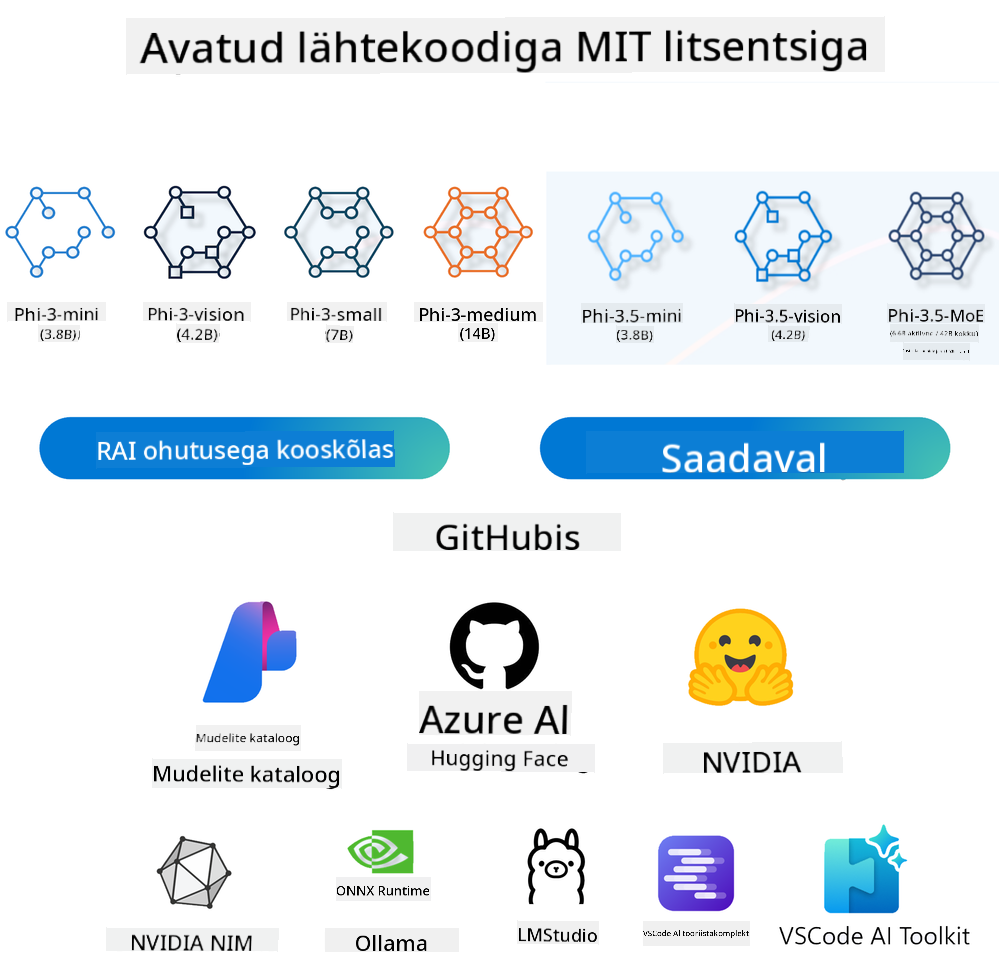

<!--
CO_OP_TRANSLATOR_METADATA:
{
  "original_hash": "124ad36cfe96f74038811b6e2bb93e9d",
  "translation_date": "2025-10-11T11:46:41+00:00",
  "source_file": "19-slm/README.md",
  "language_code": "et"
}
-->
# Sissejuhatus väikestesse keelemudelitesse generatiivse tehisintellekti jaoks algajatele
Generatiivne tehisintellekt on põnev tehisintellekti valdkond, mis keskendub süsteemide loomisele, mis suudavad genereerida uut sisu. See sisu võib ulatuda tekstist ja piltidest muusika ning isegi tervete virtuaalsete keskkondadeni. Üks põnevamaid generatiivse tehisintellekti rakendusi on keelemudelite valdkonnas.

## Mis on väikesed keelemudelid?

Väike keelemudel (SLM) esindab suure keelemudeli (LLM) vähendatud varianti, kasutades paljusid LLM-i arhitektuurilisi põhimõtteid ja tehnikaid, kuid oluliselt väiksema arvutusvõimsuse nõudega.

SLM-id on keelemudelite alamhulk, mis on loodud inimlaadse teksti genereerimiseks. Erinevalt suurematest mudelitest, nagu GPT-4, on SLM-id kompaktsemad ja tõhusamad, muutes need ideaalseks rakendusteks, kus arvutusressursid on piiratud. Vaatamata väiksemale suurusele suudavad nad siiski täita mitmesuguseid ülesandeid. Tavaliselt luuakse SLM-id LLM-ide tihendamise või destilleerimise teel, püüdes säilitada suure osa algse mudeli funktsionaalsusest ja keelelistest võimetest. Mudeli suuruse vähendamine vähendab üldist keerukust, muutes SLM-id tõhusamaks nii mälukasutuse kui ka arvutusnõuete osas. Vaatamata nendele optimeerimistele suudavad SLM-id täita mitmesuguseid loomuliku keele töötlemise (NLP) ülesandeid:

- Teksti genereerimine: Loogiliste ja konteksti arvestavate lausete või lõikude loomine.
- Teksti lõpetamine: Lausete ennustamine ja lõpetamine antud sisendi põhjal.
- Tõlkimine: Teksti tõlkimine ühest keelest teise.
- Kokkuvõtete loomine: Pikkade tekstide lühendamine ja lihtsamaks muutmine.

Kuigi nende jõudlus või arusaamise sügavus võib olla mõnevõrra piiratud võrreldes suuremate mudelitega.

## Kuidas väikesed keelemudelid töötavad?
SLM-e treenitakse tohutul hulgal tekstandmetel. Treeningu käigus õpivad nad keele mustreid ja struktuure, mis võimaldab neil genereerida grammatikaliselt korrektset ja konteksti arvestavat teksti. Treeningprotsess hõlmab:

- Andmete kogumine: Suurte tekstikogumite kogumine erinevatest allikatest.
- Eeltöötlus: Andmete puhastamine ja organiseerimine, et need sobiksid treenimiseks.
- Treenimine: Masinõppe algoritmide kasutamine mudeli õpetamiseks, kuidas teksti mõista ja genereerida.
- Peenhäälestus: Mudeli kohandamine, et parandada selle jõudlust konkreetsetes ülesannetes.

SLM-ide arendamine vastab kasvavale vajadusele mudelite järele, mida saab kasutada piiratud ressurssidega keskkondades, nagu mobiilseadmed või serva arvutusplatvormid, kus täismahus LLM-id võivad olla ebapraktilised nende suurte ressursinõuete tõttu. Tõhususele keskendudes tasakaalustavad SLM-id jõudlust ja kättesaadavust, võimaldades laiemat rakendust erinevates valdkondades.



## Õpieesmärgid

Selles õppetükis loodame tutvustada SLM-ide teadmisi ja kombineerida neid Microsoft Phi-3-ga, et õppida erinevaid tekstisisu, visiooni ja MoE (ekspertide segu) stsenaariume.

Õppetüki lõpuks peaksite olema võimeline vastama järgmistele küsimustele:

- Mis on SLM
- Mis on erinevus SLM-i ja LLM-i vahel
- Mis on Microsoft Phi-3/3.5 perekond
- Kuidas kasutada Microsoft Phi-3/3.5 perekonda

Valmis? Alustame.

## Suurte keelemudelite (LLM) ja väikeste keelemudelite (SLM) erinevused

Nii LLM-id kui ka SLM-id põhinevad tõenäosusliku masinõppe alustel, järgides sarnaseid lähenemisviise arhitektuuri kujunduses, treenimismeetodites, andmete genereerimisprotsessides ja mudelite hindamistehnikates. Siiski eristavad mitmed olulised tegurid neid kahte tüüpi mudeleid.

## Väikeste keelemudelite rakendused

SLM-idel on lai valik rakendusi, sealhulgas:

- Vestlusrobotid: Klienditoe pakkumine ja kasutajatega vestlemine.
- Sisuloome: Kirjanike abistamine ideede genereerimisel või isegi tervete artiklite koostamisel.
- Haridus: Õpilaste aitamine kirjutamisülesannete või uute keelte õppimisel.
- Juurdepääsetavus: Tööriistade loomine puuetega inimestele, näiteks teksti kõneks muundamise süsteemid.

**Suurus**

LLM-ide ja SLM-ide peamine erinevus seisneb mudelite mastaabis. LLM-id, nagu ChatGPT (GPT-4), võivad sisaldada hinnanguliselt 1,76 triljonit parameetrit, samas kui avatud lähtekoodiga SLM-id, nagu Mistral 7B, on loodud oluliselt väiksema parameetrite arvuga – umbes 7 miljardit. See erinevus tuleneb peamiselt mudeli arhitektuuri ja treenimisprotsesside erinevustest. Näiteks kasutab ChatGPT kodeerija-dekodeerija raamistiku sees enesekeskendumise mehhanismi, samas kui Mistral 7B kasutab libiseva akna keskendumist, mis võimaldab tõhusamat treenimist ainult dekodeerija mudelis. See arhitektuuriline erinevus avaldab sügavat mõju nende mudelite keerukusele ja jõudlusele.

**Arusaamine**

SLM-id on tavaliselt optimeeritud konkreetsete valdkondade jõudluse jaoks, muutes need väga spetsialiseeritud, kuid potentsiaalselt piiratud võimega pakkuda laialdast konteksti mõistmist mitmesugustes teadmiste valdkondades. Vastupidiselt sellele püüavad LLM-id simuleerida inimlaadset intelligentsust laiemal tasemel. Treenitud tohututel ja mitmekesistel andmekogumitel, on LLM-id loodud hästi toimima mitmesugustes valdkondades, pakkudes suuremat mitmekülgsust ja kohanemisvõimet. Seetõttu sobivad LLM-id paremini laiemaks valikuks järelülesannetes, nagu loomuliku keele töötlemine ja programmeerimine.

**Arvutusvõimsus**

LLM-ide treenimine ja kasutamine on ressursimahukad protsessid, mis nõuavad sageli märkimisväärset arvutustaristut, sealhulgas suuremahulisi GPU-klastreid. Näiteks mudeli nagu ChatGPT nullist treenimine võib nõuda tuhandeid GPU-sid pikema aja jooksul. Vastupidiselt sellele on SLM-id, millel on väiksem parameetrite arv, arvutusressursside osas kättesaadavamad. Mudelid nagu Mistral 7B saab treenida ja käitada kohalikel masinatel, millel on mõõdukas GPU võimekus, kuigi treenimine nõuab endiselt mitme GPU-ga mitmeid tunde.

**Eelarvamused**

Eelarvamused on LLM-ide teadaolev probleem, peamiselt treeningandmete olemuse tõttu. Need mudelid tuginevad sageli internetist saadud toorandmetele, mis võivad teatud rühmi alahinnata või valesti esitada, sisaldada ekslikke märgistusi või kajastada keelelisi eelarvamusi, mida mõjutavad murded, geograafilised variatsioonid ja grammatikareeglid. Lisaks võib LLM-ide arhitektuuride keerukus tahtmatult süvendada eelarvamusi, mis võivad jääda märkamatuks ilma hoolika peenhäälestuseta. Teisest küljest, SLM-id, mis on treenitud piiratud ja valdkonnaspetsiifilistel andmekogumitel, on loomulikult vähem vastuvõtlikud sellistele eelarvamustele, kuigi nad pole neist täiesti vabad.

**Järeldamine**

SLM-ide väiksem suurus annab neile märkimisväärse eelise järeldamise kiiruse osas, võimaldades neil tõhusalt genereerida väljundeid kohalikul riistvaral ilma ulatusliku paralleelse töötlemise vajaduseta. Vastupidiselt sellele vajavad LLM-id, nende suuruse ja keerukuse tõttu, sageli märkimisväärseid paralleelseid arvutusressursse, et saavutada vastuvõetavad järeldamise ajad. Mitme samaaegse kasutaja olemasolu aeglustab LLM-ide vastuseaegu veelgi, eriti kui neid kasutatakse suurel skaalal.

Kokkuvõttes, kuigi nii LLM-id kui ka SLM-id jagavad masinõppe alust, erinevad nad märkimisväärselt mudeli suuruse, ressursinõuete, konteksti mõistmise, eelarvamuste vastuvõtlikkuse ja järeldamise kiiruse osas. Need erinevused kajastavad nende sobivust erinevateks kasutusjuhtudeks, kus LLM-id on mitmekülgsemad, kuid ressursimahukad, ja SLM-id pakuvad valdkonnaspetsiifilist tõhusust väiksemate arvutusnõuetega.

***Märkus: Selles peatükis tutvustame SLM-i, kasutades Microsoft Phi-3 / 3.5 näitena.***

## Phi-3 / Phi-3.5 perekonna tutvustus

Phi-3 / 3.5 perekond keskendub peamiselt teksti, visiooni ja agentide (MoE) rakendusstsenaariumidele:

### Phi-3 / 3.5 Instruct

Peamiselt teksti genereerimiseks, vestluste lõpetamiseks ja sisuteabe eraldamiseks jne.

**Phi-3-mini**

3,8B keelemudel on saadaval Microsoft Azure AI Studios, Hugging Face'is ja Ollamas. Phi-3 mudelid ületavad oluliselt samas suuruses ja suuremaid keelemudeleid olulistel võrdlusnäitajatel (vt allpool võrdlusnäitajaid, suuremad numbrid on paremad). Phi-3-mini ületab kaks korda suuremaid mudeleid, samas kui Phi-3-small ja Phi-3-medium ületavad suuremaid mudeleid, sealhulgas GPT-3.5.

**Phi-3-small & medium**

Vaid 7B parameetritega Phi-3-small ületab GPT-3.5T mitmesugustel keele, loogika, kodeerimise ja matemaatika võrdlusnäitajatel.

Phi-3-medium, millel on 14B parameetrit, jätkab seda trendi ja ületab Gemini 1.0 Pro mudelit.

**Phi-3.5-mini**

Seda võib pidada Phi-3-mini täienduseks. Kuigi parameetrite arv jääb samaks, parandab see mitme keele toetamise võimet (toetab 20+ keelt: araabia, hiina, tšehhi, taani, hollandi, inglise, soome, prantsuse, saksa, heebrea, ungari, itaalia, jaapani, korea, norra, poola, portugali, vene, hispaania, rootsi, tai, türgi, ukraina) ja lisab tugevama pika konteksti toetuse.

Phi-3.5-mini, millel on 3,8B parameetrit, ületab samas suuruses keelemudeleid ja on võrdne kaks korda suuremate mudelitega.

### Phi-3 / 3.5 Vision

Phi-3/3.5 Instruct mudelit võib pidada Phi võimeks mõista, samas kui Vision annab Phile silmad maailma mõistmiseks.

**Phi-3-Vision**

Phi-3-vision, millel on vaid 4,2B parameetrit, jätkab seda trendi ja ületab suuremaid mudeleid, nagu Claude-3 Haiku ja Gemini 1.0 Pro V, üldistes visuaalse loogika ülesannetes, OCR-is ning tabelite ja diagrammide mõistmise ülesannetes.

**Phi-3.5-Vision**

Phi-3.5-Vision on samuti Phi-3-Visioni täienduseks, lisades mitme pildi toetuse. Seda võib pidada visiooni täiustuseks, mis võimaldab näha mitte ainult pilte, vaid ka videoid.

Phi-3.5-vision ületab suuremaid mudeleid, nagu Claude-3.5 Sonnet ja Gemini 1.5 Flash, OCR-i, tabelite ja diagrammide mõistmise ülesannetes ning on võrdne üldistes visuaalse teadmise loogika ülesannetes. Toetab mitme kaadri sisendit, st suudab teha loogikat mitme sisendpildi põhjal.

### Phi-3.5-MoE

***Ekspertide segu (MoE)*** võimaldab mudeleid treenida palju väiksema arvutusvõimsusega, mis tähendab, et saate mudeli või andmekogumi suurust dramaatiliselt suurendada sama arvutusressursi eelarvega kui tiheda mudeli puhul. Eelkõige peaks MoE mudel saavutama sama kvaliteedi kui selle tihe vaste palju kiiremini treenimise ajal.

Phi-3.5-MoE koosneb 16x3.8B eksperdimoodulist. Phi-3.5-MoE, millel on vaid 6,6B aktiivset parameetrit, saavutab sarnase taseme loogikas, keele mõistmises ja matemaatikas kui palju suuremad mudelid.

Me saame kasutada Phi-3/3.5 perekonna mudeleid erinevate stsenaariumide põhjal. Erinevalt LLM-ist saate Phi-3/3.5-mini või Phi-3/3.5-Visioni juurutada servaseadmetes.

## Kuidas kasutada Phi-3/3.5 perekonna mudeleid

Me loodame kasutada Phi-3/3.5 erinevates stsenaariumides. Järgmisena kasutame Phi-3/3.5 erinevate stsenaariumide põhjal.



### Järeldamise erinevus pilve API-de vahel

**GitHubi mudelid**

GitHubi mudelid on kõige otsesem viis. Saate kiiresti juurde pääseda Phi-3/3.5-Instruct mudelile GitHubi mudelite kaudu. Kombineerides Azure AI Inference SDK / OpenAI SDK-ga, saate API-le koodi kaudu juurde pääseda, et täita Phi-3/3.5-Instructi päring. Samuti saate testida erinevaid efekte Playgroundi kaudu.

- Demo: Phi-3-mini ja Phi-3.5-mini efektide võrdlus hiina keele stsenaariumides


**Azure AI Studio**

Kui soovime kasutada visiooni ja MoE mudeleid, saate kasutada Azure AI Studiot, et päringut täita. Kui olete huvitatud, saate lugeda Phi-3 Cookbooki, et õppida, kuidas kasutada Phi-3/3.5 Instruct, Vision, MoE Azure AI Studio kaudu [Klõpsake seda linki](https://github.com/microsoft/Phi-3CookBook/blob/main/md/02.QuickStart/AzureAIStudio_QuickStart.md?WT.mc_id=academic-105485-koreyst)

**NVIDIA NIM**

Lisaks pilvepõhistele mudelikataloogi lahendustele, mida pakuvad Azure ja GitHub, saate kasutada ka [NVIDIA NIM-i](https://developer.nvidia.com/nim?WT.mc_id=academic-105485-koreyst), et täita seotud päringuid. Saate külastada NVIDIA NIM-i, et täita Phi-3/3.5 perekonna API päringuid. NVIDIA NIM (NVIDIA Inference Microservices) on kiirendatud järeldamise mikroteenuste komplekt, mis on loodud aitama arendajatel AI-mudeleid tõhusalt juurutada erinevates keskkondades, sealhulgas pilvedes, andmekeskustes ja tööjaamades.

Siin on mõned NVIDIA NIM-i peamised omadused:

- **Lihtne juurutamine:** NIM võimaldab AI-mudelite juurutamist ühe käsuga, muutes selle integreerimise olemasolevatesse töövoogudesse lihtsaks.
- **Optimeeritud jõudlus:** See kasutab NVIDIA eeloptimeeritud järeldusmootoreid, nagu TensorRT ja TensorRT-LLM, et tagada madal latentsus ja kõrge läbilaskevõime.
- **Mastaapsus:** NIM toetab Kubernetesil põhinevat automaatset mastaapsust, võimaldades tõhusalt toime tulla erine
- **Turvalisus ja kontroll:** Organisatsioonid saavad hoida oma andmete ja rakenduste üle kontrolli, majutades NIM mikroteenuseid oma hallataval infrastruktuuril.
- **Standardiseeritud API-d:** NIM pakub tööstusstandardi API-sid, mis muudavad AI-rakenduste, nagu vestlusrobotid, AI-assistendid ja palju muud, loomise ja integreerimise lihtsaks.

NIM on osa NVIDIA AI Enterprise'ist, mille eesmärk on lihtsustada AI mudelite juurutamist ja operatsionaliseerimist, tagades nende tõhusa toimimise NVIDIA GPU-del.

- Demo: Nividia NIM-i kasutamine Phi-3.5-Vision-API kutsumiseks [[Klõpsa siia lingile](./python/Phi-3-Vision-Nividia-NIM.ipynb?WT.mc_id=academic-105485-koreyst)]


### Phi-3/3.5 järeldamine kohalikus keskkonnas
Järeldamine Phi-3 või mis tahes keelemudeli, nagu GPT-3, puhul viitab protsessile, kus mudel genereerib vastuseid või ennustusi saadud sisendi põhjal. Kui esitate Phi-3-le küsimuse või juhise, kasutab see oma treenitud närvivõrku, et tuvastada kõige tõenäolisem ja asjakohasem vastus, analüüsides treeningandmetes esinevaid mustreid ja seoseid.

**Hugging Face Transformer**
Hugging Face Transformers on võimas teek, mis on loodud loomuliku keele töötlemiseks (NLP) ja muude masinõppe ülesannete jaoks. Siin on mõned olulised punktid selle kohta:

1. **Eeltreenitud mudelid**: Teek pakub tuhandeid eeltreenitud mudeleid, mida saab kasutada erinevate ülesannete jaoks, nagu teksti klassifitseerimine, nimede tuvastamine, küsimustele vastamine, kokkuvõtete loomine, tõlkimine ja teksti genereerimine.

2. **Raamistike ühilduvus**: Teek toetab mitmeid süvaõppe raamistikke, sealhulgas PyTorch, TensorFlow ja JAX. See võimaldab treenida mudelit ühes raamistikus ja kasutada seda teises.

3. **Multimodaalsed võimalused**: Lisaks NLP-le toetab Hugging Face Transformers ka ülesandeid arvutinägemises (nt pildiklassifikatsioon, objektide tuvastamine) ja helitöötluses (nt kõnetuvastus, heliklassifikatsioon).

4. **Lihtne kasutada**: Teek pakub API-sid ja tööriistu mudelite hõlpsaks allalaadimiseks ja peenhäälestamiseks, muutes selle kättesaadavaks nii algajatele kui ka ekspertidele.

5. **Kogukond ja ressursid**: Hugging Face'il on elav kogukond ning ulatuslik dokumentatsioon, õpetused ja juhendid, mis aitavad kasutajatel alustada ja teeki maksimaalselt ära kasutada.
[ametlik dokumentatsioon](https://huggingface.co/docs/transformers/index?WT.mc_id=academic-105485-koreyst) või nende [GitHubi repositoorium](https://github.com/huggingface/transformers?WT.mc_id=academic-105485-koreyst).

See on kõige sagedamini kasutatav meetod, kuid see nõuab ka GPU kiirendust. Nägemise ja MoE (Mixture of Experts) stseenid vajavad palju arvutusi, mis CPU-l oleksid väga piiratud, kui neid ei kvantiseerita.


- Demo: Transformeri kasutamine Phi-3.5-Instucti kutsumiseks [Klõpsa siia lingile](./python/phi35-instruct-demo.ipynb?WT.mc_id=academic-105485-koreyst)

- Demo: Transformeri kasutamine Phi-3.5-Visioni kutsumiseks [Klõpsa siia lingile](./python/phi35-vision-demo.ipynb?WT.mc_id=academic-105485-koreyst)

- Demo: Transformeri kasutamine Phi-3.5-MoE kutsumiseks [Klõpsa siia lingile](./python/phi35_moe_demo.ipynb?WT.mc_id=academic-105485-koreyst)

**Ollama**
[Ollama](https://ollama.com/?WT.mc_id=academic-105485-koreyst) on platvorm, mis on loodud selleks, et lihtsustada suurte keelemudelite (LLM) lokaalset käitamist teie arvutis. See toetab erinevaid mudeleid, nagu Llama 3.1, Phi 3, Mistral ja Gemma 2, teiste hulgas. Platvorm lihtsustab protsessi, koondades mudeli kaalud, konfiguratsiooni ja andmed ühte paketti, muutes kasutajatele lihtsamaks mudelite kohandamise ja loomise. Ollama on saadaval macOS-i, Linuxi ja Windowsi jaoks. See on suurepärane tööriist, kui soovite katsetada või juurutada LLM-e ilma pilveteenuseid kasutamata. Ollama on kõige otsem tee – peate lihtsalt täitma järgmise käsu.

```bash

ollama run phi3.5

```


**ONNX Runtime for GenAI**

[ONNX Runtime](https://github.com/microsoft/onnxruntime-genai?WT.mc_id=academic-105485-koreyst) on platvormidevaheline masinõppe kiirendi, mis toetab nii järeldamist kui ka treenimist. ONNX Runtime for Generative AI (GENAI) on võimas tööriist, mis aitab generatiivseid AI-mudeleid tõhusalt käitada erinevatel platvormidel. 

## Mis on ONNX Runtime?
ONNX Runtime on avatud lähtekoodiga projekt, mis võimaldab masinõppe mudelite kõrge jõudlusega järeldamist. See toetab Open Neural Network Exchange (ONNX) formaadis mudeleid, mis on standard masinõppe mudelite esitamiseks. ONNX Runtime'i järeldamine võimaldab kiiremaid kliendikogemusi ja madalamaid kulusid, toetades mudeleid süvaõppe raamistikest nagu PyTorch ja TensorFlow/Keras ning klassikalistest masinõppe teekidest nagu scikit-learn, LightGBM, XGBoost jne. ONNX Runtime ühildub erinevate riistvara, draiverite ja operatsioonisüsteemidega ning pakub optimaalset jõudlust, kasutades riistvarakiirendeid seal, kus see on võimalik, koos graafiku optimeerimiste ja teisendustega.

## Mis on generatiivne AI?
Generatiivne AI viitab AI-süsteemidele, mis suudavad luua uut sisu, nagu tekst, pildid või muusika, tuginedes andmetele, millel nad on treenitud. Näited hõlmavad keelemudeleid nagu GPT-3 ja pildigeneratsiooni mudeleid nagu Stable Diffusion. ONNX Runtime for GenAI teek pakub generatiivse AI tsüklit ONNX-mudelite jaoks, sealhulgas järeldamist ONNX Runtime'iga, logitite töötlemist, otsingut ja proovivõtmist ning KV vahemälu haldamist.

## ONNX Runtime for GENAI
ONNX Runtime for GENAI laiendab ONNX Runtime'i võimalusi, et toetada generatiivseid AI-mudeleid. Siin on mõned olulised omadused:

- **Lai platvormi tugi:** See töötab erinevatel platvormidel, sealhulgas Windows, Linux, macOS, Android ja iOS.
- **Mudelite tugi:** See toetab paljusid populaarseid generatiivseid AI-mudeleid, nagu LLaMA, GPT-Neo, BLOOM ja teised.
- **Jõudluse optimeerimine:** See sisaldab optimeerimisi erinevate riistvarakiirendite jaoks, nagu NVIDIA GPU-d, AMD GPU-d ja teised.
- **Lihtne kasutada:** See pakub API-sid rakendustesse hõlpsaks integreerimiseks, võimaldades teksti, piltide ja muu sisu genereerimist minimaalse koodiga.
- Kasutajad saavad kutsuda kõrgetasemelist generate() meetodit või käitada mudeli iga iteratsiooni tsüklis, genereerides ühe tokeni korraga ja vajadusel tsükli sees genereerimisparameetreid uuendades.
- ONNX Runtime toetab ka ahne/kiire otsingut ja TopP, TopK proovivõtmist tokenite järjestuste genereerimiseks ning sisseehitatud logitite töötlemist, nagu korduse karistused. Samuti saate hõlpsalt lisada kohandatud hindamist.

## Alustamine
ONNX Runtime for GENAI kasutamise alustamiseks saate järgida järgmisi samme:

### Installige ONNX Runtime:
```Python
pip install onnxruntime
```
### Installige generatiivse AI laiendused:
```Python
pip install onnxruntime-genai
```

### Käivitage mudel: Siin on lihtne näide Pythonis:
```Python
import onnxruntime_genai as og

model = og.Model('path_to_your_model.onnx')

tokenizer = og.Tokenizer(model)

input_text = "Hello, how are you?"

input_tokens = tokenizer.encode(input_text)

output_tokens = model.generate(input_tokens)

output_text = tokenizer.decode(output_tokens)

print(output_text) 
```
### Demo: ONNX Runtime GenAI kasutamine Phi-3.5-Visioni kutsumiseks

```python

import onnxruntime_genai as og

model_path = './Your Phi-3.5-vision-instruct ONNX Path'

img_path = './Your Image Path'

model = og.Model(model_path)

processor = model.create_multimodal_processor()

tokenizer_stream = processor.create_stream()

text = "Your Prompt"

prompt = "<|user|>\n"

prompt += "<|image_1|>\n"

prompt += f"{text}<|end|>\n"

prompt += "<|assistant|>\n"

image = og.Images.open(img_path)

inputs = processor(prompt, images=image)

params = og.GeneratorParams(model)

params.set_inputs(inputs)

params.set_search_options(max_length=3072)

generator = og.Generator(model, params)

while not generator.is_done():

    generator.compute_logits()
    
    generator.generate_next_token()

    new_token = generator.get_next_tokens()[0]
    
    code += tokenizer_stream.decode(new_token)
    
    print(tokenizer_stream.decode(new_token), end='', flush=True)

```


**Muud meetodid**

Lisaks ONNX Runtime'ile ja Ollama viitemeetoditele saame viidata kvantitatiivsetele mudelitele, kasutades erinevate tootjate pakutud mudelite viitemeetodeid. Näiteks Apple MLX raamistik Apple Metaliga, Qualcomm QNN NPU-ga, Intel OpenVINO CPU/GPU-ga jne. Rohkem sisu leiate [Phi-3 Cookbookist](https://github.com/microsoft/phi-3cookbook?WT.mc_id=academic-105485-koreyst).


## Rohkem

Oleme õppinud Phi-3/3.5 perekonna põhialuseid, kuid SLM-i (suure keelemudeli) kohta rohkem teada saamiseks vajame täiendavaid teadmisi. Vastused leiate Phi-3 Cookbookist. Kui soovite rohkem teada saada, külastage [Phi-3 Cookbooki](https://github.com/microsoft/phi-3cookbook?WT.mc_id=academic-105485-koreyst).

---

**Lahtiütlus**:  
See dokument on tõlgitud AI tõlketeenuse [Co-op Translator](https://github.com/Azure/co-op-translator) abil. Kuigi püüame tagada täpsust, palume arvestada, et automaatsed tõlked võivad sisaldada vigu või ebatäpsusi. Algne dokument selle algses keeles tuleks pidada autoriteetseks allikaks. Olulise teabe puhul soovitame kasutada professionaalset inimtõlget. Me ei vastuta selle tõlke kasutamisest tulenevate arusaamatuste või valesti tõlgenduste eest.