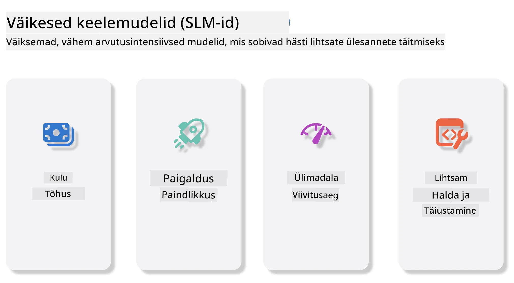
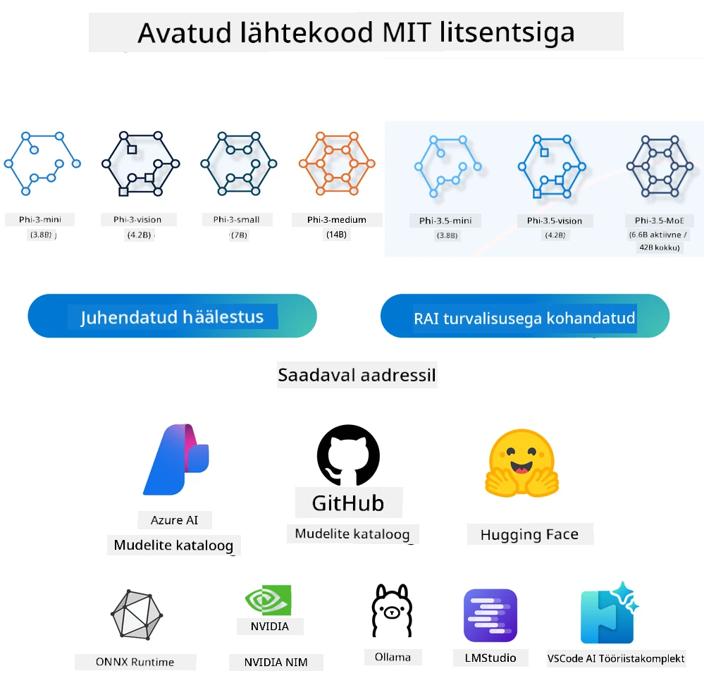
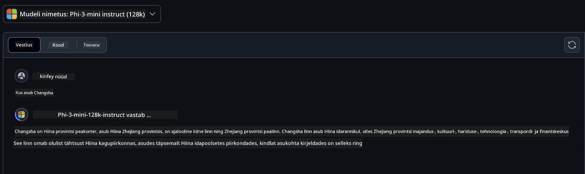
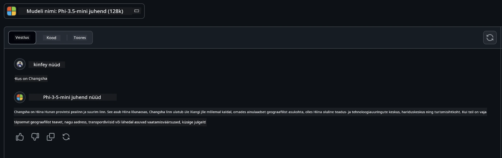

# Sissejuhatus väikestesse keelemudelitesse generatiivses tehisintellektis algajatele
Generatiivne tehisintellekt on põnev tehisintellekti valdkond, mis keskendub süsteemide loomisele, mis suudavad genereerida uut sisu. See sisu võib ulatuda tekstist ja piltidest muusika ja isegi täielike virtuaalkeskkondadeni. Üks põnevamaid generatiivse tehisintellekti rakendusi on keelemudelite valdkond.

## Mis on väiksed keelemudelid?

Väike keelemudel (SLM) on suures keelemudelis (LLM) põhinev vähendatud variant, mis kasutab paljusid LLM-ide arhitektuurilisi põhimõtteid ja tehnikaid, kuid näitab oluliselt väiksemat arvutusjälge.

SLMid on keelemudelite alamkomplekt, mis on loodud inimkeelse sarnase teksti genereerimiseks. Erinevalt suurematest mudelitest, nagu GPT-4, on SLMid kompaktsemad ja tõhusamad, mis teeb need ideaalseks rakendusteks, kus arvutusressursid on piiratud. Hoolimata oma väiksemast suurusest võivad nad ikkagi täita mitmesuguseid ülesandeid. Tavaliselt ehitatakse SLMid läbi LLM-ide kokkusurumise või destilleerimise, eesmärgiga säilitada märkimisväärne osa algse mudeli funktsionaalsusest ja keelelistest võimetest. Selle mudeli suuruse vähendamine vähendab üldist keerukust, muutes SLMid mälukasutuse ja arvutusnõuete poolest tõhusamaks. Hoolimata neist optimeerimistest suudavad SLMid endiselt täita mitmesuguseid loomuliku keele töötlemise (NLP) ülesandeid:

- Tekstigeneratsioon: sidusate ja kontekstuaalselt asjakohaste lause- või lõikude loomine.
- Teksti lõpetamine: lausete ennustamine ja lõpetamine antud vihje põhjal.
- Tõlge: teksti teisendamine ühest keelest teise.
- Kokkuvõte: pikema teksti lühendamine arusaadavamateks kokkuvõteteks.

Kuigi mõningate kompromissidega soorituses või mõistmise sügavuses võrreldes suuremate mudelitega.

## Kuidas väiksed keelemudelid töötavad?
SLMid on treenitud tohutul hulgal tekstandmetel. Treeningu käigus õpivad nad keele mustreid ja struktuure, võimaldades neil genereerida teksti, mis on nii grammatiliselt korrektne kui ka kontekstuaalselt sobiv. Treeninguprotsess hõlmab:

- Andmete kogumine: suurte tekstikogumite kogumine erinevatest allikatest.
- Eeltöötlus: andmete puhastamine ja organiseerimine, et muuta need sobivaks treenimiseks.
- Treening: masinõppe algoritmide kasutamine, et õpetada mudelit teksti mõistma ja genereerima.
- Täpsustamine: mudeli kohandamine, et parandada selle sooritust konkreetsetel ülesannetel.

SLMide väljatöötamine on kooskõlas kasvava vajadusega mudelite järele, mida saab juurutada ressursipiiratud keskkondades, näiteks mobiilseadmetes või äärelt arvutamise platvormidel, kus täissuuruses LLMid võivad olla praktiliselt liiga ressursimahukad. Keskendudes tõhususele, tasakaalustavad SLMid soorituse ja juurdepääsetavuse, võimaldades laiemat kasutust erinevates valdkondades.



## Õpieesmärgid

Selles õppetükis loodame tutvustada SLM teadmisi ning kombineerida neid Microsoft Phi-3-ga, et õppida erinevaid stsenaariume tekstisisu, nägemise ja MoE osas.

Selle õppetüki lõpuks peaksid saama vastata järgmistele küsimustele:

- Mis on SLM?
- Mis vahe on SLM-il ja LLM-il?
- Mis on Microsoft Phi-3/3.5 perekond?
- Kuidas teha järeldusi Microsoft Phi-3/3.5 perekonnaga?

Valmis? Alustame.

## Suured keelemudelid (LLMid) ja väikesed keelemudelid (SLMid) – erinevused

Nii LLMid kui ka SLMid põhinevad tõenäosusliku masinõppe alustel, järgides sarnaseid lähenemisi arhitektuuris, treeningmetoodikates, andmete genereerimise protsessides ja mudeli hindamises. Kuid mitu olulist tegurit eristavad neid kahte mudelitüüpi.

## Väikeste keelemudelite rakendused

SLMid leiavad laialdast kasutust, sealhulgas:

- Vestlusrobotid: klienditoe pakkumine ja kasutajatega vestluse pidamine.
- Sisuloomine: kirjutajate abistamine ideede genereerimisel või isegi terve artikli koostamisel.
- Haridus: õpilaste toetamine kirjutamisülesannete ja uute keelte õppimisel.
- Juurdepääsetavus: tööriistade loomine erivajadustega inimestele, näiteks teksti kõneks süsteemid.

**Suurus**

Peamine erinevus LLMide ja SLMide vahel on mudelite suuruses. LLMid nagu ChatGPT (GPT-4) võivad koosneda hinnanguliselt 1,76 triljonist parameetrist, samas kui avatud lähtekoodiga SLMid nagu Mistral 7B on loodud oluliselt vähemate parameetritega—ligikaudu 7 miljardit. See erinevus tuleneb peamiselt mudeli arhitektuuri ja treeninguprotsesside erinevustest. Näiteks kasutab ChatGPT encoder-decoder raamistikus iseteenindavat tähelepanumehhanismi, kuid Mistral 7B kasutab liugklaasi tähelepanu, mis võimaldab tõhusamat treeningut decoder-only mudelis. See arhitektuuriline erinevus mõjutab oluliselt mudelite keerukust ja jõudlust.

**Mõistmine**

SLMid on tavaliselt optimeeritud tööks kindlates valdkondades, muutes need väga spetsialiseerituks, kuid potentsiaalselt piiratud nende võimega pakkuda laiahaardelist kontekstuaalset mõistmist. Vastupidiselt püüdlevad LLMid inimesele sarnase intelligentsuse simuleerimise poole laiemal tasemel. Treenitud tohututel ja mitmekesistel andmestikel, on LLMid mõeldud hästi toimima erinevates valdkondades, pakkudes suuremat mitmekülgsust ja kohanemisvõimet. Seetõttu sobivad LLMid paremini laiemale hulgale ülesannetele, nagu loomuliku keele töötlemine ja programmeerimine.

**Arvutus**

LLMide treening ja juurutamine on ressursimahukad protsessid, mis sageli nõuavad märkimisväärset arvutusinfrastruktuuri, sealhulgas suurte GPU klastrite kasutamist. Näiteks mudeli nagu ChatGPT nullist treenimiseks võib vaja minna tuhandeid GPU-sid pikaaegseteks perioodideks. Vastupidiselt on SLMid oma väiksema parameetritearvuga arvutusressursside poolest paremini kättesaadavad. Mudelid nagu Mistral 7B saab treenida ja käivitada lokaalses masinas, millel on mõõdukas GPU võimekus, kuigi treening nõuab ikka mitmetunnist tööd mitme GPU vahel.

**Eelarvamus**

LLMidel on tuntud probleem eelarvamusega, mis tuleneb suuresti treeningandmete olemusest. Need mudelid baseeruvad sageli veebist saadud avatud ja töötlemata andmetel, mis võivad alatähtsustada või moonutada mõningaid gruppe, lisada vale märgistusi või peegeldada keelelisi eelarvamusi, mis mõjutavad dialekti, geograafilisi variatsioone ja grammatikareegleid. Lisaks võib keeruline LLMide arhitektuur tahtmatult eelarvamust tugevamaks muuta, mis võib jääda tähelepanuta ilma hoolika täpsustamiseta. SLMid, mis on treenitud piiratumate ja valdkonnapõhiste andmestikega, on loomupäraselt vähem eelarvamustele vastuvõtlikud, kuigi sellest hoolimata pole nad neist täiesti vabastatud.

**Järeldamine**

SLMide vähendatud suurus annab neile olulise eelise järeldamiskiiruses, võimaldades neil toodangut efektiivselt genereerida lokaalsel riistvaral ilma laialdase paralleelprotsessita. LLMid nõuavad oma suuruse ja keerukuse tõttu sageli märkimisväärseid paralleelse arvutuse ressursse vastuvõetavate järeldamisaja saavutamiseks. Paljude samaaegsete kasutajate olemasolu aeglustab LLMide reageerimisaegu veelgi, eriti kui neid töödeldakse suurel skaalal.

Kokkuvõttes, kuigi nii LLMid kui ka SLMid jagavad masinõppe alustel, erinevad need oluliselt mudeli suuruse, ressursside nõuete, kontekstuaalse mõistmise, eelarvamuste esinemise ja järeldamiskiiruse poolest. Need erinevused kajastavad nende sobivust erinevateks kasutusteks, kus LLMid on mitmekülgsemad kuid ressursimahukamad ning SLMid pakuvad spetsiifilisemat tõhusust vähendatud arvutusnõuetega.

***Märkus: selles õppetükis tutvustame SLMi Microsoft Phi-3 / 3.5 näitel.***

## Phi-3 / Phi-3.5 perekonna tutvustus

Phi-3 / 3.5 perekond keskendub peamiselt tekstile, nägemisele ja Agent (MoE) rakendusstsenaariumidele:

### Phi-3 / 3.5 juhendamine

Peamiselt teksti genereerimiseks, vestluste lõpetamiseks ja sisulise teabe väljavõtmiseks jne.

**Phi-3-mini**

3.8 miljardi parameetriga keelemudel on saadaval Microsoft Azure AI Studios, Hugging Face’is ja Ollamas. Phi-3 mudelid ületavad oluliselt võrdse või suurema suurusega keelemudeleid peamistes võrdlustestides (vt allpool tulemuste numbreid, suuremad on paremad). Phi-3-mini ületab poolteist korda suuremaid mudeleid, samas kui Phi-3-small ja Phi-3-medium ületavad suuremaid mudeleid, sealhulgas GPT-3.5.

**Phi-3-small & medium**

Vaid 7 miljardi parameetriga lööb Phi-3-small GPT-3.5T mitmetes keele, arutluse, kodeerimise ja matemaatika võrdlustes.

Phi-3-medium, 14 miljardi parameetriga, jätkab seda trende ja ületab Gemini 1.0 Pro mudeli.

**Phi-3.5-mini**

Võib vaadelda kui Phi-3-mini uuendust. Kuigi parameetrite arv jääb samaks, paraneb võimekus toetada mitut keelt (toetab 20+ keelt: araabia, hiina, tšehhi, taani, hollandi, inglise, soome, prantsuse, saksa, heebrea, ungari, itaalia, jaapani, korea, norra, poola, portugali, vene, hispaania, rootsi, tai, türgi, ukraina) ning lisandub tugevam tugi pikale kontekstile.

Phi-3.5-mini 3.8 miljardil parameetril ületab sama suurusega keelemudeleid ja on võrreldav mudelitega, mis on poolteist korda suuremad.

### Phi-3 / 3.5 nägemine

Võime mõelda, et Phi-3/3.5 juhendatud mudel näitab Phi võimet mõista ning Vision annab Phile silmad maailma mõistmiseks.

**Phi-3-Vision**

Phi-3-vision, millel on vaid 4.2 miljardit parameetrit, jätkab edu ja ületab suuremaid mudeleid nagu Claude-3 Haiku ja Gemini 1.0 Pro V üldiste visuaalsete arutlusülesannete, OCRi ning tabelite ja diagrammide mõistmise ülesannetes.

**Phi-3.5-Vision**

Phi-3.5-Vision on samuti uuendus Phi-3-Vision'ist, lisades toetuse mitmele pildile. Seda võib vaadelda kui nägemise täiustamist — nüüd suudab näha lisaks piltidele ka videoid.

Phi-3.5-vision ületab suuremaid mudeleid nagu Claude-3.5 Sonnet ja Gemini 1.5 Flash OCR-i, tabelite ja diagrammide mõistmise ülesannetes ning on võrdne üldiste visuaalsete teadmiste arutlusülesannetes. Toetab mitme kaadri sisendit, st mitme sisendpildi arutlusi.

### Phi-3.5-MoE

***Ekspertide segu (MoE)*** võimaldab mudelitel eeltreenida palju väiksema arvutusmahuga, mis tähendab, et mudelit või andmestikku saab samal arvutusressursside eelarvel oluliselt suuremaks skaleerida. Täpsemalt peaks MoE mudel saavutama sama kvaliteedi kui selle tihe vaste palju kiiremini eeltreeningu jooksul.

Phi-3.5-MoE koosneb 16x3.8B ekspertmoduulist. Phi-3.5-MoE, millel on vaid 6.6 miljardit aktiivset parameetrit, saavutab sarnase taseme arutluses, keele mõistmises ja matemaatikas nagu palju suuremad mudelid.

Saame kasutada Phi-3/3.5 perekonna mudeleid erinevate stsenaariumite põhjal. Erinevalt LLM-st saab Phi-3/3.5-mini või Phi-3/3.5-Vision kasutada ääreseadmetel.

## Kuidas kasutada Phi-3/3.5 perekonna mudeleid

Loodame kasutada Phi-3/3.5 erinevates stsenaariumites. Järgmisena kasutame Phi-3/3.5 erinevatel juhtudel.



### Järeldamine pilve API-de kaudu

**GitHub Mudelid**

GitHub Mudelid on kõige otsesem viis. Saate kiiresti juurde pääseda Phi-3/3.5-Juhendatud mudelile GitHubi kaudu. Koos Azure AI Järeldamise SDK / OpenAI SDK-ga saate API-le juurdepääsu läbi koodi, et teha Phi-3/3.5-Juhendatud mudeli päringuid. Samuti saate proovida erinevaid tulemusi Playgroundi kaudu.

- Demo: Phi-3-mini ja Phi-3.5-mini võrdlus hiina keele stsenaariumites





**Azure AI Studio**

Kui soovite kasutada nägemise ja MoE mudeleid, saate kasutada Azure AI Studio’t päringute tegemiseks. Kui olete huvitatud, võite lugeda Phi-3 Retsepti, et õppida, kuidas kutsuda Phi-3/3.5 Juhendatud, Vision, MoE mudeleid Azure AI Studio kaudu [Klõpsa siin](https://github.com/microsoft/Phi-3CookBook/blob/main/md/02.QuickStart/AzureAIStudio_QuickStart.md?WT.mc_id=academic-105485-koreyst)

**NVIDIA NIM**

Lisaks pilvepõhistele Mudelikataloogide lahendustele, mida pakuvad Azure ja GitHub, saate kasutada ka [NVIDIA NIM](https://developer.nvidia.com/nim?WT.mc_id=academic-105485-koreyst) seotud päringute tegemiseks. Külastage NVIDIA NIM-i, et teha Phi-3/3.5 perekonna API päringuid. NVIDIA NIM (NVIDIA Järelduste Mikroteenused) on kiirendatud järeldusmikroteenuste komplekt, mis aitab arendajatel tõhusalt AI mudeleid eri keskkondades nagu pilvedes, andmekeskustes ja töölaual juurutada.

Siin on mõned NVIDIA NIM-i peamised omadused:
- **Paigaldamise lihtsus:** NIM võimaldab AI mudelite paigaldamist ühe käsuga, mis teeb selle lihtsaks olemasolevatesse töövoogudesse integreerimiseks.  
- **Optimeeritud jõudlus:** Kasutab NVIDIA eeloptimeeritud järeldusmootoreid, nagu TensorRT ja TensorRT-LLM, et tagada madal latentsusaeg ja kõrge läbilaskevõime.  
- **Skaalautuvus:** NIM toetab Kubernetesel automaatne skaaleerimist, võimaldades tõhusalt toime tulla erinevate töökoormustega.  
- **Turvalisus ja kontroll:** Organisatsioonid saavad hoida oma andmeid ja rakendusi kontrolli all, majutades NIM mikroteenuseid oma hallatud infrastruktuuris.  
- **Standard API-d:** NIM pakub tööstusharu standardseid API-sid, muutes AI rakenduste nagu juturobotite, AI abistajate jms ehitamise ja integreerimise lihtsaks.

NIM on osa NVIDIA AI Enterprisest, mille eesmärk on lihtsustada AI mudelite paigaldamist ja kasutuselevõttu, tagades nende tõhusa töö NVIDIA GPUdel.

- Demo: NVIDIA NIM kasutamine Phi-3.5-Vision-API kutsumiseks [[Klikka siia](./python/Phi-3-Vision-Nividia-NIM.ipynb?WT.mc_id=academic-105485-koreyst)]


### Phi-3/3.5 lokaalne käitamine
Järeldus (inference) seoses Phi-3 või mõne muu keeltemudeliga nagu GPT-3 tähendab vastuste või ennustuste genereerimise protsessi sisendi põhjal. Kui esitate Phi-3-le käsu või küsimuse, kasutab ta oma treenitud närvivõrku kõige tõenäolisema ja asjakohasema vastuse järeldamiseks, analüüsides treeningandmetes esinevaid mustreid ja seoseid.

**Hugging Face Transformer**  
Hugging Face Transformers on võimas teek loomuliku keele töötlemiseks (NLP) ja muude masinõppe ülesannete jaoks. Siin on mõned olulisemad punktid:

1. **Eeltreenitud mudelid:** Pakub tuhandeid eeltreenitud mudeleid eri ülesannete jaoks nagu teksti klassifitseerimine, nimetatud üksuste tuvastamine, küsimustele vastamine, kokkuvõtete tegemine, tõlkimine ja teksti genereerimine.

2. **Raamistike ühilduvus:** Toetab mitut süvaõppe raamistiku, näiteks PyTorchi, TensorFlow ja JAXi. See võimaldab mudelit treenida ühes raamistikus ja kasutada teises.

3. **Multimodaalsed võimed:** Lisaks NLP-le toetab ka pilditöötluse ülesandeid (nt pildi klassifitseerimine, objektituvastus) ja heli töötlemist (nt kõnetuvastus, heli klassifitseerimine).

4. **Lihtne kasutamine:** Pakub API-sid ja tööriistu mudelite allalaadimiseks ja häälestamiseks, muutes selle nii algajatele kui ka ekspertidele ligipääsetavaks.

5. **Kogukond ja ressursid:** Hugging Face’l on aktiivne kogukond ning ulatuslik dokumentatsioon, juhendid ja õppevahendid, mis aitavad kasutajatel teeki kasutada.

[ametlik dokumentatsioon](https://huggingface.co/docs/transformers/index?WT.mc_id=academic-105485-koreyst) või nende [GitHubi hoidla](https://github.com/huggingface/transformers?WT.mc_id=academic-105485-koreyst).

See on kõige sagedamini kasutatav meetod, kuid tähendab samuti GPU kiirendust. Näiteks Vision ja MoE stsenaariumid nõuavad palju arvutusi, mis CPU peal, kui neid ei ole kvantiseeritud, on väga aeglased.

- Demo: Transformeriga Phi-3.5-Instruct kutsumine [Klikka siia](./python/phi35-instruct-demo.ipynb?WT.mc_id=academic-105485-koreyst)

- Demo: Transformeriga Phi-3.5-Vision kutsumine [Klikka siia](./python/phi35-vision-demo.ipynb?WT.mc_id=academic-105485-koreyst)

- Demo: Transformeriga Phi-3.5-MoE kutsumine [Klikka siia](./python/phi35_moe_demo.ipynb?WT.mc_id=academic-105485-koreyst)

**Ollama**  
[Ollama](https://ollama.com/?WT.mc_id=academic-105485-koreyst) on platvorm, mis teeb lihtsamaks suurte keeltemudelite (LLM) lokaalset käivitamist sinu masinas. Toetab mitmeid mudeleid nagu Llama 3.1, Phi 3, Mistral ja Gemma 2 teiste hulgas. Platvorm lihtsustab protsessi koondades mudeli kaalud, konfiguratsiooni ja andmed ühte paketti, muutes kasutajatel oma mudelite kohandamise ja loomise lihtsamaks. Ollama on saadaval macOS, Linuxi ja Windowsi jaoks. See on suurepärane tööriist, kui soovid eksperimenteerida või LLM-e käivitada ilma pilveteenusteta. Ollama on kõige otsesem viis, vaja on lihtsalt käivitada järgmine käsklus.


```bash

ollama run phi3.5

```


**ONNX Runtime GenAI jaoks**

[ONNX Runtime](https://github.com/microsoft/onnxruntime-genai?WT.mc_id=academic-105485-koreyst) on platvormideülene järeldus- ja treeningkiirendi masinõppele. ONNX Runtime Generative AI-le (GENAI) on võimas tööriist, mis aitab efektiivselt jooksvat generatiivset AI mudelit erinevatel platvormidel.

## Mis on ONNX Runtime?  
ONNX Runtime on avatud lähtekoodiga projekt, mis võimaldab masinõppemudelite kõrge jõudlusega järeldust. See toetab mudeleid Open Neural Network Exchange (ONNX) formaadis, mis on standard masinõppemudelite esindamiseks. ONNX Runtime järeldus võimaldab kiirem kliendikogemus ja madalamad kulud, toetades mudeleid süvaõppe raamistikest nagu PyTorch ja TensorFlow/Keras ning klassikalistest masinõppe teekidest nagu scikit-learn, LightGBM, XGBoost jpt. ONNX Runtime on ühilduv erinevate riistvarade, draiverite ja operatsioonisüsteemidega ning tagab optimaalse jõudluse, kasutades riistvara kiirendust kui võimalik, koos graafiku optimeerimiste ja teisendustega.

## Mis on generatiivne AI?  
Generatiivne AI viitab AI süsteemidele, mis suudavad genereerida uut sisu, nagu tekst, pildid või muusika, lähtudes treeningandmetest. Näideteks on keelemudelid nagu GPT-3 ja pildigeneratsioonimudelid nagu Stable Diffusion. ONNX Runtime GenAI raamatukogu pakub generatiivse AI tsüklit ONNX mudelitele, sh järeldust ONNX Runtime abil, logits töötlemist, otsingut ja proovimist, ning KV vahemälu haldust.

## ONNX Runtime GENAI jaoks  
ONNX Runtime GENAI laiendab ONNX Runtime võimalusi generatiivsete AI mudelite toetuseks. Peamised omadused:

- **Lai platvormitugi:** Töötab mitmel platvormil, sealhulgas Windows, Linux, macOS, Android ja iOS.  
- **Mudelite tugi:** Toetab mitmeid populaarseid generatiivseid AI mudeleid nagu LLaMA, GPT-Neo, BLOOM jm.  
- **Jõudluse optimeerimine:** Sisaldab optimeeringuid erinevatele riistvara kiirendajatele nagu NVIDIA GPUd, AMD GPUd ja muud.  
- **Lihtne kasutus:** Pakub API-sid rakendustesse lihtsaks integreerimiseks, võimaldades genereerida teksti, pilte ja muud sisu minimaalse koodiga.  
- Kasutajad saavad kutsuda kõrgetasemelist generate() meetodit või käivitada mudeli iga iteratsiooni tsüklina, genereerides ühe märgi korraga ning vajadusel uuendades genereerimisparameetreid tsükli sees.  
- ONNX runtime toetab ka ahnet/kiire otsingu ja TopP, TopK proovimist märgijadade genereerimiseks ning sisseehitatud logits töötlemist, näiteks korduste karistusi. Samuti on mugav lisada kohandatud hindamine.

## Alustamine  
ONNX Runtime GENAI kasutuselevõtuks toimige järgmiselt:

### Paigalda ONNX Runtime:  
```Python
pip install onnxruntime
```
  
### Paigalda generatiivse AI laiendused:  
```Python
pip install onnxruntime-genai
```
  
### Käivita mudel: Lihtne näide Pythonis:  
```Python
import onnxruntime_genai as og

model = og.Model('path_to_your_model.onnx')

tokenizer = og.Tokenizer(model)

input_text = "Hello, how are you?"

input_tokens = tokenizer.encode(input_text)

output_tokens = model.generate(input_tokens)

output_text = tokenizer.decode(output_tokens)

print(output_text) 
```
  
### Demo: ONNX Runtime GenAI kasutamine Phi-3.5-Vision kutsumiseks  


```python

import onnxruntime_genai as og

model_path = './Your Phi-3.5-vision-instruct ONNX Path'

img_path = './Your Image Path'

model = og.Model(model_path)

processor = model.create_multimodal_processor()

tokenizer_stream = processor.create_stream()

text = "Your Prompt"

prompt = "<|user|>\n"

prompt += "<|image_1|>\n"

prompt += f"{text}<|end|>\n"

prompt += "<|assistant|>\n"

image = og.Images.open(img_path)

inputs = processor(prompt, images=image)

params = og.GeneratorParams(model)

params.set_inputs(inputs)

params.set_search_options(max_length=3072)

generator = og.Generator(model, params)

while not generator.is_done():

    generator.compute_logits()
    
    generator.generate_next_token()

    new_token = generator.get_next_tokens()[0]
    
    output = tokenizer_stream.decode(new_token)
    
    print(tokenizer_stream.decode(new_token), end='', flush=True)

```


**Muud**

Lisaks ONNX Runtime ja Ollama viitmeetoditele saame ka täita kvantitatiivsete mudelite viited erinevate tootjate mudeliviidete põhjal. Näiteks Apple MLX raamistik Apple Metali, Qualcomm QNN NPU, Intel OpenVINO CPU/GPU jaoks jne. Rohkem sisu võid saada ka [Phi-3 Cookbookist](https://github.com/microsoft/phi-3cookbook?WT.mc_id=academic-105485-koreyst).


## Rohkem

Oleme õppinud Phi-3/3.5 perekonna põhialuseid, kuid SLM kohta õppimiseks vajame rohkem teadmisi. Vastuseid leiab Phi-3 Cookbookist. Kui soovid rohkem teada saada, külasta palun [Phi-3 Cookbooki](https://github.com/microsoft/phi-3cookbook?WT.mc_id=academic-105485-koreyst).

---

<!-- CO-OP TRANSLATOR DISCLAIMER START -->
**Lahtiütlus**:
See dokument on tõlgitud AI tõlketeenuse [Co-op Translator](https://github.com/Azure/co-op-translator) abil. Kuigi me püüame tagada täpsust, palun arvestage, et automatiseeritud tõlgetes võib esineda vigu või ebatäpsusi. Originaaldokument selle algkeeles tuleks pidada autoriteetseks allikaks. Olulise info puhul soovitatakse kasutada professionaalse inimese tõlget. Me ei vastuta selle tõlke kasutamisest tulenevate arusaamatuste või valesti mõistmiste eest.
<!-- CO-OP TRANSLATOR DISCLAIMER END -->