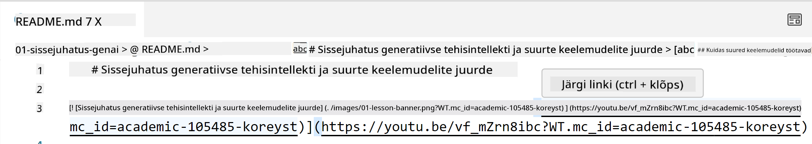
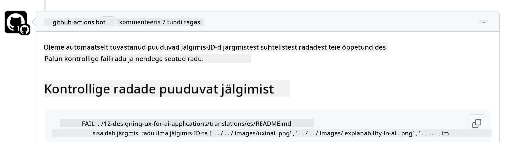
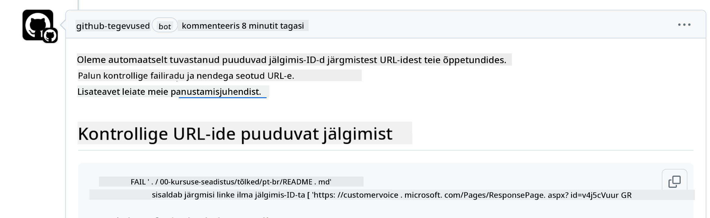

<!--
CO_OP_TRANSLATOR_METADATA:
{
  "original_hash": "57c41f2af71001a2cff9d8eb797cb843",
  "translation_date": "2025-10-11T11:10:25+00:00",
  "source_file": "CONTRIBUTING.md",
  "language_code": "et"
}
-->
# Kaastöö

See projekt ootab kaastööd ja ettepanekuid. Enamik kaastöid nõuab, et nõustuksite Kaastöö Litsentsilepinguga (CLA), mis kinnitab, et teil on õigus anda meile õigused teie panuse kasutamiseks. Lisateabe saamiseks külastage <https://cla.microsoft.com>.

> Tähtis: selle repo teksti tõlkimisel veenduge, et te ei kasutaks masintõlget. Me kontrollime tõlkeid kogukonna kaudu, seega palun tehke tõlkeid ainult keeltes, milles olete vilunud.

Kui esitate pull request'i, määrab CLA-bot automaatselt, kas peate CLA esitama, ja lisab PR-le vastavad märgised (nt silt, kommentaar). Järgige lihtsalt boti antud juhiseid. Seda peate tegema ainult üks kord kõigi meie CLA-d kasutavate repositooriumide puhul.

## Käitumisjuhend

See projekt on omaks võtnud [Microsofti avatud lähtekoodiga käitumisjuhendi](https://opensource.microsoft.com/codeofconduct/?WT.mc_id=academic-105485-koreyst). Lisateabe saamiseks lugege [käitumisjuhendi KKK-d](https://opensource.microsoft.com/codeofconduct/faq/?WT.mc_id=academic-105485-koreyst) või võtke ühendust [opencode@microsoft.com](mailto:opencode@microsoft.com), kui teil on täiendavaid küsimusi või kommentaare.

## Küsimus või probleem?

Palun ärge avage GitHubi probleeme üldiste tugiküsimuste jaoks, kuna GitHubi loendit tuleks kasutada funktsioonisoovide ja veateadete jaoks. Nii saame hõlpsamini jälgida tegelikke probleeme või vigu koodis ja hoida üldise arutelu eraldi tegelikust koodist.

## Tippvead, probleemid, vead ja kaastööd

Kui esitate muudatusi Generative AI for Beginners repositooriumis, järgige palun neid soovitusi.

* Alati forkige repositoorium oma kontole enne muudatuste tegemist
* Ärge kombineerige mitut muudatust ühte pull request'i. Näiteks esitage veaparandused ja dokumentatsiooni uuendused eraldi PR-ides
* Kui teie pull request'il on ühinemiskonflikte, veenduge, et uuendate oma kohalikku main haru, et see peegeldaks peamise repositooriumi sisu enne muudatuste tegemist
* Kui esitate tõlke, looge üks PR kõigi tõlgitud failide jaoks, kuna me ei aktsepteeri osalisi tõlkeid sisule
* Kui esitate tippvea või dokumentatsiooni paranduse, võite sobivuse korral kombineerida muudatused ühte PR-i

## Üldised juhised kirjutamiseks

- Veenduge, et kõik teie URL-id oleksid ruuduklambrite sees, millele järgneb sulg ilma lisaruumideta nende ümber või sees ``.
- Veenduge, et kõik suhtelised lingid (st lingid teistele failidele ja kaustadele repositooriumis) algaksid `./`, viidates failile või kaustale praeguses töökataloogis, või `../`, viidates failile või kaustale vanemast töökataloogist.
- Veenduge, et kõik suhtelised lingid (st lingid teistele failidele ja kaustadele repositooriumis) sisaldaksid jälgimis-ID-d (st `?` või `&` ja seejärel `wt.mc_id=` või `WT.mc_id=`) nende lõpus.
- Veenduge, et kõik URL-id järgmistest domeenidest _github.com, microsoft.com, visualstudio.com, aka.ms ja azure.com_ sisaldaksid jälgimis-ID-d (st `?` või `&` ja seejärel `wt.mc_id=` või `WT.mc_id=`) nende lõpus.
- Veenduge, et teie lingid ei sisaldaks riigispetsiifilist lokaliseerimist (st `/en-us/` või `/en/`).
- Veenduge, et kõik pildid oleksid salvestatud kausta `./images`.
- Veenduge, et piltidel oleksid kirjeldavad nimed, kasutades ingliskeelseid tähti, numbreid ja kriipse pildi nimes.

## GitHubi töövood

Kui esitate pull request'i, käivitatakse neli erinevat töövoogu, et kontrollida eelnevaid reegleid.
Järgige lihtsalt siin loetletud juhiseid, et töövoo kontrollid läbida.

- [Kontrolli katkiseid suhtelisi teid](../..)
- [Kontrolli, et teedel oleks jälgimine](../..)
- [Kontrolli, et URL-idel oleks jälgimine](../..)
- [Kontrolli, et URL-idel ei oleks lokaliseerimist](../..)

### Kontrolli katkiseid suhtelisi teid

See töövoog tagab, et kõik suhtelised teed teie failides töötavad.
See repositoorium on juurutatud GitHubi lehtedele, seega peate olema väga ettevaatlik, et lingid ei suunaks kedagi valesse kohta.

Veendumaks, et teie lingid töötavad korralikult, kasutage lihtsalt VS Code'i, et kontrollida seda.

Näiteks, kui hõljutate kursorit mõne lingi kohal oma failides, kuvatakse teile võimalus lingile järgida, vajutades **ctrl + klõps**

Kui klõpsate lingil ja see ei tööta kohapeal, siis kindlasti käivitab see töövoo ja ei tööta GitHubis.

Selle probleemi lahendamiseks proovige linki sisestada VS Code'i abiga.

Kui sisestate `./` või `../`, kuvab VS Code teile valikud vastavalt sellele, mida sisestasite.

Järgige teed, klõpsates soovitud failil või kaustal, ja veenduge, et teie tee ei oleks katki.

Kui lisate õige suhtelise tee, salvestate ja lükkate oma muudatused üles, käivitatakse töövoog uuesti, et teie muudatusi kontrollida.
Kui läbite kontrolli, olete valmis.

### Kontrolli, et teedel oleks jälgimine

See töövoog tagab, et kõik suhtelised teed sisaldavad jälgimist.
See repositoorium on juurutatud GitHubi lehtedele, seega peame jälgima liikumist erinevate failide ja kaustade vahel.

Veendumaks, et teie suhtelised teed sisaldavad jälgimist, kontrollige lihtsalt, kas nende lõpus on tekst `?wt.mc_id=`.
Kui see on lisatud teie suhtelistele teedele, siis läbite selle kontrolli.

Kui ei, võite saada järgmise vea.

Selle probleemi lahendamiseks proovige avada failitee, mille töövoog esile tõi, ja lisage suhteliste teede lõppu jälgimis-ID.

Kui lisate jälgimis-ID, salvestate ja lükkate oma muudatused üles, käivitatakse töövoog uuesti, et teie muudatusi kontrollida.
Kui läbite kontrolli, olete valmis.

### Kontrolli, et URL-idel oleks jälgimine

See töövoog tagab, et kõik veebiaadressid sisaldavad jälgimist.
See repositoorium on kõigile kättesaadav, seega peate veenduma, et jälgite juurdepääsu, et teada saada, kust liiklus pärineb.

Veendumaks, et teie URL-id sisaldavad jälgimist, kontrollige lihtsalt, kas nende lõpus on tekst `?wt.mc_id=`.
Kui see on lisatud teie URL-idele, siis läbite selle kontrolli.

Kui ei, võite saada järgmise vea.

Selle probleemi lahendamiseks proovige avada failitee, mille töövoog esile tõi, ja lisage URL-ide lõppu jälgimis-ID.

Kui lisate jälgimis-ID, salvestate ja lükkate oma muudatused üles, käivitatakse töövoog uuesti, et teie muudatusi kontrollida.
Kui läbite kontrolli, olete valmis.

### Kontrolli, et URL-idel ei oleks lokaliseerimist

See töövoog tagab, et kõik veebiaadressid ei sisalda riigispetsiifilist lokaliseerimist.
See repositoorium on kättesaadav kõigile üle maailma, seega peate veenduma, et URL-id ei sisaldaks teie riigi lokaliseerimist.

Veendumaks, et teie URL-id ei sisalda riigi lokaliseerimist, kontrollige lihtsalt, kas URL-is on tekst `/en-us/` või `/en/` või mõni muu keele lokaliseerimine.
Kui see ei ole teie URL-ides, siis läbite selle kontrolli.

Kui ei, võite saada järgmise vea.

Selle probleemi lahendamiseks proovige avada failitee, mille töövoog esile tõi, ja eemaldage URL-idelt riigi lokaliseerimine.

Kui eemaldate riigi lokaliseerimise, salvestate ja lükkate oma muudatused üles, käivitatakse töövoog uuesti, et teie muudatusi kontrollida.
Kui läbite kontrolli, olete valmis.

Palju õnne! Me võtame teiega esimesel võimalusel ühendust, et anda tagasisidet teie panuse kohta.

---

**Vastutusest loobumine**:  
See dokument on tõlgitud AI tõlketeenuse [Co-op Translator](https://github.com/Azure/co-op-translator) abil. Kuigi püüame tagada täpsust, palume arvestada, et automaatsed tõlked võivad sisaldada vigu või ebatäpsusi. Algne dokument selle algses keeles tuleks pidada autoriteetseks allikaks. Olulise teabe puhul soovitame kasutada professionaalset inimtõlget. Me ei vastuta arusaamatuste või valesti tõlgenduste eest, mis võivad tekkida selle tõlke kasutamise tõttu.